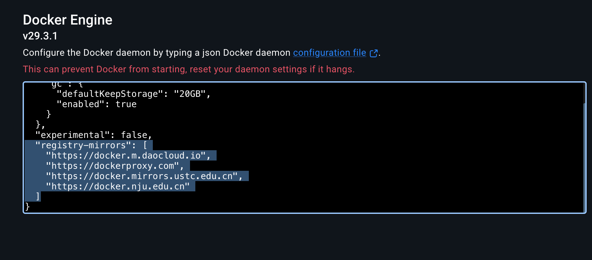
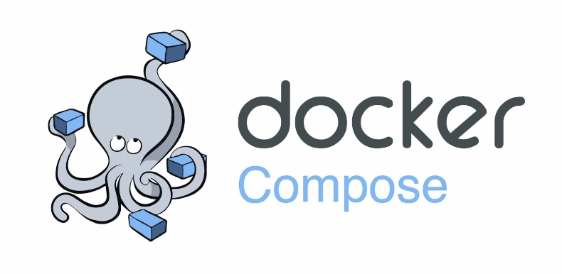

# Docker 教程

这篇笔记把我看视频时记下的要点，和公众号里的系统化内容，整理成了一篇从概念到实操都比较完整的 Docker 入门教程。目标不是把所有命令死记硬背，而是先建立一条清晰主线：

`镜像 -> 容器 -> 数据卷 -> 网络 -> Dockerfile -> Compose`

只要这条主线理顺了，后面的命令基本都能串起来。

## 1. Docker 是什么

Docker 是一种**容器化技术**。它可以把应用程序、依赖库、运行环境和配置一起打包，让应用在不同机器上都以尽量一致的方式运行。

Docker 想解决的核心问题是：

- 本地能跑，换台机器就跑不起来
- 部署过程复杂，环境经常配错
- 不同项目依赖冲突
- 手动安装软件、配置环境太繁琐

Docker 的思路是：把应用运行所需的一切，尽量放进一个独立的容器环境里。

### 1.1 为什么 Docker 很流行

Docker 常见的优点有：

- 轻量：容器共享宿主机内核，比虚拟机小很多，启动也更快
- 可移植：同一个镜像可以在不同机器上运行
- 隔离性：不同容器之间尽量互不干扰
- 标准化：构建、分发、运行都有统一命令和工具链

### 1.2 Docker 和虚拟机的区别

| 对比项 | Docker 容器 | 虚拟机 |
|---|---|---|
| 本质 | 共享宿主机内核的进程级隔离 | 模拟完整硬件并运行独立操作系统 |
| 启动速度 | 很快，通常秒级甚至更快 | 相对较慢 |
| 资源占用 | 较小 | 较大 |
| 隔离性 | 足够强，但通常弱于虚拟机 | 更强 |
| 适用场景 | 应用部署、开发测试、微服务 | 强隔离、多操作系统环境 |

一句话记忆：

- **虚拟机**更像“整台电脑里的另一台电脑”
- **Docker**更像“隔离出来的应用运行沙盒”

## 2. Docker 的核心概念

Docker 最重要的 6 个概念如下：

| 概念 | 含义 | 可以怎么理解 |
|---|---|---|
| 镜像（Image） | 创建容器的模板 | 类似“安装包”或“快照” |
| 容器（Container） | 镜像运行后的实例 | 类似“安装出来并正在运行的软件” |
| Dockerfile | 构建镜像的脚本 | 类似“自动化装机说明书” |
| 仓库（Registry） | 存放镜像的地方 | 类似“应用商店 / 镜像服务器” |
| 数据卷（Volume） | 持久化数据的方式 | 类似“外挂硬盘 / 数据目录” |
| 网络（Network） | 容器之间通信的方式 | 类似“局域网” |

理解 Docker 时，最容易混淆的是**镜像**和**容器**：

- 镜像是静态的，只读的模板
- 容器是动态的，运行中的实例

比如：

- `nginx` 镜像可以创建很多个容器
- 每个容器都有自己的运行状态、日志、网络配置

## 3. 安装与验证

因为我平时主要在 macOS / Windows 上使用 Docker，这里以 Docker Desktop 为主。

### 3.1 安装方式

- macOS：安装 Docker Desktop，或者用 Homebrew
- Windows：安装 Docker Desktop

macOS 常见安装命令：

```bash
brew install --cask docker
```

安装完成后，需要**手动启动 Docker Desktop**。只安装命令行还不够，后台服务必须真的运行起来。

### 3.2 验证是否安装成功

```bash
docker --version
docker info
```

更推荐第一次就跑一下官方测试镜像：

```bash
docker run hello-world
```

如果能看到 Docker 输出的欢迎信息，说明 Docker 已经安装并运行正常。

### 3.3 架构差异补充

在 macOS 上，我会经常遇到镜像架构问题。因为现在很多 Mac 是 ARM64，但有些镜像默认是 AMD64。

这时可能会看到类似：

```bash
docker pull --platform linux/amd64 nginx
```

这条命令的意思是：强制拉取指定平台架构的镜像。

Docker Desktop 往往会借助 QEMU 去兼容不同架构，但并不是所有镜像都适合跨架构运行，所以：

- 能用原生 ARM64 镜像最好
- 不行再考虑 `--platform`

> QEMU 是一个开源的硬件虚拟化/模拟器。在 Docker Desktop 里，当你用 `--platform linux/amd64` 拉一个 x86 镜像到 ARM Mac 上时，Docker 会通过 QEMU 在后台**模拟一个 x86 CPU**来运行那个容器。代价是性能会明显下降（通常比原生架构慢几倍），所以官方建议优先用原生架构镜像。

### 3.4 国内镜像源
由于担心镜像源在海外访问缓慢，对于docker desktop来说，我们可以在这里配置一下国内源：


## 4. 镜像：Docker 的起点

镜像是创建容器的模板。几乎所有 Docker 操作，都是围绕镜像开始的。

### 4.1 镜像名怎么读

下面这条命令：

```bash
docker pull docker.io/library/nginx:latest
```

可以拆成三部分：

- `docker.io`：仓库注册表地址（registry）
- `library/nginx`：镜像仓库（repository）
- `latest`：标签（tag）

大多数情况下都可以简写成：

```bash
docker pull nginx
```

因为官方仓库和 `latest` 标签都可以省略。

### 4.2 常用镜像命令

```bash
docker pull nginx
docker pull nginx:1.27
docker images
docker search mysql
docker inspect nginx
docker history nginx
docker tag nginx:latest my-nginx:v1
docker rmi nginx
docker save -o nginx.tar nginx:latest
docker load -i nginx.tar
docker login
docker push your_username/my-image:1.0
```

### 4.3 镜像命令怎么理解

| 命令 | 作用 |
|---|---|
| `docker pull` | 拉取镜像 |
| `docker images` | 查看本地镜像 |
| `docker search` | 搜索公共镜像 |
| `docker inspect` | 查看镜像详细信息 |
| `docker history` | 查看镜像分层历史 |
| `docker tag` | 给镜像打新标签 |
| `docker rmi` | 删除镜像 |
| `docker save / load` | 导出 / 导入镜像 |
| `docker login / push` | 登录并推送镜像到仓库 |

### 4.4 镜像修改的本质

如果只是临时修改容器里的文件，那只是改了**容器**，不是改了**镜像**。

真正推荐的“修改镜像”方式是：

1. 写 Dockerfile
2. 用 `docker build` 重新构建镜像


## 5. 容器：镜像运行之后的实例

镜像只是模板，真正运行起来的是容器。

### 5.1 `docker run` 是最核心的命令

```bash
docker run -d -p 80:80 --name nginx-container nginx
```

这条命令做了几件事：

- 如果本地没有 `nginx` 镜像，会先自动拉取
- 基于镜像创建容器
- 把容器放到后台运行
- 把容器的 80 端口映射到宿主机的 80 端口
- 给容器起名叫 `nginx-container`

### 5.2 `docker run` 常用参数

| 参数 | 作用 |
|---|---|
| `-d` | 后台运行 |
| `-p 宿主机端口:容器端口` | 端口映射 |
| `--name` | 给容器起名字 |
| `-it` | 交互式进入容器 |
| `-v` | 挂载目录或卷 |
| `--rm` | 容器停止后自动删除 |
| `-e` | 传环境变量 |
| `--network` | 指定网络 |
| `--restart always` | 自动重启策略 |
| `-u` | 指定用户运行 |

### 5.3 常用容器命令

```bash
docker run -d -p 80:80 nginx
docker run -d --name my_container -p 8080:8080 tomcat:latest
docker run -it --rm ubuntu /bin/bash
docker run -d --restart always nginx

docker ps
docker ps -a
docker ps -l
docker ps -q
docker ps -aq

docker stop nginx-container
docker start nginx-container
docker create nginx
docker rm nginx-container
docker rm -f nginx-container

docker logs nginx-container
docker logs -f nginx-container
docker stats
docker inspect nginx-container
docker exec -it nginx-container /bin/bash
```

### 5.4 这些命令最容易混淆的点

#### `run`、`create`、`start`

- `docker run`：创建并启动
- `docker create`：只创建，不启动
- `docker start`：启动一个已经存在但停止了的容器

所以如果你反复执行 `docker run`，就会不断创建新容器；而不是“重启旧容器”。

#### `ps` 和 `ps -a`

- `docker ps`：只看正在运行的容器
- `docker ps -a`：看所有容器，包括退出的

#### `logs` 和 `exec`

- `docker logs`：看容器输出日志
- `docker exec`：进入容器内部执行命令

### 5.5 进入容器内部

最常用的是：

```bash
docker exec -it nginx-container /bin/bash
```

如果镜像比较轻量（例如 Alpine），里面可能没有 `bash`，要改成：

```bash
docker exec -it nginx-container /bin/sh
```

## 6. 数据持久化：Bind Mount 和 Volume

容器有一个很重要的特点：**容器删了，容器里的数据可能也就没了**。

所以数据库、上传文件、缓存目录等，通常都不能只存在容器内部，而需要挂载到外部。

### 6.1 Bind Mount：绑定宿主机目录

```bash
docker run -v /宿主机路径:/容器路径 nginx
```

例如：

```bash
docker run -d -p 80:80 -v /Users/owen/site:/usr/share/nginx/html nginx
```

特点：

- 宿主机路径可见、好找
- 修改宿主机文件，容器里会同步
- 很适合开发环境

### 6.2 Volume：命名卷

```bash
docker volume create mydata
docker run -d -v mydata:/data nginx
docker volume inspect mydata
docker volume ls
docker volume rm mydata
docker volume prune -a
```

特点：

- 路径由 Docker 管理
- 更适合持久化数据
- 不依赖我手动维护某个宿主机目录

### 6.3 Bind Mount 和 Volume 的区别

| 类型 | 写法 | 适合场景 |
|---|---|---|
| Bind Mount | `-v 宿主机路径:容器路径` | 开发环境、直接编辑文件 |
| Volume | `-v 卷名:容器路径` | 持久化数据、数据库 |

## 7. Dockerfile：如何制作自己的镜像

Dockerfile 可以理解成“制作镜像的图纸”。

你不需要手工进入容器修改环境，而是把构建步骤写进 Dockerfile，让 Docker 自动构建镜像。

### 7.1 一个最小可运行示例

```dockerfile
FROM python:3.13-slim

WORKDIR /app

COPY . .

RUN pip install -r requirements.txt

# 这是一个暴露容器端口的提示，不会自动映射端口
EXPOSE 8000

# CMD 只能有一个最终生效的定义
CMD ["python3", "main.py"]
```

构建命令：

```bash
docker build -t my-python-app:1.0 .
```

运行命令：

```bash
docker run -d -p 8000:8000 my-python-app:1.0
```

### 7.2 Dockerfile 常用指令

| 指令 | 作用 |
|---|---|
| `FROM` | 指定基础镜像 |
| `WORKDIR` | 指定工作目录 |
| `COPY` | 复制文件到镜像中 |
| `RUN` | 构建镜像时执行命令 |
| `ENV` | 设置环境变量 |
| `EXPOSE` | 声明容器监听端口 |
| `CMD` | 指定容器启动默认命令 |
| `ENTRYPOINT` | 指定容器主命令 |

### 7.3 `CMD` 和 `ENTRYPOINT` 的区别

- `CMD`：默认命令，容易被 `docker run` 后面的命令覆盖
- `ENTRYPOINT`：主命令，通常不会被简单覆盖

入门阶段先记住：

- 大多数场景先会用 `CMD`
- 需要更强约束时再考虑 `ENTRYPOINT`

## 8. Docker 网络

Docker 网络的作用是让容器之间可以互相通信，同时和宿主机网络进行隔离。

### 8.1 常见网络模式

| 模式 | 含义 |
|---|---|
| bridge | 默认桥接模式，最常见 |
| host | 容器直接使用宿主机网络 |
| none | 不分配网络 |

### 8.2 常用网络命令

```bash
docker network ls
docker network create network1
docker network rm network1
docker run -d --network host nginx
```

### 8.3 为什么自定义网络很重要

默认情况下，容器在 bridge 网络中可以通过 IP 通信。但如果你自己创建一个网络，例如：

```bash
docker network create network1
```

然后让多个容器都加入这个网络，它们就可以**通过容器名互相访问**，这比记 IP 更方便。

这点在数据库容器 + Web 容器配合时非常重要。

## 9. Docker Compose：管理多个容器

如果一个应用只需要一个容器，那么 `docker run` 就够了。

但一旦项目里有多个容器，例如：

- `web`
- `db`
- `redis`

你就会发现手写一长串 `docker run` 特别麻烦。这时就轮到 Docker Compose 出场了。

### 9.1 Compose 是什么

Docker Compose 是一种**多容器编排工具**。  
它用一个 YAML 文件把多个容器的配置写在一起，然后一条命令统一启动。

一句话：

- `docker run` 管单个容器
- `docker compose` 管一组相关容器


### 9.2 Compose 和 `docker run` 的区别

| 对比项 | `docker run` | `docker compose up` |
|---|---|---|
| 管理对象 | 单个容器 | 一组服务 |
| 配置方式 | 命令行参数 | `docker-compose.yml` / `compose.yaml` |
| 适合场景 | 临时测试、单容器运行 | 多容器项目、开发环境 |
| 可维护性 | 命令长了后难维护 | 配置集中，易于团队协作 |

### 9.3 从两条 `docker run` 到一个 Compose 文件

下面这组命令用于启动 MongoDB 和 Mongo Express：

```bash
docker network create network1

docker run -d \
  --name my_mongodb \
  -e MONGO_INITDB_ROOT_USERNAME=name \
  -e MONGO_INITDB_ROOT_PASSWORD=pass \
  -v /my/datadir:/data/db \
  --network network1 \
  mongo

docker run -d \
  --name my_mongodb_express \
  -p 8081:8081 \
  -e ME_CONFIG_MONGODB_SERVER=my_mongodb \
  -e ME_CONFIG_MONGODB_ADMINUSERNAME=name \
  -e ME_CONFIG_MONGODB_ADMINPASSWORD=pass \
  --network network1 \
  mongo-express
```

等价的 Compose 文件可以写成：

```yaml
services:
  my_mongodb:
    image: mongo
    environment:
      MONGO_INITDB_ROOT_USERNAME: name
      MONGO_INITDB_ROOT_PASSWORD: pass
    volumes:
      - /my/datadir:/data/db

  my_mongodb_express:
    image: mongo-express
    ports:
      - "8081:8081"
    environment:
      ME_CONFIG_MONGODB_SERVER: my_mongodb
      ME_CONFIG_MONGODB_ADMINUSERNAME: name
      ME_CONFIG_MONGODB_ADMINPASSWORD: pass
    depends_on:
      - my_mongodb
```

这里有两个很重要的点：

- Compose 会自动为项目创建默认网络，所以通常不用手动 `docker network create`
- 同一个 Compose 项目里的服务，默认可以通过**服务名**互相访问


### 9.4 Compose 常用命令

```bash
docker compose up -d
docker compose down
docker compose stop
docker compose start
docker compose ps
docker compose logs
docker compose logs -f
docker compose exec web sh
docker compose -f 路径/compose.yaml up -d
```

### 9.5 这些 Compose 命令怎么理解

| 命令 | 作用 |
|---|---|
| `docker compose up -d` | 后台启动所有服务 |
| `docker compose down` | 停止并删除服务相关容器和网络 |
| `docker compose stop` | 只停止，不删除 |
| `docker compose start` | 启动已存在的服务 |
| `docker compose ps` | 查看服务状态 |
| `docker compose logs -f` | 持续查看日志 |
| `docker compose exec` | 进入某个服务容器 |
| `docker compose -f 文件名 ...` | 指定 Compose 文件路径 |

### 9.6 Compose 适合什么场景

Compose 属于轻量级编排工具，适合：

- 个人开发
- 本地调试
- 单机部署
- 小规模项目

如果是企业级大规模集群编排，通常会进一步接触 Kubernetes。
