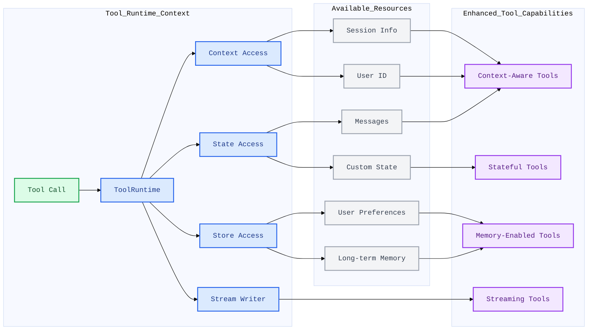

> 走到这一篇时，前面的模型和消息已经足够支撑“理解输入输出”；现在开始补上行动能力。Tools 是 LangChain 从“会说”走向“会做”的第一步。

## 1. 介绍
工具能够拓展智能体的能力 —— 让它们获取实时数据、执行代码、查询外部数据库，并在现实场景中采取行动。

在底层实现中，工具是具备明确定义输入与输出的可调用函数，这些函数会被传递给对话模型 。模型会根据对话上下文判断何时调用工具，以及提供哪些输入参数。

## 2. 创建工具
### (1) 基础工具定义
创建工具最简单的方式是使用`@tool`装饰器。默认情况下，函数的文档字符串会成为工具的描述，帮助模型理解何时使用该工具:
```python
from langchain.tools import tool

@tool
def search_database(query: str, limit: int = 10) -> str:
    """Search the customer database for records matching the query.

    Args:
        query: Search terms to look for
        limit: Maximum number of results to return
    """
    return f"Found {limit} results for '{query}'"
```

注意类型提示是必需的，因为它们定义了工具的输入架构。文档字符串应内容详实且简洁，以帮助模型理解工具的用途。

### (2) 自定义工具属性
我们可以给工具添加一个别名来Override，比如：
```python
@tool("web_search")  # Custom name
def search(query: str) -> str:
    """Search the web for information."""
    return f"Results for: {query}"

print(search.name)  # web_search
```

或者自定义工具的描述：
```python
@tool("calculator", description="Performs arithmetic calculations. Use this for any math problems.")
def calc(expression: str) -> str:
    """Evaluate mathematical expressions."""
    return str(eval(expression))
```

或者再高级一点，用schema定义，同样可以用pydantic、json schema等，这里用pydantic实例：
```python
from pydantic import BaseModel, Field
from typing import Literal

class WeatherInput(BaseModel):
    """Input for weather queries."""
    location: str = Field(description="City name or coordinates")
    units: Literal["celsius", "fahrenheit"] = Field(
        default="celsius",
        description="Temperature unit preference"
    )
    include_forecast: bool = Field(
        default=False,
        description="Include 5-day forecast"
    )

@tool(args_schema=WeatherInput)
def get_weather(location: str, units: str = "celsius", include_forecast: bool = False) -> str:
    """Get current weather and optional forecast."""
    temp = 22 if units == "celsius" else 72
    result = f"Current weather in {location}: {temp} degrees {units[0].upper()}"
    if include_forecast:
        result += "\nNext 5 days: Sunny"
    return result
```

不过注意有两个保留名称，不能用作工具参数，分别是config和runtime。config保留用于内部向工具传递RunnableConfig；runtime保留用于ToolRuntime参数（访问状态、上下文、存储）。

## 3. 访问上下文
当工具能够访问运行时信息（如对话历史、用户数据和持久化内存）时，其功能最为强大。本节将介绍如何在工具内部访问和更新这些信息。

工具可通过ToolRuntime参数访问运行时信息，该参数提供以下能力：

| 组件          | 描述                                                             | 用例                               |
| ------------- | ---------------------------------------------------------------- | ---------------------------------- |
| State         | 短期内存 —— 当前对话中存在的可变数据（消息、计数器、自定义字段） | 访问对话历史，追踪工具调用次数     |
| Context       | 调用时传入的不可变配置（用户 ID、会话信息）                      | 根据用户身份个性化响应内容         |
| Store         | 长期内存 —— 跨对话持久保存的数据                                 | 保存用户偏好设置，维护知识库       |
| Stream Writer | 在工具执行过程中发送实时更新                                     | 展示耗时操作的执行进度             |
| Config        | 执行所用的 RunnableConfig                                        | 访问回调函数、标签和元数据         |
| Tool Call ID  | 当前工具调用的唯一标识符                                         | 关联日志与模型调用中的工具调用记录 |




这张图说明了 `ToolRuntime` 在 LangChain 工具体系中的位置。

一次工具调用发生时，工具拿到的不只是普通参数，还可以通过 `ToolRuntime` 访问运行时环境中的多种资源，包括当前会话状态（State）、调用上下文（Context）、长期存储（Store）以及流式输出能力（Stream Writer）。

正因为工具可以访问这些额外信息，所以它不再只是一个简单函数，而可以演变为：
- 能感知用户和会话信息的上下文工具；
- 能依赖当前对话状态工作的有状态工具；
- 能结合长期记忆的记忆增强工具；
- 能边执行边输出进度的流式工具。

换句话说，`ToolRuntime` 让工具从“静态函数”升级成了“运行时感知组件”。

### (1) State Access (短时记忆)
Tools可通过`runtime.state`访问当前对话状态：
```python
from langchain.tools import tool, ToolRuntime
from langchain.messages import HumanMessage

@tool
def get_last_user_message(runtime: ToolRuntime) -> str:
    """Get the most recent message from the user."""
    messages = runtime.state["messages"]

    # Find the last human message
    for message in reversed(messages):
        if isinstance(message, HumanMessage):
            return message.content

    return "No user messages found"

# Access custom state fields
@tool
def get_user_preference(
    pref_name: str,
    runtime: ToolRuntime
) -> str:
    """Get a user preference value."""
    preferences = runtime.state.get("user_preferences", {})
    return preferences.get(pref_name, "Not set")
```

不仅如此，还可以用Command更新智能体的状态：
```python
from langgraph.types import Command
from langchain.tools import tool

@tool
def set_user_name(new_name: str) -> Command:
    """Set the user's name in the conversation state."""
    return Command(update={"user_name": new_name})
```

### (2) Context Access
上下文提供在调用时传递的不可变配置数据，可用于用户ID、会话详情或对话过程中不应更改的应用特定设置。通过`runtime.context`访问上下文：
```python
from dataclasses import dataclass
from langchain_openai import ChatOpenAI
from langchain.agents import create_agent
from langchain.tools import tool, ToolRuntime


USER_DATABASE = {
    "user123": {
        "name": "Alice Johnson",
        "account_type": "Premium",
        "balance": 5000,
        "email": "alice@example.com"
    },
    "user456": {
        "name": "Bob Smith",
        "account_type": "Standard",
        "balance": 1200,
        "email": "bob@example.com"
    }
}

@dataclass
class UserContext:
    user_id: str

@tool
def get_account_info(runtime: ToolRuntime[UserContext]) -> str:
    """Get the current user's account information."""
    user_id = runtime.context.user_id

    if user_id in USER_DATABASE:
        user = USER_DATABASE[user_id]
        return f"Account holder: {user['name']}\nType: {user['account_type']}\nBalance: ${user['balance']}"
    return "User not found"

model = ChatOpenAI(model="gpt-4.1")
agent = create_agent(
    model,
    tools=[get_account_info],
    context_schema=UserContext,
    system_prompt="You are a financial assistant."
)

result = agent.invoke(
    {"messages": [{"role": "user", "content": "What's my current balance?"}]},
    context=UserContext(user_id="user123")
)
```

### (3) Store Access (长时记忆)
BaseStore提供可跨对话持久保存的存储功能。与状态（短期记忆）不同，存储中保存的数据在后续会话中依然可用。

通过runtime.store访问存储。存储采用命名空间或者key的模式来组织数据。

```python
from typing import Any
from langgraph.store.memory import InMemoryStore
from langchain.agents import create_agent
from langchain.tools import tool, ToolRuntime
from langchain_openai import ChatOpenAI

# Access memory
@tool
def get_user_info(user_id: str, runtime: ToolRuntime) -> str:
    """Look up user info."""
    store = runtime.store
    user_info = store.get(("users",), user_id)
    return str(user_info.value) if user_info else "Unknown user"

# Update memory
@tool
def save_user_info(user_id: str, user_info: dict[str, Any], runtime: ToolRuntime) -> str:
    """Save user info."""
    store = runtime.store
    store.put(("users",), user_id, user_info)
    return "Successfully saved user info."

model = ChatOpenAI(model="gpt-4.1")

store = InMemoryStore()
agent = create_agent(
    model,
    tools=[get_user_info, save_user_info],
    store=store
)

# First session: save user info
agent.invoke({
    "messages": [{"role": "user", "content": "Save the following user: userid: abc123, name: Foo, age: 25, email: foo@langchain.dev"}]
})

# Second session: get user info
agent.invoke({
    "messages": [{"role": "user", "content": "Get user info for user with id 'abc123'"}]
})
# Here is the user info for user with ID "abc123":
# - Name: Foo
# - Age: 25
# - Email: foo@langchain.dev
```

### (4) Stream Writer

在执行过程中流式传输来自工具的实时更新。这对于在长时间运行的操作期间向用户提供进度反馈非常有用。

使用runtime.stream_writer来发送自定义更新：
```python
from langchain.tools import tool, ToolRuntime

@tool
def get_weather(city: str, runtime: ToolRuntime) -> str:
    """Get weather for a given city."""
    writer = runtime.stream_writer

    # Stream custom updates as the tool executes
    writer(f"Looking up data for city: {city}")
    writer(f"Acquired data for city: {city}")

    return f"It's always sunny in {city}!"
```

## 4. ToolNode
ToolNode是一个预构建节点，用于在 LangGraph 工作流中执行工具。它会自动处理工具并行执行、错误处理和状态注入。这一块应该会在LangGraph中应用比较多。

这个部分主要是用于精细控制工具执行模式的自定义工作流，不然可以直接使用create_agent。换句话说，它是支撑智能体工具执行的基础组件。

由于这部分主要是LangGraph的内容，所以我将暂时跳过。

## 5. Prebuilt tools
LangChain 提供了大量适用于网络搜索、代码解析、数据库访问等常见任务的预制工具与工具包。这些开箱即用的工具可直接集成到你的Agent中，无需编写自定义代码。详见[这里](https://docs.langchain.com/oss/python/integrations/tools)。

## 6. Server-side tool use
部分聊天模型具备由模型提供商在服务器端运行的内置工具。这些工具包括网络搜索、代码解释器等功能，你无需自行定义或托管工具逻辑。详见[这里](https://docs.langchain.com/oss/python/integrations/providers/overview)和这里[这里](https://docs.langchain.com/oss/python/langchain/models#server-side-tool-use)。
