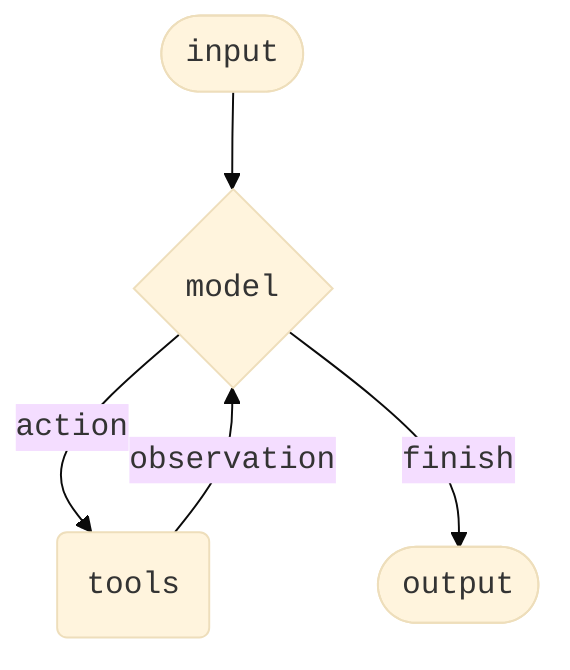

> 这篇我刻意放到最后。不是因为 Agents 不重要，而是因为它恰恰太重要、也太综合了。如果不先看底层组件，读 Agent 章节时很容易一直遇到“前面没学过但这里先用了”的跳跃感。

## 1. 介绍
Agent结合语言模型和工具，创建可以推理任务、决定使用哪些工具并逐步朝着解决方案工作的系统。[create_agent](https://reference.langchain.com/python/langchain/agents/factory/create_agent) 提供了一个生产就绪的Agent实现。LLM 代理在循环中运行工具以实现目标。代理运行直到满足停止条件，即当模型发出最终输出或达到迭代限制时。



如上图，换句话说，create_agent 使用 LangGraph 构建基于图的Agent运行时。一个图由节点（步骤）和边（连接）组成，定义了Agent如何处理信息。代理通过这个图移动，执行节点，例如模型节点（调用模型）、工具节点（执行工具）或中间件。

## 2. 模型 (Model)
模型是Agent的大脑、推理引擎。有多种方式可以指定。

### (1) 静态模型
我们通过传入能被识别的模型字符串，可以直接定义静态模型。字符串映射的完整列表可以看[这里](https://reference.langchain.com/python/langchain/chat_models/base/init_chat_model)，里面有详细的关于model、provider等等的参数映射，用不同模型的时候可以找这里。
```python
from langchain.agents import create_agent

agent = create_agent("openai:gpt-5", tools=tools)
```

如果要更好控制模型，就需要直接用provider的包，比如之前用过的ChatOpenAI，按照如下的方式：
```python
from langchain.agents import create_agent
from langchain_openai import ChatOpenAI

model = ChatOpenAI(
    model="gpt-5",
    temperature=0.1,
    max_tokens=1000,
    timeout=30
    # ... (other params)
)
agent = create_agent(model, tools=tools)
```

这里的参数完全由你控制，不同Provider提供的用法查询可以看[这里](https://docs.langchain.com/oss/python/integrations/providers/all_providers)。至于具体参数都怎么使用，可以看[这里](https://docs.langchain.com/oss/python/langchain/models#parameters)。

### (2) 动态模型
使用`@wrap_model_call`创建中间件，就可以在运行时根据当前状态或上下文进行选择。官网的例子如下，实现了一个简单的根据信息长度筛选模型：
```python
from langchain_openai import ChatOpenAI
from langchain.agents import create_agent
from langchain.agents.middleware import wrap_model_call, ModelRequest, ModelResponse


basic_model = ChatOpenAI(model="gpt-4.1-mini")
advanced_model = ChatOpenAI(model="gpt-4.1")

@wrap_model_call
def dynamic_model_selection(request: ModelRequest, handler) -> ModelResponse:
    """Choose model based on conversation complexity."""
    message_count = len(request.state["messages"])

    if message_count > 10:
        # Use an advanced model for longer conversations
        model = advanced_model
    else:
        model = basic_model

    return handler(request.override(model=model))

agent = create_agent(
    model=basic_model,  # Default model
    tools=tools,
    middleware=[dynamic_model_selection]
)
```

使用结构化输出的时候，不支持预绑定模型。

我们来细看一下代码，这个中间件函数会在模型被真正调用之前，先拿到请求看看，需不需要进行某些程度上的更改，改完之后再交给下一个处理者继续进行。要用的东西，我们都是用`from langchain.agents.middleware import wrap_model_call`来导入。比如`ModelRequest`类，是一个模型请求类，我们用`request`这个实例来拿到模型请求对象，这里包含了很多与模型调用有关的信息，比如:
- request.state：当前 agent 的状态
- request.tools：当前可用工具列表
- request.model：当前要用的模型
- request.messages：当前消息历史

handler则只是一个“可调用对象”，可以先当做这样一个普通函数理解:
```python
def handler(request: ModelRequest) -> ModelResponse:
    ...
```

上述例子，我们修改完model之后，用`override`重写model，返回`handler`之后的结果。所以过程其实是这样的：
- 先看当前请求
- 按条件修改 request，比如切换 model
- 再调用 handler，把修改后的 request 继续传下去
- 拿到最终响应并返回

因此，我们在agent创建的时候，将中间件函数写进中间件中即可，如`middleware=[dynamic_model_selection]`。

## 3. 工具 (Tool)
工具赋予Agent“take action”的能力。Agent超越了简单的仅模型工具绑定，通过促进：
- 多次工具调用的顺序（由单个提示触发）
- 在适当的情况下并行工具调用
- 根据之前的结果动态选择工具
- 工具重试逻辑和错误处理
- 工具调用之间的状态持久性等能力

可以在这里看到[工具](https://docs.langchain.com/oss/python/langchain/tools)的详细信息，不过之后也会学习的。

### (1) 静态工具
在创建agent时构建，整个执行过程中保持不变的工具，这是最常见和最直接的方法。官网示例如下（没错还是假天气工具）：
```python
from langchain.tools import tool
from langchain.agents import create_agent


@tool
def search(query: str) -> str:
    """Search for information."""
    return f"Results for: {query}"

@tool
def get_weather(location: str) -> str:
    """Get weather information for a location."""
    return f"Weather in {location}: Sunny, 72°F"

agent = create_agent(model, tools=[search, get_weather])
```

如果提供的是空工具列表的话，代理就会由一个没有调用工具能力的单一LLM节点组成。

### (2) 动态工具
工具过多会使模型过载上下文并添加错误的可能，而过少又会限制能力，因此我们需要动态工具。动态工具选择使可用工具集能够根据身份验证状态、用户权限、功能标志或对话阶段进行调整。依然使用`@wrap_model_call`。

根据工具是否已知，可以采用两种方法。

第一种方法，Filtering pre-registered tools。我们通过将预先的规则写进中间件函数里，达到动态调整工具的效果。又可细分为三个方面，一个是从request的state（`request.state`）来限制、一个是按照存储内容中的用户偏好或者功能标记来筛选（`request.runtime.store`）、还有通过运行时候的上下文（`requset.runtime.context...`）进行筛选。这里不展开，后面学到runtime会细聊。

比如我们可以举一个state的例子，具体依靠两个条件：用户是否认证`is_authenticated`和对话消息数是否达标`message_count`。
```python
from langchain.agents import create_agent
from langchain.agents.middleware import wrap_model_call, ModelRequest, ModelResponse
from typing import Callable

@wrap_model_call
def state_based_tools(
    request: ModelRequest,
    handler: Callable[[ModelRequest], ModelResponse]
) -> ModelResponse:
    """Filter tools based on conversation State."""
    # Read from State: check if user has authenticated
    state = request.state
    is_authenticated = state.get("authenticated", False)
    message_count = len(state["messages"])

    # Only enable sensitive tools after authentication
    if not is_authenticated:
        tools = [t for t in request.tools if t.name.startswith("public_")]
        request = request.override(tools=tools)
    elif message_count < 5:
        # Limit tools early in conversation
        tools = [t for t in request.tools if t.name != "advanced_search"]
        request = request.override(tools=tools)

    return handler(request)

agent = create_agent(
    model="gpt-4.1",
    tools=[public_search, private_search, advanced_search],
    middleware=[state_based_tools]
)
```

这里中间件写的看上去比动态agent更唬人，实际上只是类型标注更详细了，不过也好，能更深刻理解。这里多引入了`typing`包里面的`Callable`，如果你python和我一样稀烂可能还不了解，我临时学了下。可以使用`Callable`来指定参数和返回值的类型。`Callable[[Arg1Type, Arg2Type, ...], ReturnType]`表示一个接受特定参数类型并返回特定类型值的可调用对象。比如这里，`Callable[[ModelRequest], ModelResponse]`，表示接受`ModelRequest`并返回`ModelResponse`的可调用对象（也就是可以像函数一样直接加个`()`来执行的对象，包括普通函数、类（调用类就是创建实例）、实现了`__call__()`的对象）。弄个简单的例子：
```python
from typing import Callable
 
# 定义一个接受两个整数并返回一个整数的可调用对象
def add(a: int, b: int) -> int:
    return a + b
 
def my_function(callback: Callable[[int, int], int]) -> None:
    result = callback(1, 2)
    print(result)
 
my_function(add)  # 输出: 3
```

意思是，这里是一个可调用对象`Callable[[int, int], int]`，也就是一个接受两个整数、返回一个整数的可调用对象。然后我们普通函数`def add(a: int, b: int) -> int`显然满足这个条件，我们可以传入。

回到这里，写`Callable[[ModelRequest], ModelResponse]`，实际上就是为了给`handler`写类型标注，表示它是一个接收`ModelRequest`、输出`ModelResponse`的可调用对象。这也是中间件里“把请求继续交给下一个处理者”的关键。也就是说，这里和动态model是一样的，只不过写得更加详细一点。

我们继续，刚才说了第一种情况是Filtering pre-registered tools，现在我们来介绍第二种情况，即Runtime tool registration。

当工具在运行时被发现或者创建时（比如MCP服务器加载、基于用户数据生产、或者远程注册表获得），需要既注册这些工具，又动态处理它们的执行。所以这里有两个中间件钩子来使用，一个是`wrap_model_call`，老朋友，可以用这个在模型推理前将工具动态添加到requset；另外还有一个`wrap_tool_call`，负责在真正执行工具时把工具名映射到实际的工具函数。

示例如下：
```python
from langchain.tools import tool
from langchain.agents import create_agent
from langchain.agents.middleware import AgentMiddleware, ModelRequest, ToolCallRequest

# A tool that will be added dynamically at runtime
@tool
def calculate_tip(bill_amount: float, tip_percentage: float = 20.0) -> str:
    """Calculate the tip amount for a bill."""
    tip = bill_amount * (tip_percentage / 100)
    return f"Tip: ${tip:.2f}, Total: ${bill_amount + tip:.2f}"

class DynamicToolMiddleware(AgentMiddleware):
    """Middleware that registers and handles dynamic tools."""

    def wrap_model_call(self, request: ModelRequest, handler):
        # Add dynamic tool to the request
        # This could be loaded from an MCP server, database, etc.
        updated = request.override(tools=[*request.tools, calculate_tip])
        return handler(updated)

    def wrap_tool_call(self, request: ToolCallRequest, handler):
        # Handle execution of the dynamic tool
        if request.tool_call["name"] == "calculate_tip":
            return handler(request.override(tool=calculate_tip))
        return handler(request)

agent = create_agent(
    model="gpt-4o",
    tools=[get_weather],  # Only static tools registered here
    middleware=[DynamicToolMiddleware()],
)

# The agent can now use both get_weather AND calculate_tip
result = agent.invoke({
    "messages": [{"role": "user", "content": "Calculate a 20% tip on $85"}]
})
```

读一下，啥意思呢，这段函数定义了一个找小费的函数，但是定义agent的时候没有传进去。但是，我们从中间件包里导入了`AgentMiddleware`，是插在agetn运行流程中的中间层基类，从而给Agent扩展了动态添加tool的能力。

我们继承这个基类后，自定义一个agent中间件类，常见用法就是重写这些方法：
```python
class MyMiddleware(AgentMiddleware):
    def before_model(self, state, runtime):
        ...

    def after_model(self, state, runtime):
        ...

    def wrap_model_call(self, request, handler):
        ...

    def wrap_tool_call(self, request, handler):
        ...
```
如何理解这几个函数，实际上，我们可以把agent运行流程分为如下的过程，并且只有4个插手的时机：
- before_model，调用模型前执行，拿到的是agent的状态state，适合检查消息、权限、标志位、更新状态、提起终止流程、决定是否跳转。
- wrap_model_call，把整个模型调用包起来，不仅能在前后做事，还能直接修改模型请求、决定是不是需要继续调用、改模型、改工具、改system prompt，功能非常强大，最后再调用handler(request)把流程传下去即可。
- 模型真正执行
- after_model，模型返回结果后执行，适合做记录日志、统计调用次数、读取生成内容、根据结果更新状态。
- 如果模型决定调工具：
- wrap_tool_call，把整个工具调用包起来，在工具真正执行前触发，可以用于拦截某些工具调用、修改工具调用请求、动态替换工具、给工具添加日志、权限校验、错误处理。
- 工具真正执行

然后，我们在创建agent的时候将这个类的实例创建传给create_agent即可，类似`middleware=[MyMiddleware()]`。

回到上例，我们实现了一个动态工具中间基类，在wrap_model_call环节重写tools，加入了新工具。然后wrap_tool_call动态处理调用名为"calculate_tip"时，将这次请求的工具调用改为calculate_tip。

为什么需要这两个过程？因为前者只是让模型选工具阶段知道有这么一个工具名，让它有机会吐出`{"name": "calculate_tip", ...}`这样的输出，而调用的时候需要一个实际可执行的工具，所以需要动态注册 —— 这次执行的Python工具就是calculate_tip对象，即`return handler(request.override(tool=calculate_tip))`，实现双hook动态注册。

顺带一提，钩子 = 框架提前留好的“插入点”或“扩展点”让你能在某个时机把自己的逻辑“挂进去”，是一种广泛约定的设计思想。

### (3) 工具调用错误处理
中间件确实牛逼，我们还可以用`@wrap_tool_call`这个钩子来自定义工具错误的处理方式。

比如下面的例子中，我们给钩子中写了一个try-catch，然后发成错误的时候，返回一个错误信息。
```python
from langchain.agents import create_agent
from langchain.agents.middleware import wrap_tool_call
from langchain.messages import ToolMessage


@wrap_tool_call
def handle_tool_errors(request, handler):
    """Handle tool execution errors with custom messages."""
    try:
        return handler(request)
    except Exception as e:
        # Return a custom error message to the model
        return ToolMessage(
            content=f"Tool error: Please check your input and try again. ({str(e)})",
            tool_call_id=request.tool_call["id"]
        )

agent = create_agent(
    model="gpt-4.1",
    tools=[search, get_weather],
    middleware=[handle_tool_errors]
)
```

这样的话，agent会返回一个[ToolMessage](https://reference.langchain.com/python/langchain-core/messages/tool/ToolMessage)，带有你刚才自己写的错误信息内容。

### (4) 在ReAct循环中使用工具

我们可以会看最开始介绍Agent的图片，实际上Agent是遵循一种ReAct (“Reasoning + Acting”)模式来工作的，具体而言就是在简要推理步骤与针对性工具调用之间交替，并将产生的观察结果反馈到后续决策中，直到能够给出最终答案。

模型什么时候回停止Loop，在create_agent中描述的很明确：模型产出最终回答或者达到迭代上限。一般是交给 agent 里的模型自己判断“现在能不能回答了”，去完成这样一个过程：
- 模型先看当前消息和工具结果
- 如果它觉得还需要外部信息，就发起tool_calls
- 工具执行完，结果回到上下文
- 模型再判断一次
- 如果它已经有足够信息，就直接给出最终答案，不再调用工具，这时循环结束

## 4. System Prompt

### (1) system_prompt

可以通过系统提示词，来定义agent如何处理任务。如果没有提供，agent将从消息中推断任务。

system_prompt接受str或者SystemMessage作为输入，使用SystemMessage能让你对提示词结构拥有更多控制权。比如下面的例子中，我们把整本书放进 system prompt，让 agent 以这本书为固定上下文来回答问题”的例子，而且它顺手演示了 Anthropic 的 prompt（Anthropic的提示缓存能力`cache_control: {"type": "ephemeral"}`，代表这样标记后，会缓存这个内容块，在重复请求时降低延迟和成本。

```python
from langchain.agents import create_agent
from langchain.messages import SystemMessage, HumanMessage

literary_agent = create_agent(
    model="anthropic:claude-sonnet-4-5",
    system_prompt=SystemMessage(
        content=[
            {
                "type": "text",
                "text": "You are an AI assistant tasked with analyzing literary works.",
            },
            {
                "type": "text",
                "text": "<the entire contents of 'Pride and Prejudice'>",
                "cache_control": {"type": "ephemeral"}
            }
        ]
    )
)

result = literary_agent.invoke(
    {"messages": [HumanMessage("Analyze the major themes in 'Pride and Prejudice'.")]}
)
```

### (2) 动态系统提示词

动态的实现方式跟前面其实也没什么区别，这次是使用`@dynamic_prompt`中间件，来更新system_prompt，用法举例如下，这是根据运行时上下文来决定system_message：

```python
from typing import TypedDict

from langchain.agents import create_agent
from langchain.agents.middleware import dynamic_prompt, ModelRequest


class Context(TypedDict):
    user_role: str

@dynamic_prompt
def user_role_prompt(request: ModelRequest) -> str:
    """Generate system prompt based on user role."""
    user_role = request.runtime.context.get("user_role", "user")
    base_prompt = "You are a helpful assistant."

    if user_role == "expert":
        return f"{base_prompt} Provide detailed technical responses."
    elif user_role == "beginner":
        return f"{base_prompt} Explain concepts simply and avoid jargon."

    return base_prompt

agent = create_agent(
    model="gpt-4.1",
    tools=[web_search],
    middleware=[user_role_prompt],
    context_schema=Context
)

# The system prompt will be set dynamically based on context
result = agent.invoke(
    {"messages": [{"role": "user", "content": "Explain machine learning"}]},
    context={"user_role": "expert"}
)
```

这里需要说明一下，你也可以直接在`@wrap_model_call`装饰器下修改，它更加通用。不过建议用`@dynamic_prompt`，语义清晰、代码直观，所以建议用这个。


## 5. Name

这是一个可选项，给agent起名，在多智能体系统中将该智能体作为子图添加时，此名称会用做节点标识符。（建议用snake_case命名，防止某些模型提供商不支持含空格或特殊字符的名称）。

## 6. Advanced concepts

### (1) Structured output
在某些情况下，你可能希望智能体以特定格式返回输出。LangChain 通过[response_format](https://reference.langchain.com/python/langchain/agents/factory/create_agent)参数提供了结构化输出的策略。

### (2) ToolStrategy

ToolStrategy利用人工工具调用生成结构化输出。这适用于任何支持工具调用的模型。当原生提供商的结构化输出（通过ProviderStrategy）不可用或不可靠时，应使用ToolStrategy。用法也很简单，直接调用的时候传入一个Pydantic的模型给`response_format`参数就行。

### (3) ProvideStrategy

ProviderStrategy使用模型提供商的原生结构化输出生成功能。这种方式更可靠，但仅适用于支持原生结构化输出的提供商

## 7. 记忆 (Memory)

智能体通过消息状态自动保存对话历史。你也可以配置智能体使用自定义状态模式，以在对话过程中记住额外信息。状态中存储的信息可以被视为智能体的短期记忆：

自定义状态模式必须作为TypedDict扩展AgentState。

有两种定义自定义状态的方式：
- 通过中间件（推荐）
- 通过create_agent上的state_schema

### (1) 通过中间件自定义状态
当你的自定义状态需要被特定的中间件钩子以及附加到该中间件上的工具访问时，请使用中间件来定义自定义状态。

```python
from langchain.agents import AgentState
from langchain.agents.middleware import AgentMiddleware
from typing import Any


class CustomState(AgentState):
    user_preferences: dict

class CustomMiddleware(AgentMiddleware):
    state_schema = CustomState
    tools = [tool1, tool2]

    def before_model(self, state: CustomState, runtime) -> dict[str, Any] | None:
        ...

agent = create_agent(
    model,
    tools=tools,
    middleware=[CustomMiddleware()]
)

# The agent can now track additional state beyond messages
result = agent.invoke({
    "messages": [{"role": "user", "content": "I prefer technical explanations"}],
    "user_preferences": {"style": "technical", "verbosity": "detailed"},
})
```

上述例子就是在给agent拓展默认消息状态之外的自定义状态，默认状态下，agent主要会维护messages这样的基础状态，而这里有定义了一个`CustomState`继承AgentState类，这样以后就会多携带一个user_preferences的字典。

紧接着，我们再次用到`AgentMiddleware`中间件，将里面的`state_schema = CustomState`，就告诉了agent，希望整个agent使用CustomState这种状态结构。紧接着，在之前提到过的`before_model`函数，更新agent的state即可（方法是直接传入），这里还可以多实现一些基于user_preferences的逻辑。

然后我们可以看到，在调用agent的时候，除了message还传入了user_preferences。

### (2) 通过`state_schema`自定义状态
使用state_schema参数作为快捷方式，定义仅在工具中使用的自定义状态。例子如下：
```python
from langchain.agents import AgentState


class CustomState(AgentState):
    user_preferences: dict

agent = create_agent(
    model,
    tools=[tool1, tool2],
    state_schema=CustomState
)
# The agent can now track additional state beyond messages
result = agent.invoke({
    "messages": [{"role": "user", "content": "I prefer technical explanations"}],
    "user_preferences": {"style": "technical", "verbosity": "detailed"},
})
```

这种方法和中间件操作法有什么区别呢？官方更推荐作用域更清晰、更模块化的中间件方式，而这个方法则是直接给整个Agent制定一份自定义结构状态，没办法细分跟哪组工具、哪个中间件有关，不够聚焦。

## 8. Streaming
我们已经了解到可以通过invoke方法调用智能体以获取最终响应。如果智能体需要执行多个步骤，这一过程可能会耗费一定时间。为了展示中间执行进度，我们可以在消息产生时将其流式返回。

```python
from langchain.messages import AIMessage, HumanMessage

for chunk in agent.stream({
    "messages": [{"role": "user", "content": "Search for AI news and summarize the findings"}]
}, stream_mode="values"):
    # Each chunk contains the full state at that point
    latest_message = chunk["messages"][-1]
    if latest_message.content:
        if isinstance(latest_message, HumanMessage):
            print(f"User: {latest_message.content}")
        elif isinstance(latest_message, AIMessage):
            print(f"Agent: {latest_message.content}")
    elif latest_message.tool_calls:
        print(f"Calling tools: {[tc['name'] for tc in latest_message.tool_calls]}")
```

这里启动一次agent执行，执行过程中会不断出现chunk，然后用stream_mode = "values"表示每个chunk都是当前时刻的完整的state，所以每次都拿到完整的状态。然后你就懂了，chunk["messages"][-1]就是最后一条信息，用两步判断，如果有内容，再判断是人还是AI说的，输出信息和文本。如果没有内容但是有工具调用，就输出工具调用信息。

## 9. 中间件 (Middleware)
前面已经用过了很多了，这里再做一个简单的总结：

中间件具备强大的可扩展性，可在执行的不同阶段自定义智能体行为。你可以通过中间件实现以下功能：
- 在调用模型前处理状态（例如消息裁剪、上下文注入）
- 修改或验证模型的响应（例如安全防护、内容过滤）
- 通过自定义逻辑处理工具执行错误
- 基于状态或上下文实现动态模型选择
- 添加自定义日志记录、监控或分析功能
- 中间件可无缝融入智能体的执行流程，让你能够在关键节点拦截并修改数据流，而无需更改智能体的核心逻辑。

上面如果都能想到是怎么做的，那就差不多了解清楚这个Agents特性了。
