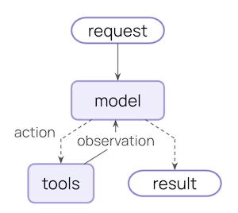
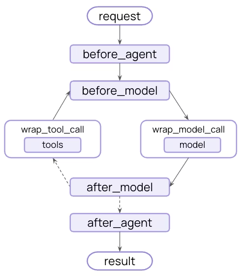

> 这篇更像 `Agents` 的后续拆解。前面已经把模型、消息、工具、记忆、流式和结构化输出串起来了，这里再回头看 middleware，就更容易理解它到底是“插在循环的哪一层”。

## 1. 介绍
中间件提供了一种更精细地控制智能体内部运行逻辑的方式。中间件适用于以下场景：
- 通过日志、分析和调试跟踪智能体行为。
- 转换提示词、工具选择及输出格式。
- 添加重试、降级方案和提前终止逻辑。
- 应用速率限制、防护机制及个人身份信息检测

只要在create_agent的时候传入中间件即可，代码示例如下：
```python
from langchain.agents import create_agent
from langchain.agents.middleware import SummarizationMiddleware, HumanInTheLoopMiddleware

agent = create_agent(
    model="gpt-4.1",
    tools=[...],
    middleware=[
        SummarizationMiddleware(...),
        HumanInTheLoopMiddleware(...)
    ],
)
```

我们知道，agent被invoke之后会进入一个loop，而中间件，就是在其中各个节点添加中间件。前面的学习中，其实我们已经多次用到中间件了。我们将普通的Agent Loop和带中间件的Agent Loop总结如下：



## 2. Prebuilt middleware
LangChain 和 Deep Agents 为常见应用场景提供预构建中间件。每种中间件均可直接用于生产环境，并可根据你的具体需求进行配置。

总结如下。为了方便查阅，我把表格和下面的示例代码做成了跳转关系：
- 点击 “Middleware” 列：跳到本文档下方对应示例
- 点击 “官方文档” 列：跳到 LangChain 官方 built-in middleware 页面对应章节

| Middleware | 中文解释 | 作用 | 典型用法 | 适用场景 | 官方文档 |
| --- | --- | --- | --- | --- | --- |
| [Summarization](#summarization) | 对话摘要 | 当上下文快接近 token 上限时，自动压缩历史对话，保留关键信息 | 把早期多轮聊天总结成一段摘要，替换冗长历史消息 | 长对话、客服、持续多轮 agent | [链接](https://docs.langchain.com/oss/python/langchain/middleware/built-in#summarization) |
| [Human-in-the-loop](#human-in-the-loop) | 人类介入审批 | 在执行高风险动作前暂停，让人工确认是否继续 | 调用删除文件、发邮件、转账、外部 API 写操作前先审批 | 高风险工具调用、生产环境 | [链接](https://docs.langchain.com/oss/python/langchain/middleware/built-in#human-in-the-loop) |
| [Model call limit](#model-call-limit) | 模型调用次数限制 | 限制一次任务中调用 LLM 的次数，防止死循环或费用失控 | 设置最多调用模型 5 次，超出后直接终止 | 成本控制、调试 agent 循环 | [链接](https://docs.langchain.com/oss/python/langchain/middleware/built-in#model-call-limit) |
| [Tool call limit](#tool-call-limit) | 工具调用次数限制 | 限制 agent 调用工具的次数，避免无限试错 | 限制搜索工具最多调 3 次、数据库查询最多调 5 次 | 工具容易死循环、外部调用昂贵 | [链接](https://docs.langchain.com/oss/python/langchain/middleware/built-in#tool-call-limit) |
| [Model fallback](#model-fallback) | 模型降级/回退 | 主模型失败时，自动切换到备用模型继续执行 | 先用 `gpt-4o`，失败后回退到 `gpt-4o-mini` | 稳定性要求高、生产兜底 | [链接](https://docs.langchain.com/oss/python/langchain/middleware/built-in#model-fallback) |
| [PII detection](#pii-detection) | 敏感信息检测 | 检测输入/输出中是否包含个人敏感信息，并执行脱敏、拦截或告警 | 识别手机号、身份证号、邮箱后自动打码 | 隐私合规、企业内部系统 | [链接](https://docs.langchain.com/oss/python/langchain/middleware/built-in#pii-detection) |
| [To-do list](#to-do-list) | 待办列表 | 给 agent 增加任务分解、任务跟踪和完成状态记录能力 | 把“大任务”拆成多个步骤，逐步完成并更新状态 | 长流程任务、研究型 agent | [链接](https://docs.langchain.com/oss/python/langchain/middleware/built-in#to-do-list) |
| [LLM tool selector](#llm-tool-selector) | 工具预筛选器 | 先用一个小模型判断哪些工具相关，再交给主模型决策 | 先选出最可能需要的 3 个工具，减少主模型负担 | 工具很多、路由复杂 | [链接](https://docs.langchain.com/oss/python/langchain/middleware/built-in#llm-tool-selector) |
| [Tool retry](#tool-retry) | 工具重试 | 工具调用失败时自动重试，并通常使用指数退避 | 网络超时后 1 秒、2 秒、4 秒后再试 | 外部 API 不稳定、偶发失败 | [链接](https://docs.langchain.com/oss/python/langchain/middleware/built-in#tool-retry) |
| [Model retry](#model-retry) | 模型重试 | 模型请求失败时自动重试，减少临时错误影响 | 遇到超时、429、临时连接失败时自动再调一次 | 模型 API 不稳定、网络波动 | [链接](https://docs.langchain.com/oss/python/langchain/middleware/built-in#model-retry) |
| [LLM tool emulator](#llm-tool-emulator) | 工具模拟器 | 用 LLM 模拟工具执行结果，便于测试 agent 流程 | 不连真实数据库，而让模型假装返回查询结果 | 本地调试、测试、演示 | [链接](https://docs.langchain.com/oss/python/langchain/middleware/built-in#llm-tool-emulator) |
| [Context editing](#context-editing) | 上下文编辑 | 动态裁剪、清理或重写上下文内容，避免上下文污染 | 删掉无用 tool message，只保留关键结论 | 长流程、多工具混杂场景 | [链接](https://docs.langchain.com/oss/python/langchain/middleware/built-in#context-editing) |
| [Shell tool](#shell-tool) | Shell 工具 | 给 agent 一个可持续的终端会话，让它执行命令 | 运行 `ls`、`python`、`git status` 等命令 | 编码 agent、自动化运维 | [链接](https://docs.langchain.com/oss/python/langchain/middleware/built-in#shell-tool) |
| [File search](#file-search) | 文件搜索 | 提供文件级搜索能力，如 Glob、Grep、全文检索 | 按文件名查找 `*.md`，或全文搜索某个函数名 | 代码库问答、文档检索 | [链接](https://docs.langchain.com/oss/python/langchain/middleware/built-in#file-search) |
| [Filesystem](#filesystem) | 文件系统 | 给 agent 提供读写文件能力，用于保存上下文、缓存或长期记忆 | 把中间结果写入文件，下次继续读取 | 持久化记忆、任务缓存 | [链接](https://docs.langchain.com/oss/python/langchain/middleware/built-in#filesystem-middleware) |
| [Subagent](#subagent) | 子代理 | 允许 agent 派生多个子 agent 分工处理任务 | 一个 agent 查资料，一个 agent 写总结，一个 agent 校验结果 | 复杂任务拆分、并行处理 | [链接](https://docs.langchain.com/oss/python/langchain/middleware/built-in#subagent) |


接下来，看看大概是怎么用的：

### Summarization
```python
from langchain.agents import create_agent
from langchain.agents.middleware import SummarizationMiddleware

agent = create_agent(
    model="gpt-4.1",
    tools=[your_weather_tool, your_calculator_tool],
    middleware=[
        SummarizationMiddleware(
            model="gpt-4.1-mini",
            trigger=("tokens", 4000),
            keep=("messages", 20),
        ),
    ],
)
```

### Human-in-the-loop
```python
from langchain.agents import create_agent
from langchain.agents.middleware import HumanInTheLoopMiddleware
from langgraph.checkpoint.memory import InMemorySaver


def your_read_email_tool(email_id: str) -> str:
    """Mock function to read an email by its ID."""
    return f"Email content for ID: {email_id}"

def your_send_email_tool(recipient: str, subject: str, body: str) -> str:
    """Mock function to send an email."""
    return f"Email sent to {recipient} with subject '{subject}'"

agent = create_agent(
    model="gpt-4.1",
    tools=[your_read_email_tool, your_send_email_tool],
    checkpointer=InMemorySaver(),
    middleware=[
        HumanInTheLoopMiddleware(
            interrupt_on={
                "your_send_email_tool": {
                    "allowed_decisions": ["approve", "edit", "reject"],
                },
                "your_read_email_tool": False,
            }
        ),
    ],
)
```

### Model call limit
```python
from langchain.agents import create_agent
from langchain.agents.middleware import ModelCallLimitMiddleware
from langgraph.checkpoint.memory import InMemorySaver

agent = create_agent(
    model="gpt-4.1",
    checkpointer=InMemorySaver(),  # Required for thread limiting
    tools=[],
    middleware=[
        ModelCallLimitMiddleware(
            thread_limit=10,
            run_limit=5,
            exit_behavior="end",
        ),
    ],
)
```

### Tool call limit
```python
from langchain.agents import create_agent
from langchain.agents.middleware import ToolCallLimitMiddleware

agent = create_agent(
    model="gpt-4.1",
    tools=[search_tool, database_tool],
    middleware=[
        # Global limit
        ToolCallLimitMiddleware(thread_limit=20, run_limit=10),
        # Tool-specific limit
        ToolCallLimitMiddleware(
            tool_name="search",
            thread_limit=5,
            run_limit=3,
        ),
    ],
)
```

### Model fallback
```python
from langchain.agents import create_agent
from langchain.agents.middleware import ModelFallbackMiddleware

agent = create_agent(
    model="gpt-4.1",
    tools=[],
    middleware=[
        ModelFallbackMiddleware(
            "gpt-4.1-mini",
            "claude-3-5-sonnet-20241022",
        ),
    ],
)
```

### PII detection
```python
from langchain.agents import create_agent
from langchain.agents.middleware import PIIMiddleware

agent = create_agent(
    model="gpt-4.1",
    tools=[],
    middleware=[
        PIIMiddleware("email", strategy="redact", apply_to_input=True),
        PIIMiddleware("credit_card", strategy="mask", apply_to_input=True),
    ],
)
```
```python
from langchain.agents import create_agent
from langchain.agents.middleware import PIIMiddleware
import re


# Method 1: Regex pattern string
agent1 = create_agent(
    model="gpt-4.1",
    tools=[],
    middleware=[
        PIIMiddleware(
            "api_key",
            detector=r"sk-[a-zA-Z0-9]{32}",
            strategy="block",
        ),
    ],
)

# Method 2: Compiled regex pattern
agent2 = create_agent(
    model="gpt-4.1",
    tools=[],
    middleware=[
        PIIMiddleware(
            "phone_number",
            detector=re.compile(r"\+?\d{1,3}[\s.-]?\d{3,4}[\s.-]?\d{4}"),
            strategy="mask",
        ),
    ],
)

# Method 3: Custom detector function
def detect_ssn(content: str) -> list[dict[str, str | int]]:
    """Detect SSN with validation.

    Returns a list of dictionaries with 'text', 'start', and 'end' keys.
    """
    import re
    matches = []
    pattern = r"\d{3}-\d{2}-\d{4}"
    for match in re.finditer(pattern, content):
        ssn = match.group(0)
        # Validate: first 3 digits shouldn't be 000, 666, or 900-999
        first_three = int(ssn[:3])
        if first_three not in [0, 666] and not (900 <= first_three <= 999):
            matches.append({
                "text": ssn,
                "start": match.start(),
                "end": match.end(),
            })
    return matches

agent3 = create_agent(
    model="gpt-4.1",
    tools=[],
    middleware=[
        PIIMiddleware(
            "ssn",
            detector=detect_ssn,
            strategy="hash",
        ),
    ],
)
```

## 3. Custom middleware
自定义的中间件，就是前面说的几个钩子自定义函数，大概有这几类：

Node-style:
- @before_agent - 智能体启动前执行（每次调用仅运行一次）
- @before_model - 每次调用模型前执行
- @after_model - 每次模型返回结果后执行
- @after_agent - 智能体执行完成后执行（每次调用仅运行一次）

Wrap-style:
- @wrap_model_call - 用自定义逻辑包装每次模型调用
- @wrap_tool_call - 用自定义逻辑包装每次工具调用
Convenience:
- @dynamic_prompt - 生成动态系统提示词

关于这几个的调用，假设我们传入了三个中间件，执行流大概是这样的：
```txt
Before hooks run in order:
middleware1.before_agent()
middleware2.before_agent()
middleware3.before_agent()
Agent loop starts
middleware1.before_model()
middleware2.before_model()
middleware3.before_model()
Wrap hooks nest like function calls:
middleware1.wrap_model_call() → middleware2.wrap_model_call() → middleware3.wrap_model_call() → model
After hooks run in reverse order:
middleware3.after_model()
middleware2.after_model()
middleware1.after_model()
Agent loop ends
middleware3.after_agent()
middleware2.after_agent()
middleware1.after_agent()
```

## 4. Agent jumps
我们可以使用`jump_to`命令，提前退出中间件，有几个条跳转对象：
- 'end'：跳转到智能体执行结束（或首个after_agent钩子）
- 'tools'：跳转到工具节点
- 'model'：跳转到模型节点（或首个before_model钩子）

例子如下：
```python
from langchain.agents.middleware import after_model, hook_config, AgentState
from langchain.messages import AIMessage
from langgraph.runtime import Runtime
from typing import Any


@after_model
@hook_config(can_jump_to=["end"])
def check_for_blocked(state: AgentState, runtime: Runtime) -> dict[str, Any] | None:
    last_message = state["messages"][-1]
    if "BLOCKED" in last_message.content:
        return {
            "messages": [AIMessage("I cannot respond to that request.")],
            "jump_to": "end"
        }
    return None
```

## 5. 最好的用法

- 保持中间件职责专一 —— 每个中间件只做好一件事
- 优雅处理错误 —— 避免中间件异常导致智能体崩溃

使用合适的钩子类型:
- 节点式钩子用于顺序逻辑（日志记录、数据校验）
- 包装式钩子用于控制流（重试、降级、缓存）
- 清晰文档化所有自定义状态属性
- 集成前对中间件进行独立单元测试
- 考虑执行顺序 —— 关键中间件放在列表首位
- 尽可能使用内置中间件
