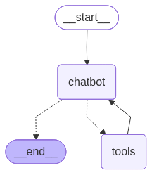

> 这篇更像“先把地图打开”。里面会提前碰到工具、记忆、human-in-the-loop 和 time-travel，但重点是先建立 LangGraph 整体长什么样的直觉。

## 1. 介绍
LangGraph 专为希望构建强大、适应性强的 AI 智能体的开发者而设计。比起LangChain，它支持更为复杂的自定义的操作。

你可能会疑惑，我已经有了create_agent + middleware，啥场景不够用？有的兄弟有的，如果出现下面这些信号，就需要升级到LangGraph了！

- 你需要明确的分支/循环（不是“让模型自己决定”）。
- 你需要并行流程（fan-out/fan-in）。
- 你要在固定步骤做人审、打断、恢复。
- 你要可回放、可分叉、可精确恢复（durable execution）。
- 你发现 middleware 里 if/else 越来越多，逻辑难维护。

当然，最常见的其实是混用两个，我们将create_agent作为能力节点，放进LangGraph中，而LangGraph负责全局编排。接下来，我们来简单入门一下LangGraph。

## 2. 构建一个聊天机器人
我们先安装一下两个所需要的软件包，分别是langgraph和langsmith：
```python
pip install -U langgraph langsmith
```

紧接着，我们用StateGraph构建聊天机器人，这个聊天机器人直接回复用户的消息。一个 StateGraph 对象将我们的聊天机器人结构定义为“状态机”。我们将添加 节点 来表示 LLM 和聊天机器人可以调用的函数，并添加 边 来指定机器人应如何在这些函数之间进行转换。


```python
from typing import Annotated

from typing_extensions import TypedDict

from langgraph.graph import StateGraph, START
from langgraph.graph.message import add_messages


class State(TypedDict):
    # Messages have the type "list". The `add_messages` function
    # in the annotation defines how this state key should be updated
    # (in this case, it appends messages to the list, rather than overwriting them)
    messages: Annotated[list, add_messages]


graph_builder = StateGraph(State)
```

我们的图现在可以处理两个关键任务

- 每个 节点 都可以接收当前 状态 作为输入，并输出状态的更新。
- 对 消息 的更新将追加到现有列表而不是覆盖它，这得益于与 Annotated 语法一起使用的预构建 add_messages 函数。

现在，我们通过StateGraph对加节点加边，就可以构成一个可以运行的图，完整代码如下：
```python
import os
from typing import Annotated

from dotenv import load_dotenv
from langchain.chat_models import init_chat_model
from typing_extensions import TypedDict

from langgraph.graph import END, START, StateGraph
from langgraph.graph.message import add_messages

BASE_DIR = os.path.dirname(__file__)
load_dotenv(os.path.join(BASE_DIR, ".env"))


class State(TypedDict):
    messages: Annotated[list, add_messages]


graph_builder = StateGraph(State)

llm = init_chat_model(
    "openai:gpt-4o-mini",
    base_url=os.environ.get("QIHANG_BASE_URL"),
    api_key=os.environ.get("QIHANG_API"),
)


def chatbot(state: State):
    # 这里必须返回 "messages"，否则不会写入 State.messages
    return {"messages": [llm.invoke(state["messages"])]}


# 将模型集成到节点
graph_builder.add_node("chatbot", chatbot)

# 添加入口和结束
graph_builder.add_edge(START, "chatbot")
graph_builder.add_edge("chatbot", END)

# 编译图
graph = graph_builder.compile()


def visualize_graph() -> None:
    graph_obj = graph.get_graph()

    png_path = os.path.join(BASE_DIR, "graph.png")
    try:
        with open(png_path, "wb") as f:
            f.write(graph_obj.draw_mermaid_png())
        print(f"[visualize] 已保存 PNG: {png_path}")
    except Exception as e:
        print(f"[visualize] 生成 PNG 失败: {e}")
        print("[visualize] Mermaid 文本如下：")
        print(graph_obj.draw_mermaid())


if __name__ == "__main__":
    visualize_graph()

    # LangGraph + add_messages 支持这种 message shorthand
    result = graph.invoke({"messages": [("user", "你好，介绍一下你自己")]})

    print("\n===== Final State =====")
    for msg in result["messages"]:
        msg.pretty_print()
```



`add_node`接受的是一个可调用对象，普通函数符合了这个要求。而`State`类，是我们的全局Schema。我们用`TypedDict`进行了定义，添加了消息历史的更新方式`messages: Annotated[list, add_messages]`。除了定义更新规则之外，还可能会定义状态结构、字段类型。

这就是最基本的机器人创建啦，只有一个节点，两条边，model被invoke之后返回的是一个AIMessage，详见之前LangChain的核心组件Messages。

另外一个重要的点，就是StateGraph种，node的返回值。这里是返回dict对状态就行增量更新（返回要修改的字段），当然也可以返回Command，用于更新状态+控制流跳转，比如：`Command(update={"x": 1}, goto="next_node")`或者`graph=Command.PARENT`（子图场景）。

## 3. 添加工具

### (1) tool.invoke()

我们用Tavily API试试工具效果，这是一个让llm拥有网络搜索能力的工具。我们先`from langchain_tavily import TavilySearch`（记得安装依赖和加载API），然后创建工具`tool = TavilySearch(max_results = 2)`，直接invoke，得到结果如下：
```json
{
  "query": "LangGraph里面的node是什么？",
  "follow_up_questions": null,
  "answer": null,
  "images": [],
  "results": [
    {
      "url": "https://www.cnblogs.com/luzhanshi/articles/19141931",
      "title": "Ch.7 LangGraph底层原理与基础应用入门 - 博客园",
      "content": "接下来的步骤是向这个图中添加节点和边，完善和丰富图的内部执行逻辑。 2.3 Nodes. 在 LangGraph 中，节点是一个 python 函数（sync 或async ），接收",
      "score": 0.99996924,
      "raw_content": null
    },
    {
      "url": "http://www.bilibili.com/read/cv42850203/",
      "title": "LangGraphAgent开发实战- 哔哩哔哩",
      "content": "... 里面添加Node才能形成有向有环图. Node. Node是LangGraph的节点，每个节点代表一个函数或一个计算步骤。 你可以定义节点来执行特定任务，例如处理输入、做出决策或与外部",
      "score": 0.99996495,
      "raw_content": null
    }
  ],
  "response_time": 1.07,
  "request_id": "13235394-9b4d-4a56-a08e-3c6f4024f03c"
}
```

也就是说，tool被invoke之后返回的是工具函数本身的返回值，我们在LangChain中，曾经采用的方法是将其包装为ToolMessage，再继续给模型推理。

### (2) bind_tools()

而在LangChain中关于Model的介绍中，我们学习了给模型绑定工具的方法`bind_tools`，我们可以直接给模型bind一个工具，加入到StateGraph中：
```python
from typing import Annotated

from typing_extensions import TypedDict

from langgraph.graph import StateGraph, START, END
from langgraph.graph.message import add_messages

class State(TypedDict):
    messages: Annotated[list, add_messages]

graph_builder = StateGraph(State)

# Modification: tell the LLM which tools it can call
# highlight-next-line
llm_with_tools = llm.bind_tools(tools)

def chatbot(state: State):
    return {"messages": [llm_with_tools.invoke(state["messages"])]}

graph_builder.add_node("chatbot", chatbot)
```

这种方式是，默认由模型自己选择调用与否，在拿到的 AIMessage.tool_calls 中看到它要调用那些工具。
- 如果纯用model.invoke()，通常只会拿到“要调用工具的意图”，最终产出AIMessage.tool_calls，这一步还没有真正工具执行。
- 另外，模型也并非一定会阐述tool_calls。一般有这几种方法强制模型调用：
    - 用模型支持的tool_choice强制模型阐述tool_calls
    - 用图结构兜底，比如如果tool_calls为空就重试、报错、或路由到自定义的节点
    - 提示词约束
- 产生了tool_calls以后，才能去往ToolNode进行正确的函数调用并返回结果！


### (3) ToolNode

我们在学习LangChain的时候，介绍Tools这一节，我们跳过了ToolNode的学习，现在我们重新进行学习：
```python
from langchain.tools import tool
from langgraph.prebuilt import ToolNode
from langgraph.graph import StateGraph, MessagesState, START, END

@tool
def search(query: str) -> str:
    """Search for information."""
    return f"Results for: {query}"

@tool
def calculator(expression: str) -> str:
    """Evaluate a math expression."""
    return str(eval(expression))

# Create the ToolNode with your tools
tool_node = ToolNode([search, calculator])

# Use in a graph
builder = StateGraph(MessagesState)
builder.add_node("tools", tool_node)
# ... add other nodes and edges
```

可以看到用法几乎和前面一样，只是节点用了`from langgraph.prebuilt import ToolNode`里面的可调用类ToolNode。ToolNode还提供了错误验证处理机制：
```python
from langgraph.prebuilt import ToolNode

# Default: catch invocation errors, re-raise execution errors
tool_node = ToolNode(tools)

# Catch all errors and return error message to LLM
tool_node = ToolNode(tools, handle_tool_errors=True)

# Custom error message
tool_node = ToolNode(tools, handle_tool_errors="Something went wrong, please try again.")

# Custom error handler
def handle_error(e: ValueError) -> str:
    return f"Invalid input: {e}"

tool_node = ToolNode(tools, handle_tool_errors=handle_error)

# Only catch specific exception types
tool_node = ToolNode(tools, handle_tool_errors=(ValueError, TypeError))
```

当然，我们知道，工具的调用，大多是需要符合某种条件的，`tool_condition`就是专门用来根据大模型是否调用工具进行条件路由的。

```python
from langgraph.prebuilt import ToolNode, tools_condition
from langgraph.graph import StateGraph, MessagesState, START, END

builder = StateGraph(MessagesState)
builder.add_node("llm", call_llm)
builder.add_node("tools", ToolNode(tools))

builder.add_edge(START, "llm")
builder.add_conditional_edges("llm", tools_condition)  # Routes to "tools" or END
builder.add_edge("tools", "llm")

graph = builder.compile()
```

上例，就是一个标准的ReAct风格agent图了，我们用相同的方法打印出来就能看到：


add_conditional_edges的核心是“从哪个节点执行完后开始判断路由”，这个节点可以是llm，也可以是tools、普通函数节点，没有区别。他的语法是`add_conditional_edges("a", route, ...)`，根据route返回动态跳转。

- 先执行源节点（比如 llm）。
- 执行完后，LangGraph 在 Python 侧调用你的路由函数 route(state, ...)。
- 路由函数返回下一个目标（节点名 / 多个节点 / END），图再继续执行。

我们可以自己写这个route函数，上例是（tools_codition这个预构建好的工具选择，有tool_calls则路由到工具节点处）：
```python
from typing import Literal
from langgraph.graph import END

def route(state) -> Literal["tools", "chat", END]:
    last = state["messages"][-1]
    text = (last.content or "").lower()

    if getattr(last, "tool_calls", None):
        return "tools"
    if "结束" in text:
        return END
    return "chat"

builder.add_conditional_edges("llm", route)
```

也可以用映射表：
```python
def route(state):
    return state["mode"]  # "search" / "done"

builder.add_conditional_edges("llm", route, {
    "search": "tools",
    "done": END
})
```
只要确保有一条路径通往END就可以了，不然会死循环。

## 4. 添加记忆

作为一个Agent，除了使用工具以外，还必须要记得交互的上下文，从而获取连贯多轮对话的能力。LangGraph是通过持久性检查点解决了这个问题。

具体而言，如果在编译图时提供一个checkpointer，并在调用图时提供一个thread_id，LangGraph 会在每一步之后自动保存状态。当使用相同的thread_id再次调用图时，图会加载其保存的状态，允许聊天机器人从上次中断的地方继续。

检查点比简单的聊天记忆功能强大得多——它允许您随时保存和恢复复杂状态，用于错误恢复、人工干预工作流、时间旅行交互等。

### (1) 多轮对话实现
我们在LangChain中提到，如果要为智能体添加线程级记忆，需要在创建时指定checkpoint，当时使用的是InMemorySaver。MemorySaver 和 InMemorySaver 在现在的 LangGraph 里本质没区别，新代码的InMemorySaver建议向后兼容。（以后可能会有不同的SqliteSaver或者PostgreSaver，到时候查文档）。

我明明导入类创建实例，使用提供的检查点编译图，图在遍历每个节点时将对State设置检查点。
```python
from langgraph.checkpoint.memory import MemorySaver

memory = MemorySaver()
graph = graph_builder.compile(checkpointer=memory)
```
注意现在，需要选择一个线程作为对话的键，作为第二个参数提供：
```python
config = {"configurable": {"thread_id": "1"}}

user_input = "Hi there! My name is Will."

# The config is the **second positional argument** to stream() or invoke()!
events = graph.stream(
    {"messages": [{"role": "user", "content": user_input}]},
    config,
    stream_mode="values",
)
for event in events:
    event["messages"][-1].pretty_print()
```

### (2) 检查State
我们可以在不同的线程中创建检查点，可是检查点中包含什么？要随时检查state，我们会使用`get_state(config)`。
 
 ```python
snapshot = graph.get_state(config)
print(snapshot)
```
得到
```json
{
  "type": "StateSnapshot",
  "thread": {
    "thread_id": "1",
    "checkpoint_ns": "",
    "checkpoint_id": "1ef7d06e-93e0-6acc-8004-f2ac846575d2",
    "parent_checkpoint_id": "1ef7d06e-859f-6206-8003-e1bd3c264b8f"
  },
  "timeline": {
    "created_at": "2024-09-27T19:30:10.820758+00:00",
    "step": 4,
    "source": "loop"
  },
  "messages": [
    {
      "role": "human",
      "content": "Hi there! My name is Will."
    },
    {
      "role": "ai",
      "model": "claude-3-5-sonnet-20240620",
      "content": "Hello Will! It's nice to meet you...",
      "usage": {
        "input_tokens": 405,
        "output_tokens": 32,
        "total_tokens": 437
      }
    },
    {
      "role": "human",
      "content": "Remember my name?"
    },
    {
      "role": "ai",
      "model": "claude-3-5-sonnet-20240620",
      "content": "Of course, I remember your name, Will...",
      "usage": {
        "input_tokens": 444,
        "output_tokens": 58,
        "total_tokens": 502
      }
    }
  ],
  "state": {
    "next": [],
    "tasks": [],
    "parents": {}
  },
  "last_write": {
    "node": "chatbot",
    "field": "messages",
    "value": "最后一条 AI 回复（确认记住名字 Will）"
  }
}
```

感到眼熟？那就对了，这就其中的message字典对应的就是AIMessage，相对的，多了type、thread、timeline等。

## 5. human-in-loop

Agent可能不完全可靠，有时候需要依赖人工输入才能完成任务。这就需要我们添加 human_assistance 到流程中。

```python
import os
from typing import Annotated
from typing_extensions import TypedDict

from dotenv import load_dotenv
from langchain.chat_models import init_chat_model
from langchain_core.tools import tool
from langchain_tavily import TavilySearch

from langgraph.checkpoint.memory import MemorySaver
from langgraph.graph import START, StateGraph
from langgraph.graph.message import add_messages
from langgraph.prebuilt import ToolNode, tools_condition
from langgraph.types import Command, interrupt

BASE_DIR = os.path.dirname(__file__)
load_dotenv(os.path.join(BASE_DIR, ".env"))

llm = init_chat_model(
    "openai:gpt-4o-mini",
    base_url=os.getenv("QIHANG_BASE_URL"),
    api_key=os.getenv("QIHANG_API"),
)

class State(TypedDict):
    messages: Annotated[list, add_messages]

graph_builder = StateGraph(State)

@tool
def human_assistance(query: str) -> str:
    """Request assistance from a human."""
    human_response = interrupt({"query": query})
    return human_response["data"]

tavily_tool = TavilySearch(max_results=2)
tools = [tavily_tool, human_assistance]

llm_with_tools = llm.bind_tools(tools)

def chatbot(state: State):
    message = llm_with_tools.invoke(state["messages"])
    # 避免恢复后重复并行工具调用
    assert len(message.tool_calls) <= 1
    return {"messages": [message]}

graph_builder.add_node("chatbot", chatbot)
graph_builder.add_node("tools", ToolNode(tools=tools))

graph_builder.add_conditional_edges("chatbot", tools_condition)
graph_builder.add_edge("tools", "chatbot")
graph_builder.add_edge(START, "chatbot")

memory = MemorySaver()
graph = graph_builder.compile(checkpointer=memory)

if __name__ == "__main__":
    config = {"configurable": {"thread_id": "1"}}
    user_input = input("User: ").strip() or (
        "I need some expert guidance for building an AI agent. "
        "Could you request assistance for me?"
    )

    # 1) 首次运行：可能会在 human_assistance 处触发 interrupt
    events = graph.stream(
        {"messages": [{"role": "user", "content": user_input}]},
        config,
        stream_mode="values",
    )
    interrupted = False
    for event in events:
        if "messages" in event:
            event["messages"][-1].pretty_print()
        if "__interrupt__" in event:
            interrupted = True

    # 2) 如果触发中断，真实读取人工输入并恢复
    if interrupted:
        human_response = input("Human response: ").strip()
        if human_response:
            human_command = Command(resume={"data": human_response})
            events = graph.stream(human_command, config, stream_mode="values")
            for event in events:
                if "messages" in event:
                    event["messages"][-1].pretty_print()

```


1. 首次 `graph.stream(...)` 运行到 `interrupt(...)` 时暂停。  
2. 终端真实输入 `Human response`。  
3. 用 `Command(resume={"data": human_response})` 恢复执行。  

另外，这里仍然是标准 ReAct 图：`chatbot -> tools -> chatbot / END`。`llm.bind_tools(tools)` 负责让模型知道可用工具，`ToolNode + tools_condition` 负责真正执行工具。

## 6. 自定义State

### (1) 自己添加键
添加到State里面的信息可以被下游节点以及图的持久层访问。
```python
class State(TypedDict):
    messages: Annotated[list, add_messages]
    name: str
    birthday: str
```

### (2) 在工具内部更新状态
在 human_assistance 工具内部填充状态键。这允许人工在信息存储到状态之前对其进行审查。使用 Command 从工具内部发出状态更新。

```python
from langchain_core.messages import ToolMessage
from langchain_core.tools import InjectedToolCallId, tool

from langgraph.types import Command, interrupt

@tool
# Note that because we are generating a ToolMessage for a state update, we
# generally require the ID of the corresponding tool call. We can use
# LangChain's InjectedToolCallId to signal that this argument should not
# be revealed to the model in the tool's schema.
def human_assistance(
    name: str, birthday: str, tool_call_id: Annotated[str, InjectedToolCallId]
) -> str:
    """Request assistance from a human."""
    human_response = interrupt(
        {
            "question": "Is this correct?",
            "name": name,
            "birthday": birthday,
        },
    )
    # If the information is correct, update the state as-is.
    if human_response.get("correct", "").lower().startswith("y"):
        verified_name = name
        verified_birthday = birthday
        response = "Correct"
    # Otherwise, receive information from the human reviewer.
    else:
        verified_name = human_response.get("name", name)
        verified_birthday = human_response.get("birthday", birthday)
        response = f"Made a correction: {human_response}"

    # This time we explicitly update the state with a ToolMessage inside
    # the tool.
    state_update = {
        "name": verified_name,
        "birthday": verified_birthday,
        "messages": [ToolMessage(response, tool_call_id=tool_call_id)],
    }
    # We return a Command object in the tool to update our state.
    return Command(update=state_update)
```

还有提醒聊天机器人、添加人工协助、手动更新状态、查看新值等比较自然的用法。

## 7. time-travel（时间旅行）
命运石之门来咯）

这一节的核心不是“回放聊天记录”，而是“从某个历史检查点重新继续运行图”。  

- 前置条件：图必须 `compile(checkpointer=...)`，并且调用时使用同一个 `thread_id`。
- 关键能力有两种：
  - `Replay`（重播）：从历史 checkpoint 继续跑，后续节点会重新执行。
  - `Fork`（分叉）：在历史 checkpoint 上改一部分状态，再沿新分支继续跑。

### (1) 回看完整历史：`get_state_history`
先看线程里有哪些 checkpoint（按时间倒序）：

```python
to_replay = None
for state in graph.get_state_history(config):
    print("Num Messages:", len(state.values["messages"]), "Next:", state.next)
    # 例子：挑一个中间状态（这里只是演示，实际可以换成别的条件）
    if len(state.values["messages"]) == 6:
        to_replay = state
```

这里最重要的两个字段：

- `state.next`：从这个 checkpoint 恢复后，下一个要执行的节点是谁。
- `state.config["configurable"]["checkpoint_id"]`：这个历史点的唯一标识。

### (2) 从某个历史点恢复执行（Replay）
教程里最关键的一行就是：

```python
for event in graph.stream(None, to_replay.config, stream_mode="values"):
    if "messages" in event:
        event["messages"][-1].pretty_print()
```

说明：

- 这里传 `None` 作为输入，表示“不提供新输入，直接从 checkpoint 接着跑”。
- 传 `to_replay.config`，就是告诉 LangGraph“从这个历史点恢复”。
- 它会从 `state.next` 对应节点继续执行，所以后续工具调用/LLM 调用会重新发生。

### (3) 一句话区分：Replay vs Fork

- `Replay`：用旧 checkpoint 原样继续跑。  
- `Fork`：先改状态再继续跑（更像“平行世界”）。

例如（进阶）：

```python
# 在历史点上改状态，生成新分支
fork_config = graph.update_state(
    to_replay.config,
    values={"messages": [("user", "换个方向继续")]},
)

# 从新分支继续执行
result = graph.invoke(None, fork_config)
```

以上，算是简单入门了LangGraph，接下来，我们直接顺着官方文档，开始一个能力一个能力查看。
