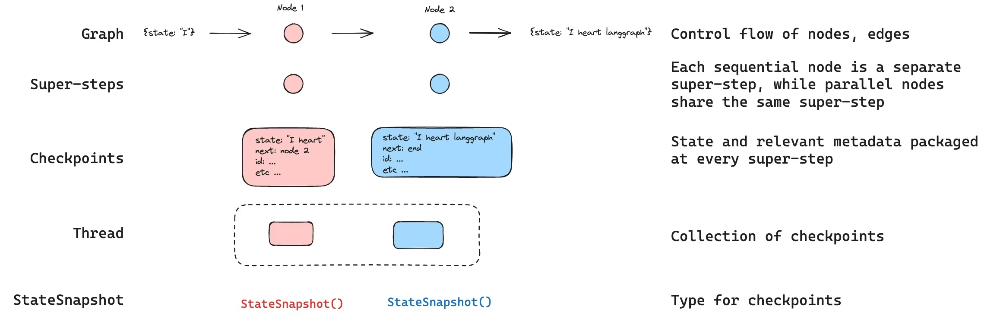
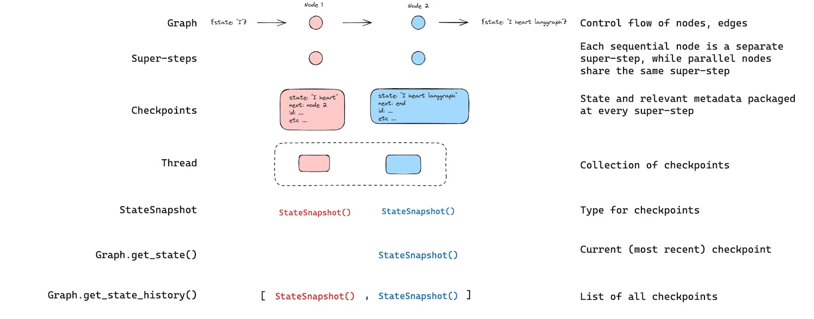
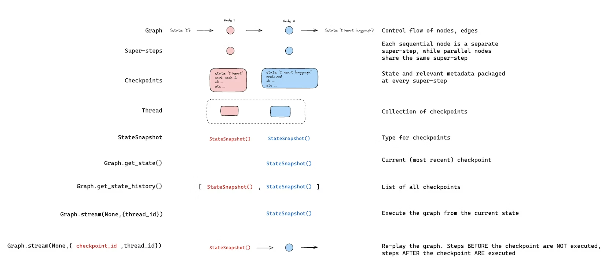
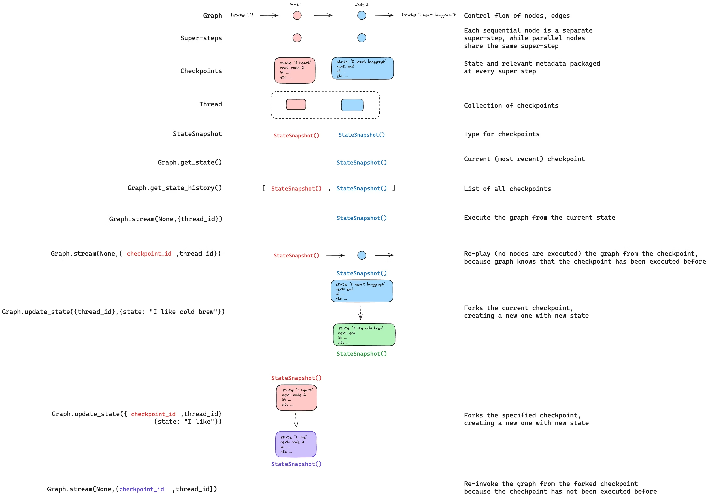
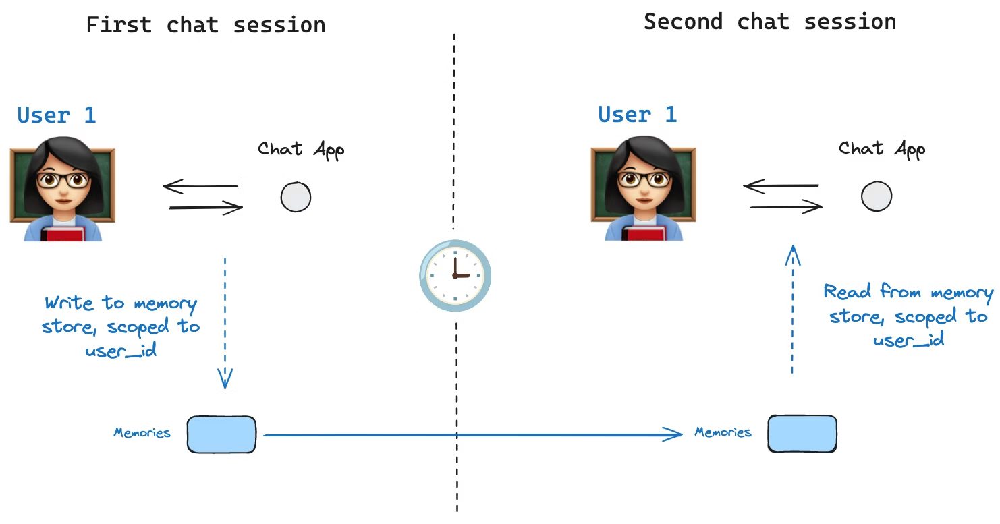

> `Persistence` 是 LangGraph 真正和普通“函数编排”拉开差距的地方。线程、检查点、状态历史和 Store 是一整套协作机制，不是几个分散功能。

## 1. 介绍
LangGraph 内置持久化层，可将图状态以检查点形式保存。当你使用检查点器编译图时，图状态的快照会在执行的每一步被保存，并按线程进行组织。这支持人机协同工作流、对话记忆、回溯调试以及容错执行。



持久化，对于Human-in-the-loop、Memory、Time travel、Fault-tolerance、Pending writes都是很有用的。

## 2. 线程 (Threads)
线程是检查点保存器为每个保存的检查点分配的唯一标识（ID）或线程标识符。它包含一系列运行的累积状态。执行一次运行时，助手底层图的状态将持久化到该线程中。
在使用检查点保存器调用图时，你必须在配置的configurable部分中指定一个 thread_id：
```txt
{"configurable": {"thread_id": "1"}}
```
可获取线程的当前状态与历史状态。若要持久化状态，必须在执行运行任务前创建线程。LangSmith API 提供多个接口用于创建和管理线程及线程状态。

检查点存储器以thread_id作为存储和读取检查点的主键。若无此标识，检查点存储器将无法保存状态，也无法在中断后恢复执行，因为它需要通过thread_id加载已保存的状态。

## 3. 检查点 (Checkpoints)

线程在特定时间点的状态(State)称为检查点。检查点是在每个超步保存的图状态快照，由 `StateSnapshot` 对象表示。根据官方文档，`StateSnapshot` 字段如下：
| 字段 | 类型 | 描述 |
| --- | --- | --- |
| `values` | `dict` | 该检查点对应的状态通道值。 |
| `next` | `tuple[str, ...]` | 下一步将要执行的节点名；为空 `()` 表示图已完成。 |
| `config` | `dict` | 当前检查点配置，包含 `thread_id`、`checkpoint_ns`、`checkpoint_id`。 |
| `metadata` | `dict` | 执行元数据，包含 `source`（`"input"`、`"loop"`、`"update"`）、`writes`（节点写入内容）、`step`（超步计数）。 |
| `created_at` | `str` | 检查点创建时间（ISO 8601）。 |
| `parent_config` | `dict \| None` | 上一个检查点配置；首个检查点为 `None`。 |
| `tasks` | `tuple[PregelTask, ...]` | 当前步骤任务集合。每个任务含 `id`、`name`、`error`、`interrupts`，并在 `subgraphs=True` 时可含 `state`（子图快照）。 |

实战读法（你调试时最常看）：
- 看 `next`：确认接下来会跑哪个节点，`()` 就是已结束。
- 看 `metadata["source"]`：区分本检查点来源于输入(`input`)、正常循环执行(`loop`)还是手动更新状态(`update`)。
- 看 `metadata["writes"]`：快速定位“这个检查点是谁写出来的”。
- 看 `tasks`：排查中断(`interrupts`)和错误(`error`)时最关键。

LangGraph 会在每个超步(Super-steps)边界创建检查点。超步是图的一次 “节拍”，在该节拍中，所有被调度到该步骤的节点都会执行（可能并行执行）。对于像START -> A -> B -> END这样的顺序图，输入、节点 A 和节点 B 各对应一个独立的超步 —— 每个超步完成后都会生成一个检查点。理解超步边界对于时间回溯至关重要，因为你只能从检查点（即超步边界）恢复执行。

检查点会被持久化存储，可用于在后续时间恢复线程状态。
我们来看一下当一个简单图按如下方式调用时，会保存哪些检查点：
```python
from langgraph.graph import StateGraph, START, END
from langgraph.checkpoint.memory import InMemorySaver
from langchain_core.runnables import RunnableConfig
from typing import Annotated
from typing_extensions import TypedDict
from operator import add

class State(TypedDict):
    foo: str
    bar: Annotated[list[str], add]

def node_a(state: State):
    return {"foo": "a", "bar": ["a"]}

def node_b(state: State):
    return {"foo": "b", "bar": ["b"]}


workflow = StateGraph(State)
workflow.add_node(node_a)
workflow.add_node(node_b)
workflow.add_edge(START, "node_a")
workflow.add_edge("node_a", "node_b")
workflow.add_edge("node_b", END)

checkpointer = InMemorySaver()
graph = workflow.compile(checkpointer=checkpointer)

config: RunnableConfig = {"configurable": {"thread_id": "1"}}
graph.invoke({"foo": "", "bar":[]}, config)
```

运行流程图后，我们预期会看到恰好4个检查点：
- 空检查点，下一个待执行节点为START
- 包含用户输入{'foo': '', 'bar': []}且下一个待执行节点为node_a的检查点
- 包含node_a输出结果{'foo': 'a', 'bar': ['a']}且下一个待执行节点为node_b的检查点
- 包含node_b输出结果{'foo': 'b', 'bar': ['a', 'b']}且无后续待执行节点的检查点

`checkpoint_ns`（检查点命名空间）用来区分当前检查点属于主图还是某个子图：
- 空字符串 `""`：属于最外层根图（parent graph）。
- 节点名:uuid：属于该节点调用的子图。
- 嵌套子图用 `|` 连接：如 `outer_node:uuid|inner_node:uuid`，表示外层子图里的内层子图。

作用：让 LangGraph 知道状态属于哪一层图，避免多层嵌套时状态混乱。

## 4. 状态获取

与已保存的图状态交互时，你必须指定一个线程标识符。你可以通过调用graph.get_state(config)查看图的最新状态。该调用会返回一个StateSnapshot对象，对应配置中提供的线程 ID 所关联的最新检查点；若提供了检查点 ID，则返回该线程对应检查点 ID 的检查点。
```python
# get the latest state snapshot
config = {"configurable": {"thread_id": "1"}}
graph.get_state(config)

# get a state snapshot for a specific checkpoint_id
config = {"configurable": {"thread_id": "1", "checkpoint_id": "1ef663ba-28fe-6528-8002-5a559208592c"}}
graph.get_state(config)
```

可以通过调用graph.get_state_history(config)获取指定线程的完整图执行历史。该方法会返回与配置中提供的线程 ID 相关联的 `StateSnapshot` 列表。这个列表可按“最新在前”来理解（最常用）。

```python
config = {"configurable": {"thread_id": "1"}}
list(graph.get_state_history(config))
```

也可以像官方示例一样按条件筛选特定检查点（非常实用）：
```python
history = list(graph.get_state_history(config))

# 找到“即将执行 node_b”之前的检查点
before_node_b = next(s for s in history if s.next == ("node_b",))

# 按 step 查找
step_2 = next(s for s in history if s.metadata["step"] == 2)

# 找出所有由 update_state 产生的检查点（分叉点）
forks = [s for s in history if s.metadata["source"] == "update"]

# 找到发生中断的检查点
interrupted = next(
    s for s in history
    if s.tasks and any(t.interrupts for t in s.tasks)
)
```

结果会像这样：
```txt
[
    StateSnapshot(
        values={'foo': 'b', 'bar': ['a', 'b']},
        next=(),
        config={'configurable': {'thread_id': '1', 'checkpoint_ns': '', 'checkpoint_id': '1ef663ba-28fe-6528-8002-5a559208592c'}},
        metadata={'source': 'loop', 'writes': {'node_b': {'foo': 'b', 'bar': ['b']}}, 'step': 2},
        created_at='2024-08-29T19:19:38.821749+00:00',
        parent_config={'configurable': {'thread_id': '1', 'checkpoint_ns': '', 'checkpoint_id': '1ef663ba-28f9-6ec4-8001-31981c2c39f8'}},
        tasks=(),
    ),
    StateSnapshot(
        values={'foo': 'a', 'bar': ['a']},
        next=('node_b',),
        config={'configurable': {'thread_id': '1', 'checkpoint_ns': '', 'checkpoint_id': '1ef663ba-28f9-6ec4-8001-31981c2c39f8'}},
        metadata={'source': 'loop', 'writes': {'node_a': {'foo': 'a', 'bar': ['a']}}, 'step': 1},
        created_at='2024-08-29T19:19:38.819946+00:00',
        parent_config={'configurable': {'thread_id': '1', 'checkpoint_ns': '', 'checkpoint_id': '1ef663ba-28f4-6b4a-8000-ca575a13d36a'}},
        tasks=(PregelTask(id='6fb7314f-f114-5413-a1f3-d37dfe98ff44', name='node_b', error=None, interrupts=()),),
    ),
    StateSnapshot(
        values={'foo': '', 'bar': []},
        next=('node_a',),
        config={'configurable': {'thread_id': '1', 'checkpoint_ns': '', 'checkpoint_id': '1ef663ba-28f4-6b4a-8000-ca575a13d36a'}},
        metadata={'source': 'loop', 'writes': None, 'step': 0},
        created_at='2024-08-29T19:19:38.817813+00:00',
        parent_config={'configurable': {'thread_id': '1', 'checkpoint_ns': '', 'checkpoint_id': '1ef663ba-28f0-6c66-bfff-6723431e8481'}},
        tasks=(PregelTask(id='f1b14528-5ee5-579c-949b-23ef9bfbed58', name='node_a', error=None, interrupts=()),),
    ),
    StateSnapshot(
        values={'bar': []},
        next=('__start__',),
        config={'configurable': {'thread_id': '1', 'checkpoint_ns': '', 'checkpoint_id': '1ef663ba-28f0-6c66-bfff-6723431e8481'}},
        metadata={'source': 'input', 'writes': {'foo': ''}, 'step': -1},
        created_at='2024-08-29T19:19:38.816205+00:00',
        parent_config=None,
        tasks=(PregelTask(id='6d27aa2e-d72b-5504-a36f-8620e54a76dd', name='__start__', error=None, interrupts=()),),
    )
]
```



## 5. 重放 (Replay)
重放功能会从先前的检查点重新执行步骤。使用先前的checkpoint_id调用图，以重新运行该检查点之后的节点。检查点之前的节点会被跳过（其结果已保存）。检查点之后的节点会重新执行，包括任何大模型调用、API 请求或中断—— 这些在重放过程中始终会被重新触发。

此事在前面time travel初探有所提及。



## 6. 状态更新
可以使用update_state编辑图状态。这会基于更新后的值创建一个新的检查点，不会修改原始检查点。该更新的处理方式与节点更新一致：若定义了reducer函数，值会通过该函数传递，因此带有 reducer 的通道会累加数值而非覆盖。
你可以可选指定as_node，以控制该更新被视为来自哪个节点，这会影响下一个执行的节点。



## 7. 记忆存储
仅依靠 checkpointer 无法在线程间共享信息。  
checkpointer 负责“线程内状态持久化”，Store 负责“跨线程共享长期记忆”。



### 7.1 Store 的核心概念
- Store 中的数据按 `namespace`（命名空间）组织，通常使用元组，例如：`(user_id, "memories")`。
- 每条记忆是 `key-value` 结构：`key` 是记忆 ID，`value` 是实际内容（通常为字典）。
- `search` 返回的是 `Item` 对象，常见字段有：
  - `value`
  - `key`
  - `namespace`
  - `created_at`
  - `updated_at`

说明：`namespace` 的类型是 `tuple[str, ...]`，在 JSON 展示中可能表现为列表。

举个例子，InMemoryStore 是存在当前 Python 进程的内存（RAM）里，来达到跨线程（thread_id）的效果，注意这里的线程并非是os的线程。

### 7.2 基础用法（脱离图单独使用）
```python
import uuid
from langgraph.store.memory import InMemoryStore

store = InMemoryStore()

user_id = "1"
namespace = (user_id, "memories")

memory_id = str(uuid.uuid4())
memory = {"food_preference": "I like pizza"}

store.put(namespace, memory_id, memory)

memories = store.search(namespace)
print(memories[-1].dict())
```

### 7.3 在 LangGraph 中接入 Store
常见做法是同时编译：
- `checkpointer`：保存线程内状态（checkpoint）
- `store`：保存跨线程长期记忆

```python
from dataclasses import dataclass
from langgraph.graph import StateGraph, MessagesState
from langgraph.checkpoint.memory import InMemorySaver
from langgraph.store.memory import InMemoryStore

@dataclass
class Context:
    user_id: str

checkpointer = InMemorySaver()
store = InMemoryStore()

builder = StateGraph(MessagesState, context_schema=Context)
# ... add nodes / edges ...
graph = builder.compile(checkpointer=checkpointer, store=store)
```

调用时：
- `configurable.thread_id` 用于线程内状态
- `context.user_id` 用于跨线程记忆命名空间

```python
config = {"configurable": {"thread_id": "1"}}

for update in graph.stream(
    {"messages": [{"role": "user", "content": "hi"}]},
    config,
    stream_mode="updates",
    context=Context(user_id="1"),
):
    print(update)
```

### 7.4 在节点中读写记忆（Runtime 注入）
在节点函数参数中声明 `Runtime`，即可访问 `runtime.store` 与 `runtime.context`。

```python
import uuid
from dataclasses import dataclass
from langgraph.runtime import Runtime
from langgraph.graph import MessagesState

@dataclass
class Context:
    user_id: str

async def update_memory(state: MessagesState, runtime: Runtime[Context]):
    user_id = runtime.context.user_id
    namespace = (user_id, "memories")

    memory_id = str(uuid.uuid4())
    await runtime.store.aput(
        namespace,
        memory_id,
        {"memory": state["messages"][-1].content},
    )
    return {}
```

读取并用于模型调用：
```python
async def call_model(state: MessagesState, runtime: Runtime[Context]):
    user_id = runtime.context.user_id
    namespace = (user_id, "memories")

    memories = await runtime.store.asearch(
        namespace,
        query=state["messages"][-1].content,
        limit=3,
    )
    memory_text = "\n".join([m.value["memory"] for m in memories])
    # 将 memory_text 拼接到 prompt 中再调用模型
```

### 7.5 跨线程共享记忆
只要 `user_id` 相同，即使 `thread_id` 不同，也可读取到同一份 Store 记忆。  
这正是“会话内状态（thread）”和“长期用户记忆（store）”的分工。

### 7.6 语义检索（Semantic Search）
Store 支持语义检索。为 Store 配置 embedding 后，可以用自然语言 query 搜索记忆。

```python
from langchain.embeddings import init_embeddings
from langgraph.store.memory import InMemoryStore

store = InMemoryStore(
    index={
        "embed": init_embeddings("openai:text-embedding-3-small"),
        "dims": 1536,
        "fields": ["$"],  # 或指定具体字段，如 ["food_preference"]
    }
)
```

```python
memories = store.search(
    ("1", "memories"),
    query="What does the user like to eat?",
    limit=3,
)
```

一些建议：

- `InMemoryStore` 适合开发与测试，生产环境应使用持久化 Store（如 `PostgresStore`、`RedisStore`）。
- 若节点需要访问 Store，不要直接依赖全局变量，优先通过 `Runtime` 注入访问 `runtime.store`。
- 设计命名空间时建议固定规则（如 `(user_id, "memories")`），便于检索与维护。
