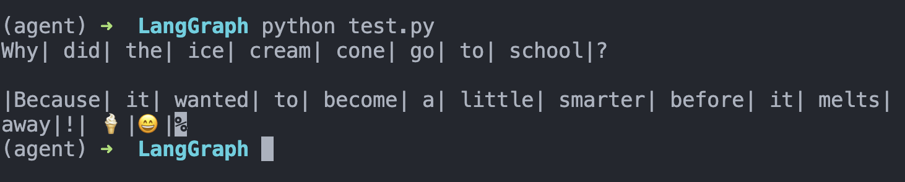

> 这篇建议和 LangChain 的流式输出一起对照着看：LangChain 更偏模型/agent 侧，LangGraph 更偏整张图的运行时事件。

> 可结合LangChain的流一起看

## 1. 介绍

在入门章节，我们就用到了Graph的stream_mode，提到和agent的有所不同。

LangGraph 图提供stream（同步）和astream（异步）方法，以迭代器形式生成流式输出。传入一个或多个流模式来控制接收的数据内容。
```python
for chunk in graph.stream(
    {"topic": "ice cream"},
    stream_mode=["updates", "custom"],
    version="v2",
):
    if chunk["type"] == "updates":
        for node_name, state in chunk["data"].items():
            print(f"Node {node_name} updated: {state}")
    elif chunk["type"] == "custom":
        print(f"Status: {chunk['data']['status']}")
```
```txt
Status: thinking of a joke...
Node generate_joke updated: {'joke': 'Why did the ice cream go to school? To get a sundae education!'}
```

## 2. 流输出格式 (v2)

### (1) stream mode
向version="v2"传入stream()或astream()以获取统一的输出格式。每个数据块均为一个StreamPart字典，具有固定结构：
```json
{
    "type": "values" | "updates" | "messages" | "custom" | "checkpoints" | "tasks" | "debug",
    "ns": (),           # namespace tuple, populated for subgraph events
    "data": ...,        # the actual payload (type varies by stream mode)
}
```

每种流模式都有对应的TypedDict，包含ValuesStreamPart、UpdatesStreamPart、MessagesStreamPart、CustomStreamPart、CheckpointStreamPart、TasksStreamPart、DebugStreamPart（对应7种streammode）

在 v1 版本（默认）中，输出格式会根据你的流式传输选项而变化（单模式返回原始数据，多模式返回(mode, data) 元组，子图返回(namespace, data) 元组）。在 v2 版本中，格式始终保持一致。

可以看到，这里的v1、v2区别，实际和LangChain Agent的模式选择一样，v2都是有更格式化的输出（即StreamPart）。当时提到但是还不够详细，这里细致拆解一下StreamPart：
- type="values"：每一步后的完整状态快照；data 是完整 state（full state）。
- type="updates"：节点执行后对 state 的增量更新；data 形如 {"node_name": {"changed_key": value}}。
- type="messages"：LLM 消息流；data 通常是 (message_chunk, metadata)。
- type="custom"：来自 get_stream_writer() 主动写出的自定义事件；data 就是 writer({...}) 传入的内容。
- type="checkpoints"：checkpoint 事件流；data 是检查点快照信息（类似 get_state 返回结构）。
- type="tasks"：任务生命周期事件（开始/结束/结果/错误）；data 是任务执行信息。
- type="debug"：最全量调试事件；data 包含更完整的执行上下文与诊断信息。

下面，我放一个最小的message用法示例，它定义了图状态，用stream执行图，然后实现了逐token输出：
```python
from dataclasses import dataclass

from langchain.chat_models import init_chat_model
from langgraph.graph import StateGraph, START


@dataclass
class MyState:
    topic: str
    joke: str = ""


model = init_chat_model(model="gpt-4.1-mini")

def call_model(state: MyState):
    """Call the LLM to generate a joke about a topic"""
    # Note that message events are emitted even when the LLM is run using .invoke rather than .stream
    model_response = model.invoke(
        [
            {"role": "user", "content": f"Generate a joke about {state.topic}"}
        ]
    )
    return {"joke": model_response.content}

graph = (
    StateGraph(MyState)
    .add_node(call_model)
    .add_edge(START, "call_model")
    .compile()
)

# The "messages" stream mode streams LLM tokens with metadata
# Use version="v2" for a unified StreamPart format
for chunk in graph.stream(
    {"topic": "ice cream"},
    stream_mode="messages",
    version="v2",
):
    if chunk["type"] == "messages":
        message_chunk, metadata = chunk["data"]
        if message_chunk.content:
            print(message_chunk.content, end="|", flush=True)
```




至于ns 是事件来源的命名空间路径，用来标识这个 stream chunk 来自哪一层图。比如：
- ns == ()：来自主图（root graph）
- ns == ("node_2:<task_id>",)：来自 node_2 调用的子图
- ns == ("child:<id>", "child_1:<id>")：来自更深层嵌套子图

我们可以通过 chunk["type"] 过滤数据块，并获得正确的负载类型。每个分支都会将 part["data"] 收窄为对应模式的特定类型：
```python
for part in graph.stream(
    {"topic": "ice cream"},
    stream_mode=["values", "updates", "messages", "custom"],
    version="v2",
):
    if part["type"] == "values":
        # ValuesStreamPart — full state snapshot after each step
        print(f"State: topic={part['data']['topic']}")
    elif part["type"] == "updates":
        # UpdatesStreamPart — only the changed keys from each node
        for node_name, state in part["data"].items():
            print(f"Node `{node_name}` updated: {state}")
    elif part["type"] == "messages":
        # MessagesStreamPart — (message_chunk, metadata) from LLM calls
        msg, metadata = part["data"]
        print(msg.content, end="", flush=True)
    elif part["type"] == "custom":
        # CustomStreamPart — arbitrary data from get_stream_writer()
        print(f"Progress: {part['data']['progress']}%")
```
## (2) 过滤
我们之前在LangChain核心组件Models中就学过，init_chat_model的时候用config参数，添加额外字典，从而对运行时的行为控制。

不过这里是不同的层级，直接在init_model_model里面加入tags，是专门给模型实例设置默认标签，每次调用都会带上。我们可以通过这个元信息，直接过滤：

```python
from langchain.chat_models import init_chat_model

# model_1 is tagged with "joke"
model_1 = init_chat_model(model="gpt-4.1-mini", tags=['joke'])
# model_2 is tagged with "poem"
model_2 = init_chat_model(model="gpt-4.1-mini", tags=['poem'])

graph = ... # define a graph that uses these LLMs

# The stream_mode is set to "messages" to stream LLM tokens
# The metadata contains information about the LLM invocation, including the tags
async for chunk in graph.astream(
    {"topic": "cats"},
    stream_mode="messages",
    version="v2",
):
    if chunk["type"] == "messages":
        msg, metadata = chunk["data"]
        # Filter the streamed tokens by the tags field in the metadata to only include
        # the tokens from the LLM invocation with the "joke" tag
        if metadata["tags"] == ["joke"]:
            print(msg.content, end="|", flush=True)
```

或者，我们还可以按照node name过滤，或者按照自定义的字段过滤……总之，就是简单的python逻辑。


## (3) nostream

使用 nostream 标签可将大语言模型的输出完全排除在流式传输之外。标记为 nostream 的调用仍会正常执行并生成输出，只是其词元不会在 messages 模式下发送。(这里nostream是写在config字段下面的)

该功能适用于以下场景：
- 需要大语言模型输出用于内部处理（例如结构化输出），但不希望将其流式传输给客户端
- 通过其他通道（例如自定义界面消息）流式传输相同内容，且希望避免 messages 流中出现重复输出

举例如下：
```python
from typing import Any, TypedDict

from langchain_anthropic import ChatAnthropic
from langgraph.graph import START, StateGraph

stream_model = ChatAnthropic(model_name="claude-3-haiku-20240307")
internal_model = ChatAnthropic(model_name="claude-3-haiku-20240307").with_config(
    {"tags": ["nostream"]}
)


class State(TypedDict):
    topic: str
    answer: str
    notes: str


def answer(state: State) -> dict[str, Any]:
    r = stream_model.invoke(
        [{"role": "user", "content": f"Reply briefly about {state['topic']}"}]
    )
    return {"answer": r.content}


def internal_notes(state: State) -> dict[str, Any]:
    # Tokens from this model are omitted from stream_mode="messages" because of nostream
    r = internal_model.invoke(
        [{"role": "user", "content": f"Private notes on {state['topic']}"}]
    )
    return {"notes": r.content}


graph = (
    StateGraph(State)
    .add_node("write_answer", answer)
    .add_node("internal_notes", internal_notes)
    .add_edge(START, "write_answer")
    .add_edge("write_answer", "internal_notes")
    .compile()
)

initial_state: State = {"topic": "AI", "answer": "", "notes": ""}
stream = graph.stream(initial_state, stream_mode="messages")
```
