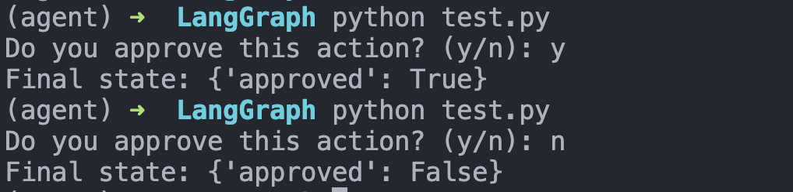

> 如果说持久化让图“记得住”，那 `interrupt` 则让图第一次真正具备“暂停下来等人类决定再继续”的能力。

中断功能可让你在指定节点暂停图执行流程，并等待外部输入后再继续运行。这支持需要外部输入才能推进的human-in-the-loop模式。当中断触发时，LangGraph 会通过其持久化层保存图状态，并无限期等待，直到你恢复执行。

中断的实现方式是在图节点的任意位置调用interrupt()函数。该函数可接收任意可 JSON 序列化的值，并将其暴露给调用方。当你准备继续时，可通过Command重新调用图来恢复执行，该 Command 会成为节点内部interrupt()调用的返回值。

与静态断点（在特定节点前后暂停）不同，中断是动态的：可置于代码任意位置，并可根据应用逻辑设置条件触发。
- 检查点会保留当前状态：检查点写入器会保存完整的图状态，即使处于错误状态，后续也可恢复执行。
- thread_id 是状态指针：设置 config={"configurable": {"thread_id": ...}} 告诉检查点加载哪个状态。
- 中断载荷通过 chunk["interrupts"] 暴露：使用 version="v2" 流式传输时，传入interrupt()的值会出现在values流片段的interrupts字段中，便于知晓图正在等待什么。

选择thread_id本质上是持久化游标。重复使用可恢复同一检查点；使用新值则会以空状态启动全新线程。

## 1. 用interrupt暂停
interrupt函数会暂停图执行并向调用方返回一个值。在节点内调用interrupt时，LangGraph 会保存当前图状态，并等待你通过输入恢复执行。

使用interrupt需要满足：
- 一个检查点存储器用于持久化图状态（生产环境请使用持久化检查点存储器）
- 配置中包含线程 ID，使运行时知道从哪个状态恢复
- 在需要暂停的位置调用interrupt()（负载必须可 JSON 序列化）


调用interrupt时，会发生以下过程：
- 图执行会在调用interrupt的精确位置暂停
- 状态会通过检查点保存，以便后续恢复执行；生产环境中应使用持久化检查点（如基于数据库实现）
- 返回值会以__interrupt__标识返回给调用方；该值可以是任意可 JSON 序列化类型（字符串、对象、数组等）
- 图将无限期等待，直到你通过响应恢复执行
- 恢复时响应会传回节点，并成为interrupt()调用的返回值

下面有一个简单的动作批准函数：

```python
from typing_extensions import TypedDict

from langgraph.checkpoint.memory import MemorySaver
from langgraph.graph import END, START, StateGraph
from langgraph.types import Command, interrupt


class State(TypedDict):
    approved: bool


def approval_node(state: State):
    # 运行到这里会暂停，并把这段提示抛给调用方
    approved = interrupt("Do you approve this action?")
    # 恢复时，Command(resume=...) 传入的值会回到 approved
    return {"approved": approved}


checkpointer = MemorySaver()
graph = (
    StateGraph(State)
    .add_node("approval", approval_node)
    .add_edge(START, "approval")
    .add_edge("approval", END)
    .compile(checkpointer=checkpointer)
)

config = {"configurable": {"thread_id": "approval-demo"}}

# 第一次执行：会在 interrupt() 处暂停
result = graph.invoke({"approved": False}, config)
interrupts = result.get("__interrupt__", ())

if interrupts:
    question = interrupts[0].value
    user_text = input(f"{question} (y/n): ").strip().lower()
    approved = user_text in {"y", "yes", "true", "1"}

    # 第二次执行：用 Command(resume=...) 恢复
    result = graph.invoke(Command(resume=approved), config)
    print("Final state:", result)
else:
    print("No interrupt happened:", result)

```

这其中，result的真实格式如下：
```txt
{
  "approved": False,
  "__interrupt__": [
    Interrupt(
      value="Do you approve this action?",
      id="7e5f3e800a66e12f26f09eca9a35ac50"
    )
  ]
}
```

我们知道，原始invoke一个节点的时候，会返回整个state，其中我们关注的比较多的是包含AIMessage/ToolMessage/HumanMessage等的state["messages"]通道，但是这个state里面还有我们自己定义的approved:bool，所以也会被放在state中供我们查阅和更新。

最终效果如下：



## 2. 常见工作模式
中断机制的核心价值在于能够暂停执行流程并等待外部输入。这一特性适用于多种应用场景，包括：
- 审批工作流：执行关键操作（API 调用、数据库修改、金融交易）前暂停
- 处理多中断：单次调用中恢复多个中断时，将中断 ID 与恢复值配对
- 审核与编辑：允许人工在继续执行前审核并修改大模型输出或工具调用
- 中断工具调用：执行工具调用前暂停，以便审核和编辑工具调用内容
- 验证人工输入：进入下一步前暂停，以验证人工输入

### 2.1 审批工作流

这是最常见的用法：在执行关键动作前先暂停，把动作详情抛给人工，人工批准后再继续，不批准则走取消分支。

```python
from typing import Literal, Optional
from typing_extensions import TypedDict

from langgraph.checkpoint.memory import MemorySaver
from langgraph.graph import StateGraph, START, END
from langgraph.types import Command, interrupt


class ApprovalState(TypedDict):
    action_details: str
    status: Optional[Literal["pending", "approved", "rejected"]]


def approval_node(state: ApprovalState) -> Command[Literal["proceed", "cancel"]]:
    decision = interrupt({
        "question": "Approve this action?",
        "details": state["action_details"],
    })
    return Command(goto="proceed" if decision else "cancel")


def proceed_node(state: ApprovalState):
    return {"status": "approved"}


def cancel_node(state: ApprovalState):
    return {"status": "rejected"}


graph = (
    StateGraph(ApprovalState)
    .add_node("approval", approval_node)
    .add_node("proceed", proceed_node)
    .add_node("cancel", cancel_node)
    .add_edge(START, "approval")
    .add_edge("proceed", END)
    .add_edge("cancel", END)
    .compile(checkpointer=MemorySaver())
)

config = {"configurable": {"thread_id": "approval-1"}}

first = graph.invoke(
    {"action_details": "Transfer $500", "status": "pending"},
    config=config,
)
print(first["__interrupt__"])

final = graph.invoke(Command(resume=True), config=config)
print(final)
```

这里 `Command(resume=True)` 表示批准，`Command(resume=False)` 表示拒绝。节点恢复后，会根据这个布尔值决定跳转到哪个节点。

### 2.2 处理多中断

当图里有并行分支，而且多个分支同时执行到 `interrupt()` 时，一次运行里可能会返回多个中断。此时恢复时不能只传一个值，而是要把每个中断的 `id` 和它对应的恢复值配对起来。

```python
from typing import Annotated
from typing_extensions import TypedDict
import operator

from langgraph.checkpoint.memory import InMemorySaver
from langgraph.graph import START, END, StateGraph
from langgraph.types import Command, interrupt


class State(TypedDict):
    vals: Annotated[list[str], operator.add]


def node_a(state: State):
    answer = interrupt("question_a")
    return {"vals": [f"a:{answer}"]}


def node_b(state: State):
    answer = interrupt("question_b")
    return {"vals": [f"b:{answer}"]}


graph = (
    StateGraph(State)
    .add_node("a", node_a)
    .add_node("b", node_b)
    .add_edge(START, "a")
    .add_edge(START, "b")
    .add_edge("a", END)
    .add_edge("b", END)
    .compile(checkpointer=InMemorySaver())
)

config = {"configurable": {"thread_id": "multi-interrupt-1"}}

first = graph.invoke({"vals": []}, config=config)
interrupts = first["__interrupt__"]

resume_map = {
    interrupt_obj.id: f"answer for {interrupt_obj.value}"
    for interrupt_obj in interrupts
}

final = graph.invoke(Command(resume=resume_map), config=config)
print(final)
```

也就是说：
- 单个中断时，`resume` 可以直接传一个值
- 多个中断时，`resume` 应该传一个字典：`{interrupt_id: resume_value}`

### 2.3 审核与编辑

这种模式不是简单地“同意/拒绝”，而是把当前状态中的某一部分内容交给人工修改，然后把修改后的内容写回 state。

```python
from typing_extensions import TypedDict

from langgraph.checkpoint.memory import MemorySaver
from langgraph.graph import StateGraph, START, END
from langgraph.types import Command, interrupt


class ReviewState(TypedDict):
    generated_text: str


def review_node(state: ReviewState):
    updated = interrupt({
        "instruction": "Review and edit this content",
        "content": state["generated_text"],
    })
    return {"generated_text": updated}


graph = (
    StateGraph(ReviewState)
    .add_node("review", review_node)
    .add_edge(START, "review")
    .add_edge("review", END)
    .compile(checkpointer=MemorySaver())
)

config = {"configurable": {"thread_id": "review-1"}}

first = graph.invoke({"generated_text": "Initial draft"}, config=config)
print(first["__interrupt__"])

final = graph.invoke(
    Command(resume="Improved draft after review"),
    config=config,
)
print(final)
```

这里恢复时传入的不是布尔值，而是“人工编辑后的最终文本”。这个值会直接成为 `interrupt()` 的返回值，再被写回 `generated_text`。

### 2.4 中断工具调用

`interrupt()` 不一定只能写在普通节点里，也可以直接写在工具函数里。这样当模型调用这个工具时，工具会先暂停，等待人工审批或修改参数，之后才真正执行。

```python
from langchain_core.tools import tool
from langgraph.types import interrupt


@tool
def send_email(to: str, subject: str, body: str):
    """Send an email to a recipient."""
    response = interrupt({
        "action": "send_email",
        "to": to,
        "subject": subject,
        "body": body,
        "message": "Approve sending this email?",
    })

    if response.get("action") == "approve":
        final_to = response.get("to", to)
        final_subject = response.get("subject", subject)
        final_body = response.get("body", body)
        return f"Email sent to {final_to} with subject '{final_subject}'"

    return "Email cancelled by user"
```

这种方式常见于：
- 发邮件
- 调外部 API
- 写数据库
- 下单、转账、删除记录

也就是说，人工不仅可以批准，还可以顺手修改工具参数，然后再继续执行。

### 2.5 验证人工输入

有些场景下，人工输入本身可能不合法。这时可以在同一个节点里循环调用 `interrupt()`，直到拿到合法输入为止。

```python
from langgraph.types import interrupt


def get_age_node(state):
    prompt = "What is your age?"

    while True:
        answer = interrupt(prompt)

        if isinstance(answer, int) and answer > 0:
            break
        else:
            prompt = f"'{answer}' is not a valid age. Please enter a positive number."

    return {"age": answer}
```

使用方式如下：
- 第一次暂停，提示 `"What is your age?"`
- 如果恢复时传入 `"thirty"`，校验不通过，会再次 `interrupt()`
- 再恢复时传入 `30`，校验通过，节点才真正返回

这一模式很适合：
- 表单采集
- 参数确认
- 需要严格类型或格式的人工输入
