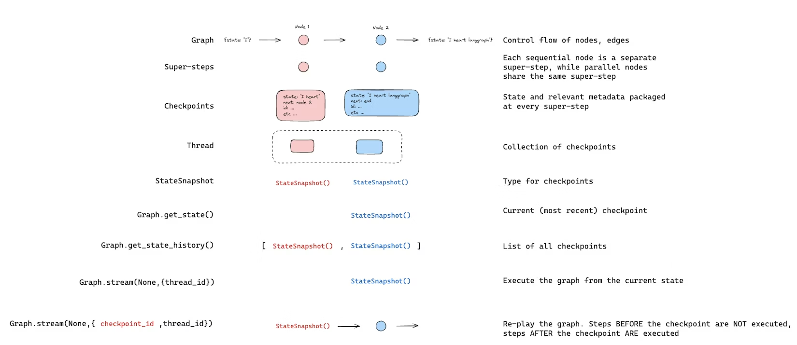
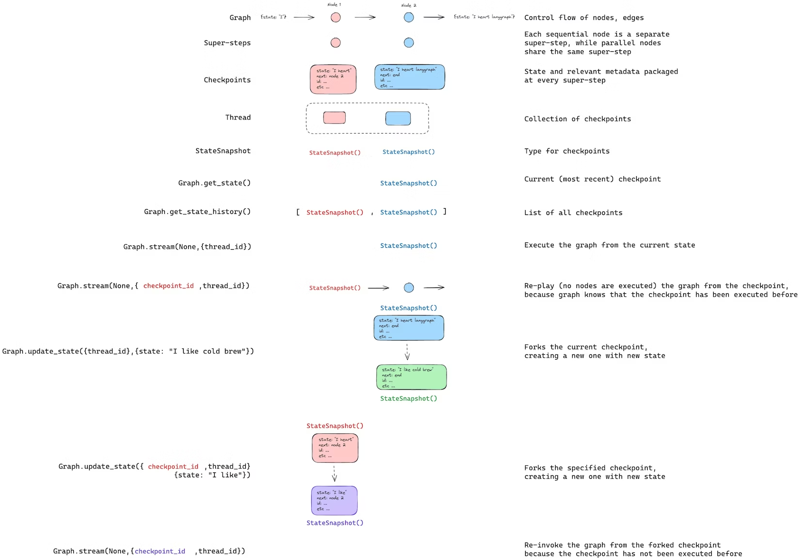

# LangGraph能力 - 时间旅行 (Time-travel)

LangGraph 支持通过检查点实现时间回溯：
- 重放：从先前的检查点重新执行。
- 分支：从先前的检查点以修改后的状态分叉，探索其他执行路径。

两者均通过从先前检查点恢复运行。检查点之前的节点不会重新执行（结果已保存）。检查点之后的节点会重新执行，包括所有大模型调用、API 请求以及中断（可能产生不同结果）。

## 1. 重放 (Replay)

使用先前检查点的配置调用图，从该点开始重放。



使用get_state_history找到你希望从中重放的检查点，然后使用该检查点的配置调用invoke：
```python
from langgraph.graph import StateGraph, START
from langgraph.checkpoint.memory import InMemorySaver
from typing_extensions import TypedDict, NotRequired
import uuid

class State(TypedDict):
    topic: NotRequired[str]
    joke: NotRequired[str]


def generate_topic(state: State):
    return {"topic": "socks in the dryer"}


def write_joke(state: State):
    return {"joke": f"Why do {state['topic']} disappear? They elope!"}


checkpointer = InMemorySaver()
graph = (
    StateGraph(State)
    .add_node("generate_topic", generate_topic)
    .add_node("write_joke", write_joke)
    .add_edge(START, "generate_topic")
    .add_edge("generate_topic", "write_joke")
    .compile(checkpointer=checkpointer)
)

# Step 1: Run the graph
config = {"configurable": {"thread_id": str(uuid.uuid4())}}
result = graph.invoke({}, config)

# Step 2: Find a checkpoint to replay from
history = list(graph.get_state_history(config))
# History is in reverse chronological order
for state in history:
    print(f"next={state.next}, checkpoint_id={state.config['configurable']['checkpoint_id']}")

# Step 3: Replay from a specific checkpoint
# Find the checkpoint before write_joke
before_joke = next(s for s in history if s.next == ("write_joke",))
replay_result = graph.invoke(None, before_joke.config)
# write_joke re-executes (runs again), generate_topic does not
```
这里稍微复习一下细节，这里TypedDict让字典定义可以写类型，并且写了NotRequired，所以invoke的时候传入{}也是合法的。如果你有印象，我们在LangChain的invoke中会传入一个Message列表，这个列表可以是AIMessage、HumanMessage等的对象，也可以是content block。invoke聊天图的时候，传入的一定要是state的一部分，比如
```txt
graph.invoke({
    "messages": [
        {"role": "user", "content": "你好"}
    ]
})
```

持久化在前面章节介绍过了，我们用graph.get_state_history(config)会得到一个历史快照的迭代器，list化之后可以拿到一个这个thread_id下的所有历史快照（每个超步保存的一个StateSnapshot），我们这时候就可以看看保存的信息。

然后，我们用`before_joke = next(s for s in history if s.next == ("write_joke",))`，从列表中找到第一个准备开始写笑话之前的节点，在这个图中指的就是generate_topic，然后我们就可以从这个存档开始继续跑，前面置None不传入信息，后面放入找到的历史快照。

## 2. 分支 (Fork)

分叉会从过往的一个检查点创建一个新分支，并修改状态。对先前的检查点调用update_state以创建分叉，随后使用None调用invoke来继续执行。



```python
# Find checkpoint before write_joke
history = list(graph.get_state_history(config))
before_joke = next(s for s in history if s.next == ("write_joke",))

# Fork: update state to change the topic
fork_config = graph.update_state(
    before_joke.config,
    values={"topic": "chickens"},
)

# Resume from the fork — write_joke re-executes with the new topic
fork_result = graph.invoke(None, fork_config)
print(fork_result["joke"])  # A joke about chickens, not socks
```
graph.update_state(...)会基于旧checkpoint创建新的checkpoint分支，传入历史checkpoint的config，放入要更新的state字段就行了。


## 3. 能力总结

时间旅行适合进行调试、人工审核或者分叉试验。当我们想进行正常循环的时候，比如经典的“生成 -> 评估 -> 不满意就继续改”，或者拿官腔说是evaluator-optimizer的时候，可以直接在图上做环就行了。
```txt
generator -> evaluator -> conditional edge
                         pass -> END
                         fail -> generator
```

如果一直用时间回溯，虚拟的未来会越来越多。旧checkpoint还在，新checkpoint继续加进去，内存都会保存到python的进程内存中，越来越臃肿。

旧的checkpoint我们可以通过两种方式清理：
- 直接删除整条thread，`checkpointer.delete_thread(thread_id)`
- 用LangSmith或者Agent Server配置TTL
