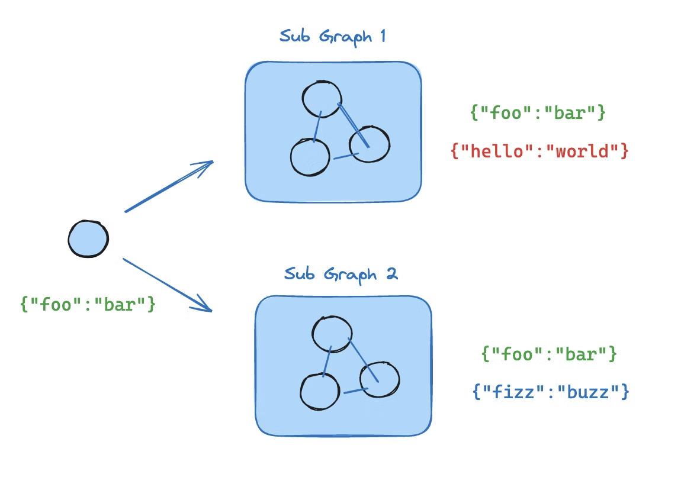

# LangGraph能力 - Subgraphs (子图)
子图是一种在另一张图中作为图节点使用的节点。适用于以下场景：
- 构建多智能体系统
- 在多张图中复用一组节点
- 分布式开发：当需要不同团队独立负责图的不同部分时，可将各部分定义为子图。只要遵循子图接口（输入与输出模式），父图即可在无需了解子图任何细节的情况下完成构建

添加子图时，需要定义父图与子图之间的通信方式：
| 模式                   | 适用场景                                                                           | 状态 schema 特点                                                                  |
| ---------------------- | ---------------------------------------------------------------------------------- | --------------------------------------------------------------------------------- |
| 在节点内部调用子图     | 父图和子图的状态 schema 不同，二者没有共享键；或者你需要在父图与子图之间做状态转换 | 需要自己写一个包装节点，把父图 state 映射成子图输入，再把子图输出映射回父图 state |
| 将子图直接作为节点加入 | 父图和子图共享部分状态键；子图可以直接读写父图的同一批 state channel               | 直接把编译好的子图传给 `add_node`，不需要额外包装函数                             |


## 1. 节点内部调用：

当父图与子图拥有不同的状态结构（无共享键）时，需在节点函数内部调用子图。这种做法常见于多智能体系统中需要为每个智能体保留独立消息历史的场景。

节点函数会在调用子图前将父图状态转换为子图状态，并在返回前将结果转换回父图状态。
```python
from typing_extensions import TypedDict
from langgraph.graph.state import StateGraph, START

class SubgraphState(TypedDict):
    bar: str

# Subgraph

def subgraph_node_1(state: SubgraphState):
    return {"bar": "hi! " + state["bar"]}

def subgraph_node_2(state: SubgraphState):
    return {"bar": state["bar"] + "!"}

subgraph_builder = StateGraph(SubgraphState)
subgraph_builder.add_node(subgraph_node_1)
subgraph_builder.add_node(subgraph_node_2)
subgraph_builder.add_edge(START, "subgraph_node_1")
subgraph_builder.add_edge("subgraph_node_1", "subgraph_node_2")
subgraph = subgraph_builder.compile()

# Parent graph

class State(TypedDict):
    foo: str

def call_subgraph(state: State):
    # Transform the state to the subgraph state
    subgraph_output = subgraph.invoke({"bar": state["foo"]})
    # Transform response back to the parent state
    return {"foo": subgraph_output["bar"]}

builder = StateGraph(State)
builder.add_node("node_1", call_subgraph)
builder.add_edge(START, "node_1")
graph = builder.compile()
```

因为父图和子图的state不一样，上例用了一个`call_subgraph`包装，来把父图的状态转化为子图的输入，再把子图的输出转回父图的状态。


## 2. 子图作为node加入

当父图与子图共享状态键（State）时，可将编译后的子图直接传入add_node。无需包装函数 —— 子图会自动读写父图的状态通道。例如，在多智能体系统中，智能体通常通过共享的messages键进行通信。



如果子图与父图共享状态键，可按照以下步骤将其添加到你的图中：
- 定义子图工作流（下方示例中的subgraph_builder）并对其进行编译
- 在定义父图工作流时，将编译后的子图传入add_node方法

```python
from typing_extensions import TypedDict
from langgraph.graph.state import StateGraph, START

class State(TypedDict):
    foo: str

# Subgraph

def subgraph_node_1(state: State):
    return {"foo": "hi! " + state["foo"]}

def subgraph_node_2(state: State):
    return {"foo": state["foo"] + "!"}

subgraph_builder = StateGraph(State)
subgraph_builder.add_node(subgraph_node_1)
subgraph_builder.add_node(subgraph_node_2)
subgraph_builder.add_edge(START, "subgraph_node_1")
subgraph_builder.add_edge("subgraph_node_1", "subgraph_node_2")
subgraph = subgraph_builder.compile()

# Parent graph

builder = StateGraph(State)
builder.add_node("node_1", subgraph)
builder.add_edge(START, "node_1")
graph = builder.compile()
```

只要有共享的 state key，就可以直接作为 node 加入，同时子图还可以有自己私有的 key，也就是说，子图结构可以比父图更复杂。

## 3. 流式看到子图内部执行

只需要调整一个参数就可以，然后，我们就可以通过chunk["ns"] 看这个事件来自哪里，ns == ()表示是主图，如果来自某个子图可能是`ns == ("node_2:<task_id>",)`。

```python
graph.stream(..., subgraphs=True, version="v2")
```

## 4. 子图的持久化模式

子图在 compile() 时，checkpointer 有 3 种模式：

checkpointer=None
- 默认
- 每次调用子图都从头开始
- 但单次调用内部仍继承父图 checkpointer，支持 interrupt / durable execution

checkpointer=True
- 子图按 thread 持续积累状态
- 下次调用同一个子图时，会接着上次记忆继续
- 适合“子 agent 自己也要有多轮记忆”

checkpointer=False
- 完全无 checkpoint
- 像普通函数调用
- 不支持 interrupt / durable execution

对于有多个“有记忆的子图”命名时，我们要给稳定的namespace进行空间隔离。

## 5. 查询子图状态

我们通过`graph.get_state(config, subgraphs=True)`来获取快照，然后可以用`.tasks[0].state`来看子图的内部状态。

下面给一个最小的可运行子图示例，包含了子图持久化、namespace隔离、查询子图状态、查看子图流输出等，包含详细注释：

```python
from typing_extensions import TypedDict, NotRequired
from langgraph.graph import StateGraph, START
from langgraph.checkpoint.memory import InMemorySaver


# -----------------------------
# 1) 父图 state
# -----------------------------
# 父图只关心共享字段：
# - request: 输入任务
# - result: 子图处理后的结果
class ParentState(TypedDict):
    request: str
    result: NotRequired[str]


# -----------------------------
# 2) 子图 state
# -----------------------------
# 子图既可以读写父图共享键，也可以维护自己的私有键：
# - request: 与父图共享
# - result: 与父图共享
# - visits: 子图私有，用来证明“子图会跨调用记忆”
# - agent_name: 子图私有
class SubgraphState(TypedDict):
    request: str
    result: NotRequired[str]
    visits: NotRequired[int]
    agent_name: NotRequired[str]


def build_agent_subgraph(label: str):
    """构造一个最小子图。
    
    这个子图只有一个节点：
    - 每次被调用时，把 visits + 1
    - 写入自己的私有状态 agent_name / visits
    - 同时更新与父图共享的 result
    """

    def remember(state: SubgraphState):
        # 这里的 visits 是子图自己的内部状态。
        # 如果子图开启了 per-thread 持久化，那么同一 thread 下多次调用会持续累加。
        visits = state.get("visits", 0) + 1

        return {
            "visits": visits,
            "agent_name": label,
            "result": f"{label} handled '{state['request']}' (visit {visits})",
        }

    builder = StateGraph(SubgraphState)
    builder.add_node("remember", remember)
    builder.add_edge(START, "remember")

    # 关键点 1：
    # checkpointer=True 表示这个子图拥有“per-thread 持久化”。
    # 同一个 thread_id 下，下次再调用这个子图时，它会记得上次的内部状态。
    return builder.compile(checkpointer=True)


# -----------------------------
# 3) 构造两个子图
# -----------------------------
research_agent = build_agent_subgraph("research")
writer_agent = build_agent_subgraph("writer")


# -----------------------------
# 4) 父图把子图直接作为节点加入
# -----------------------------
parent_builder = StateGraph(ParentState)

# 关键点 2：
# 这里直接把“编译好的子图”传给 add_node。
# 因为父图和子图共享 request/result 这两个键，所以不需要额外包装函数。
parent_builder.add_node("research_agent", research_agent)
parent_builder.add_node("writer_agent", writer_agent)

parent_builder.add_edge(START, "research_agent")
parent_builder.add_edge("research_agent", "writer_agent")

# 父图本身也需要一个 checkpointer。
# 没有父图 checkpointer，子图的持久化/检查/中断能力都没法正常工作。
checkpointer = InMemorySaver()
graph = parent_builder.compile(checkpointer=checkpointer)

config = {"configurable": {"thread_id": "demo-thread"}}


# -----------------------------
# 5) 第一次调用
# -----------------------------
print("=== Run 1 ===")
result1 = graph.invoke({"request": "first task"}, config)
print(result1)
# 预期：
# {'request': 'first task', 'result': "writer handled 'first task' (visit 1)"}


# -----------------------------
# 6) 第二次调用（同一个 thread）
# -----------------------------
print("\n=== Run 2 ===")
result2 = graph.invoke({"request": "second task"}, config)
print(result2)
# 预期：
# research 子图和 writer 子图都会各自把 visits 从 1 累加到 2
# 最终 result 会显示 writer handled ... (visit 2)


# -----------------------------
# 7) 看流式输出，观察 namespace 隔离
# -----------------------------
print("\n=== Stream Run 3 ===")
for chunk in graph.stream(
    {"request": "third task"},
    config,
    stream_mode="updates",
    subgraphs=True,
    version="v2",
):
    if chunk["type"] == "updates":
        print("ns =", chunk["ns"], "data =", chunk["data"])

# 你会看到类似：
# ns = ('research_agent',) ...
# ns = () ...
# ns = ('writer_agent',) ...
# ns = () ...
#
# 这说明：
# - research_agent 子图的内部更新进入了它自己的 namespace
# - writer_agent 子图的内部更新进入了它自己的 namespace
# - 这就是“namespace 隔离”
#
# 由于这两个子图是“作为不同节点加入父图”的，
# LangGraph 会自动按节点名给它们稳定分配 namespace。


# -----------------------------
# 8) 查询子图自己的最新状态
# -----------------------------
# 关键点 3：
# 图执行完以后，想稳定读取某个子图的状态，
# 最直接的方法是显式指定 checkpoint_ns。

research_state = graph.get_state(
    {
        "configurable": {
            "thread_id": "demo-thread",
            "checkpoint_ns": "research_agent",
        }
    }
)

writer_state = graph.get_state(
    {
        "configurable": {
            "thread_id": "demo-thread",
            "checkpoint_ns": "writer_agent",
        }
    }
)

print("\n=== Latest research subgraph state ===")
print(research_state.values)
# 预期类似：
# {
#   'request': 'third task',
#   'result': "research handled 'third task' (visit 3)",
#   'visits': 3,
#   'agent_name': 'research'
# }

print("\n=== Latest writer subgraph state ===")
print(writer_state.values)
# 预期类似：
# {
#   'request': 'third task',
#   'result': "writer handled 'third task' (visit 3)",
#   'visits': 3,
#   'agent_name': 'writer'
# }


# -----------------------------
# 9) 可选：查看底层 checkpoint，观察 namespace
# -----------------------------
print("\n=== Raw checkpoint namespaces ===")
for ckpt in checkpointer.list({"configurable": {"thread_id": "demo-thread"}}):
    cfg = ckpt.config["configurable"]
    print("checkpoint_ns =", cfg["checkpoint_ns"], "checkpoint_id =", cfg["checkpoint_id"])
```
