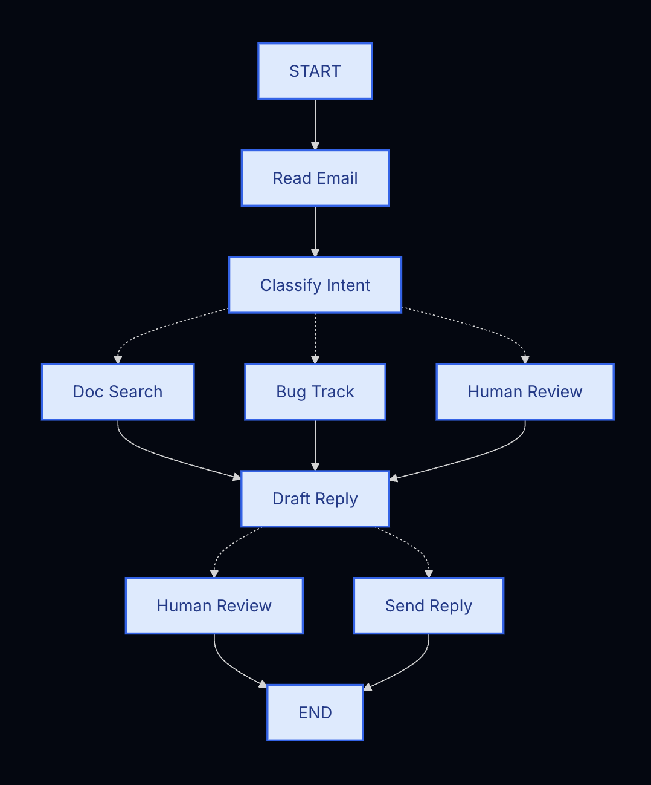

# 用LangGraph构建Agent的思路

> 本章提供一种构建自己Agent的一种思路入手

## 1. 从想要的自动化流程入手

例如，你需要构建一个用于处理客户支持邮件的 AI 智能体。产品团队向你提出了以下需求：
```txt
The agent should:

- Read incoming customer emails
- Classify them by urgency and topic
- Search relevant documentation to answer questions
- Draft appropriate responses
- Escalate complex issues to human agents
- Schedule follow-ups when needed

Example scenarios to handle:

1. Simple product question: "How do I reset my password?"
2. Bug report: "The export feature crashes when I select PDF format"
3. Urgent billing issue: "I was charged twice for my subscription!"
4. Feature request: "Can you add dark mode to the mobile app?"
5. Complex technical issue: "Our API integration fails intermittently with 504 errors"
```

## 2. 拆解为独立步骤

首先明确流程中的各个独立步骤，每个步骤将成为一个节点（执行单一具体功能的函数）。然后勾勒出这些步骤之间的连接关系。



此图表中的箭头表示可能的路径，但具体选择哪条路径的决策在每个节点内部完成。
既然我们已经确定了工作流中的各个组件，接下来了解每个节点需要执行的操作：
- Read Email：提取并解析邮件内容
- Classify Intent：使用大语言模型对紧急程度和主题进行分类，然后路由至相应操作
- Doc Search：在知识库中查询相关信息
- Bug Track：在跟踪系统中创建或更新问题
- Draft Reply：生成合适的回复内容
- Human Review：转交人工坐席进行审批或处理
- Send Reply：发送邮件回复

## 3. 每一步要做什么

为图中的每个节点，确定其代表的操作类型以及正常运行所需的上下文信息。

- LLM steps：当某一步骤需要理解、分析、生成文本或进行推理决策时
- Data steps：当某个步骤需要从外部来源获取信息时
- Action steps：当某个步骤需要执行外部操作时
- User input steps：当某个步骤需要人工介入时

## 4. 设计state

state是智能体中所有节点均可访问的共享存储器。可将其视作智能体在执行任务过程中，用于记录所有学习内容与决策信息的笔记本。这是非常重要的信息。

我们要问自己两个问题：
- 它是否需要在多个步骤间持续存在？如果是，就放入状态中。
- 能否从其他数据推导得出？如果可以，在需要时计算即可，不必存入状态。

## 5. 建立节点

现在我们将每个步骤实现为一个函数。LangGraph 中的节点只是一个 Python 函数，它接收当前状态并返回对状态的更新。

### (1) 错误处理
| 错误类型                                   | 由谁修复     | 处理策略                             | 适用场景                                   |
| ------------------------------------------ | ------------ | ------------------------------------ | ------------------------------------------ |
| 瞬时错误（网络问题、限流等）               | 系统自动处理 | 重试策略（retry policy）             | 这类失败通常是临时性的，重试后大概率恢复   |
| LLM 可恢复错误（工具调用失败、解析失败等） | LLM          | 把错误写入 state，再回到模型节点重试 | 模型能够看到错误信息，并据此调整下一步做法 |
| 用户可修复错误（信息缺失、指令不清）       | 人类用户     | 使用 `interrupt()` 暂停              | 必须等待用户补充信息后才能继续             |
| 非预期错误                                 | 开发者       | 直接向上抛出异常                     | 未知问题，需要调试和排查根因               |

### (2) 实现节点

写node本身。

## 6. 建图

将节点连接成一个可运行的图结构。由于各个节点会自行处理路由决策，我们只需要几条核心的边即可。

## 7. 测试

测试、总结、升级。
