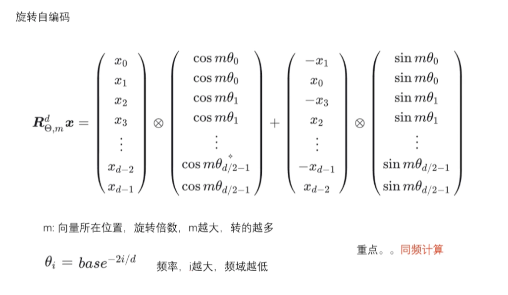
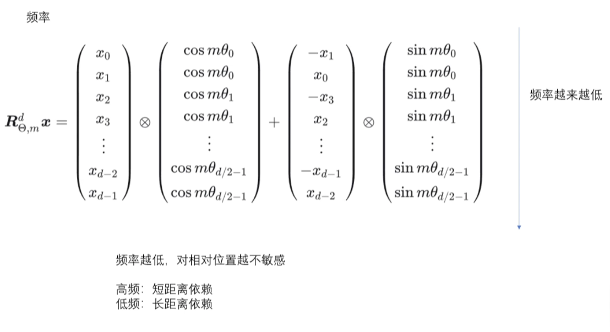
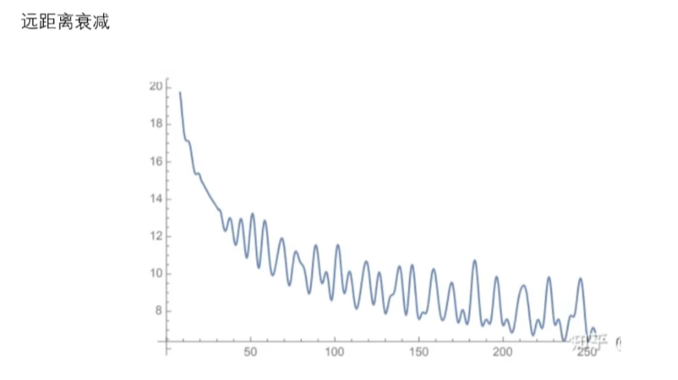

> 预训练是大模型能力的地基。对 GPT（Generative Pre-trained Transformer）/ LLaMA / Qwen 这类 decoder-only Transformer 来说，最核心的目标通常是 next token prediction：给定前面的 token，预测下一个 token。这个目标看起来像文字接龙，但当语料、参数和训练步数一起放大后，模型会在这个过程中学到语言结构、世界知识、代码模式和一部分推理模式。

# 一、预训练流水线总览

GPT 类语言模型的预训练可以按下面这条流水线理解：

```text
语料收集与清洗
-> tokenizer 训练，得到固定词表和切分规则
-> 文本编码，把字符串转成 token ids
-> token embedding，把 token ids 查表成稠密向量
-> 加入位置信息
-> 多层 causal Transformer 混合上下文
-> LM Head（Language Modeling Head）输出每个位置的词表 logits
-> shift labels，计算 next token cross-entropy loss
-> 反向传播，更新模型可训练参数
```

这条线里有两个“训练”要区分：

| 对象 | 训练方式 | 产物 | 是否反向传播 |
| --- | --- | --- | --- |
| Tokenizer | 统计语料中的字符、字节、子词片段，学习切分规则 | vocabulary、merge rules、special tokens | 否 |
| Transformer 语言模型 | 前向传播、loss、反向传播、优化器更新参数 | embedding、attention、MLP（Multi-Layer Perceptron）、LM Head（Language Modeling Head）等权重 | 是 |

tokenizer 训练通常发生在大模型预训练之前。一旦 tokenizer 固定，`vocab_size` 也固定，模型的 embedding 矩阵行数和 LM Head 输出维度都会被确定下来。

# 二、语料准备与文本规范化

预训练的第一步是准备大规模文本语料。常见来源包括网页、书籍、论文、代码仓库、百科、论坛、多语言数据、数学题解和领域文档。

原始语料不能直接进入 tokenizer 和模型，一般要先做数据处理：

- 去重：过滤完全重复和近似重复文本，减少过拟合与训练浪费。
- 去低质：过滤乱码、广告、模板页、SEO 垃圾和低信息密度文本。
- 语言识别：按语言分类或过滤不需要的语言。
- 安全过滤：处理明显有害、违法、隐私和敏感内容。
- 格式清洗：去 HTML 噪声、脚本、导航栏，保留正文结构。
- 版权与许可检查：企业训练时尤其重要。

这里的语料会被用于两件事：

1. 抽样训练 tokenizer，让 tokenizer 学到适合这批语料的词表和切分方式。
2. 正式训练语言模型，让 Transformer 学语言分布。

这两件事可以使用相同来源的数据，但目标不同。tokenizer 关心“字符串如何切成 token 更合适”，模型预训练关心“如何根据上下文预测下一个 token”。

# 三、Tokenizer 训练阶段

神经网络不能直接处理字符串，它只能处理数字。tokenizer 的作用是建立：

```text
字符串片段 <-> token id
```

的映射关系。

训练完成后，tokenizer 通常包含：

- vocabulary：token 字符串到 id 的映射。
- merge rules / model rules：子词合并或切分规则。
- normalizer：文本规范化规则。
- pre-tokenizer：初步切分规则。
- special tokens：特殊控制 token。

## 1. 子词 tokenizer 的基本动机

直接按词切分会遇到很多问题：

- 词表会非常大。
- 新词、错别字、罕见词很难处理。
- 中文、日文等语言没有天然空格边界。
- 代码、数字、URL、emoji、符号混合文本很复杂。
- 多语言模型要在不同语言之间分配词表容量。

因此现代 LLM（Large Language Model，大语言模型）通常使用子词 tokenizer。它允许常见词整体成为 token，也允许罕见词拆成更小片段。

例如：

```text
unhappiness -> un + happi + ness
大语言模型 -> 大 + 语言 + 模型
get_user_id -> get + _user + _id
```

实际切法取决于 tokenizer 算法、训练语料和词表大小。

## 2. BPE 合并规则

BPE，全称 Byte Pair Encoding，是常见 tokenizer 算法之一。

它的核心流程是：

```text
从字符或字节等最小单位开始
-> 统计语料中相邻片段的出现频率
-> 合并最高频的相邻片段
-> 把新片段加入词表
-> 记录这条 merge rule
-> 不断重复，直到达到目标词表大小
```

一个简化例子：

```text
语料：
low
lower
lowest
```

初始拆成字符：

```text
l o w
l o w e r
l o w e s t
```

统计相邻片段频率：

```text
(l, o) 出现 3 次
(o, w) 出现 3 次
(w, e) 出现 2 次
...
```

先合并 `(l, o)`：

```text
lo w
lo w e r
lo w e s t
```

再合并 `(lo, w)`：

```text
low
low e r
low e s t
```

最后词表可能保留：

```text
low
er
est
...
```

于是 `lowest` 可以被编码成：

```text
low + est
```

BPE 学到的不是语义规则，而是基于频率的压缩规则。高频片段更容易成为一个 token，低频片段会被拆开。

## 3. Byte-level BPE

GPT 系模型里常见 byte-level BPE。它从字节出发，而不是从 Unicode 字符出发。

优势是几乎任何文本都能编码，因为任意字符串最终都能表示成字节序列。这样可以减少 `[UNK]` 这类未知 token 的问题。

代价是某些语言、emoji 或特殊符号可能被拆得很碎，导致同样一段文本占用更多 token。

Byte-level BPE 还常常把空格编码进 token。英文模型中经常能看到类似“带前导空格的 token”，比如：

```text
" hello"
" world"
```

这解释了一个现象：同一个单词出现在句首和句中，可能对应不同 token，因为句中单词前面带空格。

## 4. WordPiece 与 Unigram

**WordPiece**

BERT 使用 WordPiece。它也会学习子词片段，但合并标准更接近“让语料似然提升更大”的片段，而不是单纯最高频相邻对。

常见表示：

```text
playing -> play + ##ing
```

其中 `##ing` 表示它是接在词内部的子词。

**Unigram / SentencePiece**

SentencePiece 常用 Unigram Language Model。它通常先构造一个较大的候选子词集合，再不断删除对语料 likelihood 影响较小的子词，最后保留目标词表大小。

SentencePiece 的重要特点是可以直接从原始文本训练，不强依赖空格分词，所以在中文、日文、多语言模型中很常见。它经常用 `▁` 表示空格边界，例如：

```text
▁Transformer
```

## 5. 特殊 token

tokenizer 训练或配置时还会加入特殊 token。常见特殊 token 包括：

```text
<pad>
<unk>
<bos>
<eos>
<system>
<user>
<assistant>
<tool>
```

这些 token 不一定来自普通语料频率统计，而是人为加入，用来表达控制信息。

例如 chat model 会依赖 chat template，把结构化消息：

```json
[
  {"role": "user", "content": "解释 DPO（Direct Preference Optimization）"},
  {"role": "assistant", "content": "DPO（Direct Preference Optimization）是..."}
]
```

渲染成带特殊 token 的文本序列。模型并不是天然理解 `role=user` 这种 JSON 字段，而是学习特殊 token 序列对应的对话模式。

## 6. 词表大小与多语言取舍

`vocab_size` 是 tokenizer 设计里的关键超参。

| 词表大小 | 优点 | 缺点 |
| --- | --- | --- |
| 较小 | embedding 和 LM Head（Language Modeling Head）参数更少，低频词可拆分 | 文本切得更碎，上下文窗口利用率下降 |
| 较大 | 高频词能整体表示，序列更短 | embedding 和 LM Head 参数更多，低频 token 学得不充分 |

> 这里有点直觉上的变扭，我们思考一下，如果词表小，很可能只收录了“我 / 喜 / 欢 / T / r / a / n / s / f / o / r / m / e / r”，这样“我喜欢 Transformer”会被切的很碎；反过来如果词表很大的话，可能收录了“我 / 喜欢 / Transformer”，而分词算法中是尽量用高频片段覆盖文本，很多算法会让常见长词变成一个token，所以这样会切的更大块。

多语言模型还要考虑词表公平性。如果英文词表质量很好，中文却经常被拆成单字甚至字节，那么中文文本会占更多 token，同样上下文长度能容纳的信息更少，训练和推理成本也更高。

## 7. Tokenizer 固定后的结构约束

tokenizer 一旦确定，模型结构也会跟着确定：

```text
vocab_size = tokenizer 词表大小
embedding matrix shape = [vocab_size, hidden_size]
LM Head output shape = [hidden_size, vocab_size]
```

如果预训练中途改变 tokenizer，使同一个字符串对应不同 id，原先学到的 embedding 行和输出头都会失去对应关系。

因此标准流程是：

```text
先训练 tokenizer
-> 固定 vocabulary、merge rules、special tokens
-> 初始化 embedding 和 LM Head
-> 开始语言模型预训练
```

# 四、Tokenizer 编码阶段

训练好 tokenizer 后，每条训练文本都要被编码成 token ids。

一条典型编码流程是：

```text
原始字符串
-> normalization
-> pre-tokenization
-> subword segmentation
-> token to id
-> 加入 special tokens
-> 得到 input_ids
```

## 1. 文本规范化

normalization 会把文本做统一处理，例如：

- Unicode 规范化。
- 全角半角处理。
- 多余空白处理。
- 大小写处理。
- 特殊控制字符处理。

不同 tokenizer 的规范化策略不同。BERT uncased 会转小写；很多 GPT 类模型会尽量保留原始大小写和空格，因为生成任务需要还原文本形式。

## 2. 初步切分

pre-tokenization 会先按照空格、标点、字节边界或其他规则进行粗切分。

例如：

```text
我喜欢 Transformer。
```

可能先形成：

```text
我喜欢
Transformer
。
```

然后再进入子词切分。

## 3. 子词切分

以 BPE 为例，编码时会按照训练阶段记录的 merge rank，把字符或字节逐步合并成词表中的 token。

假设词表里有：

```text
喜欢
Transform
er
 Transformer
。
```

那么：

```text
我喜欢 Transformer。
```

可能被切成：

```text
["我", "喜欢", " Transformer", "。"]
```

也可能被切成：

```text
["我", "喜欢", " Transform", "er", "。"]
```

切法取决于 tokenizer 的词表和 merge rules。

## 4. token 到 id

切好的 token 会映射成整数 id：

```text
["我", "喜欢", " Transformer", "。"]
-> [37046, 106632, 44535, 1773]
```

这里的 id 只是示意。不同模型的 tokenizer 不同，同一个 token 的 id 也不同。

这些整数 id 不能直接当连续数值使用。`106632` 不代表比 `37046` 语义更大，它只是词表中的编号。

## 5. special tokens 和序列边界

训练样本还可能加入 `<bos>`、`<eos>` 等特殊 token：

```text
<bos> 我 喜欢 Transformer 。 <eos>
```

对 chat model，则会加入 system/user/assistant 相关特殊 token。SFT（Supervised Fine-Tuning）阶段尤其依赖这一点。

预训练阶段是否加入特殊 token，取决于模型设计和数据拼接方式。很多训练会把长文本拼接成固定长度 block，并用 eos 标记文档边界。

## 6. 解码过程

tokenizer 也负责把模型生成的 token ids 转回字符串：

```text
[37046, 106632, 44535, 1773]
-> ["我", "喜欢", " Transformer", "。"]
-> "我喜欢 Transformer。"
```

这一步叫 decoding。生成式模型最终输出人类可读文本，就是不断预测 token id，再由 tokenizer 解码成字符串。

# 五、Embedding：token id 查表变成稠密向量

编码后的 `input_ids` 形状通常是：

```text
[batch_size, seq_len]
```

模型不能直接使用这些 id 做语义计算，而是用 token embedding matrix 查表。

假设：

```text
vocab_size = 50000
hidden_size = 768
```

embedding 矩阵形状是：

```text
E: [50000, 768]
```

一个 token id 比如 `31415`，会查到第 31415 行：

```text
E[31415] = [0.12, -0.03, 0.51, ..., 0.08]
```

查表后，输入变成：

```text
[batch_size, seq_len, hidden_size]
```

这才是 Transformer 真正处理的连续向量。

公开模型的 hidden size 量级可以参考下面两张表。GPT-2、GPT-3 这些模型偏经典，适合建立尺度感；Qwen3、DeepSeek、Llama 3.1 这些模型更接近当前开源社区常见的结构。

| 经典模型 | hidden size / n_embd | 层数 | 注意力头 | 说明 |
| --- | --- | --- | --- | --- |
| GPT-2 small | 768 | 12 | 12 | 早期 decoder-only Transformer 参考 |
| GPT-2 medium | 1024 | 24 | 16 | 参数量约 355M |
| GPT-2 large | 1280 | 36 | 20 | 参数量约 774M |
| GPT-2 XL | 1600 | 48 | 25 | 参数量约 1.5B |
| GPT-3 175B | 12288 | 96 | 96 | 论文公开结构参数，模型权重未开源 |
| LLaMA 7B | 4096 | 32 | 32 | LLaMA 1/2 7B 量级参考 |

| 近年公开模型 | hidden size | 层数 | 注意力头 / KV（Key/Value）头 | 说明 |
| --- | --- | --- | --- | --- |
| Llama 3.1 8B | 4096 | 32 | 32 / 8 | 使用 GQA（Grouped-Query Attention），宽度与 LLaMA 7B 相同，但词表、上下文和训练数据显著变化 |
| Llama 3.1 70B | 8192 | 80 | 64 / 8 | 稠密模型，hidden size 比 8B 翻倍 |
| Qwen3 8B | 4096 | 36 | 32 / 8 | 稠密模型，hidden size 与 Llama 3.1 8B 同量级 |
| Qwen3 32B | 5120 | 64 | 64 / 8 | 稠密模型，宽度没有达到 70B 的 8192，但层数更多 |
| Qwen3 235B-A22B | 4096 | 94 | 64 / 4 | MoE（Mixture of Experts）模型，总参数多，但每个 token 只激活部分专家 |
| DeepSeek-R1 / DeepSeek-V3 | 7168 | 61 | 128 / 128 | MoE 模型，256 个路由专家，每个 token 选择 8 个 |
| Kimi K2 | 7168 | 61 | 64 / 64 | MoE 模型，384 个路由专家，每个 token 选择 8 个 |
| Mistral Small 3.1 24B | 5120 | 40 | 32 / 8 | 多模态模型中的文本主干参数 |
| Phi-4 | 5120 | 40 | 40 / 10 | 约 14B 参数的稠密模型 |

这里的层数是Transformer Block纵向堆叠多少层，Attention head个数是每一层横向分多少个注意力头。

hidden size 可以理解成模型内部表示空间的宽度。它越大，单个 token 位置上能承载的信息容量通常越大，但注意力、MLP（Multi-Layer Perceptron）、KV cache（Key/Value cache）的计算和显存也会变贵。

但 hidden size 不等于参数量。一个模型的参数规模还取决于层数、MLP 中间维度、词表大小、注意力结构，以及是否使用 MoE。比如 Qwen3 235B-A22B 的 hidden size 仍然是 4096，但因为层数多，并且有大量专家参数，总参数量远大于普通 8B 稠密模型。

闭源模型的 hidden size 往往不会公开，例如 GPT-4、GPT-4o、Claude、Gemini 等。网上流传的内部维度一般只能当传闻，不能当作可靠笔记。

## 1. 模型结构实例：一个 tiny Llama

为了把上面的概念落到真实文件上，可以看一个本地下载的小模型：

```text
/home/ubuntu/owen/models/tiny-random-llama
```

这个模型来自 `hf-internal-testing/tiny-random-LlamaForCausalLM`。它是 LlamaForCausalLM 架构的极小随机模型，适合用来观察模型文件结构和权重命名；但它不是经过充分训练的可用聊天模型，所以不要用它的生成效果判断 Llama 系模型能力。

下载后的目录大致包括：

| 文件 | 作用 |
| --- | --- |
| `config.json` | 模型结构配置，例如 hidden size、层数、注意力头数 |
| `model.safetensors` | 真正的模型权重参数 |
| `tokenizer.model` | SentencePiece tokenizer 模型文件 |
| `tokenizer.json` | Hugging Face tokenizer 的 JSON 版本 |
| `tokenizer_config.json` | tokenizer 行为配置，例如是否自动加 bos/eos |
| `special_tokens_map.json` | 特殊 token 映射，例如 `<s>`、`</s>`、`<unk>` |
| `generation_config.json` | 生成阶段的默认配置 |

它的 `config.json` 里有这些关键结构参数：

| 配置项 | 值 | 含义 |
| --- | --- | --- |
| `architectures` | `LlamaForCausalLM` | 模型类型是 Llama causal language model |
| `vocab_size` | `32000` | tokenizer 词表大小，embedding 和 LM Head 都和它有关 |
| `hidden_size` | `16` | 每个 token 的 hidden state 宽度 |
| `intermediate_size` | `64` | FFN 中间层维度，也就是现代 LLM 代码里常说的 MLP 中间维度 |
| `num_hidden_layers` | `2` | Transformer Block 堆叠层数 |
| `num_attention_heads` | `4` | 每层 self-attention 的 Query head 数 |
| `num_key_value_heads` | `4` | 每层 self-attention 的 Key/Value head 数 |
| `max_position_embeddings` | `2048` | 配置中的最大位置长度 |
| `rope_theta` | `10000.0` | RoPE 旋转位置编码使用的 base |
| `tie_word_embeddings` | `false` | input embedding 和 LM Head 不共享权重 |

由这些配置可以还原出这个模型的主干形状：

```text
token ids
-> model.embed_tokens: [vocab_size, hidden_size] = [32000, 16]
-> 第 0 层 LlamaDecoderLayer
   -> input RMSNorm
   -> self-attention: q_proj / k_proj / v_proj / o_proj
   -> post-attention RMSNorm
   -> MLP: gate_proj / up_proj / down_proj
-> 第 1 层 LlamaDecoderLayer
   -> input RMSNorm
   -> self-attention: q_proj / k_proj / v_proj / o_proj
   -> post-attention RMSNorm
   -> MLP: gate_proj / up_proj / down_proj
-> final RMSNorm
-> lm_head.weight: [vocab_size, hidden_size]，把 hidden state 映射成词表 logits
```

`model.safetensors` 里保存的张量名可以直接对应到这些模块：

| 权重名 | shape | 含义 |
| --- | --- | --- |
| `model.embed_tokens.weight` | `[32000, 16]` | token id 查表用的输入 embedding |
| `model.layers.0.self_attn.q_proj.weight` | `[16, 16]` | 第 0 层生成 Query 的投影矩阵 `W_Q` |
| `model.layers.0.self_attn.k_proj.weight` | `[16, 16]` | 第 0 层生成 Key 的投影矩阵 `W_K` |
| `model.layers.0.self_attn.v_proj.weight` | `[16, 16]` | 第 0 层生成 Value 的投影矩阵 `W_V` |
| `model.layers.0.self_attn.o_proj.weight` | `[16, 16]` | 多头 attention 拼接后的输出投影 |
| `model.layers.0.mlp.gate_proj.weight` | `[64, 16]` | Llama MLP 的门控分支 |
| `model.layers.0.mlp.up_proj.weight` | `[64, 16]` | Llama MLP 的升维分支 |
| `model.layers.0.mlp.down_proj.weight` | `[16, 64]` | Llama MLP 的降维分支 |
| `model.layers.0.input_layernorm.weight` | `[16]` | attention 前的 RMSNorm 权重 |
| `model.layers.0.post_attention_layernorm.weight` | `[16]` | MLP 前的 RMSNorm 权重 |
| `model.norm.weight` | `[16]` | 所有 Transformer 层之后的最终 RMSNorm |
| `lm_head.weight` | `[32000, 16]` | hidden state 到词表 logits 的输出映射 |

第 1 层也有同样一套 `self_attn`、`mlp` 和 `layernorm` 权重，只是名字从 `model.layers.0...` 变成 `model.layers.1...`。

这个例子可以很好地说明一个容易混淆的点：下载下来的模型文件里保存的是 `q_proj.weight / k_proj.weight / v_proj.weight` 这些投影矩阵，也就是 `W_Q/W_K/W_V`；而不是某次输入文本算出来的 `Q/K/V`。当输入一句话时，模型会临时计算：

```text
Q = X W_Q
K = X W_K
V = X W_V
```

这里的 `Q/K/V` 是 forward 过程中的激活值，会随输入变化；`W_Q/W_K/W_V` 才是训练后保存在 `model.safetensors` 里的参数。

真实大模型的 hidden size、层数、参数量会大很多，权重文件也可能被切成多个 shard，例如 `model-00001-of-000xx.safetensors`。但整体结构关系是类似的：`config.json` 描述模型骨架，`tokenizer.*` 负责字符串和 token id 的互转，`model.safetensors` 保存 Transformer、embedding 和 LM Head 的权重。

# 六、位置信息

纯 self-attention 对顺序不敏感。如果不加入位置信息，下面两句话很难区分：

```text
我 爱 你
你 爱 我
```

所以 Transformer 要加入 position information。

常见方式包括：

- learned positional embedding：像 GPT-2 那样，为每个位置学习一个向量。
- sinusoidal position encoding：原始 Transformer 里的正余弦位置编码。
- RoPE（Rotary Position Embedding）：旋转位置编码，LLaMA、Qwen 等常用。
- ALiBi（Attention with Linear Biases）：用注意力偏置表达相对距离。

## 1. 正余弦位置编码

你之前学到的“用正弦值、余弦值表示位置”，通常指原始 Transformer 论文里的 sinusoidal position encoding。

它的做法是：为每个位置 `pos` 生成一个和 hidden state 同维度的位置向量 `PE(pos)`。这里的 PE 是 Positional Encoding，也就是位置编码。然后把它加到 token embedding 上：

```text
x_pos = token_embedding + position_encoding
```

如果 hidden size 是 `d_model`，位置向量的偶数维使用 sin，奇数维使用 cos：

```text
PE(pos, 2i)     = sin(pos / 10000^(2i / d_model))
PE(pos, 2i + 1) = cos(pos / 10000^(2i / d_model))
```

这里的 `pos` 是 token 在序列中的位置，`i` 是维度索引。不同维度使用不同频率的正弦/余弦波：有些维度变化很快，用来区分相邻位置；有些维度变化很慢，用来表达更长距离的位置关系。

一个非常简化的例子：

```text
第 0 个位置的位置向量: [sin(0), cos(0), sin(0), cos(0), ...]
第 1 个位置的位置向量: [sin(a), cos(a), sin(b), cos(b), ...]
第 2 个位置的位置向量: [sin(2a), cos(2a), sin(2b), cos(2b), ...]
```

这样一来，即使两个 token 的内容完全相同，只要它们出现在不同位置，进入 Transformer 的向量也不同：

```text
第 1 个位置的“我” = embedding("我") + PE(1)
第 5 个位置的“我” = embedding("我") + PE(5)
```

正余弦位置编码不是训练出来的参数，而是固定公式生成的。它的一个优点是理论上可以生成比训练长度更长的位置编码；但实际模型能不能稳定处理更长上下文，还取决于注意力、训练数据和外推能力，不能只看公式。

## 2. Learned positional embedding

GPT-2 使用的是 learned positional embedding。它和 token embedding 很像，也是一个可训练查表矩阵：

```text
position_id -> position_embedding
```

比如第 `0` 个位置查一行，第 `1` 个位置查另一行，然后加到 token embedding 上。它的特点是简单直接，但最大位置通常在训练时就固定好了。没有额外处理时，超过最大长度的位置没有对应的 learned embedding。

## 3. RoPE 旋转位置编码

LLaMA、Qwen、DeepSeek 等很多现代 decoder-only LLM 更常用 RoPE。RoPE 不再把位置向量直接加到 token embedding 上，而是在 attention 里面对 `Q` 和 `K` 做和位置相关的旋转：

```text
Q_pos = rotate(Q, pos)
K_pos = rotate(K, pos)
```

注意这里旋转的是每一层、每一个 attention head 里的 `Q` 和 `K`，不是原始 token embedding。假设某一层的某个 head 里：

```text
Q: [seq_len, head_dim]
K: [seq_len, head_dim]
V: [seq_len, head_dim]
```

RoPE 会根据每个 token 的位置 `pos`，对这个位置上的 `Q[pos]` 和 `K[pos]` 做旋转。`V` 通常不旋转，因为位置主要是用来影响 attention score，也就是 `Q` 和 `K` 的相似度。

具体计算时，RoPE 会把向量的维度两两分组。比如 `head_dim = 8`，就把一个 head 内的向量分成 4 组：

```text
(x0, x1), (x2, x3), (x4, x5), (x6, x7)
```

每一组都可以看成二维平面上的一个点。RoPE 根据当前位置 `pos`，把这个二维点旋转一个角度：

```text
x'0 = x0 * cos(angle) - x1 * sin(angle)
x'1 = x0 * sin(angle) + x1 * cos(angle)
```

对第 `i` 组维度来说，角度通常是：

```text
theta_i = 1 / base^(2i / head_dim)
angle_i = pos * theta_i
```

常见的 `base` 是 `10000`，不同模型和长上下文扩展方案可能会调整这个值或加入 scaling。可以看到，RoPE 和原始正余弦位置编码一样，也用到了 `sin` 和 `cos`，只是它不是把正余弦向量加到 embedding 上，而是用正余弦值去旋转 `Q/K`。

更完整地写，第 `i` 组二维坐标的旋转是：

```text
x'_(2i)     = x_(2i)     * cos(pos * theta_i) - x_(2i + 1) * sin(pos * theta_i)
x'_(2i + 1) = x_(2i)     * sin(pos * theta_i) + x_(2i + 1) * cos(pos * theta_i)
```

举一个很小的例子。假设某个 head 的 `head_dim = 4`，某个 token 在位置 `pos = 3`，它的 `Q` 向量是：

```text
Q = [q0, q1, q2, q3]
```

它会被分成两组：

```text
(q0, q1), (q2, q3)
```

如果 `base = 10000`：

```text
theta_0 = 1 / 10000^(0 / 4) = 1
theta_1 = 1 / 10000^(2 / 4) = 1 / 100

angle_0 = pos * theta_0 = 3
angle_1 = pos * theta_1 = 0.03
```

所以第一组维度旋转得更快，第二组维度旋转得更慢。推广到更高维时，低维频率更高，高维频率更低，模型就能同时感知近距离和远距离的位置变化。







RoPE 最关键的性质是：两个位置分别旋转后，它们的点积会自然带上相对位置关系。用简化写法表示：

```text
score(pos_m, pos_n) = rotate(Q_m, pos_m) · rotate(K_n, pos_n)
```

由于旋转矩阵有特殊性质，这个点积可以理解成和 `pos_m - pos_n` 有关。也就是说，attention 在计算“第 m 个 token 要不要关注第 n 个 token”时，不只是比较内容相似度，还能感知二者相隔多远。

这就是 RoPE 相比 learned positional embedding 很重要的一点：它不是单纯给每个绝对位置查一个向量，而是把相对距离揉进了 attention score 的计算里。对于 decoder-only LLM 来说，这种方式和 causal self-attention 很契合，因此成为现代开源 LLM 的主流选择。

所以几种方式可以这样区分：

| 方式 | 位置如何进入模型 | 是否可训练 | 常见模型 |
| --- | --- | --- | --- |
| sinusoidal PE（sinusoidal Positional Encoding） | 固定正余弦向量，加到 token embedding 上 | 否 | 原始 Transformer |
| learned PE（learned Positional Encoding） | 可训练位置向量，加到 token embedding 上 | 是 | GPT-2 |
| RoPE（Rotary Position Embedding） | 对 attention 的 Q/K 做位置相关旋转 | 通常否 | LLaMA、Qwen、DeepSeek |
| ALiBi（Attention with Linear Biases） | 在 attention 分数中加入距离偏置 | 通常否 | 一些长上下文模型 |

如果是 learned positional embedding，它也是训练参数；如果是 sinusoidal PE（sinusoidal positional encoding）、RoPE、ALiBi，它们通常不是通过反向传播学习出来的一张位置表，而是按照固定规则把位置信息注入模型。

# 七、Causal Transformer 主体

decoder-only Transformer 由多层 block 堆叠。每层通常包含：

```text
输入 hidden states
-> causal self-attention
-> 残差连接
-> LayerNorm（Layer Normalization）/ RMSNorm（Root Mean Square Layer Normalization）
-> FFN（Feed-Forward Network，也常被代码实现称为 MLP）
-> 残差连接
-> 输出 hidden states
```

## 1. Causal self-attention

causal mask 保证第 t 个位置只能看见：

```text
1, 2, ..., t
```

不能看未来 token。否则 next token prediction 会变成作弊。

注意力层内部会计算 Q/K/V，也就是 Query、Key、Value：

```text
Q = X W_Q  # Query
K = X W_K  # Key
V = X W_V  # Value
```

这里要区分“中间结果”和“模型参数”：

- `Q/K/V` 是某次输入 `X` 经过线性变换后算出来的中间激活值。
- `W_Q/W_K/W_V` 才是模型保存和训练的参数矩阵。

也就是说，模型不是提前存好一份固定的 `Q/K/V`。每次输入不同，算出来的 `Q/K/V` 都会不同；但用于计算它们的 `W_Q/W_K/W_V` 是模型权重，会在训练中被反向传播更新。

然后用 Query 和 Key 的相似度决定每个位置关注哪些历史 token，再把对应 Value 加权求和。

## 2. Decoder-only 和 Encoder-Decoder 的 Q/K/V（Query/Key/Value）区别

如果学习的是原始 Transformer 或机器翻译模型，常见结构是 encoder-decoder：

```text
源句子 -> Encoder -> encoder hidden states
已生成的目标前缀 -> Decoder -> 下一个 token 的 hidden state
```

在 decoder 的 cross-attention 里，Query 来自 decoder 当前状态，Key / Value 来自 encoder 输出：

```text
Q = decoder hidden states
K = encoder hidden states
V = encoder hidden states
```

所以可以说：encoder 把源句子编码成一组 Key / Value，decoder 拿自己的 Query 去检索这些信息。

但 GPT、LLaMA、Qwen 这类 decoder-only 语言模型没有单独的 encoder。它们的 self-attention 里，Query、Key、Value 都来自同一段前文 hidden states：

```text
Q = X W_Q
K = X W_K
V = X W_V
```

生成时，模型会一步一步追加 token。每一步都会用当前前缀算出最后位置的 hidden state，再通过 LM Head（Language Modeling Head）映射成词表 logits，选出下一个 token。

所以这两个理解可以并存：

| 模型结构 | Q 来自哪里 | K / V 来自哪里 | 常见任务 |
| --- | --- | --- | --- |
| Encoder-Decoder cross-attention | Decoder | Encoder | 翻译、摘要、早期 Seq2Seq 任务 |
| Decoder-only self-attention | 当前序列自身 | 当前序列自身 | GPT 类 next token prediction |

## 3. FFN（Feed-Forward Network，也常叫 MLP）

FFN（Feed-Forward Network）就是原始 Transformer 论文图里的 `Feed Forward` 模块。现代 LLM（Large Language Model）的代码实现里，经常把这一块命名为 MLP（Multi-Layer Perceptron）。所以这里不是两个不同模块，而是同一类结构的两种叫法。

它负责在每个位置上做非线性特征变换。Attention 负责从上下文取信息，FFN / MLP 负责把取到的信息进一步加工。很多现代 LLM 的 FFN 中间维度比 hidden size 大很多，模型大量参数其实都在这一块里。

## 4. Residual 和 Norm

残差连接让梯度更容易传播，LayerNorm（Layer Normalization）/ RMSNorm（Root Mean Square Layer Normalization）让数值分布更稳定。没有这些结构，几十层甚至上百层 Transformer 很难稳定训练。

# 八、LM Head（Language Modeling Head）与词表概率

经过所有 Transformer 层后，每个位置都会得到一个 hidden state：

```text
h_t: [hidden_size]
```

LM Head（Language Modeling Head，语言建模头）把它映射回词表大小：

```text
logits_t = h_t W_U
```

其中 `W_U` 常叫 LM Head 或 unembedding matrix，形状是：

```text
[hidden_size, vocab_size]
```

输出 logits 后，再经过 softmax 得到每个 token 作为下一个 token 的概率。

例如输入：

```text
Transformer 的核心机制是
```

模型可能输出：

```text
P("注意力") = 0.42
P("编码器") = 0.08
P("神经") = 0.03
...
```

训练目标就是让真实下一个 token 的概率越来越高。

有些模型会把 input embedding matrix 和 LM Head 共享，也叫 weight tying。这样可以减少参数，也会让输入/输出语义空间更一致。

# 九、Next Token Loss

假设一句训练文本 token 化后是：

```text
[x1, x2, x3, x4, x5]
```

模型输入通常是：

```text
[x1, x2, x3, x4]
```

训练标签是：

```text
[x2, x3, x4, x5]
```

也就是每个位置预测下一个 token。

如果把整段文本喂进去，训练时会做 shift：

```text
位置 1 的 logits 预测 x2
位置 2 的 logits 预测 x3
位置 3 的 logits 预测 x4
位置 4 的 logits 预测 x5
```

loss 通常是交叉熵：

```text
L = -log P(真实下一个 token | 前文)
```

整批数据的 loss 是所有有效位置 loss 的平均。预训练不需要人工逐条标注，因为标签来自文本本身。

# 十、反向传播与参数更新

当模型预测错了，比如真实下一个 token 是“注意力”，但模型给“编码器”更高概率，交叉熵 loss 会变大。

反向传播会沿着计算图把梯度传回去，更新：

- LM Head / unembedding。
- 所有 Transformer block 里的 Q/K/V（Query/Key/Value）投影矩阵，也就是 `W_Q/W_K/W_V`，以及输出投影、MLP、Norm 参数。
- token embedding。
- learned positional embedding，如果模型使用这种位置编码。

严格说，反向传播不会把某次 forward 算出来的 `Q/K/V` 当成模型参数保存下来。训练时会临时保留这些中间激活值，用它们计算梯度；参数更新完成后，这个 batch 的 `Q/K/V` 就没有长期保存价值了。真正被写回模型文件的是权重矩阵，比如 `W_Q/W_K/W_V/W_O`、MLP 权重、Norm 权重、embedding 和 LM Head。

一个 batch 中出现过的 token，其输入 embedding 行会直接收到梯度；输出 LM Head 因为 softmax 覆盖整个词表，也会让词表输出方向受到影响。如果 input embedding 和 output embedding 共享权重，这两种梯度会合到同一个矩阵上。

优化器通常是 AdamW。参数更新过程可以概括为：

```text
当前参数
-> 前向计算 loss
-> 反向传播得到梯度
-> AdamW 根据一阶/二阶动量和 weight decay 更新参数
-> 下一轮继续
```

预训练更新的是模型权重，而不是 tokenizer 的离散词表本身：

```text
更新：embedding matrix、Transformer 权重、LM Head、部分位置参数
固定：tokenizer vocabulary、merge rules、special token id
```

下载到本地的模型权重，一般包含推理所需的所有训练后参数：

- token embedding。
- 每层 attention 的 `W_Q/W_K/W_V/W_O`。
- 每层 FFN / MLP 权重。
- LayerNorm / RMSNorm 权重。
- LM Head / unembedding。
- learned positional embedding，如果模型使用这种位置编码。

但普通发布版模型通常不包含训练时的临时激活值、梯度、AdamW 优化器动量、训练 batch 等信息。那些只存在于训练 checkpoint 或训练过程里，不是推理必须的内容。

# 十一、语义表示的形成

Embedding 一开始通常是随机初始化的。刚开始，“猫”“狗”“汽车”这些 token 的向量没有稳定语义。

随着 next token prediction 训练推进，模型会不断遇到类似上下文：

```text
我家养了一只 ___
这只 ___ 在睡觉
___ 喜欢吃鱼
```

如果“猫”和“狗”常常在相似结构里出现，它们的表示就会逐渐具有相似的上下文功能。再经过多层 Transformer，这种相似性不只存在于原始 embedding，也存在于不同上下文下的 hidden states。

这里要区分两种表示：

**1. Token embedding**

token id 的静态初始向量。同一个 token 查出来的初始 embedding 一样。

**2. Contextual hidden state**

经过 Transformer 后，同一个 token 在不同句子里的表示会不一样。

例如“苹果”：

```text
我吃了一个苹果。
苹果发布了新电脑。
```

输入 embedding 查表时可能是同一行，但经过上下文注意力之后，hidden state 会变成不同语义。现代 LLM 真正强的地方主要在上下文化表示，而不只是最初的 embedding 查表。

# 十二、预训练产物与能力边界

预训练能让模型学到：

- 语言规律：语法、搭配、上下文连贯。
- 世界知识：训练语料中反复出现的事实和常识。
- 代码模式：语法、API、测试、工程结构。
- 格式能力：Markdown、JSON、论文、对话、代码块。
- 推理模式：题解、证明、代码执行逻辑中的局部模式。

但预训练不天然保证：

- 稳定指令跟随。
- 安全边界。
- 人类偏好。
- 工具调用。
- 最新知识。
- 事实可靠性。

这是因为 base model 的核心目标仍然是“续写最可能的文本”。它可能知道很多，也可能会按某种问答格式继续写，但它没有被明确训练成一个稳定服从用户指令的助手。后训练阶段的 SFT（Supervised Fine-Tuning）、DPO（Direct Preference Optimization）、RLHF（Reinforcement Learning from Human Feedback）、GRPO（Group Relative Policy Optimization）、安全对齐和工具训练，主要就是在预训练能力基础上继续塑造行为。

# 十三、本篇小结

预训练的完整链路可以压缩成：

```text
语料清洗
-> tokenizer 训练，固定 vocabulary 和切分规则
-> 文本编码成 token ids
-> embedding 查表成稠密向量
-> 加入位置信息
-> causal Transformer 混合上下文
-> LM Head（Language Modeling Head）输出词表 logits
-> shift labels 计算 next token loss
-> 反向传播更新模型权重
```

tokenizer 决定文本如何被离散化，embedding 决定 token id 如何进入连续向量空间，Transformer 决定上下文如何被建模，LM Head 决定 hidden state 如何映射回词表分布。训练完成后得到的 base model，不是一张“语义词表”，而是一整套能把 token 序列映射为下一个 token 概率分布的参数系统。
