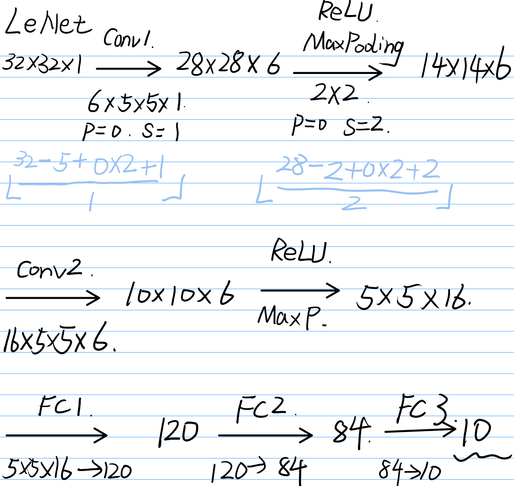

> 这一篇主要整理自 `liuer_pytorch/11-13.ipynb`，以及 `pytorch_learning/pytorch_6.py`。这组材料最适合的读法，不是逐个背模型名字，而是先把卷积网络的核心骨架理解清楚。

## 1. 为什么 CNN 适合图像

和全连接网络相比，卷积网络的关键优势在于：

- 局部感受野：先看局部
- 权重共享：同一个卷积核在不同位置复用
- 参数更少：不会像全连接层那样一上来就爆炸

课程笔记里反复强调的一点是：  
卷积层不是“更复杂的线性层”，而是一种刻意保留空间结构的线性变换。

## 2. LeNet 是理解 CNN 的最好起点

我自己在 `pytorch_learning/pytorch_6.py` 里第一次完整写了一个 LeNet：

```python3
class LeNet(nn.Module):
    def __init__(self):
        super().__init__()
        self.conv1 = nn.Conv2d(1, 6, 5)
        self.conv2 = nn.Conv2d(6, 16, 5)
        self.fc1 = nn.Linear(16 * 5 * 5, 120)
        self.fc2 = nn.Linear(120, 84)
        self.fc3 = nn.Linear(84, 10)

    def forward(self, x):
        x = F.max_pool2d(F.relu(self.conv1(x)), (2, 2))
        x = F.max_pool2d(F.relu(self.conv2(x)), (2, 2))
        x = x.view(x.size(0), -1)
        x = F.relu(self.fc1(x))
        x = F.relu(self.fc2(x))
        return self.fc3(x)
```

这段代码几乎把经典 CNN 的主干全露出来了：

- 卷积
- 激活
- 池化
- 展平
- 全连接分类头

LeNet 结构图我也一起保留到了博客目录里：



## 3. 读 LeNet 时最该记住什么

我现在看 LeNet，最重要的不是记参数，而是记住这条流：

```text
输入图像
→ 卷积提取局部特征
→ 池化压缩空间尺寸
→ 再卷积、再池化
→ 展平后送入全连接层
→ 输出类别分数
```

这条流后来几乎影响了所有经典 CNN，只是中间模块变复杂了。

## 4. 从 LeNet 往后看：为什么网络越做越深

课程在 `Advanced CNN` 那几节里，重点提到了三条线：

### 4.1 GoogLeNet / Inception

核心思路是：  
不要只押注一种卷积核大小，而是在同一层里并行做多种卷积，再把结果拼起来。

它解决的是“同一层特征尺度可能不一样”的问题。

### 4.2 ResNet

ResNet 最关键的点，是残差连接。

它不是在说“网络一定要有捷径才厉害”，而是在解决一个更工程的问题：

- 网络越深，训练越难
- 信息和梯度传得越来越差
- 残差连接让模型更容易学到“至少别变坏”

### 4.3 DenseNet

DenseNet 可以看成把“连接”这件事推得更极端：

- 前面层的特征不只残差相加
- 而是更密集地往后传

课程里还顺手把它当成了一个“参考论文自己实现网络”的练习入口，这其实很对。

## 5. CNN 这一阶段该怎么学

我现在觉得最适合的顺序是：

1. 先把卷积、池化和 feature map 形状变化看懂
2. 再把 LeNet 写出来
3. 再去理解 GoogLeNet / ResNet / DenseNet 解决的具体问题

不要一上来就被各种大模型名字压住。

## 6. 这一阶段该记住什么

如果只保留最少的几句话，我会记：

1. CNN 的核心不是“更深”，而是“保留空间结构的局部特征提取”。
2. LeNet 是最好的起点，因为它把卷积网络的主干完整展示出来了。
3. GoogLeNet、ResNet、DenseNet 分别在解决不同的“怎么把 CNN 做得更强”的问题。

到这里，PyTorch 已经不只是“会写训练循环”，而是开始真正进入深度学习模型结构本身了。
