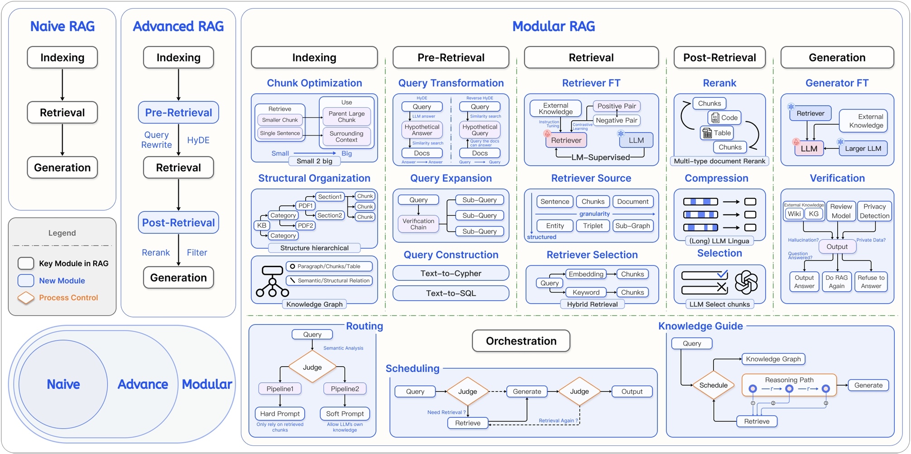
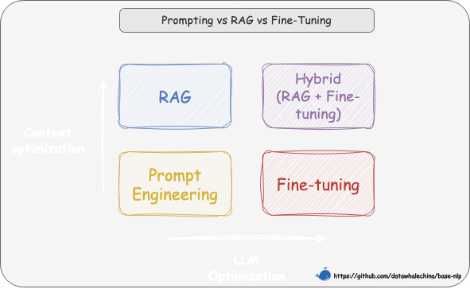

> 这一篇是整条 RAG 学习线的起点。先把“为什么需要 RAG”说清楚，后面再去看数据加载、文本分块和向量数据库，就不容易只记工具名，不记系统目标。

# RAG - 简介
## 一、什么是RAG
## 1. 核心定义

从本质上讲，RAG（Retrieval-Augmented Generation）是一种旨在解决大语言模型（LLM）“知其然不知其所以然”问题的技术范式。它的核心是将模型内部学到的“参数化知识”（模型权重中固化的、模糊的“记忆”），与来自外部知识库的“非参数化知识”（精准、可随时更新的外部数据）相结合。其运作逻辑就是在 LLM 生成文本前，先通过检索机制从外部知识库中动态获取相关信息，并将这些“参考资料”融入生成过程，从而提升输出的准确性和时效性。

## 2. 技术原理

RAG系统实现参数化知识+非参数化结果结合的方法，主要可以分为两步：
1. 检索阶段：通过知识向量化、语义召回等方式寻找非参数化知识
2. 生成阶段：将检索到的知识整合到上下文，按照预设的Prompt指令，将上下文和问题有效整合，并引导LLM做出可控的、有理有据的文本生成。

## 3. 技术演进

| 维度     | 初级 RAG（Naive RAG）           | 高级 RAG（Advanced RAG）                        | 模块化 RAG（Modular RAG）                                                     |
| -------- | ------------------------------- | ----------------------------------------------- | ----------------------------------------------------------------------------- |
| 流程     | 离线：索引 在线：检索 → 生成 | 离线：索引 在线：… → 检索前 → … → 检索后 → … | 积木式可编排流程                                                              |
| 特点     | 基础线性流程                    | 增加检索前后的优化步骤                          | 模块化、可组合、可动态调整                                                    |
| 关键技术 | 基础向量检索                    | 查询重写（Query Rewrite） 结果重排（Rerank） | 动态路由（Routing） 查询转换（Query Transformation） 多路融合（Fusion） |
| 局限性   | 效果不稳定，难以优化            | 流程相对固定，优化点有限                        | 系统复杂性高                                                                  |

这里的离线指的是提起完成数据预处理。

## 二、为什么要使用RAG
## 1. RAG vs. 微调

在选择具体的技术路径时，一个重要的考量是成本与效益的平衡。通常，我们应优先选择对模型改动最小、成本最低的方案，所以技术选型路径往往遵循的顺序是提示词工程（Prompt Engineering） -> 检索增强生成 -> 微调（Fine-tuning）。

下图横轴表示LLM优化，纵轴表示上下文优化。

| 问题                  | RAG 的解决方案                     |
| --------------------- | ---------------------------------- |
| 静态知识局限          | 实时检索外部知识库，支持动态更新   |
| 幻觉（Hallucination） | 基于检索内容生成，错误率降低       |
| 领域专业性不足        | 引入领域特定知识库（如医疗/法律）  |
| 数据隐私风险          | 本地化部署知识库，避免敏感数据泄露 |

## 2. RAG的关键优势

以下直接照搬All in RAG，看一遍即可：

### (1) 准确性与可信度的双重提升

RAG 最核心的价值在于突破了模型预训练知识的限制。它不仅能补充专业领域的知识盲区，还能通过提供具体的参考材料，有效抑制“一本正经胡说八道”的幻觉现象。论文研究还表明，RAG 生成的内容在具体性和多样性上也显著优于纯 LLM。更重要的是，RAG 具备可溯源性——每一条回答都能找到对应的原始文档出处，这种“有据可查”的特性极大提高了内容在法律、医疗等严肃场景下的可信度。

### (2) 时效性保障

在知识更新方面，RAG 解决了 LLM 固有的知识时滞问题（即模型不知道训练截止日期之后发生的事）。RAG 允许知识库独立于模型进行动态更新——新政策或新数据一旦入库，立刻就能被检索到。这种能力在论文中被称为“索引热拔插”（Index Hot-swapping）——就像给机器人换一张存储卡一样，瞬间切换其世界知识库，而无需重新训练模型，实现了知识的实时在线。

### (3) 显著的综合成本效益

从经济角度看，RAG 是一种高性价比的方案。首先，它避免了高频微调带来的巨额算力成本；其次，由于有了外部知识的强力辅助，我们在处理特定领域问题时，往往可以使用参数量更小的基础模型来达到类似的效果，从而直接降低了推理成本。这种架构也减少了试图将海量知识强行“塞入”模型权重中所需的计算资源消耗。

### (4) 灵活的模块化可扩展性

RAG 的架构具备极强的包容性，支持多源集成，无论是 PDF、Word 还是网页数据，都能统一构建进知识库中。同时，其模块化设计实现了检索与生成的解耦，这意味着我们可以独立优化检索组件（比如更换更好的 Embedding 模型），而不会影响到生成组件的稳定性，便于系统的长期迭代。

## 3. RAG风险评估
| 风险等级 | 案例              | RAG 适用性         |
| -------- | ----------------- | ------------------ |
| 低风险   | 翻译/语法检查     | 高可靠性           |
| 中风险   | 合同起草/法律咨询 | 需结合人工审核     |
| 高风险   | 证据分析/签证决策 | 需严格质量控制机制 |

