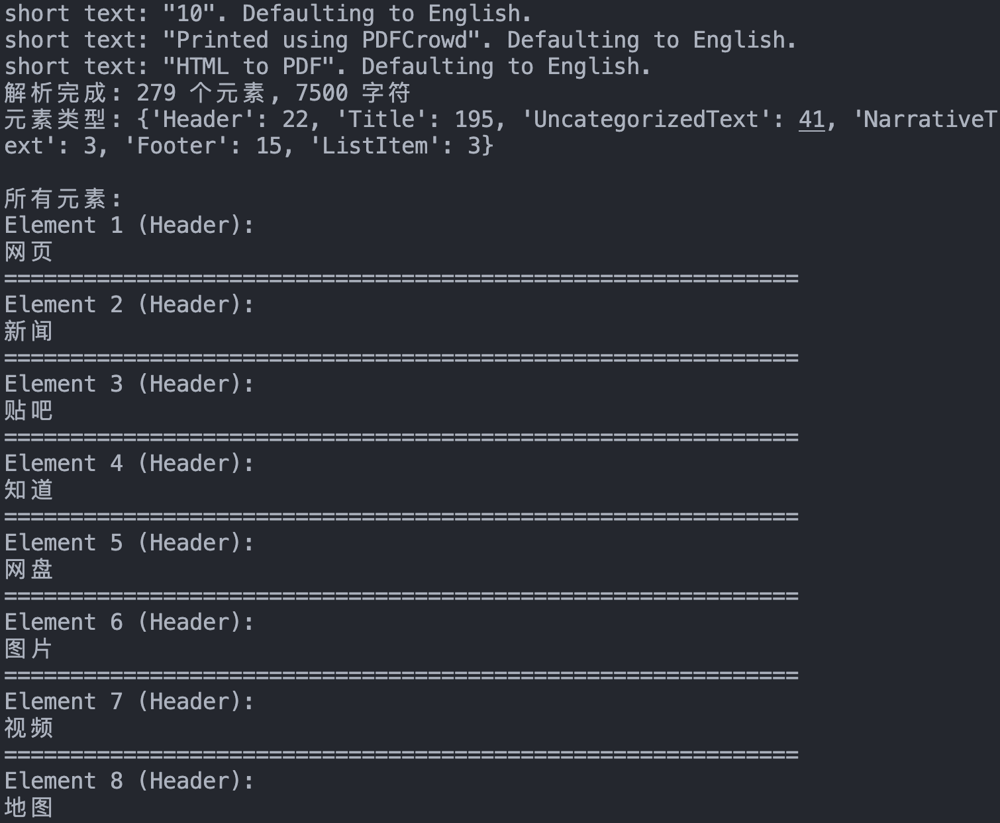
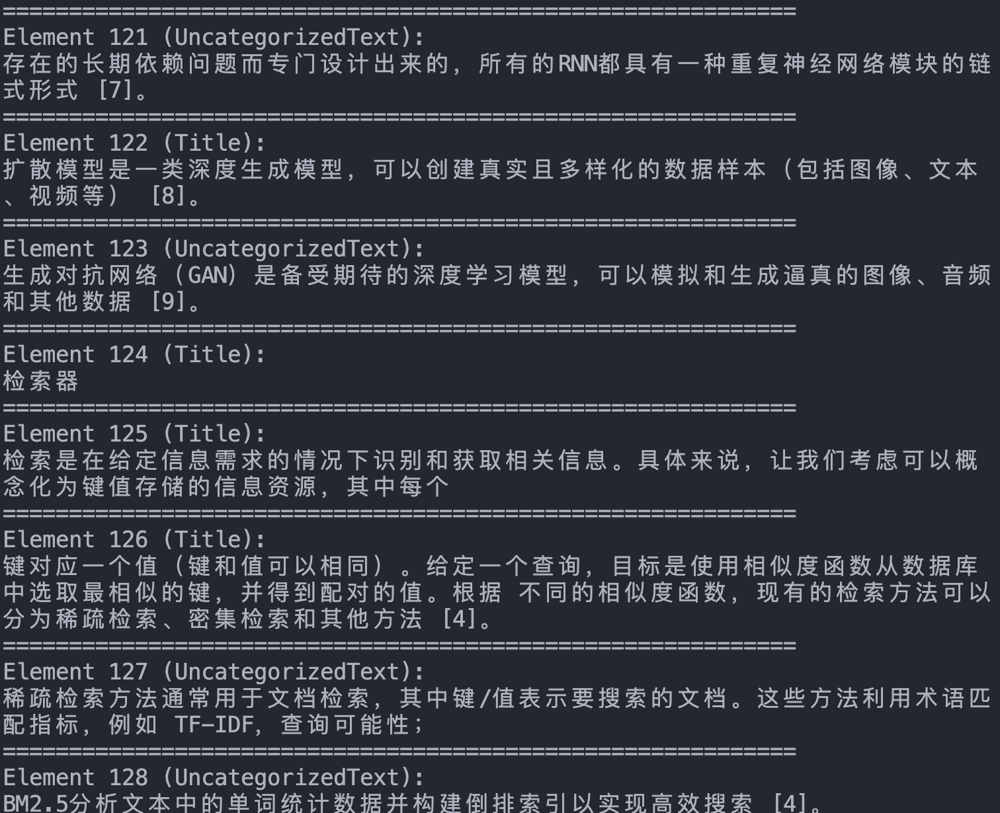

> RAG 的第一步不是“问模型”，而是“把外部知识变成可处理的数据”。这一篇主要整理文档加载器和预处理环节，为后面的分块与索引打底。

# RAG - 数据加载
## 一、文档加载器
### 1. 主要功能
RAG 系统中，数据加载是整个流水线的第一步，也是不可或缺的一步。文档加载器负责将各种格式的非结构化文档（如PDF、Word、Markdown、HTML等）转换为程序可以处理的结构化数据。数据加载的质量会直接影响后续的索引构建、检索效果和最终的生成质量。

文档加载器在 RAG 的数据管道中一般需要完成三个核心任务，一是解析不同格式的原始文档，将 PDF、Word、Markdown 等内容提取为可处理的纯文本，二是在解析过程中同时抽取文档来源、页码、作者等关键信息作为元数据，三是把文本和元数据整理成统一的数据结构，方便后续进行切分、向量化和入库，其整体流程与传统数据工程中的抽取、转换、加载相似，目标都是把杂乱的原始文档清洗并对齐为适合检索和建模的标准化语料。

### 2. 主流RAG文档加载器

| 工具            | 功能                                | 适用场景           | 特点                     |
| --------------- | ----------------------------------- | ------------------ | ------------------------ |
| PyMuPDF4LLM     | PDF → Markdown 转换，OCR + 表格识别 | 科研文献、技术手册 | 开源免费，GPU 加速       |
| TextLoader      | 基础文本文件加载                    | 纯文本处理         | 轻量高效                 |
| DirectoryLoader | 批量目录文件处理                    | 混合格式文档库     | 支持多格式扩展           |
| Unstructured    | 多格式文档解析                      | PDF、Word、HTML 等 | 统一接口，智能解析       |
| FireCrawlLoader | 网页内容抓取                        | 在线文档、新闻     | 实时内容获取             |
| LlamaParse      | 深度 PDF 结构解析                   | 法律合同、学术论文 | 解析精度高，商业 API     |
| Docling         | 模块化企业级解析                    | 企业合同、报告     | IBM 生态兼容             |
| Marker          | PDF → Markdown，GPU 加速            | 科研文献、书籍     | 专注 PDF 转换            |
| MinerU          | 多模态集成解析                      | 学术文献、财务报表 | 集成 LayoutLMv3 + YOLOv8 |


## 二、Unstructured文档处理库

[Unstructured](https://docs.unstructured.io/open-source/introduction/overview)是一个专业的文档处理库，专门设计用于RAG和AI微调场景的非结构化数据预处理。提供了统一的接口来处理多种文档格式，是目前应用较广泛的文档加载解决方案之一。Unstructured 在格式支持和内容解析方面具有明显优势，它一方面支持 PDF、Word、Excel、HTML、Markdown 等多种文档格式，并通过统一的 API 接口避免为不同格式分别编写代码，另一方面可以自动识别标题、段落、表格、列表等文档结构，同时保留相应的元数据信息。

| 元素类型          | 描述                                                           |
| ----------------- | -------------------------------------------------------------- |
| Title             | 文档标题                                                       |
| NarrativeText     | 由多个完整句子组成的正文文本，不包括标题、页眉、页脚和说明文字 |
| ListItem          | 列表项，属于列表的正文文本元素                                 |
| Table             | 表格                                                           |
| Image             | 图像元数据                                                     |
| Formula           | 公式                                                           |
| Address           | 物理地址                                                       |
| EmailAddress      | 邮箱地址                                                       |
| FigureCaption     | 图片标题 / 说明文字                                            |
| Header            | 文档页眉                                                       |
| Footer            | 文档页脚                                                       |
| CodeSnippet       | 代码片段                                                       |
| PageBreak         | 页面分隔符                                                     |
| PageNumber        | 页码                                                           |
| UncategorizedText | 未分类的自由文本                                               |
| CompositeElement  | 分块处理时产生的复合元素*                                      |

## 三、从LangChain封装到原始Unstructured

```python
from unstructured.partition.auto import partition

# PDF文件路径
pdf_path = "../../data/C2/pdf/rag.pdf"

# 使用Unstructured加载并解析PDF文档
elements = partition(
    filename=pdf_path,
    content_type="application/pdf"
)

# 打印解析结果
print(f"解析完成: {len(elements)} 个元素, {sum(len(str(e)) for e in elements)} 字符")

# 统计元素类型
from collections import Counter
types = Counter(e.category for e in elements)
print(f"元素类型: {dict(types)}")

# 显示所有元素
print("\n所有元素:")
for i, element in enumerate(elements, 1):
    print(f"Element {i} ({element.category}):")
    print(element)
    print("=" * 60)

```




不过这里的运行结果其实一般，首先是Could not get FontBBox...，通常是PDF里字体数据不规范；然后，No languages specified, defaulting to English 和一堆 short text... Defaulting to English 也不是报错，只是说明它没拿到语言参数，默认按英文处理。

partition 函数参数解析：

- filename: 文档文件路径，支持本地文件路径；
- content_type: 可选参数，指定MIME类型（如"application/pdf"），可绕过自动文件类型检测；
- file: 可选参数，文件对象，与 filename 二选一使用；
- url: 可选参数，远程文档 URL，支持直接处理网络文档；
- include_page_breaks: 布尔值，是否在输出中包含页面分隔符；
- strategy: 处理策略，可选 "auto"、"fast"、"hi_res" 等；
- encoding: 文本编码格式，默认自动检测。

如果要更好的处理，可以直接`from unstructured.partition.pdf import partition_pdf`用专门的pdf包，提供方更多特有的参数选项，如OCR语言设置、图像提取、表格结构推理等高级性能，同时性能更优。当我们换用这个包，且使用his_res之后，明显效果好多了，NarrativeText 从之前很少，变成了 68 个，正文识别明显更好了；出现了 Table、FigureCaption、Image，说明版面理解生效了；像“历史沿革”“技术定义”“工作流程”下面的大段正文，基本能被连续抽出来了。不过，hi_res需要一些新的系统依赖，比如用于OCR的[Tesseract](https://tesseract-ocr.github.io/)、用于PDF的[Popler](https://pdf2image.readthedocs.io/)。

而在实际应用中，针对 pdf 的处理，目前更多选用的是 PaddleOCR、MinerU 等模型或工具。
