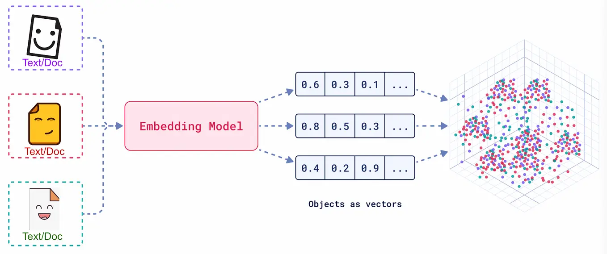
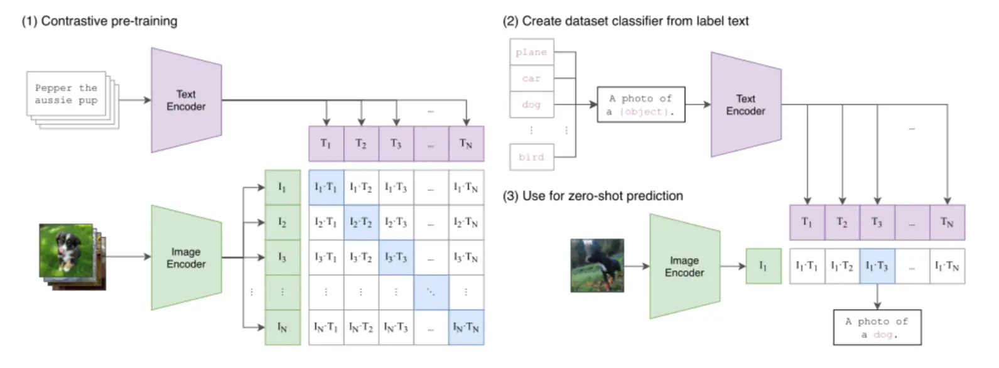
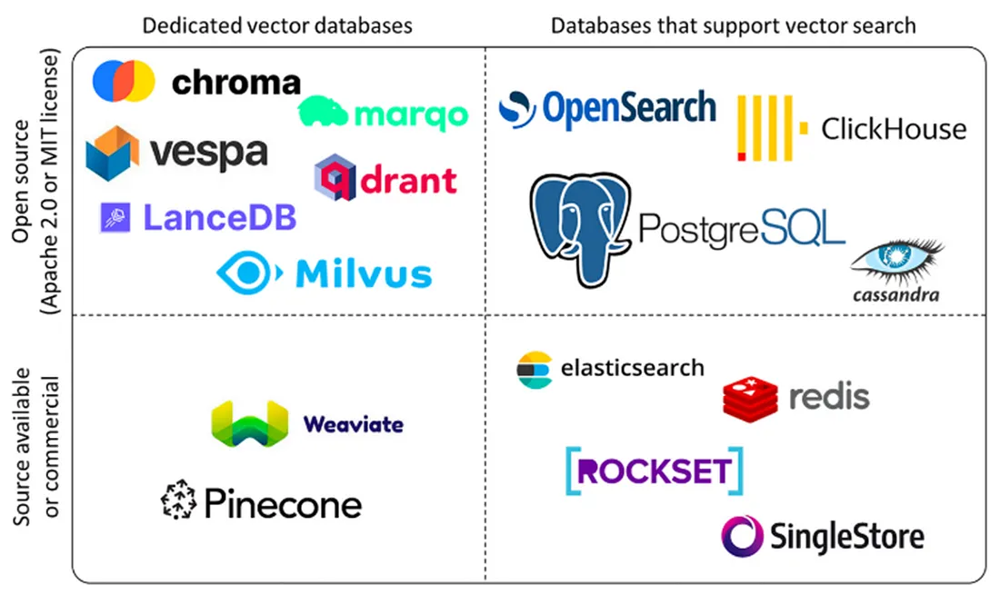
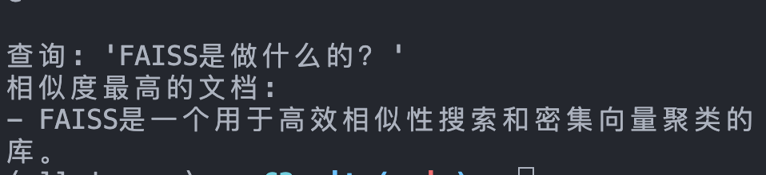

> 这一篇开始真正进入 RAG 的“索引层”。如果说前面两篇是在准备语料，那么这里就是在回答：这些文本为什么能被表示成向量，又为什么可以被高效检索出来。

# RAG - 索引构建
## 一、向量嵌入
## 1. 向量嵌入基础
上一章语义分块的时候就用到了语义嵌入模型，简单介绍了一下嵌入的过程。实际上，准确来说向量嵌入（Embedding）是一种将真实世界中复杂、高维的数据对象（如文本、图像、音频、视频等）转换为数学上易于处理的、低维、稠密的连续数值向量的技术。


Embedding 的真正意义在于，它产生的向量不是随机数值的堆砌，而是对数据语义的数学编码。在 Embedding 构建的向量空间中，语义上相似的对象，其对应的向量在空间中的距离会更近；而语义上不相关的对象，它们的向量距离会更远。

我们用以下方式来衡量向量之间的距离（相似度）：
| 度量方式                        | 核心含义                                                       | 优点                                                                         | 缺点                                                                                         | 适用场景                                                                 |
| ------------------------------- | -------------------------------------------------------------- | ---------------------------------------------------------------------------- | -------------------------------------------------------------------------------------------- | ------------------------------------------------------------------------ |
| 余弦相似度（Cosine Similarity） | 衡量两个向量夹角的余弦值，关注方向是否一致，而不太关注向量长度 | 对向量长度不敏感，能更好反映语义方向上的相似性；在文本检索和语义搜索中最常用 | 忽略了向量模长所携带的信息；如果模型特意利用向量长度编码重要性，余弦相似度可能损失这部分信息 | 语义检索、文本相似度计算、RAG 向量召回的主流选择                         |
| 点积（Dot Product）             | 计算两个向量对应维度乘积之和，同时受方向和模长影响             | 计算高效；当向量已归一化时，与余弦相似度等价；适合大规模向量检索实现         | 若向量未归一化，结果会受到长度影响，可能把“向量更长”误当成“更相似”                           | 向量已归一化的检索系统；高性能近似最近邻搜索；深度学习训练中的相似度计算 |
| 欧氏距离（Euclidean Distance）  | 衡量两个向量在空间中的直线距离，距离越小表示越接近             | 几何意义直观，容易理解；适合确实关心“空间位置差异”的任务                     | 对向量尺度敏感；在高维空间中区分度可能下降；文本语义检索中通常不如余弦相似度稳定             | 低维空间分析、聚类任务、对空间距离本身有明确意义的场景                   |

## 2. Embedding在RAG中的作用

RAG 的“检索”环节通常以基于 Embedding 的语义搜索为核心。通用流程如下： 
- 离线索引构建：将知识库内文档切分后，使用 Embedding 模型将每个文档块（Chunk）转换为向量，存入专门的向量数据库中。
- 在线查询检索：当用户提出问题时，使用同一个 Embedding 模型将用户的问题也转换为一个向量。
- 相似度计算：在向量数据库中，计算“问题向量”与所有“文档块向量”的相似度。
- 召回上下文：选取相似度最高的 Top-K 个文档块，作为补充的上下文信息，与原始问题一同送给大语言模型（LLM）生成最终答案。

Embedding 的质量直接决定了 RAG 检索召回内容的准确性与相关性。一个优秀的 Embedding 模型能够精准捕捉问题和文档之间的深层语义联系，即使用户的提问和原文的表述不完全一致。

## 3. Embedding技术
>注：由于目前主要关注RAG，本章略写

1. Word2Vec -> 动态嵌入 -> 更高要求。
2. 主要训练：自监督训练。主流嵌入模型是BERT的变体，所以详细可以看BERT的训练，也就是MLM和NSP那边。
3. 除了原本的训练，还会引入增强效果的训练，比如度量学习、对比学习等。
4. 选择嵌入模型，我们可以从[MTEB (Massive Text Embedding Benchmark) ](https://huggingface.co/spaces/mteb/leaderboard)入手，是一个由 Hugging Face 维护的、全面的文本嵌入模型评测基准。它涵盖了分类、聚类、检索、排序等多种任务，并提供了公开的排行榜，为评估和选择嵌入模型提供了重要的参考依据。

针对RAG而言，要格外注意以下维度：
- 任务 (Task) ：对于 RAG 应用，需要重点关注模型在 Retrieval (检索) 任务下的排名。
- 语言 (Language) ：模型是否支持你的业务数据所使用的语言？对于中文 RAG，应选择明确支持中文或多语言的模型。
- 模型大小 (Size) ：模型越大，通常性能越好，但对硬件（显存）的要求也越高，推理速度也越慢。需要根据你的部署环境和性能要求来权衡。
- 维度 (Dimensions) ：向量维度越高，能编码的信息越丰富，但也会占用更多的存储空间和计算资源。
- 最大 Token 数 (Max Tokens) ：这决定了模型能处理的文本长度上限。这个参数是你设计文本分块（Chunking）策略时必须考虑的重要依据，块大小不应超过此限制。
- 得分与机构 (Score & Publisher) ：结合模型的得分排名和其发布机构的声誉进行初步筛选。知名机构发布的模型通常质量更有保障。
- 成本 (Cost) ：如果是使用 API 服务的模型，需要考虑其调用成本；如果是自部署开源模型，则需要评估其对硬件资源的消耗（如显存、内存）以及带来的运维成本。

当然，我们一般会用基线测试上面几个维度，然后构建私有测评集，迭代优化，选出该场景下最合适的模型。

## 二、多模态嵌入
> 偏科普，可跳

现代 AI 的一项重要突破，是将简单的词向量发展成了能统一理解图文、音视频的复杂系统。这一发展建立在注意力机制、Transformer 架构和对比学习等关键技术之上，它们解决了在共享向量空间中对齐不同数据模态的核心挑战。其发展环环相扣：Word2Vec 为 BERT 的上下文理解铺路，而 BERT 又为 CLIP 等模型的跨模态能力奠定了基础……



反正知道最终多模态信息也能被嵌入成高维稠密向量就行了。

## 三、向量数据库
在前面我们学习了如何使用嵌入模型将文本、图像等非结构化数据转换为高维向量。这些向量是 RAG 系统能够进行语义理解的基础。然而，当向量数量从几百个增长到数百万甚至数十亿时，一个核心问题随之而来：如何快速、准确地从海量向量中找到与用户查询最相似的那几个？
## 1. 向量数据库的功能
向量数据库的核心价值在于其高效处理海量高维向量的能力。其主要功能可以概括为以下几点：

- 高效的相似性搜索：这是向量数据库最重要的功能。它利用专门的索引技术（如 HNSW, IVF），能够在数十亿级别的向量中实现毫秒级的近似最近邻（ANN）查询，快速找到与给定查询最相似的数据。

- 高维数据存储与管理：专门为存储高维向量（通常维度成百上千）而优化，支持对向量数据进行增、删、改、查等基本操作。

- 丰富的查询能力：除了基本的相似性搜索，还支持按标量字段过滤查询（例如，在搜索相似图片的同时，指定年份 > 2023）、范围查询和聚类分析等，满足复杂业务需求。

- 可扩展与高可用：现代向量数据库通常采用分布式架构，具备良好的水平扩展能力和容错性，能够通过增加节点来应对数据量的增长，并确保服务的稳定可靠。

- 数据与模型生态集成：与主流的 AI 框架（如 LangChain, LlamaIndex）和机器学习工作流无缝集成，简化了从模型训练到向量检索的应用开发流程。

## 2. 向量数据库 vs 传统数据库
传统的数据库（如 MySQL）擅长处理结构化数据的精确匹配查询（例如，WHERE age = 25），但它们并非为处理高维向量的相似性搜索而设计的。在庞大的向量集合中进行暴力、线性的相似度计算，其计算成本和时间延迟无法接受。向量数据库 (Vector Database) 很好的解决了这一问题，它是一种专门设计用于高效存储、管理和查询高维向量的数据库系统。在 RAG 流程中，它扮演着“知识库”的角色，是连接数据与大语言模型的关键桥梁。

| 维度         | 向量数据库                              | 传统数据库（RDBMS）                            |
| ------------ | --------------------------------------- | ---------------------------------------------- |
| 核心数据类型 | 高维向量（Embeddings）                  | 结构化数据（文本、数字、日期）                 |
| 查询方式     | 相似性搜索（ANN）                       | 精确匹配                                       |
| 索引机制     | HNSW、IVF、LSH 等 ANN 索引              | B-Tree、Hash Index                             |
| 主要应用场景 | AI 应用、RAG、推荐系统、图像 / 语音识别 | 业务系统（ERP、CRM）、金融交易、数据报表       |
| 数据规模     | 轻松应对千亿级向量                      | 通常在千万到亿级行数据，更大规模需复杂分库分表 |
| 性能特点     | 高维数据检索性能极高，计算密集型        | 结构化数据查询快，高维数据查询性能呈指数级下降 |
| 一致性       | 通常为最终一致性                        | 强一致性（ACID 事务）                          |

向量数据库的核心是高效处理高维向量的相似性搜索。向量是一组有序的数值，可以表示文本、图像、音频等复杂数据的特征或属性。在 RAG 系统中，向量一般通过嵌入模型将原始数据转换为高维向量表示，比如上一节的图文示例。向量数据库通常采用四层架构，通过存储层、索引层、查询层和服务层的协同工作来实现高效相似性搜索，其中存储层负责存储向量数据和元数据，优化存储效率并支持分布式存储；索引层维护索引算法（HNSW、LSH、PQ等），负责索引的创建与优化，并支持索引调整；查询层处理查询请求，支持混合查询并实现查询优化；服务层管理客户端连接，提供监控和日志能力，并实现安全管理。

主要技术手段包括：

- 基于树的方法：如 Annoy 使用的随机投影树，通过树形结构实现对数复杂度的搜索
- 基于哈希的方法：如 LSH（局部敏感哈希），通过哈希函数将相似向量映射到同一“桶”
- 基于图的方法：如 HNSW（分层可导航小世界图），通过多层邻近图结构实现快速搜索
- 基于量化的方法：如 Faiss 的 IVF 和 PQ，通过聚类和量化压缩向量

## 3. 主流数据库介绍



## 四、FAISS尝试

尝试利用 LangChain 和 FAISS 完成一个完整的“创建 -> 保存 -> 加载 -> 查询”流程。
```python
from langchain_community.vectorstores import FAISS
from langchain_community.embeddings import HuggingFaceEmbeddings
from langchain_core.documents import Document

# 1. 示例文本和嵌入模型
texts = [
    "张三是法外狂徒",
    "FAISS是一个用于高效相似性搜索和密集向量聚类的库。",
    "LangChain是一个用于开发由语言模型驱动的应用程序的框架。"
]
docs = [Document(page_content=t) for t in texts]
embeddings = HuggingFaceEmbeddings(model_name="BAAI/bge-small-zh-v1.5")

# 2. 创建向量存储并保存到本地
vectorstore = FAISS.from_documents(docs, embeddings)

local_faiss_path = "./faiss_index_store"
vectorstore.save_local(local_faiss_path)

print(f"FAISS index has been saved to {local_faiss_path}")

# 3. 加载索引并执行查询
# 加载时需指定相同的嵌入模型，并允许反序列化
loaded_vectorstore = FAISS.load_local(
    local_faiss_path,
    embeddings,
    allow_dangerous_deserialization=True
)

# 相似性搜索
query = "FAISS是做什么的？"
results = loaded_vectorstore.similarity_search(query, k=1)

print(f"\n查询: '{query}'")
print("相似度最高的文档:")
for doc in results:
    print(f"- {doc.page_content}")
```

