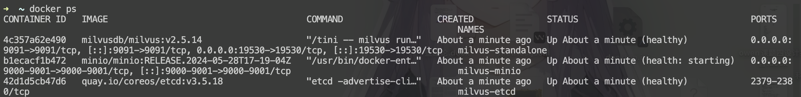
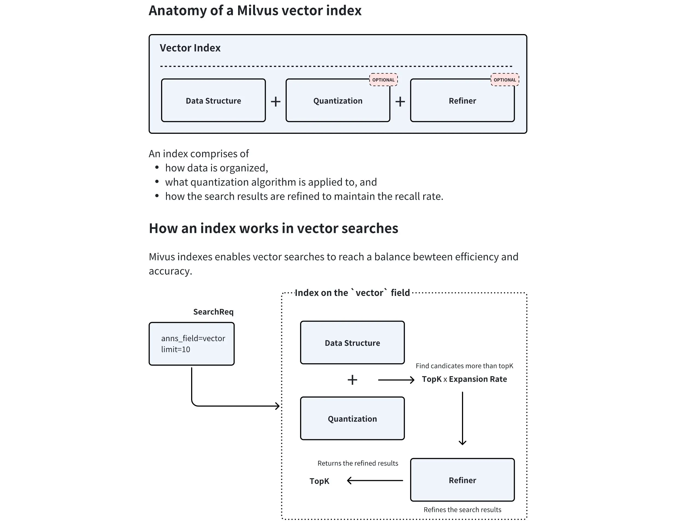
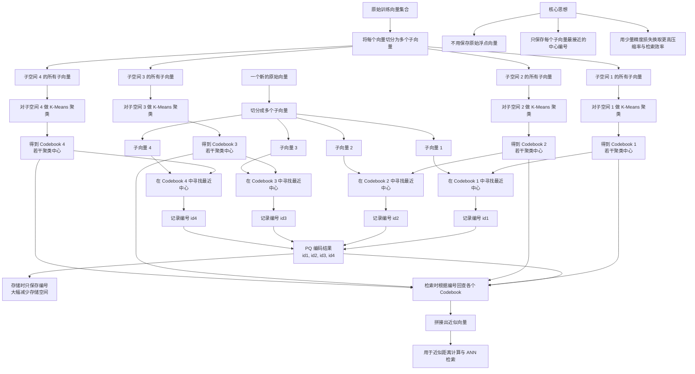
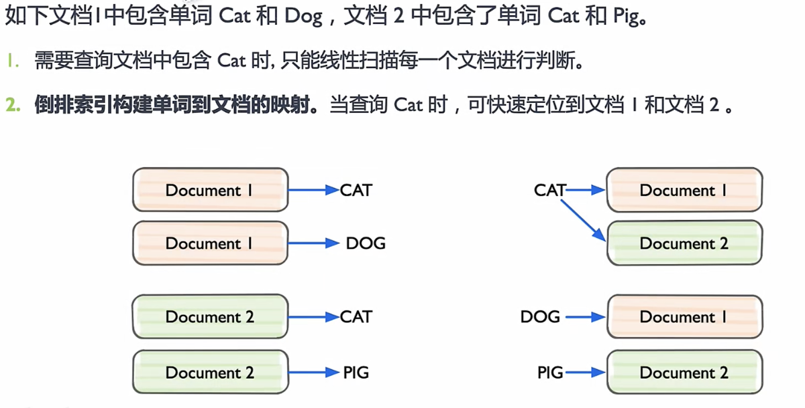
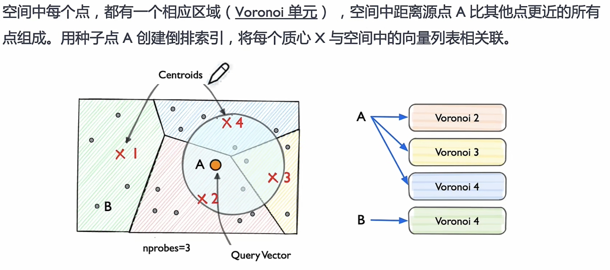
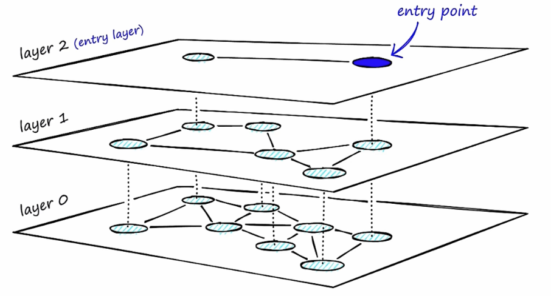
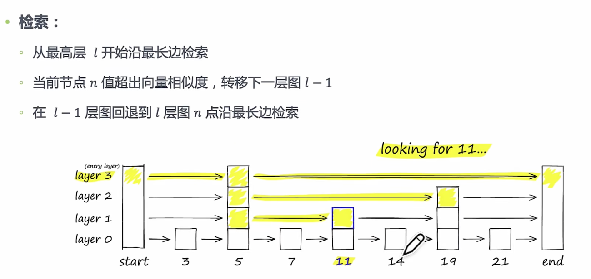
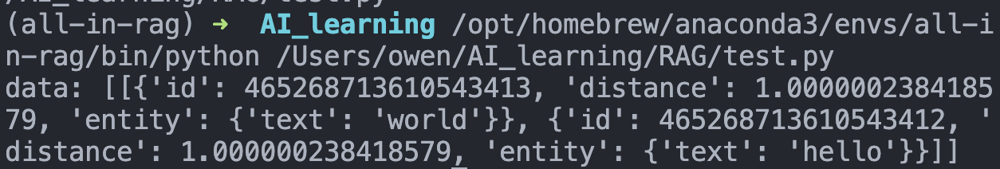

> 前面已经把向量数据库的通用心智搭起来了，这一篇就落到 Milvus 本身，理解它在真实系统里是怎么组织数据和执行搜索的。

# RAG - 向量数据库与Milvus基础知识
## 1. 简介
Milvus 是一个开源的、专为大规模向量相似性搜索和分析而设计的向量数据库。它诞生于 Zilliz 公司，并已成为 LF AI & Data 基金会的顶级项目，在AI领域拥有广泛的应用。

与 FAISS、ChromaDB 等轻量级本地存储方案不同，Milvus 从设计之初就瞄准了生产环境。其采用云原生架构，具备高可用、高性能、易扩展的特性，能够处理十亿、百亿甚至更大规模的向量数据。

官网地址: https://milvus.io/

GitHub: https://github.com/milvus-io/milvus

## 2. 用Docker部署安装

Docker的使用我另有总结，如果还不熟练可以先看那边复习。

我们可以直接拉下来官方的docker-compose.yml，用`wget https://github.com/milvus-io/milvus/releases/download/v2.5.14/milvus-standalone-docker-compose.yml -O docker-compose.yml`

我们瞅一眼文件内容：
```yml
version: '3.5'

services:
  etcd:
    container_name: milvus-etcd
    image: quay.io/coreos/etcd:v3.5.18
    environment:
      - ETCD_AUTO_COMPACTION_MODE=revision
      - ETCD_AUTO_COMPACTION_RETENTION=1000
      - ETCD_QUOTA_BACKEND_BYTES=4294967296
      - ETCD_SNAPSHOT_COUNT=50000
    volumes:
      - ${DOCKER_VOLUME_DIRECTORY:-.}/volumes/etcd:/etcd
    command: etcd -advertise-client-urls=http://etcd:2379 -listen-client-urls http://0.0.0.0:2379 --data-dir /etcd
    healthcheck:
      test: ["CMD", "etcdctl", "endpoint", "health"]
      interval: 30s
      timeout: 20s
      retries: 3

  minio:
    container_name: milvus-minio
    image: minio/minio:RELEASE.2024-05-28T17-19-04Z
    environment:
      MINIO_ACCESS_KEY: minioadmin
      MINIO_SECRET_KEY: minioadmin
    ports:
      - "9001:9001"
      - "9000:9000"
    volumes:
      - ${DOCKER_VOLUME_DIRECTORY:-.}/volumes/minio:/minio_data
    command: minio server /minio_data --console-address ":9001"
    healthcheck:
      test: ["CMD", "curl", "-f", "http://localhost:9000/minio/health/live"]
      interval: 30s
      timeout: 20s
      retries: 3

  standalone:
    container_name: milvus-standalone
    image: milvusdb/milvus:v2.5.14
    command: ["milvus", "run", "standalone"]
    security_opt:
      - seccomp:unconfined
    environment:
      MINIO_REGION: us-east-1
      ETCD_ENDPOINTS: etcd:2379
      MINIO_ADDRESS: minio:9000
    volumes:
      - ${DOCKER_VOLUME_DIRECTORY:-.}/volumes/milvus:/var/lib/milvus
    healthcheck:
      test: ["CMD", "curl", "-f", "http://localhost:9091/healthz"]
      interval: 30s
      start_period: 90s
      timeout: 20s
      retries: 3
    ports:
      - "19530:19530"
      - "9091:9091"
    depends_on:
      - "etcd"
      - "minio"

networks:
  default:
    name: milvus
```

我们可以看到，Docker 将会自动拉取所需的镜像并启动三个容器：milvus-standalone, milvus-minio, 和 milvus-etcd，其中前者依赖于后两者的，然后将他们放入同一子网起名为milvus。然后注意，standalone通过19530和9091端口提供服务。



## 3. Milvus的核心组件 - Collection
用一个图书馆例子来比喻Collection的存储方式：
- Collection (集合): 相当于一个图书馆，是所有数据的顶层容器。一个 Collection 可以包含多个 Partition，每个 Partition 可以包含多个 Entity。
- Partition (分区): 相当于图书馆里的不同区域（如“小说区”、“科技区”），将数据物理隔离，让检索更高效。
- Schema (模式): 相当于图书馆的图书卡片规则，定义了每本书（数据）必须登记哪些信息（字段）。
- Entity (实体): 相当于一本具体的书，是数据本身。
- Alias (别名): 相当于一个动态的推荐书单（如“本周精选”），它可以指向某个具体的 Collection，方便应用层调用，实现数据更新时的无缝切换。

### (1) Collection
Collection是Milvus中的最基本数据组织单位，类似于关系型数据库里面的Table。是我们存储、管理和查询向量及相关元数据的容器。所有的数据操作，如插入、删除、查询等，都是围绕 Collection 展开的。

一个Collection由Schema定义

### (2) Schema
在创建 Collection 之前，必须先定义它的 Schema。 Schema 规定了 Collection 的数据结构，定义了其中包含的所有字段 (Field) 及其属性。一个设计良好的 Schema 是能够保证数据一致性并提升查询性能。

Schema 通常包含以下几类字段：
- 主键字段 (Primary Key Field): 每个 Collection 必须有且仅有一个主键字段，用于唯一标识每一条数据（实体）。它的值必须是唯一的，通常是整数或字符串类型。
- 向量字段 (Vector Field): 用于存储核心的向量数据。一个 Collection 可以有一个或多个向量字段，以满足多模态等复杂场景的需求。
- 标量字段 (Scalar Field): 用于存储除向量之外的元数据，如字符串、数字、布尔值、JSON 等。这些字段可以用于过滤查询，实现更精确的检索。


上图以一篇新闻文章为例，展示了一个典型的多模态、混合向量 Schema 设计。它将一篇文章拆解为：唯一的 Article (ID)、文本元数据（如 Title、Author Info）、图像信息（Image URL），并为图像和摘要内容分别生成了密集向量（Image Embedding, Summary Embedding）和稀疏向量（Summary Sparse Embedding）。

我们来看看，常见的字段有哪些，他们的作用又是什么：
| 字段类型          | 含义       | 例子                           |
| ----------------- | ---------- | ------------------------------ |
| `BOOL`            | 布尔值     | `true/false`                   |
| `INT8/16/32/64`   | 整数       | 年份、数量、ID                 |
| `FLOAT/DOUBLE`    | 小数       | 分数、价格、概率               |
| `VARCHAR`         | 字符串     | 标题、类别、作者               |
| `JSON`            | 结构化对象 | `{"author":"Tom","year":2024}` |
| `ARRAY`           | 数组       | 标签列表、多个分类             |
| `FLOAT_VECTOR` 等 | 向量       | 文本 embedding                 |


### (3) Partition
Partition 是 Collection 内部的一个逻辑划分。每个 Collection 在创建时都会有一个名为 _default 的默认分区。我们可以根据业务需求创建更多的分区，将数据按特定规则（如类别、日期等）存入不同分区。

为什么使用分区？
- 提升查询性能: 在查询时，可以指定只在一个或几个分区内进行搜索，从而大幅减少需要扫描的数据量，显著提升检索速度。
- 数据管理: 便于对部分数据进行批量操作，如加载/卸载特定分区到内存，或者删除整个分区的数据。

一个 Collection 最多可以有 1024 个分区。合理利用分区是 Milvus 性能优化的重要手段之一。

### (4) Alias

Alias (别名) 是为 Collection 提供的一个“昵称”。通过为一个 Collection 设置别名，我们可以在应用程序中使用这个别名来执行所有操作，而不是直接使用真实的 Collection 名称。

为什么使用别名？

- 安全地更新数据：想象一下，你需要对一个在线服务的 Collection 进行大规模的数据更新或重建索引。直接在原 Collection 上操作风险很高。正确的做法是：
  1. 创建一个新的 Collection (collection_v2) 并导入、索引好所有新数据。
  2. 将指向旧 Collection (collection_v1) 的别名（例如 my_app_collection）原子性地切换到新 Collection (collection_v2) 上。
- 代码解耦：整个切换过程对上层应用完全透明，无需修改任何代码或重启服务，实现了数据的平滑无缝升级。

## 4. Milvus的核心组件 - 索引 (Index)

> https://milvus.io/docs/zh/index-explained.md

如果说 Collection 是 Milvus 的骨架，那么索引 (Index) 就是其加速检索的神经系统。从宏观上看，索引本身就是一种为了加速查询而设计的复杂数据结构。对向量数据创建索引后，Milvus 可以极大地提升向量相似性搜索的速度，代价是会占用额外的存储和内存资源。

如下图所示，Milvus 中的索引类型由三个核心部分组成，即数据结构、量化和细化器。量化和精炼器是可选的，但由于收益大于成本的显著平衡而被广泛使用。

在创建索引时，Milvus 会结合所选的数据结构和量化方法来确定最佳扩展率。在查询时，系统会检索topK × expansion rate 候选向量，应用精炼器以更高的精度重新计算距离，最后返回最精确的topK 结果。这种混合方法通过将资源密集型细化限制在候选矢量的过滤子集上，在速度和精确度之间取得了平衡。




- 数据结构：数据结构是索引的基础层，常见类型包括反转文件（IVF）和基于图的结构（比如HNSW）。
- 量化(可选)：数据压缩技术，通过降低向量精度来减少内存占用和加速计算。有标量量化（如SQ8）和乘积量化（PQ）。
  - 这里简单补充一下，SQ和PQ都是向量压缩/量化技术，但是SQ是把每个维度都单独压缩，而PQ是把整个向量切成多个子向量，每个子向量聚类后在codebook中找一个最接近的值，然后只保存这个值的标号。
  - codebook是从真实向量中聚类学出来的（通常是K-means），每个聚类中心会成为一个codebook entry。

- 结果精炼(可选)：量化本身就是有损的。为了保持召回率，量化始终会产生比所需数量更多的前 K 个候选结果，这使得精炼器可以使用更高的精度从这些候选结果中进一步选择前 K 个结果，从而提高召回率。

Milvus 支持对标量字段和向量字段分别创建索引。

- 标量字段索引：主要用于加速元数据过滤，对于标量字段，始终使用推荐的索引类型即可。
- 向量字段索引：这是 Milvus 的核心。选择合适的向量索引是在查询性能、召回率和内存占用之间做出权衡的艺术。

现在给出字段数据类型与适用索引类型之间的适应关系：
| 字段数据类型                                                               | 适用索引类型                                                                                                                                                                            |
| -------------------------------------------------------------------------- | --------------------------------------------------------------------------------------------------------------------------------------------------------------------------------------- |
| `FLOAT_VECTOR`                                                             | 平面、`IVF_FLAT`、`IVF_SQ8`、`IVF_PQ`、`IVF_RABITQ`、`HNSW`、`HNSW_SQ`、`HNSW_PQ`、`HNSW_PRQ`、`DISKANN`、`SCANN`、`AISAQ`、`GPU_CAGRA`、`GPU_IVF_FLAT`、`GPU_IVF_PQ`、`GPU_BRUT_FORCE` |
| `FLOAT16_VECTOR`                                                           | 平面、`IVF_FLAT`、`IVF_SQ8`、`IVF_PQ`、`IVF_RABITQ`、`HNSW`、`HNSW_SQ`、`HNSW_PQ`、`HNSW_PRQ`、`DISKANN`、`SCANN`、`AISAQ`、`GPU_CAGRA`、`GPU_IVF_FLAT`、`GPU_IVF_PQ`、`GPU_BRUT_FORCE` |
| `BFLOAT16_VECTOR`                                                          | 平面、`IVF_FLAT`、`IVF_SQ8`、`IVF_PQ`、`IVF_RABITQ`、`HNSW`、`HNSW_SQ`、`HNSW_PQ`、`HNSW_PRQ`、`DISKANN`、`SCANN`、`AISAQ`、`GPU_CAGRA`、`GPU_IVF_FLAT`、`GPU_IVF_PQ`、`GPU_BRUT_FORCE` |
| `INT8_VECTOR`                                                              | 平面、`IVF_FLAT`、`IVF_SQ8`、`IVF_PQ`、`IVF_RABITQ`、`HNSW`、`HNSW_SQ`、`HNSW_PQ`、`HNSW_PRQ`、`DISKANN`、`SCANN`、`AISAQ`、`GPU_CAGRA`、`GPU_IVF_FLAT`、`GPU_IVF_PQ`、`GPU_BRUT_FORCE` |
| 二进制向量                                                                 | `BIN_FLAT`、`BIN_IVF_FLAT`、`MINHASH_LSH`                                                                                                                                               |
| 稀疏浮点矢量                                                               | 稀疏反转索引                                                                                                                                                                            |
| `VARCHAR`                                                                  | 反转（推荐）、`BITMAP`、三角形                                                                                                                                                          |
| `BOOL`                                                                     | `BITMAP`（推荐）、反转                                                                                                                                                                  |
| `INT8`                                                                     | 反转、`STL_SORT`                                                                                                                                                                        |
| `INT16`                                                                    | 反转、`STL_SORT`                                                                                                                                                                        |
| `INT32`                                                                    | 反转、`STL_SORT`                                                                                                                                                                        |
| `INT64`                                                                    | 反转、`STL_SORT`                                                                                                                                                                        |
| `FLOAT`                                                                    | 反转                                                                                                                                                                                    |
| `DOUBLE`                                                                   | 反转                                                                                                                                                                                    |
| 数组（`BOOL`、`INT8/16/32/64` 和 `VARCHAR` 类型的元素）                    | `BITMAP`（推荐）                                                                                                                                                                        |
| 数组（`BOOL`、`INT8/16/32/64`、`FLOAT`、`DOUBLE` 和 `VARCHAR` 类型的元素） | 反转                                                                                                                                                                                    |
| `JSON`                                                                     | 反转                                                                                                                                                                                    |

### (1) 索引算法 - 标量
前面提到，对于标量索引，直接用推荐值即可。这里学习一下标量索引是怎么做的：
| 标量索引方法                          | 具体解释                                                                   | 主要用处                                   | 适合字段                                 | 优点 / 局限                                                                            |
| ------------------------------------- | -------------------------------------------------------------------------- | ------------------------------------------ | ---------------------------------------- | -------------------------------------------------------------------------------------- |
| 反转索引（Inverted Index）            | 为每个字段值维护一个倒排表，记录“这个值出现在哪些记录里”                   | 等值过滤、关键词过滤、多条件筛选           | `VARCHAR`、`JSON`、`ARRAY`、部分数值字段 | 优点：等值查询快，适合文本和标签类过滤。局限：对连续数值范围查询通常不如排序类索引直接 |
| BITMAP 索引                           | 用位图记录某个值在每条记录中是否出现，1 表示有，0 表示无                   | 低基数字段过滤、多条件组合查询             | `BOOL`、枚举类字段、部分数组字段         | 优点：集合交并运算非常快。局限：字段取值特别多时不划算                                 |
| STL_SORT                              | 按字段值排序保存，查询时通过范围定位快速找到满足条件的记录                 | 数值范围查询、排序、区间筛选               | `INT8`、`INT16`、`INT32`、`INT64`        | 优点：范围查询高效。局限：更偏数值型场景，不适合复杂文本检索                           |


有些地方解释一下。首先，反转索引的具体做法，其实就是维持一个“值 -> 文档列表”的索引。比如文档1、3的类型是medical，就会medical->[1,3]，查询的时候会直接那这个列表，不用扫记录；如果是多条件，比如AND，那就做交集。

位图，学过OS的应该很熟悉，就是将值对应到一串0/1。

STL_SORT是先将字段值排好序，然后直接用二分查找做范围过滤，适合数值字段。查大于等于这样的数字也是先二分查这个数字的左边界，然后从这里往后查。

稀疏反转索引


### (2) 索引算法 - 向量

Milvus 提供了多种向量索引算法，以适应不同的应用场景。以下是几种最核心的类型：

- FLAT (精确查找)

  - 原理：暴力搜索（Brute-force Search）。它会计算查询向量与集合中所有向量之间的实际距离，返回最精确的结果。
  - 优点：100% 的召回率，结果最准确。
  - 缺点：速度慢，内存占用大，不适合海量数据。
  - 适用场景：对精度要求极高，且数据规模较小（百万级以内）的场景。
- IVF 系列 (倒排文件索引)
  - 原理：类似于书籍的目录。它首先通过聚类将所有向量分成多个“桶”(nlist)，查询时，先找到最相似的几个“桶”，然后只在这几个桶内进行精确搜索。IVF_FLAT、IVF_SQ8、IVF_PQ 是其不同变体，主要区别在于是否对桶内向量进行了压缩（量化）。
  - 优点：通过缩小搜索范围，极大地提升了检索速度，是性能和效果之间很好的平衡。
  - 缺点：召回率不是100%，因为相关向量可能被分到了未被搜索的桶中。
  - 适用场景：通用场景，尤其适合需要高吞吐量的大规模数据集。

  以下分别是文件和向量的倒排索引，向量的IVF吸取了文件的思想
  
  
- HNSW (Hierarchical Navigable Small Worlds，分层-可导航-小世界-图，是一种基于图的索引)

  - 原理：构建一个多层的邻近图。查询时从最上层的稀疏图开始，快速定位到目标区域，然后在下层的密集图中进行精确搜索。
  - 优点：检索速度极快，召回率高，尤其擅长处理高维数据和低延迟查询。
  - 缺点：内存占用非常大，构建索引的时间也较长。
  - 适用场景：对查询延迟有严格要求（如实时推荐、在线搜索）的场景。
 
 
- DiskANN (基于磁盘的索引)

  - 原理：一种为在 SSD 等高速磁盘上运行而优化的图索引。
  - 优点：支持远超内存容量的海量数据集（十亿级甚至更多），同时保持较低的查询延迟。
  - 缺点：相比纯内存索引，延迟稍高。
  - 适用场景：数据规模巨大，无法全部加载到内存的场景。

### (3) 索引算法 - 性能均衡

除了暴力搜索能精确索引到近邻，所有搜索算法只能在性能、召回率、内存三者之间权衡。

在评估性能的时候，平衡构建时间、每秒查询次数（QPS）和召回率至关重要，一般性的规则如下：
- 就QPS 而言，基于图形的索引类型通常优于IVF 变体。
- IVF 变体尤其适用于topK 较大的情况（例如，超过 2,000 个）。
- 与SQ相比，PQ通常能在相似的压缩率下提供更好的召回率，但后者的性能更快。
- 将硬盘用于部分索引（如DiskANN）有助于管理大型数据集，但也会带来潜在的 IOPS 瓶颈。

另外，根据处理容量问题的时候，要考虑以下几点：
- 如果有四分之一的原始数据适合存储在内存中，则应考虑使用延迟稳定的 DiskANN。
- 如果所有原始数据都适合在内存中存储，则应考虑基于内存的索引类型和 mmap。
- 可以使用量化应用索引类型和 mmap 来换取最大容量的准确性。

从召回率考虑，召回率涉及过滤率，即搜索前过滤掉的数据。处理召回问题，应考虑以下几点：
- 如果过滤率小于 85%，则基于图的索引类型优于 IVF 变体。
- 如果过滤比在 85% 到 95% 之间，则使用 IVF 变体。
- 如果过滤率超过 98%，则使用 "蛮力"（FLAT）来获得最准确的搜索结果。

从性能考虑，搜索性能通常涉及top-K，即搜索返回记录数。处理性能时会考虑以下问题：
- 对于 Top-K 较小的搜索（如 2,000），需要较高的召回率，基于图的索引类型优于 IVF 变体。
- 对于 top-K 较大的搜索（与向量嵌入的总数相比），IVF 变体比基于图的索引类型是更好的选择。
- 对于 top-K 中等且过滤率较高的搜索，IVF 变体是更好的选择。

最后总结一下决策矩阵：
| 方案                         | 推荐索引          | 注释                          |
| ---------------------------- | ----------------- | ----------------------------- |
| 原始数据适合内存             | HNSW、IVF + 精炼  | 使用 HNSW 实现低 k / 高召回率 |
| 磁盘、固态硬盘上的原始数据   | 磁盘 ANN          | 最适合对延迟敏感的查询        |
| 磁盘上的原始数据，有限的 RAM | IVFPQ / SQ + mmap | 平衡内存和磁盘访问            |
| 高过滤率（>95%）             | 强制（FLAT）      | 避免微小候选集的索引开销      |
| 大型 k（≥ 数据集的 1%）      | IVF               | 簇剪枝减少了计算量            |
| 极高的召回率（>99%）         | 蛮力（FLAT）+ GPU | --                            |

## 5. Milvus的核心组件 - 检索 (Search)

拥有了数据容器 (Collection) 和检索引擎 (Index) 后，最后一步就是从海量数据中高效地检索信息。这是 Milvus 的核心功能之一，近似最近邻 (Approximate Nearest Neighbor, ANN) 检索。与需要计算全部数据的暴力检索（Brute-force Search）不同，ANN 检索利用预先构建好的索引，能够极速地从海量数据中找到与查询向量最相似的 Top-K 个结果。这是一种在速度和精度之间取得极致平衡的策略。

主要参数:
- anns_field: 指定要在哪个向量字段上进行检索。
- data: 传入一个或多个查询向量。
- limit (或 top_k): 指定需要返回的最相似结果的数量。
- search_params: 指定检索时使用的参数，例如距离计算方式 (metric_type) 和索引相关的查询参数。

ANN通常是一种思想而不是算法，前文中向量字段索引算法除了FLAT，IVF、HNSW、DiskANN都是ANN，还有很多种。

在基础ANN检索之上，Milvus还提供了多种增强检索功能，以满足更加复杂的业务需求。

### (1) 过滤检索 (Filtered Search) 
 
在实际应用中，我们很少只进行单纯的向量检索。更常见的需求是“在满足特定条件的向量中，查找最相似的结果”，这就是过滤检索。它将向量相似性检索与标量字段过滤结合在一起。

- 工作原理：先根据提供的过滤表达式 (filter) 筛选出符合条件的实体，然后仅在这个子集内执行 ANN 检索。这极大地提高了查询的精准度。
- 应用示例：
  - 电商："检索与这件红色连衣裙最相似的商品，但只看价格低于500元且有库存的。"
  - 知识库："查找与‘人工智能’相关的文档，但只从‘技术’分类下、且发布于2023年之后的文章中寻找。"
### (2) 范围检索 (Range Search)

有时我们关心的不是最相似的 Top-K 个结果，而是“所有与查询向量的相似度在特定范围内的结果”。

- 工作原理：范围检索允许定义一个距离（或相似度）的阈值范围。Milvus 会返回所有与查询向量的距离落在这个范围内的实体。
- 应用示例：
  - 人脸识别："查找所有与目标人脸相似度超过 0.9 的人脸"，用于身份验证。
  - 异常检测："查找所有与正常样本向量距离过大的数据点"，用于发现异常。
### (3) 多向量混合检索 (Hybrid Search)

这是 Milvus 提供的一种极其强大的高级检索模式，它允许在一个请求中同时检索多个向量字段，并将结果智能地融合在一起。

- 工作原理：

  1. 并行检索：应用针对不同的向量字段（如一个用于文本语义的密集向量，一个用于关键词匹配的稀疏向量，一个用于图像内容的多模态向量）分别发起 ANN 检索请求。
  2. **结果融合 (Rerank)**：Milvus 使用一个重排策略（Reranker）将来自不同检索流的结果合并成一个统一的、更高质量的排序列表。常用的策略有 RRFRanker（平衡各方结果）和 WeightedRanker（可为特定字段结果加权）。
- 应用示例：

  - 多模态商品检索：用户输入文本“安静舒适的白色耳机”，系统可以同时检索商品的文本描述向量和图片内容向量，返回最匹配的商品。
  - 增强型 RAG: 结合密集向量（捕捉语义）和稀疏向量（精确匹配关键词），实现比单一向量更精准的文档检索效果。
### (4) 分组检索 (Grouping Search)

分组检索解决了一个常见的痛点：检索结果多样性不足。想象一下，你检索“机器学习”，返回的前10篇文章都来自同一本教科书不同章节。这显然不是理想的结果。

- 工作原理：分组检索允许指定一个字段（如 document_id）对结果进行分组。Milvus 会在检索后，确保返回的结果中每个组（每个 document_id）只出现一次（或指定的次数），且返回的是该组内与查询最相似的那个实体。
- 应用示例：
  - 视频检索：检索“可爱的猫咪”，确保返回的视频来自不同的博主。
  - 文档检索：检索“数据库索引”，确保返回的结果来自不同的书籍或来源。

通过这些灵活的检索功能组合，开发者可以构建出满足各种复杂业务需求的向量检索应用。


## 6. Milvus包的使用
上面讲了一大堆Milvus的概念和内容，但是没有讲操作Milvus的SDK，还没法上手使用。接下来就介绍一下PyMilvus的一些常用操作吧。文档在[这里](https://milvus.io/docs/zh/install-pymilvus.md)。

首先，我们通过pip安装：
```python
python3 -m pip install pymilvus==2.6.10
```

安装正确之后，我们就可以使用它的如下包：
| API / 写法                                                                   | 作用                                 | 常见参数                                                             | 什么时候用             |
| ---------------------------------------------------------------------------- | ------------------------------------ | -------------------------------------------------------------------- | ---------------------- |
| `from pymilvus import MilvusClient, FieldSchema, CollectionSchema, DataType` | 导入客户端、Schema 和字段类型        | 无                                                                   | 开始写 PyMilvus 代码时 |
| `MilvusClient(uri="http://localhost:19530")`                                 | 连接 Milvus 服务                     | `uri`                                                                | 初始化客户端           |
| `client.has_collection(name)`                                                | 判断某个 collection 是否存在         | `collection_name`                                                    | 创建前检查             |
| `client.drop_collection(name)`                                               | 删除 collection                      | `collection_name`                                                    | demo 重跑、清理旧数据  |
| `FieldSchema(...)`                                                           | 定义单个字段                         | `name`、`dtype`、`is_primary`、`auto_id`、`dim`、`max_length`        | 自定义 schema 时       |
| `CollectionSchema(fields, description=...)`                                  | 把多个字段组合成完整 schema          | `fields`、`description`                                              | 创建 collection 前     |
| `client.create_collection(collection_name=..., schema=schema)`               | 按 schema 创建 collection            | `collection_name`、`schema`                                          | 建表                   |
| `client.describe_collection(collection_name=...)`                            | 查看 collection 结构详情             | `collection_name`                                                    | 验证建表结果           |
| `client.insert(collection_name=..., data=data)`                              | 插入数据                             | `collection_name`、`data`                                            | 入库向量和元数据       |
| `client.prepare_index_params()`                                              | 创建索引参数对象                     | 无                                                                   | 建索引前准备           |
| `index_params.add_index(...)`                                                | 向索引参数对象里添加一个索引定义     | `field_name`、`index_type`、`metric_type`、`params`                  | 配置向量索引           |
| `client.create_index(collection_name=..., index_params=index_params)`        | 真正创建索引                         | `collection_name`、`index_params`                                    | 插入数据后建索引       |
| `client.describe_index(collection_name=..., index_name=...)`                 | 查看索引详情                         | `collection_name`、`index_name`                                      | 验证索引是否建好       |
| `client.load_collection(collection_name=...)`                                | 将 collection 加载到内存，供检索使用 | `collection_name`                                                    | 搜索前                 |
| `client.search(...)`                                                         | 执行向量检索                         | `collection_name`、`data`、`limit`、`output_fields`、`search_params` | 真正做相似度搜索       |
| `client.release_collection(collection_name=...)`                             | 从内存中释放 collection              | `collection_name`                                                    | 结束实验、释放资源     |

下面，我们也提供一个最小工作流，看一眼就理解这个向量数据库是怎么工作的了：
```python
from pymilvus import MilvusClient, FieldSchema, CollectionSchema, DataType

# 1. 连接
client = MilvusClient(uri="http://localhost:19530")

# 2. 定义 schema
fields = [
    FieldSchema(name="id", dtype=DataType.INT64, is_primary=True, auto_id=True),
    FieldSchema(name="vector", dtype=DataType.FLOAT_VECTOR, dim=768),
    FieldSchema(name="text", dtype=DataType.VARCHAR, max_length=512),
]
schema = CollectionSchema(fields, description="demo")

# 3. 创建 collection
client.create_collection(collection_name="demo", schema=schema)

# 4. 插入数据
data = [
    {"vector": [0.1] * 768, "text": "hello"},
    {"vector": [0.2] * 768, "text": "world"},
]
client.insert(collection_name="demo", data=data)

# 5. 建索引
index_params = client.prepare_index_params()
index_params.add_index(
    field_name="vector",
    index_type="HNSW",
    metric_type="COSINE",
    params={"M": 16, "efConstruction": 200}
)
client.create_index(collection_name="demo", index_params=index_params)

# 6. 加载 collection
client.load_collection(collection_name="demo")

# 7. 搜索
res = client.search(
    collection_name="demo",
    data=[[0.1] * 768],
    limit=2,
    output_fields=["text"],
    search_params={"metric_type": "COSINE", "params": {"ef": 64}},
)
print(res)
```
上述代码，描述了建立一个Collection，包含id、vector和text，我们插入了两个全0.1和0.2的768维向量作为vector，然后给text写成hello、world。紧接着，我们创建索引，采用HNSW索引模式来索引向量字段，余弦相似度作为向量相似度度量，并用M=16、efConstruction=20作为建图参数（什么意思呢，就是每个节点做多连接16条邻居边，建索引时，为了给每个点找到更好的邻居，搜索候选集合开为200。合在一起就是建图的时候找考查200个候选点，然后找出真正合适的16个连边，200是一个经验值，M大图更密但召回更好，M小省资源）。

然后，我们已经做好了向量数据库，就进行搜索。在demo中查询链表用一个768维的0.1的向量，返回两条结果（也就是top-2检索）。output_fields固定除了返回id、distance这些，还要把text字段返回（通常是元数据之类的），最后是搜索时用余弦相似度，然后ef说明了会维持64大小的候选集合再选出top-2.（ef越大搜索越充分，召回率通常更高，但是搜索更慢）。



由于余弦相似度只看方向不看长度，所以它们和query的相似度都会接近于1（超过1一点通常是浮点误差），两个distance极度相近，所以排序排序谁前谁后都有可能。
