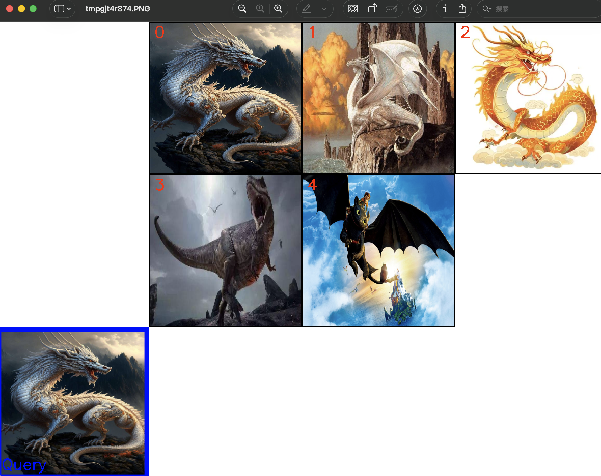

> 这一篇不再停留在概念层，而是把前面的知识点真正串起来，做一条从图文编码到 Milvus 检索的完整链路。

# RAG - Milvus多模态实践
## 1. 初始化与工具定义
首先导入所有必需的库，定义好模型路径、数据目录等常量。为了代码的整洁和复用，将 Visualized-BGE 模型的加载和编码逻辑封装在一个 Encoder 类中，并定义了一个 visualize_results 函数用于后续的结果可视化。
```python
import os
from tqdm import tqdm
from glob import glob
import torch
from visual_bge.visual_bge.modeling import Visualized_BGE
from pymilvus import MilvusClient, FieldSchema, CollectionSchema, DataType
import numpy as np
import cv2
from PIL import Image

# 1. 初始化设置
MODEL_NAME = "BAAI/bge-base-en-v1.5"
MODEL_PATH = "../../models/bge/Visualized_base_en_v1.5.pth"
DATA_DIR = "../../data/C3"
COLLECTION_NAME = "multimodal_demo"
MILVUS_URI = "http://localhost:19530"

# 2. 定义工具 (编码器和可视化函数)
class Encoder:
    """编码器类，用于将图像和文本编码为向量。"""
    def __init__(self, model_name: str, model_path: str):
        self.model = Visualized_BGE(model_name_bge=model_name, model_weight=model_path)
        self.model.eval()

    def encode_query(self, image_path: str, text: str) -> list[float]:
        with torch.no_grad():
            query_emb = self.model.encode(image=image_path, text=text)
        return query_emb.tolist()[0]

    def encode_image(self, image_path: str) -> list[float]:
        with torch.no_grad():
            query_emb = self.model.encode(image=image_path)
        return query_emb.tolist()[0]

def visualize_results(query_image_path: str, retrieved_images: list, img_height: int = 300, img_width: int = 300, row_count: int = 3) -> np.ndarray:
    """从检索到的图像列表创建一个全景图用于可视化。"""
    panoramic_width = img_width * row_count
    panoramic_height = img_height * row_count
    panoramic_image = np.full((panoramic_height, panoramic_width, 3), 255, dtype=np.uint8)
    query_display_area = np.full((panoramic_height, img_width, 3), 255, dtype=np.uint8)

    # 处理查询图像
    query_pil = Image.open(query_image_path).convert("RGB")
    query_cv = np.array(query_pil)[:, :, ::-1]
    resized_query = cv2.resize(query_cv, (img_width, img_height))
    bordered_query = cv2.copyMakeBorder(resized_query, 10, 10, 10, 10, cv2.BORDER_CONSTANT, value=(255, 0, 0))
    query_display_area[img_height * (row_count - 1):, :] = cv2.resize(bordered_query, (img_width, img_height))
    cv2.putText(query_display_area, "Query", (10, panoramic_height - 20), cv2.FONT_HERSHEY_SIMPLEX, 1, (255, 0, 0), 2)

    # 处理检索到的图像
    for i, img_path in enumerate(retrieved_images):
        row, col = i // row_count, i % row_count
        start_row, start_col = row * img_height, col * img_width
        
        retrieved_pil = Image.open(img_path).convert("RGB")
        retrieved_cv = np.array(retrieved_pil)[:, :, ::-1]
        resized_retrieved = cv2.resize(retrieved_cv, (img_width - 4, img_height - 4))
        bordered_retrieved = cv2.copyMakeBorder(resized_retrieved, 2, 2, 2, 2, cv2.BORDER_CONSTANT, value=(0, 0, 0))
        panoramic_image[start_row:start_row + img_height, start_col:start_col + img_width] = bordered_retrieved
        
        # 添加索引号
        cv2.putText(panoramic_image, str(i), (start_col + 10, start_row + 30), cv2.FONT_HERSHEY_SIMPLEX, 1, (0, 0, 255), 2)

    return np.hstack([query_display_area, panoramic_image])
```

初看代码两眼一黑，现在我们来拆解。

开头导包的环节，有几个还不太熟悉的，简单看看。tqdm是一个快速可拓展的python进度条，glob是用来查看符合特定规则的目录和文件将搜索到的结果返回到一个列表。

导入模型的环节，作者有一个带setup.py的路径all-in-rag/code/C3/visual_bge，下面有一个visual_bge文件夹，里面还有modeling.py，作者就是从这里导入了这个Visualized_BGE类。这是作者对将几部分模型能力拼出来的，比如文本部分用Hugging Face 的 AutoConfig / AutoModel 加载 BGE 底座；视觉部分用 create_eva_vision_and_transforms(...) 引入 EVA-CLIP 视觉编码器；对齐层作者自己加了一个 visual_proj = nn.Linear(...)，把视觉特征映射到和 BGE 一致的语义空间；权重加载通过 self.load_state_dict(torch.load(...)) 把训练好的 Visualized-BGE 权重灌进去。

然后就是pymilvus提供的几个包，和处理图像用的几个包。

常量配置部分，做了一些全局配置，包括模型名、目录、Collection名、Milvus地址。

Encoder类封装了关键的encode_image()和encode_query()方法，用于创建模型对象进行推理，将输出的二位张量取出需要的向量，包含纯图片和图+文，从而得到嵌入向量。

visualize_results则是可视化结果。

## 2. 创建Colletion
这是与 Milvus 交互的开始。首先初始化 Milvus 客户端，然后定义 Collection 的 Schema，它规定了集合的数据结构。
```python
# 3. 初始化客户端
print("--> 正在初始化编码器和Milvus客户端...")
encoder = Encoder(MODEL_NAME, MODEL_PATH)
milvus_client = MilvusClient(uri=MILVUS_URI)

# 4. 创建 Milvus Collection
print(f"\n--> 正在创建 Collection '{COLLECTION_NAME}'")
if milvus_client.has_collection(COLLECTION_NAME):
    milvus_client.drop_collection(COLLECTION_NAME)
    print(f"已删除已存在的 Collection: '{COLLECTION_NAME}'")

image_list = glob(os.path.join(DATA_DIR, "dragon", "*.png"))
if not image_list:
    raise FileNotFoundError(f"在 {DATA_DIR}/dragon/ 中未找到任何 .png 图像。")
dim = len(encoder.encode_image(image_list[0]))

fields = [
    FieldSchema(name="id", dtype=DataType.INT64, is_primary=True, auto_id=True),
    FieldSchema(name="vector", dtype=DataType.FLOAT_VECTOR, dim=dim),
    FieldSchema(name="image_path", dtype=DataType.VARCHAR, max_length=512),
]

# 创建集合 Schema
schema = CollectionSchema(fields, description="多模态图文检索")
print("Schema 结构:")
print(schema)

# 创建集合
milvus_client.create_collection(collection_name=COLLECTION_NAME, schema=schema)
print(f"成功创建 Collection: '{COLLECTION_NAME}'")
print("Collection 结构:")
print(milvus_client.describe_collection(collection_name=COLLECTION_NAME))
```

这里的代码比较直白，但是涉及到和Milvus的交互，注意几个方法。首先用`MilvusClient`类创建实例，然后做了一个预先处理：如果有同名Collection，先drop掉（这是为了每次从干净状态开始，否则会有旧数据残留的可能，正式生产环境一般不会这么做，这么做事为了反复运行demo）。

紧接着，用glob来提取png成列表，通过 `encoder.encode_image(image_list[0])` 对第一张图片进行编码，并用 `len(...)` 获取向量维度。这是因为 Milvus 在创建 `FLOAT_VECTOR` 字段时，必须提前知道向量维度。

接着，我们去定义一下需要用的元素的类型作为schema，传入`create_collection`方法构建collection。本次定义了三个字段，作为主键的id，INT64；图像对应的向量类型，类型为FLOAT_VECTOR；然后是图片路径，类型VERCHAR。

然后，我们传入Schema去构建了Collection。

输出Collections和Schema的结构类似于（此处是作者示例）：
```txt
--> 正在创建 Collection 'multimodal_demo'

Schema 结构:
{
    'auto_id': True, 
    'description': '多模态图文检索', 
    'fields': [
        {'name': 'id', 'description': '', 'type': <DataType.INT64: 5>, 'is_primary': True, 'auto_id': True}, 
        {'name': 'vector', 'description': '', 'type': <DataType.FLOAT_VECTOR: 101>, 'params': {'dim': 768}}, 
        {'name': 'image_path', 'description': '', 'type': <DataType.VARCHAR: 21>, 'params': {'max_length': 512}}
    ], 
    'enable_dynamic_field': False
}

成功创建 Collection: 'multimodal_demo'

Collection 结构:
{
    'collection_name': 'multimodal_demo', 
    'auto_id': True, 
    'num_shards': 1, 
    'description': '多模态图文检索', 
    'fields': [
        {'field_id': 100, 'name': 'id', 'description': '', 'type': <DataType.INT64: 5>, 'params': {}, 'auto_id': True, 'is_primary': True}, 
        {'field_id': 101, 'name': 'vector', 'description': '', 'type': <DataType.FLOAT_VECTOR: 101>, 'params': {'dim': 768}}, 
        {'field_id': 102, 'name': 'image_path', 'description': '', 'type': <DataType.VARCHAR: 21>, 'params': {'max_length': 512}}
    ], 
    'functions': [], 
    'aliases': [], 
    'collection_id': 459243798405253751, 
    'consistency_level': 2, 
    'properties': {}, 
    'num_partitions': 1, 
    'enable_dynamic_field': False, 
    'created_timestamp': 459249546649403396, 
    'update_timestamp': 459249546649403396
}
```

## 3. 准备并插入数据

创建好 Collection 后，需要将数据填充进去。通过遍历指定目录下的所有图片，将它们逐一编码成向量，然后与图片路径一起组织成符合 Schema 结构的格式，最后批量插入到 Collection 中。

```python
# 5. 准备并插入数据
print(f"\n--> 正在向 '{COLLECTION_NAME}' 插入数据")
data_to_insert = []
for image_path in tqdm(image_list, desc="生成图像嵌入"):
    vector = encoder.encode_image(image_path)
    data_to_insert.append({"vector": vector, "image_path": image_path})

if data_to_insert:
    result = milvus_client.insert(collection_name=COLLECTION_NAME, data=data_to_insert)
    print(f"成功插入 {result['insert_count']} 条数据。")
```

## 4. 创建索引

为了实现快速检索，需要为向量字段创建索引。这里选择 HNSW 索引，它在召回率和查询性能之间有着很好的平衡。创建索引后，必须调用 load_collection 将集合加载到内存中才能进行搜索。

```python
# 6. 创建索引
print(f"\n--> 正在为 '{COLLECTION_NAME}' 创建索引")
index_params = milvus_client.prepare_index_params()
index_params.add_index(
    field_name="vector",
    index_type="HNSW",
    metric_type="COSINE",
    params={"M": 16, "efConstruction": 256}
)
milvus_client.create_index(collection_name=COLLECTION_NAME, index_params=index_params)
print("成功为向量字段创建 HNSW 索引。")
print("索引详情:")
print(milvus_client.describe_index(collection_name=COLLECTION_NAME, index_name="vector"))
milvus_client.load_collection(collection_name=COLLECTION_NAME)
print("已加载 Collection 到内存中。")
```

## 5. 执行多模态检索
```python
# 7. 执行多模态检索
print(f"\n--> 正在 '{COLLECTION_NAME}' 中执行检索")
query_image_path = os.path.join(DATA_DIR, "dragon", "query.png")
query_text = "一条龙"
query_vector = encoder.encode_query(image_path=query_image_path, text=query_text)

search_results = milvus_client.search(
    collection_name=COLLECTION_NAME,
    data=[query_vector],
    output_fields=["image_path"],
    limit=5,
    search_params={"metric_type": "COSINE", "params": {"ef": 128}}
)[0]

retrieved_images = []
print("检索结果:")
for i, hit in enumerate(search_results):
    print(f"  Top {i+1}: ID={hit['id']}, 距离={hit['distance']:.4f}, 路径='{hit['entity']['image_path']}'")
    retrieved_images.append(hit['entity']['image_path'])
```

输出结果会类似：
```txt
--> 正在 'multimodal_demo' 中执行检索
检索结果:
  Top 1: ID=459243798403756667, 距离=0.9411, 路径='../../data/C3\dragon\dragon01.png'
  Top 2: ID=459243798403756668, 距离=0.5818, 路径='../../data/C3\dragon\dragon02.png'
  Top 3: ID=459243798403756671, 距离=0.5731, 路径='../../data/C3\dragon\dragon05.png'
  Top 4: ID=459243798403756670, 距离=0.4894, 路径='../../data/C3\dragon\dragon04.png'
  Top 5: ID=459243798403756669, 距离=0.4100, 路径='../../data/C3\dragon\dragon03.png'
```


## 6. 可视化与清理

最后，将检索到的图片路径用于可视化，生成一张直观的结果对比图。在完成所有操作后，应该释放 Milvus 中的资源，包括从内存中卸载 Collection 和删除整个 Collection。

```python
# 8. 可视化与清理
print(f"\n--> 正在可视化结果并清理资源")
if not retrieved_images:
    print("没有检索到任何图像。")
else:
    panoramic_image = visualize_results(query_image_path, retrieved_images)
    combined_image_path = os.path.join(DATA_DIR, "search_result.png")
    cv2.imwrite(combined_image_path, panoramic_image)
    print(f"结果图像已保存到: {combined_image_path}")
    Image.open(combined_image_path).show()

milvus_client.release_collection(collection_name=COLLECTION_NAME)
print(f"已从内存中释放 Collection: '{COLLECTION_NAME}'")
milvus_client.drop_collection(COLLECTION_NAME)
print(f"已删除 Collection: '{COLLECTION_NAME}'")
```

## 7. 结果
过程日志如下：
```txt
(all-in-rag) ➜  C3 git:(main) ✗ python 04_multi_milvus.py
/opt/homebrew/anaconda3/envs/all-in-rag/lib/python3.12/site-packages/timm/models/layers/__init__.py:49: FutureWarning: Importing from timm.models.layers is deprecated, please import via timm.layers
  warnings.warn(f"Importing from {__name__} is deprecated, please import via timm.layers", FutureWarning)
--> 正在初始化编码器和Milvus客户端...
tokenizer_config.json: 100%|█| 366/366 [00:00<00:00, 624kB/s
vocab.txt: 232kB [00:00, 826kB/s] 
special_tokens_map.json: 100%|█| 125/125 [00:00<00:00, 163kB
tokenizer.json: 711kB [00:00, 2.91MB/s]

--> 正在创建 Collection 'multimodal_demo'
Schema 结构:
{'auto_id': True, 'description': '多模态图文检索', 'fields': [{'name': 'id', 'description': '', 'type': <DataType.INT64: 5>, 'is_primary': True, 'auto_id': True}, {'name': 'vector', 'description': '', 'type': <DataType.FLOAT_VECTOR: 101>, 'params': {'dim': 768}}, {'name': 'image_path', 'description': '', 'type': <DataType.VARCHAR: 21>, 'params': {'max_length': 512}}], 'enable_dynamic_field': False}
成功创建 Collection: 'multimodal_demo'
Collection 结构:
{'collection_name': 'multimodal_demo', 'auto_id': True, 'num_shards': 1, 'description': '多模态图文检索', 'fields': [{'field_id': 100, 'name': 'id', 'description': '', 'type': <DataType.INT64: 5>, 'params': {}, 'auto_id': True, 'is_primary': True}, {'field_id': 101, 'name': 'vector', 'description': '', 'type': <DataType.FLOAT_VECTOR: 101>, 'params': {'dim': 768}}, {'field_id': 102, 'name': 'image_path', 'description': '', 'type': <DataType.VARCHAR: 21>, 'params': {'max_length': 512}}], 'functions': [], 'aliases': [], 'collection_id': 465268713610543383, 'consistency_level': 2, 'properties': {}, 'num_partitions': 1, 'enable_dynamic_field': False, 'created_timestamp': 465268727841554436, 'update_timestamp': 465268727841554436}

--> 正在向 'multimodal_demo' 插入数据
生成图像嵌入: 100%|███████████| 7/7 [00:02<00:00,  2.42it/s]
成功插入 7 条数据。

--> 正在为 'multimodal_demo' 创建索引
成功为向量字段创建 HNSW 索引。
索引详情:
{'M': '16', 'efConstruction': '256', 'metric_type': 'COSINE', 'index_type': 'HNSW', 'field_name': 'vector', 'index_name': 'vector', 'total_rows': 0, 'indexed_rows': 0, 'pending_index_rows': 0, 'state': 'Finished'}
已加载 Collection 到内存中。

--> 正在 'multimodal_demo' 中执行检索
检索结果:
  Top 1: ID=465268713610543405, 距离=0.9466, 路径='/Users/owen/AI_learning/RAG/all-in-rag/data/C3/dragon/query.png'
  Top 2: ID=465268713610543410, 距离=0.7443, 路径='/Users/owen/AI_learning/RAG/all-in-rag/data/C3/dragon/dragon02.png'
  Top 3: ID=465268713610543407, 距离=0.6851, 路径='/Users/owen/AI_learning/RAG/all-in-rag/data/C3/dragon/dragon06.png'
  Top 4: ID=465268713610543408, 距离=0.6049, 路径='/Users/owen/AI_learning/RAG/all-in-rag/data/C3/dragon/dragon03.png'
  Top 5: ID=465268713610543404, 距离=0.5360, 路径='/Users/owen/AI_learning/RAG/all-in-rag/data/C3/dragon/dragon05.png'

--> 正在可视化结果并清理资源
结果图像已保存到: /Users/owen/AI_learning/RAG/all-in-rag/data/C3/search_result.png
已从内存中释放 Collection: 'multimodal_demo'
已删除 Collection: 'multimodal_demo'
```

