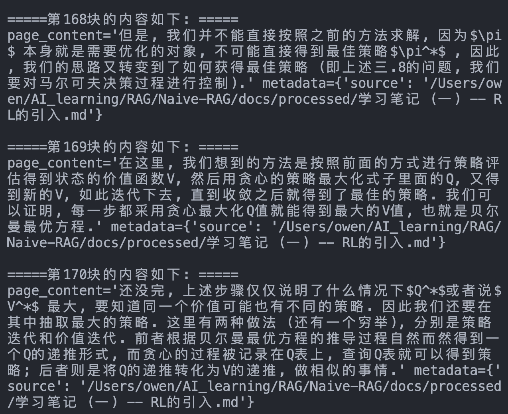
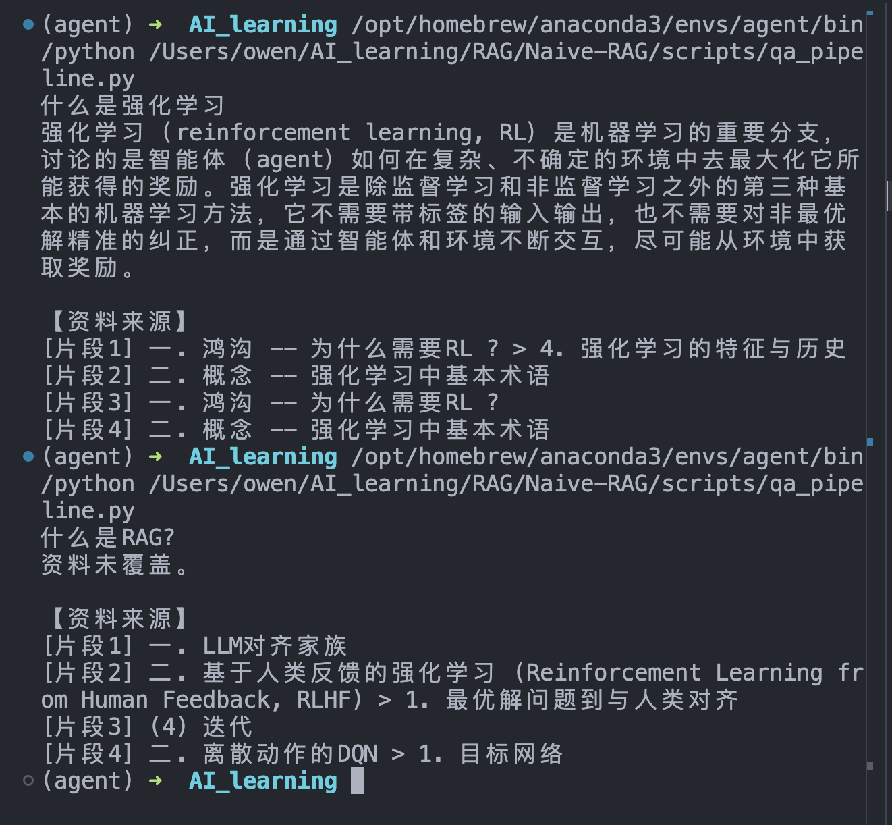
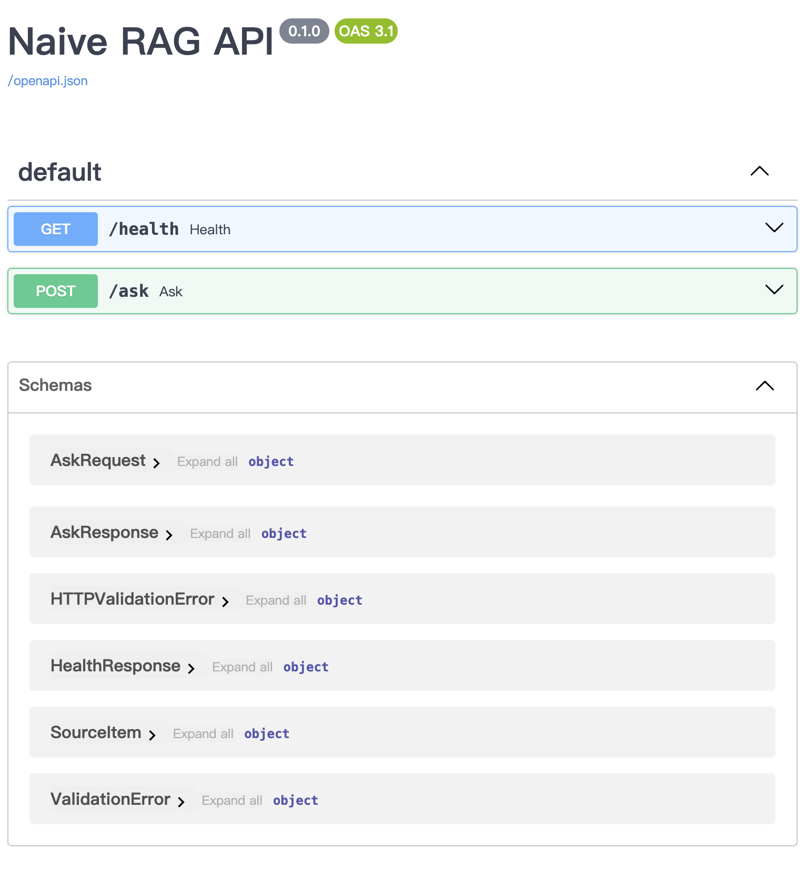
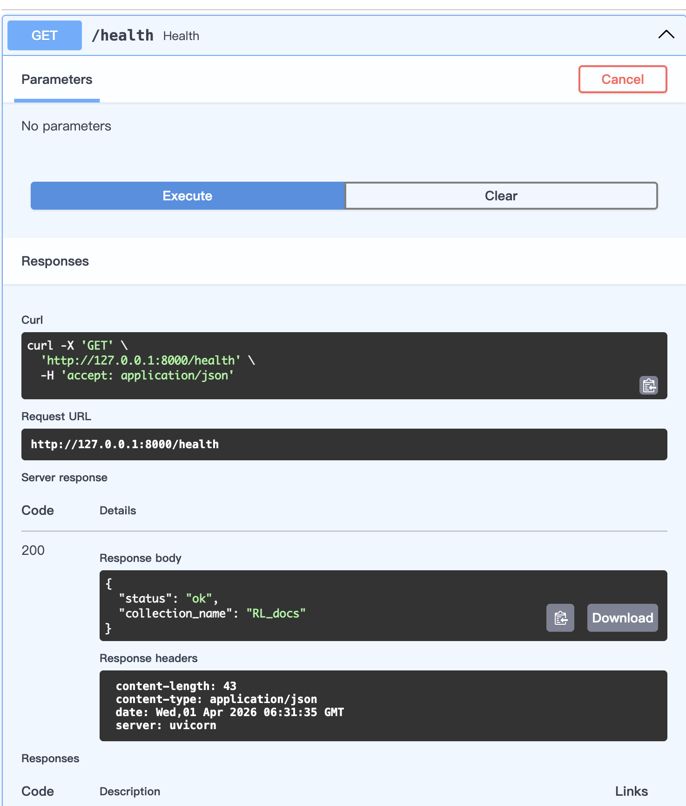
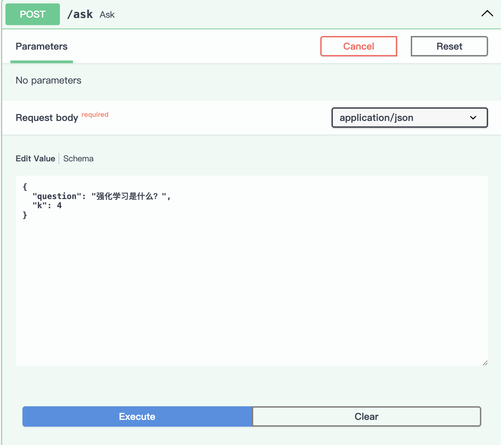
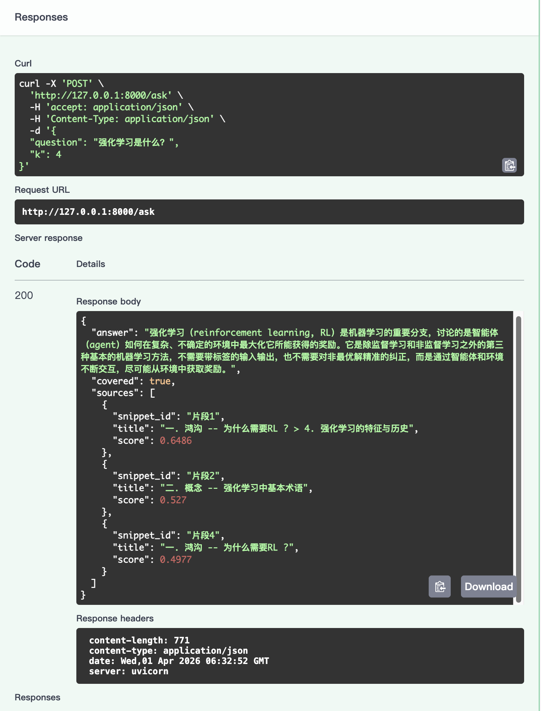
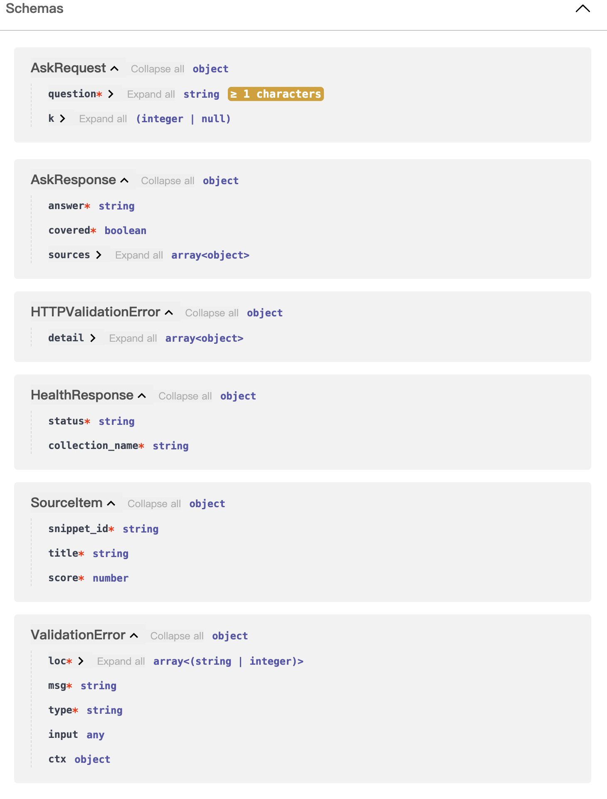
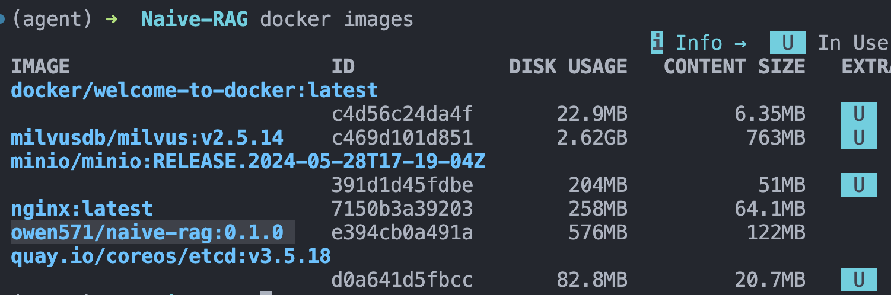
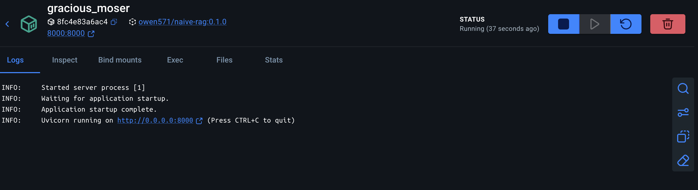
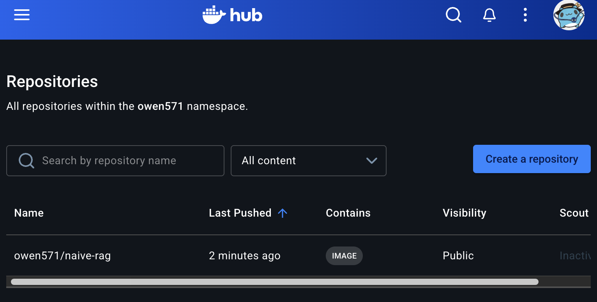

> 这一篇可以看作前面 1 到 6 篇的第一次汇总练习。目标不是做一个“很聪明”的系统，而是先把最小闭环打通：文档 -> 切分 -> 嵌入 -> Milvus -> 检索 -> 回答 -> API 服务。

# Naive-RAG 实战
## 1. 设想和路线
我们假设已经有LangChain的基础，RAG理论，Milvus入门的学习了，现在想要做一个简单的demo，目标是整合FastAPI + LangChain，做一个Naive-RAG端到端回答系统，然后用Docker打包发布，从而将部分学习的东西先变成整体，化为内功。

什么是Naive-RAG？简单来说，这就是最原始、最直接的RAG生成方式，分为“检索+生成”两步走。

我准备直接把我的强化学习文档作为检索来源，上传。

AI给我的最小交付建议：
- POST /ingest：上传 pdf/md/txt，完成切块、embedding、入库
- POST /ask：输入问题，返回答案、命中文档片段、来源
- GET /health：健康检查
- docker-compose up 能一键启动
- 准备一份 20~30 条的小评测集

并且评估不能靠“感觉答得不错”，要看4件事：
- 检索命中率：答案所在片段有没有进 top-k
- 答案正确性：回答是否接近参考答案
- Groundedness：回答是否被检索到的上下文支持
- 延迟/成本：一次问答耗时和 token 开销

回到我的资料，我准备用强化学习入门时候的笔记（文件是markdown），特点是有大量的图片，但是文字量本身不大，标题层级明显，章节结构不错。麻烦点在于图片里有关键知识，我决定预处理把图片先换成AI生成的图片描述，然后再处理纯文本的md。

第一阶段应该把重点放在“让回答严格受笔记约束”。主要是因为，RL算是LLM本来就很熟的领域，如果不限制就直接用自己的知识答了，所以我们第一版要做成grounded_only的设计（以后可以拓展）。

## 2. 文档入库
我必须先实现好文档的切分和入库。我采用在项目文件下写一个.env的方法，存入我的三方数据库和key，还有milvus相关配置。

经过边写边和AI沟通考虑，我将先写下处理单个文档的脚本`markdown_splitter.py`，它对外暴露split_markdown_file，返回一个list[Document]（Document是langchain.core里面的一个类，用于处理文件，后续RAG大多依赖于这个）。对文档我们采用两级切分，首先按markdown语法切分，然后再检索其中过长的块，进行第二次Recursive切分。代码如下：
```python
from langchain_text_splitters import MarkdownHeaderTextSplitter
from langchain_text_splitters import RecursiveCharacterTextSplitter
from langchain_community.document_loaders import TextLoader
from pathlib import Path
from langchain_core.documents import Document


def _load_markdown_txt(file_path:Path) -> str:
    """
    根据路径加载markdown文件
    """
    loader = TextLoader(file_path)
    docs = loader.load()
    return docs[0].page_content

def _split_by_header(text:str) -> list[Document]:
    """
    对markdown文件进行第一次切分
    """
    markdown_spliter = MarkdownHeaderTextSplitter(
        strip_headers = False,
        headers_to_split_on=[
            ("#","h1"),
            ("##","h2"),
            ("###","h3")
        ],
        return_each_line = False
    )
    return markdown_spliter.split_text(text)
   

def _split_large_chunks(chunks:list[Document]) -> list[Document]:
    """
    对Document列表较长的块进一步切分
    """
    recursive_split = RecursiveCharacterTextSplitter(
        # 我当时笔记喜欢半角标点
        separators=["\n\n","\n",". ",", "," ",""],
        chunk_size = 300,
        chunk_overlap = 20,
    )

    docs_list = []

    for chunk in chunks:
        if len(chunk.page_content)>300:
            i = recursive_split.split_documents([chunk])
            docs_list.extend(i)
        else:
            docs_list.append(chunk)
    return docs_list


def split_markdown_file(file_path:Path) -> list[Document]:
    """
    对外接口，传入md文件路径，返回切分完成的documents
    """
    text = _load_markdown_txt(file_path)
    header_chunks = _split_by_header(text)
    final_chunks = _split_large_chunks(header_chunks)
    return final_chunks


def _resolve_debug_target() -> Path:
    """默认取 processed 目录下一篇 markdown，方便单独调试 splitter。可以自己改第几个。"""
    script_path = Path(__file__).resolve()
    project_root = script_path.parent.parent
    processed_dir = project_root / "docs" / "processed"
    md_files = sorted(processed_dir.glob("*.md"))
    if not md_files:
        raise FileNotFoundError(f"在 {processed_dir} 下没有找到 markdown 文件")
    return md_files[0]


if __name__ == "__main__":
    import sys

    if len(sys.argv) > 1:
        target_file = Path(sys.argv[1]).expanduser().resolve()
    else:
        target_file = _resolve_debug_target()

    chunks = split_markdown_file(target_file)
    print(f"调试文件: {target_file}")
    print(f"总块数: {len(chunks)}")
    print()

    for i, chunk in enumerate(chunks):
        print("=" * 10 + f" 第{i}块 " + "=" * 10)
        print(f"长度: {len(chunk.page_content)}")
        print(f"metadata: {chunk.metadata}")
        print("正文预览:")
        print(chunk.page_content[:400])
        print()

```



## 3. chunk加载进库
前面我们已经切分完毕，现在写一个`docs_to_milvus.py`函数，负责创建需要的Collection并且将chunk调整成适合schema的字典，插入Collection。
```python
from markdown_splitter import split_markdown_file
from pathlib import Path
from pymilvus import MilvusClient, FieldSchema, CollectionSchema, DataType
from dotenv import load_dotenv
import os
from langchain_openai import OpenAIEmbeddings

# 根目录相对设置
script_path = Path(__file__).resolve()
project_path = script_path.parent.parent

# 资源寻路
processed_dir = project_path/"docs"/"processed"
env_path = project_path/".env"

# 全局变量
load_dotenv(env_path)


# 开始切分docs
# Path.glob(...)返回的不是列表本身，而是一个可迭代对象
print("=" * 5 + "正在切分md文件" + "=" * 5 + "\n")
chunk_list = []
for file_path in processed_dir.glob("*.md"):
    chunk_list.extend(split_markdown_file(file_path))
print("=" * 5 + "文件切分完成" + "=" * 5 + "\n")


# 开始连接milvus
# 建立客户端连接
client = MilvusClient(uri = os.environ.get("MILVUS_URL"))


# 进行嵌入
# 我这里从中转站随便挑了一个text-embedding-3-small，默认嵌入长度是1536
# 进行嵌入
print("=" * 5 + "正在嵌入chunk" + "=" * 5 + "\n")
embedding_model = OpenAIEmbeddings(
    model="text-embedding-3-small",
    api_key=os.environ.get("QIHANG_API"),
    base_url=os.environ.get("QIHANG_BASE_URL"),
)

# 遍历 chunk list，将 page_content 放入列表，批量嵌入
page_content_list = [chunk.page_content for chunk in chunk_list]

vectors = embedding_model.embed_documents(page_content_list)

print("=" * 5 + "嵌入完成" + "=" * 5 + "\n")

# print(f"chunk 数量: {len(page_content_list)}")
# print(f"向量数量: {len(vectors)}")
# print(f"单个向量维度: {len(vectors[0])}")


# 动态得到需要嵌入的维度
vector_dim = len(vectors[0])

print("=" * 5 + "开始构造Collection" + "=" * 5 + "\n")
# 动态判断text所需要最大长度
# 注意不是字符数而是token数，要encode一下
max_length_text = 0
max_length_title = 0
for chunk in chunk_list:
    max_length_text = max(max_length_text,len(chunk.page_content.encode("utf-8")))
    max_length_title = max(max_length_title,len(chunk.metadata.get("h1","").encode("utf-8")),len(chunk.metadata.get("h2","").encode("utf-8")),len(chunk.metadata.get("h3","").encode("utf-8")))


# 定义Collection的schema
fields = [
    FieldSchema(
        name = "id",
        dtype = DataType.INT64,
        description="作为主键的id",
        is_primary = True,
        auto_id = True
    ),
    FieldSchema(
        name = "vector",
        dtype = DataType.FLOAT_VECTOR, 
        # dim必须和嵌入模型一致
        dim = vector_dim,
        description = "存储chunk的向量"
    ),
    FieldSchema(
        name = "text",
        dtype = DataType.VARCHAR,
        # VARCHAR的最大长度
        max_length = max_length_text,
        description = "原始page_content文本"
    ),
    FieldSchema(
        name = "h1",
        dtype = DataType.VARCHAR,
        max_length = max_length_title,
        description = "一级标题"
    ),
    FieldSchema(
        name = "h2",
        dtype = DataType.VARCHAR,
        max_length = max_length_title,
        description = "二级标题"
    ),
    FieldSchema(
        name = "h3",
        dtype = DataType.VARCHAR,
        max_length = max_length_title,
        description = "三级标题"
    )
]

schema = CollectionSchema(fields)

# 创建Collection，注意去重
if client.has_collection("RL_docs"):
    client.drop_collection("RL_docs")

# 创建collection
client.create_collection(
    collection_name="RL_docs", 
    schema=schema
)

# 给Collection建立索引
index_params = client.prepare_index_params()
index_params.add_index(
    field_name="vector",
    index_type="FLAT",
    index_name="vector_index",
    metric_type="COSINE",
    params={},
)
client.create_index(
    collection_name="RL_docs", index_params=index_params
)


print("=" * 5 + "Collection构造完成" + "=" * 5 + "\n")

# print(len(data) == len(vectors))

# 开始构建Milvus insert data并插入
# data里面是Document的list，vectors是向量，现在对齐遍历
# 我们最终需要一个列表，里面有所有对应chunk数目的字典数，字典对应schema字段

print("=" * 5 + "数据入库中" + "=" * 5 + "\n")
records = []
for chunk, vec in zip(chunk_list, vectors):
    record = {
        "vector": vec,
        "text": chunk.page_content,
        "h1": chunk.metadata.get("h1", ""),
        "h2": chunk.metadata.get("h2", ""),
        "h3": chunk.metadata.get("h3", ""),
    }
    records.append(record)

print("=" * 5 + "入库已完成" + "=" * 5 + "\n")
client.insert(
    collection_name = "RL_docs",
    data = records
)
```
## 4. 本地QA
为了先看看Naive-RAG是否已经形成了完整的通路，我们现在本地用聊天模型试试效果。代码`qa_pipeline.py`和运行结果如下：
```python
# 本地问答测试
from langchain.chat_models import init_chat_model
from dotenv import load_dotenv
from pathlib import Path
from pymilvus import MilvusClient
from langchain_openai import OpenAIEmbeddings
import os

# 加载项目相对路径
script_path = Path(__file__).resolve()
project_path = script_path.parent.parent
env_path = project_path/".env"

# 加载全局配置
load_dotenv(env_path)
COLLECTION_NAME = "RL_docs"
TOP1_THRESHOLD = 0.45
HIT_THRESHOLD = 0.40

# 连接数据库
client = MilvusClient(uri = os.environ.get("MILVUS_URL"))


# 加载embedding模型
embeddings_model = OpenAIEmbeddings(
    model = "text-embedding-3-small",
    api_key = os.environ.get("QIHANG_API"),
    base_url = os.environ.get("QIHANG_BASE_URL")
)

# 加载聊天模型
chat_model = init_chat_model(
    model = "openai:gpt-4o-mini",
    temperature=0.5,
    timeout=30,
    max_retries=6, 
    api_key = os.environ.get("QIHANG_API"),
    base_url = os.environ.get("QIHANG_BASE_URL")
)


# 加载Collection
if not client.has_collection(COLLECTION_NAME):
    raise ValueError(f"Collection {COLLECTION_NAME} 不存在，请先运行入库脚本")

client.load_collection(collection_name=COLLECTION_NAME)


def retrieve(question, k = 4):
    """
    查询并返回topk结果
    """
    query_vector = embeddings_model.embed_query(question)
    result = client.search(
        collection_name = COLLECTION_NAME,
        data = [query_vector],
        limit = k,
        output_fields=["text","h1","h2","h3"],
        anns_field = "vector",
        search_params={"metric_type": "COSINE", "params": {}},
    )
    return result[0]


def filter_hits(hits, top1_threshold=TOP1_THRESHOLD, hit_threshold=HIT_THRESHOLD):
    """
    根据相似度分数过滤检索结果:
    1. top1 太低时直接视为未命中
    2. 只保留达到最低阈值的片段
    """
    if not hits:
        return []

    top1_score = hits[0].get("distance", 0.0)
    if top1_score < top1_threshold:
        return []

    return [hit for hit in hits if hit.get("distance", 0.0) >= hit_threshold]


def build_context(hits):
    """
    将 Milvus 命中结果拼成带编号、标题、正文的上下文
    """
    blocks = []

    # 从1开始编号
    for idx, hit in enumerate(hits, start=1):
        entity = hit.get("entity", {})

        text = entity.get("text", "").strip()
        h1 = entity.get("h1", "").strip()
        h2 = entity.get("h2", "").strip()
        h3 = entity.get("h3", "").strip()

        title_parts = [part for part in [h1, h2, h3] if part]
        title_path = " > ".join(title_parts) if title_parts else "未标注标题"

        block = (
            f"[片段{idx}]\n"
            f"标题：{title_path}\n"
            f"内容：{text}"
        )
        blocks.append(block)

    return "\n\n".join(blocks)


def build_sources(hits):
    """
    对检索到的内容，生成标注字符串
    """
    sources = []

    for idx, hit in enumerate(hits, start=1):
        entity = hit.get("entity", {})
        h1 = entity.get("h1", "").strip()
        h2 = entity.get("h2", "").strip()
        h3 = entity.get("h3", "").strip()

        title_parts = [part for part in [h1, h2, h3] if part]
        title_path = " > ".join(title_parts) if title_parts else "未标注标题"

        sources.append(f"[片段{idx}] {title_path}")

    return "【资料来源】\n" + "\n".join(sources)


def answer(question):
    """
    结合搜索结果回答问题
    """
    SYSTEM_MESSAGE = """
    你是一个基于强化学习资料回答问题的助手，只能根据给定片段回答。
    如果资料没有覆盖，就明确回答“资料未覆盖”。
    不要使用外部知识，不要编造来源。

    以下是检索到的资料片段：
    """
    raw_hits = retrieve(question)
    hits = filter_hits(raw_hits)
    if not hits:
        return "资料未覆盖。"

    context = build_context(hits)
    sources = build_sources(hits)
    result = chat_model.invoke(
    [
        {"role":"system","content":SYSTEM_MESSAGE + context},
        {"role":"user","content":question}
    ]
    )
    return result.content + "\n\n" + sources


if __name__ == "__main__":
    question = input().strip()
    result = answer(question)
    print(result)
```




## 5. FastAPI
我们在Naive-RAG下面再创建一个文件夹叫做app，并存放逻辑，将其做成一个最小但是像项目的结构。

原来的 qa_pipeline.py
-> 被拆成 rag_service.py + schemas.py + main.py

原来脚本里的 os.environ.get(...)
-> 收到 config.py

原来的 if __name__ == "__main__":
-> 变成了 FastAPI 的 /ask 路由

原来“打印字符串结果”
-> 变成结构化 API 响应

这样使得结果更适应FastAPI。

一个一个来，我们先看看`app/rag_service.py`，它是将之前的所有流程都封装了进去，对外暴露一个RAGService类。当然，逻辑和前面都是一样。
```python
from langchain.chat_models import init_chat_model
from langchain_openai import OpenAIEmbeddings
from pymilvus import MilvusClient

from .config import Settings
from .schemas import AskResponse, SourceItem


SYSTEM_MESSAGE = """
你是一个基于强化学习资料回答问题的助手，只能根据给定片段回答。
如果资料没有覆盖，就明确回答“资料未覆盖”。
不要使用外部知识，不要编造来源，也不要假装自己看过未提供的资料。

以下是检索到的资料片段：
""".strip()


# 用一个RAGSerice类，封装整个流程
class RAGService:
    def __init__(self, settings: Settings):
        self.settings = settings
        self.client = MilvusClient(uri=settings.milvus_url)

        if not self.client.has_collection(settings.collection_name):
            raise ValueError(
                f"Collection {settings.collection_name} 不存在，请先运行入库脚本"
            )

        self.client.load_collection(collection_name=settings.collection_name)

        self.embeddings_model = OpenAIEmbeddings(
            model=settings.embedding_model,
            api_key=settings.qihang_api,
            base_url=settings.qihang_base_url,
        )

        self.chat_model = init_chat_model(
            model=settings.chat_model,
            model_provider="openai",
            temperature=settings.chat_temperature,
            timeout=settings.chat_timeout,
            max_retries=settings.chat_max_retries,
            api_key=settings.qihang_api,
            base_url=settings.qihang_base_url,
        )

    def retrieve(self, question: str, k: int | None = None) -> list[dict]:
        query_vector = self.embeddings_model.embed_query(question)
        result = self.client.search(
            collection_name=self.settings.collection_name,
            data=[query_vector],
            limit=k or self.settings.default_k,
            output_fields=["text", "h1", "h2", "h3"],
            anns_field="vector",
            search_params={"metric_type": "COSINE", "params": {}},
        )
        return result[0]

    def filter_hits(self, hits: list[dict]) -> list[dict]:
        if not hits:
            return []

        top1_score = hits[0].get("distance", 0.0)
        if top1_score < self.settings.top1_threshold:
            return []

        return [
            hit
            for hit in hits
            if hit.get("distance", 0.0) >= self.settings.hit_threshold
        ]

    def build_context(self, hits: list[dict]) -> str:
        blocks: list[str] = []
        for idx, hit in enumerate(hits, start=1):
            entity = hit.get("entity", {})
            text = entity.get("text", "").strip()
            h1 = entity.get("h1", "").strip()
            h2 = entity.get("h2", "").strip()
            h3 = entity.get("h3", "").strip()

            title_parts = [part for part in [h1, h2, h3] if part]
            title_path = " > ".join(title_parts) if title_parts else "未标注标题"

            blocks.append(
                f"[片段{idx}]\n"
                f"标题：{title_path}\n"
                f"内容：{text}"
            )

        return "\n\n".join(blocks)

    def build_sources(self, hits: list[dict]) -> list[SourceItem]:
        sources: list[SourceItem] = []
        seen_titles: set[str] = set()

        for idx, hit in enumerate(hits, start=1):
            entity = hit.get("entity", {})
            h1 = entity.get("h1", "").strip()
            h2 = entity.get("h2", "").strip()
            h3 = entity.get("h3", "").strip()

            title_parts = [part for part in [h1, h2, h3] if part]
            title_path = " > ".join(title_parts) if title_parts else "未标注标题"

            if title_path in seen_titles:
                continue

            seen_titles.add(title_path)
            sources.append(
                SourceItem(
                    snippet_id=f"片段{idx}",
                    title=title_path,
                    score=round(hit.get("distance", 0.0), 4),
                )
            )

        return sources

    def answer(self, question: str, k: int | None = None) -> AskResponse:
        raw_hits = self.retrieve(question, k)
        hits = self.filter_hits(raw_hits)

        if not hits:
            return AskResponse(answer="资料未覆盖。", covered=False, sources=[])

        context = self.build_context(hits)
        response = self.chat_model.invoke(
            [
                {"role": "system", "content": f"{SYSTEM_MESSAGE}\n\n{context}"},
                {"role": "user", "content": question},
            ]
        )

        return AskResponse(
            answer=response.content.strip(),
            covered=True,
            sources=self.build_sources(hits),
        )
```

然后是`app/config.py`，这里直接对外暴露一个settings实例，以后直接调用即可。我们把默认设置和环境变量都在这里读取了先。
```python
from pathlib import Path

from pydantic import Field
from pydantic_settings import BaseSettings, SettingsConfigDict

app_path = Path(__file__).resolve()
project_path = app_path.parent.parent
env_path = project_path / ".env"


class Settings(BaseSettings):
    milvus_url: str = Field(validation_alias="MILVUS_URL")
    qihang_api: str = Field(validation_alias="QIHANG_API")
    qihang_base_url: str = Field(validation_alias="QIHANG_BASE_URL")

    collection_name: str = "RL_docs"
    embedding_model: str = "text-embedding-3-small"
    chat_model: str = "gpt-4o-mini"
    chat_temperature: float = 0.5
    chat_timeout: int = 30
    chat_max_retries: int = 6
    top1_threshold: float = 0.45
    hit_threshold: float = 0.40
    default_k: int = 4

    model_config = SettingsConfigDict(
        env_file=env_path,
        env_file_encoding="utf-8",
        extra="ignore",
    )


settings = Settings()
```
我们可以看到，这里用到了之前都没有用过的`from pydantic_settings import BaseSettings, SettingsConfigDict`。其实这属于专门用来写配置类的Pydantic基类。下面的语法，就是给BaseSettings配置行为用的，他告诉BaseSettings去哪个文件找配置，然后按什么编码读文件，遇到没有声明过的环境变量怎么处理。
```txt
model_config = SettingsConfigDict(
    env_file=env_path,
    env_file_encoding="utf-8",
    extra="ignore",
)
```

所以我们在Settings类中定义了milvus_url等，并把`validation_alias`设置成了MILVUS_URL，跟环境变量里面写的对上了。

然后，因为我们要做的FastAPI接口了，用户不再是“终端里的一句话”，而是一个HTTP请求。所以程序必须知道这个请求体的规范，这就要请app/schemas.py登场了：
```python
from pydantic import BaseModel, Field


class AskRequest(BaseModel):
    question: str = Field(..., min_length=1, description="用户提问内容")
    k: int | None = Field(default=None, ge=1, le=10, description="返回的检索片段数量")


class SourceItem(BaseModel):
    snippet_id: str
    title: str
    score: float


class AskResponse(BaseModel):
    answer: str
    covered: bool
    sources: list[SourceItem] = Field(default_factory=list)


class HealthResponse(BaseModel):
    status: str
    collection_name: str
```

里面定义了四个类。`AskRequest`是定义了/ask请求应该接受什么样的请求体，包括question用min_length = 1表示必填，k可选（我们在config中已经定义默认值为4了，不需要用户一定要每次请求提供）；`SourceItem`适用于定义单条来源信息的标准结构，因为每次回答我们还会返回一个来源列表，包含片段编号、标题、分数；`AskResponse`用于定义/ask最终返回给调用方的数据结构，包含答案、是否覆盖、来源列表；`HealthResponse`就是给/health用的。

其实可以返回的时候全写字典，但是这样写对FastAPI 文档自动生成更友好，而且更容易维护。我们可以看到，rag_service.py就引用了这些类来作为信息的包装。


最后，我们来看看`app/main.py`：
```python
from contextlib import asynccontextmanager

from fastapi import FastAPI, Request

from .config import settings
from .rag_service import RAGService
from .schemas import AskRequest, AskResponse, HealthResponse


@asynccontextmanager
async def lifespan(app: FastAPI):
    app.state.rag_service = RAGService(settings)
    yield


app = FastAPI(
    title="Naive RAG API",
    version="0.1.0",
    lifespan=lifespan,
)


@app.get("/health", response_model=HealthResponse)
async def health() -> HealthResponse:
    return HealthResponse(status="ok", collection_name=settings.collection_name)


@app.post("/ask", response_model=AskResponse)
async def ask(payload: AskRequest, request: Request) -> AskResponse:
    rag_service: RAGService = request.app.state.rag_service
    return rag_service.answer(payload.question, payload.k)
```
这个就是FastAPI的主入口，我们已经知道config.py 是配置入口，schemas.py 是接口协议，rag_service.py 是真正干活的业务层，那main.py的指责就很单纯了，它负责把HTTP请求接进来，再转交给RAGService。

先导入全局配置settings，导入fastapi的请求和对象，导入业务类RAGService，导入schemas中的各种规范类。

然后，用`lifespan`初始化一个全局可复用的RAGService，传入settings参数，生成并挂载应用级别全局对象`app.state.rag_service`。然后用`yield`表示初始化完成，可以开始处理请求（注意后面做FastAPI实例的时候传入一下lifespan）。然后，定义了一个健康检查路由`/health`，先用GET /health看看服务是否健康，并告诉连接的是哪个collection。

然后，就是重头戏/ask接口了，定义了一个用于POST /ask
的，按照AskRequest包装起来，调用RAGService的answer，返回。

使用`uvicorn app.main:app --reload`启动之后，我们直接访问文档页，`http://127.0.0.1:8000/docs#/`，发现就可以看到自己定义的接口和规范：


执行健康检查，状态没问题，并显示出Collection名：


执行ask，查看RAG链路是否正确：



再看一眼我们定义的Schemas：


不过另外要提醒一下，glob + 读文件 + 切分 + 入库依旧在`docs_to_milvus.py`里面，没有塞进FastAPI在线请求，不然会很重耦合（并且每次启动都要嵌入文件，很慢）。

## 6. Docker打包
在打包发布之前，我们先整理依赖。这个项目比较简单，可以记住用过哪些依赖。以后的开发最后都单独建一个环境，然后把用到的包都给freeze一下。
```txt
fastapi==0.135.1
uvicorn==0.42.0
pydantic==2.12.5
pydantic-settings==2.13.1
langchain==1.2.13
langchain-openai==1.1.12
pymilvus==2.6.11
python-dotenv==1.2.2
```

然后，我们写Dockerfile如下：
```txt
FROM python:3.11-slim

ENV PYTHONDONTWRITEBYTECODE=1 \
    PYTHONUNBUFFERED=1

WORKDIR /app

COPY requirements.txt .

RUN pip install --no-cache-dir --upgrade pip \
    && pip install --no-cache-dir -r requirements.txt

COPY app ./app

EXPOSE 8000

CMD ["uvicorn", "app.main:app", "--host", "0.0.0.0", "--port", "8000"]
```

这版本的Dockerfile，将FastAPI问答服务包装成一个可运行镜像，打包app在线服务层（不包含离线注入脚本）。以一个已经装好 Python 3.11 的轻量 Linux 镜像作为基础，`ENV PYTHONDONTWRITEBYTECODE=1 \ PYTHONUNBUFFERED=1`代表不生产`.pyc`字节码缓存文件；`PYTHONUNBUFFERED=1`让python日志立刻输出；`WORKDIR /app`表示设置容器内的工作目录；`COPY requirements.txt .`是把`requirements.txt`复制到`/app`下；然后我们RUN一下环境依赖（记得加`--no-cache-dir` ）；`COPY app ./app`表示将本地的app/目录复制到容器里`/app/app`，这里没有复制docs和scripts;`EXPOSE 8000`表好似暴露容器的8000端口到宿主机，最后用`CMD`命令表示启动的命令。

现在，来到项目根目录，就可以用`docker build -t owen571/naive-rag:0.1.0 .`根据file文件构建起来一个镜像。



然后我们用`docker run --rm -p 8000:8000 --env-file .env owen571/naive-rag:0.1.0`来确认是否构建镜像成功即可。这里还有几个坑：
1. 不能继续使用localhost，要是用`MILVUS_URL=http://host.docker.internal:19530`这样的说法。
2. 环境变量不需要引号，等号两边不能有空格。docker的-env-file检查比load_dotenv严格一点

如下启动完成了（由于没写名字，被临时取名了）



启动之后，我们会发现功能都是正常的。

## 7. 发布

登录时候，直接推送如下：
```
docker push owen571/naive-rag:0.1.0
```

