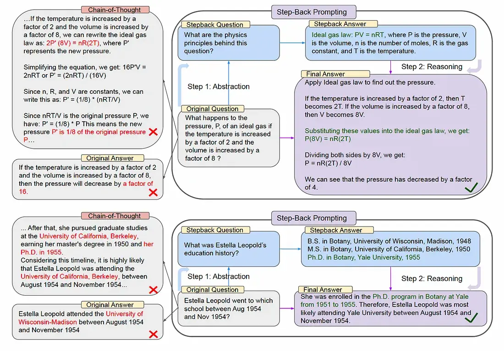
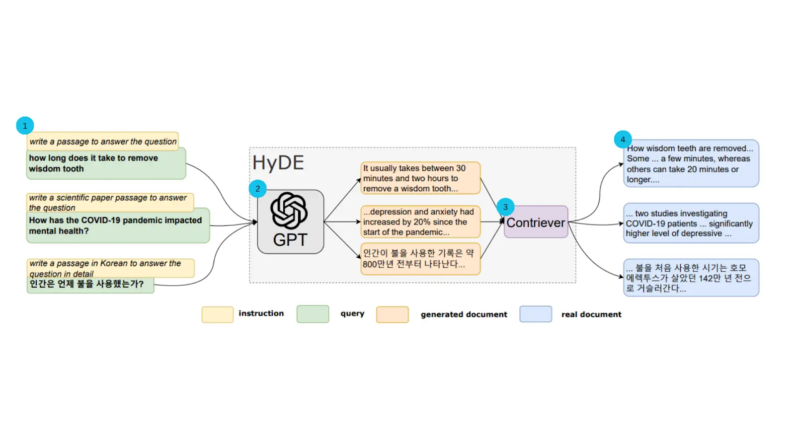
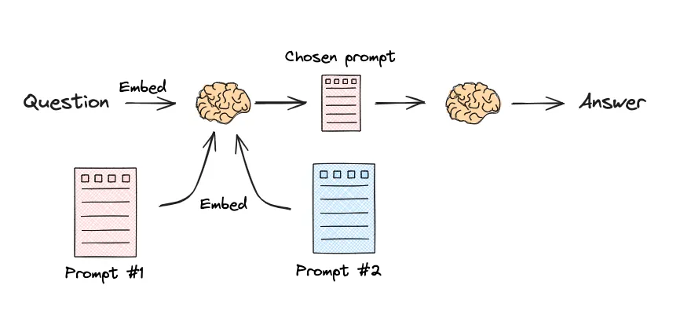

> 查询构建更像“把自然语言翻译成某种结构化查询”；这一篇进一步处理另一个问题：就算面对的还是普通文本检索，原始问题本身也未必是一个好 query。

# RAG - 查询重构与分发
# 一、引入
此前已经学习了如何从不同类型的数据源（如向量数据库、关系型数据库）中构建查询。然而，用户的原始问题往往不是最优的检索输入。它可能过于复杂、包含歧义，或者与文档的实际措辞存在偏差。为了解决这些问题，我们需要在检索之前对用户的查询进行“预处理”，这就是本节要探讨的查询重构与分发。

这个阶段主要包含两个关键技术：

1. 查询翻译（Query Translation）：将用户的原始问题转换成一个或多个更适合检索的形式。
2. 查询路由（Query Routing）：根据问题的性质，将其智能地分发到最合适的数据源或检索器。

本节将重点介绍几种主流的查询翻译技术，并简要讨论查询路由的概念。 

# 二、查询翻译
## 1. 提示工程
最直接的查询重构方法。通过精心设计的提示词（Prompt），可以引导 LLM 将用户的原始查询改写得更清晰、更具体，或者转换成一种更利于检索的叙述风格。比如，要求 LLM 直接分析用户的意图，并生成一个结构化（例如 JSON 格式）的指令，告诉我们的代码应该如何操作。

举例如下：
```txt
# 使用大模型将自然语言转换为排序指令
prompt = f"""你是一个智能助手，请将用户的问题转换成一个用于排序视频的JSON指令。

你需要识别用户想要排序的字段和排序方向。
- 排序字段必须是 'view_count' (观看次数) 或 'length' (时长) 之一。
- 排序方向必须是 'asc' (升序) 或 'desc' (降序) 之一。

例如:
- '时间最短的视频' 或 '哪个视频时间最短' 应转换为 {{"sort_by": "length", "order": "asc"}}
- '播放量最高的视频' 或 '哪个视频最火' 应转换为 {{"sort_by": "view_count", "order": "desc"}}

请根据以下问题生成JSON指令:
原始问题: "{query}"

JSON指令:"""
```

然后我们在代码中调用LLM，解析其返回的JSON指令。

## 2. 多查询分解
当用户提出一个复杂的问题时，直接用整个问题去检索可能效果不佳，因为它可能包含多个子主题或意图。分解技术的核心思想是将这个复杂问题拆分成多个更简单、更具体的子问题。然后，系统分别对每个子问题进行检索，最后将所有检索到的结果合并、去重，形成一个更全面的上下文，再交给 LLM 生成最终答案。

示例：
- 原始问题：“在《流浪地球》中，刘慈欣对人工智能和未来社会结构有何看法？”
- 分解后的子问题：
  - “《流浪地球》中描述的人工智能技术有哪些？”
  - “《流浪地球》中描绘的未来社会是怎样的？”
  - “刘慈欣关于人工智能的观点是什么？”

LangChain 提供了 MultiQueryRetriever 来完成这一过程。它在内部利用 LLM 将原始问题从不同角度分解成多个子问题，然后并行为每个子问题检索相关文档。最后，它将所有检索到的文档合并并去重，形成一个更全面的上下文，再传递给语言模型生成最终答案。通过这种策略，极大地丰富了检索结果，在有些应用中可以有效提升后续生成环节的质量。

## 3. 退步提示 （Step-Back Prompting）
退步提示是由 Google DeepMind 团队提出的一种旨在提升大语言模型推理能力的提示工程技巧。当面对一个细节繁多或过于具体的问题时，模型直接作答（即便是使用思维链）也容易出错。退步提示通过引导模型“退后一步”来解决这个问题。

其核心流程分为两步：
- 抽象化：首先，引导 LLM 从用户的原始具体问题中，生成一个更高层次、更概括的“退步问题”（Step-back Question）。这个退步问题旨在探寻原始问题背后的通用原理或核心概念。
- 推理：接着，系统会先获取“退步问题”的答案（例如，一个物理定律、一段历史背景等），然后将这个通用原理作为上下文，再结合原始的具体问题，进行推理并生成最终答案。


示例：

- 原始问题：“如果理想气体的温度增加2倍，体积增加8倍，其压力会如何变化？”
- 退步问题：“这个问题背后的物理原理是什么？”
- 推理过程：首先回答退步问题，得到“理想气体定律 PV=nRT”。然后基于这个定律，代入具体数值进行计算，最终得出压力变为原来的1/4。

## 4. 假设性文档嵌入（HyDE）
假设性文档嵌入（Hypothetical Document Embeddings, HyDE）是一种无需微调即可显著提升向量检索质量的查询改写技术，由 Luyu Gao 等人在其论文中首次提出。其核心是解决一个普遍存在于检索任务中的难题：用户的查询（Query）通常简短、关键词有限，而数据库中存储的文档则内容详实、上下文丰富，两者在语义向量空间中可能存在“鸿沟”，导致直接用查询向量进行搜索效果不佳。



HyDE 通过一种巧妙的方式来“绕过”这个问题：它不直接使用用户的原始查询，而是先利用一个生成式大语言模型（LLM）来生成一个“假设性”的、能够完美回答该查询的文档。然后，HyDE 将这个内容详实的假设性文档进行向量化，用其生成的向量去数据库中寻找与之最相似的真实文档。HyDE 的工作流程可以分为三个步骤：
- 生成：当接收到用户查询时，首先调用一个生成式 LLM（例如，GPT-3.5）。提示该模型根据查询生成一个详细的、可能是理想答案的文档。这个文档不必完全符合事实，但它必须在语义上与一个好的答案高度相关。
- 编码：将上一步生成的假设性文档输入到一个对比编码器（如 Contriever）中，将其转换为一个高维向量嵌入。这个向量在语义上代表了一个“理想答案”的位置。
- 检索：使用这个假设性文档的向量，在向量数据库中执行相似性搜索，找出与这个“理想答案”最接近的真实文档。这些被检索出的文档将作为最终的上下文信息。

通过这种方式，HyDE 将困难的“查询到文档”的匹配问题，转化为了一个相对容易的“文档到文档”的匹配问题，从而提升检索的准确率。

# 三、查询路由
查询路由（Query Routing） 是用于优化复杂 RAG 系统的一项关键技术。当系统接入了多个不同的数据源或具备多种处理能力时，就需要一个“智能调度中心”来分析用户的查询，并动态选择最合适的处理路径。其本质是替代硬编码规则，通过语义理解将查询分发至最匹配的数据源、处理组件或提示模板，从而提升系统的效率与答案的准确性。

查询路由有两种主流方法：
## 1. 基于LLM的意图识别
这是最灵活的方法。通过设计一个包含路由选项的提示词，让大语言模型（LLM）直接对用户的查询进行分类，并输出一个代表路由选择的标签。

- 实现流程：
    1. 定义清晰的路由选项（例如，数据源名称、功能分类）。
    2. LLM 分析查询并输出决策标签。
    3. 代码根据标签调用相应的检索器或工具。

该方法的核心在于构建一个“分类-分发”的流水线。

## 2. 嵌入相似性路由
这种方法不依赖 LLM 进行分类，延迟更低。它通过计算用户查询与预设的“路由示例语句”之间的向量嵌入相似度来做出决策。

