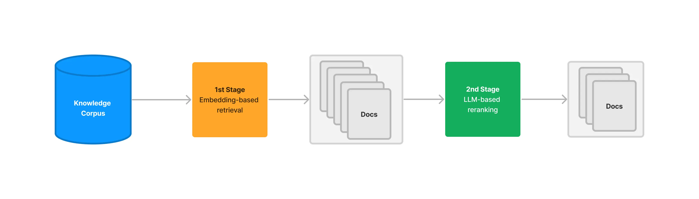
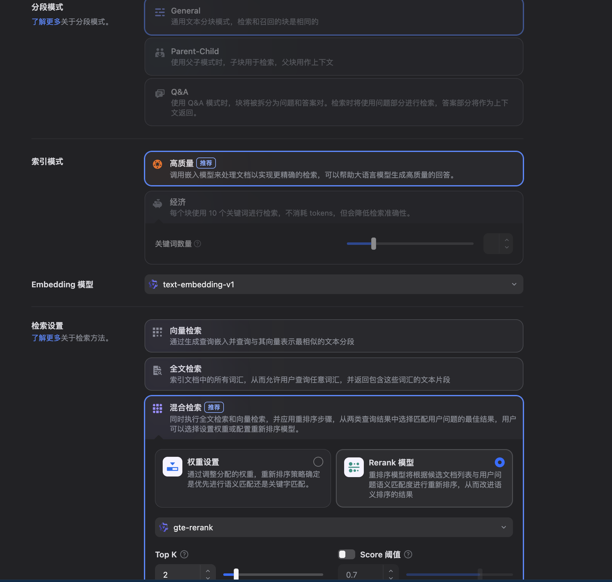
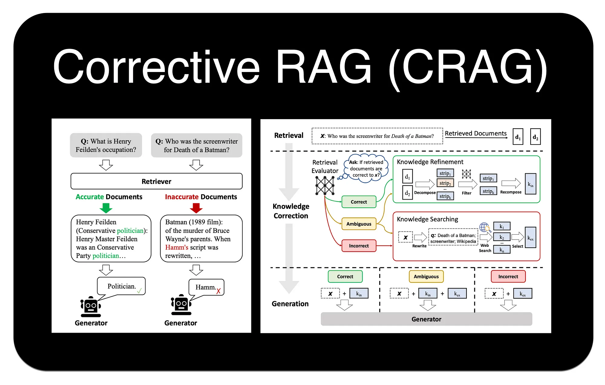

> 这篇可以看作“retrieval 后处理”专题。系统并不是把 top-k 原样喂给模型就结束了，很多质量差异其实发生在这一步之后。

# RAG - 检索进阶
在基础的 RAG 流程中，依赖向量相似度从知识库中检索信息。不过，这种方法存在一些固有的局限性，例如最相关的文档不总是在检索结果的顶端，以及语义理解的偏差等。为了构建更强大、更精准的生产级 RAG 应用，需要引入更高级的检索技术。

# 一、重排序（Re-ranking）
## 1. RRF（REciprocal Rank Fusion）
前面的章节已经介绍过RRF，它是一种简单而有效的零样本重排方法，不依赖于任何模型训练，而是纯粹基于文档在多个不同检索器（例如，一个稀疏检索器和一个密集检索器）结果列表中的排名来计算最终分数。但是如果只考虑排名信息，会忽略原始的相似度分数，可能丢失部分有用信息。

## 2. RankLLM/LLM-based Rerank
RankLLM 代表了一类直接利用大型语言模型本身来进行重排的方法。其基本逻辑非常直观：既然 LLM 最终要负责根据上下文来生成答案，那么为什么不直接让它来判断哪些上下文最相关呢？


这种方法通过一个精心设计的提示词来实现。该提示词会包含用户的查询和一系列候选文档（通常是文档的摘要或关键部分），然后要求 LLM 以特定格式（如 JSON）输出一个排序后的文档列表，并给出每个文档的相关性分数。

下面是一个提示的实例：
```python
以下是一个文档列表，每个文档都有一个编号和摘要。同时提供一个问题。请根据问题，按相关性顺序列出您认为需要查阅的文档编号，并给出相关性分数（1-10分）。请不要包含与问题无关的文档。

示例格式:
文档 1: <文档1的摘要>
文档 2: <文档2的摘要>
...
文档 10: <文档10的摘要>

问题: <用户的问题>

回答:
Doc: 9, Relevance: 7
Doc: 3, Relevance: 4
Doc: 7, Relevance: 3
```

## 3. Cross-Encoder重排
Cross-Encoder（交叉编码器）能提供出色的重排精度2。它的工作原理是将查询（Query）和每个候选文档（Document）拼接成一个单一的输入（例如，[CLS] query [SEP] document [SEP]），然后将这个整体输入到一个预训练的 Transformer 模型（如 BERT）中，模型最终会输出一个单一的分数（通常在 0 到 1 之间），这个分数直接代表了文档与查询的相关性。

它的工作流程如下：
- 初步检索：搜索引擎首先从知识库中召回一个初始的文档列表（例如，前 50 篇）。
- 逐一评分：对于列表中的每一篇文档，系统都将其与原始查询配对，然后发送给 Cross-Encoder 模型。
- 独立推理：模型对每个“查询-文档”对进行一次完整的、独立的推理计算，得出一个精确的相关性分数。
- 返回重排结果：系统根据这些新的分数对文档列表进行重新排序，并将最终结果返回给用户。

## 4. ColBERT重排
ColBERT（Contextualized Late Interaction over BERT）是一种创新的重排模型，它在 Cross-Encoder 的高精度和双编码器（Bi-Encoder）的高效率之间取得了平衡。采用了一种“后期交互”机制。

其工作流程如下：

1. 独立编码：ColBERT 分别为查询（Query）和文档（Document）中的每个 Token 生成上下文相关的嵌入向量。这一步是独立完成的，可以预先计算并存储文档的向量，从而加快查询速度。
2. 后期交互：在查询时，模型会计算查询中每个 Token 的向量与文档中每个 Token 向量之间的最大相似度（MaxSim）。
3. 分数聚合：最后，将查询中所有 Token 得到的最大相似度分数相加，得到最终的相关性总分。

通过这种方式，ColBERT 避免了将查询和文档拼接在一起进行昂贵的联合编码，同时又比单纯比较单个 [CLS] 向量的双编码器模型捕捉了更细粒度的词汇级交互信息。

## 5. 方法对比


| 特性     | RRF                | RankLLM                | Cross-Encoder                      | ColBERT            |
| -------- | ------------------ | ---------------------- | ---------------------------------- | ------------------ |
| 核心机制 | 融合多个排名       | LLM 推理，生成排序列表 | 联合编码查询与文档，计算单一相关分 | 独立编码，后期交互 |
| 计算成本 | 低（简单数学计算） | 中（API 费用与延迟）   | 高（N 次模型推理）                 | 中（向量点积计算） |
| 交互粒度 | 无（仅排名）       | 概念/语义级            | 句子级（Query-Doc Pair）           | Token 级           |
| 适用场景 | 多路召回结果融合   | 高价值语义理解场景     | Top-K 精排                         | Top-K 重排         |


## 6. 拓展
主流reranker，本质上还是“Cross-Encoder 风格的 query-doc 相关性打分”这条路线。不过分成了两种常见实现，经典 Cross-Encoder reranker和LLM-based reranker / foundation-model reranker。

我们可以实际看一下，允许用户自己搭建agent的Dify，在知识库设置界面的内容，学习一下成熟 RAG 产品的默认工程思路。


首先，切块方式就有不同了：
- General就是普通 chunking，检索块和返回块相同。
- Parent-Child是指子块用于检索，父块用于返回上下文。就是前面“上下文拓展”
- Q&A把文档显式拆成问答对。这说明在某些知识库里，最佳检索单元不是普通段落，而是结构化问答。

然后，还让用户选择索引模式：
- 高质量：调 embedding 模型做语义索引。Dify 提供三种检索设置：向量检索、全文检索和混合检索。
- 经济：每个块用10个关键词进行检索，仅提供倒排索引方式。

然后，Dify让用户选择检索配置。选择高质量的情况下，有以下几种选择：
- 向量检索：向量化用户输入的问题并生成查询向量，然后将其与知识库中对应的文本向量进行比较，找到最相邻的分段。在向量检索中，可以设置Rerank模型。
- 全文检索：索引文档中的所有词汇，允许用户查询任意词汇并返回包含这些词汇的文本片段。
- 混合检索：同时执行全文检索和向量检索。这里我可以基于权重分配决定优先语义匹配还是关键字匹配（对应前面的加权线性组合）；或者直接用Rerank模型，先做混合召回再统一重排。

最后，Dify还让你自己定义TopK和Score阈值（默认为0.5）。

# 二、压缩（Compression）
“压缩”技术旨在解决一个常见问题：初步检索到的文档块（Chunks）虽然整体上与查询相关，但可能包含大量无关的“噪音”文本。将这些未经处理的、冗长的上下文直接提供给 LLM，不仅会增加 API 调用的成本和延迟，还可能因为信息过载而降低最终生成答案的质量。

压缩的目标就是对检索到的内容进行“压缩”和“提炼”，只保留与用户查询最直接相关的信息。这可以通过两种主要方式实现：
1. 内容提取：从文档中只抽出与查询相关的句子或段落。
2. 文档过滤：完全丢弃那些虽然被初步召回，但经过更精细判断后认为不相关的整个文档。

## 1. ContextualCompressionRetriever
LangChain 提供了一个强大的组件 ContextualCompressionRetriever 来实现上下文压缩4。它像一个包装器，包裹在基础的检索器（如 FAISS.as_retriever()）之上。当基础检索器返回文档后，ContextualCompressionRetriever 会使用一个指定的 DocumentCompressor 对这些文档进行处理，然后再返回给调用者。

LangChain 内置了多种 DocumentCompressor：

- LLMChainExtractor: 这是最直接的压缩方式。它会遍历每个文档，并利用一个 LLM Chain 来判断并提取出其中与查询相关的部分。这是一种“内容提取”。
- LLMChainFilter: 这种压缩器同样使用 LLM，但它做的是“文档过滤”。它会判断整个文档是否与查询相关，如果相关，则保留整个文档；如果不相关，则直接丢弃。
- EmbeddingsFilter: 这是一种更快速、成本更低的过滤方法。它会计算查询和每个文档的嵌入向量之间的相似度，只保留那些相似度超过预设阈值的文档。

## 2. 自定义重排器/压缩管道
此部分可以查询文档详细解决，这里不展开。

# 三、校正（Correcting）
传统的 RAG 流程有一个隐含的假设：检索到的文档总是与问题相关且包含正确答案。然而在现实世界中，检索系统可能会失败，返回不相关、过时或甚至完全错误的文档。如果将这些“有毒”的上下文直接喂给 LLM，就可能导致幻觉（Hallucination）或产生错误的回答。

校正检索（Corrective-RAG, C-RAG） 正是为解决这一问题而提出的一种策略。思路是引入一个“自我反思”或“自我修正”的循环，在生成答案之前，对检索到的文档质量进行评估，并根据评估结果采取不同的行动。

C-RAG 的工作流程可以概括为 “检索-评估-行动” 三个阶段：


1. 检索 (Retrieve) ：与标准 RAG 一样，首先根据用户查询从知识库中检索一组文档。

2. 评估 (Assess) ：这是 C-RAG 的关键步骤。如图所示，一个“检索评估器 (Retrieval Evaluator)”会判断每个文档与查询的相关性，并给出“正确 (Correct)”、“不正确 (Incorrect)”或“模糊 (Ambiguous)”的标签。

3. 行动 (Act) ：根据评估结果，系统会进入不同的知识修正与获取流程：

    - 如果评估为“正确”：系统会进入“知识精炼 (Knowledge Refinement)”环节。如图，它会将原始文档分解成更小的知识片段 (strips)，过滤掉无关部分，然后重新组合成更精准、更聚焦的上下文，再送给大模型生成答案。
    - 如果评估为“不正确”：系统认为内部知识库无法回答问题，此时会触发“知识搜索 (Knowledge Searching)”。它会先对原始查询进行“查询重写 (Query Rewriting)”，生成一个更适合搜索引擎的查询，然后进行 Web 搜索，用外部信息来回答问题。
    - 如果评估为“模糊”：同样会触发“知识搜索”，但通常会直接使用原始查询进行 Web 搜索，以获取额外信息来辅助生成答案。
