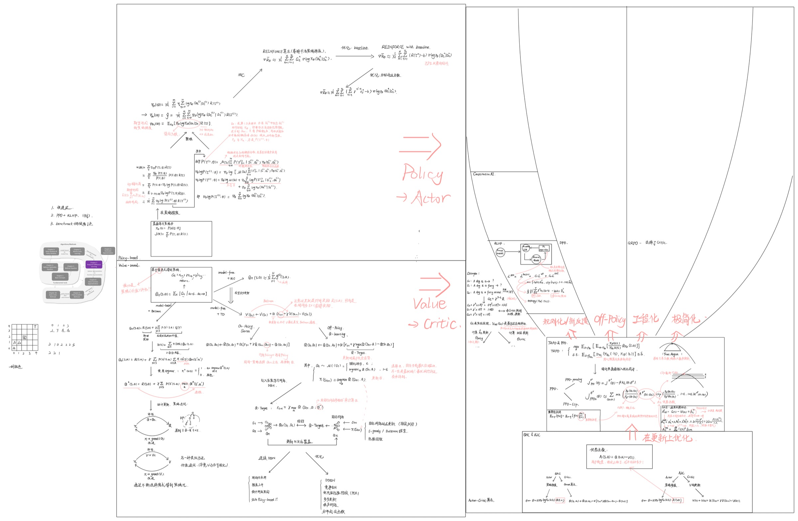

这组文章来自我阶段性整理强化学习相关笔记的结果。最开始的记录更像“边学边写”，主题会随着理解推进不断外扩：先从 RL 基础进入，再走到 DQN、策略梯度、Actor-Critic，最后自然连接到 LLM 对齐里的 RLHF、DPO 和 RLVR。

所以这次我没有按零散知识点保留原顺序，而是按一条更适合学习的主线把它们重新排成系列：

1. `强化学习入门：为什么需要 RL、术语与 MDP`
先建立为什么要用 RL、RL 在解决什么，以及 MRP / MDP / Bellman 这些最基础的心智模型。

2. `免模型强化学习：DP、MC、TD、SARSA 与 Q-learning`
当环境模型未知时，如何从“建模”转向“基于经验学习”，这是后面所有现代算法的真正起点。

3. `从表格到函数：DQN 与 Value-Based 深度强化学习`
把表格型 Q 函数推进到深度网络近似，并把 DDQN、PER 等常见改进放到一条线上看。

4. `策略梯度入门：从定理到 REINFORCE`
从 value-based 切到 policy-based，理解为什么“直接学策略”是必要的。

5. `Actor-Critic 主线：优势函数、GAE、TRPO 与 PPO`
这是现代强化学习最常见的一条工程主线，也是后面 RLHF 会不断回来的基础。

6. `LLM 对齐训练：RLHF、奖励模型与规则化分支`
把强化学习真正接到大模型对齐问题上，开始进入 reward model、PPO、Constitutional AI 这些核心概念。

7. `Off-Policy 偏好优化：DPO 与新分支`
在 RLHF 主线之外，补上 DPO 这条更轻量、也更常见的偏好优化路线。

8. `可验证强化学习：RLVR 与 Tülu 3`
当奖励可以被规则直接验证时，强化学习又会呈现出怎样的新训练形态。

9. `RLHF 奠基论文：Helpful & Harmless Assistant 速记`
作为补充阅读，把早期奠基工作单独抽出来，方便后面回看。

这组文章正文尽量保留了原始笔记，只做了三类整理：

- 调整顺序与命名，让它更像一条学习路径
- 补 frontmatter、导读和站内图片资源
- 对少量明显的占位标题或断裂处做轻度修正

如果你是第一次系统啃强化学习，我建议就按这里的顺序往下读。前半段先把基础与算法骨架搭起来，后半段再回到 LLM 对齐和偏好优化，整体会顺很多。
