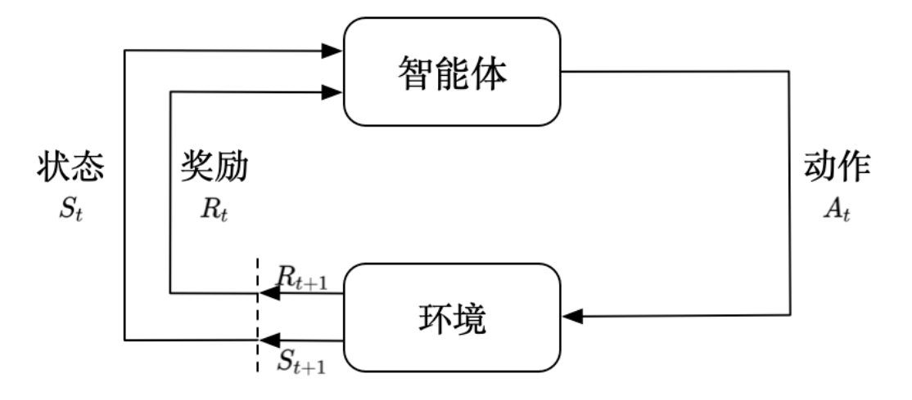
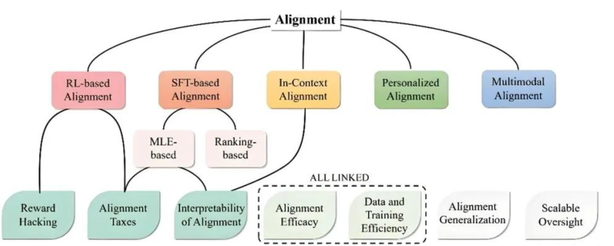
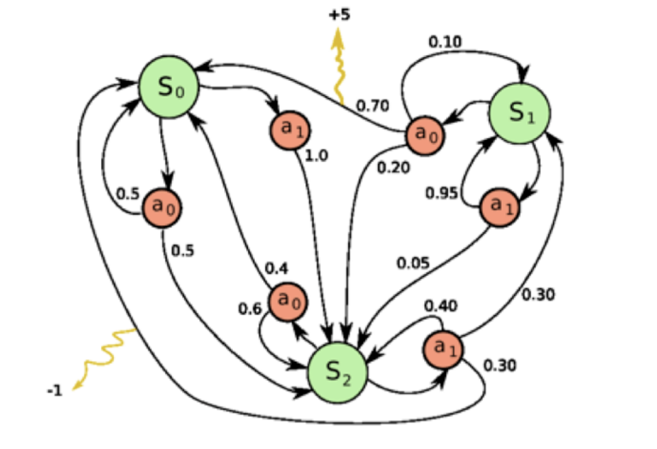
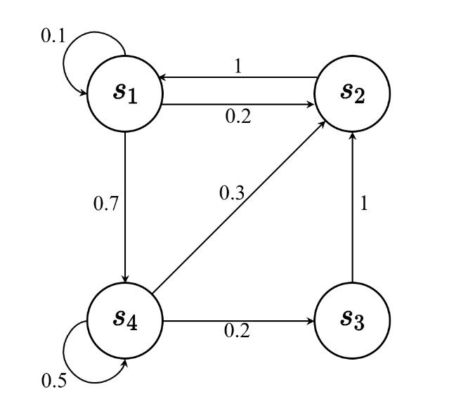
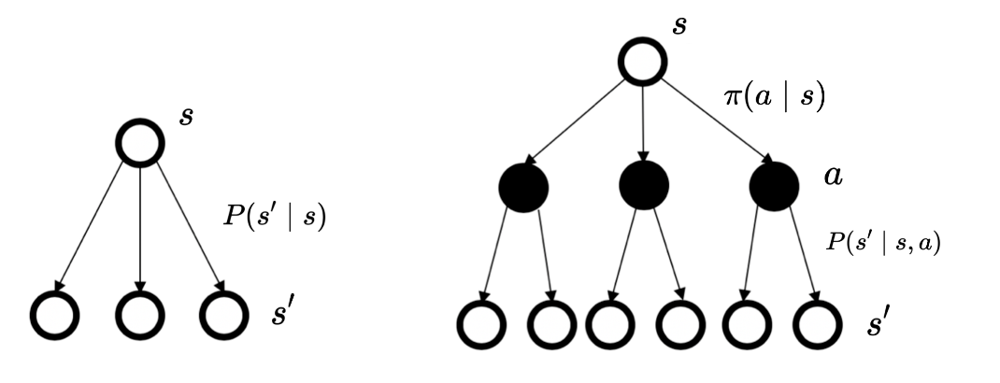
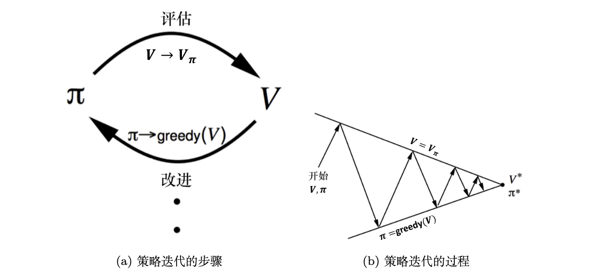
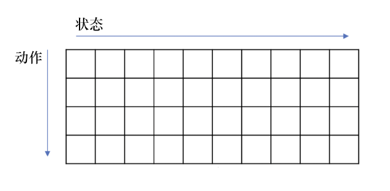

> 在笔记一中, 我们将沿着RL建模路线, 一步一步得到现在通用的Agent+RL的算法基础.

Agent经过了很长时间的探索和发展, 做出过很多方面的探索. 想要一次对Agent进行完整的探索显然是不可能做到的, 因此本文主要参照其中一条线路 --**大语言模型（LLM）与强化学习（RL）结合领域**, 梳理其发展, 学习其中的关键论文和思想.

实质上, LLM结合RL的方向, 是为了让模型从"死记硬背"的文本生成器, 转变会思考, 能行动, 能与环境交互的自主Agent. 而这其中一个重要的概念就是对齐.

# 一. 鸿沟 -- 为什么需要RL ?

**强化学习 ( reinforcement learning, RL)** 作为机器学习的重要分支, 讨论的是智能体 (agent) 怎么在复杂、不确定的环境中 (environment) 里去最大化它所能获得的奖励. 

强化学习是除监督学习和非监督学习之外的第三种基本的机器学习方法, 它不需要带标签的输入输出, 也不需要对非最优解精准的纠正, 而是通过智能体和环境不断交互, 尽可能从环境中获取奖励. 其示意图如下: 

## 1. 意图理解鸿沟

**监督微调（SFT）**, 可以说是整个LLM训练的起点. 当时的训练, 包括GPT和BERT, 不管是few-shot, zero-shot还是什么, 都是通过在高质量的问答数据上进行微调, 让模型学会" 如何回答指令". 这一点同样延伸到了后面对于Agent的训练, 似乎已经成为人机交互惯式.

然而, 纯SFT有一个根本性的局限: 它无法解决**对齐 ( Alignment )** 鸿沟. 在这里, 要简单介绍一下对齐的这个概念. 这里说的对齐, 实际上就是**让大模型语言的行为, 输出和决策方式与其设计者 ( 人类操作者 ) 的意图, 价值观和指令保持一致的过程**. 

简而言之, 就是让大模型更像人, 向人"对齐", 做到听懂人话, 价值观正向, 诚实可信, 实用主义等等.

	我忽然想到了之前看到过的一个新闻, 年轻的程序员因为研究问题每天花大量时间跟AI(ChatGPT)对话, 随着对话深入他渐渐认为自己是有某种"重大使命", 甚至认为一切都是虚构的, 而AI面对某些疯狂的幻想, 总是会给予鼓励的态度.孤立, 压力, 药物使用和缺乏睡眠, 本来就可能引发精神妄想，而AI对话往往会进一步加剧这一过程, 最终把自己送进了精神病院. 而在北美, 这种现象也不是个例, 感兴趣自行搜寻.

为什么SFT就很难实现这个愿景 ? 其中一个重要原因就是, SFT的本质是"模仿学习". 
1. 同一个开放式问题, 有多个正确但风格不同的回答, 但是SFT并没有判断哪一个更好的能力. 
2. SFT模型无法进行复杂的价值衡量, 结果充满不确定性, 且容易受到context干扰 ( LLM刚兴起的时间, 网络上有大量用户利用上下文的干扰, 让AI输出NSFW甚至违背人类价值观的内容, 黑话称"破限")
3. 对人类潜在或深层意图的理解不够 ( 比如提问"希特勒有哪些煽动性的演讲技巧 ?" SFT表面可能理解为简单的论文演讲技巧学习, 去收集资料详细罗列其手法, 而不加入批判和风险提示. 所以部分有邪恶目的的人, 利用AI的理解鸿沟也可以获取自己想要的信息 )

## 2. 能力鸿沟

如前文所论述, SFT本质上是模仿学习, 高度依赖于人类给定的数据集. 但是这些数据集也是来源于人类的, 所以说, SFT的最高上限就是人类的能力了. 但是, 如果使用强化学习, 让
智能体自己在环境中探索, **有非常大大潜力, 它可以获得超越人类的表现**. 

> 比如早年名声大噪的AlphaGo击败顶级人类棋手.

## 3. 场景鸿沟

除了同一场景学习效果上的差别, 光是SFT, 还存在一些无法满足的场景, 或者说硬伤. 我们在监督学习中, 有两个最基本的假设: 
1. 输入的数据(标注的数据) 都应该是没有关联的, 或着说样本之间应该是**独立同分布**的. 否则, 学习器将不好学习.
2. 我们必须告诉学习器正确的标签.

但是一些情况下, 这两个条件都是不可满足. 设想这样一个场景, 我们要学习Pong游戏的玩法, 但是游戏的画面帧与帧之间是相关的时间序列数据, 并且, 决策没有获得反馈, 游戏没法知道哪个动作是“正确动作”. 但是, 我们依然希望智能体能够学习, 这就需要用到强化学习. 

## 4. 强化学习的特征与历史

我们可以总结一些强化学习的特征如下:
1. 强化学习会进行试错探索, 它通过探索环境来获取对环境的一些理解.
2. 强化学习智能体从环境中获得延迟的奖励
3. 强化学习过程中, 时间非常重要, 因为得到的是时间关联的数据.
4. 强化学习中, 智能体当前的动作会影响它随后的数据, 智能体需要保持稳定.

强化学习并非凭空出世的奇想, 它是有一定的历史. 早期的强化学习, 一般被称为标准强化学习. 而最近业界把强化学习与深度学习结合起来, 就形成了**深度强化学习**, 深度强化学习= 深度学习 + 强化学习.

# 二. 概念 -- 强化学习中基本术语

> 强化学习中有太多的概念了, 在不熟悉的情况下分散了解, 将非常打消阅读的热情. 在第二章中将常见的术语一并介绍, 方便回头查询, 也方便快速进入强化学习的理论情景中.

- **探索 (exploration)** 指的是尝试一些新的动作, 这些动作的奖励不确定.
- **利用 (exploitation)** 指的是采取已知的可以获取更多奖励的动作
- **预演 (rollout)** 指的是从当前帧度动作进行采样, 生成很多局游戏. 当然, 这个词在中文社区的翻译更多为“回合”或者“轨迹采样”.
- **轨迹 (trajectory, $\tau$ )** : 当前智能体与环境交互, 会得到一系列**观测 (observation)**, 每一个观测可以看成一个轨迹. 轨迹就是从当前帧以及它采取的**策略**, 即状态和动作的序列:

  $$
  \tau = (s_0,a_0,s_1,a_1...) \tag{2.1}
  $$
- 最终奖励 (eventual reward) 
- 一场游戏被称为一个**回合 (episode)** 或者 试验 (trial)
- **序列决策 (sequential decision making)** : 智能体把动作输出给环境, 环境取得这个动作之后会进行下一步, 把下一步的观测与这个动作带来的奖励返还给智能体. 智能体的目的是选取一系列动作来最大化奖励.
- **学习(learning)** 和 **规划(planning)** 是序列决策中的两个基本问题. 在学习中, 环境初始时是位置的, 它通过不断与环境交互, 逐步改进策略; 在规划中, 环境是已知的, 智能体能够计算出一个玩咩的模型, 并且在不需要与环境进行任何交互的时候进行计算, 寻找最优解.
- **探索(exploration)** 和 **利用(exploration)** 是强化学习中的两个核心问题. 因为尝试次数有限, 这两者实际上是矛盾的, 加强一方就会削弱另一方, 这就是强化学习中的**探索-利用窘境 (exploration-exploitation dilemma)**.
- **奖励信号 (reward signal)** : 奖励是环境给的一种标量化的反馈信号. 智能体在环境里存在的目的就是最大化它的期望的**累积奖励 (expected cummulative reward)**.
- **历史**是观测、动作、奖励的序列 (下标t一般表示当前步):

  $$
  H_t=o_1,a_1,r_1,...,o_t,a_t,r_t \tag{2.2}
  $$

- **状态**是对世界的完整描述, 不会隐藏世界的信息. **观测**是对状态的部分描述, 可能会遗漏一些信息. 整个游戏的状态可以看作关于历史的函数:

  $$
  s_t=f(H_t) \tag{2.3}
  $$

- **完全可观测 (fully observed)**: 环境有自己的函数$s^c_t=f^c(H_t)$ 来更新状态, 智能体内部有$s^a_t=f^a(H_t)$ 来更新状态. 当智能体状态与环境状态等价的时候, 即当智能体能够观察到环境的所有状态时, 我们称这个环境是完全可观测的.

  $$
  o_t=s^c_t=s^a_t \tag{2.4}
  $$
- 当完全可观测时, 强化学习通常被建模为**马尔可夫决策过程(MDP)**; 部分可观测下则会被建模为**部分可观测马尔可夫决策过程(POMDP)**.
- **动作空间 (action space)** 指的是给定环境中有效动作的集合. 如果智能体的动作数量有限就叫做**离散动作空间 (discrete action space)** , 如果智能体的动作是实值的向量, 则是**连续动作空间 (continuous action space)**
- **策略 (policy)**: 智能体会用策略来选取下一步的动作. 策略可以分为随机性策略 (stochastic policy)和确定性策略 (deterministic policy).
- **价值函数 (value function)**: 价值函数用于评估智能体进入某个状态后, 可以对后面的奖励带来多大的影响. 价值函数值越大, 说明智能体进入这个状态越有利. 加入折扣因子 (discount factor), 价值函数可以被定义为:

  $$
  V_\pi(s)\doteq\mathbb{E}_\pi\left[G_t\mid s_t=s\right]=\mathbb{E}_\pi\left[\sum_{k=0}^\infty\gamma^kr_{t+k+1}\mid s_t=s\right],\quad \forall s\in S \tag{2.5}
  $$
- 式2.5中, $\mathbb{E}_\pi$ 的下标为$\pi$ 函数, 它的值可以反映我们在使用策略$\pi$ 的时候, 到底可以获得多少奖励.
- **Q函数**: 也是一种价值函数, 其中包含两个变量: 状态和动作. 其定义为:
$$
Q_\pi(s,a) \doteq \mathbb{E}_\pi\left[G_t \mid s_t=s, a_t=a\right] = \mathbb{E}_\pi\left[\sum_{k=0}^\infty \gamma^k r_{t+k+1} \mid s_t=s, a_t=a\right]\tag{2.6}
$$
- **模型 (model)**: 模型表示智能体对环境状态进行理解, 它决定了环境中世界的运行方式. 模型决定了下一步的状态, 下一步的状态取决于当前的状态以及当前采取的动作. 它由状态转移概率和奖励函数两个部分组成. **状态转移概率**即:

  $$
  p_{ss^{\prime}}^a=p\left(s_{t+1}=s^{\prime}\mid s_t=s,a_t=a\right)\tag{2.7}
  $$

  即某s中采取某a并非一定可以得到特定的下一个s, 而是概率的.
  **奖励函数**是指我们在当前状态采取了某个动作, 可以获得多大奖励:

  $$
  R(s,a)=\mathbb{E}\left[r_{t+1}\mid s_t=s,a_t=a\right] \tag{2.8}
  $$
- **马尔可夫决策过程(Markov decision process)** 由策略、价值函数和模型三个部分组成. 如下图, 这个决策过程可视化了状态的转移和采取的动作: 

- 智能体可以分为**基于价值的智能体 (value-based agent)** 和**基于策略的智能体 (policy-based agent)**. 前者显式学习价值函数, 隐式学习策略; 后者直接学习策略, 我们给出一个状态, 它就会输出对应动作的概率.
- 基于价值和基于策略的智能体结合可以得到**演员-批评家智能体 (actor-critic agent)**, 这一类智能体吧策略和价值函数都学习了, 通过两者的交互得到最佳的动作.
- 智能体还可以分为**有模型(model-based)** 和 **免模型(model-free)**, 前者通过学习状态的转移来采取动作(如DP, 蒙特卡洛), 后者没有直接估计状态的转移, 也没有得到环境的具体转移变量, 它通过学习价值函数和策略函数进行决策(如Q-learning, DQN和Policy Gradient).
- 有模型强化学习比免模型强化学习多出一个步骤, 就是对真实世界建模. 免模型强化学习通常属于数据驱动方法, 需要大量的采样来估计状态、动作及奖励函数, 从而优化动作策略.
- **范围 (Horizon)**: 一个回合的长度(每个回合最大的时间步数), 它是由有限个步骤决定的.
- **回报 (return)**: 可以定义为奖励的逐步累加, 假设时刻$t$ 后的奖励序列为$r_{t+1}, r_{t+2}, r_{t+3}, \cdots$ , 折扣因子为$\gamma$ , 越往后得到的奖励折扣越多. 则回报为:

  $$
  G_t = r_{t+1} + \gamma r_{t+2} + \gamma^2 r_{t+3} + \gamma^3 r_{t+4} + \ldots + \gamma^{T-t-1} r_T \tag{2.9}
  $$
- **折扣因子(discount factor)**: 我们使用折扣因子, 一方面过程转移可能是带环的, 我们要避免无限循环; 另一方面, 我们并不能建立完美的模拟环境的模型, 我们对未来的评估不一定是准确的; 还有就是, 如果奖励是有实际价值的, 我们更希望立刻就获得奖励, 而不后面再得到奖励.

# 三. 马尔可夫决策过程

> 对基本术语进行一定程度的梳理之后, 我们就可以进入强化学习的语境当中. 但是在学习具体的算法之前, 我们还是要进行一定程度的理论扩容, 特别需要理解算法产生的背景. 紧接着我们就会介绍马尔可夫决策过程控制的两种算法, 策略迭代和价值迭代.

## 1. 马尔可夫性质 (Markov property)

**马尔可夫性质 (Markov property)** 是指一个随机过程在给定现在状态及所有过去状态情况下, 其未来状态的概率分布仅依赖于当前状态. 以离散随机过程为例, 假设随机变量$X_{0},X_{1},\cdots,X_{T}$ 构成一个随机过程, 这些随机变量的所有可能取值的集合被称为状态空间 (state space), 如果过去状态的条件概率分布为仅是$X_t$ 的一个函数, 则:

$$
p\left(X_{t+1}=x_{t+1}\mid X_{0:t}=x_{0:t}\right)=p\left(X_{t+1}=x_{t+1}\mid X_{t}=x_{t}\right) \tag{3.1}
$$
其中, $X_{0:t}$ 表示变量集合$X_{0},X_{1},\cdots,X_{T}$ , $x_{0:t}$ 表示状态空间中的状态序列$x_0,x_1,\cdots,x_t$ .

马尔可夫性质也可以描述为, 将来的状态和过去的状态是条件独立的.

## 2. 马尔可夫链(Markov chain)

马尔可夫过程是一组具有马尔可夫性质的随机变量序列$s_0,s_1,\cdots,s_t$ 其中下一个时刻的状态$s_{t+1}$ 只取决于当前状态$s_{t}$ .

我们设状态的历史为$h_t=\{s_1,s_2,s_3,\cdots,s_t\}$  ($h_t$ 包含了之前的所有状态), 则马尔可夫过程满足条件:

$$
p(s_{t+1} | s_t) = p(s_{t+1} | h_t) \tag{3.2}
$$
也就是说, 从当前$s_t$ 转移到$s_{t+1}$  ,它是直接就等于它之前所有的状态转移到$s_{t+1}$ . 离散时间的马尔可夫过程也被称为**马尔可夫链(Markov chain)**.

我们可以用状态转移矩阵(state transition matrix) $P$ 来描述状态转移 $p(s_{t+1}= s'|s_t=s)$:
$$
\boldsymbol{P}=\left(\begin{array}{cccc}p\left(s_{1}\mid s_{1}\right)&p\left(s_{2}\mid s_{1}\right)&\ldots&p\left(s_{N}\mid s_{1}\right)\\p\left(s_{1}\mid s_{2}\right)&p\left(s_{2}\mid s_{2}\right)&\ldots&p\left(s_{N}\mid s_{2}\right)\\\vdots&\vdots&\ddots&\vdots\\p\left(s_{1}\mid s_{N}\right)&p\left(s_{2}\mid s_{N}\right)&\ldots&p\left(s_{N}\mid s_{N}\right)\end{array}\right) \tag{3.3}
$$

## 3. 马尔可夫奖励过程 (Markov reward process, MRP)

**马尔可夫奖励过程 (Markov reward process, MRP)** 是马尔可夫链加上奖励函数. 在马尔可夫奖励过程中, 状态转移矩阵和状态都与马尔可夫链一样, 只是多了奖励函数. 

前面已经介绍过回报$G_t$ , 我们可以定义状态的价值, 就是**状态价值函数 (state-value function)** :

$$
\begin{aligned} V^{t}(s) &= \mathbb{E}\left[G_{t} \mid s_{t} = s\right] \\ &= \mathbb{E}\left[r_{t+1} + \gamma r_{t+2} + \gamma^{2} r_{t+3} + \ldots + \gamma^{T-t-1} r_{T} \mid s_{t} = s\right] \end{aligned} \tag{3.4}
$$
这个期望就是从这个状态开始, 我们可能获得多大的价值. 也可以说是, 未来可能获得的价值在当前价值的表现, 就是当我们进入某一个状态后, 我们现在能有多大的价值.

## 4. 贝尔曼方程

> 前面已经得出来了状态价值函数, 这里就引出了一个问题: 当我们有了一些轨迹的实际回报时, 怎么计算它的价值函数. 一个可行的方法就是从当前状态生成许多轨迹, 然后把轨迹都叠加起来 (比如取平均值, 这就是一种计算价值函数的方法, 被称为**蒙特卡洛(MonteCarlo, MC)** 采样). 但是我们这里学习另一种更多的方法, 就是从价值函数里推导出贝尔曼方程.

**贝尔曼方程 (Bellman equation)** 就是当前状态与未来状态的迭代关系, 表示当前状态的价值函数可以通过下个状态的价值函数来计算. 

我们现在来推导这个公式, 首先我们需要得出推导所需要的一个前置公式4.3. 

为了简洁, 我们把当前步的t下标去掉, 而把t+1步下标改成t‘, 按照期望的定义, 我们重写回报的期望:

$$
\begin{aligned} \mathbb{E}\left[G_{t+1} \mid s_{t+1}\right] &= \mathbb{E}\left[g^{\prime} \mid s^{\prime}\right] \\ &= \sum_{g^{\prime}} g^{\prime} \, p\left(g^{\prime} \mid s^{\prime}\right) \end{aligned} \tag{4.1}
$$

我们再次对式4.1求期望:
$$
\begin{aligned}\mathbb{E}\left[\mathbb{E}\left[G_{t+1}\mid s_{t+1}\right]\mid s_{t}\right]&=\mathbb{E}\left[\mathbb{E}\left[g^{\prime}\mid s^{\prime}\mid s\right]\mid s\right]\\&=\mathbb{E}\left[\sum_{g^{\prime}}g^{\prime}\left.p\left(g^{\prime}\mid s^{\prime}\right)\mid s\right]\right]\\&=\sum_{{s^{\prime}}}\sum_{{g^{\prime}}}g^{\prime}p\left(g^{\prime}\mid s^{\prime},s\right)p\left(s^{\prime}\mid s\right)\\&=\sum_{{s^{\prime}}}\sum_{{g^{\prime}}}\frac{g^{\prime}p\left(g^{\prime}\mid s^{\prime},s\right)p\left(s^{\prime}\mid s\right)p(s)}{p(s)}\\&=\sum_{{s^{\prime}}}\sum_{{g^{\prime}}}\frac{g^{\prime}p\left(g^{\prime}\mid s^{\prime},s\right)p\left(s^{\prime},s\right)}{p(s)}\\&=\sum_{{s^{\prime}}}\sum_{{g^{\prime}}}\frac{g^{\prime}p\left(g^{\prime},s^{\prime},s\right)}{p(s)}\\&=\sum_{{s^{\prime}}}\sum_{{g^{\prime}}}g^{\prime}p\left(g^{\prime},s^{\prime}\mid s\right)\\&=\sum_{{g^{\prime}}}\sum_{{g^{\prime}}}g^{\prime}p\left(g^{\prime},s^{\prime}\mid s\right)\\&=\sum_{{g^{\prime}}}g^{\prime}p\left(g^{\prime}\mid s\right)\\&=\mathbb{E}\left[g^{\prime}\mid s\right]=\mathbb{E}\left[G_{t+1}|s_t\right] \end{aligned} \tag{4.2}
$$
$$
E[G_{t+1}|s_t] = E[ E[G_{t+1}|s_t, s_{t+1}] | s_t] = E[ E[G_{t+1}|s_{t+1}] | s_t]
$$

而实际上, 结合状态价值函数的定义3.4, 我们可以得到4.2的期望就是对价值函数的期望, 然后结合4.2 就得到了: 
$$
\mathbb{E}[V(s_{t+1})|s_t]=\mathbb{E}[\mathbb{E}[G_{t+1}|s_{t+1}]|s_t]=\mathbb{E}\left[G_{t+1} \mid s_{t}\right] \tag{4.3}
$$
这个4.3就是推导贝尔曼公式重要的前提. 现在我们就开始推导贝尔曼公式:
$$
\begin{aligned}V(s)&=\mathbb{E}\left[G_t\mid s_t=s\right]\\&=\mathbb{E}\left[r_{t+1}+\gamma r_{t+2}+\gamma^2r_{t+3}+\ldots\mid s_t=s\right]\\&=\mathbb{E}\left[r_{t+1}|s_t=s\right]+\gamma\mathbb{E}\left[r_{t+2}+\gamma r_{t+3}+\gamma^2r_{t+4}+\ldots\mid s_t=s\right]\\&=R(s)+\gamma\mathbb{E}[G_{t+1}|s_t=s]\\&=R(s)+\gamma\mathbb{E}[V(s_{t+1})|s_t=s]\\&=R(s)+\gamma\sum_{s^{\prime}\in S}p\left(s^{\prime}\mid s\right)V\left(s^{\prime}\right)\end{aligned} \tag{4.4}
$$
4.4就是我们需要的状态价值函数的迭代形式, 贝尔曼公式. 它说明了当前状态的价值, 是由当前的回报和未来状态的价值的总和.

如果要得到所有的状态价值, 我们可以把贝尔曼方程写成矩阵的形式:
$$
\left.\left(\begin{array}{c}V\left(s_{1}\right)\\V\left(s_{2}\right)\\\vdots\\V\left(s_{N}\right)\end{array}\right.\right)=\left(\begin{array}{c}R\left(s_{1}\right)\\R\left(s_{2}\right)\\\vdots\\R\left(s_{N}\right)\end{array}\right)+\gamma\left(\begin{array}{cccc}p\left(s_{1}\mid s_{1}\right)&p\left(s_{2}\mid s_{1}\right)&\ldots&p\left(s_{N}\mid s_{1}\right)\\p\left(s_{1}\mid s_{2}\right)&p\left(s_{2}\mid s_{2}\right)&\ldots&p\left(s_{N}\mid s_{2}\right)\\\vdots&\vdots&\ddots&\vdots\\p\left(s_{1}\mid s_{N}\right)&p\left(s_{2}\mid s_{N}\right)&\ldots&p\left(s_{N}\mid s_{N}\right)\end{array}\right)\left(\begin{array}{c}V\left(s_{1}\right)\\V\left(s_{2}\right)\\\vdots\\V\left(s_{N}\right)\end{array}\right) \tag{4.5}
$$
而写成矩阵形式后, 实际上我们可以用求矩阵逆的方法来求解析解: 
$$
\begin{aligned} \boldsymbol{V}&=\boldsymbol{R}+\gamma\boldsymbol{P}\boldsymbol{V}\\
\boldsymbol{I}\boldsymbol{V}&=\boldsymbol{R}+\gamma\boldsymbol{P}\boldsymbol{V}\\
(\boldsymbol{I}-\gamma\boldsymbol{P})\boldsymbol{V}&=\boldsymbol{R}\\
\boldsymbol{V}&=(\boldsymbol{I}-\gamma\boldsymbol{P})^{-1}\boldsymbol{R}\end{aligned} \tag{4.6}
$$
但是矩阵求逆的过程的复杂度都是$O(N^3)$ , 计算量非常大, 所以这只适用于很小量的马尔可夫奖励过程. 

## 5. 求解价值的方法

对于强化学习而言, 最终的目标是求出最优策略, 所有**策略评估** 是非常重要的.

已知马尔可夫决策过程以及要采取的策略$\pi$ , **计算价值函数$V_\pi(s)$** 的过程就是**策略评估**, 策略评估在有些地方也被称为 **(价值)预测\[(value) prediction\]**. 

由于这个评估需要贯穿强化学习的始终, 在这里展开介绍所有方法是不合适的, 因此读者可以多留意之后一些算法当中, 都会有的策略评估的过程和方法.

## 6. **马尔可夫决策过程 (Markov decision process, MDP)**

相对于马尔可夫奖励过程, 马尔可夫决策过程多了决策 (决策是指动作), 其他的定义与马尔可夫奖励过程是类似. 此外状态转移概率也多了一个条件, 变成了$p(s_{t+1}=s'|s_t=s,a_t=a)$. 它的意思是, 未来的状态不仅依赖于现在的状态, 也依赖于在当前状态智能体采取的动作. 马尔可夫决策过程满足:
$$
p(s_{t+1} | s_t, a_t) = p(s_{t+1} | h_t, a_t) \tag{6.1}
$$
对于奖励函数, 也多了一个当前的动作, 变成了

$$
R(s_{t}=s,a_{t}=a)=\mathbb{E}[r_{t}\mid s_{t}=s,a_{t}=a] \tag{6.2}
$$
由于开始涉及到智能体的动作了, 所以就要有一定的策略. 前面我们已经知道, 策略定义了在某一个状态应该采用什么动作, 所以知道当前状态之后, 我们带入策略函数就能得到一个策略:
$$
\pi(a \mid s) = p(a_t = a \mid s_t = s) \tag{6.3}
$$
这里的概率, 就代表了在所有可能的动作里面怎样采取行动. (比如0.5概率往左, 0.5概率往右). 

已知马尔可夫决策过程 (别忘了, 马尔可夫决策过程实际上就是策略+价值函数+模型)和策略函数$\pi$ , 我们就可以将马尔可夫决策过程转化成马尔可夫奖励过程. 因为我们已知策略函数, 也就是已知每种状态下, 可能采取的动作的概率, 所以我们就可以直接把动作进行加和, 去掉动作$a$, 用策略(概率)来代替 :
$$
P_\pi\left(s^{\prime}\mid s\right)=\sum_{a\in A}\pi(a\mid s)p\left(s^{\prime}\mid s,a\right) \tag{6.4}
$$
对于奖励函数, 同样把动作去掉, 得到类似马尔可夫奖励过程的奖励函数:
$$
r_\pi(s)=\sum_{a\in A}\pi(a\mid s)R(s,a) \tag{6.5}
$$
马尔可夫决策过程的价值函数定义的与式3.4一样. 但是由于我们这里多出了动作a, 不好处理. 所以我们这里引入了一个**Q函数 (Q-function)**, Q函数也被称为**动作价值函数 (actino-value)**. Q函数的定义是在某一个状态采取某一个动作, 它有可能得到的回报的一个期望, 即:
$$
Q_\pi(s,a)=\mathbb{E}_\pi\left[G_t\mid s_t=s,a_t=a\right] \tag{6.6}
$$
这里的期望也是基于策略函数的, 所以我们要对策略函数进行一个加和, 然后得到它的价值. 对于Q函数中的动作进行加和, 就可以得到价值函数:
$$
V_\pi(s)=\sum_{a\in A}\pi(a\mid s)Q_\pi(s,a) \tag{6.7}
$$
紧接着, 我们对**Q函数的贝尔曼方程**进行推导, 类似于上述4.4的推导:
$$
\begin{aligned}Q(s,a)&=\mathbb{E}\left[G_t\mid s_t=s,a_t=a\right]\\&=\mathbb{E}\left[r_{t+1}+\gamma r_{t+2}+\gamma^2r_{t+3}+\ldots\mid s_t=s,a_t=a\right]\\&=\mathbb{E}\left[r_{t+1}|s_t=s,a_t=a\right]+\gamma\mathbb{E}\left[r_{t+2}+\gamma r_{t+3}+\gamma^2r_{t+4}+\ldots\mid s_t=s,a_t=a\right]\\&=R(s,a)+\gamma\mathbb{E}[G_{t+1}|s_t=s,a_t=a]\\&=R(s,a)+\gamma\mathbb{E}[V(s_{t+1})|s_t=s,a_t=a]\\&=R(s,a)+\gamma\sum_{s^{\prime}\in S}p\left(s^{\prime}\mid s,a\right)V\left(s^{\prime}\right)\end{aligned} \tag{6.8}
$$
我们可以看到上述6.9和6.10代表了状态价值函数与Q函数之间的关联, 因为Q中有V, V中有Q.

观察形式, 状态价值函数和Q函数都可以拆分成两个部分: 即时奖励和后续状态的折扣价值. 通过对状态价值函数进行分解, 我们可以得到类似于之前马尔可夫奖励过程的贝尔曼方程 -- **贝尔曼期望方程 (Bellman expectation equation)**.
$$
V_\pi(s)=\mathbb{E}_\pi\left[r_{t+1}+\gamma V_\pi\left(s_{t+1}\right)\mid s_t=s\right] \tag{6.9}
$$
类似的, 对于Q函数分解, 得到贝尔曼期望方程:
$$
Q_{\pi}(s,a) = \mathbb{E}_{\pi}\left[r_{t+1} + \gamma Q_{\pi}(s_{t+1},a_{t+1}) \, \middle| \, s_t = s, a_t = a\right], a_{t+1} \sim π(·|s_{t+1})\tag{6.10}
$$
我们继续往下推导, 首先把6.8在策略$\pi$ 的时候代入6.7, 可以得到: 
$$
V_\pi(s)=\sum_{a\in A}\pi(a\mid s)\left(R(s,a)+\gamma\sum_{s^{\prime}\in S}p\left(s^{\prime}\mid s,a\right)V_\pi\left(s^{\prime}\right)\right) \tag{6.11}
$$

6.11表示了当前状态价值与未来状态价值的关联. 然后我们再反过来代入, 将6.7代入6.8中, 可以得到:
$$
Q_\pi(s,a)=R(s,a)+\gamma\sum_{s^{\prime}\in S}p\left(s^{\prime}\mid s,a\right)\sum_{a^{\prime}\in A}\pi\left(a^{\prime}\mid s^{\prime}\right)Q_\pi\left(s^{\prime},a^{\prime}\right) \tag{6.12}
$$
这个式子代表了当前时刻的Q函数与未来时刻的Q函数之间的关联. 式6.11和6.12是贝尔曼期望方程的另一种形式.

## 7. 从建模走向控制问题

前面更多是在回答“给定环境和策略，价值到底怎么定义、怎么计算”；但强化学习真正关心的问题是：**怎样找到更优的策略**。因此，接下来视角会从建模与评估，转到控制与最优决策。

## 8. 马尔可夫决策过程控制

但是如果只有马尔可夫决策过程, 那么如何来寻找最佳的策略? 

我们引入了**最佳价值函数(optimal value function)**, 它是指我们搜寻一种策略$\pi$ 让每个状态的价值最大:
$$
V^*(s)=\max_\pi V_\pi(s) \tag{8.1}
$$
在这种最大化情况下, 得到的策略就是最佳策略: 
$$
\pi^*(s)=\arg\max_\pi V_\pi(s) \tag{8.2}
$$
换句话说, 最佳策略让每个状态的价值函数都取到最大值. 所以如果我们可以得到一个最佳价值函数, 就可以认为某个马尔可夫决策过程的环境可解.

而在可解的情况下, 最佳价值函数是一致的, 环境中可达到的上限的值是一致的, 但这里可能有多个最佳策略. 

当取得最佳价值函数后, 我们可以通过Q函数进行最大化来得到最佳策略:
$$
\pi^*(a\mid s)=\left\{\begin{array}{ll}1,&a=\underset{a\in A}{\operatorname*{\arg\max}}Q^*(s,a)\\0,&\text{其他}\end{array}\right. \tag{8.3}
$$
当Q函数收敛之后, 因为Q函数是关于状态与动作的函数, 所以如果在某个状态采取某个动作, 可以使Q函数最大化, 那么这个动作就是最佳的动作. 如果我们能优化出一个Q函数$Q^*(s,a)$, 就可以直接在Q函数中取一个让Q函数值最大化的动作的值, 就可以提取出最佳策略.

吗? 那怎么提取呢. 其实最容易想到的方法, 就是穷举所有方法, 如果动作和状态有限, 就可以对每个状态采取A中动作的策略, 总共$|A|^{|S|}$ 个可能策略. 然算出每种策略下的价值函数问题就解决. 但是显然没有效率, 所以目前有两种常用的方法来搜索最佳策略.

### (1) 策略迭代与贝尔曼最优方程

> 策略迭代不仅仅是求解上述model-based  (即已知状态转移函数和奖励函数, 或者说已知价值函数) 的一种方法, 也是后面MDP继续优化的基础, 要好好学习其思想. 

**策略迭代 (Policy Iteration)** 由两个步骤组成 -- 策略评估和和策略改进 (policy improvement). 在我们优化策略$\pi$ 时, 在优化过程中得到一个最新的策略. 我们先保持这个策略不变, 然后估计它的价值, 即给定当前的策略函数来估计状态价值函数的值. 然后, 得到状态价值函数后, 可以进一步计算它的Q函数. 得到Q函数后, 我们直接对Q函数进行最大化, 通过在Q函数做一个贪心的搜索来进一步改进策略, 这两个策略迭代进行.

接下来, 我们来具体看一下是怎么进行greedy进行策略改进的. 首先, 我们再复习一下, 已知第i个策略对应的状态价值函数, 我们可以根据6.8式得到Q, 如下:
$$
Q_{\pi_i}(s,a)=R(s,a)+\gamma\sum_{s^{\prime}\in S}p\left(s^{\prime}\mid s,a\right)V_{\pi_i}\left(s^{\prime}\right) \tag{8.4}
$$
对于每个状态, 策略改进会得到它的新一轮的策略, 对于每个状态, 我们取得它得到最大值的动作, 即:
$$
\pi_{i+1}(s)=\underset{a}{\operatorname*{\arg\max}}Q_{\pi_i}(s,a) \tag{8.5}
$$
这是一个确定性策略, 新的策略在每个状态s都**确定性地**选择能使 $Q_{π_i}(s, a)$ 最大的动作 a.

我们其实可以把Q函数看成一个**Q表格 (Q-table)**, 横轴是它的状态, 纵轴是它可能的动作. 如果我们得到了Q函数, Q表格也就得到了. 所以上述argmax操作就是在选择每一列 (状态) 中最大的行 (动作).

当我们一直采取argmax操作的时候, 就会得到一个单调的递增. 我们通过采取这种贪心操作, 就会得到更好或者保持不变的策略, 而不是使价值函数变差. 所以当停止改进之后, 我们取让Q函数最大的动作, Q函数就会直接变成价值函数: 
$$
Q_\pi\left(s,\pi^{\prime}(s)\right)=\max_{a\in A}Q_\pi(s,a)=Q_\pi(s,\pi(s))=V_\pi(s) \tag{8.6}
$$
上述等式的意思是, 采用贪心a直到$\pi'$ 不会再比$\pi$ 的Q值大了, 这时这个Q就是V. 

我们对等式最后一步做一点解释, 一般情况下, 马尔可夫决策过程中Q与V是满足6.7的关系, 即V是Q在$\pi$ 下的加权求和. 但是在最优策略下, 如8.3所示, 它是一个确定性策略, 最优动作的贡献为1, 其他动作贡献全部为0:

$$
V_{\pi^*}(s) = \sum_{a} \pi^*(a|s)Q_{\pi^*}(s,a) = 1 \cdot Q_{\pi^*}(s,a^*) + 0 \cdot 其他 = Q_{\pi^*}(s,a^*) \tag{8.7}
$$

而其中的$a^*$ 正是让Q最大的函数, 即$Q_{\pi^*}(s, a^*) = \max_{a} Q_{\pi^*}(s, a)$, 所以得到了8.6的最后一个等号. 

上述其实就是**贝尔曼最优方程 (Bellman optimality equation)**, 贝尔曼最优方程表明最佳策略下的一个状态的价值必须等于在这个状态下采取最好动作得到的回报的期望. 换句话说, **最优状态价值就是最优动作价值的"最大价值"**: 
$$
V^*(s)=\max_aQ^*(s,a) \tag{8.8}
$$
然后结合Q值的贝尔曼方程6.8, 代入8.8可以得到:
$$
\begin{aligned}Q^{*}(s,a)&=R(s,a)+\gamma\sum_{s^{\prime}\in S}p\left(s^{\prime}\mid s,a\right)V^{*}\left(s^{\prime}\right)\\&=R(s,a)+\gamma\sum_{s^{\prime}\in S}p\left(s^{\prime}\mid s,a\right)\max_{a}Q^{*}(s^{\prime},a^{\prime})\end{aligned} \tag{8.9}
$$
于是我们的得到了Q的转移过程. 通过上述的讨论, 应该明白迭代式子得出的意义, 所以当然, Q学习就是基于这个8.9式进行的, 但是由于属于非常经典的算法, 所以我们放在后面单独介绍.

### (2) 价值迭代

现在我们换个角度思考问题, 动态规划的方法将优化问题分成两个部分. 第一步执行的是最优的动作, 后继的状态每一步都按照最优策略去做, 最后的结果就是最优的. 

这里我们可以引入**最优性原理定理 (principle of optimality theorem)**: 一个策略$\pi(a|s)$ 在状态s达到了最优价值, 也就是$V_{\pi}(s)=V^*(s)$ 成立, 当且仅当对于任何能从$s$ 到达的$s'$ , 都已经达到了最优价值, 也就是对于所有的$s'$ , $V_{\pi}(s')=V^*(s')$ 恒成立.

这就告诉我们, 如果知道了子问题$V^*(s')$ 的最优解, 就可以通过**价值迭代**来得到最优的$V_{\pi}(s)$ 的解. 
 
我们可以继续把8.9代入到8.8中:
$$
\begin{aligned}V^*(s)&=\max_aQ^*(s,a)\\&=\max_a\mathbb{E}[G_t|s_t=s,a_t=a]\\&=\max_a\mathbb{E}[r_{t+1}+\gamma G_{t+1}|s_t=s,a_t=a]\\&=\max_a\mathbb{E}[r_{t+1}+\gamma V^*(s_{t+1})|s_t=s,a_t=a]\\&=\max_a\mathbb{E}[r_{t+1}]+\max_a\mathbb{E}[\gamma V^*(s_{t+1})|s_t=s,a_t=a]\\&=\max_aR(s,a)+\max_a\gamma\sum_{s^{\prime}\in S}p\left(s^{\prime}\mid s,a\right)V^*\left(s^{\prime}\right)\\&=\max_a\left(R(s,a)+\gamma\sum_{s^{\prime}\in S}p\left(s^{\prime}\mid s,a\right)V^*\left(s^{\prime}\right)\right)\end{aligned} \tag{8.10}
$$
这样, 我们就也得到了状态价值函数的转移. 我们把贝尔曼最优方程当作一个更新规则来进行, 即:
$$
V(s)\leftarrow\max_{a\in A}\left(R(s,a)+\gamma\sum_{s^{\prime}\in S}p\left(s^{\prime}\mid s,a\right)V\left(s^{\prime}\right)\right) \tag{8.11}
$$
当整个马尔可夫决策过程以及达到最佳的状态时, 式8.11才满足. 但是我们可以转化为一个迭代的等式, 不断迭代贝尔曼最优方程, 价值函数就能逐渐趋向于最佳的价值函数, 这就是价值迭代算法的精髓. 价值迭代算法可以用下面过程总结:

- 初始化：令 k=1，对于所有状态 s，$V_{0}(s)$=0。
- 对于 k=1: H（H 是让 V(s) 收敛所需的迭代次数）
	- 对于所有状态 s
	 $Q_{k+1}(s,a)=R(s,a)+\gamma\sum_{s'\in S}p(s'|s,a)V_{k}(s')$
	 $V_{k+1}(s)=\max_{a}Q_{k+1}(s,a)$
    - k←k+1。
- 在迭代后提取最优策略：
  $\pi(s)=\arg\max_{a}\left[R(s,a)+\gamma\sum_{s'\in S}p(s'|s,a)V_{H+1}(s')\right]$

# 四. 总结

至此, 我们奠定了强化学习解决序列决策问题的理论基础. 然而, 上述方法（策略迭代、价值迭代）通常要求我们知道环境的动态模型（即状态转移概率 `P` 和奖励函数 `R`）. 在现实中, 例如训练一个LLM Agent, 我们往往无法获得这个模型. 这就引出了下一章的核心——**免模型强化学习**, 包括著名的Q-learning、Policy Gradient等算法, 它们将是我们将LLM与RL结合的关键工具.

如果你是从头看到现在的, 劝你还是停一下, 冷静思考回顾一遍. 因为即使是写到这里, 也是花了我一个礼拜的时间, 但依然有被大量形式公式带着走的感觉. 

回顾一下我们的历程. 我们要将强化学习建模为马尔可夫决策过程, 但是必须从基层开始. 开始, 我们只关注状态之间概率的转移, 叫做马尔可夫过程. 然后我们给每个状态加上奖励值, 这就构成了马尔可夫奖励过程(MRP), 紧接着, 我们根据定义得出来每个状态的价值函数, 并通过贝尔曼方程将其写成了递归形式.

然后我们在这里就开始讨论了求解这个方程的三种方法 (外加一个解析解), 能够求出所有状态的价值.

因为上述MRP假设状态转移是固定的, 而实际情况状态转移是由Agent的行动导致的, 所以MRP还无法建模. 所以要引入动作变量, 拓展为马尔可夫决策过程(MDP). 强化学习的目的是让Agent如何通过动作获得最大的累积奖励, 所以随波逐流的MRP就不能满足要求了. 但是其中的状态价值等概念是可以参考的 -- 这时因为引入策略函数, 就可以将动作a从变量中移除, 转换为仅含概率和原本的状态价值的式子. 所以, 当然, 我们可以经过同样的过程, 由贝尔曼方程的方法推导出其递归形式.

但是, 我们并不能直接按照之前的方法求解, 因为$\pi$ 本身就是需要优化的对象, 不可能直接得到最佳策略$\pi^*$ , 因此, 我们的思路又转变到了如何获得最佳策略 (即上述三.8的问题, 我们要对马尔可夫决策过程进行控制).

在这里, 我们想到的方法是按照前面的方式进行策略评估得到状态的价值函数V, 然后用贪心的策略最大化式子里面的Q, 又得到新的V, 如此迭代下去, 直到收敛之后就得到了最佳的策略. 我们可以证明, 每一步都采用贪心最大化Q值就能得到最大的V值, 也就是贝尔曼最优方程. 

还没完, 上述步骤仅仅说明了什么情况下$Q^*$或者说$V^*$ 最大, 要知道同一个价值可能也有不同的策略. 因此我们还要在其中抽取最大的策略. 这里有两种做法 (还有一个穷举), 分别是策略迭代和价值迭代. 前者根据贝尔曼最优方程的推导过程自然而然得到一个Q的递推形式, 而贪心的过程被记录在Q表上, 查询Q表就可以得到策略; 后者则是将Q的递推转化为V的递推, 做相似的事情.
