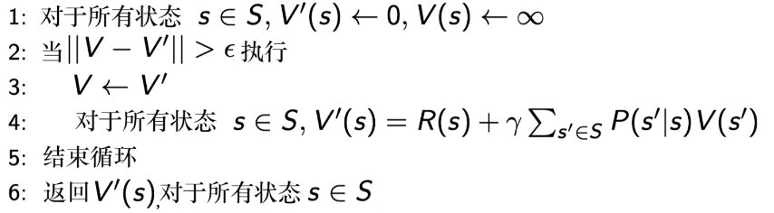
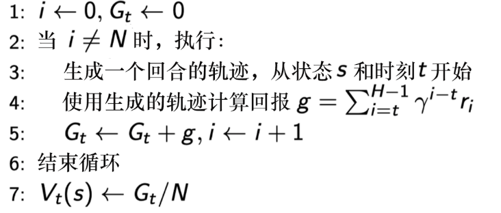
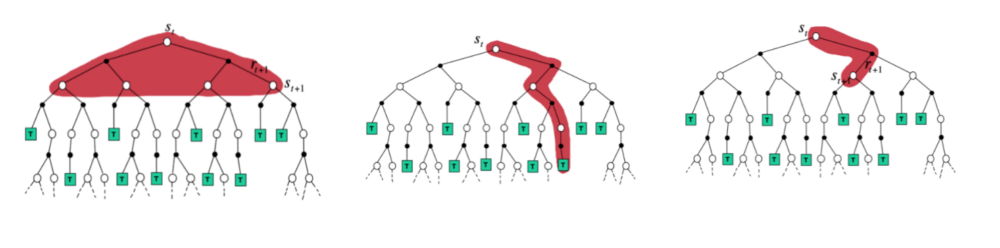

>上一篇笔记, 已经从“为什么要用RL“ 引领到了“如何用MDP相关理论解决RL问题“的门前, 并介绍了策略迭代和价值迭代两种方法. 但是, 这通常要求我们知道环境的动态模型 (比如状态转移概率P和奖励函数R), 但是在训练一个Agent当中, 我们往往无法获得这个模型. 所以接下来的路径自然就是深入各种**免模型**RL算法, Q-learning、Policy Gradient等算法, 它们是将LLM与RL结合的关键工具.

> 实际上, 因为我们主要学习的是思想, 要侧重理解这个公式的**输入、输出、为什么要用这个公式**, 另外还有一个就是**代码中何处运用了这个公式**. 经过笔记一的训练应该已经进入了RL的语境, 所以现在会弱化推导的过程, 至于代码的运用, 将会在后面的笔记中专门实验.

# 一. 进化 -- model-based to model-free

在很多实际问题中, 马尔可夫决策过程的模型可能是未知的, 具体而言, 我们不知道状态转移函数与奖励函数. 比如，围棋、雅达利游戏、控制直升机、股票涨跌等问题…… 但是我们仍然想让Agent学习到如何行动, 怎么办呢?

既然舍弃了建模, 那就需要有东西去替代它的作用, 显而易见, 这个东西就是**数据**. 读者可以回忆 (回去翻) 笔记(一) 中的标题下小字, 那里提到了蒙特卡洛的算法. 因为这种算法是model-free的, 所以我觉得放在这里介绍比较合适. 

这些数据在概率论中被称为采样 (Sample) , 而在强化学习中通常会被称为经验 (Experience) .

# 二. 动态规划的方法 (Dynamic Programming , DP)

在介绍具体的model-free方法之前, 有一点需要解释. 回顾笔记(一)中的MDP决策控制, 我们使用了策略迭代和价值迭代两种方法, 当然, 他们都是model-based算法, 但是要是从算法层面来说明的话, 他们都属于动态规划. 

动态规划适合于解决满足最优子结构和重叠子问题的. 因为我们已经得到了一种迭代的公式, 所以我们可以通过**自举 (bootstrapping)** 的方法不停地迭代贝尔曼方程, 当最后更新的状态和上一个状态区别不大的时候, 更新就可以停止, 我们就可以输出最新的$V'(s)$ 作为它当前的状态的价值. (注: **自举**是指更新时采用了估计, 例如动态规划和时序差分都是; 蒙特卡洛则是**采样**).

 对于简单的MRP过程, 我们可以总结这个过程如下: 

而如果引入智能体的动作成为MDP, 那就是笔记(一)中介绍的两种迭代: 策略迭代和价值迭代了. 

再提一嘴, 不是说model-based的方法就一定不好, 也不是说只有上面说过的两种, 但是他们都是比较基础的开端. 近些年也有继续在model-based领域深挖的, **基于模型的强化学习 (Model-Based Reinforce Learning, MBRL)**, 这里提供一个工具库: [facebookresearch/mbrl-lib: Library for Model Based RL](https://github.com/facebookresearch/mbrl-lib) . 该领域致力于通过数据估计出模型, 继而进行强化学习, 而不是直接用数据. 

# 三. 蒙特卡洛方法 (Monte Carlo, MC)

## 1.  MRP的MC

同样, 我们先用MRP这个随波逐流的过程来看MC的价值评估方法, 借此来说明MC的思想. 当得到一个马尔可夫奖励过程后, 我们从某个状态开始, 把agent放在状态转移矩阵里面, 让它”随波逐流”, 这样就会产生一个轨迹. 产生一个轨迹之后, 就会得到一个奖励, 那么直接把折扣的奖励即回报$g$ 算出来之后, 积累起来得到回报$G_t$. 当累积到一定数量的轨迹之后, 我们直接用$G_t$ 除以轨迹数量, 就会得到某个状态的价值. 

## 2. MDP的MC

通过上述例子我们就可以知道, MC是通过采样轨迹代替概率轨迹, 采样轨迹奖励的均值代替奖励函数. 这实际上就是依赖于大数定律: 只要我们获得足够多的轨迹, 就可以趋近于价值函数 (因为价值函数的定义就是用期望 ), 即当 $N(s) \rightarrow \infty$ 时, $V(s) \rightarrow V_\pi(s)$ . 虽然我们不能通过迭代求解贝尔曼方程的方法得到价值函数, 但是我们仍然可以用采样来做**策略评估**. 

### (1) MC Basic

> 注意, 本算法的效果极差, 基本是没法用的状态. 但是却是后面优化的起点, 并且非常清晰的揭示了如何从model-based跨向model-free, 所以必须首先介绍. 

现在需要正式跨向model-free, 通过MRP中的MC我们已经可以知道如何通过采样来近似出概率从而得到价值函数. 但是在更复杂的MDP中, 策略不是能通过采样总结出来的, 而是要主动选择的. 因此, 我们的想法是, **回到策略迭代的算法中, 把里面依赖模型的算法替换掉, 从而得到MDP中的model-free算法**.

首先回顾策略迭代的两个步骤, 策略评估和策略更新. 当时我们是借用Q值的迭代, 并证明了最优情况下的V就是采取最优行动Q的价值. 这里Q值非常关键, 我们回归得出Q值的地方, Q值最原始最基本的定义是学习笔记(一)里的6.6, 当时我们由于是知道奖励函数和状态转移概率的, 所以我们使用贝尔曼公式的工具, 直接推到出了其公式6.8. 实际上, 这里前面的$R(s,a)$ 部分还能继续展开, 因为它是累积的总汇报, 完全写开之后就是这种形式: 
$$
Q(s,a)=\sum_rp(r|s,a)r+\gamma\sum_{s^{\prime}\in S}p\left(s^{\prime}\mid s,a\right)V\left(s^{\prime}\right) \tag{2.1.1}
$$
然后, 模型的更新依赖于Q值. 继续推导, 可以得到式2.1.2表示Q可以由迭代来更新, 然后得到的更新策略的方法就是让Q更大:
$$
Q^{*}(s,a)==\sum_rp(r|s,a)r+\gamma\sum_{s^{\prime}\in S}p\left(s^{\prime}\mid s,a\right)\max_{a}Q^{*}(s^{\prime},a^{\prime})\tag{2.1.2}
$$
$$
\pi_{i+1}(s)=\underset{a}{\operatorname*{\arg\max}}Q_{\pi_i}(s,a) \tag{2.1.3}
$$
策略迭代依赖于Q值, Q值依赖于贝尔曼公式道出的递归式, 递归式的求解依赖于动态规划的方法…… 本来是严丝合缝的逻辑, 但是目前, 环境未知, 自然就不可能得到p和r, 这种方法作废.

那么现在回到最原始的定义 (上一章的式6.6), 它目前还不依赖于模型
$$
Q_\pi(s,a)=\mathbb{E}_\pi\left[G_t\mid s_t=s,a_t=a\right] \tag{2.1.4}
$$
这是一个随机变量的期望值进行估计的过程, 或者说这是一个**均值估计**的过程. 而MC就可以求解, 其中$g^{(i)}$ 是对随机变量的采样, 用来估计$G_t$ :
$$
Q_{\pi_k}(s,a) = \mathbb{E}[G_t|s_t = s, a_t = a] \approx \frac{1}{N} \sum_{i=1}^{N} g^{(i)}(s,a) \tag{2.1.5}
$$
现在我们来梳理一下算法的过程, 首先我们会给出一个初始策略$\pi_0$ , 并且在第k步迭代中, 会有以下两步: 
Step1: policy evaluation. 计算得到所有(s, a)的Q值, 方法就是之前说过的MC采样.
Step2: policy improvement. 第二步和策略迭代算法一样, 选出Q表中最大的值, 开始迭代.

我们可以说, MC Basic算法就是Policy Iteration算法的一个变形, 将其基于模型计算Q值的部分改为了基于采样估计. 另外, Policy Iteration中是先计算V再转成Q, 而MC Basic就是直接估计Q, 这是因为V转化成Q的过程也依赖于模型, 这是肯定不行的. 详见笔记(一)的马尔可夫决策过程控制. 

### (2) MC Exploring Starts

MC Basic虽然思想直观, 但是却非常低效, 所以我们对其进行推广, 让其更高效. 

### (3) MC $\epsilon$ -Greedy

 1-$\epsilon$ 的概率按照Q函数执行动作, $\epsilon$ 概率的可能会随机探索. 通常情况下, $\epsilon$ 是一个比较小的值. 数学上可以证明, 任意$\epsilon$ 贪心策略$\pi'$ 都是对$\pi$ 对改进, 优化是单调的. 

# 四. 时序差分学习 (temporal-difference learning, TD)

>TD (时序差分) 学习是RL中非常经典的算法, 它结合了动态规划和蒙特卡洛的优点, 实现了单步更新. Q-learning和SARSA是TD学习的典型代表, 前者属于离策略(off-policy)学习, 后者则是同策略(on-policy)方法. 

## 1. DP, MC和TD

到现在, 我们已经学完了DP和MC, 知道了DP和MC的区别最大在于是否model-based. 但是TD和这两者的区别是什么呢. 接下来, 我们可以从统一的视角, 来看一看这三种算法更新的备份图:

如上图, 从左到右分别是DP, MC, TD (这里是TD(0), 即单步更新) 的视角. DP通过递推相加, 每一个节点都会被计算到; MC每次采样完一整条轨迹. 而TD则是走一步(或几步), 就会对未来的值进行估计. 

时序差分的目的, 就死后对于某个给定的策略$\pi$ , 在线计算出它的状态价值函数$V_\pi$, 即一步一步算. 最简单的算法是**一步时序差分(one-step TD), 即TD(0)**, 它每走一步都更新一次:
$$
V(s_t) \leftarrow V(s_t) + \alpha (r_{t+1} + \gamma V(s_{t+1}) - V(s_t)) \tag{4.1.1}
$$
上式中, $\alpha$ 是学习率, 而$r_{t+1} + \gamma V(s_{t+1})$ 是估计回报, 也可以称为**时序差分目标(TD Target)**, 我们减去和目标的差距, 也被称为**TD Error**, 对价值函数进行软更新, 以此来不断达到逼近目标. 

我们可以看出, 时序差分实际上是一种估计. 首先它同样对期望值采样, 然后最重要的是它使用的是当前估计的V而不是真实的V.

对TD进行推广, 如果调整步数 (step), 就可以变成**n步差分算法 (n-step TD)**. n=1的时候, 就是上述提到的TD(0)或者直接称TD算法, 而当n趋向于无穷, 实际上就就是MC算法.

通过调整步数, 可以进行MC方法和TD方法之间的权衡. 上述方法也被称为基于**state value的TD算法**.
## 2. Sarsa

Sarsa时一种**同策略时序差分算法 (On-Policy)**,  也就是说, 它只有一个Q表来实现, 优化和选择都在上面. 

Sarsa算法做出的改变很简单, 它把原本TD更新V的过程, 改为了更新Q, 或者说, Sarsa直接估计Q表,  即:
$$
Q(s_t,a_t) \leftarrow Q(s_t,a_t) + \alpha [r_{t+1} + \gamma Q(s_{t+1},a_{t+1}) - Q(s_t,a_t)] \tag{4.2.1}
$$
由于每次更新函数值需要知道目前的状态, 当前的动作, 奖励, 下一步的状态, 下一步的动作, 即$(s_t,a_t,r_{t+1},s_{t+1},a_{t+1})$ , 所以取首字母就构成了Sarsa算法.

Sarsa同样有单步和n步之分, 依据step. 如果给Q机上资格衰减参数$\lambda$ , 就会成为Sarsa($\lambda$) 策略.

## 3. Q-learning

相比于Sarsa, Q-learning采用的是**异策略算法(Off-Policy).** 在它学习的过程中, 有两种不同的策略, **目标策略(target policy)** 和 **行为策略(behavior policy)**. 我们可以进行直观的比喻, 前者相当于军师的角色, 后者相当于士兵. 士兵的按照自己的策略探索环境, 用$\mu$ 表示, 然后探索出来的轨迹/数据再交给军师, 而且交出的数据中不需要像Sarsa一样包含$a_{t+1}$ .

因为学习策略很多时候太“胆小”了,总倾向于选择目前的最优, 所以有了探索策略. 

异策略学习有很多好处:
1. 可以用探索学习来学到最佳策略, 学习效率高
2. 可以**学习其他智能体的动作**, 进行模仿学习
3. 可以重用旧的策略产生轨迹, 节省资源

当然, 以上的优势主要在加入经验回放后才能体现出来, 对于朴素Q-learning来说, 异策略同样是有好处的. 

现在我们来详细介绍Q学习. Q学习在目标策略$\pi$ 上直接采用贪心策略, 按照从Q表里选择最大的来进行. 行为策略$\mu$ 可以是随机的策略, 我们采用$\epsilon$ 贪心方法.

Q学习的增量表达形式如下, 就形式而言, 其与Sarsa非常相似, 但是要看仔细, 这里的目标是不一样的. 
$$
Q(s_t, a_t) \leftarrow Q(s_t, a_t) + \alpha \left[ r_{t+1} + \gamma \max_a Q(s_{t+1}, a) - Q(s_t, a_t) \right] \tag{4.3.1}
$$
对比Sarsa用同一策略选择$a_{t+1}$ 之后再更新Q值, 其目标$r_{t+1} + \gamma \max_a Q(s_{t+1}, a)$ , 使用当前的a中使得Q取得最大的贪心结果, 而不需要$a_{t+1}$ , 也就是说Q学习不需要提前知道下一个动作, 只需要前面的$(s_t,a_t,r_{t+1},s_{t+1})$ . 

当然, 上述更新的式子是隐含异策略的, 只表达了更新时属于完全贪婪, 我们可以将其显式写出, 行为策略$\mu$ 为:
$$
a_t \sim \mu (\cdot|s_t)=\left\{
\begin{aligned}
&随机动作, 概率\epsilon; \\
&argmax_a Q(s_t,a),概率1-\epsilon \end{aligned}
\right. \tag{4.3.2}
$$
学习策略时 (更新Q值时):
$$
\pi(s_{t+1})=argmax_aQ(s_{t+1},a) \tag{4.3.3}
$$
为什么我们要将两个策略分开, 给行为策略选择$\epsilon-greedy$ 算法? 这是其中的核心意义就是, **当前Q值最大的动作不一定是最好的**, 因为我们得到的信息不完整, 或者说不能采样所有动作, 有的动作可能根本就没有尝试过. $\epsilon-greedy$ 算法就承认了当前的“最好”可能不是真正的“最好”, 所以使用了探索和利用的trade-off, 解决了困境, 有意识探索未知避免陷入局部最优.
