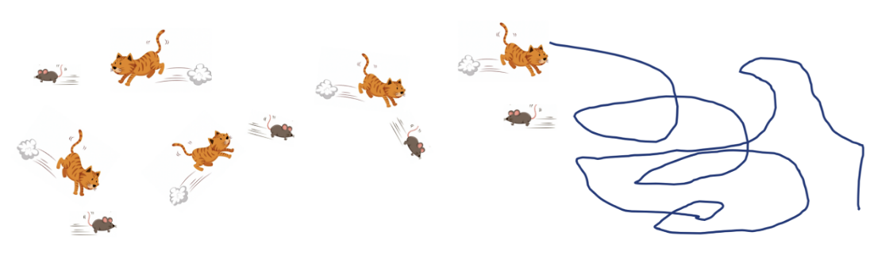
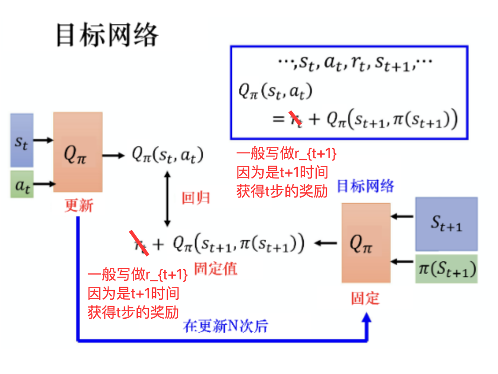
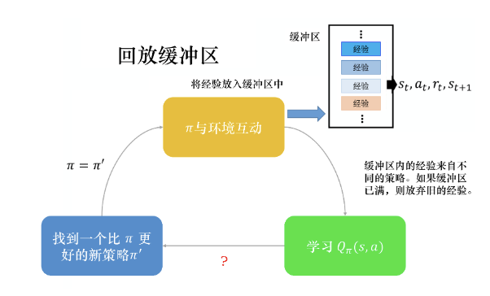
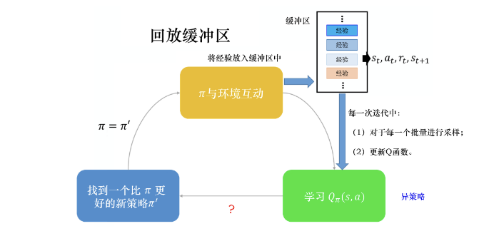
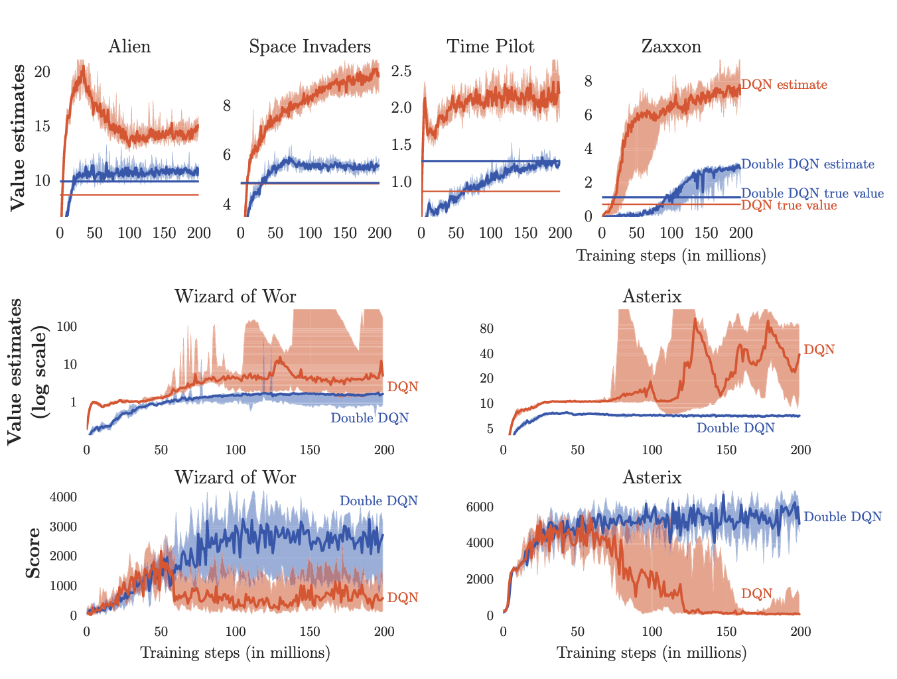
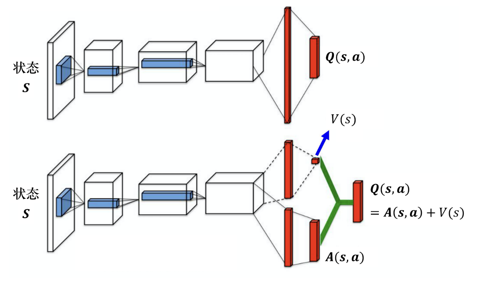
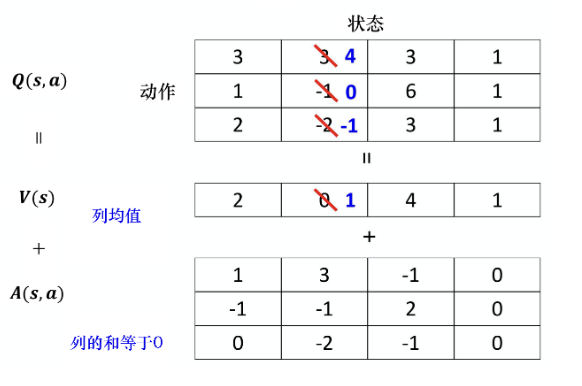
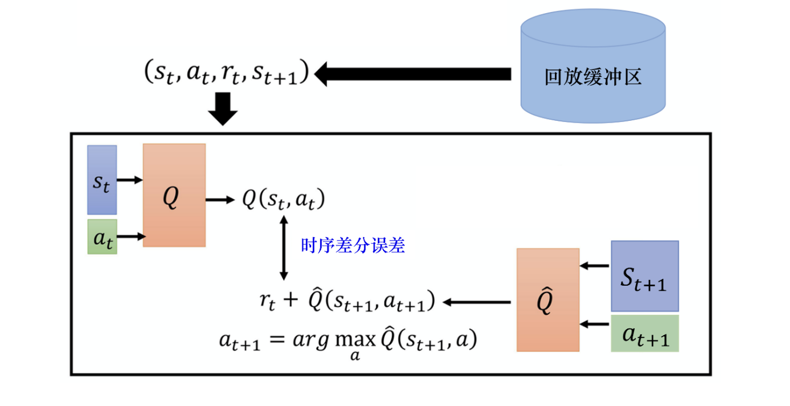
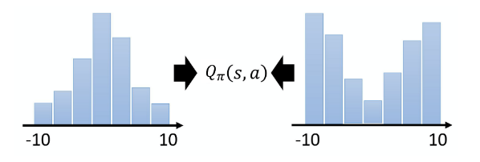
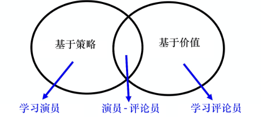

> 之前陈述的问题中, 动作都是离散的, 所以可以用表格表达, 但是在实际RL过程中, 很多时候是高纬度的动作, 甚至是无限的动作(一个范围), 这时所有动作都会失效

# 一. 引入深度网络

我们需要在连续的状态和动作空间中计算函数值$Q_\pi(s,a)$, 我们可以用一个函数$Q_\phi(s,a)$ 来近似计算, 称为**价值函数近似 (value funciton approximation)** :
$$Q_\phi(\boldsymbol{s},\boldsymbol{a})\approx Q_\pi(\boldsymbol{s},\boldsymbol{a}) \tag{1.1}$$
函数$Q_\phi(s,a)$ 通常是一个参数为$\phi$ 的函数, 比如神经网络, 其输出为一个实数, 称为**Q网络 (Q-network)**. 因为Q值本质上是一个实数, 所以我们可以通过这种端到端的方法, 直接计算出Q值.

# 二. 离散动作的DQN

**深度Q网络 (deep Q-network)** 是指基于深度学习的Q学习. DQN是value-based算法, 批评家 (Critic) 基于深度网络计算Q. 我们首先介绍三个常用的技巧, 然后在给出DQN算法的更新过程. 

## 1. 目标网络

DQN与Q-learning的思想没有区别, 只是用神经网络完成了标量Q的输出.我们回顾Q-learning算法, 他的核心思想也是让做策略评估, 让当前的Q更接近于贝尔曼公式递推出来的Q‘. Q-learning的更新式可以写作:
$$Q(s_t, a_t) \leftarrow Q(s_t, a_t) + \alpha \left[ r_{t+1} + \gamma \max_a Q(s_{t+1}, a) - Q(s_t, a_t) \right] \tag{2.1.1}$$
这其中, Q-Target为: 
$$Q_{target}=r_{t+1}+\gamma \underset{a}{max}Q(s_{t+1},a) \tag{2.1.2}$$
对于DQN就是用一个带有参数$\theta^-$ 的目标网络来输出这个值, 所以可以写作:
$$Q_{target}=r_{t+1}+\gamma \underset{a}{max}Q(s_{t+1},a;\theta^-) \tag{2.1.3}$$
相对的, 左侧的Q就用一个参数为$\theta$ 的网络来输出, 用于选择动作和计算当前Q值.

回顾之前的TD方法, 我们用TD error, 加上学习率$\alpha$ 对Q进行软更新. 但是这样其实是不好学习的, 因为每次Q都是更新的, 也就是说, 我们在学习的过程中, 目标也是变动的.

我们可以举个例子, 在猫抓老鼠当中, 将猫比做Q估计 (左侧), 老鼠比做Q目标 (右侧), 如果Q网络也会动, 就会产生非常奇怪的优化轨迹, 使得训练十分不稳定.

所以, 我们可以先把老鼠固定一段时间, 动的不要那么频繁, 比如每五步跑一次, 放到上面的式子中, 就是我们把后面的$Q_\pi\left(s_{t+1},\pi\left(s_{t+1}\right)\right)$ 称为**目标网络**, 这其中的$\pi(s_{t+1})$ 采用和上一节Q-learning中一样的argmax策略选择a (式4.3.3). 将其固定, 左侧的Q更新, 等到更新一些次数之后(比如100次) 再把参数复制到右边的网络中改变目标值. 因此, 在目标没有改变的期间, 我们仅仅相当于在做一个回归问题, 去靠近一个固定的值:

> 严格来说$r_t$ 应该写为$r_{t+1}$ 比较规范. 回忆一下我们的回报$G(t)$ 也是从t+1开始奖励, 不知道你当时疑惑了没有🤫. 后面图片也有这个问题.

## 2. 探索

当我们使用Q函数的时候, 策略完全取决于Q函数, 给定一个状态, 我们就穷举所有动作, 来采取让Q值最大的动作. 这里就遇到一个问题: 我们一定要对一个动作进行过采样才能计算出Q值, 然而如果在那个状态没有采样过某动作, 就估测不出它的Q值. 

如果Q是表格, 问题会很严重, 导致根本估不出没见过的s-a对的Q值; 如果是网络, 也会有类似的问题, 假设有三个s-a对, 我们估测其初始值(假设为0,0,0), 然后我们采样了第二对得到了正向的奖励, 变成了(0,1,0), 这样我们以后每次都会选择第二个动作, 但是可能选择两外两个会更好.

如果我们没有很好探索, 训练就会遇到这种问题. 所以, 我们需要在探索和利用中找到一个trade-off, 这个问题被称为强化学习过程中的**探索-利用窘境(exploration-exploitation dilemma)**.

我们通常可以用两个方法来解决它, 首先是我们的老熟人 **$\epsilon$-贪心**, 我们在model-free的MC方法中就使用了这种优化. 而另一种是**玻尔兹曼探索 (Boltzmann exploration)**. 我们假设对于所有s-a对, Q值均大于等于0, 那么a选中的概率就和Q成正比. 我们引入温度系数T, 得到下面式子:
$$\pi(a\mid s)=\frac{\mathrm{e}^{Q(s,a)/T}}{\sum_{a^{\prime}\in A}\mathrm{e}^{Q(s,a^{\prime})/T}} \tag{2.1.1}$$
  其中T为正数. 如果T很大, 所有动作几乎都以等概率选择 (探索); 如果T很小, Q值大的动作更倾向于被选中 (利用). 通过调整T值, 我们可以实现trade-off. 

## 3. 经验回放

读者也许还记得介绍Q-learning的时候提到过异策略算法的优势, 其中之一就是可以重用旧的采样, 产生轨迹, 节省性能. 我们构建一个**回放缓冲区(replay buffer)**, 也被称作**回放内存(replay memory)**. 现有策略$\pi$ 与环境交互多次收集数据, 全部放在buffer中. 回放缓冲区的**经验**可能来自于不同的策略, 在存满的时候才会丢弃旧的策略.

有了回放缓冲区之后, 我们会迭代训练Q函数, 在每次迭代里面从回放缓冲区随机挑选一个批量 (batch) 出来, 按照过去的经验去更新Q函数. 所以说, 如果使用了经验回放的技巧, 这个算法也就是异策略算法了.

## 4. 深度Q网络

一般的深度Q网络中, 我们初始化两个网络 -- Q和$\hat{Q}$ . 开始两者一样, 然后我们对于每一个时间步, 用探索的算法 (如$\epsilon$-贪心) 选择动作a获得反馈r, 然后我们$(s_t,a_t,r_t,s_{t+1})$ 存储到缓冲区中. 然后我们从缓冲区以批量形式采样, 然后更新Q函数. 我们通过更新Q让其更接近于目标网络$y=r_{i}+\max_{a}\widehat{Q}(s_{i+1},a)$ (回归). 然后每经过C次重置$\hat{Q}=Q$ , 并更新目标.  

# 三. 深度Q网络进阶优化
## 1. 双深度Q网络 (double DQN, DDQN)

为什么要提出DDQN ? 这是因为, 在传统的Q网络中, Q值往往是被高估的. 这是因为我们实际在设计更新式子的过程中, 我们实际上就是看哪个a可以得到最大的Q值, 就贪心为目标. 但是, 网络是有误差的, 假设其中一个动作被高估了, 就总会倾向于选择它, 从而使目标总是太大. 

为了解决高估问题, 我们在DDQN设置了两个Q函数. 其中一个与之前一样, 贪心决定动作a, 但是决定之后并不适用这个Q网络计算Q值, 而是用另一个Q‘计算, 也就是:
$$Q\left(s_t,a_t\right)\longleftrightarrow r_t+Q^{\prime}\left(s_{t+1},\arg\max_aQ\left(s_{t+1},a\right)\right)\tag{3.1.1}$$
这样一来, 如果Q高估了a, 只要Q‘没有高估, 就还是正常的值; 如果Q’高估了, 也是没问题的, 只要Q不选择这个a就可以. 这种互相制约的网络, 正是DDQN的神奇之处. 

我们针对如下几个游戏中, DDQN和DQN之间的对比, DDQN得到的真正的Q值是要比DQN高的, 所以我们说, DDQN学出来的策略比较强, 实际得到的奖励比较大.

最上面一行中水平的橙色（对应DQN）和蓝色（对应Double DQN）直线是在学习结束后运行相应智能体，并对从每个访问状态获得的实际折扣回报进行平均后计算得出的。如果不存在偏差，这些直线将与图表右侧的学习曲线完全吻合。中间一行展示了两款游戏中DQN过度乐观情况尤为明显的对数值估计（以对数尺度表示）。最下面一行则显示了这种过度乐观对智能体在训练过程中评估时所取得分数的负面影响：一旦出现高估现象，分数便会下降。而使用Double DQN进行学习则要稳定得多。

## 2. 竞争深度Q网络

相比于原本的DQN, 它唯一的差别就是改变了网络的架构. DQN输入的是状态, 输出的是每一个动作的Q值. 而竞争深度Q网络不直接输出Q值, 而是分成两条路径运算, 第一条路径会输出一个标量$V(s)$ , 第二条路径会输出一个向量$A(s,a)$, 把这两者加起来够成新的Q值$Q(s,a)$. 

这样做有什么好处呢? 答案是我们不需要把所有的状态-动作对都采样, 可以不修改$A(s,a)$ 转而修改$V(s)$. 因为很多时候, 一个动作并不会太大影响即使在在这个状态的价值了. 我们这样修改, Q表的值也会被修改, 但是修改的话可以仅仅通过调整V值如下图:

那么剩下的问题就是如何让网络倾向于修改V来解决问题. 最直观的方法就是, 我们给A加上约束, 让网络倾向于修改V来解决问题. 比如, 我们可以控制A的均值为0, 所以更新单个A值就不可行了, 网络就会更新在V值上.

对于具体的实现, 我们将A和V相加之前, 先进行归一化让A列之和等于0.

## 3. 优先级经验回放 (Prioritized Experience Replay, PER)

我们原本在采样数据训练Q网络的过程中, 会均匀从回放缓冲区采样数据, 然而这样并不一定是好的, 因为一些数据非常重要. 所以我们就需要给不同的数据优先权 (priority). 做PER的时候, 因为改变了采样的过程, 更新参数的方法也要更改.

## 4. 多步更新 -- MC + TD

这个就不用解释了, 多步更新即可.

## 5. 噪声网络 (noisy net)

探索的过程也可以改进, $\epsilon$-贪心就是在动作的空间上加噪声. 噪声网路是给参数的空间加上噪声. 比如我们给网路上每一个参数加上一个高斯噪声, 就把原来的Q变成了$\widetilde{Q}$ , 称为**噪声Q函数(noisy Q-function)**. 

OpenAI和DeepMind几乎在同一时间提出了几乎一模一样的噪声网络方法, 只是作用范围不同. 日后有机会在看看读不读吧.

## 6. 分布式Q函数

分布式Q函数是一个比较合适但难以实现的代码. 事情是这样的, 我们算出来的Q值是一个期望值. 我们把某一个状态采取某一个动作时, 得到的所有奖励在游戏结束时进行统计, 就会得到一个分布, 我们对这个分布计算平均值才是Q值, 算出来是累积奖励的期望. 也就是说, 累积奖励也是一个分布, 对它求期望, 再取平均值, 得到Q值.

但是不同的分布可能会相同的均值, 我们用Q值的期望来代替这个那个奖励, 这样可能丢失一些信息, 无法对真实的奖励分布建模: 

分布式Q函数是对distribution建模. 具体的做法暂时不用去管.

# 四. 针对连续动作的深度Q网络

> 前面主要是在针对Q网络展开讨论其设计初衷, 但是我们仍然假设动作时离散的. 但是如果a是无限的, 该怎么利用Q网络? 以下有几种解决的方法

## 1. 对动作采样

这个方案也是最原始最直观的, 我们尽量采样多个动作, 并选择一个最大的Q. 这不是一个精确的方案, 但是并不会太低效: 因为我们会在计算中使用GPU, 进行并行运算.

## 2. 梯度上升

我们找a的本质是解决一个优化问题, 最大化目标函数. 因此我们就可以采用梯度上升, 将a作为参数, 找一组a去最大化Q函数, 就用梯度上升去更新a的值, 直到最后收敛.

既然是梯度上升, 就面临两个问题, 一个是局部最大值问题, 另一个就是每次决定采取动作的时候还是要训练一次网络, 计算量还是很大.

## 3. 设计网络架构

我们通过特别设计Q函数来解决arg max操作问题, 通过, 我们输入的状态s可以用向量或矩阵来表示它, Q函数则会输出向量$\mu(s)$ 、矩阵$\Sigma(s)$ 和标量$V(s)$. 
$$Q(\boldsymbol{s},\boldsymbol{a})=-(\boldsymbol{a}-\boldsymbol{\mu}(\boldsymbol{s}))^\mathrm{T}\boldsymbol{\Sigma}(\boldsymbol{s})(\boldsymbol{a}-\boldsymbol{\mu}(\boldsymbol{s}))+V(\boldsymbol{s})\tag{4.3.1}$$
注意这里的a是连续的动作, 所以是一个向量. $\boldsymbol{a}$ 和$\boldsymbol{\mu}(\boldsymbol{s})$ 都是列向量, $(\boldsymbol{a}-\boldsymbol{\mu}(\boldsymbol{s}))^\mathrm{T}$ 是一个行向量, $\boldsymbol{\Sigma}(\boldsymbol{s})$ 是一个正定矩阵. 通过矩阵运算很显然Q值是一个标量.

我们让$(\boldsymbol{a}-\boldsymbol{\mu}(\boldsymbol{s}))^\mathrm{T}\boldsymbol{\Sigma}(\boldsymbol{s})(\boldsymbol{a}-\boldsymbol{\mu}(\boldsymbol{s}))+V(\boldsymbol{s})$ 的值越小, 显然Q的值就越大. 很显然, 令 $\boldsymbol{a}$ 接近$\boldsymbol{\mu}(\boldsymbol{s})$ , 得到的Q值就会更大, 从而解决arg max操作. 

综上而言, 深度Q网络也可以用于连续的情况中, 只是有一定的局限: 函数不能随意设置.

关于这个网络的具体细节这里暂时略过, 可能后面在实现时会进行补充说明.

## 4. 干脆不使用DQN吧

Q函数无论如何处理连续数字都很麻烦, 于是我们可以优化算法. 我们将基于策略的方法如PPO于基于价值的方法如DQN结合, 就可以得到Actor-Critic算法, 由于时策略导向, 并不在乎动作的连续性. 我们将在后续章节中继续介绍.

