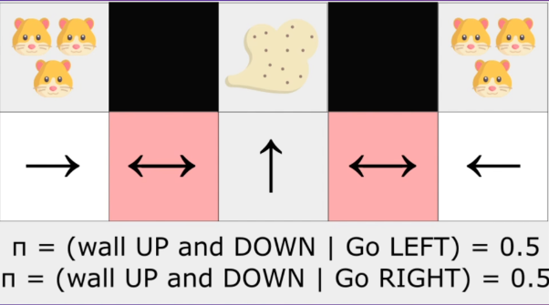
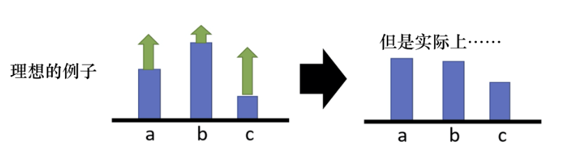
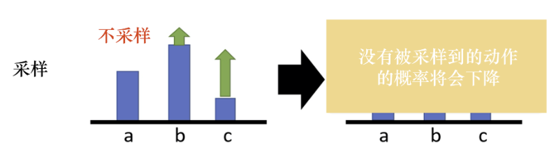

> 前面我们已经跨过了RL到三个大的难题: model-base 2 model-free ( 用数据代替建模 ), non-incremental 2 incremental ( 从递推形式变成增量形式 ), tabular representation 2 function representation (当然, 这个目前大多数的解决还是依赖于Policy网络 ). 但是, 还是有些问题无法解决的……

# 一. 策略梯度定理

DQN虽然某些地方获得了成功, 但是其本身还是有许多问题. 比如:
1. 因为是value-based, 策略是隐式的, 无法表示随机策略. 而某些问题, 随机策略反而是最好的, 需要以不同概率选择不同动作. DQN之类的算法在实现时候采用了贪心策略, 显然无法按照概率执行候选动作.
2. Q值的微小改变就会让动作选中、不选中. 举例来说Q值排名前两名的动作可能只相差了0.0001这样子, 增大一点第二位的动作就变成最优了. 所以说, 不稳定, 影响算法收敛.

对于1我们可以再进行举例解释: 下图黑色部分为墙壁, 扫地机器人的功能是避开仓鼠吸灰, 在左侧红色区域时, 机器人可能会向左, 发现仓鼠, 从而向右来吸灰. 但是, 当同样的state发生, 扫地机器人进入右侧红色区域时候, 应该采取的是向左的action, 这就导致了同样的state, 产生了两种不同应该采取的action, 但是机器人却学到的是相同的东西, 陷入了混淆的感知态  (**perceptual aliasing**) , 混合推导.

Q(s, a)的输入是智能体感知态s, 而非环境的真实状态, 所以Q值是与感知态强绑定的. 正确的, 应该在红色区域学到的策略, 并非是向左或向右, 而应该是**一本概率向左, 一半概率向右** 这种有概率的策略, 确定性策略无法应对非对称问题.

因此, 我们不学习值函数, 而是采用显示学习策略(policy-based) 这样就可以学习到随机的策略, 而不会一直被卡住.

为了解决这个问题, 我们不如采用更直接的方法来直接学习策略, 将策略参数化, 让神经网络学习更新参数$\theta$ , 输出策略$\pi_\theta$. 这个策略是s状态下执行各种动作的概率值, 条件概率. 此时的神经网络输出层的作用类似于多分类问题的softmax回归, 输出的是一个概率分布，只不过这里的概率分布不是用来进行分类, 而是执行动作:

$$
\pi_{\theta}(s) = P[a|s; \theta] \tag{1.1}
$$

如何衡量这个动作的概率分布好不好呢 ? 在一系列动作, 或者说一个轨迹**trajectory**之后, 我们把每一步的奖励累积起来, 来评价这个轨迹的好坏. 我们通过优化预期的累计奖励$J(\theta)$ 这个目标函数, 就可以得到最佳策略.
$$
J(\theta)=\Sigma_\tau P(\tau;\theta)R(\tau)\tag{1.2}
$$
所以, 我们现在就要通过梯度上升的方法, 让$J(\theta)$ 最大, 称为**策略梯度**. 首先, 我们对其求梯度:
$$
\nabla_\theta J(\theta)=\nabla_\theta \Sigma_\tau P(\tau;\theta)R(\tau)=\Sigma_\tau \nabla_\theta P(\tau;\theta)R(\tau)\tag{1.3}
$$
$$
=\Sigma_\tau \frac{\nabla_\theta P(\tau;\theta)}{P(\tau;\theta)}P(\tau;\theta)R(\tau)\tag{1.4}
$$
而根据对数函数复合函数求导公式:
$$
\nabla_xlogf(x)=\frac{\nabla_x f(x)}{f(x)}\tag{1.5}
$$
我们可以进一步化简公式, 得到:
$$
\nabla_\theta J(\theta)=\Sigma_\tau P(\tau;\theta)\nabla_\theta logP(\tau;\theta)R(\tau) \tag{1.6}
$$
而这个时候, 又会巧妙发现这是符合概率论中期望定义的一个式子, 前面是走其中一个trajectory的概率, 后面是走这个trajectory对应的值. 现在将其写为期望的形式:
$$
\nabla_\theta J(\theta)=E_{\tau \sim P(\tau;\theta)} \Sigma_\tau \nabla_\theta logP(\tau;\theta)R(\theta) \tag{1.7}
$$
继续, 根据大数定律, 我们可以通过采样的方法来近似出对$\theta$ 的梯度, 得到如下的式子: 
$$
\nabla_\theta J(\theta)=\frac{1}{m}\sum \limits_{i=1}^{m}\nabla_\theta logP(\tau^{(i)};\theta)R(\tau^{(i)}) \tag{1.8}
$$
其中i表示第i次流程, 这样就可以一轮一轮走过流程, 来训练这个值让他最大. 这样其实已经从宏观把握了如何进行的优化,

继续化简, 其中$P(\tau ^{i};\theta)$ 是一个链条, 表示在$\pi(\theta)$ 这个策略下 , 选择$\tau$ 这个trajectory的概率:

$$
P(\tau;\theta)=\Pi_{t=0}P(s_{t+1}|s_t;a_t)\pi_\theta(a_t|s_t) \tag{1.9}
$$
其中第i次采样的结果是:
$$
P(\tau ^ {i};\theta)=\mu(s_0)\prod\limits_{t=0}^{H} P(s_{t+1}^{(i)}|s_{t}^{(i)}, a_{t}^{(i)})\pi_\theta(s_{t}^{(i)}, a_{t}^{(i)}) \tag{1.10}
$$
这里说明一下, 在第i次采样中$\theta$ 是$s_t^{(i)}$ 中$a_t^{(i)}$ 对可能性是$\pi_\theta(s_{t}^{(i)}, a_{t}^{(i)})$, 但即时该动作也可能到不了$s_{t+1}$, 举个例子如果路滑可能就会多走一格. 这取决于环境的反馈概率, 也就是$P(s_{t+1}^{(i)}|s_{t}^{(i)}, a_{t}^{(i)})$ . 而$\mu(s_0)$ 则是代表以$s_0$ 开始的概率, 或者说$s_0$ 的概率分布, 因为某些环境中起点都有可能. 所以从$\mu$ 开始, 累乘后面的式子到结束, 就是一个trajectory的P. 

考虑形式, 两边取对数对$\theta$ 求梯度, 用对数性质化简: 
$$
\begin{aligned}&\nabla_\theta\log P(\tau^{(i)};\theta)=\nabla_\theta\log\left[\mu(s_0)\prod_{t=0}^HP\left(s_{t+1}^{(i)}\mid s_t^{(i)},a_t^{(i)}\right)\pi_\theta\left(a_t^{(i)}\mid s_t^{(i)}\right)\right]\\

&\nabla_\theta\log P(\tau^{(i)};\theta)=\nabla_\theta\left[\log\mu(s_0)+\sum_{t=0}^H\log P\left(s_{t+1}^{(i)}\mid s_t^{(i)},a_t^{(i)}\right)+\sum_{t=0}^H\log\pi_\theta\left(a_t^{(i)}\mid s_t^{(i)}\right)\right]\end{aligned}\tag{1.11}
$$

而右侧的式子, 根据和的梯度就等于梯度的和, 继续化简: 

$$
\begin{aligned}&\nabla_\theta\log P(\tau^{(i)};\theta)=\nabla_\theta\log\mu(s_0)+\nabla_\theta\sum_{t=0}^H\log P\left(s_{t+1}^{(i)}\mid s_t^{(i)},a_t^{(i)}\right)+\nabla_\theta\sum_{t=0}^H\log\pi_\theta\left(a_t^{(i)}\mid s_t^{(i)}\right)\\

&\nabla_\theta\log P(\tau^{(i)};\theta)=\nabla_\theta\sum_{t=0}^H\log\pi_\theta\left(a_t^{(i)}\mid s_t^{(i)}\right)\\\end{aligned}\tag{1.12}
$$

综合一下, 将1.12式代入1.8式子,  最终就得到了$J(\theta)$ 的梯度.
$$
\nabla_\theta J(\theta)=\hat{g}=\frac1m\sum_{i=1}^m\sum_{t=0}^H\nabla_\theta\log\pi_\theta\left(a_t^{(i)}\mid s_t^{(i)}\right)R(\tau^{(i)})\tag{1.13}
$$
上面其实是m次采样之后的策略梯度. 我们也可以将本式子再回归本源, 写回期望形式:
$$
\nabla_\theta J(\theta)=\mathbb{E}_{\pi_\theta}[\nabla_\theta log\pi_\theta (a_t|s_t)R(\tau)]\tag{1.14}
$$

这个式子, 就是我们需要的**策略梯度定理** ! 虽然我们进行了非常繁琐的推理, 但是这个期望式子意外的非常简洁. 值得注意的是, 这里的$\nabla_\theta log\pi_\theta (a_t|s_t)$  在统计学上被称为**得分函数 (Score Function)**, 它的定义就是对数似然函数对某个参数的偏导数. 这个量有一些很有趣的数学性质. 

1. 得分函数在真实参数下的期望为0. 这是因为对数似然函数的导数反映了似然函数的“坡度”, 而在真实参数$\theta$ 下, 似然函数达到极大值, 坡度为0.  
2. 得分函数的方差不为0, 而是与Fisher信息密切相关.

当然上面的性质不用管, 只需要认识到它是一个重要的统计量, 蕴含着更深入的信息. 比如在求解MLE时, 我们就是通过求解得分函数等于零的点来估计参数.

回到这个式子, 对于概率分布$\pi_\theta(a|s)$ , 得分函数定义为该分布的对数似然关于参数$\theta$ 的梯度. 我们可以把它看作是**在策略空间中指向增加特定动作$a_t$ 概率的方向**. 这个值指导我们, 如何微调参数$\theta$ , 才能最有效地增加/减少选择特定动作$a_t$ 的概率. 如果整个轨迹的回报$R(\tau)$ 是正的, 就沿着这个方向更新; 如果是负的, 就反方向更新. 

而且, 这个式子还有自动调节步长的能力. 在概率较低的动作上, 得分函数的幅度较大 (可以想象log图像) , 更新步长也就越大. 换言之, 重视那些很少被选中但是有潜力的动作, 在策略梯度中起到**权重调节器**的作用.

# 二. 策略梯度的实现技巧

## 1. 基线 (baseline)

基线通常是一个常数或函数, 用于对轨迹回报进行调整, 将回报转换为对基线的**优势 (advantage)**, 这也是**优势函数**中优势一词的来源 (优势函数是后面AC框架的重要概念, 我们将会在下一节介绍) .

引入baseline的好处不止除了从减小方差的方向理解, 我们观察如下例子,  假设在某个状态有三个动作a、b、c可以执行. 根据式子1.13, 我们要把这三个动作的概率, 对数概率都提高. 但是它们前面的权重$R(\tau)$ 是不一样的, 权重有大有小. 权重小的, 该动作的概率提升的就少, 权重大的概率更提升的就大. 但是对数概率是一个概率, 所以对数概率和肯定是log1也就是0. 因此, 提高少的, 在做完归一化之后会发现居然是下降的, 提升多的才会上升.

而即使是这样, 也还是理想的状态. 因为我们假设a、b、c都被采样到了, 但是实际上我们只采样到了少量的s-a对, 可能有的动作根本没采样到, 那么这些动作就会不断下降, 但是没被采样的明明不一定是不好的动作.

为了解决这个问题, 我们可以让奖励不总是正的, 通过把奖励减去b的方法, 让$R(\tau)>b$ 的时候, 概率就上升, 反之概率就下降. 至于b怎么设置, 我们可以对$R(\tau)$ 的值取期望, 拿到一个“平均”的准线, 也就是说:
$$
b \approx E[R(\tau)] \tag{2.1.1}
$$

使用了这一技巧的公式可以写为:
$$
\nabla\bar{R}_{\theta}\approx\frac{1}{N}\sum_{n=1}^{N}\sum_{t=1}^{T_{n}}\left( R\left(\tau^{n}\right)-b\right)\nabla\log p_{\theta}\left(a_{t}^{n}\mid s_{t}^{n}\right) \tag{2.1.2}
$$

## 2. 分配合适的分数

除了基线之外, 策略梯度算法还有另外一种实现的技巧, 那就是给每一个动作分配合适的分数 (credit). 这是因为, 在同一场游戏里, 我们对所有的状态-动作对使用同样的奖励项进行加权.

这显然是不公平的, 在同一场游戏里面, 也许有些动作是好的, 有些动作是不好的. 假设整场游戏的结果是好的, 但并不代表这场游戏里面每一个动作都是好的, 反之亦然. 所以我们希望可以给每一个不同的动作前面都乘上不同的权重. 我们再像之前value-based一样, 给未来的奖励做一个折扣, 式子就变成了:
$$
\nabla\bar{R}_{\theta}\approx\frac{1}{N}\sum_{n=1}^{N}\sum_{t=1}^{T_{n}}\left( \sum_{t^{\prime}=t}^{T_{n}}\gamma^{t^{\prime}-t}r_{t^{\prime}}^{n}-b\right) \nabla\log p_{\theta}\left(a_{t}^{n}\mid s_{t}^{n}\right) \tag{2.1.3}
$$

# 三. REINFORCE算法(蒙特卡洛策略梯度)

在前面的讨论中, 我们已经推导出了策略梯度采样下的形式, 并对其进行了优化得到了2.1.3. 既然是采样, 我们可以与value-based一开始一样, 采用MC的方法对梯度奖励进行估计.

显然, 我们的分配后合适奖励的部分, 可以继续写成带折扣回报 (return)的形式, 即第n次采样时间步t的回报为$G_t^n$ (为了区分, 我们把蒙特卡洛采样的总回报用G表示而不是R ). 然后我们就可以将其写为:
$$
\nabla\bar{R}_{\theta}\approx\frac{1}{N}\sum_{n=1}^{N}\sum_{t=1}^{T_{n}}G_{t}^ {n}\nabla\log\pi_{\theta}\left(a_{t}^{n}\mid s_{t}^{n}\right) \tag{3.1}
$$
Reinforce算法是Williams提出的经典策略梯度算法之一, 其步骤如下:
1. 用当前策略走一条完整的轨迹
2. 倒退计算这条轨迹中每个时间步的累计回报
3. 相乘得到一条轨迹的梯度估计. (即上述梯度公式)
4. 沿着梯度上升的方向更新策略 $\theta \leftarrow \theta+\alpha \hat{g}$ 

我们举一个具体的例子:

	假设我们在玩一个简单的游戏，状态 s 是当前游戏画面的像素（一个向量或张量）。可能的动作为：[“上”, “下”, “左”, “右”]
	1. 构建策略网络：
	我们设计一个神经网络，输入层接收状态 s（像素数据）。
	中间有若干隐藏层。
	输出层有4个神经元，分别对应4个动作。
	最后通过一个 Softmax 激活函数，将这4个神经元的输出值转换成一个概率分布（所有输出值之和为1）。
	2. 定义参数 θ：
	这个网络里所有的连接权重（Weights）和偏置（Bias），从输入层到第一个隐藏层，一直到输出层，所有这些数字，共同构成了参数向量 θ。
	3.策略的执行：
	当智能体处于某个状态 s_t 时，它将 s_t 输入网络。
	网络根据当前的参数 θ 进行计算，在输出层得到一个概率分布，例如 [0.1, 0.7, 0.1, 0.1]。
	智能体就按照这个概率分布随机选择一个动作（比如有70%的概率选择“下”）。这就是你提到的“随机的策略，而不会一直被卡住”的体现。
	4.策略的更新（学习）：
	智能体执行动作，从环境中获得奖励（Reward），并进入新的状态。
	经过一系列这样的交互（一个轨迹），我们通过策略梯度 等算法来计算：如果稍微调整参数 θ，是否能使得获得的总奖励增加？
	然后，我们使用梯度上升法来更新参数 θ（例如：θ = θ + α * ∇J(θ)，其中 ∇J(θ) 是策略梯度）。
	θ 更新后，我们的“策略机器”就发生了改变。对于同一个状态 s，网络会输出一个新的、期望能带来更高奖励的概率分布。

我们可以看出, 早期的REINFORCE算法, 梯度上就等于$\nabla_\theta log\pi_\theta (a_t|s_t)G(\tau)$ , 方差很大. 当使用上述的基线来进行优化变成了REINFORCE with baseline算法时, 就已经产生了优势的雏形了. 
