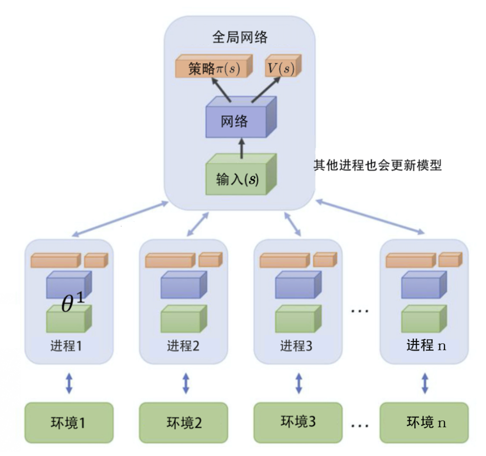
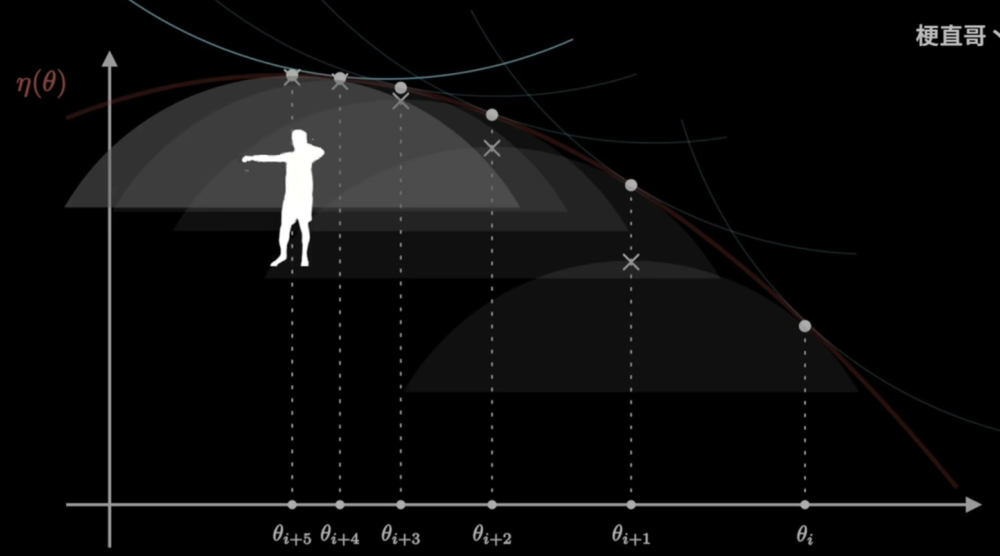
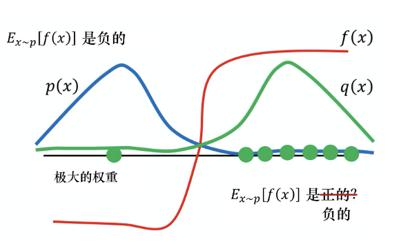
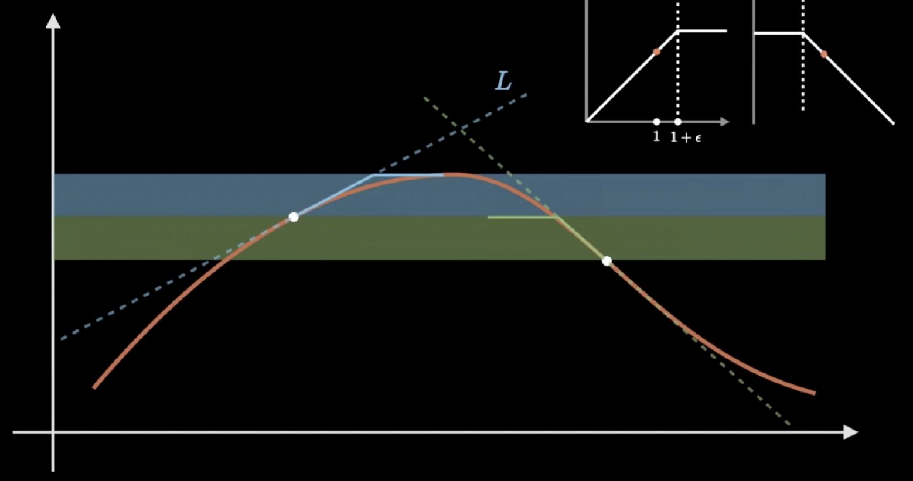
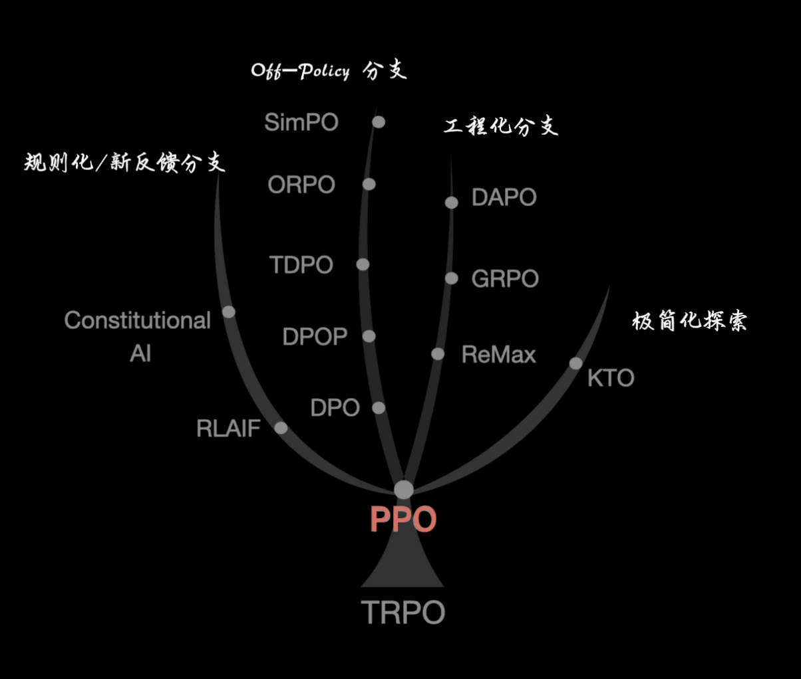

> 现在, 我们解决了最后的难题, value-based 2 policy-based, 让智能体真正地去学习有概率的策略, 关于这一点的必要性已经在个笔记开篇举例说明. 需要注意的是, Policy-based算法并非承接了笔记1-3的进化过程, 而是从另一个道路开始, 所以笔记4中介绍的算法作为开山鼻祖但是效果很差、局限很多. 所以我们要吸收value-based中的优势, 这就是今天的主题Actor-Critic框架. 

> 前面从表格型方法一路推进到策略梯度之后，这一篇开始把 critic 重新请回来。也正是从这里起，强化学习真正进入现代工程里最常见的 Actor-Critic 主线。

# 一. 把Q值请回来

REINFORCE算法实际上遇到了两个问题:
1. 方差太大. 因为是对每条轨迹的真实回报进行计算, 并不进行估算, 这是无偏性的必然结果. 在强化学习中, 偏差和方差是一个在权衡的过程.Reinforce没有偏差, 但是方差太大. 反观Q-learning和DQN都不是无偏的, 因为Q-learning是猜未来的Q值, 是不准确的; 而DQN本来就有偏差. 所以这两者方差都不会大.
2. 要等到一个episode之后才能更新. 这还要求任务是有限步的.

如果回忆之前的内容, 我们就可以想到当时是从采样的MC方法, 进化到了单步更新的TD方法(默认TD(0)), 来达成不走完一条完整的轨迹也能更新Q的目的.  所以, 在策略梯度算法中, 我们同样可以借鉴类似的思路, 将回报替换成Q值来更新. 这样一来, 我们就可以用前面提到过的TD的方法来更新Q, 而不用等到整个trajectory采样完成. 
$$
\nabla \overline{R}_{ \theta} \approx \frac{1}{N} \sum_{n=1}^{N} \sum_{t=1}^{T_{n}}Q^{n} \left( s_{t}^{n},a_{t}^{n} \right) \nabla \log \pi_{ \theta} \left( a_{t}^{n}|s_{t}^{n} \right) \tag{1.1}
$$
我们会发现, 这样策略梯度算法的公式中, 引入回来了Q的部分, 也就是说将value-based的部分又带了回来, 并利用其优势为policy-based提供价值. **这种将Policy-based和Value-based结合的算法, 我们就称之为Actor-Critic算法**. 其中, Critic网络负责得到Q值, 而Actor网络负责进行梯度策略的更新.

需要注意的是, **只要是将策略和价值相结合的方法, 我们就可以叫做是Actor- Critic算法**. 也就是说除了“三”下面的, **DDPG、PPO、TRPO、GRPO等也都属于AC框架**, 只不过由于有些过于出名, 故单独拿出来介绍.

# 二. 优势函数

## 1. 定义

笔记4中, 我们介绍策略梯度的实现技巧时, 将G减去了一个基线b. 作用已经在那里详细举例阐述, 并且那里的一个可能的b就是采样总奖励的均值. 我们在那里提了一嘴, 这 ( REINFORCE with baseline )就是优势函数的雏形. 广义的优势函数, 就是用于衡量“这个动作比平均好多少“的量. 但是由于时A2C中第一次明确使用了**优势函数 (Advantage Function)** 的说法, 并且其中使用的基线为V(s), 所以狭义上来说, 优势函数的数学定义为:
$$
A(s,a)=Q(s,a)-V(s) \tag{2.1.1}
$$
优势函数无疑是AC框架的核心. 但是其中的“优势”在不同算法中有不同的表示. 或者说, 不同算法实际上就是对这个优势函数进行了不同的定义/优化. 
## 2. Generalized Advantage Estimation (GAE)

上式中的Q和V都是老朋友了, 在之前的笔记中我们对如何估计他们做了详细的学习, 包括DP、MC、TD等. 早期算法如QAC、A2C、A3C都是通过简单的TD(0)或者n步回报来估计优势函数, 就如同之前的value-based一样. 

GAE是策略梯度算法中用于估计优势函数的一种高级技巧, 它提供了一种实用的估计方法来计算优势函数. 我们可以在这里将估计优势函数的方法进行对比总结.

| 估计方法      | 公式                                                             | 特点          |
| --------- | -------------------------------------------------------------- | ----------- |
| 蒙特卡洛 (MC) | $A_t = \sum_{k=0}^∞ γ^k r_{t+k} - V(s_t)$                      | 无偏估计, 但是高方差 |
| TD(0)     | $A_t = r_t + γV(s_{t+1}) - V(s_t)$                             | 低方差, 但是有偏估计 |
| TD(n)     | $A_t = \sum_{k=0}^{n-1} γ^k r_{t+k} + γ^n V(s_{t+n}) - V(s_t)$ | 折中方案        |
| GAE       | $A_t^{GAE} = \sum_{l=0}^∞ (γλ)^l δ_{t+l}$                      | **自适应均衡**   |
怎么得到GAE, 我们现在将经典TD算法的式子展开, 来表示t时刻往前看k个step的情况下, 对当前形式的估计:
$$
A^{k}(t)=r_{t}+\gamma r_{t+1}+\gamma^{2}r_{t+2}+\cdot\cdot\cdot+\gamma^{k-1}r_ {t+k-1}+\gamma^{k}V(s_{t+k})-V(s_{t}) \tag{2.2.1}
$$
凡事都有两面性, 对于$A^{k}(t)$ 来说, k越大意味着观测值越多, 估计值越少, 那么偏差越小, 方差越大; 反之, 观测值越少, 估计值越多, 偏差越大, 方差越小. 所以为了trade-off偏差和方差, GAE考虑对原始的$A^{k}(t)$ 进行修改, 与估计奖励时的思想类似, 我们在估计优势函数时, 也综合考虑不同step的估计值, 于是可以对不同的$A^{k}(t)$ 加权求和:
$$
\begin{split} A_{t}^{\textit{GAE}_{1}}&=A_{t}^{1}+ \lambda A_{t}^{2}+\lambda^{2}A_{t}^{3}+\cdot\cdot\cdot\\ &=\delta_{t}+\lambda(\delta_{t}+\gamma\delta_{t+1})+\lambda^{2}( \delta_{t}+\gamma\delta_{t+1}+\gamma^{2}\delta_{t+2})+\cdot\cdot\cdot\\ &=\delta_{t}(1+\lambda+\lambda^{2}+\cdot\cdot\cdot)+\gamma\delta _{t+1}(\lambda+\lambda^{2}+\cdot\cdot\cdot)+\gamma^{2}\delta_{t+2}(\lambda^{2 }+\cdot\cdot\cdot)+\cdot\cdot\cdot\end{split} \tag{2.2.2}
$$
我们将$\delta$ 称为TD残差. 其中$\delta_t$ 是TD(0)算法中的$A_t$ , 加入的参数$\lambda \in [0,1]$, 观察上式, 我们就发现可以通过调节$\lambda$ 的值来进行tradeoff, 当其为0时, 就变成了简单的TD(0), 而当其为1时, 就变成了蒙特卡洛采样. 表示先假设不能取1. 然后我们进一步推导, 根据等比数列求和公式:
$$
A_{t}^{GAE_{1}}=\delta_{t}(\frac{1-\lambda^{k}}{1-\lambda})+\gamma\delta_{t+1 }(\frac{\lambda(1-\lambda^{k - 1})}{1-\lambda})+\gamma^{2}\delta_{t+2}( \frac{\lambda^{2}(1-\lambda^{k - 2})}{1-\lambda})+\cdots \tag{2.2.3}
$$
由于$1-\lambda$ 是一个常数, 可以两边同乘, 而当k趋向于无穷, 上面的$\lambda^{k-n}$趋向于0. 再直接用新的A替换, 得到:
$$
A_{t}^{GAE}=\delta_{t}+\gamma\lambda\delta_{t+1}+\gamma^{2}\lambda^{2}\delta_ {t+2}+\cdot\cdot\cdot=\sum_{k=0}^{ \infty} \left( \gamma \lambda \right)^{k} \delta_{t+k} \tag{2.2.4}
$$
上式就是GAE算法的核心公式. (乍一看没有baseline, 其实TD残差$\delta$ 中就包含了baseline了). 

# 三. AC经典算法 

## 1. QAC (Q-based Actor-Critic)

Actor是演员, 负责选择动作, 是一个以$\theta$ 参数化的策略函数$\pi_\theta(a|s)$ ; Critic是评论家, 用来评价动作的好坏, 用评估结果知道actor改进策略. 如果Critic用Q值来计算误差, 那么就称为**基于Q值的Actor-Critic算法, QAC**. 如果是基于$V(s')$ 值来计算的话, 用$R+\gamma V$ 代替Q值, 成为**基于优势函数的Actor-Critic算法, 也叫Advantage-Actor-Critic算法, 也即A2C**.

### (1) 优化思想

QAC的优化是针对与REINFORCE而言的, 最大的好处就是引入了基线. Q值的求取, 我们采用学习笔记(二)中的时序差分学习TD算法. Critic是一个价值网络, 通过学习Q值, 逼近真实的$Q_\pi(s,a)$; Actor是策略更新. 

Critic的更新是Sarsa算法:
$$
Q(s_t,a_t) \leftarrow Q(s_t,a_t) + \alpha [r_{t+1} + \gamma Q(s_{t+1},a_{t+1}) - Q(s_t,a_t)] \tag{3.1.1}
$$

Actor的更新则是策略梯度, 其实就是用Q值来作为梯度策略的奖励R: 
$$
\theta \leftarrow \theta+\alpha \nabla_\theta log \pi_\theta(a|s) \cdot Q(s,a) \tag{3.1.2}
$$

### (2) 优势函数

基本QAC中, 实质上没有显式的优势函数, 它直接使用Q值作为了基线. 它实际上就是式子1.1, 朴素的将Q函数引入了进来而已.

### (3) 流程

QAC的流程如下: Actor观察当前状态, 按照当前策略随机执行一个动作, Agent从环境得到即时反馈, Actor按照当前的策略$\theta$ (一个策略网络) 随机一个动作, 但是只选不行动. 此时, Critic用当前价值网络计算当前状态动作对的估计价值$Q(s_t,a_t)$ 和下一个动作对的预估价值$Q(s_{t+1},a_{t+1})$ . 最后, 计算TD Target和TD Error. 然后用TD梯度下降更新参数.

## 2. Advantage Actor-Critic算法 (A2C)

### (1) 优化思想

A2C与QAC相比, 首次显式计算了优势函数. 使用状态价值函数V作为Critic.

Critic是V函数的更新:
$$
V(s_t) \leftarrow V(s_t) + \alpha (r_{t+1} + \gamma V(s_{t+1}) - V(s_t)) \tag{3.2.1}
$$
还记得吗, 这个式子是在笔记(二)引入TD的时候的式子, 实际上这里的TD Target就是Q的贝尔曼公式(可以回看笔记(一)). 

Actor的更新则是使用了优势函数作为R的策略梯度:
$$
\theta \leftarrow \theta+\alpha \nabla_\theta log \pi_\theta(a|s) \cdot A(s,a) \tag{3.2.2}
$$
### (2) 优势函数

利用前面的知识, 我们把Q值写为TD残差的形式, 从而得到:
$$
A(s,a)=r_{t+1} + \gamma V(s_{t+1})-V(s_t) \tag{3.2.3}
$$
A2C构造**优势函数**$A(s,a)=Q(s,a)-V(s)$, 状态s下选动作a, 比状态s的平均动作价值好多少. Critic的目标是让自己的预测最准确, 通过不断修正自己的估计, 来让$A(s,a)$ 最小化, 这意味着$V(s_t)$ 可以更精确表示从状态$s_t$ 出发的实际回报. 批评家的评价越准确, 演员的动作调整才越正确. (如果你详细研究了笔记1, 那里其实说明了最好的Q就等于V, 显然我们需要逼近最好的Q的策略, 让优势函数即亮着的差值最小).

说到这里, 显然这个优势函数可以看作是网络的Loss (实际上就是), 于是我们借鉴深度学习中的更新方法, 把这个Loss求一个平方损失误差, 来更新Critic网络. 我们把Critic网络的参数写做$\omega$ , 就有如下平方损失误差:
$$
L(\omega)=\frac{1}{2}\left(r_{t}+\gamma V_{\omega}\left(s_{t+1}\right)-V_{\omega}\left(s_{t}\right)\right)^{2} \tag{3.2.4}
$$
对损失函数求导有不带系数的简洁形式:
$$
\nabla_{\omega} L(\omega)=-\left(r_{t}+\gamma V_{\omega}\left(s_{t+1}\right)-V_{\omega}\left(s_{t}\right)\right) \nabla_{\omega} V_{\omega}\left(s_{t}\right) \tag{3.2.5}
$$
使用梯度下降来更新参数即可.

而且, 这个优势函数A值同时也会去用上述的3.2.2式子去更新策略$\theta$ 即Actor网络. 所以我们说, 在每个mini-batch中, 我们同时:

 1. 用优势函数A通过策略梯度更新Actor网络
 2. 用A相关的目标值通过MSE更新Critic网络

>这样, Actor和Critic就可以协同进化. Actor需要Critic评估动作好坏, 而Critic需要Actor策略来准确估计价值(别忘了, Q函数是隐含策略的). 我们回想Q-learning, 其实是除了将AC算法看成是Policy-based引入了Q值, 也可以看成是**Q-learning算法的贪心策略被替换成了Actor部分**, 一个新的动作选择策略, 并且是概率分布形式的. 这是分别从Value和Policy出发, 得到AC算法的视角, 殊途同归.

## 3. Asynchronous Methods for Deep Reinforcement Learning算法 (A3C)

如名称所示, 这是一种异步强化的学习算法, 这是一种非常有效的算法, 在围棋、星际争霸等复杂任务上都取得了很好的效果. 不过有一点要说的, A3C其实比A2C出现的要早, A2C可以看作A2C的同步简化版.

A3C的最大优点就是可以加快强化学习的速度, 它同时使用多个进程 (worker), 这些进程会把所有的经验集合在一起, 所以对硬件也是有需求的.

A3C一开始有一个全局网络 (global network). 全局网络包含策略网络和价值网络, 它们在前几个层会绑定(tie)在一起. 每个进程在工作前都把全局网络的参数复制过来, 接下来与环境交互计算梯度, 再梯度去更新全局网络的参数.

A3C采用了平行探索的方法, 所有演员都是平行跑的, 每个演员各做各的, 当然传回去的参数可能发生覆盖, 但是没关系, 由于每次工作时复制, 所以总会以最新的参数去交互.

虽然速度上有提升, 但是多个worker同时更新网络, 可能会导致训练不稳定, 重新性差. 与之相比, A2C不仅简洁, 而且某些任务上性能会更好, 更重要的是可重新训练方法, 在对稳定性要求极高的RLHF中, A2C的设计更好.

# 四. Trust Region Policy Optimization  (TRPO)算法

> 注: TRPO背后的数学原理比较复杂, 因此进行推导的过程繁琐, 引入的概念也很多, 请更注重了解其中的思想. TRPO也是PPO算法的基础, 但是PPO算法已经在效率上全面打败TRPO. 以下推导过程的公式完全可以略过, 仅做参考.

相比于深度学习, 我们面对的重大问题之一, 就是在面对复杂的未知函数形状的"山",  用梯度上升很难决定往哪走走多少, 也无法确保是凸函数. 而TRPO则设定了**置信域** 在旧策略的领域, 在这之中在优化策略. 相当于在目前未知"山"的形状, 每次画一个小圆圈, 在安全范围内大步走.

我们用**KL散度**来衡量新旧策略的远近, 并将其限制在阈值内. 并且, 从理论上证明了这是在单调改进.

策略$\pi$ 的期望回报:  
$$
\eta(\pi)=\mathbb{E}_{s_0,a_0,\ldots}\left[\sum_{t=0}^\infty\gamma^tr(s_t)\right]\tag{4.1}
$$
而2002年, Kakade & Langford等人得出了这样的结论: 新策略的期望回报 = 旧策略的期望回报 + 新策略在旧策略优势函数上的累计期望:
$$
\eta(\tilde{\pi})=\eta(\pi)+\mathbb{E}_{s_0,a_0,\cdots\sim\tilde{\pi}}\left[\sum_{t=0}^\infty\gamma^tA_\pi(s_t,a_t)\right] \tag{4.2}
$$
我们后面的推导, 将结合7.2式进行. 首先根据期望的线性可拆, 我可以将求和符号提出来: 
$$
\mathbb{E}_{s_{0},a_{0},\cdots\sim\tilde{\pi}}\left[\sum_{t=0}^{\infty}\gamma^{t}A_{\pi}(s_{t},a_{t})\right]=\sum_{t=0}^{\infty}\gamma^{t}\cdot\mathbb{E}_{s_{0},a_{0},\cdots\sim\tilde{\pi}}\left[A_{\pi}(s_{t},a_{t})\right] \tag{4.3}
$$
接下来, 我们引入**折扣访问频率** (**状态占据度量**) , 来表示状态s在策略$\pi$ 之后的长期权重, 经过t步之后处于状态s的折扣概率之和:
$$
\begin{aligned}&\rho_{\pi}(s)\\

& {=}P(s_{0}=s){+}\gamma P(s_{1}=s){+}\gamma^{2}P(s_{2}=s){+}\ldots \\

& =\sum_{t=0}^\infty\gamma^t\cdot\mathbb{P}_{s_0\sim d,\tilde{\pi}}\left[s_t=s\right] \end{aligned}\tag{4.4}
$$
接下来, 我们把$A_\pi(s_t,a_t)$ 视作随机变量, 指的就是在$s_t$ 这个状态下选择$a_t$ 动作的Q值, 比上选择a状态的平均Q值多出来的部分. 换言之, 就是跟AC算法中一样的**优势函数**. 它的期望可以进行分解:  

$$
\begin{aligned}&\mathbb{E}_{s_0, a_0, \cdots \sim \tilde{\pi}} \left[ A_{\pi}(s_t, a_t) \right] \\

&= \sum_s \sum_a A_{\pi}(s, a) \cdot \mathbb{P}_{s_0, a_0, \cdots \sim \tilde{\pi}} \left( s_t = s, a_t = a \right)\end{aligned} \tag{4.5}
$$
将4.5求和的P写为条件概率的形式:
$$
\mathbb{P}\left[s_{t}=s,\,a_{t}=a\right]=\mathbb{P}\left[s_{t}=s\right]\cdot\mathbb{P}\left[a_{t}=a\mid s_{t}=s\right]\tag{4.6}
$$
由于是马尔可夫链, 动作选择仅依赖于当前状态, 所以有:  
$$
\mathbb{P}[a_t=a \mid s_t=s]=\tilde{\pi}(a \mid s)\tag{4.7}
$$
4.7代回4.6, 再代回4.5得到优势函数的期望实际为: 
$$
\begin{aligned}

&\mathbb{E}_{s_{0},a_{0},\ldots\sim\tilde{\pi}}\left[A_{\pi}(s_{t},a_{t})\right]\\

&=\sum_{s}\sum_{a}A_{\pi}(s,a)\cdot\mathbb{P}_{s_{0},a_{0},\ldots\sim\tilde{\pi}}(s_{t}=s)\cdot\tilde{\pi}(a\mid s)\end{aligned}\tag{4.8}
$$
再代回4.2后半, 我们可得到新形式, 整理后发现出现了前面4.4引入的状态占据量: 

$$
\begin{aligned}&\mathbb{E}_{s_0,a_0,\cdots\sim\tilde{\pi}}\begin{bmatrix}&\gamma^tA_\pi(s_t,a_t)\end{bmatrix}\\

&=\gamma^t\cdot(\sum_s\sum_aA_\pi(s,a)\cdot\mathbb{P}(s_t=s)\cdot\tilde{\pi}(a\mid s))\\

&=\sum_{s}\sum_{a}\left(\sum_{t=0}^{\infty}\gamma^{t}\cdot\mathbb{P}(s_{t}=s)\right)\cdot\widetilde{\pi}(a\mid s)\cdot A_{\pi}(s,a)\\

&=\sum_s\rho_{\tilde{\pi}}(s)\sum_a\tilde{\pi}(a|s)A_\pi(s,a)\end{aligned}

\tag{4.9}
$$
将4.9代入4.2: 
$$
\eta(\tilde{\pi})=\eta(\pi)+\sum_s\rho_{\tilde{\pi}}(s)\sum_a\tilde{\pi}(a|s)A_\pi(s,a)\tag{4.10}
$$
这时我们发现, 要想求出这个值, 是需要新策略$\tilde{\pi}$ 的状态分布情况. 而这个值目前是得不到的. 所以我们引入**代理函数**, 用原策略来近似:
$$
L_\pi(\tilde{\pi})=\eta(\pi)+\sum_s\rho_\pi(s)\sum_a\tilde{\pi}(a|s)A_\pi(s,a)\tag{4.11}
$$
我们发现, 在旧策略$\pi$ 处,$L_\pi$ 和$\eta$ 的梯度相同, 所以在旧策略附近优化$L_\pi$ 就近似于优化$\eta$ .

接下来, 我们还要引入**KL散度**来衡量两个概率分布的远近, 用来表示用q来近似p的时候的信息损失: 
$$
D_{KL}(P||Q)=E_p\left[\log\frac{P(x)}{Q(x)}\right]=\Sigma_ip_i\log\frac{p_i}{q_i}\tag{4.12}
$$

另外还有一种**总变差散度(TV散度)** 也可以衡量:
$$
D_{\mathrm{TV}}(P||Q) = \frac{1}{2} \Sigma_i |p_i - q_i|\tag{4.13}
$$
而 **Pinsker不等式** 就把两个散度联系到了一起: 
$$
\|Q-P\|_{\text{TV}} \leq \sqrt{\frac{1}{2}D_{\text{KL}}(Q\|P)} \tag{4.14}
$$
简化形式: 
$$
D_{TV}(p||q)^2\leq D_{KL}(p||q)\tag{4.15}
$$
TPRO论文, 证明了$L_\pi$ 和$\eta$ 的误差下界: 
$$
\eta(\pi_{new})\geq L_{\pi_{old}}(\pi_{new})-\frac{4\epsilon\gamma}{(1-\gamma)^2}\alpha^2 \tag{4.16}
$$
其中$\alpha$ 是新旧两个策略在所有状态下的最大TV散度, 且$\epsilon=\max_{s.a}|A_{\pi}(s,a)|$ , 我们把$\frac{4\epsilon\gamma}{(1-\gamma)^2}$ 当作常数C处理, 结合4.14不等式, 就可以导出: 
$$
\eta(\tilde{\pi})\geq L_\pi(\tilde{\pi})-C\cdot D_{KL}^{\max}(\pi,\tilde{\pi})\tag{4.17}
$$
这是一个很好的式子, 观察式子, 不等式右边可以成为新策略的性能下界, 即:
$$
M(\pi)=L_\pi(\tilde{\pi})-C\cdot D_{KL}^{\max}(\pi,\tilde{\pi})\tag{4.18}
$$
换言之, 只要提升/最大化$M(\pi)$ , 就能保证$\eta$ 的性能单调上升. 这演变为了重要的**MM** 算法, 这是一种迭代的方法, 它利用函数的凸性来寻找它们的最大值或最小值. 本问题是目标函数最大化问题, 所以MM的具体表现为 **Minorize-Maximization** 算法: 每次迭代找到原非凸目标函数的一个下界函数 , 求下界函数的最大值.
$$
\underset{\theta}{\operatorname*{\mathrm{maximize}}}\left[L_{\theta_{old}}(\theta)-C\cdot D_{KL}^{\max}(\theta_{old},\theta)\right]\tag{4.19}
$$
继续观察4.18, C因为分母带有1-折扣因子的平方, 当折扣因子取的很大时, 就会让C很大. 这就可以看出来, C其实是一个惩罚项的权重, 换而言之: 新旧策略的分布离得远和折扣因子偏大都会惩罚. 

但是这里有个问题, $\gamma$ 如果取大一点,  C就会变得超级大, 给策略距离超级加倍, 导致不敢更新策略了. 

为了解决这个问题, 我们引入**置信域**, 我们把7.19中的这个惩罚项改成置信域, 变成带约束条件的最大化问题, 4.19变成了: 

$$
\begin{aligned} &\underset{\theta}{maximize}\qquad L_{\theta_{old}}\\

& subject\quad to \qquad \overline {D}_{KL}^{\rho _{\theta _{old}}}( \theta _{old}, \theta ) \leq \delta\end{aligned}\tag{4.20}
$$

其中:
$$
L_{\theta_{\mathrm{old}}}(\theta) = \mathbb{E}_{s \sim \rho_{\theta_{\mathrm{old}}}, a \sim \pi_{\theta}} \left[ A_{\pi_{\theta_{\mathrm{old}}}}(s, a) \right] \tag{4.21}
$$

我们来看一下$\overline {D}_{KL}^{\rho _{\theta _{old}}}( \theta _{old}, \theta )$ 这个式子, 这其实是把最大KL散度变成了平均KL散度. 这是因为, 如果是最大KL散度的话, 我们就要要求所有状态的KL散度都小于某个值, 这是难以实现的. 而平均KL散度只约束旧策略访问到的平均KL散度: 
$$
\overline{D}_{\mathrm{KL}}^\rho(\theta_1,\theta_2):=\mathbb{E}_{s\sim\rho}\left[D_{\mathrm{KL}}(\pi_{\theta_1}(\cdot|s)\parallel\pi_{\theta_2}(\cdot|s))\right] \tag{4.22}
$$
这里又要引入强化学习的一个重要概念: **重要性采样**. 我们要计算$E_{X\sim q}[f(X)]$, 但是从q上采样, 可能并非是最优的. 我们要改成p上采样的话, 可以推到出如下式子: 
$$
\begin{aligned}\mathbb{E}_{X\sim q}[f(X)]&=\int f(x)q(x)dx\\&=\int f(x)\cdot\frac{q(x)}{p(x)}\cdot p(x)dx\\&=\mathbb{E}_{X\sim p}\left[f(X)\cdot\frac{q(x)}{p(x)}\right]\end{aligned}\tag{4.23}
$$

其中$\frac{q(x)}{p(x)}$ 被称为**重要性权重**, 代表的是从$p(x)$ 采样的样本修正到$q(x)$ 分布下的期望估计.

观察7.21, 我们引入的原因是, 虽然我们已经通过代理函数, 让状态从旧策略进行采样, 但是a依然是在新策略$\pi_{\theta}$ 下进行采样, 但是我们只能从旧策略中采样动作. 因此用重要性采样思想:
$$
\mathbb{E}_{a\sim\pi_{\theta}}[f(a)]=\mathbb{E}_{a\sim\pi_{\theta_{\text{old}}}}\left[f(a)\cdot\frac{\pi_{\theta}(a|s)}{\pi_{\theta_{\text{old}}}(a|s)}\right]\tag{4.24}
$$
即:
$$
L_{\theta_{\mathrm{old}}}(\theta) = \mathbb{E}_{s \sim \rho_{\theta_{\mathrm{old}}}, a \sim \pi_{\theta_{\mathrm{old}}}} \left[\frac{\pi_{\theta}(a|s)}{\pi_{\theta_{\mathrm{old}}}(a|s)} \cdot A_{\pi_{\theta_{\mathrm{old}}}}(s, a)\right]\tag{4.25}
$$
最后, TRPO还在$\theta = \theta_{old}$ 附近都做了近似:  $L_{\theta_{\mathrm{old}}}(\theta)$ 在$\theta = \theta_{old}$ 做一阶泰勒展开; 约束条件(平均KL散度)做二阶泰勒展开: 
$$
L_{\theta_{old}}(\theta) \approx L_{\theta_{old}}(\theta_{old}) + \nabla_{\theta}L_{\theta_{old}}(\theta_{old}) \cdot (\theta - \theta_{old})\tag{4.26}
$$
$$
\overline{D}_{KL}^{\rho_{\theta_{old}}}(\theta_{old},\theta)\approx\frac12\Delta\theta^TA\Delta\theta \tag{4.27}
$$
其中$\Delta\theta$ 是参数的更新量, A为平均KL散度在$\theta_{old}$ 处的**Hessian矩阵** (海森矩阵是多元二阶偏导数构成的对称矩阵), 即:
$$
A=\frac{\partial}{\partial\theta_{i}}\frac{\partial}{\partial\theta_{j}}\mathbb{E}_{s\sim\rho_{\pi}}\left[D_{\mathrm{KL}}\left(\pi(\cdot|s,\theta_{\mathrm{old}})\parallel\pi(\cdot|s,\theta)\right)\right]\bigg|_{\theta=\theta_{\mathrm{old}}}\tag{4.28}
$$
最终, 问题转化成了:
$$
\begin{aligned}&\max~g^T(\theta-\theta_{old})\\

& s.t.\frac12(\theta-\theta_{old})^TH(\theta-\theta_{old})\leq\delta \end{aligned} \tag{4.29}
$$
其中, g就是$\nabla_{\theta}L_{\theta_{old}}(\theta_{old})$ , H就是7.28的海森矩阵.

后面实际上就是一个拉格朗日函数函数求极值的问题,用到的Krylov子空间迭代求解和Fletcher - Reeves共轭梯度的算法.

推导到这里我们悬崖勒马, 其一是因为信任域的思想已经体现了出来, 后面就是纯数学推导和细节优化了, 其二是因为TRPO催生出的PPO算法, 已经全面优于TRPO, 执着于其完整推导没有意义. 等到有契机的话, 再回来对照代码好好推...

我们将TRPO的思想直观展现出来如下图, 人在上山的过程中, 先四周探路得到值得信任的下限, 按照下限上升方向直接冲过去就一定是优化.

# 六. Proximal Policy Optimization (PPO)算法

> TRPO的复杂性催生了PPO算法, 它通过三种方式进行优化: 裁剪目标函数, 自适应惩罚和一阶优化. 既保持了TRPO的稳定性, 又大幅简化了实现和提高了运算效率. 已成为最主流的策略优化算法之一. 这个要认真看,特别是PPO-Clip, 公式看起来复杂实则简单.

PPO算法通过与环境交互采样数据/利用随机梯度上升优化一个代理目标函数交替进行. 与标准策略梯度方法每次仅对一个数据样本执行一次梯度更新不同, PPO算法提出了新颖的目标函数, 支持进行多轮小批量更新. 这种算法被称为**近端策略优化 (Proximal Policy Optimization, PPO)**. 

首先, 过去的算法存在或多或少的问题, 论文中列举如下:
1. 带有函数近似的Q-learning在许多简单问题上都会失败, 且其原理尚不明确. 
2. 传统的梯度策略方法存在数据效率低和稳健型差的问题.
3. TRPO相对复杂, 且无法与包含噪声(如Dropout) 或参数共享 (在策略和价值函数之间, 或在辅助任务之间)

其中2和3都比较容易理解, 但是1我们要进行进一步说明. 虽然表格形Q-learning有坚实的理论保证, 我们在前进行了详细的推理和证明其可以收敛到最优Q函数, 但是变成DQN后, 这些理论基础实际上就失灵了. 非线性函数近似器 (如神经网络) 的表达能力极强, 但是它的优化landscape非常复杂, 是非凸的, 无法保证梯度下降能找到最优解, 甚至不能保证它能稳定在一个局部最优解. 

再进一步来说, DQN包含了三个不稳定因素, 函数近似+自举+离策略学习. 函数近似就是前面说的, 这种近似器是泛化的, 当针对某一个Q更新网络的参数会意外改变多对Q值, 产生牵连效应. 而自举的性质更是给这个近似误差加上了放大镜, 因为它通过自己更新自己, 会造成误差传播的恶性循环. 最后, 离策略学习指的是其异策略的考量, 通过“不相关”的数据来拟合目前的目标, 导致的更新不稳定.

> AC框架的Critic网络虽然避免了离策略学习, 避免了max操作的不稳定性, 但是自举和近似的挑战还在进行中. AC框架没有消除Critic训练的根本问题, 但通过它的系统架构设计, 将这些问题影响降到了可管理的水平.

所以说,在开发一种可拓展 (适用于大型模型和并行实现)、数据高效且稳健 (即无需调整超参数即可解决多种问题) 的方法方面, 仍有许多改进空间. 

PPO算法在仅使用一阶优化的同时, 实现了与TRPO相当的数据效率和可靠性能. 新设计的目标函数在使用了截断的概率比, 从而对策略性能形成了一个悲观估计 (下界) . 为了优化策略, 我们从策略中采样数据与对所采样数据进行若干轮优化之间交替进行.

## 1. 重要性采样 (importance sampling)

假设我们不能从p中采集数据, 但是又想得到p的期望怎么办? 其中一个很自然的想法, 就是用到另一种q分布中采样. 注意, 我们的目的是通过采样来估计期望, 所以只要保证替换完之后的期望不变就可以:
$$
\mathbb{E}_{x\sim p}[f(x)]=\int f(x)p(x)\mathrm{d}x=\int f(x)\frac{p(x)}{q(x)}q(x)\mathrm{d}x=\mathbb{E}_{x\sim q}[f(x)\frac{p(x)}{q(x)}] \tag{6.1.1}
$$
也就是说, 我们每次从q中采集数据, 都要乘以一个**重要性权重(importance weight)** 来修正两个分布的差距. 这种策略就叫做重要性采样.

需要注意的是, 虽然我们保证了E一致, 但是没有保持方差一致. 所以为了让两者更靠近, 必须要采集更多的数据, 我们考察下面一种情况:

我们无法保证采集都在一个区间, 为了尽可能缩小这样的情况, 我们必须要尽量更多的采样, 或者用某些手段来限制两个函数的差距. 这个后面会进行说明.

至于为什么要引入重要性采样. 一言以蔽之, PPO算法通过重要性采样来用旧策略更新新策略, 主要就是为了增加样本的效率和稳定性. :

1. 样本效率: 在强化学习中, 与环境交互收集数据通常是非常耗时的, 如果每次更新策略后都要重新收集数据, 那么样本效率会很低. 重要性采样允许用旧策略收集的数据来估计新策略的梯度, 从而多次使用同一批数据.
2. 稳定性: 通过旧策略的数据, 并约束新旧策略的差异, 可以避免策略更新步幅过大, 从而稳定训练.

## 2. PPO算法

PPO算法的核心是通过重要性采样, 将同策略变成异策略. 我们不需要策略$\theta$ 直接与环境交互, 而是使用旧策略$\pi_\theta'$ ,它的工作是做示范 (demonstration):
$$
\nabla\bar{R}_\theta=\mathbb{E}_{\tau\sim p_{\theta^{\prime}(\tau)}}\left[\frac{p_\theta(\tau)}{p_{\theta^{\prime}}(\tau)}R(\tau)\nabla\log p_\theta(\tau)\right] \tag{6.2.1}
$$

>这里我插一嘴, 前面的章节中经常都把‘ 作为“下一步”, 但是这里的行为策略$\theta'$, 其实表示的“之前的”, 或者可以写作$\theta_{old}$ , 而$p$和$\pi$ 亦有混杂使用, 虽然都表示决策的概率. 可能我学习的主要资料之一蘑菇书EasyRL不同章节书写人员不同, 没有对符号进行统一, 这样要读懂全部公式很困扰... 所以我会在容易造成歧义的公式下面下上解释.

> 还有一点, EazyRL中将策略$\theta'$ 看成是另一个Actor, 这是很容易引起误解的说法, 其实更准确的说法是一个Actor在不同时间的快照, **PPO是同策略的**. 当然作者后面解释了通过KL、Clip约束, 其实这两个策略相近, 但是一开始就不用另一个Actor这种误导性比喻就行啦...

这样限制有显著的好处, 现在与环境交互的是$\theta'$  而不是$\theta$, 所以采样的数据与$\theta$ 本身是没有关系的. 因此我们就可以让 $\theta'$ 与环境交互采样大量的数据, $\theta$  可以多次更新参数, 一直到 $\theta$  训练到一定的程度. 更新多次以后, $\theta'$ 再重新做采样.

我们可以将实际做策略梯度的时候, 并不是给整个轨迹$\tau$ 一样的分数, 而是将每一个状态-动作对分开计算, 实际更新梯度的过程可以写作下式:
$$
\mathbb{E}_{\left(\textit{s}_{t},\textit{a}_{t}\right)\sim\pi_{ \theta}}\left[A^{\theta}\left(\textit{s}_{t},\textit{a}_{t}\right)\nabla\log p _{\theta}\left(a_{t}^{n}|\textit{s}_{t}^{n}\right)\right] \tag{6.2.2}
$$
其中, 这个状态-动作对的优势$A^{\theta}\left(\textit{s}_{t},\textit{a}_{t}\right)$ 是一个用累积奖励减去基线 (baseline)的量.

但是, 如上述理由如1中所说, 我们就需要一个量来限制两个人的差距. 为了得到两个分布的距离, 我们自然而然就想到通过一个量来限制.

需要注意的是, 虽然进行了重要性采样, 但是约束由于约束, 行为策略$\theta'$ 和目标策略$\theta$ 非常接近, 所以两者可以看成是同一个策略, 因此**PPO是同策略算法**. 

至于怎么来限制, 具体而言有两种重要变种:

### (1) 近端策略优化惩罚 (PPO-penalty)

$$
J_{{\mathrm{PPO}}}^{{\theta^{k}}}(\theta)=J^{{\theta^{k}}}(\theta)-\beta{\mathrm{KL}}\left(\theta,\theta^{k}\right) \tag{6.2.3}
$$

TRPO把KL散度当作约束, 希望两者差距小于$\delta$, 而PPO直接把约束放在了要优化的式子里, 实现了自适应惩罚.

### (2) 近端策略优化裁剪 (PPO-clip)

$$
J_{\text{PPO2}}^{\theta^{k}}(\theta) \approx \sum_{(s_{t},a_{t})} \min \left(\frac{p_{\theta}\left(a_{t}|s_{t}\right)}{p_{\theta^{k}}\left(a_{t}|s_{t}\right)}A^{\theta^{k}}\left(s_{t},a_{t}\right),\right. \left.\text{clip}\left(\frac{p_{\theta}\left(a_{t}|s_{t}\right)}{p_{\theta^{k}}\left(a_{t}|s_{t}\right)},1-\varepsilon,1+\varepsilon\right)A^{\theta^{k}}\left(s_{t},a_{t}\right)\right) \tag{6.2.4}
$$

PPO算法的裁剪起到和信赖域相似的作用, 阻止了步子迈的太大, 但是不需要重新计算, 只做裁剪, 大大优化了性能. 本质上是设计了一个“动态信任域”, 因为对**领**域进行约束, 被称为**近端**策略优化.

直接看上面的式子, 我估计肯定是懵逼, 有一种自己学了这么久基础结果还是被一下子干碎的荒谬感. 别急, 我们来拆解一下. 首先, 我们想优化的期望是:
$$
J(\theta)=\mathbb{E}_{a \sim \pi_\theta}\left[A(s,a)\right] \tag{6.2.5}
$$
这也是AC框架下的期望统一表达, 然后, 我们回忆策略梯度的期望形式, 将其中的奖励函数R变成现在的AC框架中的优势函数A, 即:
$$
\nabla_{\theta}J(\theta)=\mathbb{E}_{a \sim \pi_{\theta}}\left[  \nabla_\theta log\pi_\theta(a|s)A(s,a) \right] \tag{6.2.6}
$$
但是, **PPO没有直接采用这个梯度估计, 而是重新构建了一个目标函数**. 所以我们从6.2.5出发, 不是进行求导, 而是通过另外的方式推演, 首先我们将前面的重要性采样引入, 式子变为:
$$
J(\theta)=\mathbb{E}_{a \sim \pi_{\theta_{old}}}\left[ \frac{\pi_\theta(a|s)}{\pi_{\theta_{old}}(a|s)} A(s,a) \right] \tag{6.2.7}
$$

为了简化书写, 我们可以把$\frac{\pi_\theta(a|s)}{\pi_{\theta_{old}}(a|s)}$ 写做**概率比$r_t(\theta)$,** 把整个$A(s,a)$ 记为**优势策略估计$\hat{A}$**. 然后, 在时间步t内的损失, 就可以写成很简洁的形式:
$$
J(\theta)=\hat{\mathbb{E}}[(r_t(\theta)\hat{A})]\tag{6.2.8}
$$
然后, 我们希望限制更新的步子, 即在第t个时间步内, 最多只能在一定范围内更新. 这次我们使用一种简单粗暴的方法 -- 如果更新太多了, 就进行截断, 如下图所示:

为了实现这个目的, 我们可以引入截断函数clip, clip函数后面的两个量, 表示把函数值限制在这个范围内. 于是, 我们可以将式子进一步写成: 
$$
J(\theta)=\hat{\mathbb{E}}[min(r_t(\theta)\hat{A},clip(r_t(\theta),1-\epsilon,1+\epsilon)\hat{A})]\tag{6.2.9}
$$
>在梯度形式的式子6.2.7中, 按理说除去表示方向的得分函数, 优势函数和概率比的乘积应该是更新的幅度, 可是为什么是只对前面的概率比进行截断? 这是因为, 直接截断得分函数之外的部分, 实际上破坏了相对比较信息, 比如“很好”和“一般好”的动作可能被截断成一样的值, 这不是我们希望看到的. 我们只是希望更新的幅度被限制. 所以, 我们留下的得分函数表示方向, 留下优势函数表示优势比较. 

上述是期望形式, 写成采样形式就是一开始给出的:
$$
J^{\theta_{old}}(\theta) \approx \sum_{(s_{t},a_{t})} \min \left(\frac{p_{\theta}\left(a_{t}|s_{t}\right)}{p_{\theta_{old}}\left(a_{t}|s_{t}\right)}A^{\theta_{old}}\left(s_{t},a_{t}\right),\right. \left.\text{clip}\left(\frac{p_{\theta}\left(a_{t}|s_{t}\right)}{p_{\theta_{old}}\left(a_{t}|s_{t}\right)},1-\varepsilon,1+\varepsilon\right)A^{\theta_{old}}\left(s_{t},a_{t}\right)\right) \tag{6.2.10}
$$

PPO-Clip既工程友好又理论单调改进, 该算法曾一度称为OpenAI的核心算法, 并迅速推广到Gym等框架示例中, 成为了很多人入门RL的选择. 这种工程化的约束思想, 启发了很多研究者, 继续沿着这条 “稳定优化+可控偏移” 的道路提出了很多变体. 它们**将强化学习中RL最优解思想, 转化为大模型与人类对齐的优化框架**, 开启了整个LLM对齐家族的演化历程. 

