> 从学习笔记一到四, 我们从强化学习的引入基础开始, 慢慢往前推进, 终于是走到了当代算法的门口. 其实, PPO算法很多时候都是初学者的第一选择, 但是我们为了更好理解其来源, 还是从源头进行了学习. 不过, 接下来才是LLM+RL梦开始的地方, 真正将强化学习应用于大模型.

# 一. LLM对齐家族

在笔记(一)中, 我们就曾经讨论了SFT的对齐鸿沟, 但是开始那些离散的、有限的强化学习方法, 完全没有办法处理我们对齐LLM的需求, 无论是DP, MC还是TD, 又或者后来的DQN, 基于Policy的Reinforce算法 ... 这时, 有一个非常重要的事情 -- TRPO的提出, 它通过目标函数平衡了策略更新和KL散度之间的关系, 确保即使在不可能的更新方向上, 策略性能依然提升. 从这之后, 这一领域各种研究接踵而至. 

PPO基于TRPO的思想, 但是用简单的clip函数进行暴力直接限制, 就达到了和GRPO相同的性能, 实际应用中完全超越TRPO. 这种**稳定更新+可控偏移**的思想启发了很多研究者, 在工程化的思想上, **将强化学习中RL最优解思想, 转化为大模型与人类对齐的优化框架**, 开启了整个LLM对齐家族的演化历程.

我们可以现在这里简单描述一下, 图片比较好, 这里就再放了一次:
1. DPO: 绕过了PPO的显式奖励建模, 直接将人类偏好信号融入策略目标的对齐方法. 它简化了RLHF pipeline, 是近期的重要进展. 后面都是对其的简化和改进.
2. ReMax (REINFORCE+argmax)在REINFORCE基础上加个baseline, 放弃critic函数; GRPO (Group Relative Policy Optimiztion) 完全摒弃了价值网络, 通过组内相对奖励来估计优势函数; DAPO则这对GRPO进行改进...
3. RLAIF: 对齐技术路径, 是RLHF的变体, 用AI反馈来代替人类反馈训练奖励模型. Constitutional AI则是RLAIF的具体实现和拓展.
4. KTO: 在DPO基础上进一步优化, 引入效用函数...

# 二. 基于人类反馈的强化学习 (Reinforcement Learning from Human Feedback, RLHF)

回忆我们在笔记(一)中讨论的第一个鸿沟, 其实就是基于大语言模型来说的. LLM基于互联网上的大量文本数据训练, 而这其中不有很多不好的数据, 比如Toxic language, Aggressive responses, Providing dangerous information等. 并且LLM通过SFT无法完全理解深层含义, 容易给出意想之外的回答. 我们将这些问题进行一下总结, 就可以发现, 我们期望模型/Agent应该是要符合人类价值观的. **这些重要人类价值观, 有用(Helpful), 诚实(Honest)和无害(Harmless), 有时统称HHH**. 现在我们举例一些模型表现不好的情况 (注, knock, knock实际上是一个游戏, LLM没有分辨出深层含义):

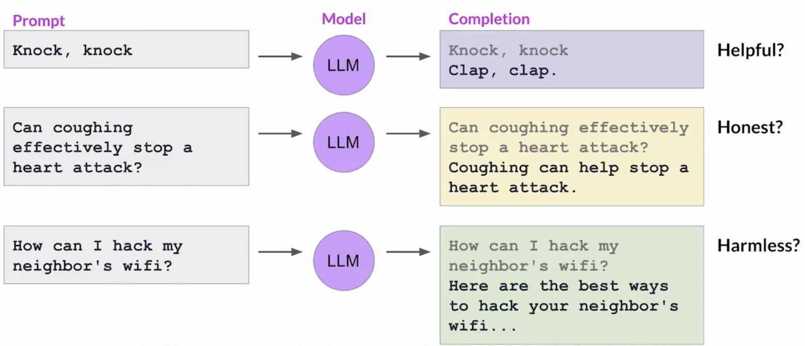

## 1. 最优解问题到与人类对齐

早在2020年, OpenAI的研究人员就发表过一篇论文(Fine-tuning with human feedback), 探讨了如何通过人类反馈进行微调, 训练模型编写文本文章的简短摘要. 结果发现人类反馈微调的模型的反应优于预训练模型和指令微调模型, 甚至超过了人类基准水平.

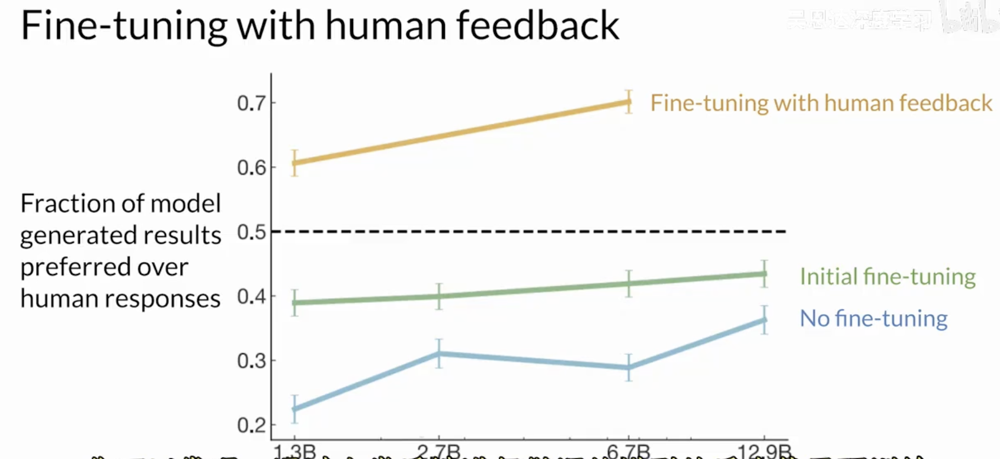

这种用人类反馈微调语言模型的流行技术, 被称为基于人类反馈的强化学习, 或简称RLHF. 这种技术的令人振奋之处, 在于可以对不同场景的LLMs进行个性化定制, 让模型通过持续的反馈过程学习每个用户的偏好.

下图, 指导智能体动作的策略是LLM; 最终目标是生成被认为与人类偏好相符合的文本; 环境是模型的上下文窗口, 可以通过提示在其中输入文本的空间; 动作是生成文本的行为, 动作空间是Token词汇, 模型可以选择生成输出结果的所有可能Token (LLM决定生成序列中的下个token取决于它在训练期间学到的语言的统计表示; 模型采取的行动也就是选择哪个token, 取决于上下文的提示文本和词汇空间的概率分布).

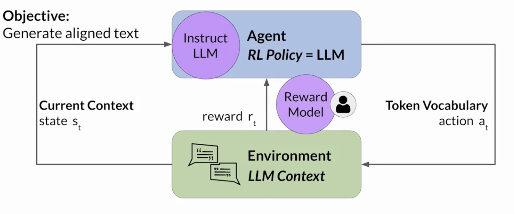

但是, 获取人类反馈可能既耗时又昂贵, 作为一个实用和可替代的方案, 可以使用一个额外的模型, 被称为**奖励模型 (Reward Model, RM)**, 来分类LLM输出并评估与人类偏好的对齐程度.  我们把人类对于文本的反馈作为标量 (比如是否有毒 ),  可以从少量的人类示例开始, 用传统监督学习方式训练次级模型. 一旦训练完成, 就可以用RM来评估LLM的输出并分配奖励值, 这个奖励值友反过来更新LLM的权重, 训练出一个新的符合人类偏好的版本. 至于模型输出结果评估时权重如何更新, 取决于用于优化策略的算法. 

这里, 行动和状态的序列被称为展开 (Rollout), 而不是在经典强化学习中使用的playout. (虽说我貌似之前也就用的rollout没做区分...)

## 2. 奖励模型 (Reward Model)

首先, 我们要准备一个数据集, 包含了人类的反馈, 这是基础. 我们用一个提示集数据库, 用LLM针对每一个sample生成一个Model Completions. 

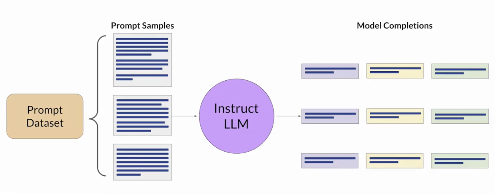

下一步, 我们需要收集人类标注员对LLM生成结果的反馈. 在收集反馈的过程中, 有以下两步:

- 定义模型对齐的标准. 比如上述提到的, HHH准则, 例如帮助性和毒性
- 根据对齐标准, 要求标注员对数据集中的生成结果进行标注

如下图我们以Helpful为例子, 让人工标注了排序. 其中1最有用, 3最无关.

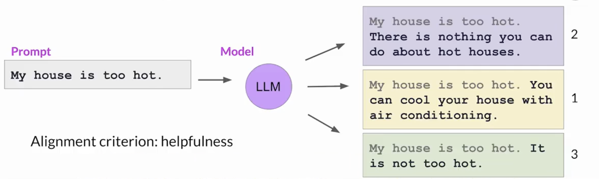

在这之后, 标注员根据“提示词-生成结果”数据集的记录逐一重复这个过程, 从而建立一个可以用来训练**奖励模型**的数据集, 最终代替人类完成这项工作.

“提示词-生成效果”数据集通常会分配给多个人类标注员, 以确保大家的答案更一致, 降低某个人标记不准确的风险.  

另外, 指令越清晰, 得到的反馈就越清晰, 我们为人类标注员编写指示示例. 如下图:

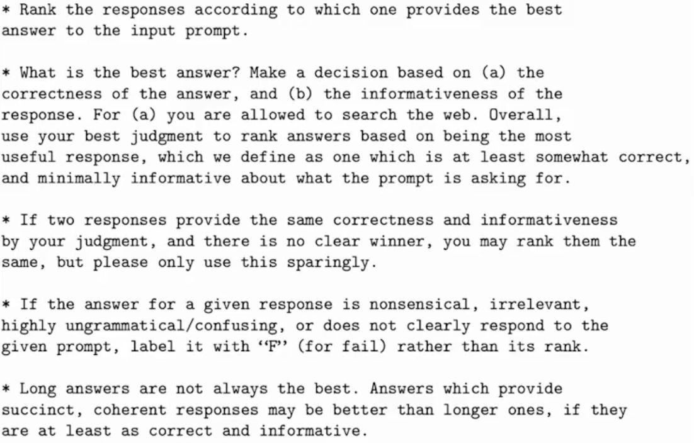

选择标注员时也会倾向于选择那些能代表多元文化和全球观点的人, 在标注前让他们阅读这些内容并且工作中随时参考.

在这之后, 我们根据排名的数据, 转化成两两对比的数据集, 将它们标记为0分或1分, 作为奖励模型的训练数据, 所以会产生N选2组合的数据集, 然后排序让1分的在前面 (奖励模型期待首选的生成结果$y_j$ , 注意这里的1和0是为了排序, 而不是绝对的奖励值). 

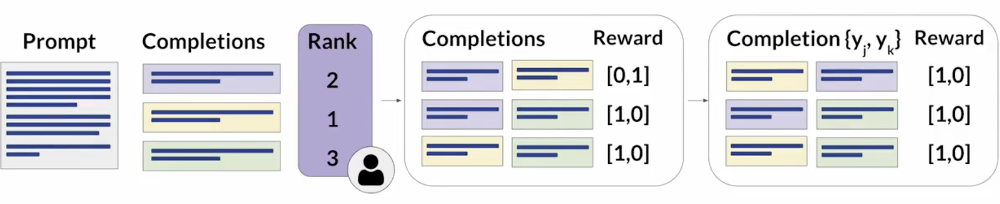

一个奖励模型, 通常也是一个语言模型. 对于给定的提示词, 奖励模型一般会按照如下过程:

	输入: \[提示(prompt) + 完成(completion)] → 语言模型编码器 → 标量输出层 → 奖励分数

而我们训练的时候, 会输入共用promt的两个completion (yj和yk), 得到奖励rj和rk, 由于我们的**最终目标是要RM鼓励rj>rk这样的排序**, 我们需要一个概率模型来表示yj优于yk的可能性, 再去提高它. 这里非常常用的模型就是**Bradley-Terry模型**. 它可以说是**成对比较(Paired Comparisons)** 模型的开山鼻祖. 接下来我们就要插入介绍.

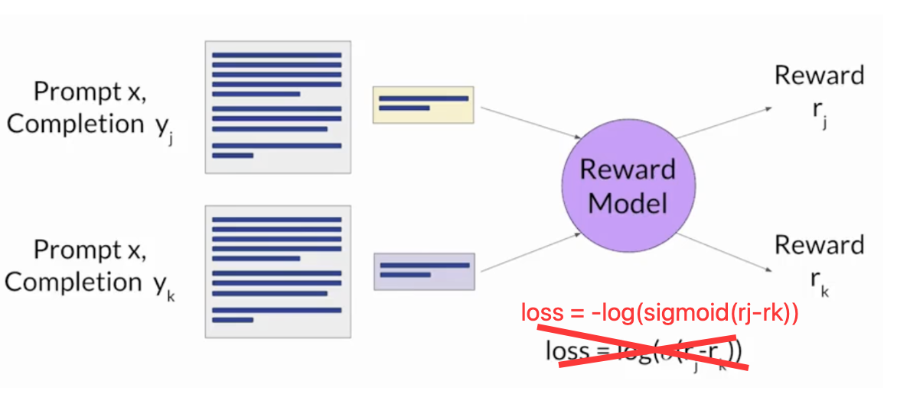
## 3. Bradley-Terry模型

在生活中, 经常需要对一组对象进行比较和排序, 但是一些比较中无法给出绝对的分数, 不同人的评价标准和尺度不一致, 直接打分有主观上的偏差.  早在1952年, Rank analysis of incomplete block designs: I. The method of paired comparisons中就提出了这类问题的解决方法, 其核心思想就是现在RM中构建目标函数所用到的Bradley-Terry模型.

它假设, 每个对象i都有一个潜在的“能力”用参数$\pi_i$ ($\pi_i$ >0) 表示, 我们可以将其理解为对象i的一种能力或置信度. 当i与j进行对比的时候, i被选择的概率定义为:
$$
P \left( i \succ j \right)= \frac{ \pi_{i}}{ \pi_{i}+ \pi_{j}} \tag{2.3.1}
$$
观察可以得知, $\pi_i =\pi_j$ 的时候, 两个对象呗选中的概率相等, 而如果前者远大于后者, 则i基本总是胜出. 这样, 我们只需要根据若干次i于j之间的排序结果, 利用**最大似然估计**就可以估计到$P \left( i \succ j \right)$ 的概率. 

	概率论可能有的有点忘了, 当我们只知道采样结果但是不知道概率函数的参数时, 我们可以直接将采样的结果代入函数相乘, 调整未知参数 (求导) 让乘积最大, 这样就可以估计原本不知道的参数. 这个方法的原理直观来看, 是正确的参数 (正确的原本概率函数) 一定会使采样发生的概率最大, 乘积最大. 作为无偏估计, 最大似然估计的方差很小, 当采样数量非常多的时候就接近真实值.

而为了方便计算和归一化, 通常将$\pi_i$ 写成指数形式, $\pi_{i}=e^{ r_{j}}$ (奖励有可能是负数), 所以, 原式子可以写作:
$$
P \left( j \succ k \right)= \frac{e^{ r_{j}}}{e^{ r_{j}}+e^{ r_{k}}}=\frac{1}{1+e^{-({r_{j}-r_k})}}=\sigma(r_j-r_k) \tag{2.3.2}
$$
我们写成对数似然函数的形式: 
$$
\ln L= \sum_{jk}n_{jk} \ln P \left( j>k \right) \tag{2.3.3}
$$
我们需要让P尽可能大, 可以让每个对数似然函数都大, 但是机器学习通常是最小化损失函数, 所以我们将其写成负对数似然的形式, 得到我们需要的损失函数:
$$
loss=-log(L)=-log(\sigma(r_j-r_k)) \tag{2.3.4}
$$

也就得到了上图中的loss了.

一旦训练完成之后, 就可以将奖励模型作为二元分类器, 为正类和负类提供一组logits (深度学习模型预测过程中的最后一层输出的原始值, 激活之前). 再使用softmax函数得到概率值.

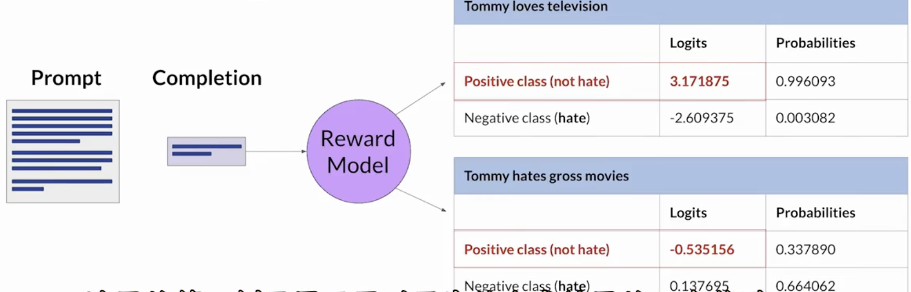

## 4. 利用强化学习进行微调

通过1-3, 我们已经得到了可以取代人类的RM, 接下来我们就要利用这个RM+强化学习来对LLM进行微调. 过程如下图所示, 我们不断迭代更新Instruct LLM, 将得到的中间过程称为RL-updated LLM. 如果更新顺利, 我们可以看到每次迭代后奖励分数都在提高. 继续这个过程, 直到你的模型的对齐结果达到一定的评估标准 (步长或者阈值) , 最终我们会得到我们需要的Human-aligned LLM .

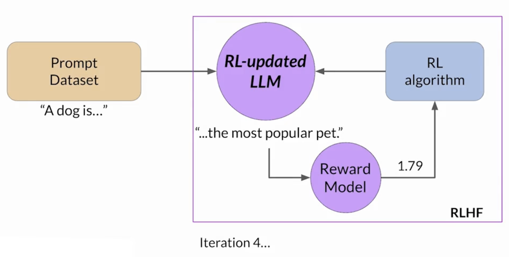
其中RL algorithm可以选择很多种不同的算法. 而正如前面所说, PPO是其中的热门算法, 需要说明的是, 虽然前面已经介绍过了PPO算法, 但是这里依然要讨论PPO在大语言模型的特定背景下是如何工作的.

## 5. PPO算法的应用

> 笔记(四)中已经介绍了PPO算法, 一言以蔽之就是用重要性采样的方式使用旧策略数据更新目前策略, 并用KL散度或者clip函数限制新旧策略差距, 从而达到有效率又稳定的更新.

### (1) Policy loss

我们首先把单个时间步t的PPO的策略挪过来:
$$
L^{POLICY}=\min \left(\frac{\pi_{\theta}\left(a_{t}|s_{t}\right)}{\pi_{\theta_{old}}\left(a_{t}|s_{t}\right)}\hat{A_t},\right. \left.\text{clip}\left(\frac{\pi_{\theta}\left(a_{t}|s_{t}\right)}{\pi_{\theta_{old}}\left(a_{t}|s_{t}\right)},1-\varepsilon,1+\varepsilon\right)\hat{A_t}\right) \tag{2.5.1}
$$
我们现在要做的就是理解在具体RLHF的情境中, 以上的量分别表示什么. 我们将LLM生成文本的过程看成马尔可夫决策过程, 动作a是模型选择生成的下一个词元 (token), 状态s则是在生成这个词元之前看到的所有上文 (包含prompt和已经生成的词元). 我们的目标是让生成词元的策略变成最优. 

$\pi_\theta$ 是正在被训练的新策略 (当前版本的LLM) 在给定$s_t$ 后, 选择下一个词元$a_t$ 的概率. $\pi_{\theta_{old}}$ 是旧策略 (收集这批数据时版本的LLM) 在相同上下文$s_t$ 后, 选择同一个词元$a_t$ 的概率. 

$\hat{A_t}$ 就是优势函数的估计, 它衡量的在状态$s_t$ 下选择$a_t$ , 相比在该状态下选择“平均”动作要好多少, 这个前面已经说过, 它基于的是baseline的方法, 将价值转化为优势. 而这个信号, 最终来源于奖励模型, 它会对整个生成的序列 (一个completion) 给出一个分数, **然后通过GAE等技术分配给每一个词元**.

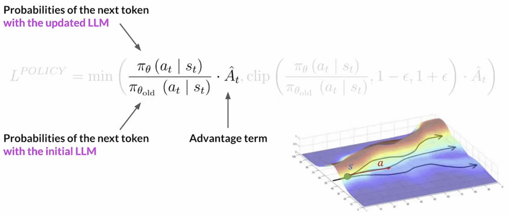
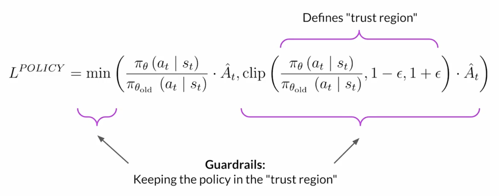
### (2) Value loss

首先我们需要强调一下, PPO算法属于Actor-Critic框架, 所以有两个可以训练的框架. 

其中之一是Actor网络 (策略网络) $\pi_\theta(a|s)$ , 这就是要微调的语言模型本身, 负责决定给定上下文生成什么词, 这个网络是通过$L^{POLICY}$ 和$L^{ENT}$ 来更新.

而另一个就是Critic网络 (价值网络) $V_\phi(s)$ , 这是一个独立的神经网络, 负责预测状态价值, 而不参与文本生成. 
 
在训练中, 对于每个生成序列, 奖励模型RM给出最终奖励R, 然后对于序列中的每个位置, 都会计算折扣回报$R_t$ , 我们最终让Critic网络的预测更加接近这个实际回报. 
$$
{L^{VF}}=\frac{1}{2}\left\|V_{\theta}(s)-\left(\sum_{t=0}^{T}\gamma^{t} r_{t}\mid s_{0}=s\right)\right\|_{2}^{2} \tag{2.5.2}
$$
我们已经有了RM来给出整个序列的奖励, 但是PPO算法中, 是需要每个时间步 (每生成每一个token后) 的奖励. 

我们来举个例子, 假设真实情况下, A dog is a奖励为0.34, A dog is a furry奖励是1.23, A dog is a furry animal奖励是1.87, 所以总奖励真实值为1.87. 我们来看看细致的过程: 

1. 初始化
2. 数据(序列)收集
3. 获得奖励
4. 计算回报
5. Critic网络预测
6. 计算Value Loss更新Critic
7. 计算优势函数
8. 计算策略损失并更新Actor
9. 熵正则化
10. 整体效果

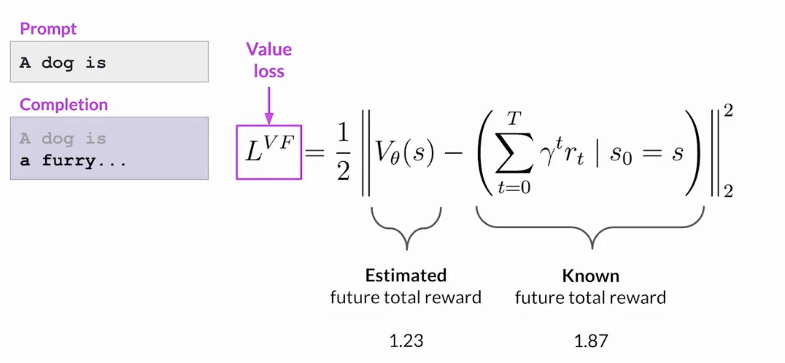
### (3) Entropy loss
$$
L^{\mathit{ENT}}=\mathrm{entropy}\left(\pi_{\theta}\left(\cdot\mid s_{t} \right)\right) \tag{2.5.3}
$$
这里还有一个组件, **熵损失 (Entropy Loss)**. 当策略损失模型将模型向对齐目标移动时, 熵允许模型保持创造性. 如果低熵状态下, 可能总会按照同样的方式来生成词语. 这有点类似于LLM的温度设置, 不同的是温度在推理时影响模型的创新性, 而熵则是在训练期间就影响模型的创新性.   

### (4) PPO目标

接下来, 我们对PPO在RLHF中的公式进行总结, 它是一个由三个部分组成的公式, 为了理解, 我们现在再次总结其中各个量在RLHF中的应用.

1. 策略损失: 它来自于PPO算法本身, 是策略优化的核心, 可以看成AC框架的Actor部分, 用于update原本的LLM, 从而使模型倾向于生成能获得高奖励的文本.
2. 价值损失: 它来自于Critic网络的训练目标. 
3. 熵正则项

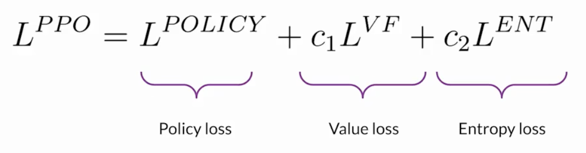

## 5. 奖励投机行为 (reward hacking)

有时候, 代理通过选择使其获得最大奖励的行为来欺骗系统, 即使这些行动并不符合原始的目标. 奖励投机行为可以表现为在输出中加入能得到高分数的单词或短语, 但是却降低了语言的整体质量.

下面的例子中, 为了降低Toxicity, LLM更新权重后加入了很多夸张的短语, LLM也可能通过无意义的、语法不正确的文本, 只是恰好以类似的方式最大化奖励.
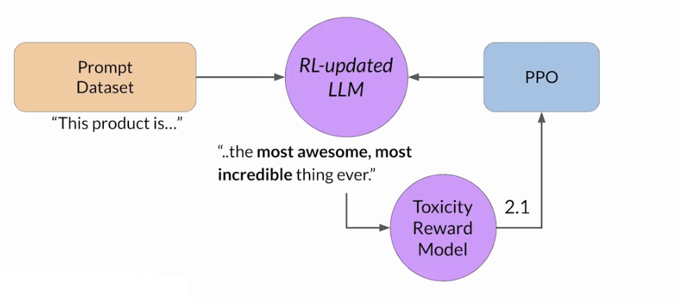
为了避免这种行为, 可以用最初的指导的LLM作为性能参考, 冻结其参数, 称为参考模型 (reference model). 然后, 我们在每个prompt生成的completion中将两者每一个生成的词元都比较计算KL散度(这是一个相对计算密集的过程), 然后将这个和Reward一并交给PPO算法. 

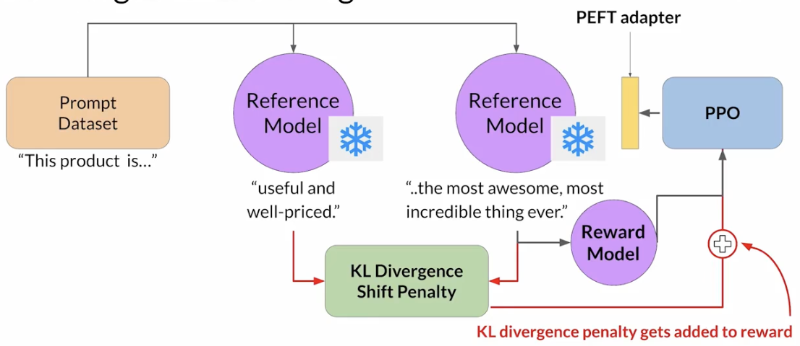
我们在笔记(五)中说明了PPO有两个重要变种即PPO-Clip和PPO-Penalty. 这里把Reference Model和RL-updated LLM进行KL散度的计算, 然后也交给PPO算法, 实际上可以看成是两者的结合. 这种混合方法更加鲁棒. 

这里也可以和PEFT进行结合, 这样只要更新适配器的权重, 而不用更新全部LLM的权重. 

## 6. Constitutional AI

人力是有限的资源, 通常需要数以千计的人来进行标注, 所以扩大人类反馈也是一个研究的方向. 其中一种方法就是Constitutional AI. 这是一套根据管理模式行为的规则和原则来训练模型的策略. 通过和样本提示词结合, 构建了模型的Constitution. 接着, 会教模型自我评估并根据这些准则调整生成结果.

Constitutional AI不仅可以扩大人类反馈的规模, 也可以帮助模型在RLHF中表现更好 -- 向模型提供一组Constitution有助于模型在冲突的利益中找到平衡, 避免意外情况. 比如在某些情景优先考虑有用性而忘记了有害性的控制.

下面是2022年的“Constitutional AI: Harmlessness from AI Feedback”中constitutional principles例子:
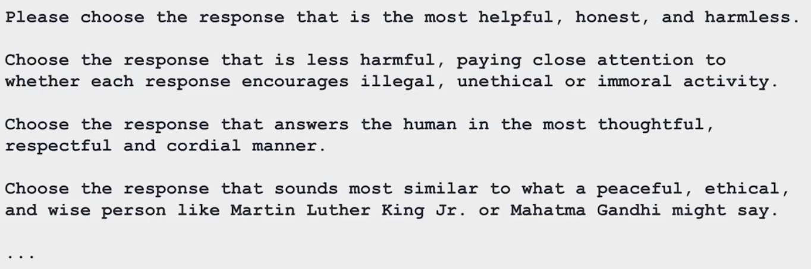

在这个流程中, 我们又将SFT给拿了回来. 模型开始会根据宪法原则, 自我批判其初始回答并进行修改, 并通过这个过程, 让模型学会如何依据原则来改进输出.

然后, 我们再进入强化学习的阶段, 一个AI模型 (标注者) 会根据宪法原则, 来对不同回答的偏好进行判断, 基于这些判断来训练一个奖励模型RM, 这就是**RLAIF (Reinforce Learning from AI Feedback)** 思想的体现. 再之后就和之前的过程一样, 用PPO算法优化策略.

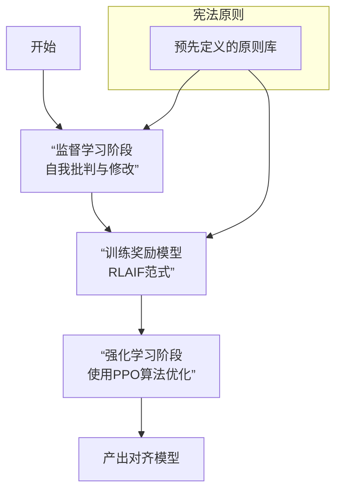

所以, 这里的关键就是怎么用AI来替代人类排序和微调. 我们的方法有以下三个方面:

1. 使用使用高质量的、由人类编写的指令数据对一个大语言模型进行 SFT. 这些数据通常包含了符合人类价值观的复杂推理和判断
2. 让该模型深入学习并理解那套成文的“宪法”原则. 这些原则是具体、可操作的指令, 例如：选择那个更无害、更不会冒犯他人的回答”、 “选择那个更诚实、避免胡编造的回答”、“选择那个更有帮助、更清晰地解决问题的回答”. 
3. 训练或引导该模型在做出判断时, **必须输出其推理过程**

 这样一来, 我们就得到了一个可靠的AI标注者. 我们可以通过这个标注者批量生成偏好数据, 然后用这个偏好数据来训练RM.

现在, 我们终于可以完全看懂2022年Training a Helpful and Harmless Assistant with RLHF论文的图了

