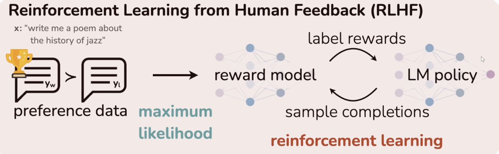
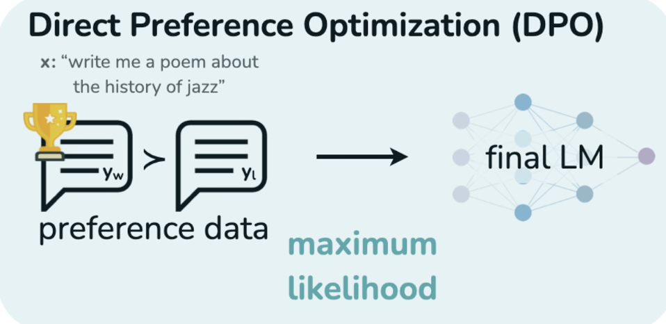
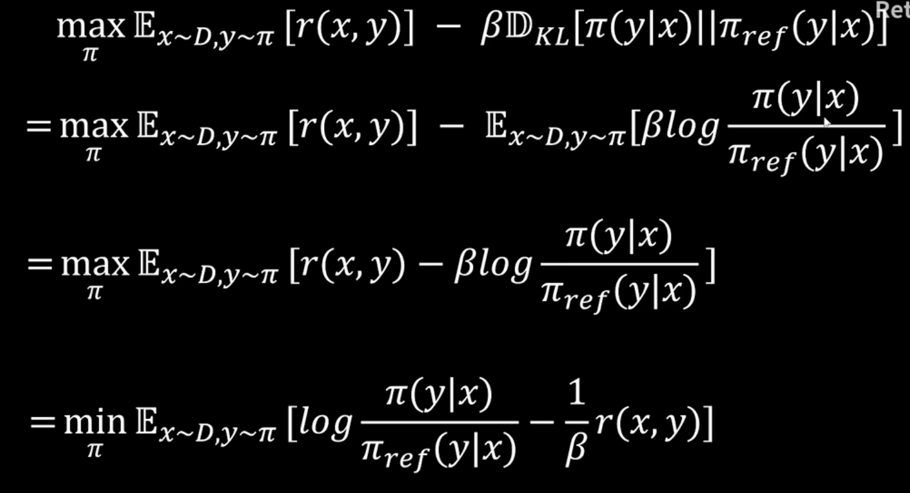
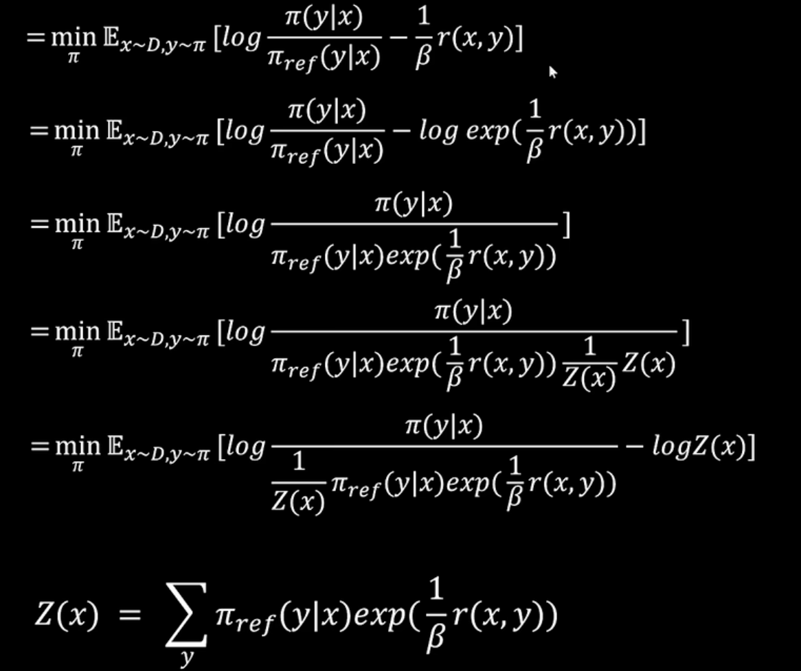
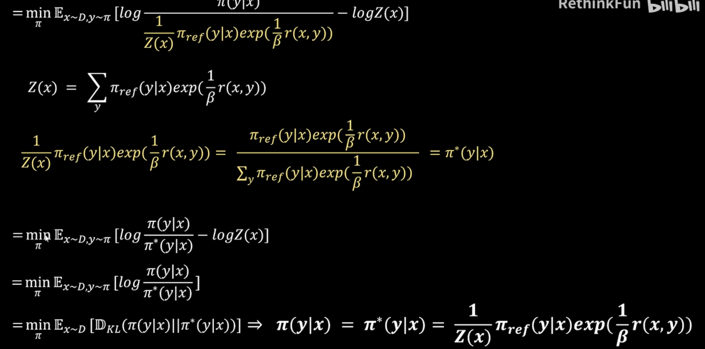
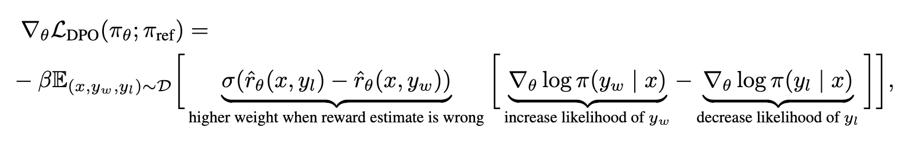

> DPO算法是对PPO的流程进一步简化, 
# 一. 直接偏好优化 (Direct Preference Optimization, DPO)

以PPO为优化目标产生最优Policy的条件下推出了reward的表达式, 然后将该reward的表达式代入了以Bradley-Terry模型建模的最大似然估计中, 即可得到DPO的Loss. (DPO与PPO的目标是一致的，PPO以强化学习的方式实现了这个目标的优化，DPO认为这个目标有一个解析解，所以把这个解析解推导了出来，最后得到了DPO的loss)

DPO的核心洞察在于原始强化学习问题存在解析最优解，表明最优策略与奖励函数存在一一映射关系。DPO将此关系反解后代入Bradley-Terry偏好模型，将对奖励函数的似然最大化，等价地转化为直接对策略的似然最大化。因此，优化DPO损失函数即是在直接寻找那个能同时最大化人类偏好概率且满足最优解形式的策略，避免了先用偏好数据拟合奖励模型再进行强化学习过程寻找最优策略.

