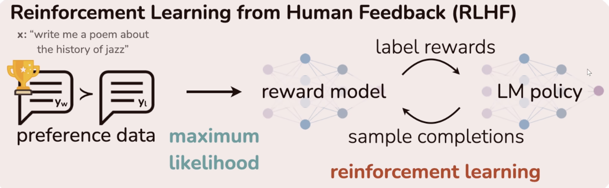
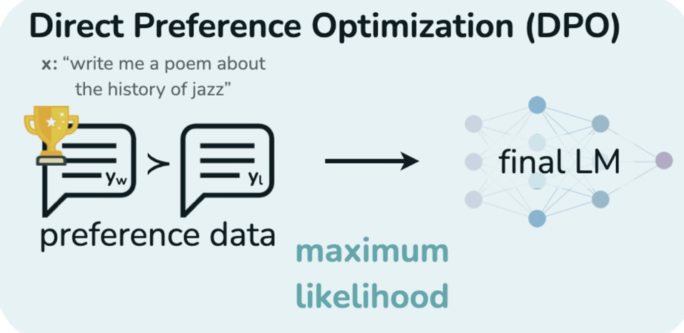
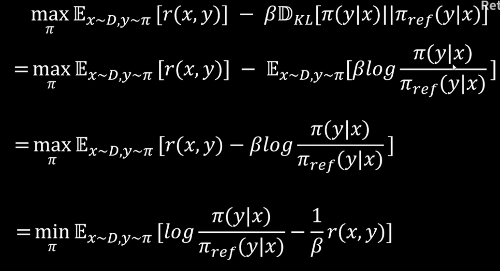
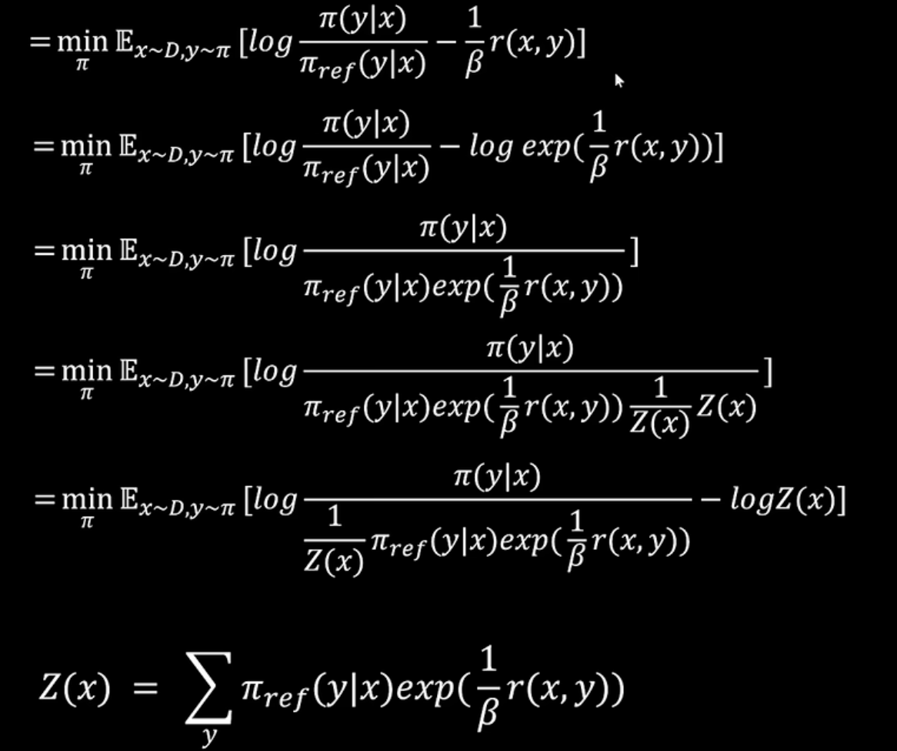
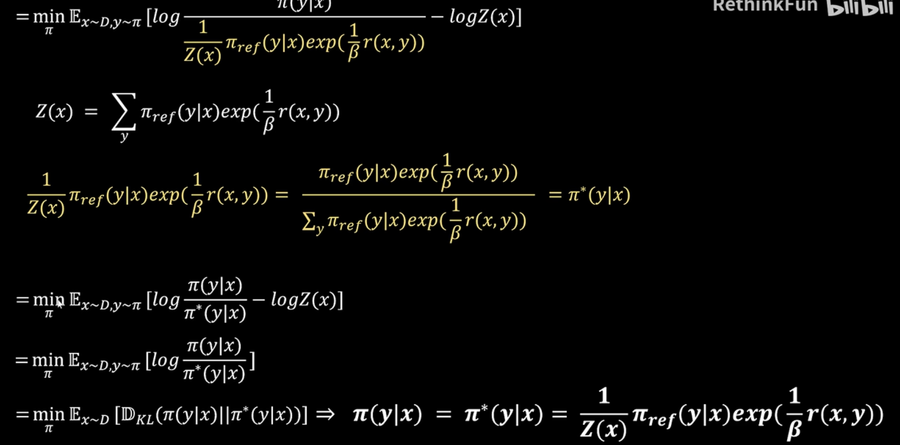
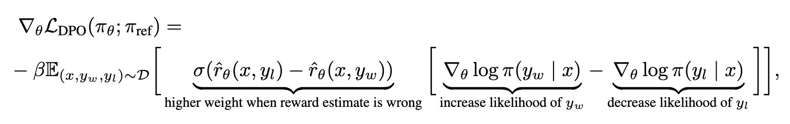

> DPO算法是对PPO的流程进一步简化, 
# 一. 直接偏好优化 (Direct Preference Optimization, DPO)

以PPO为优化目标产生最优Policy的条件下推出了reward的表达式, 然后将该reward的表达式代入了以Bradley-Terry模型建模的最大似然估计中, 即可得到DPO的Loss. (DPO与PPO的目标是一致的，PPO以强化学习的方式实现了这个目标的优化，DPO认为这个目标有一个解析解，所以把这个解析解推导了出来，最后得到了DPO的loss)

DPO的核心洞察在于原始强化学习问题存在解析最优解，表明最优策略与奖励函数存在一一映射关系。DPO将此关系反解后代入Bradley-Terry偏好模型，将对奖励函数的似然最大化，等价地转化为直接对策略的似然最大化。因此，优化DPO损失函数即是在直接寻找那个能同时最大化人类偏好概率且满足最优解形式的策略，避免了先用偏好数据拟合奖励模型再进行强化学习过程寻找最优策略.

•	第一步（数据准备，替代在线试错生成）： 系统不再让 Actor 现场“憋”一句话出来。它直接读取预先收集好的离线偏好数据，这包含一个 Prompt，以及人类（或大模型）标注好的一个好回答（Chosen, ‭$y_w$‬）和一个差回答（Rejected, ‭$y_l$‬）。
•	第二步（Actor 与 Ref 出场 —— 核心概率计算）： 系统把好的和差的回答分别输入给正在训练的 Actor 网络和冻结的 Ref 网络。注意，这里它们不去生成文本，而是像做阅读理解一样，计算出输出这两句话的对数概率（Log Probabilities）。
•	第三步（取代 RM 打分，计算“隐式奖励”）： DPO 最精妙的数学魔法就在这里：它不需要单独的 RM！ 它认为，Actor 当下的概率分布本身就隐含了一个奖励模型。它直接用 Actor 算出的一句话的概率，减去 Ref 算出的概率，再乘以惩罚系数 ‭$\beta$‬。系统用这个公式，直接算出了好回答和差回答各自的**“隐式奖励”**。
•	第四步（取代 Critic 算账，直接计算偏好差距）： 这里没有 Critic，也没有复杂的优势函数 ‭$A(s,a)$‬‭‬‭‬‭‬‭‬‭‬！ 系统直接拿“好回答的隐式奖励”减去“差回答的隐式奖励”。系统期望这个差值越大越好。通过将这个差值套入一个 Sigmoid 函数，系统直接计算出一个非常传统、类似二分类的交叉熵损失，这就是 DPO Loss。
•	第五步（Actor 更新）： Actor 直接根据算出的 DPO Loss 进行反向传播，更新自己的参数。它的更新直觉非常简单粗暴：把好回答的生成概率往上提，同时把差回答的生成概率往下踩。在这个“一踩一抬”的过程中，它不仅对齐了人类偏好，还通过底层的数学逻辑自动保持了与 Ref 模型的 KL 散度约束，防止自己变成“复读机”。

# DPO是否能替代PPO？

尽管DPO可以很简洁的优化，但是在很多维度上，DPO无法取代PPO：

1. DPO 是“离线”的（Offline），而PPO 是“在线”的（Online）；
2. DPO 只有“句子级”的反馈，但是PPO 有 Critic 带来的“Token 级”反馈；
3. DPO 极易“作弊”（过拟合），PPO 有 RM 当“守门员”；

工业界一般会双规并行，视情况选择。