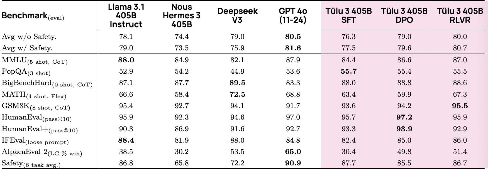
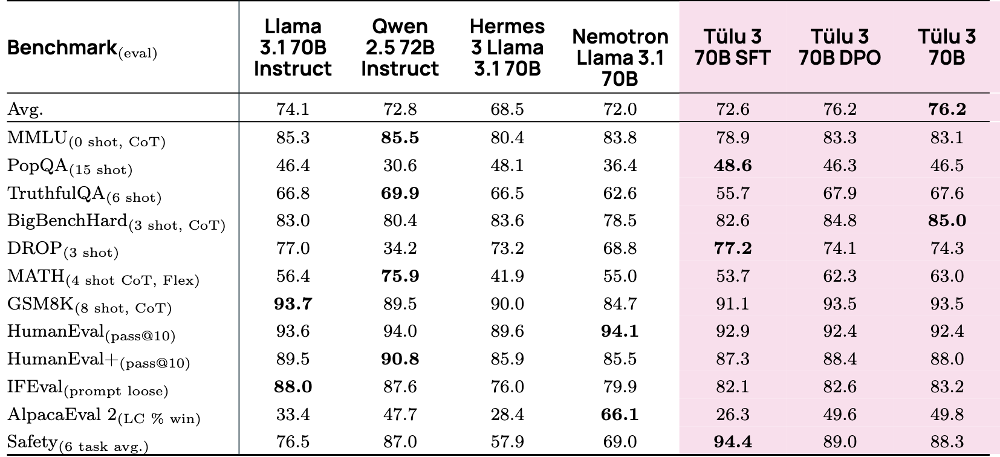
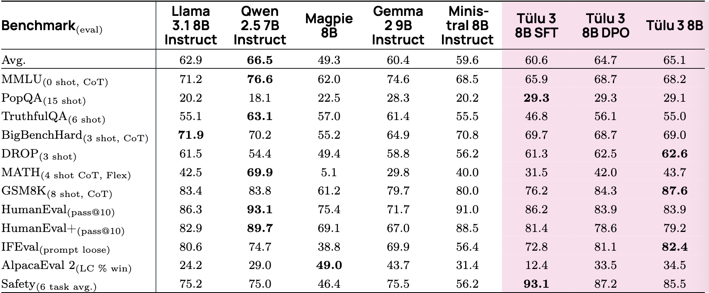
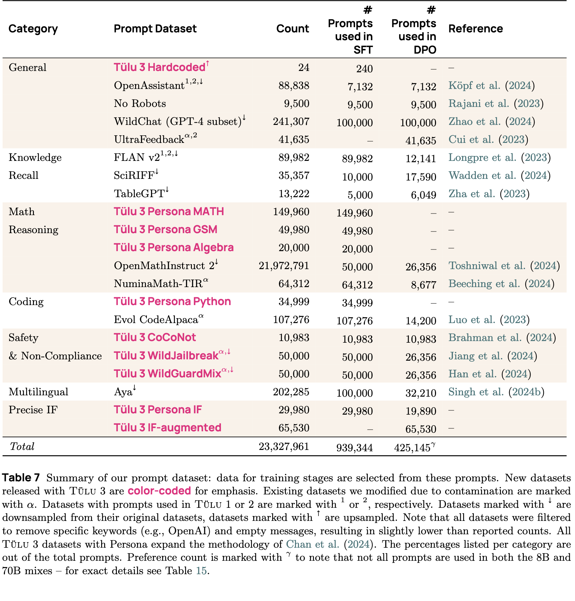
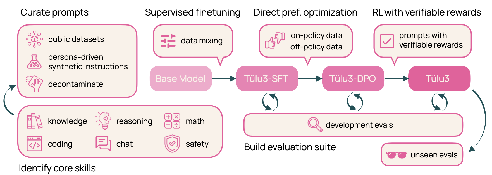
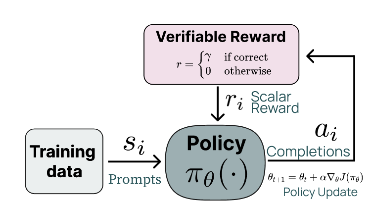

> 在LLMs的快速发展中, 强化学习与可验证奖励作为一种创新的训练方法, 引起了广泛关注. RLVR通过使用可验证的、基于规则的奖励函数, 为模型提供明确的二元反馈, 从而优化其性能. 与传统的RLHF不同, RLVR避免了主观人类评估或复杂奖励模型的依赖, 使得训练过程更加透明高效. 并且这种方式特别适用于数学推理、代码生成等具有明确正确性标准的任务.

# 一. 起源论文精读

**可验证奖励的强化学习(Reinforcement Learning with Verifiable Rewards, RLVR)**, 首次在Tülu3项目中提出, 论文[Tülu 3: Pushing Frontiers in Open Language Model Post-Training](http://arxiv.org/abs/2411.15124), 现在我们来具体阅读和实操一下论文所说的东西.

本论文未来弥补开源和闭源post training之间的差距, 本文提出了Tülu3 -- 一系列开放的、最先进的后训练模型, 包括他们的全部相关数据、训练配方、代码、基础设设施和评估框架.

先来看使用了RLVF方法等Tülu3模型, 在三个尺度下(405B、70B、8B) 的性能比较, 涵盖了综合能力（Avg）、知识（MMLU）、数学（MATH, GSM8K）、代码（HumanEval）、指令遵循（IFEval）和安全性（Safety）等多个维度.

从上述表格可以看出:
1. 超大模型对比方面, GPT-4o依然遥遥领先, 但Tülu3的RLVR表现强劲, 优于Llama3.1 405B Instruct而均分接近GPT-4o. 另外Deepseek V3在数学题和BigBenchHard上表现突出
2. 大模型对比方面, Tülu3 70B综合第一, 而Qwen2.5 72B在MATH和HumanEval+上具有压倒性优势.
3. 小模型方面, Qwen2.5 7B统治力最强, 大幅领先对手. 但是Tülu3 8B则在小学数学(GSM8K)、IFEval(指令微调)和Safety(安全性)上表现很好.
4. Tülu3 的后训练策略, 从SFT到DPO再到RLVR, 性能都有显著且稳定的提升.
5. RLVR实际上起到了修复逻辑功能的作用, 比如在SFT到DPO, MATH任务反而准确度降低了, 而采用RLVR之后产生了大幅反超. 另外在指令准确度和特定领域(小学数学)的上限也发生了提高 (我们可以认为, RLVR对“刷分”行为进行了一定程度的制裁, 在风格偏好调整好的情况下, 又把丢失的部分逻辑功能拿了回来.)

Tülu 3团队自己总结该架构的重要元素如下:

1. 仔细调研了开源数据集, 分析其来源并进行了去噪, 同时进行策划了针对核心技能的合成提示, 以获取高质量的提示. 并发现了**针对性的提示对提升核心技能具有显著的影响**. 
2. 创造了一个多经验的SFT数据集, 通过构建专门针对的模型在评估套件中确定一个上限, 然后通过混合数据使通用模型去接近这一上限.
3. 构建了一种同策略偏好数据集, 通过一种同策略数据整理流程, 来拓展偏好数据集生产规模. 具体而言是用Tülu3-SFT及其他模型生成补全结果, 并通过两两比较获得偏好标签. 最终获得了354,192个用于偏好调优的数据实例.
4. 在偏好微调算法设计中, 实验中优先考虑了简单性和效率, 因此整个开发过程中采用了长度归一化的DPO, 而没有投入更多成本去研究基于强化学习的方法如PPO.
5. 采用了具有可验证奖励的特定技能强化学习, 利用标准的强化学习范式来针对那些能够与真实结果进行评估的技能 (例如数学), 这一方法被称为RLVR. 当任务完成时, 该算法会获得一个恒定的奖励值, 这显著提升了GSM8K、MATH和IFEval的表现.
6. 实现了一种异步训练架构, 通过vLLM高效运行大语言模型推理, 同时学习器并行执行梯度更新. 
7. 实现了评估框架Tülu 3 Eval, 是一款开放的评估工具包, 旨在通过精心挑选的评估套件和去噪工具, 指导开发过程.

## 1. Tülu 3 数据集

Tülu数据集是通过整合公开数据并人工精选数据, 来策划和收集得到的. 它聚焦于知识回忆、推理能力、数学、编程、指令执行、通用对话和安全等核心技能. 

### (1) 提示词精选

团队首先对公开数据集进行了广泛的调研, 然后对每个数据集进行人工审核, 并根据以下考量挑选出合适的数据集:
1. 多样性
2. 目标技能
3. 数据溯源与许可

## 2. Tülu 3 评估工具

> 评估工具在 https://github.com/allenai/olmes 上公开. 

## 3. Tülu 3 配方

现在, 来介绍一下Tülu3这个模型时怎么训练出来的, 据团队自己所说, Tülu3的关键贡献在于数据、方法、架构改变和严格评估.

### (1) 数据整理

### (2) 监督微调

### (3) 偏好微调

### (4) RLVR

