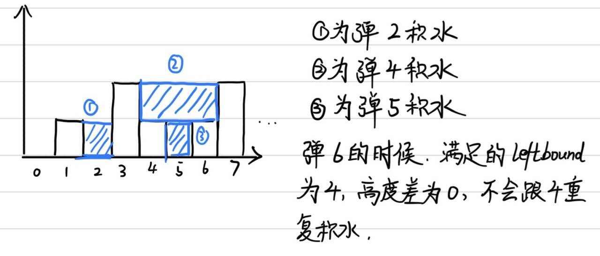

# 两数之和

## 1. 题面

#### 1. 两数之和

难度：简单

给定一个整数数组 `nums` 和一个整数目标值 `target`，请你在该数组中找出  **和为目标值**  _`target`_  的那  **两个**  整数，并返回它们的数组下标。

你可以假设每种输入只会对应一个答案，并且你不能使用两次相同的元素。

你可以按任意顺序返回答案。

 **示例 1：** 

```
输入：nums = [2,7,11,15], target = 9
输出：[0,1]
解释：因为 nums[0] + nums[1] == 9 ，返回 [0, 1] 。
```

 **示例 2：** 

```
输入：nums = [3,2,4], target = 6
输出：[1,2]
```

 **示例 3：** 

```
输入：nums = [3,3], target = 6
输出：[0,1]
```

 **提示：** 

*   `2 <= nums.length <= 10^4`
*   `-10^9 <= nums[i] <= 10^9`
*   `-10^9 <= target <= 10^9`
*    **只会存在一个有效答案** 

 **进阶：** 你可以想出一个时间复杂度小于 `O(n^2)` 的算法吗？

## 2. 解法
```python3
# 梦开始的地方
# 如果强硬做需要n方二重循环，首先体现出哈希表空间换时间

# 打一个哈希表值:下标，每一次找哈希表中target-val的数字，如果找到了就返回下标列表，找不到就存入哈希表
def solution(nums,target)->list:
    dict = {}
    for i,val in enumerate(nums):
        if target-val in dict:
            return [i,dict[target-val]]
        else:
            dict[val] = i
    # 假设都对应答案不用考虑找不到

if __name__ == "__main__":
    # 我们让输入两行，一行为逗号隔开的数字，另一行target
    nums = list(map(int,input().strip().split(',')))
    target = int(input().strip())
    print(solution(nums,target))
```

## 3. 反思
1. 本题是基础哈希表空间换时间，第一次做的时候没有加else，虽然这题无所谓，但是别的题可能会有区别。
2. 还有一个细节，我用了dict，实际上覆盖了内置的dict，还是用mp比较好

## 4. 二刷
成功考虑到了要不要else要不要加，另外，这题还有其他的解法。算是哈希表的基础应用题。

---

# 字母的同分异构词

## 1. 题面

#### 49. 字母异位词分组

难度：中等

给你一个字符串数组，请你将 字母异位词 组合在一起。可以按任意顺序返回结果列表。

 **示例 1:** 

 **输入:**  strs = \["eat", "tea", "tan", "ate", "nat", "bat"\]

 **输出:**  \[\["bat"\],\["nat","tan"\],\["ate","eat","tea"\]\]

 **解释：** 

*   在 strs 中没有字符串可以通过重新排列来形成 `"bat"`。
*   字符串 `"nat"` 和 `"tan"` 是字母异位词，因为它们可以重新排列以形成彼此。
*   字符串 `"ate"` ，`"eat"` 和 `"tea"` 是字母异位词，因为它们可以重新排列以形成彼此。

 **示例 2:** 

 **输入:**  strs = \[""\]

 **输出:**  \[\[""\]\]

 **示例 3:** 

 **输入:**  strs = \["a"\]

 **输出:**  \[\["a"\]\]

 **提示：** 

*   `1 <= strs.length <= 10^4`
*   `0 <= strs[i].length <= 100`
*   `strs[i]` 仅包含小写字母

## 2. 解法 1 · {}
```python3
# 白痴做法是排序判断，python快排是onlogn
# 保持on可以用哈希表，这题的意思换句话就是将字母出现个数一样的放在一起
# 维持一个字母表:字符串列表

def solution(strs)->list[list[str]]:
    mp = {}
    for s in strs:
        ap = [0]*26
        for i in s:
            ap[ord(i)-ord('a')] += 1
        # 注意list不能当key
        key = tuple(ap)
        if key not in mp:
            mp[key]=[]
        mp[key].append(s)
    # 现在按照每个ap返回组成的字符串列表
    return list(mp.values())


if __name__ == "__main__":
    # 输入一串str
    strs = [s.strip().strip('"') for s in input().strip().split(',')]
    print(solution(strs))
```

## 3. 解法 2 · defaultdict
```python3
from collections import defaultdict

def solution(strs)->list[list[str]]:
    # defaultdict可以避免查空建表，遇到没见过的key默认开辟
    # defaultdict(list)就是默认传进来没见过的用list()先构造，也就是list()默认值空列表
    # 同理defaultdict(int)，int()的默认值是0
    # defaultdict(set)还可以叠去重
    groups = defaultdict(list)
    for s in strs:
        count = [0] * 26
        for c in s:
            count[ord(c) - ord("a")] += 1
        groups[tuple(count)].append(s)
    return list(groups.values())


if __name__ == "__main__":
    # 输入一串str
    strs = [s.strip().strip('"') for s in input().strip().split(',')]
    print(solution(strs))
```

## 4. 反思
1. 实际上做到这里的时候想到用这种方法，但是还是有点小梗塞。容易出错的点：list不能作为key，需要tuple；ord函数别忘了；mp.values()的用法，返回values的迭代器，用list转为答案数组
2. 如果使用默认数组，不需要先判key空产生[]再append，直接用defaultdict(list)，等于设置了键值的值默认为list的默认值空列表；同理，这里设置为int就是默认值为0
3. 注意输入处理，因为默认复制力扣的输入是有"的，而想去掉双引号，需要用单引号包裹来strip('"')。

## 5. 二刷
哎呀，二刷错了啊！！竟然直接把哈希表转tuple当key了，哈希表本身tuple之后只能得到key的元组，计算实在想当也需要`key = tuple(sorted(Counter(s).items()))`用这种包含完整信息的，但是这样太麻烦了，要么直接用sorted之后当key，要么就是按照原本的做法，打字母表就行了。每个单词的结果作为记数列表当做tuple才是最自然的。不过这次好在想到了空的时候建[]

---

# 最长连续序列

## 1. 题面

#### 128. 最长连续序列

难度：中等

给定一个未排序的整数数组 `nums` ，找出数字连续的最长序列（不要求序列元素在原数组中连续）的长度。

请你设计并实现时间复杂度为 `O(n)` 的算法解决此问题。

 **示例 1：** 

```
输入：nums = [100,4,200,1,3,2]
输出：4
解释：最长数字连续序列是 [1, 2, 3, 4]。它的长度为 4。
```

 **示例 2：** 

```
输入：nums = [0,3,7,2,5,8,4,6,0,1]
输出：9
```

 **示例 3：** 

```
输入：nums = [1,0,1,2]
输出：3
```

 **提示：** 

*   `0 <= nums.length <= 10^5`
*   `-10^9 <= nums[i] <= 10^9`

## 2. 解法

```python3
# 需要on解决问题，只能遍历一遍，必须空间换时间
# 我们先遍历一遍，将数组放进集合，然后找下一个有可能的数字。虽然是循环套循环，但是终归是有限次查找，所以为on

def solution(nums)->int:
    num_set = set(nums)
    longest = 0
    current_length = 0
    for num in num_set:
        current = num
        current_length = 1
        # 循环找有限个后续
        while current + 1 in num_set:
            current += 1
            current_length += 1 
        longest = max(longest,current_length)
    return longest

if __name__ == "__main__":
    nums = list(map(int,input().strip().split(',')))
    print(solution(nums))
```

## 3. 反思
1. 这题肯定也是第一时间想到空间换时间，但是没想到哈希存什么。主要是害怕for套for复杂度超过on，但是其实里面是有限次循环，还是on。
2. 不用set的话问了题友，也是哈希打一遍标记，然后前后找。

## 4. 二刷
秒了

---

# 移动零

## 1. 题面

#### 283. 移动零

难度：简单

给定一个数组 `nums`，编写一个函数将所有 `0` 移动到数组的末尾，同时保持非零元素的相对顺序。

 **请注意**  ，必须在不复制数组的情况下原地对数组进行操作。

 **示例 1:** 

```
输入: nums = [0,1,0,3,12]
输出: [1,3,12,0,0]
```

 **示例 2:** 

```
输入: nums = [0]
输出: [0]
```

 **提示** :

*   `1 <= nums.length <= 10^4`
*   `-2^31 <= nums[i] <= 2^31 - 1`

**进阶：**你能尽量减少完成的操作次数吗？

## 2. 解法

```python3
# 双指针搬运法，很简单
def solution(nums):
    i,j = 0, 1
    n = len(nums)
    if n<=1:
        return nums
    while j<n:
        if nums[j]!=0:
            nums[i]=nums[j]
            i+=1
        j+=1
    # 如果i没走完，则后面全部置零
    while i<n:
        nums[i]=0
        i+=1
    return nums

if __name__ == "__main__":
    nums = list(map(int,input().strip().split(',')))
    print(solution(nums))

```

## 3. 反思
1. 没啥好说的，就是简单的移动插入，跟插入排序有点像，需要注意的是while循环下面别忘了移动变量，这个经常忘记。

## 4. 二刷
直接i、j都定义为0就不需要特判n<=1了。

---

# 盛水最多的容器

## 1. 题面

#### 11. 盛最多水的容器

难度：中等

给定一个长度为 `n` 的整数数组 `height` 。有 `n` 条垂线，第 `i` 条线的两个端点是 `(i, 0)` 和 `(i, height[i])` 。

找出其中的两条线，使得它们与 `x` 轴共同构成的容器可以容纳最多的水。

返回容器可以储存的最大水量。

 **说明：** 你不能倾斜容器。

 **示例 1：** 


```
输入：[1,8,6,2,5,4,8,3,7]
输出：49 
解释：图中垂直线代表输入数组 [1,8,6,2,5,4,8,3,7]。在此情况下，容器能够容纳水（表示为蓝色部分）的最大值为 49。
```

 **示例 2：** 

```
输入：height = [1,1]
输出：1
```

 **提示：** 

*   `n == height.length`
*   `2 <= n <= 10^5`
*   `0 <= height[i] <= 10^4`

## 2. 题解

```python3
# 这题其实是双指针，一前一后，每次贪心移动比较矮的柱子（因为木桶效应，矮柱子比较碍事）
def solution(heights):
    n = len(heights)
    i, j = 0, n-1
    max_pool = 0
    while i !=j:
        min_height = min(heights[i],heights[j])
        max_pool = max(max_pool,min_height*(j-i))
        if heights[i]<=heights[j]:
            i+=1
        else:
            j-=1
    return max_pool

if __name__ == "__main__":
    nums = list(map(int,input().strip().split(',')))
    print(solution(nums))
```

## 3. 反思
1. 这题老是幻视成单调栈，但是实际上不是需求“第一个比xx大/小”的量，卡了半天不知道怎么写。
2. 但是这题实际上是一个贪心，理论依据是“移动高的那边一定不可能得到更优解”，所以只能移动矮的那边去保留希望。这个解释还是让人感觉懵懵的。
3. 询问码u，最好的解释是“移动小的那根不一定能让水更多，但是大的那根肯定会变少”，因为移动大的那根，小的那根被限制住了，无论如何都不会变大，反而使宽度减小。

## 4. 二刷
秒，移动短边获得希望。

---

# 三数之和

## 1. 题面

#### 15. 三数之和

难度：中等

给你一个整数数组 `nums` ，判断是否存在三元组 `[nums[i], nums[j], nums[k]]` 满足 `i != j`、`i != k` 且 `j != k` ，同时还满足 `nums[i] + nums[j] + nums[k] == 0` 。请你返回所有和为 `0` 且不重复的三元组。

 **注意：** 答案中不可以包含重复的三元组。

 **示例 1：** 

```
输入：nums = [-1,0,1,2,-1,-4]
输出：[[-1,-1,2],[-1,0,1]]
解释：
nums[0] + nums[1] + nums[2] = (-1) + 0 + 1 = 0 。
nums[1] + nums[2] + nums[4] = 0 + 1 + (-1) = 0 。
nums[0] + nums[3] + nums[4] = (-1) + 2 + (-1) = 0 。
不同的三元组是 [-1,0,1] 和 [-1,-1,2] 。
注意，输出的顺序和三元组的顺序并不重要。
```

 **示例 2：** 

```
输入：nums = [0,1,1]
输出：[]
解释：唯一可能的三元组和不为 0 。
```

 **示例 3：** 

```
输入：nums = [0,0,0]
输出：[[0,0,0]]
解释：唯一可能的三元组和为 0 。
```

 **提示：** 

*   `3 <= nums.length <= 3000`
*   `-10^5 <= nums[i] <= 10^5`

## 2. 题解

```python3
# 第一个想法比较直白，二重循环来找第三个数，从而变成两数之和，但是这样就on方了
# 好吧只能on方，想什么呢。既然只有on方，那排序也是可以的了，然后用更优雅的方法：固定一个数+双指针移动
def solution(nums):
    nums.sort()
    ans = []
    for i in range(len(nums)):
        if i > 0 and nums[i] == nums[i - 1]:
            continue
        left, right = i + 1, len(nums) - 1
        while left < right:
            s = nums[i] + nums[left] + nums[right]
            # 以0为分界决定移动哪个指针
            if s < 0:
                left += 1
            elif s > 0:
                right -= 1
            else:
                ans.append([nums[i], nums[left], nums[right]])
                left += 1
                right -= 1
                while left < right and nums[left] == nums[left - 1]:
                    left += 1
                while left < right and nums[right] == nums[right + 1]:
                    right -= 1
    return ans

if __name__=="__main__":
    nums = list(map(int,input().strip().split(',')))
    print(solution(nums))
```

## 3. 二刷
这一题的去重是大坑。我使用tuple化list，面前去重成功。但是最好的方法，其实是移动的时候直接忽略相同元素（排序后相同元素在一起）。所以按照题解一样，如果移动后元素还是一样，直接什么也不做跳过去。

---

# 接雨水

## 1. 题面

#### 42. 接雨水

难度：困难

给定 `n` 个非负整数表示每个宽度为 `1` 的柱子的高度图，计算按此排列的柱子，下雨之后能接多少雨水。

 **示例 1：** 


```
输入：height = [0,1,0,2,1,0,1,3,2,1,2,1]
输出：6
解释：上面是由数组 [0,1,0,2,1,0,1,3,2,1,2,1] 表示的高度图，在这种情况下，可以接 6 个单位的雨水（蓝色部分表示雨水）。
```

 **示例 2：** 

```
输入：height = [4,2,0,3,2,5]
输出：9
```

 **提示：** 

*   `n == height.length`
*   `1 <= n <= 2 * 10^4`
*   `0 <= height[i] <= 10^5`

## 2. 题解1 - 单调栈法

```python3
# 经典单调栈的题目，只要能识别为找到第一个比xxx大/小的题目都可以单调栈
# 本题要找左侧第一个比它高的，还要找右侧第一个比它高的，这样才能形成水洼。左侧最高可以用递减栈记录，右侧最高只能通过出栈的瞬间判断。不过不用担心有的栈不会被弹出，因为找不到右侧比它更高的，就行不成水洼；左侧同理，找left的时候要进行一次保护。
# 坐标语言，(right-left-1)*(左右那个比较矮的和当前的高度差)=累积的水泊
from collections import deque

def solution(height:list):
    # 存储 值:下标
    q = deque()
    pool = 0
    for i,h in enumerate(height):
        while q and q[-1][0]<h:
            curr_val,curr = q.pop()
            right = i
            rigth_val = h
            # 左边第一个比它高的是弹出后的栈顶。如果左边没了，形不成水洼
            if not q:
                break
            left_val,left = q[-1]
            # 加池子
            pool += (min(left_val,rigth_val)-curr_val)*(right-left-1)
        # 进栈
        q.append((h,i))
    return pool

if __name__ == "__main__":
    nums = list(map(int,input().strip().split(',')))
    print(solution(nums))
```

## 3. 反思
1. 实际解题的思路已经写的很清楚了，重要的就是单调栈的思想。
2. 注意这里不需要全部弹出，右侧可能没有更高的边界；需要注意的是左侧可能会没有水洼，所以要保护一下空栈。
3. 这里right、right_val就是当前的i、h，更简的话可以不定义right相关变量

## 4. 二刷
二刷的时候把问题想简单了，直接把val做单调栈没有带上坐标，然后直接只看高度差来积水。
比较好的思维方式是，看到弹出结算的加上的水，其实是以curr高度托底，左右第一个比较高的柱子之间的差。

每次比较担心的思维陷阱其实是4、6会不会重复计算水？排除这种情况就可以大胆用长度差*高度差来积水了。



## 5. 题解2 - 前后缀最大值法
```python
# 另一种比较直观的解法，前后缀最大值法。
# 我们在每个位置记忆左侧更高的高度、右侧更高的高度，然后遍历一遍，只拿下这个洼地上方一列的存水量（高度差）。
import ast

def solution(height: list[int]) -> int:
    n = len(height)
    if n == 0:
        return 0

    left_max = [0] * n
    right_max = [0] * n

    left_max[0] = height[0]
    for i in range(1, n):
        left_max[i] = max(left_max[i - 1], height[i])

    right_max[n - 1] = height[n - 1]
    for i in range(n - 2, -1, -1):
        right_max[i] = max(right_max[i + 1], height[i])

    ans = 0
    for i in range(n):
        ans += min(left_max[i], right_max[i]) - height[i]

    return ans


if __name__ == "__main__":
    nums = ast.literal_eval(input().strip())
    print(solution(nums))
```

---

# 无重复字符的最长子串

## 1. 题面

#### 3. 无重复字符的最长子串

难度：中等

给定一个字符串 `s` ，请你找出其中不含有重复字符的  **最长 子串**  的长度。

 **示例 1:** 

```
输入: s = "abcabcbb"
输出: 3 
解释: 因为无重复字符的最长子串是 "abc"，所以其长度为 3。注意 "bca" 和 "cab" 也是正确答案。
```

 **示例 2:** 

```
输入: s = "bbbbb"
输出: 1
解释: 因为无重复字符的最长子串是 "b"，所以其长度为 1。
```

 **示例 3:** 

```
输入: s = "pwwkew"
输出: 3
解释: 因为无重复字符的最长子串是 "wke"，所以其长度为 3。
     请注意，你的答案必须是 子串 的长度，"pwke" 是一个子序列，不是子串。
```

 **提示：** 

*   `0 <= s.length <= 5 * 10^4`
*   `s` 由英文字母、数字、符号和空格组成

## 2. 题解

```python3
# 一眼滑动窗口，维持一个哈希表记录window里面的字母有没有重复。每次窗口有效时，记录window长度，更新最大值
def solution(s: str) -> int:
    window = {}
    left = 0
    max_length = 0
    for right, ch in enumerate(s):
        window[ch] = window.get(ch, 0) + 1
        # 这里写只要不合法，就移动左边
        while window[ch] > 1:
            window[s[left]] -= 1
            left += 1
        max_length = max(max_length, right - left + 1)
    return max_length


if __name__ == "__main__":
    s = input()
    print(solution(s))
```

## 3. 反思
1. 我其实感觉滑动窗口的思路比较简单，但是比较考验码力，特别是边界和条件判断的地方，特别容易绕晕。
2. 我第一版有很多疏漏，现在是更新过的版本。易错点1：left移动的条件不对，应该写在while里面的是“不合法”的条件，移动left直到合法；易错点2：不能用len(window)，即使哈希值归0了，键值对还在。

## 4. 二刷
想到用滑动窗口了，但是收缩条件一时想不到，还想着遍历整个哈希表看看大于1有无，其实只要看当前位置就行了。
另外还有一个坑点，我有时候会在left收缩的时候复用c，其实多数情况没事，但是收缩的条件这次是包含c的，就不能直接覆盖了，还是建议以后写成d吧。

## 5. 解法 - 标准滑动窗口法
```python
def solution(s:str) -> int:
    # 维持一个滑动窗口，当重复出现的时候，开始收缩左窗口，直到不重复
    left,right = 0,0
    window = {}
    max_length = 0
    while right<len(s):
        c = s[right]
        right += 1
        window[c] = window.get(c,0)+1
        # 需要收缩的条件
        while window[c]>1:
            d = s[left]
            window[d] -= 1
            left += 1
        max_length = max(max_length,right-left)
    return max_length


if __name__ == "__main__":
    s = input().strip()
    print(solution(s))
```

---

# 找到字符串中所有字母异位词

## 1. 题面

#### 438. 找到字符串中所有字母异位词

难度：中等

给定两个字符串 `s` 和 `p`，找到 `s` 中所有 `p` 的  **异位词**  的子串，返回这些子串的起始索引。不考虑答案输出的顺序。

 **示例 1:** 

```
输入: s = "cbaebabacd", p = "abc"
输出: [0,6]
解释:
起始索引等于 0 的子串是 "cba", 它是 "abc" 的异位词。
起始索引等于 6 的子串是 "bac", 它是 "abc" 的异位词。
```

  **示例 2:** 

```
输入: s = "abab", p = "ab"
输出: [0,1,2]
解释:
起始索引等于 0 的子串是 "ab", 它是 "ab" 的异位词。
起始索引等于 1 的子串是 "ba", 它是 "ab" 的异位词。
起始索引等于 2 的子串是 "ab", 它是 "ab" 的异位词。
```

 **提示:** 

*   `1 <= s.length, p.length <= 3 * 10^4`
*   `s` 和 `p` 仅包含小写字母

## 2. 题解

```python3
# 依旧滑动窗口
# 换言之，我们需要将p的哈希表和s中滑动窗口的哈希表一样，我们可以用validation记录一样的键时值一样，即合法键值对个数，如果和p的哈希表一样长就对了（为什么不直接==两个哈希表呢？因为哈希表全等是逐元素判断，写上时间就爆了。
def solution(s: str, p: str) -> list[int]:
    need = {}
    window = {}
    # 填充需求哈希表
    for c in p:
        need[c] = need.get(c, 0) + 1
    left = 0
    right = 0
    # 满足条件的元素个数，后面和len(need)比较
    valid = 0
    ans = []

    while right < len(s):
        c = s[right]
        right += 1
        # 右侧扩张，并判断是否增加valid
        if c in need:
            window[c] = window.get(c, 0) + 1
            if window[c] == need[c]:
                valid += 1
        # 我们当有效元素达到要求时，再来看长度，如果满足要求就加上答案，否则left移动
        while valid == len(need):
            if right - left == len(p):
                ans.append(left)

            # 这部分逻辑与right的对称
            d = s[left]
            left += 1

            if d in need:
                if window[d] == need[d]:
                    valid -= 1
                # 无论怎么样移动后都要给这个window最后调整-1
                window[d] -= 1

    return ans

if __name__ == "__main__":
    s = input().strip()
    p = input().strip()
    print(solution(s,p))
```

## 3. 反思
1. 这题是非常值得反复练习的滑动窗口题目，我重写的时候又弄错了，将right - left == len(p)作为while条件，这样还要先移动right，非常复杂容易出错。正确的一体化思路，应当是将valid个数合格作为左边收缩的起点，收缩一直进行到valid不满足为止。
2. 左右的操作实际上是对称的，取值、移动，右侧先动哈希再看valid，左侧先看valid再动哈希。其中的区别在于，left是看先满足再丢弃，right是先拿取再看是否满足。

## 4. 二刷
哎哟我，二刷的时候又弄错了，混淆了固定窗口的滑动和变长度窗口的滑动。上面的题解是为了和其他窗口valid放在while中对上从而做的调整，ans判读也移动到了收缩内部。但是我们可以写这题的标准滑动窗口，将判断放后面，然后对于固定窗口的题，可以直接把长度作为while的判断。

## 5. 题解2 - 标准固定窗口

```python
def solution(s: str, p: str) -> list[int]:
    ans = []
    need = {}
    window = {}
    left, right = 0, 0
    valid = 0

    for c in p:
        need[c] = need.get(c, 0) + 1

    while right < len(s):
        c = s[right]
        right += 1
        # 只统计需要的
        if c in need:
            window[c] = window.get(c, 0) + 1
            if window[c] == need[c]:
                valid += 1

        # 固定窗口长度，超过 len(p) 就收缩
        while right - left > len(p):
            d = s[left]
            left += 1

            if d in need:
                if window[d] == need[d]:
                    valid -= 1
                window[d] -= 1

        # 长度刚好且所有字符频次都匹配，记录答案
        if right - left == len(p) and valid == len(need):
            ans.append(left)

    return ans


if __name__ == "__main__":
    s = input().strip()
    p = input().strip()
    print(solution(s, p))
```

---

# 和为k的子数组

## 1. 题面

#### 560. 和为 K 的子数组

难度：中等

给你一个整数数组 `nums` 和一个整数 `k` ，请你统计并返回 _该数组中和为 `k` 的子数组的个数_ 。

子数组是数组中元素的连续非空序列。

 **示例 1：** 

```
输入：nums = [1,1,1], k = 2
输出：2
```

 **示例 2：** 

```
输入：nums = [1,2,3], k = 3
输出：2
```

 **提示：** 

*   `1 <= nums.length <= 2 * 10^4`
*   `-1000 <= nums[i] <= 1000`
*   `-10^7 <= k <= 10^7`

## 2. 题解

```python3
# 因为必须连续，需要满足的东西顺序无关，所以依旧滑动窗口
def solution(nums:list,k:int)->int:
    total = 0
    left, right = 0, 0
    ans = 0
    n = len(nums)
    while right<n:
        c = nums[right]
        right += 1
        total += c
        while total > k:
            c = nums[left]
            left += 1
            total -= c
        # 现在窗口合法
        if total == k:
            ans +=1
    return ans

if __name__ == "__main__":
    nums = list(map(int,input().strip().split(',')))
    k = int(input())
    print(solution(nums,k))
```

## 3. 反思
1. 和前面相比算是比较简单的滑动窗口，不需要哈希表只需要维持一个total
2. 但是这题意义在于，告诉我们滑动窗口是用来求“连续子部分的与顺序无关属性”时使用（有点废话因为顺序有关就直接遍历了）

## 4. 二刷
秒

---

# 滑动窗口最大值

## 1. 题面

#### 239. 滑动窗口最大值

难度：困难

给你一个整数数组 `nums`，有一个大小为 `k` 的滑动窗口从数组的最左侧移动到数组的最右侧。你只可以看到在滑动窗口内的 `k` 个数字。滑动窗口每次只向右移动一位。

返回 _滑动窗口中的最大值_ 。

 **示例 1：** 

```
输入：nums = [1,3,-1,-3,5,3,6,7], k = 3
输出：[3,3,5,5,6,7]
解释：
滑动窗口的位置                最大值
---------------               -----
[1  3  -1] -3  5  3  6  7       3
 1 [3  -1  -3] 5  3  6  7       3
 1  3 [-1  -3  5] 3  6  7       5
 1  3  -1 [-3  5  3] 6  7       5
 1  3  -1  -3 [5  3  6] 7       6
 1  3  -1  -3  5 [3  6  7]      7
```

 **示例 2：** 

```
输入：nums = [1], k = 1
输出：[1]
```

**提示：**

*   `1 <= nums.length <= 10^5`
*   `-10^4 <= nums[i] <= 10^4`
*   `1 <= k <= nums.length`

## 2. 解法 1 · 单调队列

```python3
# 本地要求的是连续子数组（还固定长度）的与顺序无关的属性（最大值），但是与哈希表、总和不同的是，max不能回退。
# 实际上这一题做法是单调递减队列。单调队列的思想在于维持一个“有效期”，因为max不能回退，就要存储过去合法的max，队首是目前的max
from collections import deque

def solution(nums,k):
    q = deque()
    ans = []
    # 这里我们选择存下标，一般比存值更稳定，可以避免重复值
    for i,x in enumerate(nums):
        # 构造递减队列
        while q and nums[q[-1]]<=x:
            q.pop()
        q.append(i)
        # 检查左边有效期，下标已经不在窗口内，踢出队首
        if q[0]<= i-k:
            q.popleft()
        # 如果长度达到k了，就记录答案。由于前面if的约束，必定会-1，然后+1，所以这里一定是要求的长度
        if i>= k-1:
            ans.append(nums[q[0]])
    return ans

if __name__ == "__main__":
    nums = list(map(int,input().strip().split(',')))
    k = int(input())
    print(solution(nums,k))
```

## 3. 解法 2 · 堆

```python3
# 我们依旧需要维持有序性，单调队列确实是最好的方法，但是思路有点绕
# 一个比较直白的方法，就是做一个最大堆，堆里存值和下标，堆顶下标超过了窗口范围，就弹出，然后下标达到k之后，不断进入、弹出……
import heapq

def solution(nums,k):
    ans,pq = [],[]
    for i,val in enumerate(nums):
        heapq.heappush_max(pq,(val,i))
        while pq and pq[0][1]<= i-k:
            heapq.heappop_max(pq)
        if i>=k-1:
            ans.append(pq[0][0])
    return ans

if __name__ == "__main__":
    nums = list(map(int,input().strip().split(',')))
    k = int(input())
    print(solution(nums,k))
```

## 4. 反思
1. 这题一开始想到的还是滑动窗口，但是不知道怎么维护max的回退，一开始想到用栈，但是栈没办法处理退出的就是最大值，第二个大值在哪这个问题。
2. 这题的破局关键其中之一就是存储下标。对于可能有重复值的题目，存下标是最安全稳妥的方法。
3. 这题的标准思路是单调队列，单调队列常被用来解决”有效性窗口“的问题，比如这题，就是维持了一系列候选有效的max值，left移动就看左边的第一个值有没有过期（也就是看最大值有没有过期）
4. 同样可以用堆来解决，两者思路差不多，都是存储候选，left移动看看候选最大值有没有过期，过期让老二上。（但是复杂度跌到onlogn了）
5. 特别注意，这里无论是队列长度还是堆长度，都跟窗口的长度无关。所以我们判断窗口是否合法，还是要用下标来判断。

## 5. 二刷
被秒了。。直接用堆，但是收缩时只看堆顶不对，这个写法只会在“离开的元素刚好等于当前最大值”时弹一下，否则堆里会残留很多已经不在窗口里的旧元素。必须要加上过期机制，比如加入坐标一起入堆，然后看坐标判断过期，或者干脆跟题解一样用单调队列。
---

# 最小覆盖子串

## 1. 题面

#### 76. 最小覆盖子串

难度：困难

给定两个字符串 `s` 和 `t`，长度分别是 `m` 和 `n`，返回 s 中的  **最短窗口 子串** ，使得该子串包含 `t` 中的每一个字符（ **包括重复字符** ）。如果没有这样的子串，返回空字符串 `""`。

测试用例保证答案唯一。

 **示例 1：** 

```
输入：s = "ADOBECODEBANC", t = "ABC"
输出："BANC"
解释：最小覆盖子串 "BANC" 包含来自字符串 t 的 'A'、'B' 和 'C'。
```

 **示例 2：** 

```
输入：s = "a", t = "a"
输出："a"
解释：整个字符串 s 是最小覆盖子串。
```

 **示例 3:** 

```
输入: s = "a", t = "aa"
输出: ""
解释: t 中两个字符 'a' 均应包含在 s 的子串中，
因此没有符合条件的子字符串，返回空字符串。
```

 **提示：** 

*   `m == s.length`
*   `n == t.length`
*   `1 <= m, n <= 10^5`
*   `s` 和 `t` 由英文字母组成

 **进阶：** 你能设计一个在 `O(m + n)` 时间内解决此问题的算法吗？

```python3
# 一眼滑动窗口，用t建立need，t的长度就是validation需要达到的量。validation达标的情况下left移动
def solution(s: str, t: str) -> str:
    need = {}
    window = {}
    # 记录need
    for c in t:
        need[c] = need.get(c, 0) + 1
    left = 0
    right = 0
    valid = 0
    start = 0
    min_len = float("inf")

    while right < len(s):
        c = s[right]
        right += 1
        # 如果在need中，再记录（不在need中的也不可能对valid产生影响，可以不管）
        if c in need:
            window[c] = window.get(c, 0) + 1
            if window[c] == need[c]:
                valid += 1
        # 当valid满足了，left收缩
        while valid == len(need):
            if right - left < min_len:
                # 同时记录最短长度和起点
                start = left
                min_len = right - left
            # 执行对称收缩即可
            d = s[left]
            left += 1
            if d in need:
                if window[d] == need[d]:
                    valid -= 1
                window[d] -= 1
    # 返回值进行一下inf保护
    return "" if min_len == float("inf") else s[start:start + min_len]


if __name__ == "__main__":
    s = input().strip()
    t = input().strip()
    m = len(s)
    n = len(t)
    print(solution(s,t,m,n))
```

## 2. 反思
1. 滑动窗口果然容易码错。虽然对称的left、right操作已经记熟了，但是仍然忘记先看need再哈希。
2. 满足条件再收缩，收缩前就已经满足的，在收缩代码里拿答案；收缩后才合法的，在收缩完成后拿答案。两种情况取决于写的while，一定要注意分辨。

## 3. 二刷
写错了。这次虽然写对了在need中才加入哈希的逻辑，但是收缩还是写错了。
1. 收缩时不能一见到 d in need 就直接 valid -= 1，还要进一步看if window[d] == need[d]。因为valid只记录是否达到过合法，即使window再进元素也只会加哈希表，反之减少元素也不一定会损失合法性，可以脑内模拟
2. 注意valid等于的时候判断位置，应该在收缩刚开始。
---

# 最大子数组和

## 1. 题面

#### 53. 最大子数组和

难度：中等

给你一个整数数组 `nums` ，请你找出一个具有最大和的连续子数组（子数组最少包含一个元素），返回其最大和。

 **子数组**  是数组中的一个连续部分。

 **示例 1：** 

```
输入：nums = [-2,1,-3,4,-1,2,1,-5,4]
输出：6
解释：连续子数组 [4,-1,2,1] 的和最大，为 6 。
```

 **示例 2：** 

```
输入：nums = [1]
输出：1
```

 **示例 3：** 

```
输入：nums = [5,4,-1,7,8]
输出：23
```

 **提示：** 

*   `1 <= nums.length <= 10^5`
*   `-10^4 <= nums[i] <= 10^4`

 **进阶：** 如果你已经实现复杂度为 `O(n)` 的解法，尝试使用更为精妙的  **分治法**  求解。

## 2. 题解

```python3
# 数组里面有负数，来新元素进来不一定增大，丢弃也不一定变小
# 连续子数组，顺序无关要素（最大和），比较符合滑动窗口。
# 但这题其实的关键其实在数是不是负数。当前位置结束的最大子数组只有两种选择：重新开始只取x，或者接在前面子数组后面，变成pre+x。这其实就是动态规划的方法
# 这种求最大子数组和的问题，不用打表，可以称为Kadane 算法
def solution(nums)->int:
    cur = nums[0]
    ans = nums[0]

    for i in range(1,len(nums)):
        # 先加上这一个位置，看看是否会增大
        # 如果加上更小，不如另开（选nums[i]）
        cur = max(nums[i],cur+nums[i])
        # 维持一个最大值
        ans = max(ans,cur)
    return ans

if __name__ == "__main__":
    nums = list(map(int,input().strip().split(',')))
    print(solution(nums))
```

## 3. 反思
1. 这题被叫做Kadane算法，他其实是一种动态规划的思想的优化简化，用于处理另起炉灶还是继续加入的选择哪个更好，然后维持一个全局的最优ans

## 4. 二刷
二刷用了标准dp写出来，不过也是想了一段时间。

## 5. 题解2 - 标准dp
```python
import ast

def solution(nums:list) -> int:
    # 我们用dp[i]表示到以第i位结尾的最大和连续字数组
    n = len(nums)
    dp = [0] * n
    dp[0] = nums[0]
    for i in range(1,n):
        dp[i] = max(dp[i],dp[i-1]+nums[i])
    return max(dp)


 
if __name__ == "__main__":
    nums = ast.literal_eval(input().strip())
    print(solution(nums))
```

---

# 合并区间

## 1. 题面

#### 56. 合并区间

难度：中等

以数组 `intervals` 表示若干个区间的集合，其中单个区间为 `intervals[i] = [starti, endi]` 。请你合并所有重叠的区间，并返回 _一个不重叠的区间数组，该数组需恰好覆盖输入中的所有区间_ 。

 **示例 1：** 

```
输入：intervals = [[1,3],[2,6],[8,10],[15,18]]
输出：[[1,6],[8,10],[15,18]]
解释：区间 [1,3] 和 [2,6] 重叠, 将它们合并为 [1,6].
```

 **示例 2：** 

```
输入：intervals = [[1,4],[4,5]]
输出：[[1,5]]
解释：区间 [1,4] 和 [4,5] 可被视为重叠区间。
```

 **示例 3：** 

```
输入：intervals = [[4,7],[1,4]]
输出：[[1,7]]
解释：区间 [1,4] 和 [4,7] 可被视为重叠区间。
```

 **提示：** 

*   `1 <= intervals.length <= 10^4`
*   `intervals[i].length == 2`
*   `0 <= starti <= endi <= 10^4`

## 2. 题解

```python3
# 这一题两个区间重合的条件是，new_left<=old_right且new_right>=old_left。我们可以用这个条件判断重合，如果重合，就更新左侧为min的，右侧为max的
# 用一个栈来存储，方便操作
# 但是要注意的是，要先按照左端点排序。这是最大坑点，可能传入的是以前的也能合并。左端点排完序之后new_right>=old_left就不需要了

from collections import deque

def solution(intervals:list[list[int]])->list[list[int]]:
    intervals.sort()
    ans = []
    for left,right in intervals:
        # 如果ans为空或者不用合并
        if not ans or left>ans[-1][1]:
            ans.append([left,right])
        else:
            # 否则需要合并，更新为比较大的右端点
            ans[-1][1] = max(ans[-1][1],right)
    return ans

if __name__ == "__main__":
    # 注意这里的输入，我们让每行输入两个，不定行
    intervals = []
    while True:
        try:
            interval = list(map(int,input().strip().split(',')))
            intervals.append(interval)
        except EOFError:
            break
    print(solution(intervals))
```

## 3. 反思
1. 这题重合需要注意可能传进去之前的，传入的左端点还不一定按时间排序，需要自己排序一下。
2. 排序算法intervals.sort(key = lambda x:x[0])可以简写成intervals.sort()。因为python的sort可以默认按照第一项排序。

## 4. 二刷
只有按左端点排序之后，才能on排序。这题标准解就是sort之后只看右断点，不用多想。

---

# 轮转数组

## 1. 题面

#### 189. 轮转数组

难度：中等

给定一个整数数组 `nums`，将数组中的元素向右轮转 `k` 个位置，其中 `k` 是非负数。

 **示例 1:** 

```
输入: nums = [1,2,3,4,5,6,7], k = 3
输出: [5,6,7,1,2,3,4]
解释:
向右轮转 1 步: [7,1,2,3,4,5,6]
向右轮转 2 步: [6,7,1,2,3,4,5]
向右轮转 3 步: [5,6,7,1,2,3,4]
```

 **示例 2:** 

```
输入：nums = [-1,-100,3,99], k = 2
输出：[3,99,-1,-100]
解释: 
向右轮转 1 步: [99,-1,-100,3]
向右轮转 2 步: [3,99,-1,-100]
```

 **提示：** 

*   `1 <= nums.length <= 10^5`
*   `-2^31 <= nums[i] <= 2^31 - 1`
*   `0 <= k <= 10^5`

 **进阶：** 

*   尽可能想出更多的解决方案，至少有  **三种**  不同的方法可以解决这个问题。
*   你可以使用空间复杂度为 `O(1)` 的  **原地**  算法解决这个问题吗？

## 2. 题解 1 · 切片

```python3
# 这题直接考查python切片操作就行了
if __name__ == "__main__":
    nums = list(map(int,input().strip().split(',')))
    k = int(input().strip())

    k = k%(len(nums))
    print(nums[-k:]+nums[:-k])
```

## 3. 题解 2 · 三次翻转

```python3
# 题目进阶要求是O(1)空间，那么我们需要做的其实是三次翻转
def reverse(left, right):
    while left < right:
        nums[left], nums[right] = nums[right], nums[left]
        left += 1
        right -= 1

if __name__ == "__main__":
    nums = list(map(int,input().strip().split(',')))
    k = int(input().strip())
    
    n = len(nums)
    k = k % n
    reverse(0, n - 1)
    reverse(0, k - 1)
    reverse(k, n - 1)
    print(nums)
```

## 4. 题解 3 · 环状替换

```python3
# 最后一种方法，直接将数组想象成环来移动
# 环装替换的思路，是每个元素都会最终被放到(i+k) % n的位置，这样会形成若干个首尾相连的环，我们一直替换指导回到起点
# 需要注意的是，要维持count计算搬运了多少次，防止漏元素
def rotate(nums: list[int], k: int) -> None:
    n = len(nums)
    k %= n
    count = 0
    start = 0

    while count < n:
        current = start
        prev = nums[start]

        while True:
            nxt = (current + k) % n
            nums[nxt], prev = prev, nums[nxt]
            current = nxt
            count += 1

            if current == start:
                break

        start += 1

if __name__ == "__main__":
    nums = list(map(int,input().strip().split(',')))
    k = int(input().strip())
    
    rotate(nums,k)
    print(nums)

```

## 5. 反思
1. 如果不限制空间，这题cpp也能直接建立队列做。python切片的复杂度是O(k)，会创建新列表
2. 但是本题想考察的重点其实是你能不能写出O(1)的算法，也就是真的原地。
3. 三次翻转是比较常规的方法，后面链表题也是这么写的。
4. 环状替换比较绕，比较硬核，到时候有空再看看吧。

## 6. 二刷
别忘了python不支持自定义起点终点的反转。
---

# 除自身以外数组的乘积

## 1. 题面

#### 238. 除了自身以外数组的乘积

难度：中等

给你一个整数数组 `nums`，返回 数组 `answer` ，其中 `answer[i]` 等于 `nums` 中除了 `nums[i]` 之外其余各元素的乘积 。

题目数据  **保证**  数组 `nums`之中任意元素的全部前缀元素和后缀的乘积都在   **32 位**  整数范围内。

请  **不要使用除法，** 且在 `O(n)` 时间复杂度内完成此题。

 **示例 1:** 

```
输入: nums = [1,2,3,4]
输出: [24,12,8,6]
```

 **示例 2:** 

```
输入: nums = [-1,1,0,-3,3]
输出: [0,0,9,0,0]
```

 **提示：** 

*   `2 <= nums.length <= 10^5`
*   `-30 <= nums[i] <= 30`
*   输入  **保证**  数组 `answer[i]` 在   **32 位**  整数范围内

 **进阶：** 你可以在 `O(1)` 的额外空间复杂度内完成这个题目吗？（ 出于对空间复杂度分析的目的，输出数组  **不被视为**  额外空间。）

## 2. 题解 1 · 前缀后缀积O(n)

```python3
# 经典前缀积问题，不允许使用除法的话，那么就前缀积+后缀积就行了
def solution(nums):
    n = len(nums)
    prefix = [1]*(n+1)
    suffix = [1]*(n+1)
    ans = [0]*n
    # 构造前缀积
    for i in range(1,n+1):
        prefix[i] = nums[i-1]*prefix[i-1]
    # 构造后缀积
    for i in range(n-1,-1,-1):
        suffix[i] = nums[i]*suffix[i+1]
    # 我们构造答案，每个位置其实是i-1的前缀积乘以i+1的后缀积
    for i in range(n):
        ans[i] = prefix[i]*suffix[i+1]
    return ans

if __name__ == "__main__":
    nums = list(map(int,input().strip().split(',')))
    print(solution(nums))
```

## 3. 题解 2 · 空间O(1)

```python3
# 在前缀后缀的题目中，有时候并不需要使用这个数组本身，可以一遍做一边存答案，只用一个变量解决
# 本题可以用ans存前缀积，然后suffix直接算。不算答案数组可以O(1)的额外空间
def solution(nums):
    n = len(nums)
    ans = [1] * n

    # ans[i] 先保存左边乘积
    for i in range(1, n):
        ans[i] = ans[i - 1] * nums[i - 1]

    # suffix 保存右边乘积
    suffix = 1
    for i in range(n - 1, -1, -1):
        ans[i] *= suffix
        suffix *= nums[i]

    return ans


if __name__ == "__main__":
    nums = list(map(int,input().strip().split(',')))
    print(solution(nums))
```

## 4. 反思
1. 经典前缀后缀题，需要注意的是不常用的后缀怎么设置数组（边界问题）

---

# 缺失的第一个正数

## 1. 题面

#### 41. 缺失的第一个正数

难度：困难

给你一个未排序的整数数组 `nums` ，请你找出其中没有出现的最小的正整数。

请你实现时间复杂度为 `O(n)` 并且只使用常数级别额外空间的解决方案。

 **示例 1：** 

```
输入：nums = [1,2,0]
输出：3
解释：范围 [1,2] 中的数字都在数组中。
```

 **示例 2：** 

```
输入：nums = [3,4,-1,1]
输出：2
解释：1 在数组中，但 2 没有。
```

 **示例 3：** 

```
输入：nums = [7,8,9,11,12]
输出：1
解释：最小的正数 1 没有出现。
```

 **提示：** 

*   `1 <= nums.length <= 10^5`
*   `-2^31 <= nums[i] <= 2^31 - 1`

## 2. 题解

```python3
# 循环一遍建立集合，然后用最小正数往下跳就行了。但是要求常数级别的额外空间，这法子不行了。
# 这题的关键在于，“直接用下标当哈希表”。因为正整数一定是从1开始到n+1。我们只要不断交换，让数回到自己所在位置，即num应该去num-1的位置。然后再扫一遍，看每个位置对不对
def solution(nums) -> int:
    n = len(nums)

    for i in range(n):
        while 1 <= nums[i] <= n and nums[nums[i] - 1] != nums[i]:
            j = nums[i] - 1
            nums[i], nums[j] = nums[j], nums[i]

    for i in range(n):
        if nums[i] != i + 1:
            return i + 1

    return n + 1

if __name__ == "__main__":
    nums = list(map(int,input().strip().split(',')))
    print(solution(nums))
```

## 3. 反思
1. 这题不给你用额外的空间，但是要想到下标和数值本身是有关系的，直接用下标来对应就行了。

## 4. 二刷
想到了用下标存对应数，但是要记住判读一下值的范围（可能超出下标了）。另外原理是，不管里面存的什么数，第一个不在范围内的正数一定在最大下标+1范围内 。

---

# 矩阵置零

## 1. 题面

#### 73. 矩阵置零

难度：中等

给定一个 `_m_ x _n_` 的矩阵，如果一个元素为  **0**  ，则将其所在行和列的所有元素都设为  **0**  。请使用  **[原地](http://baike.baidu.com/item/%E5%8E%9F%E5%9C%B0%E7%AE%97%E6%B3%95)**  算法 **。** 

 **示例 1：** 


```
输入：matrix = [[1,1,1],[1,0,1],[1,1,1]]
输出：[[1,0,1],[0,0,0],[1,0,1]]
```

 **示例 2：** 


```
输入：matrix = [[0,1,2,0],[3,4,5,2],[1,3,1,5]]
输出：[[0,0,0,0],[0,4,5,0],[0,3,1,0]]
```

 **提示：** 

*   `m == matrix.length`
*   `n == matrix[0].length`
*   `1 <= m, n <= 200`
*   `-2^31 <= matrix[i][j] <= 2^31 - 1`

 **进阶：** 

*   一个直观的解决方案是使用  `O(_m__n_)` 的额外空间，但这并不是一个好的解决方案。
*   一个简单的改进方案是使用 `O(_m_ + _n_)` 的额外空间，但这仍然不是最好的解决方案。
*   你能想出一个仅使用常量空间的解决方案吗？

## 2. 题解

```python3
# 我的想法是先遍历一遍，把0的行、列分别放进两个set中
# 然后再二重循环，如果i in set_i or j in set_j，就直接变0。但是这种方法不满足进阶要求，额外空间复杂度是O(m+n)。不过先把这个做出来吧
def solution(matrix:list[list[int]])->list:
    m = len(matrix)
    n = len(matrix[0])
    set_i = set()
    set_j = set()
    for i in range(m):
        for j in range(n):
            if matrix[i][j]==0:
                set_i.add(i)
                set_j.add(j)
    
    for i in range(m):
        for j in range(n):
            if i in set_i or j in set_j:
                matrix[i][j] = 0

if __name__ == "__main__":
    matrix = []
    while True:
        try:
            line = list(map(int,input().strip().split(',')))
            matrix.append(line)
        except EOFError:
            break
    solution(matrix)
    print(matrix)
```

## 3. 题解 · 常数空间
```python3
# 现在要实现常数空间做法
# 具体的做法是，拿矩阵的第一行和第一列当标记位。依旧是不用空间的话，就要利用用自身的下标。
def solution(matrix) -> None:
    m = len(matrix)
    n = len(matrix[0])

    first_row_zero = False
    first_col_zero = False

    # 判断第一行是否原本有 0
    for j in range(n):
        if matrix[0][j] == 0:
            first_row_zero = True
            break

    # 判断第一列是否原本有 0
    for i in range(m):
        if matrix[i][0] == 0:
            first_col_zero = True
            break

    # 用第一行和第一列做标记
    for i in range(1, m):
        for j in range(1, n):
            if matrix[i][j] == 0:
                matrix[i][0] = 0
                matrix[0][j] = 0

    # 根据标记置零
    for i in range(1, m):
        for j in range(1, n):
            if matrix[i][0] == 0 or matrix[0][j] == 0:
                matrix[i][j] = 0

    # 最后处理第一行
    if first_row_zero:
        for j in range(n):
            matrix[0][j] = 0

    # 最后处理第一列
    if first_col_zero:
        for i in range(m):
            matrix[i][0] = 0


if __name__ == "__main__":
    matrix = []
    while True:
        try:
            line = list(map(int,input().strip().split(',')))
            matrix.append(line)
        except EOFError:
            break
    solution(matrix)
    print(matrix)
```

## 4. 反思
1. 也是限制空间，这时候一定要活用原本的结构。

## 5. 二刷
秒了，但是要注意标记、对标记的时候，都不要用第一行或者第一列了，不然有一个0就直接先给第一行标满，然后全0了

---

# 螺旋矩阵

#### 54. 螺旋矩阵

难度：中等

给你一个 `m` 行 `n` 列的矩阵 `matrix` ，请按照  **顺时针螺旋顺序**  ，返回矩阵中的所有元素。

 **示例 1：** 


```
输入：matrix = [[1,2,3],[4,5,6],[7,8,9]]
输出：[1,2,3,6,9,8,7,4,5]
```

 **示例 2：** 


```
输入：matrix = [[1,2,3,4],[5,6,7,8],[9,10,11,12]]
输出：[1,2,3,4,8,12,11,10,9,5,6,7]
```

 **提示：** 

*   `m == matrix.length`
*   `n == matrix[i].length`
*   `1 <= m, n <= 10`
*   `-100 <= matrix[i][j] <= 100`

## 1. 题解

```python3
# 螺旋路径使用经典四边界挤压
def solution(matrix):
    if not matrix or not matrix[0]:
        return []
    ans = []
    top, bottom = 0, len(matrix) - 1
    left, right = 0, len(matrix[0]) - 1
    # 这题最明晰的做法，就是一个大循环套四个小循环
    while top <= bottom and left <= right:
        # 左到右
        for j in range(left, right + 1):
            ans.append(matrix[top][j])
        top += 1
        # 上到下
        for i in range(top, bottom + 1):
            ans.append(matrix[i][right])
        right -= 1
        # 右到左，这里要判断一下top和bottom的关系，然后才能回过头走
        if top <= bottom:
            for j in range(right, left - 1, -1):
                ans.append(matrix[bottom][j])
            bottom -= 1
        # 下到上，判断left和right的关系
        if left <= right:
            for i in range(bottom, top - 1, -1):
                ans.append(matrix[i][left])
            left += 1
    return ans

if __name__ == "__main__":
    matrix = []
    while True:
        try:
            line = list(map(int,input().strip().split(',')))
            matrix.append(line)
        except EOFError:
            break
    print(solution(matrix))
```
## 2. 二刷
二刷用了变动即判断的思路，写的可能代码更多，但是思路更加清晰

## 3. 题解2 - 变动即判定
```python
import ast

def solution(matrix:list[list[int]]) -> list[int]:
    if not matrix or not matrix[0]:
        return []
    # 四边界法
    m = len(matrix)
    n = len(matrix[0])
    top,left = 0, 0 
    bottom, right = m-1, n-1
    ans = []
    while True:
        for j in range(left,right+1):
            ans.append(matrix[top][j])
        top += 1
        if top > bottom:
            break

        for i in range(top,bottom+1):
            ans.append(matrix[i][right])
        right -= 1
        if left > right:
            break

        for j in range(right,left-1,-1):
            ans.append(matrix[bottom][j])
        bottom -= 1
        if top > bottom:
            break

        for i in range(bottom,top-1,-1):
            ans.append(matrix[i][left])
        left += 1
        if left > right:
            break
    return ans
    

 
if __name__ == "__main__":
    matrix = ast.literal_eval(input().strip())
    print(solution(matrix))
```

---

# 旋转图像

## 1. 题面

#### 48. 旋转图像

难度：中等

给定一个 _n_ × _n_ 的二维矩阵 `matrix` 表示一个图像。请你将图像顺时针旋转 90 度。

你必须在  **[原地](https://baike.baidu.com/item/%E5%8E%9F%E5%9C%B0%E7%AE%97%E6%B3%95)**  旋转图像，这意味着你需要直接修改输入的二维矩阵。 **请不要**  使用另一个矩阵来旋转图像。

 **示例 1：** 


```
输入：matrix = [[1,2,3],[4,5,6],[7,8,9]]
输出：[[7,4,1],[8,5,2],[9,6,3]]
```

 **示例 2：** 


```
输入：matrix = [[5,1,9,11],[2,4,8,10],[13,3,6,7],[15,14,12,16]]
输出：[[15,13,2,5],[14,3,4,1],[12,6,8,9],[16,7,10,11]]
```

 **提示：** 

*   `n == matrix.length == matrix[i].length`
*   `1 <= n <= 20`
*   `-1000 <= matrix[i][j] <= 1000`

## 2. 题解

```python3
# 这一题的结论是，先沿主对角线翻转，然后再研轴翻转
def solution(matrix:list[list[int]])->None:
    # 先沿对角线翻转
    for i in range(len(matrix)):
        for j in range(i+1,len(matrix[0])):
            matrix[i][j],matrix[j][i] = matrix[j][i],matrix[i][j]
    # 再沿中轴翻转
    for line in matrix:
        line.reverse()

if __name__ == "__main__":
    matrix = []
    while True:
        try:
            line = list(map(int,input().strip().split(',')))
            matrix.append(line)
        except EOFError:
            break
    solution(matrix)
    print(matrix)
```
## 3. 二刷
秒了，这玩意也就考一遍套路

---

# 搜索二维矩阵 II

#### 240. 搜索二维矩阵 II

难度：中等

编写一个高效的算法来搜索 `_m_ x _n_` 矩阵 `matrix` 中的一个目标值 `target` 。该矩阵具有以下特性：

*   每行的元素从左到右升序排列。
*   每列的元素从上到下升序排列。

**示例 1：**


```
输入：matrix = [[1,4,7,11,15],[2,5,8,12,19],[3,6,9,16,22],[10,13,14,17,24],[18,21,23,26,30]], target = 5
输出：true
```

**示例 2：**


```
输入：matrix = [[1,4,7,11,15],[2,5,8,12,19],[3,6,9,16,22],[10,13,14,17,24],[18,21,23,26,30]], target = 20
输出：false
```

 **提示：** 

*   `m == matrix.length`
*   `n == matrix[i].length`
*   `1 <= n, m <= 300`
*   `-10^9 <= matrix[i][j] <= 10^9`
*   每行的所有元素从左到右升序排列
*   每列的所有元素从上到下升序排列
*   `-10^9 <= target <= 10^9`

## 1. 题解

```python3
# 基本做法是从右上角开始搜，如果大于target，肯定不在这一列，左移；如果小于target，直接往下搜索。
def solution(matrix, target) -> bool:
    m = len(matrix)
    n = len(matrix[0])
    i = 0
    j = n - 1

    while i < m and j >= 0:
        if matrix[i][j] == target:
            return True
        elif matrix[i][j] > target:
            j -= 1
        else:
            i += 1

    return False


if __name__ == "__main__":
    lines= []
    while True:
        try:
            # 一次性读入
            lines.append(input().strip())
        except EOFError:
            break
    target = int(lines[-1])
    # 注意这里的提取前面行数的方法
    matrix = [list(map(int, line.split(','))) for line in lines[:-1]]
    print(solution(matrix,target))
```

## 2. 反思
1. 其实建议直接记住，另外注意输入的时候最后target的处理方式，即我们先拿到所有数据，然后再提取需要的量（用切片）

## 3. 二刷
右上角的要用i、j和m、n分开，思路倒是见一次就会了

---

# 相交链表

#### 160. 相交链表

难度：简单

给你两个单链表的头节点 `headA` 和 `headB` ，请你找出并返回两个单链表相交的起始节点。如果两个链表不存在相交节点，返回 `null` 。

图示两个链表在节点 `c1` 开始相交 **：** 

[](https://assets.leetcode.cn/aliyun-lc-upload/uploads/2018/12/14/160_statement.png)

题目数据  **保证**  整个链式结构中不存在环。

 **注意** ，函数返回结果后，链表必须  **保持其原始结构**  。

 **自定义评测：** 

 **评测系统**  的输入如下（你设计的程序  **不适用**  此输入）：

*   `intersectVal` - 相交的起始节点的值。如果不存在相交节点，这一值为 `0`
*   `listA` - 第一个链表
*   `listB` - 第二个链表
*   `skipA` - 在 `listA` 中（从头节点开始）跳到交叉节点的节点数
*   `skipB` - 在 `listB` 中（从头节点开始）跳到交叉节点的节点数

评测系统将根据这些输入创建链式数据结构，并将两个头节点 `headA` 和 `headB` 传递给你的程序。如果程序能够正确返回相交节点，那么你的解决方案将被  **视作正确答案**  。

 **示例 1：** 

[](https://assets.leetcode.com/uploads/2018/12/13/160_example_1.png)

```
输入：intersectVal = 8, listA = [4,1,8,4,5], listB = [5,6,1,8,4,5], skipA = 2, skipB = 3
输出：Intersected at '8'
解释：相交节点的值为 8 （注意，如果两个链表相交则不能为 0）。
从各自的表头开始算起，链表 A 为 [4,1,8,4,5]，链表 B 为 [5,6,1,8,4,5]。
在 A 中，相交节点前有 2 个节点；在 B 中，相交节点前有 3 个节点。
— 请注意相交节点的值不为 1，因为在链表 A 和链表 B 之中值为 1 的节点 (A 中第二个节点和 B 中第三个节点) 是不同的节点。换句话说，它们在内存中指向两个不同的位置，而链表 A 和链表 B 中值为 8 的节点 (A 中第三个节点，B 中第四个节点) 在内存中指向相同的位置。
```

 **示例 2：** 

[](https://assets.leetcode.com/uploads/2018/12/13/160_example_2.png)

```
输入：intersectVal = 2, listA = [1,9,1,2,4], listB = [3,2,4], skipA = 3, skipB = 1
输出：Intersected at '2'
解释：相交节点的值为 2 （注意，如果两个链表相交则不能为 0）。
从各自的表头开始算起，链表 A 为 [1,9,1,2,4]，链表 B 为 [3,2,4]。
在 A 中，相交节点前有 3 个节点；在 B 中，相交节点前有 1 个节点。
```

 **示例 3：** 

[](https://assets.leetcode.com/uploads/2018/12/13/160_example_3.png)

```
输入：intersectVal = 0, listA = [2,6,4], listB = [1,5], skipA = 3, skipB = 2
输出：No intersection
解释：从各自的表头开始算起，链表 A 为 [2,6,4]，链表 B 为 [1,5]。
由于这两个链表不相交，所以 intersectVal 必须为 0，而 skipA 和 skipB 可以是任意值。
这两个链表不相交，因此返回 null 。
```

 **提示：** 

*   `listA` 中节点数目为 `m`
*   `listB` 中节点数目为 `n`
*   `1 <= m, n <= 3 * 10^4`
*   `1 <= Node.val <= 10^5`
*   `0 <= skipA <= m`
*   `0 <= skipB <= n`
*   如果 `listA` 和 `listB` 没有交点，`intersectVal` 为 `0`
*   如果 `listA` 和 `listB` 有交点，`intersectVal == listA[skipA] == listB[skipB]`

 **进阶：** 你能否设计一个时间复杂度 `O(m + n)` 、仅用 `O(1)` 内存的解决方案？

## 1. 题解

```python3
# 这题解法倒是简单，作为第一道链表题，遍历完自己遍历别人就行，这样一定会和在相交点，如果不相交又一定会会和在None
# 主要是先熟悉一下ACM模式处理链表

class ListNode:
    def __init__(self, val=0, next=None):
        self.val = val
        self.next = next

# 尾插法建立链表
def build_linked_list(nums):
    dummy = ListNode()
    cur = dummy
    for x in nums:
        cur.next = ListNode(x)
        cur = cur.next
    return dummy.next

# 将指针推至最后一个节点方便拼接
def get_tail(head):
    if not head:
        return None
    while head.next:
        head = head.next
    return head


def solution(headA: ListNode, headB: ListNode) -> ListNode:
    p = headA
    q = headB
    while p != q:
        p = p.next if p else headB
        q = q.next if q else headA
    return p


if __name__ == "__main__":
    # 第一行：A的独有部分
    # 第二行：B的独有部分
    # 第三行：公共尾部；如果不相交就输入空行
    partA = input().strip()
    partB = input().strip()
    common = input().strip()

    numsA = list(map(int, partA.split(','))) if partA else []
    numsB = list(map(int, partB.split(','))) if partB else []
    numsC = list(map(int, common.split(','))) if common else []

    headA = build_linked_list(numsA)
    headB = build_linked_list(numsB)
    headC = build_linked_list(numsC)

    if headC:
        tailA = get_tail(headA)
        tailB = get_tail(headB)

        if tailA:
            tailA.next = headC
        else:
            headA = headC

        if tailB:
            tailB.next = headC
        else:
            headB = headC

    ans = solution(headA, headB)
    print(ans.val if ans else 0)
```

## 2. 反思
1. 如果是正常做思路非常简单的，但是如果要用ACM模式做，就要熟练掌握怎么写这些额外函数、怎么建链表，貌似精力都放在这上面来了。这题没让输出链表，不然还要写一个print_linked_list函数。

## 3. 二刷
不过是构建相交链表麻烦点，还有注意p可能为None，注意空值保护

---

# 反转链表

## 1. 题面

#### 206. 反转链表

难度：简单

给你单链表的头节点 `head` ，请你反转链表，并返回反转后的链表。

 **示例 1：** 


```
输入：head = [1,2,3,4,5]
输出：[5,4,3,2,1]
```

 **示例 2：** 


```
输入：head = [1,2]
输出：[2,1]
```

 **示例 3：** 

```
输入：head = []
输出：[]
```

 **提示：** 

*   链表中节点的数目范围是 `[0, 5000]`
*   `-5000 <= Node.val <= 5000`

 **进阶：** 链表可以选用迭代或递归方式完成反转。你能否用两种方法解决这道题？

## 2. 题解

```python3
# 三指针法在python中非常优雅]

class ListNode:
    def __init__(self, val=0, next=None):
        self.val = val
        self.next = next

# 尾插法建立链表
def build_linked_list(nums):
    dummy = ListNode()
    cur = dummy
    for x in nums:
        cur.next = ListNode(x)
        cur = cur.next
    return dummy.next

# 打印链表
def print_linked_list(head):
    ans = []
    while head:
        ans.append(head.val)
        head = head.next
    print(ans)

def solution(head:ListNode)->ListNode:
    prev = None
    curr = head
    # 多重赋值
    while curr:
        curr.next, prev, curr = prev, curr, curr.next
    # 三链表反转之后，prev是头结点
    return prev

if __name__ =="__main__":
    nums = list(map(int,input().strip().split(',')))
    head = build_linked_list(nums)
    head = solution(head)
    print_linked_list(head)
```

## 3. 反思
1. 这题多重赋值是Python最优雅的翻转链表方案，但是这一句要注意顺序问题。左边第一个目标是 curr.next，它会先把“旧 curr 的 next”改掉，然后再更新 prev 和 curr，这个顺序才是对的。


## 4. 二刷
秒了。注意多重赋值顺序

---

# 回文链表

## 1. 题面

#### 234. 回文链表

难度：简单

给你一个单链表的头节点 `head` ，请你判断该链表是否为回文链表。如果是，返回 `true` ；否则，返回 `false` 。

 **示例 1：** 


```
输入：head = [1,2,2,1]
输出：true
```

 **示例 2：** 


```
输入：head = [1,2]
输出：false
```

 **提示：** 

*   链表中节点数目在范围`[1, 10^5]` 内
*   `0 <= Node.val <= 9`

 **进阶：** 你能否用 `O(n)` 时间复杂度和 `O(1)` 空间复杂度解决此题？

## 2. 题解

```python3
# 本题进阶要求O(n)时间复杂度和常数空间复杂度，思路其实很简单，就是快慢指针
class ListNode:
    def __init__(self, val=0, next=None):
        self.val = val
        self.next = next

# 尾插法建立链表
def build_linked_list(nums):
    dummy = ListNode()
    cur = dummy
    for x in nums:
        cur.next = ListNode(x)
        cur = cur.next
    return dummy.next


def solution(head:ListNode)->bool:
    slow = head
    fast = head
    while fast and fast.next:
        slow = slow.next
        fast = fast.next.next
    # 这是奇偶区分，如果是奇数（也就是fast不会走到None），那么slow要从后一个开始翻转
    if fast:
        slow = slow.next
    # 三指针翻转
    curr=slow
    prev=None
    while curr:
        curr.next,curr,prev=prev,curr.next,curr
    # 我们可以从头开始比较，如果翻转后链表跑完之前都和原链表相等，那么一定为回文
    while prev:
        if prev.val!=head.val:
            return False
        prev=prev.next
        head=head.next
    return True

if __name__ =="__main__":
    nums = list(map(int,input().strip().split(',')))
    head = build_linked_list(nums)
    print(solution(head))
```

## 3. 反思
1. 本题是找中点、翻转的合并。关键点在于根据fast的位置，可以判断出链表的奇偶，从而决定从什么位置开始翻转后半部分。

## 4. 二刷
差点又掉坑里了，一定要fast and fast.next才行，然后，加dummy是偶数中前/奇数中间，不加dummy是偶数中后/奇数中间
---

# 环形链表

## 1. 题面

#### 141. 环形链表

难度：简单

给你一个链表的头节点 `head` ，判断链表中是否有环。

如果链表中有某个节点，可以通过连续跟踪 `next` 指针再次到达，则链表中存在环。 为了表示给定链表中的环，评测系统内部使用整数 `pos` 来表示链表尾连接到链表中的位置（索引从 0 开始）。 **注意：`pos` 不作为参数进行传递**  。仅仅是为了标识链表的实际情况。

_如果链表中存在环_ ，则返回 `true` 。 否则，返回 `false` 。

 **示例 1：** 


```
输入：head = [3,2,0,-4], pos = 1
输出：true
解释：链表中有一个环，其尾部连接到第二个节点。
```

 **示例 2：** 


```
输入：head = [1,2], pos = 0
输出：true
解释：链表中有一个环，其尾部连接到第一个节点。
```

 **示例 3：** 


```
输入：head = [1], pos = -1
输出：false
解释：链表中没有环。
```

 **提示：** 

*   链表中节点的数目范围是 `[0, 10^4]`
*   `-10^5 <= Node.val <= 10^5`
*   `pos` 为 `-1` 或者链表中的一个  **有效索引**  。

 **进阶：** 你能用 `O(1)`（即，常量）内存解决此问题吗？

## 2. 题解

```python3
# 本题也是经典结论，fast走两步，slow走一步，最终如果相遇则有环
class ListNode:
    def __init__(self, val=0, next=None):
        self.val = val
        self.next = next

# 这里升级了一下，直接返回头指针+节点列表
def build_linked_list(nums):
    dummy = ListNode()
    cur = dummy
    nodes = []
    for x in nums:
        cur.next = ListNode(x)
        cur = cur.next
        nodes.append(cur)
    return dummy.next, nodes

def solution(head:ListNode)->bool:
    slow,fast = head,head
    while fast and fast.next:
        fast = fast.next.next
        slow = slow.next
        if fast == slow:
            return True
    return False

if __name__ == "__main__":
    nums_line = input().strip()
    pos = int(input().strip())

    # 注意这里有个判空逻辑
    nums = list(map(int, nums_line.split(','))) if nums_line else []
    head, nodes = build_linked_list(nums)

    if pos != -1 and nodes:
        nodes[-1].next = nodes[pos]

    print(solution(head))
```

## 3. 反思
1. 注意这题的ACM模式，在建链表的时候也建一个nodes数组，这样方便我们直接看pos的位置。

## 4. 二刷
二刷就先不做了，一眼可以想到快慢指针法，但是定义输入比较麻烦，一般不会出这样的题目。

---

# 环形链表 II

## 1. 题面

#### 142. 环形链表 II

难度：中等

给定一个链表的头节点  `head` ，返回链表开始入环的第一个节点。 _如果链表无环，则返回 `null`。_

如果链表中有某个节点，可以通过连续跟踪 `next` 指针再次到达，则链表中存在环。 为了表示给定链表中的环，评测系统内部使用整数 `pos` 来表示链表尾连接到链表中的位置（ **索引从 0 开始** ）。如果 `pos` 是 `-1`，则在该链表中没有环。 **注意：`pos` 不作为参数进行传递** ，仅仅是为了标识链表的实际情况。

 **不允许修改**  链表。

 **示例 1：** 


```
输入：head = [3,2,0,-4], pos = 1
输出：返回索引为 1 的链表节点
解释：链表中有一个环，其尾部连接到第二个节点。
```

 **示例 2：** 


```
输入：head = [1,2], pos = 0
输出：返回索引为 0 的链表节点
解释：链表中有一个环，其尾部连接到第一个节点。
```

 **示例 3：** 


```
输入：head = [1], pos = -1
输出：返回 null
解释：链表中没有环。
```

 **提示：** 

*   链表中节点的数目范围在范围 `[0, 10^4]` 内
*   `-10^5 <= Node.val <= 10^5`
*   `pos` 的值为 `-1` 或者链表中的一个有效索引

 **进阶：** 你是否可以使用 `O(1)` 空间解决此题？

## 2. 题解

```python3
# 本题不仅要看有没有环，还要看环在哪
# 实际上跟上一题基本没有区别，就是相遇之后，还有拍一个新的小兵从起点出发，然后再和slow相遇，对应的节点就是返回的点。
class ListNode:
    def __init__(self, val=0, next=None):
        self.val = val
        self.next = next

# 这里升级了一下，直接返回头指针+节点列表
def build_linked_list(nums):
    dummy = ListNode()
    cur = dummy
    nodes = []
    for x in nums:
        cur.next = ListNode(x)
        cur = cur.next
        nodes.append(cur)
    return dummy.next, nodes

def solution(head:ListNode)->ListNode:
    slow,fast = head,head
    while fast and fast.next:
        fast = fast.next.next
        slow = slow.next
        if fast == slow:
            break
    # 派遣小兵
    start = head
    while slow !=start:
        slow = slow.next
        start = start.next
    return start

if __name__ == "__main__":
    nums_line = input().strip()
    pos = int(input().strip())

    # 注意这里有个判空逻辑
    nums = list(map(int, nums_line.split(','))) if nums_line else []
    head, nodes = build_linked_list(nums)

    if pos != -1 and nodes:
        nodes[-1].next = nodes[pos]

    print(solution(head).val)
```

## 3. 反思
1. 没啥好说的，记结论

## 4. 二刷
同上题，二刷跳过

---

# 合并两个有序链表

## 1. 题面

#### 21. 合并两个有序链表

难度：简单

将两个升序链表合并为一个新的  **升序**  链表并返回。新链表是通过拼接给定的两个链表的所有节点组成的。 

 **示例 1：** 


```
输入：l1 = [1,2,4], l2 = [1,3,4]
输出：[1,1,2,3,4,4]
```

 **示例 2：** 

```
输入：l1 = [], l2 = []
输出：[]
```

 **示例 3：** 

```
输入：l1 = [], l2 = [0]
输出：[0]
```

 **提示：** 

*   两个链表的节点数目范围是 `[0, 50]`
*   `-100 <= Node.val <= 100`
*   `l1` 和 `l2` 均按  **非递减顺序**  排列

## 2. 题解

```python3
# 非常经典的合并链表题，可以从穿针引线的角度考虑，用新dummy去合并

class ListNode:
    def __init__(self, val=0, next=None):
        self.val = val
        self.next = next

# 尾插法建立链表
def build_linked_list(nums):
    dummy = ListNode()
    cur = dummy
    for x in nums:
        cur.next = ListNode(x)
        cur = cur.next
    return dummy.next

# 打印链表
def print_linked_list(head):
    ans = []
    while head:
        ans.append(head.val)
        head = head.next
    print(ans)

def solution(l1:ListNode,l2:ListNode)->ListNode:
    dummy = ListNode()
    p = dummy
    while l1 and l2:
        if l1.val>=l2.val:
            p.next = l2
            l2 =l2.next
        else:
            p.next = l1
            l1 = l1.next
        p = p.next
    if l1:
        p.next = l1
    if l2:
        p.next = l2
    return dummy.next

if __name__ == "__main__":
    nums_l1 = list(map(int,input().strip().split(',')))
    nums_l2 = list(map(int,input().strip().split(',')))
    l1 = build_linked_list(nums_l1)
    l2 = build_linked_list(nums_l2)
    head = solution(l1,l2)
    print_linked_list(head)
```

## 3. 二刷
秒了

---

# 两数相加

## 1. 题面

#### 2. 两数相加

难度：中等

---

给你两个  **非空**  的链表，表示两个非负的整数。它们每位数字都是按照  **逆序**  的方式存储的，并且每个节点只能存储  **一位**  数字。

请你将两个数相加，并以相同形式返回一个表示和的链表。

你可以假设除了数字 0 之外，这两个数都不会以 0 开头。

 **示例 1：** 


```
输入：l1 = [2,4,3], l2 = [5,6,4]
输出：[7,0,8]
解释：342 + 465 = 807.
```

 **示例 2：** 

```
输入：l1 = [0], l2 = [0]
输出：[0]
```

 **示例 3：** 

```
输入：l1 = [9,9,9,9,9,9,9], l2 = [9,9,9,9]
输出：[8,9,9,9,0,0,0,1]
```

 **提示：** 

*   每个链表中的节点数在范围 `[1, 100]` 内
*   `0 <= Node.val <= 9`
*   题目数据保证列表表示的数字不含前导零

## 2. 题解

```python3
# 这题就是竖式加法，还贴心给你逆序好了，这种板子属于必须背下来的地步

class ListNode:
    def __init__(self, val=0, next=None):
        self.val = val
        self.next = next

# 尾插法建立链表
def build_linked_list(nums):
    dummy = ListNode()
    cur = dummy
    for x in nums:
        cur.next = ListNode(x)
        cur = cur.next
    return dummy.next

# 打印链表
def print_linked_list(head):
    ans = []
    while head:
        ans.append(head.val)
        head = head.next
    print(ans)

def solution(l1:ListNode,l2:ListNode)->ListNode:
    carry = 0
    dummy = ListNode()
    p = dummy
    while l1 or l2 or carry:
        a = l1.val if l1 else 0
        b = l2.val if l2 else 0
        total = a+b+carry
        carry = total//10
        p.next= ListNode(total%10)
        if l1:
            l1 = l1.next
        if l2:
            l2 = l2.next
        p = p.next
    return dummy.next

if __name__ == "__main__":
    nums_l1 = list(map(int,input().strip().split(',')))
    nums_l2 = list(map(int,input().strip().split(',')))
    l1 = build_linked_list(nums_l1)
    l2 = build_linked_list(nums_l2)
    head = solution(l1,l2)
    print_linked_list(head)
```

## 3. 反思
1. 依旧直接背板，一定要熟练。易错点两个，一个是l1不为空才能next，另一个是carry和total都是本轮算本轮的，千万别+=

## 4. 二刷
二刷犯下的错误是next之前忘了判断l1 or l2是否已经为空了。其他倒是没什么可说的。

## 5. 拓展1 - 正序字符串
如果给的是正序两个字符串怎么办，这是一般的符合直觉的大数加法题，解法也合直觉，从末尾往前加，最后返回答案的时候进行一次翻转。注意用ord(字符)-ord('0')转数字即可。
```python
def add_strings(a: str, b: str) -> str:
    i = len(a) - 1
    j = len(b) - 1
    carry = 0
    ans = []

    while i >= 0 or j >= 0 or carry:
        x = ord(a[i]) - ord('0') if i >= 0 else 0
        y = ord(b[j]) - ord('0') if j >= 0 else 0

        total = x + y + carry
        ans.append(str(total % 10))
        carry = total // 10

        i -= 1
        j -= 1

    return ''.join(reversed(ans))
```
---

# 删除链表的倒数第 N 个结点

## 1. 题面

#### 19. 删除链表的倒数第 N 个结点

难度：中等

---

给你一个链表，删除链表的倒数第 `n` 个结点，并且返回链表的头结点。

 **示例 1：** 


```
输入：head = [1,2,3,4,5], n = 2
输出：[1,2,3,5]
```

 **示例 2：** 

```
输入：head = [1], n = 1
输出：[]
```

 **示例 3：** 

```
输入：head = [1,2], n = 1
输出：[1]
```

 **提示：** 

*   链表中结点的数目为 `sz`
*   `1 <= sz <= 30`
*   `0 <= Node.val <= 100`
*   `1 <= n <= sz`

 **进阶：** 你能尝试使用一趟扫描实现吗？

## 2. 题解

```python3
# 双指针当尺子就行了
class ListNode:
    def __init__(self, val=0, next=None):
        self.val = val
        self.next = next

# 尾插法建立链表
def build_linked_list(nums):
    dummy = ListNode()
    cur = dummy
    for x in nums:
        cur.next = ListNode(x)
        cur = cur.next
    return dummy.next

# 打印链表
def print_linked_list(head):
    ans = []
    while head:
        ans.append(head.val)
        head = head.next
    print(ans)

def solution(head:ListNode,n:int)->ListNode:
    # 有可能删除头结点，所以用dummy
    dummy = ListNode()
    dummy.next =head
    slow,fast = dummy,dummy
    for _ in range(n):
        fast = fast.next
    while fast.next:
        slow = slow.next
        fast = fast.next
    # 现在slow在待删除元素前面
    slow.next= slow.next.next
    return dummy.next

if __name__ =="__main__":
    nums_line = input().strip()
    n = int(input().strip())

    # 注意这里有个判空逻辑
    nums = list(map(int, nums_line.split(','))) if nums_line else []
    head = build_linked_list(nums)
    head = solution(head,n)
    print_linked_list(head)
```

## 3. 反思
1. 注意点只有一个，就是删除节点要加dummy，因为头也可能被删

## 4. 二刷
注意点同上，不用重复写了
---

# 两两交换列表中的节点

## 1. 题面

#### 24. 两两交换链表中的节点

难度：中等

---

给你一个链表，两两交换其中相邻的节点，并返回交换后链表的头节点。你必须在不修改节点内部的值的情况下完成本题（即，只能进行节点交换）。

 **示例 1：** 


```
输入：head = [1,2,3,4]
输出：[2,1,4,3]
```

 **示例 2：** 

```
输入：head = []
输出：[]
```

 **示例 3：** 

```
输入：head = [1]
输出：[1]
```

 **提示：** 

*   链表中节点的数目在范围 `[0, 100]` 内
*   `0 <= Node.val <= 100`

## 2. 题解 1 · 直接翻转
```python3
# 这题有两种解法，一种是递归，另一种是每次记住翻转前的头结点作为tail，连上curr（curr会天然跑到下一个节点）
# 先来最直观的
class ListNode:
    def __init__(self, val=0, next=None):
        self.val = val
        self.next = next

# 尾插法建立链表
def build_linked_list(nums):
    dummy = ListNode()
    cur = dummy
    for x in nums:
        cur.next = ListNode(x)
        cur = cur.next
    return dummy.next

# 打印链表
def print_linked_list(head):
    ans = []
    while head:
        ans.append(head.val)
        head = head.next
    print(ans)

def solution(head:ListNode)->ListNode:
    if not head or not head.next:
        return head
    dummy = ListNode()
    dummy.next = head
    list_pre = dummy
    curr = head
    while curr and curr.next:
        tail = curr
        prev = None
        # 翻转两次
        for _ in range(2):
            curr.next,curr,prev = prev,curr.next,curr
        # 接上翻转过的链表
        tail.next = curr
        list_pre.next = prev
        list_pre = tail
    return dummy.next

if __name__ =="__main__":
    nums = list(map(int,input().strip().split(',')))
    head = build_linked_list(nums)
    head = solution(head)
    print_linked_list(head)
```

## 3. 题解 2 · 递归处理
```python3
# 递归的解法，我们需要假设solution函数返回的就是两两交换好的节点，所以我们只要排当前的两个，然后后面交给递归黑箱就行了
class ListNode:
    def __init__(self, val=0, next=None):
        self.val = val
        self.next = next

# 尾插法建立链表
def build_linked_list(nums):
    dummy = ListNode()
    cur = dummy
    for x in nums:
        cur.next = ListNode(x)
        cur = cur.next
    return dummy.next

# 打印链表
def print_linked_list(head):
    ans = []
    while head:
        ans.append(head.val)
        head = head.next
    print(ans)

def solution(head:ListNode)->ListNode:
    # 同样小于两个节点的话不用找了
    if not head or not head.next:
        return head
    # 调转的时候指向黑箱递归
    new_head = head.next
    head.next = solution(new_head.next)
    new_head.next = head
    return new_head


if __name__ =="__main__":
    nums = list(map(int,input().strip().split(',')))
    head = build_linked_list(nums)
    head = solution(head)
    print_linked_list(head)
```

## 4. 反思
1. 这题第一种解法在解决k个翻转的时候也很给力，递归的解法最容易理解代码最简洁，都需要掌握

## 5. 二刷
递归秒了。注意如果准备直接翻转的话要自己额外定义tail（也就是每次翻转的curr）

---

# k个一组翻转链表

## 1. 题面

#### 25. K 个一组翻转链表

难度：困难

给你链表的头节点 `head` ，每 `k` 个节点一组进行翻转，请你返回修改后的链表。

`k` 是一个正整数，它的值小于或等于链表的长度。如果节点总数不是 `k` 的整数倍，那么请将最后剩余的节点保持原有顺序。

你不能只是单纯的改变节点内部的值，而是需要实际进行节点交换。

 **示例 1：** 


```
输入：head = [1,2,3,4,5], k = 2
输出：[2,1,4,3,5]
```

 **示例 2：** 


```
输入：head = [1,2,3,4,5], k = 3
输出：[3,2,1,4,5]
```

 **提示：** 

*   链表中的节点数目为 `n`
*   `1 <= k <= n <= 5000`
*   `0 <= Node.val <= 1000`

 **进阶：** 你可以设计一个只用 `O(1)` 额外内存空间的算法解决此问题吗？

## 2. 题解

```python3
# 我们先按照两个一组的解法改一下，直接做成k个一组。不同点在于我们可能需要先遍历一下，数数节点个数，这样才知道我们需要进行多少次k翻转
class ListNode:
    def __init__(self, val=0, next=None):
        self.val = val
        self.next = next

# 尾插法建立链表
def build_linked_list(nums):
    dummy = ListNode()
    cur = dummy
    for x in nums:
        cur.next = ListNode(x)
        cur = cur.next
    return dummy.next

# 打印链表
def print_linked_list(head):
    ans = []
    while head:
        ans.append(head.val)
        head = head.next
    print(ans)

def solution(head:ListNode,k:int)->ListNode:
    dummy = ListNode()
    dummy.next = head
    ct = head
    count = 0
    while ct:
        ct = ct.next
        count += 1
    times = count//k
    # 开始times次翻转
    curr = head
    list_pre = dummy
    for _ in range(times):
        # k翻转准备工作，标记tail
        tail = curr
        prev = None
        # k翻转本题
        for _ in range(k):
            curr.next,curr,prev = prev,curr.next,curr
        # 接上节点
        list_pre.next = prev
        tail.next = curr
        # 准备下次k翻转
        list_pre = tail
    return dummy.next


if __name__ =="__main__":
    nums = list(map(int,input().strip().split(',')))
    k = int(input().strip())
    head = build_linked_list(nums)
    head = solution(head,k)
    print_linked_list(head)
```

## 3. 题解 2 · 递归
```python3
# 跟上题一样，递归思路自然是最简单。先检查够不够k，不够就返回。然后进行k个翻转，将下一个连接到黑箱就行。
class ListNode:
    def __init__(self, val=0, next=None):
        self.val = val
        self.next = next

# 尾插法建立链表
def build_linked_list(nums):
    dummy = ListNode()
    cur = dummy
    for x in nums:
        cur.next = ListNode(x)
        cur = cur.next
    return dummy.next

# 打印链表
def print_linked_list(head):
    ans = []
    while head:
        ans.append(head.val)
        head = head.next
    print(ans)

def solution(head: ListNode, k: int) -> ListNode:
    cur = head
    for _ in range(k):
        if not cur:
            return head
        cur = cur.next

    prev = None
    curr = head
    for _ in range(k):
        curr.next, curr, prev = prev, curr.next, curr

    head.next = solution(curr, k)
    return prev


if __name__ =="__main__":
    nums = list(map(int,input().strip().split(',')))
    k = int(input().strip())
    head = build_linked_list(nums)
    head = solution(head,k)
    print_linked_list(head)
```

## 4. 反思
1. 和上提一样，一个直接做，一个递归。直接做有助于思考三指针翻转后的指针都在哪，递归则是容易理解好做的思路。

## 5. 二刷
递归很容易想到，这次我用了一个辅助函数来统计k，和递归内走k格子看空不空一样。
---

# 随机链表的复制

## 1. 题面

#### 138. 随机链表的复制

难度：中等

给你一个长度为 `n` 的链表，每个节点包含一个额外增加的随机指针 `random` ，该指针可以指向链表中的任何节点或空节点。

构造这个链表的  **[深拷贝](https://baike.baidu.com/item/深拷贝/22785317?fr=aladdin)** 。 深拷贝应该正好由 `n` 个  **全新**  节点组成，其中每个新节点的值都设为其对应的原节点的值。新节点的 `next` 指针和 `random` 指针也都应指向复制链表中的新节点，并使原链表和复制链表中的这些指针能够表示相同的链表状态。 **复制链表中的指针都不应指向原链表中的节点**  。

例如，如果原链表中有 `X` 和 `Y` 两个节点，其中 `X.random --> Y` 。那么在复制链表中对应的两个节点 `x` 和 `y` ，同样有 `x.random --> y` 。

返回复制链表的头节点。

用一个由 `n` 个节点组成的链表来表示输入/输出中的链表。每个节点用一个 `[val, random_index]` 表示：

*   `val`：一个表示 `Node.val` 的整数。
*   `random_index`：随机指针指向的节点索引（范围从 `0` 到 `n-1`）；如果不指向任何节点，则为  `null` 。

你的代码  **只**  接受原链表的头节点 `head` 作为传入参数。

 **示例 1：** 


```
输入：head = [[7,null],[13,0],[11,4],[10,2],[1,0]]
输出：[[7,null],[13,0],[11,4],[10,2],[1,0]]
```

 **示例 2：** 


```
输入：head = [[1,1],[2,1]]
输出：[[1,1],[2,1]]
```

 **示例 3：** 

 **** 

```
输入：head = [[3,null],[3,0],[3,null]]
输出：[[3,null],[3,0],[3,null]]
```

 **提示：** 

*   `0 <= n <= 1000`
*   `-10^4 <= Node.val <= 10^4`
*   `Node.random` 为 `null` 或指向链表中的节点。

## 2. 题解

```python3
# 随机链表的复制，要求还原原链表的所有指针。其实所有数据结构的复制都是一样的，先复制节点内容，再复制关系。用哈希表做一个旧对新的存储即可。
import ast


class Node:
    def __init__(self, x: int, next: 'Node' = None, random: 'Node' = None):
        self.val = int(x)
        self.next = next
        self.random = random


def build_random_list(data):
    if not data:
        return None

    nodes = [Node(val) for val, _ in data]

    for i in range(len(nodes) - 1):
        nodes[i].next = nodes[i + 1]

    for i, (_, random_idx) in enumerate(data):
        if random_idx is not None:
            nodes[i].random = nodes[random_idx]

    return nodes[0]


def print_random_list(head):
    nodes = []
    node_to_idx = {}
    p = head
    idx = 0
    while p:
        nodes.append(p)
        node_to_idx[p] = idx
        p = p.next
        idx += 1

    ans = []
    for node in nodes:
        random_idx = node_to_idx[node.random] if node.random else None
        ans.append([node.val, random_idx])
    print(ans)


def solution(head: Node) -> Node:
    # 不用deepcopy外挂的话，记住数据结构复制就一个哈希表+两次遍历：第一次遍历专门克隆节点，借助哈希表把原始节点和克隆节点的映射存储起来；第二次专门组装节点，照着原数据结构的样子，把克隆节点的指针组装起来
    originToClone = {}
    # 第一遍遍历，克隆节点
    p = head
    while p:
        if p not in originToClone:
            originToClone[p] = Node(p.val)
        p = p.next
    # 第二次遍历，组装节点
    p = head
    while p:
        # 克隆之孩子等于孩子之克隆
        if p.next:
            originToClone[p].next = originToClone[p.next]
        if p.random:
            originToClone[p].random = originToClone[p.random]
        p = p.next
    return originToClone.get(head)


if __name__ == "__main__":
    line = input().strip()
    data = ast.literal_eval(line.replace("null", "None")) if line else []
    head = build_random_list(data)
    head = solution(head)
    print_random_list(head)
```

## 3. 反思
1. 重点看solution部分，但是也可以看一下python的厉害。先用replace换成可以解析的字面量，然后用ast.literal_eval(...)，可以直接解析，将字符串形式的嵌套列表，转化为真列表。

## 4. 二刷
没有再刷了，输入输出弄的太麻烦，思路其实很简单。originToClone[p].next = originToClone[p.next]这句话理解清楚就行。
---

# 排序链表

## 1. 题面

#### 148. 排序链表

难度：中等

给你链表的头结点 `head` ，请将其按  **升序**  排列并返回  **排序后的链表**  。

 **示例 1：** 


```
输入：head = [4,2,1,3]
输出：[1,2,3,4]
```

 **示例 2：** 


```
输入：head = [-1,5,3,4,0]
输出：[-1,0,3,4,5]
```

 **示例 3：** 

```
输入：head = []
输出：[]
```

**提示：**

*   链表中节点的数目在范围 `[0, 5 * 10^4]` 内
*   `-10^5 <= Node.val <= 10^5`

**进阶：**你可以在 `O(n log n)` 时间复杂度和常数级空间复杂度下，对链表进行排序吗？

## 2. 题解 1 · 数组复制

```python3
# 进阶要求是，在nlogn时间范围内完成，也就是快排。最简单能想到的是，建一个数组，排序数组，然后按数组重建链表
class ListNode:
    def __init__(self, val=0, next=None):
        self.val = val
        self.next = next

# 尾插法建立链表 + 数组
def build_linked_list(nums):
    dummy = ListNode()
    cur = dummy
    nodes = []
    for x in nums:
        cur.next = ListNode(x)
        cur = cur.next
        nodes.append(cur.val)
    return dummy.next, nodes

# 打印链表
def print_linked_list(head):
    ans = []
    while head:
        ans.append(head.val)
        head = head.next
    print(ans)


if __name__ =="__main__":
    nums = list(map(int,input().strip().split(',')))
    head, nodes = build_linked_list(nums)
    nodes.sort()
    head ,nodes = build_linked_list(nodes)
    print_linked_list(head)
```

## 3. 题解 2 · 归并排序
```python3
# 但是，这一题可以更简化到Onlogn+logn额外栈空间，也是力扣真的想考的方法，归并排序。
class ListNode:
    def __init__(self, val=0, next=None):
        self.val = val
        self.next = next

# 尾插法建立链表
def build_linked_list(nums):
    dummy = ListNode()
    cur = dummy
    for x in nums:
        cur.next = ListNode(x)
        cur = cur.next
    return dummy.next

# 打印链表
def print_linked_list(head):
    ans = []
    while head:
        ans.append(head.val)
        head = head.next
    print(ans)

def solution(head: ListNode) -> ListNode:
    if not head or not head.next:
        return head

    # 快慢指针找中点，并断开链表
    slow, fast = head, head.next
    while fast and fast.next:
        slow = slow.next
        fast = fast.next.next

    mid = slow.next
    slow.next = None

    left = solution(head)
    right = solution(mid)

    # 合并两个有序链表
    dummy = ListNode()
    p = dummy
    while left and right:
        if left.val < right.val:
            p.next = left
            left = left.next
        else:
            p.next = right
            right = right.next
        p = p.next

    p.next = left if left else right
    return dummy.next


if __name__ =="__main__":
    nums = list(map(int,input().strip().split(',')))
    head = build_linked_list(nums)
    head = solution(head)
    print_linked_list(head)
```

## 4. 反思
1. 这一题想看的是解法二，解法一纯钻空子。注意这里有三步，首先设置递归出口，然后快慢指针寻找中点（注意这里的fast设置在head.next的起点，就可以自然让slow停在mid前面，不用借助dummy），最后递归排序两边。后面是标准的排序两个有序链表的过程。
2. 然后就是力扣里面函数本身带self，记得递归的时候self.func

## 5. 二刷
1. 想到用分治了，不断进行下去直到两边都有序。但是问题是忘记了最关键的部分，也就是mid = slow.next和slow.next = None。为什么要先断开后面的链表？否则左侧会一直走到右侧，就不是想要的合并两边有序链表了。不用担心会被切碎碎，因为后面合并的步骤会组装起来。
2. 虽然跟这题关系不大，但是合并时p.next = left if left else right可以体现python的简洁美。

## 6. 拓展
这一题，就是经典的归并排序链表版。我们下面可以给出数组版本的归并排序：
```python
def solution(nums: list[int]) -> list[int]:
    if len(nums) <= 1:
        return nums

    mid = len(nums) // 2
    left = solution(nums[:mid])
    right = solution(nums[mid:])

    return merge(left, right)


def merge(left: list[int], right: list[int]) -> list[int]:
    i, j = 0, 0
    ans = []

    while i < len(left) and j < len(right):
        if left[i] <= right[j]:
            ans.append(left[i])
            i += 1
        else:
            ans.append(right[j])
            j += 1

    ans.extend(left[i:])
    ans.extend(right[j:])
    return ans
```
一般我们喜欢把merge函数拎出去，这样看起来更清楚。本题的链表归并排序，也可以写成这样：
```python
class ListNode:
    def __init__(self, val=0, next=None):
        self.val = val
        self.next = next


def merge(headA: ListNode, headB: ListNode) -> ListNode:
    dummy = ListNode()
    p = dummy

    while headA and headB:
        if headA.val <= headB.val:
            p.next = headA
            headA = headA.next
        else:
            p.next = headB
            headB = headB.next
        p = p.next

    p.next = headA if headA else headB
    return dummy.next


def solution(head: ListNode) -> ListNode:
    if not head or not head.next:
        return head

    dummy = ListNode()
    dummy.next = head
    slow, fast = dummy, dummy

    # 找中点，断开成两半
    while fast and fast.next:
        fast = fast.next.next
        slow = slow.next

    mid = slow.next
    slow.next = None

    left = solution(head)
    right = solution(mid)

    return merge(left, right)
```

---

# 合并 K 个升序链表

## 1. 题面

#### 23. 合并 K 个升序链表

难度：困难

给你一个链表数组，每个链表都已经按升序排列。

请你将所有链表合并到一个升序链表中，返回合并后的链表。

 **示例 1：** 

```
输入：lists = [[1,4,5],[1,3,4],[2,6]]
输出：[1,1,2,3,4,4,5,6]
解释：链表数组如下：
[
  1->4->5,
  1->3->4,
  2->6
]
将它们合并到一个有序链表中得到。
1->1->2->3->4->4->5->6
```

 **示例 2：** 

```
输入：lists = []
输出：[]
```

 **示例 3：** 

```
输入：lists = [[]]
输出：[]
```

 **提示：** 

*   `k == lists.length`
*   `0 <= k <= 10^4`
*   `0 <= lists[i].length <= 500`
*   `-10^4 <= lists[i][j] <= 10^4`
*   `lists[i]` 按  **升序**  排列
*   `lists[i].length` 的总和不超过 `10^4`

## 2. 题解 1 · 堆排序

```python3
# 合并k个升序链表，我们可以用堆来做。将值和节点对入堆，然后每次拿出最小的让p指向。
# 还需要放一个idx，这是因为堆比完第一个相同自动比第二个。这是万万不行的，需要在二位弄一个idx保护。
import ast
import heapq
class ListNode:
    def __init__(self, val=0, next=None):
        self.val = val
        self.next = next

# 这里升级了一下，直接返回头指针
def build_linked_list(nums):
    dummy = ListNode()
    cur = dummy
    for x in nums:
        cur.next = ListNode(x)
        cur = cur.next
    return dummy.next

# 打印链表
def print_linked_list(head):
    ans = []
    while head:
        ans.append(head.val)
        head = head.next
    print(ans)


def solution(lists: list[ListNode]) -> ListNode:
    heap = []
    dummy = ListNode()
    p = dummy

    # 建堆
    for i, node in enumerate(lists):
        if node:
            heapq.heappush(heap, (node.val, i, node))

    # 弹堆，每次弹之后将弹出的节点下一个节点入堆
    while heap:
        _, i, node = heapq.heappop(heap)
        p.next = node
        p = p.next

        if node.next:
            heapq.heappush(heap, (node.next.val, i, node.next))

    return dummy.next


if __name__ == "__main__":
    # 输入二维数组
    line = input().strip()
    data = ast.literal_eval(line)
    headlist = []
    for nums in data:
        headlist.append(build_linked_list(nums))
    print_linked_list(solution(headlist))
```

## 3. 题解 2 · 分治
```python3
# 合并k个升序链表，我们可以用堆来做。将值和节点对入堆，然后每次拿出最小的让p指向。
# 还需要放一个idx，这是因为堆比完第一个相同自动比第二个。这是万万不行的，需要在二位弄一个idx保护。
import ast
import heapq
class ListNode:
    def __init__(self, val=0, next=None):
        self.val = val
        self.next = next

# 这里升级了一下，直接返回头指针
def build_linked_list(nums):
    dummy = ListNode()
    cur = dummy
    for x in nums:
        cur.next = ListNode(x)
        cur = cur.next
    return dummy.next

# 打印链表
def print_linked_list(head):
    ans = []
    while head:
        ans.append(head.val)
        head = head.next
    print(ans)


def merge2Lists(l1,l2):
    # 穿针引线
    dummy = ListNode(-1)
    p = dummy
    p1, p2 =l1, l2
    while p1 and p2:
        if p1.val<=p2.val:
            p.next = p1
            p1 = p1.next
        else:
            p.next = p2
            p2 = p2.next
        p = p.next

    # 看看有没有合并完毕
    p.next = p1 if p1 else p2
    return dummy.next

# 辅助函数，让List[start,end)也合并成有序链表
def mergeLists(lists,start,end):
    # 就一个表
    if start == end:
        return lists[start]
    if start > end:
        return None
    # 折半合并
    mid = (start + end) //2
    # 合并左右半边
    # 这里left包含一下mid
    left = mergeLists(lists,start,mid)
    right = mergeLists(lists,mid+1,end)
    return merge2Lists(left,right)


def mergeKLists(lists:list[ListNode]) -> ListNode:
    # 不借助优先队列，可以采用分治思想
    # 从中间切开将两边变得有序，然后再合并
    if len(lists) == 0:
        return None
    left = 0
    right = len(lists)-1
    return mergeLists(lists,left,right)


if __name__ == "__main__":
    # 输入二维数组
    line = input().strip()
    data = ast.literal_eval(line)
    headlist = []
    for nums in data:
        headlist.append(build_linked_list(nums))
    print_linked_list(mergeKLists(headlist))
```

## 4. 反思
1. 第一种方案是用堆自动排序，体现了堆可以存很多种不同的结果；第二种则是分治算法的体现，理解稍微复杂，实际上就是分成两边做让递归数尽可能矮。本质上也是先分两边不断递归排完left、right，然后进行两个有序链表合并的归并。

## 5. 二刷
理解了归并排序之后，这次也能轻松写出归并算法了，但是递归出口还是写错了。要注意两个：
1. 递归出口不用写2，可以交给后面统一分治；
2. 递归出口返回的一定要是函数期望返回的类型，这是底线。

本题比上述题解更简洁的做法如下：
```python
import ast

class ListNode:
    def __init__(self, val = 0, next = None):
        self.val = val
        self.next = next

# 从列表建立链表
def build_list(nums:list):
    dummy = ListNode(0)
    p = dummy
    for num in nums:
        p.next = ListNode(num)
        p = p.next
    return dummy.next

# 打印链表
def print_list(head:ListNode) -> None:
    ans = []
    while head:
        ans.append(head.val)
        head = head.next
    print(ans)

# 辅助函数，合并两个有序链表
def merge(l1:ListNode,l2:ListNode) -> ListNode:
    dummy = ListNode()
    p = dummy
    while l1 and l2:
        if l1.val <= l2.val:
            p.next = l1
            l1 = l1.next
        else:
            p.next = l2
            l2 = l2.next
        p = p.next
    p.next = l1 if l1 else l2
    return dummy.next


def solution(lists:list[ListNode]) -> ListNode:
    n = len(lists)
    if n == 1:
        return lists[0]
    if n == 0:
        return None
    mid = n//2
    left = solution(lists[:mid])
    right = solution(lists[mid:])
    return merge(left,right)
        

if __name__ == "__main__":
    nums = ast.literal_eval(input().strip())
    lists = []
    for num in nums:
        lists.append(build_list(num))
    print_list(solution(lists))
```

---

# LRU缓存

## 1. 题面

#### 146. LRU 缓存

难度：中等

请你设计并实现一个满足  [LRU (最近最少使用) 缓存](https://baike.baidu.com/item/LRU) 约束的数据结构。

实现 `LRUCache` 类：

*   `LRUCache(int capacity)` 以  **正整数**  作为容量 `capacity` 初始化 LRU 缓存
*   `int get(int key)` 如果关键字 `key` 存在于缓存中，则返回关键字的值，否则返回 `-1` 。
*   `void put(int key, int value)` 如果关键字 `key` 已经存在，则变更其数据值 `value` ；如果不存在，则向缓存中插入该组 `key-value` 。如果插入操作导致关键字数量超过 `capacity` ，则应该  **逐出**  最久未使用的关键字。

函数 `get` 和 `put` 必须以 `O(1)` 的平均时间复杂度运行。

 **示例：** 

```
输入
["LRUCache", "put", "put", "get", "put", "get", "put", "get", "get", "get"]
[[2], [1, 1], [2, 2], [1], [3, 3], [2], [4, 4], [1], [3], [4]]
输出
[null, null, null, 1, null, -1, null, -1, 3, 4]

解释
LRUCache lRUCache = new LRUCache(2);
lRUCache.put(1, 1); // 缓存是 {1=1}
lRUCache.put(2, 2); // 缓存是 {1=1, 2=2}
lRUCache.get(1);    // 返回 1
lRUCache.put(3, 3); // 该操作会使得关键字 2 作废，缓存是 {1=1, 3=3}
lRUCache.get(2);    // 返回 -1 (未找到)
lRUCache.put(4, 4); // 该操作会使得关键字 1 作废，缓存是 {4=4, 3=3}
lRUCache.get(1);    // 返回 -1 (未找到)
lRUCache.get(3);    // 返回 3
lRUCache.get(4);    // 返回 4
```

 **提示：** 

*   `1 <= capacity <= 3000`
*   `0 <= key <= 10000`
*   `0 <= value <= 10^5`
*   最多调用 `2 * 10^5` 次 `get` 和 `put`

## 2. 题解

```python3
# 这题非常非常典型，实现方法是双链表+哈希表。哈希表负责快查，双向链表维持最近使用顺序。双向链表的顺序是，头部为最新使用，尾部为最久没使用。如果get就将元素移动到头部，put直接放在头部，容量超出了，就删除尾部。
# 现在，请背板
import ast


class Node:
    # 初始化双链表节点
    def __init__(self, key=0, val=0):
        self.key = key
        self.val = val
        self.prev = None
        self.next = None


class LRUCache:
    # 在此基础上初始化容量、cache哈希表、头尾节点
    def __init__(self, capacity: int):
        self.capacity = capacity
        self.cache = {}

        self.dummy_head = Node()
        self.dummy_tail = Node()
        self.dummy_head.next = self.dummy_tail
        self.dummy_tail.prev = self.dummy_head

    def remove(self, node):
        # 双链表删除
        node.prev.next = node.next
        node.next.prev = node.prev

    # 加入最前面
    def push_front(self, node):
        node.next = self.dummy_head.next
        node.prev = self.dummy_head
        self.dummy_head.next.prev = node
        self.dummy_head.next = node

    # 访问后移动到前面
    def move_to_front(self, node):
        self.remove(node)
        self.push_front(node)

    def pop_tail(self):
        node = self.dummy_tail.prev
        self.remove(node)
        return node

    def get(self, key: int) -> int:
        # 有返回值没有返回-1
        if key not in self.cache:
            return -1
        node = self.cache[key]
        self.move_to_front(node)
        return node.val

    def put(self, key: int, value: int) -> None:
        # 如果有，更新值
        if key in self.cache:
            node = self.cache[key]
            node.val = value
            self.move_to_front(node)
            return
        # 没有的话新建
        node = Node(key, value)
        self.cache[key] = node
        self.push_front(node)

        if len(self.cache) > self.capacity:
            removed = self.pop_tail()
            del self.cache[removed.key]


if __name__ == "__main__":
    ops = ast.literal_eval(input().strip().replace("null", "None"))
    args = ast.literal_eval(input().strip().replace("null", "None"))

    ans = []
    lru = None

    for op, arg in zip(ops, args):
        if op == "LRUCache":
            lru = LRUCache(arg[0])
            ans.append(None)
        elif op == "put":
            lru.put(arg[0], arg[1])
            ans.append(None)
        elif op == "get":
            ans.append(lru.get(arg[0]))

    print(str(ans).replace("None", "null"))

```

## 3. 反思
1. 这题代码看似复杂，实际上就是打一个双链表板子。

## 4. 二刷
最近听到面试的时候经常会被问LRU的升级版，比如支持并发的LRU，支持TTL的LRU，很恶心。接下来给一个带TTL和并发锁的最简单升级版：
```python
import time
import threading


class Node:
    def __init__(self, key=0, val=0, expire_at=float("inf")):
        self.key = key
        self.val = val
        self.expire_at = expire_at
        self.prev = None
        self.next = None


class LRUCacheTTL:
    def __init__(self, capacity: int):
        self.capacity = capacity
        self.cache = {}
        self.lock = threading.RLock()

        self.head = Node()
        self.tail = Node()
        self.head.next = self.tail
        self.tail.prev = self.head

    def _remove(self, node):
        node.prev.next = node.next
        node.next.prev = node.prev

    def _add_to_head(self, node):
        node.next = self.head.next
        node.prev = self.head
        self.head.next.prev = node
        self.head.next = node

    def _move_to_head(self, node):
        self._remove(node)
        self._add_to_head(node)

    def _pop_tail(self):
        node = self.tail.prev
        self._remove(node)
        return node

    def _expired(self, node):
        return node.expire_at < time.time()

    def get(self, key):
        with self.lock:
            node = self.cache.get(key)
            if not node:
                return -1
            if self._expired(node):
                self._remove(node)
                del self.cache[key]
                return -1
            self._move_to_head(node)
            return node.val

    def put(self, key, value, ttl=None):
        with self.lock:
            expire_at = float("inf") if ttl is None else time.time() + ttl

            if key in self.cache:
                node = self.cache[key]
                node.val = value
                node.expire_at = expire_at
                self._move_to_head(node)
                return

            node = Node(key, value, expire_at)
            self.cache[key] = node
            self._add_to_head(node)

            if len(self.cache) > self.capacity:
                removed = self._pop_tail()
                del self.cache[removed.key]

```

---

# 二叉树的中序遍历

## 1. 题面

#### 94. 二叉树的中序遍历

难度：简单

给定一个二叉树的根节点 `root` ，返回 _它的  **中序**  遍历_ 。

 **示例 1：** 


```
输入：root = [1,null,2,3]
输出：[1,3,2]
```

 **示例 2：** 

```
输入：root = []
输出：[]
```

 **示例 3：** 

```
输入：root = [1]
输出：[1]
```

 **提示：** 

*   树中节点数目在范围 `[0, 100]` 内
*   `-100 <= Node.val <= 100`

 **进阶:**  递归算法很简单，你可以通过迭代算法完成吗？

---

```python3
# 中序遍历的递归很简单，关键是要建立树
import ast
from collections import deque
class TreeNode:
    def __init__(self, val=0, left=None, right=None):
        self.val = val
        self.left = left
        self.right = right

# 从列表创建树
def build_tree(data:list):
    # 空返回
    if not data or data[0] is None:
        return None
    
    root = TreeNode(data[0])
    q = deque([root])
    # 除去根，从1开始
    i = 1

    # 正常的列表其实是层序遍历顺序给出，所有用层序来建树即可，维持一个i随时监控有没有超过长度。
    while q and i<len(data):
        node = q.popleft()

        if i <len(data) and data[i] is not None:
            node.left = TreeNode(data[i])
            q.append(node.left)
        i += 1

        if i<len(data) and data[i] is not None:
            node.right = TreeNode(data[i])
            q.append(node.right)
        i += 1
    return root

# 打印树
def print_tree(root:TreeNode):
    # 也就是层序遍历
    ans = []
    if not root:
        print([])
        return
    q = deque([root])
    while q:
        node = q.popleft()
        ans.append(node.val)
        if node.left:
            q.append(node.left)
        if node.right:
            q.append(node.right)
    print(ans)


def solution(root:TreeNode)->list:
    ans = []
    def inorder(node):
        if not node:
            return None
        inorder(node.left)
        ans.append(node.val)
        inorder(node.right)
    inorder(root)
    return ans

if __name__ == "__main__":
    data = ast.literal_eval(input().strip().replace("null", "None"))
    root = build_tree(data)
    print(solution(root))
```

## 2. 反思
1. 中序遍历不难，主要是ACM模式读取和建树。ast读取列表，replace把null换成None。
2. 板子的易错点：层序建树要时刻用i监督是否超过data长度，打印层序的时候别忘了先判空再入队，然后就是空树的各种边界保护。

## 3. 二刷
秒了。树的二刷只写核心代码，不过确实也发现自己写不好建树了。其实就是注意用i标识数组有没有走完，遇到None的时候不管（我们的数组里有None，但是不能挂）
---

# 二叉树的最大深度

## 1. 题面

#### 104. 二叉树的最大深度

难度：简单

给定一个二叉树 `root` ，返回其最大深度。

二叉树的  **最大深度**  是指从根节点到最远叶子节点的最长路径上的节点数。

 **示例 1：** 


```
输入：root = [3,9,20,null,null,15,7]
输出：3
```

 **示例 2：** 

```
输入：root = [1,null,2]
输出：2
```

 **提示：** 

*   树中节点的数量在 `[0, 10^4]` 区间内。
*   `-100 <= Node.val <= 100`

## 2. 题解

```python3
# 两种方法，要么直接带着深度参数dfs，要么nonlocal一个depth不传参数，这样记得递归完成后回退-1
import ast
from collections import deque
class TreeNode:
    def __init__(self, val=0, left=None, right=None):
        self.val = val
        self.left = left
        self.right = right

# 从列表创建树
def build_tree(data:list):
    # 空返回
    if not data or data[0] is None:
        return None
    
    root = TreeNode(data[0])
    q = deque([root])
    # 除去根，从1开始
    i = 1

    # 正常的列表其实是层序遍历顺序给出，所有用层序来建树即可，维持一个i随时监控有没有超过长度。
    while q and i<len(data):
        node = q.popleft()

        if i <len(data) and data[i] is not None:
            node.left = TreeNode(data[i])
            q.append(node.left)
        i += 1

        if i<len(data) and data[i] is not None:
            node.right = TreeNode(data[i])
            q.append(node.right)
        i += 1
    return root


def solution(root:TreeNode)->int:
    max_depth = 0
    def dfs(node,depth):
        nonlocal max_depth
        if not node:
            return
        max_depth = max(max_depth,depth)
        dfs(node.left,depth+1)
        dfs(node.right,depth+1)
    dfs(root,1)
    return max_depth


if __name__ == "__main__":
    data = ast.literal_eval(input().strip().replace("null", "None"))
    root = build_tree(data)
    print(solution(root))
```

## 3. 二刷
秒了

---

# 翻转二叉树

## 1. 题面

#### 226. 翻转二叉树

难度：简单

给你一棵二叉树的根节点 `root` ，翻转这棵二叉树，并返回其根节点。

 **示例 1：** 


```
输入：root = [4,2,7,1,3,6,9]
输出：[4,7,2,9,6,3,1]
```

 **示例 2：** 


```
输入：root = [2,1,3]
输出：[2,3,1]
```

 **示例 3：** 

```
输入：root = []
输出：[]
```

 **提示：** 

*   树中节点数目范围在 `[0, 100]` 内
*   `-100 <= Node.val <= 100`

## 2. 题解

```python3
# 其实可以建树的时候就先右后左。不过我们默认模版是不动的。于是我们可以dfs一下，然后有左右孩子的换一下
import ast
from collections import deque
class TreeNode:
    def __init__(self, val=0, left=None, right=None):
        self.val = val
        self.left = left
        self.right = right

# 从列表创建树
def build_tree(data:list):
    # 空返回
    if not data or data[0] is None:
        return None
    
    root = TreeNode(data[0])
    q = deque([root])
    # 除去根，从1开始
    i = 1

    # 正常的列表其实是层序遍历顺序给出，所有用层序来建树即可，维持一个i随时监控有没有超过长度。
    while q and i<len(data):
        node = q.popleft()

        if i <len(data) and data[i] is not None:
            node.left = TreeNode(data[i])
            q.append(node.left)
        i += 1

        if i<len(data) and data[i] is not None:
            node.right = TreeNode(data[i])
            q.append(node.right)
        i += 1
    return root

# 打印树
def print_tree(root:TreeNode):
    # 也就是层序遍历
    ans = []
    if not root:
        print([])
        return
    q = deque([root])
    while q:
        node = q.popleft()
        ans.append(node.val)
        if node.left:
            q.append(node.left)
        if node.right:
            q.append(node.right)
    print(ans)


def solution(root:TreeNode)->TreeNode:
    def dfs(node:TreeNode):
        if not node:
            return None
        node.left,node.right = node.right,node.left
        dfs(node.left)
        dfs(node.right)
    dfs(root)
    return root

if __name__ == "__main__":
    data = ast.literal_eval(input().strip().replace("null", "None"))
    root = build_tree(data)
    solution(root)
    print_tree(root)
```

## 3. 反思
1. 有时候会担心翻转之后dfs会不会乱了，或者需要调整成先right后left。其实不用，dfs只是为了遍历，即使左右换了，还是可以遍历，只不过遍历顺序变了。

## 4. 二刷
秒了

---

# 对称二叉树

## 1. 题面

#### 101. 对称二叉树

难度：简单

给你一个二叉树的根节点 `root` ， 检查它是否轴对称。

 **示例 1：** 


```
输入：root = [1,2,2,3,4,4,3]
输出：true
```

 **示例 2：** 


```
输入：root = [1,2,2,null,3,null,3]
输出：false
```

 **提示：** 

*   树中节点数目在范围 `[1, 1000]` 内
*   `-100 <= Node.val <= 100`

 **进阶：** 你可以运用递归和迭代两种方法解决这个问题吗？

## 2. 题解

```python3
# 因为树是递归结构，所以大多数题可以递归解。这题的解法，就是左右孩子，一个往左一个往右，一个往右一个往左，两种情况同时递归，取个and。
import ast
from collections import deque
class TreeNode:
    def __init__(self, val=0, left=None, right=None):
        self.val = val
        self.left = left
        self.right = right

# 从列表创建树
def build_tree(data:list):
    # 空返回
    if not data or data[0] is None:
        return None
    
    root = TreeNode(data[0])
    q = deque([root])
    # 除去根，从1开始
    i = 1

    # 正常的列表其实是层序遍历顺序给出，所有用层序来建树即可，维持一个i随时监控有没有超过长度。
    while q and i<len(data):
        node = q.popleft()

        if i <len(data) and data[i] is not None:
            node.left = TreeNode(data[i])
            q.append(node.left)
        i += 1

        if i<len(data) and data[i] is not None:
            node.right = TreeNode(data[i])
            q.append(node.right)
        i += 1
    return root

# 打印树
def print_tree(root:TreeNode):
    # 也就是层序遍历
    ans = []
    if not root:
        print([])
        return
    q = deque([root])
    while q:
        node = q.popleft()
        ans.append(node.val)
        if node.left:
            q.append(node.left)
        if node.right:
            q.append(node.right)
    print(ans)


def solution(root:TreeNode)->bool:
    if not root:
        return True
    # 递归用check函数，看两边
    def check(left, right):
        if not left and not right:
            return True
        if not left or not right:
            return False
        if left.val != right.val:
            return False
        return check(left.left, right.right) and check(left.right, right.left)
    return check(root.left, root.right)

   

if __name__ == "__main__":
    data = ast.literal_eval(input().strip().replace("null", "None"))
    root = build_tree(data)
    print(solution(root))
```

## 3. 反思
1. 第一次写懵逼，第二次写想看左侧左根右和右侧右根左是否一样，样例虽然能过，但是忽略了其实一个顺序是确定不了树的。

## 4. 二刷
被秒了。想到了是分别走，但是没想到用递归，递归的核心代码非常简洁，看清判断的条件，用and链接左左右右、左右右左即可。

---

# 二叉树的直径

## 1. 题面

#### 543. 二叉树的直径

难度：简单

给你一棵二叉树的根节点，返回该树的  **直径**  。

二叉树的  **直径**  是指树中任意两个节点之间最长路径的  **长度**  。这条路径可能经过也可能不经过根节点 `root` 。

两节点之间路径的  **长度**  由它们之间边数表示。

 **示例 1：** 


```
输入：root = [1,2,3,4,5]
输出：3
解释：3 ，取路径 [4,2,1,3] 或 [5,2,1,3] 的长度。
```

 **示例 2：** 

```
输入：root = [1,2]
输出：1
```

 **提示：** 

*   树中节点数目在范围 `[1, 10^4]` 内
*   `-100 <= Node.val <= 100`

## 2. 题解

```python3
# 这一题递归对每个节点算左右字数深度，然后维持一个全局最大量和左右深度和对比。
import ast
from collections import deque
class TreeNode:
    def __init__(self, val=0, left=None, right=None):
        self.val = val
        self.left = left
        self.right = right

# 从列表创建树
def build_tree(data:list):
    # 空返回
    if not data or data[0] is None:
        return None
    
    root = TreeNode(data[0])
    q = deque([root])
    # 除去根，从1开始
    i = 1

    # 正常的列表其实是层序遍历顺序给出，所有用层序来建树即可，维持一个i随时监控有没有超过长度。
    while q and i<len(data):
        node = q.popleft()

        if i <len(data) and data[i] is not None:
            node.left = TreeNode(data[i])
            q.append(node.left)
        i += 1

        if i<len(data) and data[i] is not None:
            node.right = TreeNode(data[i])
            q.append(node.right)
        i += 1
    return root

# 打印树
def print_tree(root:TreeNode):
    # 也就是层序遍历
    ans = []
    if not root:
        print([])
        return
    q = deque([root])
    while q:
        node = q.popleft()
        ans.append(node.val)
        if node.left:
            q.append(node.left)
        if node.right:
            q.append(node.right)
    print(ans)


def solution(root: TreeNode) -> int:
    ans = 0

    def dfs(node: TreeNode) -> int:
        nonlocal ans
        if not node:
            return 0

        left_depth = dfs(node.left)
        right_depth = dfs(node.right)

        ans = max(ans, left_depth + right_depth)

        # 递归完返回的时候依次取比较深的一边+1
        return max(left_depth, right_depth) + 1

    dfs(root)
    return ans


if __name__ == "__main__":
    data = ast.literal_eval(input().strip().replace("null", "None"))
    root = build_tree(data)
    print(solution(root))
```

## 3. 反思
1. 这题有一个dfs直接计算最大深度，可以仔细看一下写法。
2. 中间比较更新一个nonlocal量是常用的递归更新全局量。

## 4. 二刷
被秒了。其实就是求最大深度的代码，然后中间记录更新一下直径。

---

# 二叉树的层序遍历

## 1. 题面

#### 102. 二叉树的层序遍历

难度：中等

给你二叉树的根节点 `root` ，返回其节点值的  **层序遍历**  。 （即逐层地，从左到右访问所有节点）。

 **示例 1：** 


```
输入：root = [3,9,20,null,null,15,7]
输出：[[3],[9,20],[15,7]]
```

 **示例 2：** 

```
输入：root = [1]
输出：[[1]]
```

 **示例 3：** 

```
输入：root = []
输出：[]
```

 **提示：** 

*   树中节点数目在范围 `[0, 2000]` 内
*   `-1000 <= Node.val <= 1000`

## 2. 题解 1 · 队列法

```python3
# 层序遍历非常基础，有很多种写法，我们先实现最基础的队列法
import ast
from collections import deque
class TreeNode:
    def __init__(self, val=0, left=None, right=None):
        self.val = val
        self.left = left
        self.right = right

# 从列表创建树
def build_tree(data:list):
    # 空返回
    if not data or data[0] is None:
        return None
    
    root = TreeNode(data[0])
    q = deque([root])
    # 除去根，从1开始
    i = 1

    # 正常的列表其实是层序遍历顺序给出，所有用层序来建树即可，维持一个i随时监控有没有超过长度。
    while q and i<len(data):
        node = q.popleft()

        if i <len(data) and data[i] is not None:
            node.left = TreeNode(data[i])
            q.append(node.left)
        i += 1

        if i<len(data) and data[i] is not None:
            node.right = TreeNode(data[i])
            q.append(node.right)
        i += 1
    return root

# 打印树
def print_tree(root:TreeNode):
    # 也就是层序遍历
    ans = []
    if not root:
        print([])
        return
    q = deque([root])
    while q:
        node = q.popleft()
        ans.append(node.val)
        if node.left:
            q.append(node.left)
        if node.right:
            q.append(node.right)
    print(ans)


def solution(root: TreeNode) -> int:
    ans = []
    if not root:
        return None
    q = deque([root])
    while q:
        sz = len(q)
        level = []
        for _ in range(sz):
            curr = q.popleft()
            level.append(curr.val)
            if curr.left:
                q.append(curr.left)
            if curr.right:
                q.append(curr.right)
        # 本层遍历结束
        ans.append(level)
    return ans

if __name__ == "__main__":
    data = ast.literal_eval(input().strip().replace("null", "None"))
    root = build_tree(data)
    print(solution(root))
```

## 3. 题解 2 · dfs+depth
```python3
# 层序遍历的第二种方法，记录深度的dfs
import ast
from collections import deque
class TreeNode:
    def __init__(self, val=0, left=None, right=None):
        self.val = val
        self.left = left
        self.right = right

# 从列表创建树
def build_tree(data:list):
    # 空返回
    if not data or data[0] is None:
        return None
    
    root = TreeNode(data[0])
    q = deque([root])
    # 除去根，从1开始
    i = 1

    # 正常的列表其实是层序遍历顺序给出，所有用层序来建树即可，维持一个i随时监控有没有超过长度。
    while q and i<len(data):
        node = q.popleft()

        if i <len(data) and data[i] is not None:
            node.left = TreeNode(data[i])
            q.append(node.left)
        i += 1

        if i<len(data) and data[i] is not None:
            node.right = TreeNode(data[i])
            q.append(node.right)
        i += 1
    return root

# 打印树
def print_tree(root:TreeNode):
    # 也就是层序遍历
    ans = []
    if not root:
        print([])
        return
    q = deque([root])
    while q:
        node = q.popleft()
        ans.append(node.val)
        if node.left:
            q.append(node.left)
        if node.right:
            q.append(node.right)
    print(ans)


def solution(root: TreeNode) -> list[list[int]]:
    ans = []
    def dfs(node, depth):
        if not node:
            return
        # ans记录层数，如果depth与其相等，说明为新层（depth从0）
        if depth == len(ans):
            ans.append([])
        ans[depth].append(node.val)
        dfs(node.left, depth + 1)
        dfs(node.right, depth + 1)

    dfs(root, 0)
    return ans


if __name__ == "__main__":
    data = ast.literal_eval(input().strip().replace("null", "None"))
    root = build_tree(data)
    print(solution(root))
```

## 4. 题解 3 · IDDFS
```python3
# 想兼顾 DFS 省空间 和 BFS 按层扩展特性的时候，可以用IDDFS（迭代加深搜索）。思路是每次加深能搜的最深深度，然后循环DFS。
# 常用在状态搜索、博弈搜索等情况
import ast
from collections import deque
class TreeNode:
    def __init__(self, val=0, left=None, right=None):
        self.val = val
        self.left = left
        self.right = right

# 从列表创建树
def build_tree(data:list):
    # 空返回
    if not data or data[0] is None:
        return None
    
    root = TreeNode(data[0])
    q = deque([root])
    # 除去根，从1开始
    i = 1

    # 正常的列表其实是层序遍历顺序给出，所有用层序来建树即可，维持一个i随时监控有没有超过长度。
    while q and i<len(data):
        node = q.popleft()

        if i <len(data) and data[i] is not None:
            node.left = TreeNode(data[i])
            q.append(node.left)
        i += 1

        if i<len(data) and data[i] is not None:
            node.right = TreeNode(data[i])
            q.append(node.right)
        i += 1
    return root

# 打印树
def print_tree(root:TreeNode):
    # 也就是层序遍历
    ans = []
    if not root:
        print([])
        return
    q = deque([root])
    while q:
        node = q.popleft()
        ans.append(node.val)
        if node.left:
            q.append(node.left)
        if node.right:
            q.append(node.right)
    print(ans)


def solution(root: TreeNode) -> list[list[int]]:
    if not root:
        return []

    ans = []
    # 带有目标层数限制的dfs，每次取一次level
    def collect(node, depth, target, level) -> None:
        if not node:
            return
        if depth == target:
            level.append(node.val)
            return
        collect(node.left, depth + 1, target, level)
        collect(node.right, depth + 1, target, level)

    target = 0
    while True:
        level = []
        collect(root, 0, target, level)
        # 循环到没东西的时候停止
        if not level:
            break
        ans.append(level)
        target += 1

    return ans


if __name__ == "__main__":
    data = ast.literal_eval(input().strip().replace("null", "None"))
    root = build_tree(data)
    print(solution(root))
```

## 5. 反思
1. 这题我记得面试考过一次，不用队列BFS，所以就总结一下所有广搜的方法。

## 6. 二刷
队列法随便秒。dfs+depth的方法有点忘了，再看看。核心在于用depth == len(ans)来判断新层。

---

# 将有序数组转换为二叉搜索树

## 1. 题面

#### 108. 将有序数组转换为二叉搜索树

难度：简单

给你一个整数数组 `nums` ，其中元素已经按  **升序**  排列，请你将其转换为一棵 平衡 二叉搜索树。

 **示例 1：** 


```
输入：nums = [-10,-3,0,5,9]
输出：[0,-3,9,-10,null,5]
解释：[0,-10,5,null,-3,null,9] 也将被视为正确答案：
```

 **示例 2：** 


```
输入：nums = [1,3]
输出：[3,1]
解释：[1,null,3] 和 [3,1] 都是高度平衡二叉搜索树。
```

 **提示：** 

*   `1 <= nums.length <= 10^4`
*   `-10^4 <= nums[i] <= 10^4`
*   `nums` 按  **严格递增**  顺序排列

## 2. 题解

```python3
# 这题不需要自己去构造ACL树，因为已经给了有序数组，用分治一半一半递归构造，天然就是平衡的
from collections import deque
class TreeNode:
    def __init__(self, val=0, left=None, right=None):
        self.val = val
        self.left = left
        self.right = right

# 从列表创建树
def build_tree(data:list):
    # 空返回
    if not data or data[0] is None:
        return None
    
    root = TreeNode(data[0])
    q = deque([root])
    # 除去根，从1开始
    i = 1

    # 正常的列表其实是层序遍历顺序给出，所有用层序来建树即可，维持一个i随时监控有没有超过长度。
    while q and i<len(data):
        node = q.popleft()

        if i <len(data) and data[i] is not None:
            node.left = TreeNode(data[i])
            q.append(node.left)
        i += 1

        if i<len(data) and data[i] is not None:
            node.right = TreeNode(data[i])
            q.append(node.right)
        i += 1
    return root

# 升级打印树，我们加入一个弹出None的同时也将None加入答案。然后，把尾巴多余的None弹出，得到结果。
def print_tree(root: TreeNode):
    if not root:
        print([])
        return

    ans = []
    q = deque([root])

    while q:
        node = q.popleft()
        if node is None:
            ans.append(None)
            continue
        ans.append(node.val)
        # 现在允许加入None
        q.append(node.left)
        q.append(node.right)

    while ans and ans[-1] is None:
        ans.pop()

    print(str(ans).replace("None", "null"))


# 我们给solution的定义是，返回平衡二叉树的根
def solution(nums:list)->TreeNode:
    if not nums:
        return None
    mid = len(nums)//2
    val = nums[mid]
    root = TreeNode(val)
    root.left = solution(nums[:mid])
    root.right = solution(nums[mid+1:])
    return root


if __name__ == "__main__":
    nums = list(map(int,input().strip().split(',')))
    print_tree(solution(nums))
    
```

## 3. 反思
1. 一开始以为要写ACL树，吓死我了。这一题主要注意两点，一个是两半递归的时候，切片的位置要避开root，然后mid从长度或者从长度-1开始切都是对的，正好得到的就是示例两种答案（偏左和偏右）。
2. 另一点是这题需要打印空，升级了一下print，具体写法是不在入队前检查None，在加ans时检查None。

## 4. 二刷
果然一刷没亲自写出来的题印象就不深，又没写出来。思路其实很简单，就是不断拉出来重点当root就行了。

---

# 验证二叉搜索树

## 1. 题面

#### 98. 验证二叉搜索树

难度：中等

给你一个二叉树的根节点 `root` ，判断其是否是一个有效的二叉搜索树。

 **有效**  二叉搜索树定义如下：

*   节点的左子树只包含  **严格小于**  当前节点的数。
*   节点的右子树只包含  **严格大于**  当前节点的数。
*   所有左子树和右子树自身必须也是二叉搜索树。

 **示例 1：** 


```
输入：root = [2,1,3]
输出：true
```

 **示例 2：** 


```
输入：root = [5,1,4,null,null,3,6]
输出：false
解释：根节点的值是 5 ，但是右子节点的值是 4 。
```

 **提示：** 

*   树中节点数目范围在`[1, 10^4]` 内
*   `-2^31 <= Node.val <= 2^31 - 1`

## 2. 题解

```python3
# 最标准的递归是上下界解法，因为BST要求的约束不仅在能看到的层，但看局部约束不行来递归是不行的。
import ast
from collections import deque
class TreeNode:
    def __init__(self, val=0, left=None, right=None):
        self.val = val
        self.left = left
        self.right = right

# 从列表创建树
def build_tree(data:list):
    # 空返回
    if not data or data[0] is None:
        return None
    
    root = TreeNode(data[0])
    q = deque([root])
    # 除去根，从1开始
    i = 1

    # 正常的列表其实是层序遍历顺序给出，所有用层序来建树即可，维持一个i随时监控有没有超过长度。
    while q and i<len(data):
        node = q.popleft()

        if i <len(data) and data[i] is not None:
            node.left = TreeNode(data[i])
            q.append(node.left)
        i += 1

        if i<len(data) and data[i] is not None:
            node.right = TreeNode(data[i])
            q.append(node.right)
        i += 1
    return root

# 打印树
def print_tree(root:TreeNode):
    # 也就是层序遍历
    ans = []
    if not root:
        print([])
        return
    q = deque([root])
    while q:
        node = q.popleft()
        ans.append(node.val)
        if node.left:
            q.append(node.left)
        if node.right:
            q.append(node.right)
    print(ans)


def solution(root:TreeNode)->bool:
    def dfs(node,low,high):
        if not node:
            return True
        if not (low<node.val<high):
            return False
        # 更新约束
        return dfs(node.left,low,node.val) and dfs(node.right,node.val,high)
    return dfs(root,float('-inf'),float('inf'))

if __name__ == "__main__":
    data = ast.literal_eval(input().strip().replace("null", "None"))
    root = build_tree(data)
    print(solution(root))
```

## 3. 反思
1. 这题易错点是容易只考虑当前父子直接递归，BST的约束是跨越整个树的，这样会漏掉跨层约束。
2. 真正的做法是一直维持上下界，往左走要更新上界（因为左边都要小），往右走更新上界，遍历一遍全部判断。

## 4. 二刷
算是弄出来了，但是记得判空永远在最前面，因为要访问val。
---

# 二叉搜索树中第 K 小的元素

## 1. 题面

#### 230. 二叉搜索树中第 K 小的元素

难度：中等

给定一个二叉搜索树的根节点 `root` ，和一个整数 `k` ，请你设计一个算法查找其中第 `k` 小的元素（`k` 从 1 开始计数）。

 **示例 1：** 


```
输入：root = [3,1,4,null,2], k = 1
输出：1
```

 **示例 2：** 


```
输入：root = [5,3,6,2,4,null,null,1], k = 3
输出：3
```

 **提示：** 

*   树中的节点数为 `n` 。
*   `1 <= k <= n <= 10^4`
*   `0 <= Node.val <= 10^4`

 **进阶：** 如果二叉搜索树经常被修改（插入/删除操作）并且你需要频繁地查找第 `k` 小的值，你将如何优化算法？

## 2. 题解 1

```python3
# 还记得链表第k小的元素么，这里是二叉搜索树，中序就是有序排列。可以中序出数组，直接访问，这是最容易想到的。

import ast
from collections import deque
class TreeNode:
    def __init__(self, val=0, left=None, right=None):
        self.val = val
        self.left = left
        self.right = right

# 从列表创建树
def build_tree(data:list):
    # 空返回
    if not data or data[0] is None:
        return None
    
    root = TreeNode(data[0])
    q = deque([root])
    # 除去根，从1开始
    i = 1

    # 正常的列表其实是层序遍历顺序给出，所有用层序来建树即可，维持一个i随时监控有没有超过长度。
    while q and i<len(data):
        node = q.popleft()

        if i <len(data) and data[i] is not None:
            node.left = TreeNode(data[i])
            q.append(node.left)
        i += 1

        if i<len(data) and data[i] is not None:
            node.right = TreeNode(data[i])
            q.append(node.right)
        i += 1
    return root

# 打印树
def print_tree(root:TreeNode):
    # 也就是层序遍历
    ans = []
    if not root:
        print([])
        return
    q = deque([root])
    while q:
        node = q.popleft()
        ans.append(node.val)
        if node.left:
            q.append(node.left)
        if node.right:
            q.append(node.right)
    print(ans)


def solution(root:TreeNode,k:int)->int:
    ans = []
    def dfs(node):
        if not node:
            return None
        dfs(node.left)
        ans.append(node.val)
        dfs(node.right)
    dfs(root)
    return ans[k-1]

if __name__ == "__main__":
    data = ast.literal_eval(input().strip().replace("null", "None"))
    k = int(input().strip())
    root = build_tree(data)
    print(solution(root,k))
```

## 3. 题解 2 · 进阶
```python3
# 进阶操作：如果二叉搜索树经常被修改（插入/删除操作）并且你需要频繁地查找第 k 小的值，你将如何优化算法？
# 这个要求我们就不能打出表了，因为二叉树时刻变动，重复打表很麻烦。
# 这题的标准做法是添加一个属性

import ast
from collections import deque
class TreeNode:
    def __init__(self, val=0, left=None, right=None):
        self.val = val
        self.left = left
        self.right = right

# 从列表创建树
def build_tree(data:list):
    # 空返回
    if not data or data[0] is None:
        return None
    
    root = TreeNode(data[0])
    q = deque([root])
    # 除去根，从1开始
    i = 1

    # 正常的列表其实是层序遍历顺序给出，所有用层序来建树即可，维持一个i随时监控有没有超过长度。
    while q and i<len(data):
        node = q.popleft()

        if i <len(data) and data[i] is not None:
            node.left = TreeNode(data[i])
            q.append(node.left)
        i += 1

        if i<len(data) and data[i] is not None:
            node.right = TreeNode(data[i])
            q.append(node.right)
        i += 1
    return root

# 打印树
def print_tree(root:TreeNode):
    # 也就是层序遍历
    ans = []
    if not root:
        print([])
        return
    q = deque([root])
    while q:
        node = q.popleft()
        ans.append(node.val)
        if node.left:
            q.append(node.left)
        if node.right:
            q.append(node.right)
    print(ans)


def solution(root: TreeNode, k: int) -> int:
    # 给节点动态加属性
    # 递归方式，给每个节点加一个维持子树大小属性
    def build_size(node: TreeNode) -> int:
        if not node:
            return 0
        left_size = build_size(node.left)
        right_size = build_size(node.right)
        node.size = left_size + right_size + 1
        return node.size

    # 有了子树大小这个属性，就可以一直看左边的size来遍历，如果左边找k-1
    # 注意切换到右边寻找的时候，要给左侧全部剪掉（因为左侧都比右侧小），去找k-left_size-1
    def kth(node: TreeNode, k: int) -> int:
        left_size = node.left.size if node.left else 0

        if k == left_size + 1:
            return node.val
        if k <= left_size:
            return kth(node.left, k)
        return kth(node.right, k - left_size - 1)

    build_size(root)
    return kth(root, k)


if __name__ == "__main__":
    data = ast.literal_eval(input().strip().replace("null", "None"))
    k = int(input().strip())
    root = build_tree(data)
    print(solution(root,k))
```

## 4. 反思
1. 进阶方法运用了python动态绑定属性的方法，很巧妙。

## 5. 二刷
这第二种方法也太哈人了，代码不长，但是逻辑好绕啊。我们先要走一遍，给每个节点多维持一个子树大小属性。注意，这里的size的含义，是以当前node为根的子树的size，当然要+1包含自身。然后，我们去找左边size为k-1的，如果左边不够k-1了，直接去右边找k-1-left_size，这就是核心代码。

---

# 二叉树的右视图

## 1. 题面

#### 199. 二叉树的右视图

难度：中等

给定一个二叉树的  **根节点**  `root`，想象自己站在它的右侧，按照从顶部到底部的顺序，返回从右侧所能看到的节点值。

 **示例 1：** 

**输入：**root = \[1,2,3,null,5,null,4\]

 **输出：** \[1,3,4\]

 **解释：** 


 **示例 2：** 

**输入：**root = \[1,2,3,4,null,null,null,5\]

**输出：**\[1,3,4,5\]

 **解释：** 


 **示例 3：** 

 **输入：** root = \[1,null,3\]

 **输出：** \[1,3\]

 **示例 4：** 

**输入：**root = \[\]

 **输出：** \[\]

 **提示:** 

*   二叉树的节点个数的范围是 `[0,100]`
*   `-100 <= Node.val <= 100`

## 2. 题解

```python3
# 最容易想到的就是层序遍历，然后每次让找到当前层的最右侧
import ast
from collections import deque
class TreeNode:
    def __init__(self, val=0, left=None, right=None):
        self.val = val
        self.left = left
        self.right = right

# 从列表创建树
def build_tree(data:list):
    # 空返回
    if not data or data[0] is None:
        return None
    
    root = TreeNode(data[0])
    q = deque([root])
    # 除去根，从1开始
    i = 1

    # 正常的列表其实是层序遍历顺序给出，所有用层序来建树即可，维持一个i随时监控有没有超过长度。
    while q and i<len(data):
        node = q.popleft()

        if i <len(data) and data[i] is not None:
            node.left = TreeNode(data[i])
            q.append(node.left)
        i += 1

        if i<len(data) and data[i] is not None:
            node.right = TreeNode(data[i])
            q.append(node.right)
        i += 1
    return root

# 打印树
def print_tree(root:TreeNode):
    # 也就是层序遍历
    ans = []
    if not root:
        print([])
        return
    q = deque([root])
    while q:
        node = q.popleft()
        ans.append(node.val)
        if node.left:
            q.append(node.left)
        if node.right:
            q.append(node.right)
    print(ans)


def solution(root:TreeNode)->list:
    ans = []
    if not root:
        return []
    q = deque([root])
    while q:
        sz = len(q)
        ans.append(q[-1].val)
        for _ in range(sz):
            curr = q.popleft()
            if curr.left:
                q.append(curr.left)
            if curr.right:
                q.append(curr.right)
    return ans

if __name__ == "__main__":
    data = ast.literal_eval(input().strip().replace("null", "None"))
    root = build_tree(data)
    print(solution(root))
```

## 3. 二刷
层序遍历看q[-1]即可

---

# 二叉树展开为链表

## 1. 题面

#### 114. 二叉树展开为链表

难度：中等

给你二叉树的根结点 `root` ，请你将它展开为一个单链表：

*   展开后的单链表应该同样使用 `TreeNode` ，其中 `right` 子指针指向链表中下一个结点，而左子指针始终为 `null` 。
*   展开后的单链表应该与二叉树 [ **先序遍历** ](https://baike.baidu.com/item/%E5%85%88%E5%BA%8F%E9%81%8D%E5%8E%86/6442839?fr=aladdin) 顺序相同。

 **示例 1：** 


```
输入：root = [1,2,5,3,4,null,6]
输出：[1,null,2,null,3,null,4,null,5,null,6]
```

 **示例 2：** 

```
输入：root = []
输出：[]
```

 **示例 3：** 

```
输入：root = [0]
输出：[0]
```

 **提示：** 

*   树中结点数在范围 `[0, 2000]` 内
*   `-100 <= Node.val <= 100`

 **进阶：** 你可以使用原地算法（`O(1)` 额外空间）展开这棵树吗？

## 2. 题解

```python3
# 先来一般解法，直接按结构新建链表
import ast
from collections import deque

class TreeNode:
    def __init__(self, val=0, left=None, right=None):
        self.val = val
        self.left = left
        self.right = right

# 从列表创建树
def build_tree(data:list):
    # 空返回
    if not data or data[0] is None:
        return None
    
    root = TreeNode(data[0])
    q = deque([root])
    # 除去根，从1开始
    i = 1

    # 正常的列表其实是层序遍历顺序给出，所有用层序来建树即可，维持一个i随时监控有没有超过长度。
    while q and i<len(data):
        node = q.popleft()

        if i <len(data) and data[i] is not None:
            node.left = TreeNode(data[i])
            q.append(node.left)
        i += 1

        if i<len(data) and data[i] is not None:
            node.right = TreeNode(data[i])
            q.append(node.right)
        i += 1
    return root

# 打印加强
def print_tree(root:TreeNode):
    # 也就是层序遍历
    ans = []
    if not root:
        print([])
        return
    q = deque([root])
    while q:
        node = q.popleft()
        if not node:
            ans.append(None)
            continue
        ans.append(node.val)
        q.append(node.left)
        q.append(node.right)
        
    while ans and ans[-1] is None:
        ans.pop()

    print(str(ans).replace("None", "null"))


def solution(root:TreeNode)->TreeNode:
    if not root:
        return None
    dummy = TreeNode()
    dummy.right = root
    p = dummy
    def dfs(node):
        nonlocal p
        if not node:
            return None
        # 先序穿针
        p.right = TreeNode(node.val)
        p = p.right
        dfs(node.left)
        dfs(node.right)
    dfs(root)
    return dummy.right
    


if __name__ == "__main__":
    data = ast.literal_eval(input().strip().replace("null", "None"))
    root = build_tree(data)
    print_tree(solution(root))

```

## 3. 题解 · 进阶
```python3
# 进阶要求是O(1)就地展开，做法就是将每个节点的左子树都接到右边。
# 具体来说，如果节点有左子树，先找左子树最右节点，然后把原右子树接到这个最右节点后面，最后左子树整体移动到右边，左边清空。可以脑内模拟一下这个过程。
import ast
from collections import deque

class TreeNode:
    def __init__(self, val=0, left=None, right=None):
        self.val = val
        self.left = left
        self.right = right

# 从列表创建树
def build_tree(data:list):
    # 空返回
    if not data or data[0] is None:
        return None
    
    root = TreeNode(data[0])
    q = deque([root])
    # 除去根，从1开始
    i = 1

    # 正常的列表其实是层序遍历顺序给出，所有用层序来建树即可，维持一个i随时监控有没有超过长度。
    while q and i<len(data):
        node = q.popleft()

        if i <len(data) and data[i] is not None:
            node.left = TreeNode(data[i])
            q.append(node.left)
        i += 1

        if i<len(data) and data[i] is not None:
            node.right = TreeNode(data[i])
            q.append(node.right)
        i += 1
    return root

# 打印加强
def print_tree(root:TreeNode):
    # 也就是层序遍历
    ans = []
    if not root:
        print([])
        return
    q = deque([root])
    while q:
        node = q.popleft()
        if not node:
            ans.append(None)
            continue
        ans.append(node.val)
        q.append(node.left)
        q.append(node.right)
        
    while ans and ans[-1] is None:
        ans.pop()

    print(str(ans).replace("None", "null"))


def solution(root: TreeNode) -> TreeNode:
    p = root
    while p:
        if p.left:
            # 找到左子树最右边的节点
            pre = p.left
            while pre.right:
                pre = pre.right

            # 原来的右子树接到左子树最右节点后面
            pre.right = p.right

            # 左子树挪到右边
            p.right = p.left
            p.left = None
        # 然后一直沿着right走
        p = p.right

    return root

    


if __name__ == "__main__":
    data = ast.literal_eval(input().strip().replace("null", "None"))
    root = build_tree(data)
    print_tree(solution(root))
```

## 4. 反思
1. 第二种原地结果比较难想，多看看板子。

## 5. 二刷
被秒杀，重新看板子，说实话非常绕。。

---

# 从前序与中序遍历序列构造二叉树

## 1. 题面

#### 105. 从前序与中序遍历序列构造二叉树

难度：中等

给定两个整数数组 `preorder` 和 `inorder` ，其中 `preorder` 是二叉树的 **先序遍历** ， `inorder` 是同一棵树的 **中序遍历** ，请构造二叉树并返回其根节点。

 **示例 1:** 


```
输入: preorder = [3,9,20,15,7], inorder = [9,3,15,20,7]
输出: [3,9,20,null,null,15,7]
```

 **示例 2:** 

```
输入: preorder = [-1], inorder = [-1]
输出: [-1]
```

 **提示:** 

*   `1 <= preorder.length <= 3000`
*   `inorder.length == preorder.length`
*   `-3000 <= preorder[i], inorder[i] <= 3000`
*   `preorder` 和 `inorder` 均  **无重复**  元素
*   `inorder` 均出现在 `preorder`
*   `preorder`  **保证**  为二叉树的前序遍历序列
*   `inorder`  **保证**  为二叉树的中序遍历序列

## 2. 题解

```python3
# 从前序和中序构建二叉树，用手来做比较简单，写代码容易绕进去。
# 方法是将preorder作为根的列表，切分成left和right，然后递归下去，传进去新的两半数组和根。

from collections import deque
class TreeNode:
    def __init__(self, val=0, left=None, right=None):
        self.val = val
        self.left = left
        self.right = right

# 从列表创建树
def build_tree(data:list):
    # 空返回
    if not data or data[0] is None:
        return None
    
    root = TreeNode(data[0])
    q = deque([root])
    # 除去根，从1开始
    i = 1

    # 正常的列表其实是层序遍历顺序给出，所有用层序来建树即可，维持一个i随时监控有没有超过长度。
    while q and i<len(data):
        node = q.popleft()

        if i <len(data) and data[i] is not None:
            node.left = TreeNode(data[i])
            q.append(node.left)
        i += 1

        if i<len(data) and data[i] is not None:
            node.right = TreeNode(data[i])
            q.append(node.right)
        i += 1
    return root

# 打印升级
def print_tree(root:TreeNode):
    # 也就是层序遍历
    ans = []
    if not root:
        print([])
        return
    q = deque([root])
    while q:
        node = q.popleft()
        if not node:
            ans.append(None)
            continue
        ans.append(node.val)
        q.append(node.left)
        q.append(node.right)

    while ans[-1] == None:
        ans.pop()

    result = str(ans).replace("None","null")

    print(result)


def solution(preorder:list,inorder:list) -> TreeNode:
    if not preorder or not inorder:
        return None
    # 1. 定位根节点
    root_val = preorder[0]
    root = TreeNode(root_val)
    # 2. 定位分界线
    mid_idx = inorder.index(root_val)
    # 3. 切片挂子树
    # 注意计算一下左右子树的长度
    root.left = solution(
        preorder[1:1+mid_idx],
        inorder[:mid_idx]
    )
    root.right = solution(
        preorder[1+mid_idx:],
        inorder[mid_idx+1:]
    )
    return root

if __name__ == "__main__":
    preorder = list(map(int,input().strip().split(',')))
    inorder = list(map(int,input().strip().split(',')))
    print_tree(solution(preorder,inorder))
```

## 3. 反思
1. 这题的难点在切片的位置判断，需要多练习。

## 4. 二刷
大体想到了解决方式，就是preorder的下标处理还是有点问题。中左右切分的时候，左的长度已经用idx给出，其实可以直接在示例数组上自己切一下看看。

---

# 路径总和 III

## 1. 题面

#### 437. 路径总和 III

难度：中等

给定一个二叉树的根节点 `root` ，和一个整数 `targetSum` ，求该二叉树里节点值之和等于 `targetSum` 的  **路径**  的数目。

 **路径**  不需要从根节点开始，也不需要在叶子节点结束，但是路径方向必须是向下的（只能从父节点到子节点）。

 **示例 1：** 


```
输入：root = [10,5,-3,3,2,null,11,3,-2,null,1], targetSum = 8
输出：3
解释：和等于 8 的路径有 3 条，如图所示。
```

 **示例 2：** 

```
输入：root = [5,4,8,11,null,13,4,7,2,null,null,5,1], targetSum = 22
输出：3
```

 **提示:** 

*   二叉树的节点个数的范围是 `[0,1000]`
*   `-10^9 <= Node.val <= 10^9` 
*   `-1000 <= targetSum <= 1000`

## 2. 题解

```python3
# 直接朴素递归，一句话，每个节点都试一遍
# 直接朴素递归，一句话，每个节点都试一遍

import ast

from collections import deque
class TreeNode:
    def __init__(self, val=0, left=None, right=None):
        self.val = val
        self.left = left
        self.right = right

# 从列表创建树
def build_tree(data:list):
    # 空返回
    if not data or data[0] is None:
        return None
    
    root = TreeNode(data[0])
    q = deque([root])
    # 除去根，从1开始
    i = 1

    # 正常的列表其实是层序遍历顺序给出，所有用层序来建树即可，维持一个i随时监控有没有超过长度。
    while q and i<len(data):
        node = q.popleft()

        if i <len(data) and data[i] is not None:
            node.left = TreeNode(data[i])
            q.append(node.left)
        i += 1

        if i<len(data) and data[i] is not None:
            node.right = TreeNode(data[i])
            q.append(node.right)
        i += 1
    return root


def solution(root: TreeNode, targetSum: int) -> int:
    # 统计从当前节点出发的合法路径数
    def count_from(node: TreeNode, target: int) -> int:
        if not node:
            return 0

        # 只包含节点自己
        count = 1 if node.val == target else 0
        # 当前节点 + 左边继续往下
        count += count_from(node.left, target - node.val)
        # 当前节点 + 右边继续往下
        count += count_from(node.right, target - node.val)
        return count

    if not root:
        return 0

    # solution是统计整棵树的，等于当前根出发的+左右子树的
    return (
        count_from(root, targetSum)
        + solution(root.left, targetSum)
        + solution(root.right, targetSum)
    )


if __name__ == "__main__":
    data = input().strip().replace("null","None")
    targetSum = int(input().strip())
    nums = ast.literal_eval(data)
    root = build_tree(nums)
    print(solution(root,targetSum))
```

## 3. 反思
1. 这题好难，得用两个递归。首先是找从这个节点开始，递归找有没有路径。然后递归每个节点加上当前和左右的路径和。能自己写出这题的递归已经对树的递归非常熟练了。

## 4. 反思
被秒了，对于这种，起点可以是根也可以不是的，大部分需要用到递归式子运算。比如这题的返回count_from(root, targetSum)+ solution(root.left, targetSum)+ solution(root.right, targetSum)，这里count_from仅表示以xx为起点的有多少路径符合条件，而solution本身是整个树有多少符合的（即count_all），所以这是两层递归在一起。
---

# 二叉树的最近公共祖先

## 1. 题面

#### 236. 二叉树的最近公共祖先

难度：中等

给定一个二叉树, 找到该树中两个指定节点的最近公共祖先。

[百度百科](https://baike.baidu.com/item/%E6%9C%80%E8%BF%91%E5%85%AC%E5%85%B1%E7%A5%96%E5%85%88/8918834?fr=aladdin)中最近公共祖先的定义为：“对于有根树 T 的两个节点 p、q，最近公共祖先表示为一个节点 x，满足 x 是 p、q 的祖先且 x 的深度尽可能大（ **一个节点也可以是它自己的祖先** ）。”

 **示例 1：** 


```
输入：root = [3,5,1,6,2,0,8,null,null,7,4], p = 5, q = 1
输出：3
解释：节点 5 和节点 1 的最近公共祖先是节点 3 。
```

 **示例 2：** 


```
输入：root = [3,5,1,6,2,0,8,null,null,7,4], p = 5, q = 4
输出：5
解释：节点 5 和节点 4 的最近公共祖先是节点 5 。因为根据定义最近公共祖先节点可以为节点本身。
```

 **示例 3：** 

```
输入：root = [1,2], p = 1, q = 2
输出：1
```

 **提示：** 

*   树中节点数目在范围 `[2, 10^5]` 内。
*   `-10^9 <= Node.val <= 10^9`
*   所有 `Node.val` `互不相同` 。
*   `p != q`
*   `p` 和 `q` 均存在于给定的二叉树中。

## 2. 题解 · parent属性

```python3
# 我们给节点添加parent属性，然后让标记的p、q同时往上，找到空之后再从头开始。按照相交链表的结论，最后一定会在交点（共同祖先）相遇，如果没有共同祖先，也会在None相遇。
import ast

from collections import deque
class TreeNode:
    def __init__(self, val=0, left=None, right=None):
        self.val = val
        self.left = left
        self.right = right

# 从列表创建树
def build_tree(data:list):
    # 空返回
    if not data or data[0] is None:
        return None
    
    root = TreeNode(data[0])
    q = deque([root])
    # 除去根，从1开始
    i = 1

    # 正常的列表其实是层序遍历顺序给出，所有用层序来建树即可，维持一个i随时监控有没有超过长度。
    while q and i<len(data):
        node = q.popleft()

        if i <len(data) and data[i] is not None:
            node.left = TreeNode(data[i])
            q.append(node.left)
        i += 1

        if i<len(data) and data[i] is not None:
            node.right = TreeNode(data[i])
            q.append(node.right)
        i += 1
    return root


def solution(root: TreeNode, p: int, q: int) -> TreeNode:
    # 指针思维
    node_p = None
    node_q = None
    def build_parent(node: TreeNode, parent: TreeNode):
        nonlocal node_p, node_q
        if not node:
            return
        node.parent = parent
        # 顺便找到p、q
        if node.val == p:
            node_p = node
        if node.val == q:
            node_q = node
        build_parent(node.left, node)
        build_parent(node.right, node)
    build_parent(root, None)
    a, b = node_p, node_q
    while a != b:
        a = a.parent if a else node_q
        b = b.parent if b else node_p
    return a

    
if __name__ == "__main__":
    data = ast.literal_eval(input().strip().replace("null", "None"))
    p = int(input().strip())
    q = int(input().strip())
    root = build_tree(data)
    ans = solution(root, p, q)
    print(ans.val)
```

## 3. 题解 2 · 递归
```python3
# 如果用树的思维来做，就要先想到从递归写。这题的做法是经典的LCA算法，请熟练掌握这个。
import ast

from collections import deque
class TreeNode:
    def __init__(self, val=0, left=None, right=None):
        self.val = val
        self.left = left
        self.right = right

# 从列表创建树
def build_tree(data:list):
    # 空返回
    if not data or data[0] is None:
        return None
    
    root = TreeNode(data[0])
    q = deque([root])
    # 除去根，从1开始
    i = 1

    # 正常的列表其实是层序遍历顺序给出，所有用层序来建树即可，维持一个i随时监控有没有超过长度。
    while q and i<len(data):
        node = q.popleft()

        if i <len(data) and data[i] is not None:
            node.left = TreeNode(data[i])
            q.append(node.left)
        i += 1

        if i<len(data) and data[i] is not None:
            node.right = TreeNode(data[i])
            q.append(node.right)
        i += 1
    return root

# 我们用solution(root,p,q)表示以root为根的这颗子树中，p、q的最近公共祖先
def solution(root: TreeNode, p: TreeNode, q: TreeNode) -> TreeNode:
    # 找到目标节点或者找到空了先往上交
    if not root or root == p or root == q:
        return root
    # 递归左右子树
    left = solution(root.left, p, q)
    right = solution(root.right, p, q)
    # 如果左右都返回了非空值，也就是都找到了，那root就是第一次汇合的地方
    if left and right:
        return root
    # 如果只有一边非空，则将自己上交，继续往上找祖先
    return left if left else right


    
if __name__ == "__main__":
    data = ast.literal_eval(input().strip().replace("null", "None"))
    p = int(input().strip())
    q = int(input().strip())
    root = build_tree(data)
    ans = solution(root, p, q)
    print(ans.val)
    
```

## 4. 反思
1. 这题第二种LCA算法是最优雅的解法，请记住板子。

## 5. 二刷
还是没想到递归方法，但是LCA算法的确看起来优雅。几个要点，solution表示子树中p、q的最近公共祖先，而出口是找到p、q或者为空，上交left和right两个信息，只有left和right都非空（也就是左右两边找到了），由于是从底向上的，所以就是第一个汇合的地方。如果只有一遍是空的，那应该将非空返回上去继续找。（由于还要满足祖先深度尽可能大，所以找到root继续上交）

---

# 二叉树中的最大路径和

## 1. 题面

#### 124. 二叉树中的最大路径和

难度：困难

二叉树中的  **路径**  被定义为一条节点序列，序列中每对相邻节点之间都存在一条边。同一个节点在一条路径序列中  **至多出现一次**  。该路径  **至少包含一个**  节点，且不一定经过根节点。

 **路径和**  是路径中各节点值的总和。

给你一个二叉树的根节点 `root` ，返回其  **最大路径和**  。

 **示例 1：** 


```
输入：root = [1,2,3]
输出：6
解释：最优路径是 2 -> 1 -> 3 ，路径和为 2 + 1 + 3 = 6
```

 **示例 2：** 


```
输入：root = [-10,9,20,null,null,15,7]
输出：42
解释：最优路径是 15 -> 20 -> 7 ，路径和为 15 + 20 + 7 = 42
```

 **提示：** 

*   树中节点数目范围是 `[1, 3 * 10^4]`
*   `-1000 <= Node.val <= 1000`

## 2. 题解

```python3
# 这题根二叉树直径的题有点像，不确定起点，不确定是否经过根。
import ast

from collections import deque
class TreeNode:
    def __init__(self, val=0, left=None, right=None):
        self.val = val
        self.left = left
        self.right = right

# 从列表创建树
def build_tree(data:list):
    # 空返回
    if not data or data[0] is None:
        return None
    
    root = TreeNode(data[0])
    q = deque([root])
    # 除去根，从1开始
    i = 1

    # 正常的列表其实是层序遍历顺序给出，所有用层序来建树即可，维持一个i随时监控有没有超过长度。
    while q and i<len(data):
        node = q.popleft()

        if i <len(data) and data[i] is not None:
            node.left = TreeNode(data[i])
            q.append(node.left)
        i += 1

        if i<len(data) and data[i] is not None:
            node.right = TreeNode(data[i])
            q.append(node.right)
        i += 1
    return root


def solution(root: TreeNode) -> int:
    ans = float("-inf")
    # dfs记录当前节点往下走的一条最大贡献路径
    # ans记录当前节点作为拐点时的最大路径和
    def dfs(node: TreeNode) -> int:
        nonlocal ans
        if not node:
            return 0

        # 依旧变形递归，值可能有负数，跟0做一下max
        left_gain = max(dfs(node.left), 0)
        right_gain = max(dfs(node.right), 0)

        # 最大路径和可能正好在当前节点这里左右连起来
        ans = max(ans, node.val + left_gain + right_gain)
        return node.val + max(left_gain, right_gain)

    dfs(root)
    return ans

  
if __name__ == "__main__":
    data = ast.literal_eval(input().strip().replace("null", "None"))
    root = build_tree(data)
    print(solution(root))
```

## 3. 反思
1. 我草，好难，暂时不看，回头理解背板

## 4. 二刷
本题结合二叉树直径一起看！

## 5. 拓展
本题和二叉树直径题，都是“答案都可能在某个节点这里，把左边一条链 + 当前节点 + 右边一条链 拼起来”的题目，每个节点都尝试作为“拐点”结算一次答案。
```python
left = dfs(node.left)
right = dfs(node.right)

ans = max(ans, 某种 left + right 的组合)
return 某种只能选一边的值
```
return必须写成单链状态来返回父节点，因为父节点只能接左边或右边的一条。而更新答案的时候，两边都加。
并排记忆如下：
1. 二叉树直径
```python
def dfs(node):
    if not node:
        return 0
    left = dfs(node.left)
    right = dfs(node.right)
    ans = max(ans, left + right)
    return max(left, right) + 1
```
2. 二叉树最大路径和
```python
def dfs(node):
    if not node:
        return 0
    left = max(dfs(node.left), 0)
    right = max(dfs(node.right), 0)
    ans = max(ans, node.val + left + right)
    return node.val + max(left, right)
```
---

# 岛屿数量

## 1. 题面

#### 200. 岛屿数量

难度：中等

给你一个由 `'1'`（陆地）和 `'0'`（水）组成的的二维网格，请你计算网格中岛屿的数量。

岛屿总是被水包围，并且每座岛屿只能由水平方向和/或竖直方向上相邻的陆地连接形成。

此外，你可以假设该网格的四条边均被水包围。

 **示例 1：** 

```
输入：grid = [
  ['1','1','1','1','0'],
  ['1','1','0','1','0'],
  ['1','1','0','0','0'],
  ['0','0','0','0','0']
]
输出：1
```

 **示例 2：** 

```
输入：grid = [
  ['1','1','0','0','0'],
  ['1','1','0','0','0'],
  ['0','0','1','0','0'],
  ['0','0','0','1','1']
]
输出：3
```

 **提示：** 

*   `m == grid.length`
*   `n == grid[i].length`
*   `1 <= m, n <= 300`
*   `grid[i][j]` 的值为 `'0'` 或 `'1'`

## 2. 题解

```python3
# 虽然是图论的第一题，但是和建图没关系，可以直接用输入的矩阵当图本身。
# dfs本身可以用来找连通图的个数，只要用外面循环调用dfs就行。这题思路很简单。
import ast


def solution(grid: list[list[str]]) -> int:
    if not grid:
        return 0

    m, n = len(grid), len(grid[0])
    ans = 0

    def dfs(i: int, j: int) -> None:
        # 走到水里或越界
        if i < 0 or i >= m or j < 0 or j >= n or grid[i][j] != "1":
            return

        # dfs各种走四个方向
        grid[i][j] = "0"
        dfs(i - 1, j)
        dfs(i + 1, j)
        dfs(i, j - 1)
        dfs(i, j + 1)

    # 找到一块陆地，就dfs把附近的路都水淹掉（标记为0）
    for i in range(m):
        for j in range(n):
            if grid[i][j] == "1":
                ans += 1
                dfs(i, j)

    return ans


if __name__ == "__main__":
    grid = ast.literal_eval(input().strip())
    print(solution(grid))
```

## 3. 反思
1. dfs在图里的经典用法

---

# 腐烂的橘子

## 1. 题面

#### 994. 腐烂的橘子

难度：1433

在给定的 `m x n` 网格 `grid` 中，每个单元格可以有以下三个值之一：

*   值 `0` 代表空单元格；
*   值 `1` 代表新鲜橘子；
*   值 `2` 代表腐烂的橘子。

每分钟，腐烂的橘子  **周围 4 个方向上相邻**  的新鲜橘子都会腐烂。

返回 _直到单元格中没有新鲜橘子为止所必须经过的最小分钟数。如果不可能，返回 `-1`_ 。

 **示例 1：** 

 **** 

```
输入：grid = [[2,1,1],[1,1,0],[0,1,1]]
输出：4
```

 **示例 2：** 

```
输入：grid = [[2,1,1],[0,1,1],[1,0,1]]
输出：-1
解释：左下角的橘子（第 2 行， 第 0 列）永远不会腐烂，因为腐烂只会发生在 4 个方向上。
```

 **示例 3：** 

```
输入：grid = [[0,2]]
输出：0
解释：因为 0 分钟时已经没有新鲜橘子了，所以答案就是 0 。
```

 **提示：** 

*   `m == grid.length`
*   `n == grid[i].length`
*   `1 <= m, n <= 10`
*   `grid[i][j]` 仅为 `0`、`1` 或 `2`

## 2. 题解

```python3
# 用手画出来这个过程倒是很简单，二重遍历+更新time编，就是有点担心会不会太慢了
import ast
from collections import deque

def solution(grid: list[list[int]]) -> int:
    m, n = len(grid), len(grid[0])
    q = deque()
    fresh = 0

    # 先把所有腐烂橘子入队，同时统计新鲜橘子数量
    for i in range(m):
        for j in range(n):
            if grid[i][j] == 2:
                q.append((i, j))
            elif grid[i][j] == 1:
                fresh += 1

    minutes = 0
    # 预定义四个方向
    directions = [(-1, 0), (1, 0), (0, -1), (0, 1)]

    while q and fresh > 0:
        for _ in range(len(q)):
            x, y = q.popleft()
            for dx, dy in directions:
                nx, ny = x + dx, y + dy
                # python判断坐标合法的方法
                if 0 <= nx < m and 0 <= ny < n and grid[nx][ny] == 1:
                    grid[nx][ny] = 2
                    fresh -= 1
                    q.append((nx, ny))
        minutes += 1

    return minutes if fresh == 0 else -1


    
if __name__ == "__main__":
    grid = ast.literal_eval(input().strip())
    print(solution(grid))
```

## 3. 反思
1. 这种题看起来思路简单，但是比较考验你的写法和边界条件，建议平时多敲练习。

---

# 课程表

## 1. 题面

#### 207. 课程表

难度：中等

你这个学期必须选修 `numCourses` 门课程，记为 `0` 到 `numCourses - 1` 。

在选修某些课程之前需要一些先修课程。 先修课程按数组 `prerequisites` 给出，其中 `prerequisites[i] = [ai, bi]` ，表示如果要学习课程 `ai` 则  **必须**  先学习课程  `bi` 。

*   例如，先修课程对 `[0, 1]` 表示：想要学习课程 `0` ，你需要先完成课程 `1` 。

请你判断是否可能完成所有课程的学习？如果可以，返回 `true` ；否则，返回 `false` 。

 **示例 1：** 

```
输入：numCourses = 2, prerequisites = [[1,0]]
输出：true
解释：总共有 2 门课程。学习课程 1 之前，你需要完成课程 0 。这是可能的。
```

 **示例 2：** 

```
输入：numCourses = 2, prerequisites = [[1,0],[0,1]]
输出：false
解释：总共有 2 门课程。学习课程 1 之前，你需要先完成​课程 0 ；并且学习课程 0 之前，你还应先完成课程 1 。这是不可能的。
```

 **提示：** 

*   `1 <= numCourses <= 2000`
*   `0 <= prerequisites.length <= 5000`
*   `prerequisites[i].length == 2`
*   `0 <= ai, bi < numCourses`
*   `prerequisites[i]` 中的所有课程对  **互不相同**

## 2. 题解

```python3
# 这一题是经典的有向图判环，我们用队列实现拓扑排序
import ast
from collections import deque

def solution(numCourses: int, prerequisites: list[list[int]]) -> bool:
    # 简历邻接表
    graph = [[] for _ in range(numCourses)]
    indegree = [0] * numCourses

    # 建图：b -> a，表示学a之前要先学b
    for a, b in prerequisites:
        graph[b].append(a)
        # 维持一个入度，给后面拓扑排序用
        indegree[a] += 1

    # 开始拓扑排序，先将入度为0加入，然后一层一层剥
    q = deque()
    for i in range(numCourses):
        if indegree[i] == 0:
            q.append(i)

    count = 0
    while q:
        course = q.popleft()
        count += 1

        # 如果去掉孩子的入度全减1，如果变成入度0就入队
        for nxt in graph[course]:
            indegree[nxt] -= 1
            if indegree[nxt] == 0:
                q.append(nxt)
    # 如果所有数都出去了，说明无环
    return count == numCourses

if __name__ == "__main__":
    numCourses = int(input().strip())
    prerequisites = ast.literal_eval(input().strip())
    print(solution(numCourses,prerequisites))
```

## 3. 反思
1. 拓扑排序给有向图判环是经典算法。

---

# 实现 Trie (前缀树)

## 1. 题面

#### 208. 实现 Trie (前缀树)

难度：中等

 **[Trie](https://baike.baidu.com/item/字典树/9825209?fr=aladdin)** （发音类似 "try"）或者说  **前缀树**  是一种树形数据结构，用于高效地存储和检索字符串数据集中的键。这一数据结构有相当多的应用情景，例如自动补全和拼写检查。

请你实现 Trie 类：

*   `Trie()` 初始化前缀树对象。
*   `void insert(String word)` 向前缀树中插入字符串 `word` 。
*   `boolean search(String word)` 如果字符串 `word` 在前缀树中，返回 `true`（即，在检索之前已经插入）；否则，返回 `false` 。
*   `boolean startsWith(String prefix)` 如果之前已经插入的字符串 `word` 的前缀之一为 `prefix` ，返回 `true` ；否则，返回 `false` 。

 **示例：** 

```
输入
["Trie", "insert", "search", "search", "startsWith", "insert", "search"]
[[], ["apple"], ["apple"], ["app"], ["app"], ["app"], ["app"]]
输出
[null, null, true, false, true, null, true]

解释
Trie trie = new Trie();
trie.insert("apple");
trie.search("apple");   // 返回 True
trie.search("app");     // 返回 False
trie.startsWith("app"); // 返回 True
trie.insert("app");
trie.search("app");     // 返回 True
```

 **提示：** 

*   `1 <= word.length, prefix.length <= 2000`
*   `word` 和 `prefix` 仅由小写英文字母组成
*   `insert`、`search` 和 `startsWith` 调用次数  **总计**  不超过 `3 * 10^4` 次

## 2. 题解

```python3
# Trie树是一种空间换时间极致的结构
import ast


class Trie:
    # 内部类：定义 Trie 树的每一个最小单元（节点）
    class TrieNode:
        def __init__(self):
            # 因为题目说只有小写英文字母，所以固定开 26 个分叉的数组即可。
            # 下标 0 代表 'a'，下标 25 代表 'z'
            self.children = [None] * 26
            # 核心灵魂：标记从根节点一路顺着树枝走到这里，是不是构成了一个完整的单词
            self.is_end = False

    def __init__(self):
        self.root = self.TrieNode()

    def insert(self, word: str) -> None:
        # 指针 p 从树根出发，准备顺着树干往下爬
        p = self.root
        for char in word:
            # 计算当前字母应该进 26 个分叉里的哪一个通道
            idx = ord(char) - ord('a')
            # 如果通往这个字母的“通道（树枝）”还不存在，就现搭一根树枝（新建节点）
            if not p.children[idx]:
                p.children[idx] = self.TrieNode()
            # 顺着这条刚搭好、或者早就有的树枝，大步往下走一层！
            p = p.children[idx]
        
        # 单词全部走完了（此时 p 停在这个单词的最后一个字母上）
        # 插上一面旗子：宣告这里是一个合法单词的终点！
        p.is_end = True

    def search(self, word: str) -> bool:
        p = self.root
        for char in word:
            idx = ord(char) - ord('a')
            # 如果走着走着发现没路了（通道是 None），说明字典里压根没存过这串字母，果断返回 False
            if not p.children[idx]:
                return False
            p = p.children[idx]
            
        # 走到底了，路是通的。但它到底是用我的这串字母结尾的单词，还是只是一部分前缀？
        # 全靠我们当时插下的那面旗帜 `is_end` 说了算！
        return p.is_end

    def startsWith(self, prefix: str) -> bool:
        p = self.root
        for char in prefix:
            idx = ord(char) - ord('a')
            # 同样，走不通说明连前缀都没有
            if not p.children[idx]:
                return False
            p = p.children[idx]
            
        # 前缀和 search 唯一的区别：只要路能通，不管走到最后有没有插红旗，前缀都是存在的！
        return True


if __name__ == "__main__":
    ops = ast.literal_eval(input().strip().replace("null", "None"))
    args = ast.literal_eval(input().strip().replace("null", "None"))

    ans = []
    trie = None

    for op, arg in zip(ops, args):
        if op == "Trie":
            trie = Trie()
            ans.append(None)
        elif op == "insert":
            trie.insert(arg[0])
            ans.append(None)
        elif op == "search":
            ans.append(trie.search(arg[0]))
        elif op == "startsWith":
            ans.append(trie.startsWith(arg[0]))

    print(str(ans).replace("None", "null").replace("True", "true").replace("False", "false"))
```

## 3. 反思
1. 记住思路了背板很简单

---

# 全排列

## 1. 题面

#### 46. 全排列

难度：中等

给定一个不含重复数字的数组 `nums` ，返回其 _所有可能的全排列_ 。你可以  **按任意顺序**  返回答案。

 **示例 1：** 

```
输入：nums = [1,2,3]
输出：[[1,2,3],[1,3,2],[2,1,3],[2,3,1],[3,1,2],[3,2,1]]
```

 **示例 2：** 

```
输入：nums = [0,1]
输出：[[0,1],[1,0]]
```

 **示例 3：** 

```
输入：nums = [1]
输出：[[1]]
```

 **提示：** 

*   `1 <= nums.length <= 6`
*   `-10 <= nums[i] <= 10`
*   `nums` 中的所有整数  **互不相同**

## 2. 题解

```python3
# 最朴素的想法就是建立一个寻找第j位置的函数，然后一个同样大小的seen数组维持是否被用过，每次遍历找一个，直到长度达到要求结束。
import ast

def solution(nums: list) -> list[list[int]]:
    ans = []
    path = []
    seen = [False] * len(nums)

    def dfs():
        if len(path) == len(nums):
            ans.append(path[:])
            return

        for i in range(len(nums)):
            if seen[i]:
                continue
            # 递归开始的时候，标记seen，加入path
            seen[i] = True
            path.append(nums[i])
            # 递归
            dfs()
            # 递归结束的时候，弹出path，更新seen
            path.pop()
            seen[i] = False

    dfs()
    return ans


if __name__ == "__main__":
    nums = ast.literal_eval(input().strip())
    print(solution(nums))
    
```

## 3. 反思
1. 用python写的话，一般都是把递归写成函数中的函数，而不是用全局量。这一题的思路不难，主要是递归设计容易弄错。

---

# 子集

## 1. 题面

#### 78. 子集

难度：中等

给你一个整数数组 `nums` ，数组中的元素  **互不相同**  。返回该数组所有可能的子集（幂集）。

解集  **不能**  包含重复的子集。你可以按  **任意顺序**  返回解集。

 **示例 1：** 

```
输入：nums = [1,2,3]
输出：[[],[1],[2],[1,2],[3],[1,3],[2,3],[1,2,3]]
```

 **示例 2：** 

```
输入：nums = [0]
输出：[[],[0]]
```

 **提示：** 

*   `1 <= nums.length <= 10`
*   `-10 <= nums[i] <= 10`
*   `nums` 中的所有元素  **互不相同**

## 2. 题解

```Python3
# 元素不能重复天然想到set，依旧递归，每个元素都可以选择在或不在子集，因此遍历一遍判断每个元素就可以构成解集
import ast

def solution(nums: list) -> list[list[int]]:
    ans = []
    path = []

    def dfs(i: int):
        if i == len(nums):
            ans.append(path[:])
            return

        # 不选 nums[i]
        dfs(i + 1)

        # 选 nums[i]
        path.append(nums[i])
        dfs(i + 1)
        path.pop()

    dfs(0)
    return ans

        
if __name__ == "__main__":
    nums = ast.literal_eval(input().strip())
    print(solution(nums))
```

## 3. 反思
1. 同样是比较标准的递归，属于是不能回头查的递归，所以维持一个深度i（这里就是num的长度），递归过程中达到深度存下所有叶子答案

---

# 电话号码的字母组合

## 1. 题面

#### 17. 电话号码的字母组合

难度：中等

---

给定一个仅包含数字 `2-9` 的字符串，返回所有它能表示的字母组合。答案可以按  **任意顺序**  返回。

给出数字到字母的映射如下（与电话按键相同）。注意 1 不对应任何字母。


 **示例 1：** 

```
输入：digits = "23"
输出：["ad","ae","af","bd","be","bf","cd","ce","cf"]
```

 **示例 2：** 

```
输入：digits = "2"
输出：["a","b","c"]
```

 **提示：** 

*   `1 <= digits.length <= 4`
*   `digits[i]` 是范围 `['2', '9']` 的一个数字。

## 2. 题解

```Python3
# 用哈希表存储每个数字字符对应的字符串，当我们输入连续数字的时候，实际上在求它们对应字符串组成列表的笛卡尔积。

def solution(digits: str) -> list[str]:
    if not digits:
        return []

    mp = {
        "2": "abc", "3": "def", "4": "ghi", "5": "jkl",
        "6": "mno", "7": "pqrs", "8": "tuv", "9": "wxyz"
    }

    ans = []
    path = []

    def dfs(i: int):
        if i == len(digits):
            ans.append("".join(path))
            return

        for ch in mp[digits[i]]:
            path.append(ch)
            dfs(i + 1)
            path.pop()

    dfs(0)
    return ans

if __name__ == "__main__":
    digits = input().strip()
    print(solution(digits))
```

## 3. 反思
1. 又是一个很好的递归，这题的情形是求笛卡尔积，跟上一题一样，是固定位数的递归，不过上一题是选或不选，这一题是选什么，所以多了一个循环来看选什么，递归写在循环里。

---

# 组合总和

## 1. 题面

#### 39. 组合总和

难度：中等

给你一个  **无重复元素**  的整数数组 `candidates` 和一个目标整数 `target` ，找出 `candidates` 中可以使数字和为目标数 `target` 的 所有  **不同组合**  ，并以列表形式返回。你可以按  **任意顺序**  返回这些组合。

`candidates` 中的  **同一个**  数字可以  **无限制重复被选取**  。如果至少一个数字的被选数量不同，则两种组合是不同的。 

对于给定的输入，保证和为 `target` 的不同组合数少于 `150` 个。

 **示例 1：** 

```
输入：candidates = [2,3,6,7], target = 7
输出：[[2,2,3],[7]]
解释：
2 和 3 可以形成一组候选，2 + 2 + 3 = 7 。注意 2 可以使用多次。
7 也是一个候选， 7 = 7 。
仅有这两种组合。
```

 **示例 2：** 

```
输入: candidates = [2,3,5], target = 8
输出: [[2,2,2,2],[2,3,3],[3,5]]
```

 **示例 3：** 

```
输入: candidates = [2], target = 1
输出: []
```

 **提示：** 

*   `1 <= candidates.length <= 30`
*   `2 <= candidates[i] <= 40`
*   `candidates` 的所有元素  **互不相同** 
*   `1 <= target <= 40`

## 2. 题解

```Python3
# 其实所有组合也就是每一位选或者不选，但是这题是允许重复选，然后就是可以根据target稍微剪枝一下，如果和已经大于target了，那这条路肯定就不通了

import ast

def solution(candidates: list, target: int) -> list[list[int]]:
    ans = []
    path = []

    def dfs(i: int, target: int):
        if target == 0:
            ans.append(path[:])
            return
        if i == len(candidates) or target < 0:
            return

        # 不选当前数
        dfs(i + 1, target)

        # 选当前数，还可以继续选它
        path.append(candidates[i])
        dfs(i, target - candidates[i])
        path.pop()

    dfs(0, target)
    return ans


if __name__ == "__main__":
    candidates = ast.literal_eval(input().strip())
    target = int(input().strip())
    print(solution(candidates,target))

```

## 3. 反思
1. 本题是可以重复选的，其实也是只要分为选和不选，但是选的时候不用移动i就行了。然后同时用i和target监视。

---

# 括号生成

## 1. 题面

#### 22. 括号生成

难度：中等

数字 `n` 代表生成括号的对数，请你设计一个函数，用于能够生成所有可能的并且  **有效的**  括号组合。

 **示例 1：** 

```
输入：n = 3
输出：["((()))","(()())","(())()","()(())","()()()"]
```

 **示例 2：** 

```
输入：n = 1
输出：["()"]
```

 **提示：** 

*   `1 <= n <= 8`

## 2. 题解

```Python3
# 标准回溯思路其实很简单：
# 如果左括号还没用满，就可以放 '('
# 如果右括号数量小于左括号数量，就可以放 ')'


def solution(n: int):
    ans = []
    path = []

    # dfs直接维持left和right
    def dfs(left: int, right: int):
        # 递归出口
        if left == n and right == n:
            ans.append("".join(path))
            return
        # 左括号没满
        if left < n:
            path.append("(")
            dfs(left + 1, right)
            path.pop()
        # 左括号比较多的时候可以放右括号
        if right < left:
            path.append(")")
            dfs(left, right + 1)
            path.pop()

    dfs(0, 0)
    return ans


if __name__ == "__main__":
    n = int(input().strip())
    print(solution(n))
```

## 3. 反思
1. 难点在dfs的边界条件，还有这里传入的量也不一样，每一题dfs可以灵活传入不同的量，也可以直接按每题都dfs空，把需要维护的量写外面nonlocal。

---

# 单词搜索

## 1. 题面

#### 79. 单词搜索

难度：中等

给定一个 `m x n` 二维字符网格 `board` 和一个字符串单词 `word` 。如果 `word` 存在于网格中，返回 `true` ；否则，返回 `false` 。

单词必须按照字母顺序，通过相邻的单元格内的字母构成，其中“相邻”单元格是那些水平相邻或垂直相邻的单元格。同一个单元格内的字母不允许被重复使用。

 **示例 1：** 


```
输入：board = [['A','B','C','E'],['S','F','C','S'],['A','D','E','E']], word = "ABCCED"
输出：true
```

 **示例 2：** 


```
输入：board = [['A','B','C','E'],['S','F','C','S'],['A','D','E','E']], word = "SEE"
输出：true
```

 **示例 3：** 


```
输入：board = [['A','B','C','E'],['S','F','C','S'],['A','D','E','E']], word = "ABCB"
输出：false
```

 **提示：** 

*   `m == board.length`
*   `n = board[i].length`
*   `1 <= m, n <= 6`
*   `1 <= word.length <= 15`
*   `board` 和 `word` 仅由大小写英文字母组成

 **进阶：** 你可以使用搜索剪枝的技术来优化解决方案，使其在 `board` 更大的情况下可以更快解决问题？

## 2. 题解

```Python3
# 一眼二维网络多起点深搜，思路不难难的是边界，来试试看。

import ast

def solution(board: list[list[str]], word: str) -> bool:
    m, n = len(board), len(board[0])
    # dfs(i,j,k)表示当前在ij，要匹配word[k]开始的后缀
    def dfs(i: int, j: int, k: int) -> bool:
        # 特别注意dfs的返回
        # 越界返回
        if i < 0 or i >= m or j < 0 or j >= n:
            return False
        # 非需要字母返回
        if board[i][j] != word[k]:
            return False
        # 长度达标返回True
        if k == len(word) - 1:
            return True

        # 标记，防止重复使用
        ch = board[i][j]
        board[i][j] = "#"

        found = (
            dfs(i - 1, j, k + 1)
            or dfs(i + 1, j, k + 1)
            or dfs(i, j - 1, k + 1)
            or dfs(i, j + 1, k + 1)
        )

        board[i][j] = ch
        return found

    # 多起点dfs
    # 本题不需要path，匹配完成就是满足的
    for i in range(m):
        for j in range(n):
            if dfs(i, j, 0):
                return True

    return False


if __name__ == "__main__":
    board = ast.literal_eval(input().strip())
    word = input().strip()
```

## 3. 反思
1. 多源dfs，注意图dfs的时候要标记自身（或者用visted的），递归完再恢复。有越界和非字母两种返回情形。

---

# 分割回文串

## 1. 题面

#### 131. 分割回文串

难度：中等

给你一个字符串 `s`，请你将 `s` 分割成一些 子串，使每个子串都是  **回文串**  。返回 `s` 所有可能的分割方案。

 **示例 1：** 

```
输入：s = "aab"
输出：[["a","a","b"],["aa","b"]]
```

 **示例 2：** 

```
输入：s = "a"
输出：[["a"]]
```

 **提示：** 

*   `1 <= s.length <= 16`
*   `s` 仅由小写英文字母组成

## 2. 题解

```Python3
# 分割回文串的个数不定，回文串判断是反转和原本一样。
# 这题关键的视角是站在某个起点start，决定下一刀要切在哪

def solution(s: str) -> list[list[str]]:
    ans = []
    path = []

    # 辅助函数，判断是不是回文串
    def is_palindrome(sub: str) -> bool:
        return sub == sub[::-1]

    def dfs(start: int):
        if start == len(s):
            # 切到了终点
            ans.append(path[:])
            return

        for end in range(start, len(s)):
            # 一个一个往后切，加入路径
            sub = s[start:end + 1]
            if not is_palindrome(sub):
                continue

            path.append(sub)
            dfs(end + 1)
            path.pop()

    dfs(0)
    return ans

if __name__ == "__main__":
    s = input().strip()
    print(solution(s))
```

---

# N皇后

## 1. 题面

#### 51. N 皇后

难度：困难

按照国际象棋的规则，皇后可以攻击与之处在同一行或同一列或同一斜线上的棋子。

 **n 皇后问题**  研究的是如何将 `n` 个皇后放置在 `n×n` 的棋盘上，并且使皇后彼此之间不能相互攻击。

给你一个整数 `n` ，返回所有不同的  **n 皇后问题**  的解决方案。

每一种解法包含一个不同的  **n 皇后问题**  的棋子放置方案，该方案中 `'Q'` 和 `'.'` 分别代表了皇后和空位。

 **示例 1：** 


```
输入：n = 4
输出：[[".Q..","...Q","Q...","..Q."],["..Q.","Q...","...Q",".Q.."]]
解释：如上图所示，4 皇后问题存在两个不同的解法。
```

 **示例 2：** 

```
输入：n = 1
输出：[["Q"]]
```

 **提示：** 

*   `1 <= n <= 9`

## 2. 题解

```Python3
# 久闻大名
# 直接背板子）
def solution(n: int) -> list[list[str]]:
    ans = []
    board = [["."] * n for _ in range(n)]

    col = [False] * n
    diag1 = [False] * (2 * n)   # 主对角线：row - col + n
    diag2 = [False] * (2 * n)   # 副对角线：row + col

    def dfs(row: int):
        if row == n:
            ans.append(["".join(r) for r in board])
            return

        for c in range(n):
            d1 = row - c + n
            d2 = row + c

            if col[c] or diag1[d1] or diag2[d2]:
                continue

            board[row][c] = "Q"
            col[c] = True
            diag1[d1] = True
            diag2[d2] = True

            dfs(row + 1)

            board[row][c] = "."
            col[c] = False
            diag1[d1] = False
            diag2[d2] = False

    dfs(0)
    return ans

if __name__ == "__main__":
    n = int(input().strip())
    print(solution(n))
```

---

# 搜索插入位置

## 1. 题面

#### 35. 搜索插入位置

难度：简单

给定一个排序数组和一个目标值，在数组中找到目标值，并返回其索引。如果目标值不存在于数组中，返回它将会被按顺序插入的位置。

请必须使用时间复杂度为 `O(log n)` 的算法。

 **示例 1:** 

```
输入: nums = [1,3,5,6], target = 5
输出: 2
```

 **示例 2:** 

```
输入: nums = [1,3,5,6], target = 2
输出: 1
```

 **示例 3:** 

```
输入: nums = [1,3,5,6], target = 7
输出: 4
```

 **提示:** 

*   `1 <= nums.length <= 10^4`
*   `-10^4 <= nums[i] <= 10^4`
*   `nums` 为  **无重复元素**  的  **升序**  排列数组
*   `-10^4 <= target <= 10^4`

## 2. 题解 · 左闭右闭

```Python3
# 经典二分查找，搜索目标是第一个小于目标值的值，小于Target为条件，TTTFFF，第一个F就是要插入的位置
import ast

def search(nums:list[int],target:int)->int:
    left = 0
    right = len(nums) - 1
    while left<right:
        mid = (left + right) // 2
        if nums[mid]<target:
            left = mid + 1
        else:
            right = mid
    if nums[-1]<target:
        return len(nums)
    return left

if __name__ == "__main__":
    nums = ast.literal_eval(input().strip())
    target = int(input().strip())
    print(search(nums,target))
```

## 3. 题解 · 左闭右开
```python3
# 左闭右闭版
import ast

def search(nums:list[int],target:int)->int:
    left = 0
    right = len(nums)
    while left < right:
        mid = (left + right) // 2
        if nums[mid]<target:
            left = mid + 1
        else:
            right = mid
    return left

if __name__ == "__main__":
    nums = ast.literal_eval(input().strip())
    target = int(input().strip())
    print(search(nums,target))
```

## 4. 反思
1. 本题主要是要注意，在左闭右闭过程中，二分搜索中全T的情况，这样要判断末尾，left不会停到数组外。但是如果是左闭右闭就无所谓。

---

# 搜索二维矩阵

## 1. 题面

#### 74. 搜索二维矩阵

难度：中等

给你一个满足下述两条属性的 `m x n` 整数矩阵：

*   每行中的整数从左到右按非严格递增顺序排列。
*   每行的第一个整数大于前一行的最后一个整数。

给你一个整数 `target` ，如果 `target` 在矩阵中，返回 `true` ；否则，返回 `false` 。

 **示例 1：** 


```
输入：matrix = [[1,3,5,7],[10,11,16,20],[23,30,34,60]], target = 3
输出：true
```

 **示例 2：** 


```
输入：matrix = [[1,3,5,7],[10,11,16,20],[23,30,34,60]], target = 13
输出：false
```

 **提示：** 

*   `m == matrix.length`
*   `n == matrix[i].length`
*   `1 <= m, n <= 100`
*   `-10^4 <= matrix[i][j], target <= 10^4`

## 2. 题解

```Python3
# 这题算是直接找两侧有序的退花版，直接展开然后二分就行
# 小于Target是T，TTTFFF，第一个F就（可能是）要求的值，在找值问题时候还要判断一下

import ast

def search(nums:list[int],target:int)->bool:
    left = 0
    right = len(nums)
    while left < right:
        mid = (left + right) // 2
        if nums[mid]<target:
            left = mid + 1
        elif nums[mid]> target:
            right = mid
        elif nums[mid] == target:
            return True
    return False

if __name__ == "__main__":
    matrix = ast.literal_eval(input().strip())
    target = int(input().strip())
    flat = [x for row in matrix for x in row]
    print(search(flat,target))
```

---

# 在排序数组中查找元素的第一个和最后一个位置

## 1. 题面

#### 34. 在排序数组中查找元素的第一个和最后一个位置

难度：中等

给你一个按照非递减顺序排列的整数数组 `nums`，和一个目标值 `target`。请你找出给定目标值在数组中的开始位置和结束位置。

如果数组中不存在目标值 `target`，返回 `[-1, -1]`。

你必须设计并实现时间复杂度为 `O(log n)` 的算法解决此问题。

 **示例 1：** 

```
输入：nums = [5,7,7,8,8,10], target = 8
输出：[3,4]
```

 **示例 2：** 

```
输入：nums = [5,7,7,8,8,10], target = 6
输出：[-1,-1]
```

 **示例 3：** 

```
输入：nums = [], target = 0
输出：[-1,-1]
```

 **提示：** 

*   `0 <= nums.length <= 10^5`
*   `-10^9 <= nums[i] <= 10^9`
*   `nums` 是一个非递减数组
*   `-10^9 <= target <= 10^9`

## 2. 题解
```Python3
# 标准二分查找找左右边界
# 小于target是TTTFFF，小于等于target是TTTTFF，分别找第一个左边界和右边界

import ast

def left_bound(nums:list,target:int):
    left = 0
    right = len(nums)
    while left < right:
        mid = (left + right) // 2
        if nums[mid] < target:
            left = mid + 1
        else:
            right = mid
    # left可能出界
    if left == len(nums) or nums[left] != target:
        return -1
    return left


def right_bound(nums:list,target:int):
    left = 0
    right = len(nums)
    while left < right:
        mid = (left + right) // 2
        if nums[mid] <= target:
            left = mid + 1
        else:
            right = mid
    # left可能出界
    if left == 0 or nums[left-1] != target:
        return -1
    return left-1

if __name__ == "__main__":
    nums = ast.literal_eval(input().strip())
    target = int(input().strip())
    left = left_bound(nums,target)
    right = right_bound(nums,target)
    print([left,right])
```

## 3. 反思
1. 采取了统一的TTFFF方法，注意左闭右开left最后可能出界，然后右边界的时候可能left-1越界，细看边界保护就好。

---

# 搜索旋转排序数组

## 1. 题面

#### 33. 搜索旋转排序数组

难度：中等

整数数组 `nums` 按升序排列，数组中的值  **互不相同**  。

在传递给函数之前，`nums` 在预先未知的某个下标 `k`（`0 <= k < nums.length`）上进行了  **向左旋转** ，使数组变为 `[nums[k], nums[k+1], ..., nums[n-1], nums[0], nums[1], ..., nums[k-1]]`（下标  **从 0 开始**  计数）。例如， `[0,1,2,4,5,6,7]` 下标 `3` 上向左旋转后可能变为 `[4,5,6,7,0,1,2]` 。

给你  **旋转后**  的数组 `nums` 和一个整数 `target` ，如果 `nums` 中存在这个目标值 `target` ，则返回它的下标，否则返回 `-1` 。

你必须设计一个时间复杂度为 `O(log n)` 的算法解决此问题。

 **示例 1：** 

```
输入：nums = [4,5,6,7,0,1,2], target = 0
输出：4
```

 **示例 2：** 

```
输入：nums = [4,5,6,7,0,1,2], target = 3
输出：-1
```

 **示例 3：** 

```
输入：nums = [1], target = 0
输出：-1
```

 **提示：** 

*   `1 <= nums.length <= 5000`
*   `-10^4 <= nums[i] <= 10^4`
*   `nums` 中的每个值都  **独一无二** 
*   题目数据保证 `nums` 在预先未知的某个下标上进行了旋转
*   `-10^4 <= target <= 10^4`

## 2. 题解

```Python3
# 未知下标，我们可以利用二叉搜索的判断趋势的功能，先找到到底是在哪递增变递减的。
# 我们按nums最后的数来创建bool数组，可以知道前面k分界前面的数都是大于last的，后面的都是小于等于，所以nums[mid]>nums[-1]就可以构成 TTTFFF，第一个F就是原数组开头

import ast

def search_range(nums: list[int], left: int, right: int, target: int) -> int:
    # 在 [left, right) 内二分查找 target
    while left < right:
        mid = (left + right) // 2
        if nums[mid] < target:
            left = mid + 1
        elif nums[mid] > target:
            right = mid
        else:
            return mid
    return -1


def findK(nums: list[int]) -> int:
    # 找最小值下标，也就是旋转点
    left = 0
    right = len(nums)
    last = nums[-1]

    while left < right:
        mid = (left + right) // 2
        if nums[mid] > last:
            left = mid + 1
        else:
            right = mid

    return left


def solution(nums: list[int], target: int) -> int:
    if not nums:
        return -1

    k = findK(nums)
    n = len(nums)

    # 看看在哪半边，查询哪半边
    if nums[k] <= target <= nums[n - 1]:
        return search_range(nums, k, n, target)
    else:
        return search_range(nums, 0, k, target)


if __name__ == "__main__":
    nums = ast.literal_eval(input().strip())
    target = int(input().strip())
    # 先找到切分位置
    print(solution(nums,target))
```

## 3. 反思
1. 这里findK对于找pivot的方法比较巧妙，可以仔细看看。

---

# 寻找旋转排序数组中的最小值

## 1. 题面

#### 153. 寻找旋转排序数组中的最小值

难度：中等

已知一个长度为 `n` 的数组，预先按照升序排列，经由 `1` 到 `n` 次  **旋转**  后，得到输入数组。例如，原数组 `nums = [0,1,2,4,5,6,7]` 在变化后可能得到：

*   若旋转 `4` 次，则可以得到 `[4,5,6,7,0,1,2]`
*   若旋转 `7` 次，则可以得到 `[0,1,2,4,5,6,7]`

注意，数组 `[a[0], a[1], a[2], ..., a[n-1]]`  **旋转一次**  的结果为数组 `[a[n-1], a[0], a[1], a[2], ..., a[n-2]]` 。

给你一个元素值  **互不相同**  的数组 `nums` ，它原来是一个升序排列的数组，并按上述情形进行了多次旋转。请你找出并返回数组中的  **最小元素**  。

你必须设计一个时间复杂度为 `O(log n)` 的算法解决此问题。

 **示例 1：** 

```
输入：nums = [3,4,5,1,2]
输出：1
解释：原数组为 [1,2,3,4,5] ，旋转 3 次得到输入数组。
```

 **示例 2：** 

```
输入：nums = [4,5,6,7,0,1,2]
输出：0
解释：原数组为 [0,1,2,4,5,6,7] ，旋转 4 次得到输入数组。
```

 **示例 3：** 

```
输入：nums = [11,13,15,17]
输出：11
解释：原数组为 [11,13,15,17] ，旋转 4 次得到输入数组。
```

 **提示：** 

*   `n == nums.length`
*   `1 <= n <= 5000`
*   `-5000 <= nums[i] <= 5000`
*   `nums` 中的所有整数  **互不相同** 
*   `nums` 原来是一个升序排序的数组，并进行了 `1` 至 `n` 次旋转

## 2. 题解

```Python3
# 等于给上一题降低难度了

import ast

def findPivot(nums:list):
    left = 0
    right = len(nums)
    last = nums[-1]
    while left<right:
        mid = (left + right) // 2
        if nums[mid] > last:
            left = mid + 1
        else:
            right = mid
    return nums[left]

if __name__ == "__main__":
    nums = ast.literal_eval(input().strip())
    print(findPivot(nums))
```

---

# 寻找两个正序数组的中位数

## 1. 题面

#### 4. 寻找两个正序数组的中位数

难度：困难

给定两个大小分别为 `m` 和 `n` 的正序（从小到大）数组 `nums1` 和 `nums2`。请你找出并返回这两个正序数组的  **中位数**  。

算法的时间复杂度应该为 `O(log (m+n))` 。

 **示例 1：** 

```
输入：nums1 = [1,3], nums2 = [2]
输出：2.00000
解释：合并数组 = [1,2,3] ，中位数 2
```

 **示例 2：** 

```
输入：nums1 = [1,2], nums2 = [3,4]
输出：2.50000
解释：合并数组 = [1,2,3,4] ，中位数 (2 + 3) / 2 = 2.5
```

 **提示：** 

*   `nums1.length == m`
*   `nums2.length == n`
*   `0 <= m <= 1000`
*   `0 <= n <= 1000`
*   `1 <= m + n <= 2000`
*   `-10^6 <= nums1[i], nums2[i] <= 10^6`

## 2. 题解

```Python3
# 这题要求复杂度O(log (m+n))那就不能用合并做了。需要用二分。
# 二分切分较短数组，找到一个切点，使得左半部分总长度等于右半部分，并且左边最大值 <= 右边最小值。

def solution(nums1: list[int], nums2: list[int]) -> float:
    # 保证在更短的数组上二分
    if len(nums1) > len(nums2):
        nums1, nums2 = nums2, nums1

    m, n = len(nums1), len(nums2)
    total_left = (m + n + 1) // 2

    left, right = 0, m

    while left <= right:
        i = (left + right) // 2
        j = total_left - i

        nums1_left_max = float("-inf") if i == 0 else nums1[i - 1]
        nums1_right_min = float("inf") if i == m else nums1[i]

        nums2_left_max = float("-inf") if j == 0 else nums2[j - 1]
        nums2_right_min = float("inf") if j == n else nums2[j]

        if nums1_left_max <= nums2_right_min and nums2_left_max <= nums1_right_min:
            if (m + n) % 2 == 1:
                return float(max(nums1_left_max, nums2_left_max))
            return (
                max(nums1_left_max, nums2_left_max)
                + min(nums1_right_min, nums2_right_min)
            ) / 2.0

        elif nums1_left_max > nums2_right_min:
            right = i - 1
        else:
            left = i + 1


if __name__ == "__main__":
    nums1 = list(map(int,input().strip().split(',')))
    nums2 = list(map(int,input().strip().split(',')))
    print(solution(nums1,nums2))
```

## 3. 反思
1. 直接O(m+n)很简单，二分太复杂了好恶心，暂时先不看。

---

# 有效的括号

## 1. 题面

#### 20. 有效的括号

难度：简单

给定一个只包括 `'('`，`')'`，`'{'`，`'}'`，`'['`，`']'` 的字符串 `s` ，判断字符串是否有效。

有效字符串需满足：

1.  左括号必须用相同类型的右括号闭合。
2.  左括号必须以正确的顺序闭合。
3.  每个右括号都有一个对应的相同类型的左括号。

 **示例 1：** 

**输入：**s = "()"

**输出：**true

 **示例 2：** 

**输入：**s = "()\[\]{}"

**输出：**true

 **示例 3：** 

**输入：**s = "(\]"

**输出：**false

 **示例 4：** 

**输入：**s = "(\[\])"

**输出：**true

 **示例 5：** 

**输入：**s = "(\[)\]"

**输出：**false

 **提示：** 

*   `1 <= s.length <= 10^4`
*   `s` 仅由括号 `'()[]{}'` 组成

## 2. 题解

```Python3
# 经典判断有效性
# 用一个栈，不断入，遇到对应左括号弹出，最后看栈空不空就行

def solution(s: str) -> bool:
    stack = []
    mp = {
        ')': '(',
        ']': '[',
        '}': '{'
    }

    for ch in s:
        if ch in mp:
            if not stack or stack[-1] != mp[ch]:
                return False
            stack.pop()
        else:
            stack.append(ch)

    return len(stack) == 0

if __name__ == "__main__":
    s = input().strip()
    print(solution(s))
```

---

# 最小栈

## 1. 题面

#### 155. 最小栈

难度：中等

设计一个支持 `push` ，`pop` ，`top` 操作，并能在常数时间内检索到最小元素的栈。

实现 `MinStack` 类:

*   `MinStack()` 初始化堆栈对象。
*   `void push(int val)` 将元素val推入堆栈。
*   `void pop()` 删除堆栈顶部的元素。
*   `int top()` 获取堆栈顶部的元素。
*   `int getMin()` 获取堆栈中的最小元素。

 **示例 1:** 

```
输入：
["MinStack","push","push","push","getMin","pop","top","getMin"]
[[],[-2],[0],[-3],[],[],[],[]]

输出：
[null,null,null,null,-3,null,0,-2]

解释：
MinStack minStack = new MinStack();
minStack.push(-2);
minStack.push(0);
minStack.push(-3);
minStack.getMin();   --> 返回 -3.
minStack.pop();
minStack.top();      --> 返回 0.
minStack.getMin();   --> 返回 -2.
```

 **提示：** 

*   `-2^31 <= val <= 2^31 - 1`
*   `pop`、`top` 和 `getMin` 操作总是在  **非空栈**  上调用
*   `push`, `pop`, `top`, and `getMin`最多被调用 `3 * 10^4` 次

## 2. 题解

```Python3
# 单调栈是两个栈实现的

import ast

class MinStack:
    def __init__(self):
        self.stack = []
        self.min_stack = []

    def push(self, val: int) -> None:
        self.stack.append(val)
        if not self.min_stack:
            self.min_stack.append(val)
        # 比较小才会加入栈
        else:
            self.min_stack.append(min(val, self.min_stack[-1]))

    def pop(self) -> None:
        self.stack.pop()
        self.min_stack.pop()

    def top(self) -> int:
        return self.stack[-1]

    def getMin(self) -> int:
        return self.min_stack[-1]


if __name__ == "__main__":
    ops = ast.literal_eval(input().strip().replace("null", "None"))
    args = ast.literal_eval(input().strip().replace("null", "None"))

    ans = []
    obj = None

    for op, arg in zip(ops, args):
        if op == "MinStack":
            obj = MinStack()
            ans.append(None)
        elif op == "push":
            obj.push(arg[0])
            ans.append(None)
        elif op == "pop":
            obj.pop()
            ans.append(None)
        elif op == "top":
            ans.append(obj.top())
        elif op == "getMin":
            ans.append(obj.getMin())

    print(str(ans).replace("None", "null"))
```

---

# 字符串编码

## 1. 题面

#### 394. 字符串解码

难度：中等

给定一个经过编码的字符串，返回它解码后的字符串。

编码规则为: `k[encoded_string]`，表示其中方括号内部的 `encoded_string` 正好重复 `k` 次。注意 `k` 保证为正整数。

你可以认为输入字符串总是有效的；输入字符串中没有额外的空格，且输入的方括号总是符合格式要求的。

此外，你可以认为原始数据不包含数字，所有的数字只表示重复的次数 `k` ，例如不会出现像 `3a` 或 `2[4]` 的输入。

测试用例保证输出的长度不会超过 `10^5`。

 **示例 1：** 

```
输入：s = "3[a]2[bc]"
输出："aaabcbc"
```

 **示例 2：** 

```
输入：s = "3[a2[c]]"
输出："accaccacc"
```

 **示例 3：** 

```
输入：s = "2[abc]3[cd]ef"
输出："abcabccdcdcdef"
```

 **示例 4：** 

```
输入：s = "abc3[cd]xyz"
输出："abccdcdcdxyz"
```

 **提示：** 

*   `1 <= s.length <= 30`
*   `s` 由小写英文字母、数字和方括号 `'[]'` 组成
*   `s` 保证是一个  **有效**  的输入。
*   `s` 中所有整数的取值范围为 `[1, 300]`

## 2. 题解

```Python3
# 思路确实比较难想，先背板

from collections import deque

def decodeString(s: str) -> str:
    # 重新尝试自己写出来代码
    # 缓冲目前字符
    curr_buffer=[]
    stack=[]
    # 记录倍率数字，注意可能不止一位数
    mul=0
    for ch in s:
        # 检查是否为左括号，如果是，要把上一轮的buffer和数字全部入栈，并清理状态
        if ch=='[':
            curr_name="".join(curr_buffer)               
            stack.append((curr_name,mul))
            curr_buffer=[]
            mul=0
        # 碰到右括号，可以开始处理之前冻结（还无法处理的）字符串了，乘以其倍率添加到curr
        elif ch == ']':
            curr_name="".join(curr_buffer)
            # 过去的倍率千万不能覆盖现在的mul
            last_str,old_mul=stack.pop()
            curr_buffer=[last_str+curr_name*old_mul]
        # 如果是数字，则判断之前有没有出现过数字，如果有则要加位数
        # 注意这里的数字存的是下一次curr的倍率而不是last的倍率
        elif ch.isdigit():
            mul=mul*10+int(ch)
        else:
            curr_buffer.append(ch)
    return "".join(curr_buffer)

if __name__ == "__main__":
    s = input().strip()
    print(decodeString(s))
```
---

# 每日温度

## 1. 题面

#### 739. 每日温度

难度：中等

给定一个整数数组 `temperatures` ，表示每天的温度，返回一个数组 `answer` ，其中 `answer[i]` 是指对于第 `i` 天，下一个更高温度出现在几天后。如果气温在这之后都不会升高，请在该位置用 `0` 来代替。

 **示例 1:** 

```
输入: temperatures = [73,74,75,71,69,72,76,73]
输出: [1,1,4,2,1,1,0,0]
```

 **示例 2:** 

```
输入: temperatures = [30,40,50,60]
输出: [1,1,1,0]
```

 **示例 3:** 

```
输入: temperatures = [30,60,90]
输出: [1,1,0]
```

 **提示：** 

*   `1 <= temperatures.length <= 10^5`
*   `30 <= temperatures[i] <= 100`

## 2. 题解

```Python3
# 找右边第一个比自己大的元素，将相对几天填入（也就是坐标差），这是经典单调栈，存下标

import ast
from collections import deque

def solution(temperatures:list)->list:
    q = deque()
    n = len(temperatures)
    ans = [0] * n
    for i,val in enumerate(temperatures):
        while q and temperatures[q[-1]]< val:
            idx = q.pop()
            ans[idx] = i - idx
        q.append(i)
    return ans

if __name__ == "__main__":
    temperatures = ast.literal_eval(input().strip())
    print(solution(temperatures))
```

---

# 柱状图中最大的矩形

## 1. 题面

#### 84. 柱状图中最大的矩形

难度：困难

给定 _n_ 个非负整数，用来表示柱状图中各个柱子的高度。每个柱子彼此相邻，且宽度为 1 。

求在该柱状图中，能够勾勒出来的矩形的最大面积。

 **示例 1:** 


```
输入：heights = [2,1,5,6,2,3]
输出：10
解释：最大的矩形为图中红色区域，面积为 10
```

 **示例 2：** 


```
输入： heights = [2,4]
输出： 4
```

 **提示：** 

*   `1 <= heights.length <=10^5`
*   `0 <= heights[i] <= 10^4`

## 2. 题解

```Python3
# 我们可以构造一个单调递增栈，因为是找左侧第一个比curr小的，找到这个下标之后就可以用curr_idx - left_idx + 1当做宽度，用left_height当做高度，得出这里的矩阵面积
# 维持一个全局量max_S
# 为了保证全部弹出（因为弹出才结算），还有防止找不到左侧第一个比curr小的，需要两侧+0

import ast
from collections import deque

def solution(heights: list) -> int:
    heights = [0] + heights + [0]
    stack = []
    ans = 0

    for i, h in enumerate(heights):
        while stack and heights[stack[-1]] > h:
            idx = stack.pop()
            height = heights[idx]
            # 注意这里被弹出的柱子，还要看左边第一个比它小的，在到达那里之前还可以向左延伸
            width = i - stack[-1] - 1
            ans = max(ans, height * width)
        stack.append(i)

    return ans


if __name__ == "__main__":
    heights = ast.literal_eval(input().strip())
    print(solution(heights))
```

## 3. 反思
1. 一定要注意还可以向左延伸。单调递增栈 -> 找左侧第一个比curr小的；单调递减栈 -> 找右侧第一个比弹出大的
---

# 数组中的第K个最大元素

## 1. 题面

#### 215. 数组中的第K个最大元素

难度：中等

给定整数数组 `nums` 和整数 `k`，请返回数组中第 ` **k** ` 个最大的元素。

请注意，你需要找的是数组排序后的第 `k` 个最大的元素，而不是第 `k` 个不同的元素。

你必须设计并实现时间复杂度为 `O(n)` 的算法解决此问题。

 **示例 1:** 

```
输入: [3,2,1,5,6,4], k = 2
输出: 5
```

 **示例 2:** 

```
输入: [3,2,3,1,2,4,5,5,6], k = 4
输出: 4
```

 **提示：** 

*   `1 <= k <= nums.length <= 10^5`
*   `-10^4 <= nums[i] <= 10^4`

## 2. 题解

```Python3
# 这题在hot100中被归到了堆，但是堆是Onlogk的，而且k是动态的，严格的解法不能用堆。
# 这题的正确做法是quickselect，即快速选择算法

import ast
import random


def solution(nums: list[int], k: int) -> int:
    target = len(nums) - k  # 第k大 -> 升序下标 target

    def quick_select(left: int, right: int) -> int:
        pivot_idx = random.randint(left, right)
        pivot = nums[pivot_idx]

        # 先把 pivot 放到末尾
        nums[pivot_idx], nums[right] = nums[right], nums[pivot_idx]

        store = left
        for i in range(left, right):
            if nums[i] < pivot:
                nums[store], nums[i] = nums[i], nums[store]
                store += 1

        # pivot 放回最终位置
        nums[store], nums[right] = nums[right], nums[store]

        if store == target:
            return nums[store]
        elif store < target:
            return quick_select(store + 1, right)
        else:
            return quick_select(left, store - 1)

    return quick_select(0, len(nums) - 1)


if __name__ == "__main__":
    nums = ast.literal_eval(input().strip())
    k = int(input().strip())
    print(solution(nums, k))

```

## 3. 反思
1. 快速选择算法，没听说过！还得细看。

---

# 前 K 个高频元素

## 1. 题面

#### 347. 前 K 个高频元素

难度：中等

给你一个整数数组 `nums` 和一个整数 `k` ，请你返回其中出现频率前 `k` 高的元素。你可以按  **任意顺序**  返回答案。

 **示例 1：** 

**输入：**nums = \[1,1,1,2,2,3\], k = 2

 **输出：** \[1,2\]

 **示例 2：** 

**输入：**nums = \[1\], k = 1

**输出：**\[1\]

 **示例 3：** 

**输入：**nums = \[1,2,1,2,1,2,3,1,3,2\], k = 2

 **输出：** \[1,2\]

 **提示：** 

*   `1 <= nums.length <= 10^5`
*   `-10^4 <= nums[i] <= 10^4`
*   `k` 的取值范围是 `[1, 数组中不相同的元素的个数]`
*   题目数据保证答案唯一，换句话说，数组中前 `k` 个高频元素的集合是唯一的

 **进阶：** 你所设计算法的时间复杂度  **必须**  优于 `O(n log n)` ，其中 `n` 是数组大小。

## 2. 题解

```Python3
# 一眼堆，我们先转换成哈希表，然后存 value-key 到堆中，维持大小k

import heapq
import ast
from collections import Counter

def solution(nums:list,k:int):
    cnt = Counter(nums)
    heap = []

    for num, freq in cnt.items():
        heapq.heappush(heap, (freq, num))
        if len(heap) > k:
            heapq.heappop(heap)

    ans = [num for freq, num in heap]
    return ans

if __name__ == "__main__":
    nums = ast.literal_eval(input().strip())
    k = int(input().strip())
    print(solution(nums,k))
```

---

# 数据流的中位数

## 1. 题面

#### 295. 数据流的中位数

难度：困难

 **中位数** 是有序整数列表中的中间值。如果列表的大小是偶数，则没有中间值，中位数是两个中间值的平均值。

*   例如 `arr = [2,3,4]` 的中位数是 `3` 。
*   例如 `arr = [2,3]` 的中位数是 `(2 + 3) / 2 = 2.5` 。

实现 MedianFinder 类:

*   `MedianFinder()` 初始化 `MedianFinder` 对象。

*   `void addNum(int num)` 将数据流中的整数 `num` 添加到数据结构中。

*   `double findMedian()` 返回到目前为止所有元素的中位数。与实际答案相差 `10^-5` 以内的答案将被接受。

 **示例 1：** 

```
输入
["MedianFinder", "addNum", "addNum", "findMedian", "addNum", "findMedian"]
[[], [1], [2], [], [3], []]
输出
[null, null, null, 1.5, null, 2.0]

解释
MedianFinder medianFinder = new MedianFinder();
medianFinder.addNum(1);    // arr = [1]
medianFinder.addNum(2);    // arr = [1, 2]
medianFinder.findMedian(); // 返回 1.5 ((1 + 2) / 2)
medianFinder.addNum(3);    // arr[1, 2, 3]
medianFinder.findMedian(); // return 2.0
```

 **提示:** 

*   `-10^5 <= num <= 10^5`
*   在调用 `findMedian` 之前，数据结构中至少有一个元素
*   最多 `5 * 10^4` 次调用 `addNum` 和 `findMedian`

## 2. 题解
```Python3
# 这题的实现方法是维持两个堆，一个大根一个小根，先放进小根，然后保证small的最大小于large的最小，不然就拿出来扔最大里面。

import heapq
import ast

class MedianFinder:
    def __init__(self):
        # small: 大根堆（用相反数模拟），存较小的一半
        self.small = []
        # large: 小根堆，存较大的一半
        self.large = []

    def addNum(self, num: int) -> None:
        # 先放进 small
        heapq.heappush(self.small, -num)

        # 保证 small 里的最大值 <= large 里的最小值
        heapq.heappush(self.large, -heapq.heappop(self.small))

        # 保证 small 的元素个数 >= large，这样才能保证中位数放在small这边
        if len(self.large) > len(self.small):
            heapq.heappush(self.small, -heapq.heappop(self.large))

    def findMedian(self) -> float:
        # 如果small长，那就奇数
        if len(self.small) > len(self.large):
            return float(-self.small[0])
        # 否则是偶数
        return (-self.small[0] + self.large[0]) / 2.0

        

if __name__ == "__main__":
    ops = ast.literal_eval(input().strip())
    vals = ast.literal_eval(input().strip())
    ans = []
    for op,val in zip(ops,vals):
        if op == 'MedianFinder':
            m = MedianFinder()
            ans.append("null")
        if op == "addNum":
            m.addNum(val[0])
            ans.append("null")
        if op == "findMedian":
            ans.append(m.findMedian())
    print(ans)
```

---

# 买卖股票的最佳时机

## 1. 题面

#### 121. 买卖股票的最佳时机

难度：简单

给定一个数组 `prices` ，它的第 `i` 个元素 `prices[i]` 表示一支给定股票第 `i` 天的价格。

你只能选择  **某一天**  买入这只股票，并选择在  **未来的某一个不同的日子**  卖出该股票。设计一个算法来计算你所能获取的最大利润。

返回你可以从这笔交易中获取的最大利润。如果你不能获取任何利润，返回 `0` 。

 **示例 1：** 

```
输入：[7,1,5,3,6,4]
输出：5
解释：在第 2 天（股票价格 = 1）的时候买入，在第 5 天（股票价格 = 6）的时候卖出，最大利润 = 6-1 = 5 。
     注意利润不能是 7-1 = 6, 因为卖出价格需要大于买入价格；同时，你不能在买入前卖出股票。
```

 **示例 2：** 

```
输入：prices = [7,6,4,3,1]
输出：0
解释：在这种情况下, 没有交易完成, 所以最大利润为 0。
```

 **提示：** 

*   `1 <= prices.length <= 10^5`
*   `0 <= prices[i] <= 10^4`

## 2. 题解

```Python3
# 本质上是找高度差最大的两个元素，我们遍历的时候维持两个量 - 目前见过的最低价格，今天卖出可以得到的利润

import ast


def solution(prices: list[int]) -> int:
    min_price = float("inf")
    ans = 0

    for price in prices:
        min_price = min(min_price, price)
        # 今天卖出的利润和过去卖出的利润比较
        ans = max(ans, price - min_price)

    return ans


if __name__ == "__main__":
    prices = ast.literal_eval(input().strip())
    print(solution(prices))
```

---

# 跳跃游戏

## 1. 题面

#### 55. 跳跃游戏

难度：中等

给你一个非负整数数组 `nums` ，你最初位于数组的  **第一个下标**  。数组中的每个元素代表你在该位置可以跳跃的最大长度。

判断你是否能够到达最后一个下标，如果可以，返回 `true` ；否则，返回 `false` 。

 **示例 1：** 

```
输入：nums = [2,3,1,1,4]
输出：true
解释：可以先跳 1 步，从下标 0 到达下标 1, 然后再从下标 1 跳 3 步到达最后一个下标。
```

 **示例 2：** 

```
输入：nums = [3,2,1,0,4]
输出：false
解释：无论怎样，总会到达下标为 3 的位置。但该下标的最大跳跃长度是 0 ， 所以永远不可能到达最后一个下标。
```

 **提示：** 

*   `1 <= nums.length <= 10^4`
*   `0 <= nums[i] <= 10^5`

## 2. 题解

```Python3
# 做法是维持当前能到达的最远距离max(当前最远可达位置, i + nums[i])

import ast


def solution(nums: list[int]) -> bool:
    farthest = 0

    for i, step in enumerate(nums):
        if i > farthest:
            return False
        farthest = max(farthest, i + step)

    return True


if __name__ == "__main__":
    nums = ast.literal_eval(input().strip())
    print(solution(nums))
```

---

# 跳跃游戏 II

## 1. 题面

#### 45. 跳跃游戏 II

难度：中等

给定一个长度为 `n` 的  **0 索引** 整数数组 `nums`。初始位置在下标 0。

每个元素 `nums[i]` 表示从索引 `i` 向后跳转的最大长度。换句话说，如果你在索引 `i` 处，你可以跳转到任意 `(i + j)` 处：

*   `0 <= j <= nums[i]` 且
*   `i + j < n`

返回到达 `n - 1` 的最小跳跃次数。测试用例保证可以到达 `n - 1`。

 **示例 1:** 

```
输入: nums = [2,3,1,1,4]
输出: 2
解释: 跳到最后一个位置的最小跳跃数是 2。
     从下标为 0 跳到下标为 1 的位置，跳 1 步，然后跳 3 步到达数组的最后一个位置。
```

 **示例 2:** 

```
输入: nums = [2,3,0,1,4]
输出: 2
```

 **提示:** 

*   `1 <= nums.length <= 10^4`
*   `0 <= nums[i] <= 1000`
*   题目保证可以到达 `n - 1`

## 2. 题解

```Python3
# 还是维持一个目前能跳到的最远距离遍历，为了记录步数再多维持一个steps。当i达到最远时steps+1

import ast


def solution(nums: list[int]) -> int:
    steps = 0
    end = 0
    farthest = 0

    # 最后一个位置不用再跳了，所以遍历到 n-2 即可
    # 跳到最后一个位置这件事，是在前一个“边界结算”里就已经计数了，不需要等真的站上最后一个格子再加一次。
    for i in range(len(nums) - 1):
        farthest = max(farthest, i + nums[i])

        # 走到当前这一步的边界，必须进行下一跳
        if i == end:
            steps += 1
            end = farthest

    return steps


if __name__ == "__main__":
    nums = ast.literal_eval(input().strip())
    print(solution(nums))

```

---

# 划分字母区间

## 1. 题面

#### 763. 划分字母区间

难度：1443

给你一个字符串 `s` 。我们要把这个字符串划分为尽可能多的片段，同一字母最多出现在一个片段中。例如，字符串 `"ababcc"` 能够被分为 `["abab", "cc"]`，但类似 `["aba", "bcc"]` 或 `["ab", "ab", "cc"]` 的划分是非法的。

注意，划分结果需要满足：将所有划分结果按顺序连接，得到的字符串仍然是 `s` 。

返回一个表示每个字符串片段的长度的列表。

 **示例 1：** 
```
输入：s = "ababcbacadefegdehijhklij"
输出：[9,7,8]
解释：
划分结果为 "ababcbaca"、"defegde"、"hijhklij" 。
每个字母最多出现在一个片段中。
像 "ababcbacadefegde", "hijhklij" 这样的划分是错误的，因为划分的片段数较少。
```

 **示例 2：** 

```
输入：s = "eccbbbbdec"
输出：[10]
```

 **提示：** 

*   `1 <= s.length <= 500`
*   `s` 仅由小写英文字母组成

## 2. 题解

```Python3
# 第一次肯定弄不出来的贪心+1，我们看看题解思路吧

def solution(s: str) -> list[int]:
    last = {}
    # 记录每个字母最晚出现在哪
    for i, ch in enumerate(s):
        last[ch] = i

    ans = []
    start = 0
    end = 0

    # 贪心：当前分段的右边界 = 这一段里所有字符最后出现位置的最大值。
    for i, ch in enumerate(s):
        end = max(end, last[ch])

        if i == end:
            ans.append(end - start + 1)
            start = i + 1

    return ans

if __name__ == "__main__":
    s = input().strip()
    print(solution(s))
```

---

# 爬楼梯

## 1. 题面

#### 70. 爬楼梯

难度：简单

假设你正在爬楼梯。需要 `n` 阶你才能到达楼顶。

每次你可以爬 `1` 或 `2` 个台阶。你有多少种不同的方法可以爬到楼顶呢？

 **示例 1：** 

```
输入：n = 2
输出：2
解释：有两种方法可以爬到楼顶。
1. 1 阶 + 1 阶
2. 2 阶
```

 **示例 2：** 

```
输入：n = 3
输出：3
解释：有三种方法可以爬到楼顶。
1. 1 阶 + 1 阶 + 1 阶
2. 1 阶 + 2 阶
3. 2 阶 + 1 阶
```

 **提示：** 

*   `1 <= n <= 45`

## 2. 题解

```Python3
# 基础动规

def solution(n:int)->int:
    dp = [0]*(n+1)
    dp[0] = 1
    dp[1] = 1
    # 转移 dp[i] = dp[i-1] + dp[i-2]
    for i in range(2,n+1):
        dp[i] = dp[i-1] + dp[i-2]
    return dp[n]

if __name__ == "__main__":
    n = int(input().strip())
    print(solution(n))
```

---

# 杨辉三角

## 1. 题面

#### 118. 杨辉三角

难度：简单

给定一个非负整数 _`numRows`，_生成「杨辉三角」的前 _`numRows`_ 行。

在 **「杨辉三角」** 中，每个数是它左上方和右上方的数的和。


 **示例 1:** 

```
输入: numRows = 5
输出: [[1],[1,1],[1,2,1],[1,3,3,1],[1,4,6,4,1]]
```

 **示例 2:** 

```
输入: numRows = 1
输出: [[1]]
```

 **提示:** 

*   `1 <= numRows <= 30`

## 2. 题解

```Python3
# array[i][j] = array[i-1][j-1] + array[i-1][j]，转移方程

def solution(n:int):
    # 左侧添加一个0保护
    array = [[0] * (n + 1) for _ in range(n)]
    array[0][1] = 1

    for i in range(1, n):
        for j in range(1, n + 1):
            array[i][j] = array[i - 1][j - 1] + array[i - 1][j]

    ans = []
    # 每行只取有效部分，利用行下标
    for i in range(n):
        ans.append(array[i][1:i + 2])

    return ans


if __name__ == "__main__":
    n = int(input().strip())
    print(solution(n))
```

---

# 打家劫舍

## 1. 题面

#### 198. 打家劫舍

难度：中等

你是一个专业的小偷，计划偷窃沿街的房屋。每间房内都藏有一定的现金，影响你偷窃的唯一制约因素就是相邻的房屋装有相互连通的防盗系统， **如果两间相邻的房屋在同一晚上被小偷闯入，系统会自动报警** 。

给定一个代表每个房屋存放金额的非负整数数组，计算你  **不触动警报装置的情况下**  ，一夜之内能够偷窃到的最高金额。

 **示例 1：** 

```
输入：[1,2,3,1]
输出：4
解释：偷窃 1 号房屋 (金额 = 1) ，然后偷窃 3 号房屋 (金额 = 3)。
     偷窃到的最高金额 = 1 + 3 = 4 。
```

 **示例 2：** 

```
输入：[2,7,9,3,1]
输出：12
解释：偷窃 1 号房屋 (金额 = 2), 偷窃 3 号房屋 (金额 = 9)，接着偷窃 5 号房屋 (金额 = 1)。
     偷窃到的最高金额 = 2 + 9 + 1 = 12 。
```

 **提示：** 

*   `1 <= nums.length <= 100`
*   `0 <= nums[i] <= 400`

## 2. 题解

```Python3
# 定义dp[i]为到i位置可以抢劫的最大金额，他就等于max(dp[i-1],dp[i-2]+nums[i])，意思是要么不偷，维持dp[i-1]的方案；要么偷，从前面选不会报警的最大金额方案

def solution(nums:list):
    n = len(nums)
    if not nums:
        return 0
    if n == 1:
        return nums[0]
    dp = [0]*(n+1)
    dp[0] = nums[0]
    dp[1] = max(nums[0], nums[1])
    for i in range(2,n):
        dp[i] = max(dp[i-2]+nums[i],dp[i-1])
    return dp[n-1]

if __name__ == "__main__":
    nums = list(map(int,input().strip().split(',')))
    print(solution(nums))

```

## 3. 反思
1. 注意这里dp[i]的含义，我们不需要遍历前面最大的dp，只要看dp[i-2]就行

---

# 完全平方数

## 1. 题面

#### 279. 完全平方数

难度：中等

给你一个整数 `n` ，返回 _和为 `n` 的完全平方数的最少数量_ 。

 **完全平方数**  是一个整数，其值等于另一个整数的平方；换句话说，其值等于一个整数自乘的积。例如，`1`、`4`、`9` 和 `16` 都是完全平方数，而 `3` 和 `11` 不是。

 **示例 1：** 

```
输入：n = 12
输出：3 
解释：12 = 4 + 4 + 4
```

 **示例 2：** 

```
输入：n = 13
输出：2
解释：13 = 4 + 9
```

 **提示：** 

*   `1 <= n <= 10^4`

## 2. 题解

```Python3
# 我们令dp[i]为凑出数字i所需的最小完全平方数个数，则转移为min(dp[i],dp[i-j*j]+1)，也就是说这是一道选或不选的dp

def solution(n: int) -> int:
    dp = [float("inf")] * (n + 1)
    dp[0] = 0

    for i in range(1, n + 1):
        j = 1
        while j * j <= i:
            dp[i] = min(dp[i], dp[i - j * j] + 1)
            j += 1

    return dp[n]

if __name__ == "__main__":
    n = int(input().strip())
    print(solution(n))
```

## 3. 反思
1. 这题好像默认一定能选出来，否则的话输出dp[n]还需要加一个无穷保护。

---

# 零钱兑换

## 1. 题面

#### 322. 零钱兑换

难度：中等

给你一个整数数组 `coins` ，表示不同面额的硬币；以及一个整数 `amount` ，表示总金额。

计算并返回可以凑成总金额所需的  **最少的硬币个数**  。如果没有任何一种硬币组合能组成总金额，返回 `-1` 。

你可以认为每种硬币的数量是无限的。

 **示例 1：** 

```
输入：coins = [1, 2, 5], amount = 11
输出：3 
解释：11 = 5 + 5 + 1
```

 **示例 2：** 

```
输入：coins = [2], amount = 3
输出：-1
```

 **示例 3：** 

```
输入：coins = [1], amount = 0
输出：0
```

 **提示：** 

*   `1 <= coins.length <= 12`
*   `1 <= coins[i] <= 2^31 - 1`
*   `0 <= amount <= 10^4`

## 2. 题解

```Python3
# 依旧选还是不选，然后最小问题，和上一题很相似，属于完全背包问题

def solution(coins:list,amount:int)->int:
    # dp[i]为金额i需要的最少coin数，转移方程为min(dp[i],dp[i-c]+1)
    dp = [float('inf')] * (amount+1)
    dp[0] = 0
    for i in range(amount+1):
        # 硬币无限，可以重复遍历
        for coin in coins:
            if coin<=i:
                dp[i] = min(dp[i],dp[i-coin]+1)
    return dp[amount] if dp[amount]!=float('inf') else -1

if __name__ == "__main__":
    coins = list(map(int,input().strip().split(',')))
    amount = int(input().strip())
    print(solution(coins,amount))
```

## 3. 反思
1. 同样是完全背包问题，易错点是忘了让dp[0] = 0了。

---

# 单词拆分

## 1. 题面

#### 139. 单词拆分

难度：中等

给你一个字符串 `s` 和一个字符串列表 `wordDict` 作为字典。如果可以利用字典中出现的一个或多个单词拼接出 `s` 则返回 `true`。

 **注意：** 不要求字典中出现的单词全部都使用，并且字典中的单词可以重复使用。

 **示例 1：** 

```
输入: s = "leetcode", wordDict = ["leet", "code"]
输出: true
解释: 返回 true 因为 "leetcode" 可以由 "leet" 和 "code" 拼接成。
```

 **示例 2：** 

```
输入: s = "applepenapple", wordDict = ["apple", "pen"]
输出: true
解释: 返回 true 因为 "applepenapple" 可以由 "apple" "pen" "apple" 拼接成。
     注意，你可以重复使用字典中的单词。
```

 **示例 3：** 

```
输入: s = "catsandog", wordDict = ["cats", "dog", "sand", "and", "cat"]
输出: false
```

 **提示：** 

*   `1 <= s.length <= 300`
*   `1 <= wordDict.length <= 1000`
*   `1 <= wordDict[i].length <= 20`
*   `s` 和 `wordDict[i]` 仅由小写英文字母组成
*   `wordDict` 中的所有字符串  **互不相同**

## 2. 题解

```Python3
# 依旧是无限资源凑目标，其实还是完全背包，注意设置dp为i个字母的时候可否凑成即可

import ast

def solution(s:str,wordDict:list[str])->bool:
    n = len(s)
    dp = [False] * (n+1)
    # 0个字母的时候，一定可以凑成
    dp[0] = True
    for i in range(1, n+1):
        for word in wordDict:
            if i>=len(word) and s[i-len(word):i] == word:
                # 完美背包要有防止覆盖的手段
                dp[i] = dp[i] or dp[i-len(word)]
                # 优化：如果有一种能凑出来了，就不用看了
                if dp[i]:
                    break

    return dp[n]

if __name__ == "__main__":
    s = input().strip()
    wordDict = ast.literal_eval(input().strip())
    print(solution(s,wordDict))
```

## 3. 反思
1. 注意完全背包防止覆盖，最大最小问题往往会有min、max里面加上本身，T or F问题则是or一下本身。

---

# 最长递增子序列

## 1. 题面

#### 300. 最长递增子序列

难度：中等

给你一个整数数组 `nums` ，找到其中最长严格递增子序列的长度。

 **子序列**  是由数组派生而来的序列，删除（或不删除）数组中的元素而不改变其余元素的顺序。例如，`[3,6,2,7]` 是数组 `[0,3,1,6,2,2,7]` 的子序列。

 **示例 1：** 

```
输入：nums = [10,9,2,5,3,7,101,18]
输出：4
解释：最长递增子序列是 [2,3,7,101]，因此长度为 4 。
```

 **示例 2：** 

```
输入：nums = [0,1,0,3,2,3]
输出：4
```

 **示例 3：** 

```
输入：nums = [7,7,7,7,7,7,7]
输出：1
```

 **提示：** 

*   `1 <= nums.length <= 2500`
*   `-10^4 <= nums[i] <= 10^4`

**进阶：**

*   你能将算法的时间复杂度降低到 `O(n log(n))` 吗?

## 2. 题解

```Python3
# 最长递增子序列也是经典的dp，我们定义dp[i]为到第i位的最长递增子序列，则从前面找所有dp，如果满足该位置的数字比目前为止小，就和dp[i]本身比一下大小，保留最大的

def solution(nums:list)->int:
    n = len(nums)
    dp = [1] * n
    for i in range(1,n):
        for j in range(0,i):
            if nums[j]<nums[i]:
                dp[i] = max(dp[i],dp[j]+1)
    return max(dp)

if __name__ == "__main__":
    nums = list(map(int,input().strip().split(',')))
    print(solution(nums))
```

## 3. 反思
1. 本题的dp有点变化，首先是全部要初始化成1，因为至少也有本身数字这一个序列，所以也不需要初始化一个边界兜底。然后就是，最后要求的不是到最后一位的最长递增子序列，所以应该在dp里面找最大值。

---

# 乘积最大子数组

## 1. 题面

#### 152. 乘积最大子数组

难度：中等

给你一个整数数组 `nums` ，请你找出数组中乘积最大的非空连续 子数组（该子数组中至少包含一个数字），并返回该子数组所对应的乘积。

测试用例的答案是一个  **32-位**  整数。

 **请注意** ，一个只包含一个元素的数组的乘积是这个元素的值。

 **示例 1:** 

```
输入: nums = [2,3,-2,4]
输出: 6
解释: 子数组 [2,3] 有最大乘积 6。
```

 **示例 2:** 

```
输入: nums = [-2,0,-1]
输出: 0
解释: 结果不能为 2, 因为 [-2,-1] 不是子数组。
```

 **提示:** 

*   `1 <= nums.length <= 2 * 10^4`
*   `-10 <= nums[i] <= 10`
*   `nums` 的任何子数组的乘积都  **保证**  是一个  **32-位**  整数

## 2. 题解

```Python3
# 必须要连续，那只要看上一位就行了。
# 但是本题有个跟加法不同的毒点，就是两个负数可能会翻转最小为最大，所以要用两个状态记录，一个max_prod一个min_prod。然后用max(x,max_prod*x,min_prod*x)来选择ans，并更新最大最小值

def solution(nums: list) -> int:
    max_prod = nums[0]
    min_prod = nums[0]
    ans = nums[0]

    for i in range(1, len(nums)):
        x = nums[i]

        candidates = (x, max_prod * x, min_prod * x)
        max_prod = max(candidates)
        min_prod = min(candidates)

        ans = max(ans, max_prod)

    return ans


if __name__ == "__main__":
    nums = list(map(int,input().strip().split(',')))
    print(solution(nums))
```

## 3. 反思
1. 本题考虑负数的翻转，需要额外维护变量，比较恶心

---

# 分割等和子集

## 1. 题面

#### 416. 分割等和子集

难度：中等

给你一个  **只包含正整数**  的  **非空**  数组 `nums` 。请你判断是否可以将这个数组分割成两个子集，使得两个子集的元素和相等。

 **示例 1：** 

```
输入：nums = [1,5,11,5]
输出：true
解释：数组可以分割成 [1, 5, 5] 和 [11] 。
```

 **示例 2：** 

```
输入：nums = [1,2,3,5]
输出：false
解释：数组不能分割成两个元素和相等的子集。
```

 **提示：** 

*   `1 <= nums.length <= 200`
*   `1 <= nums[i] <= 100`

## 2. 题解 1 · 递归（时间超限）

```Python3
# 转化一下，是否有子数组和为total的一半，每个数字选或者不选

def solution(nums:list)->bool:
    total = sum(nums)
    if total % 2 != 0:
        return False
    target = total // 2
    n = len(nums)
    # 递归函数判断能不能达到target
    def dfs(i,target)->bool:
        if target == 0:
            return True
        if i >= n or target<0:
            return False
        # 开始递归
        return dfs(i+1,target-nums[i]) or dfs(i+1,target)
    
    return dfs(0,target)

if __name__ == "__main__":
    nums = list(map(int,input().strip().split(',')))
    print(solution(nums))

```

## 3. 题解 2 · 0/1背包
```python3
# 选或不选问题，其实可以用标准的0/1背包问题解决

def solution(nums: list) -> bool:
    total = sum(nums)
    if total % 2 != 0:
        return False

    target = total // 2
    dp = [False] * (target + 1)
    dp[0] = True

    # 0/1 背包：每个数只能用一次，所以要倒序遍历
    # dp[i]代表能否凑出i
    for num in nums:
        # 假设拿到了num，我们看看以前的选择能不能凑出来，如果能凑出j-num，那肯定就能凑出j
        # 与完全背包相对的，这里是倒序遍历。目的是为了保证num只用一次（只看没更新过的dp）
        # 而且注意范围，因为要看j-num要保护边界
        for j in range(target, num - 1, -1):
            dp[j] = dp[j] or dp[j - num]

    return dp[target]


if __name__ == "__main__":
    nums = list(map(int,input().strip().split(',')))
    print(solution(nums))

```

## 4. 反思
1. 这是一道0/1背包，注意和完全背包区分来学

---

# 最长有效括号

## 1. 题面

#### 32. 最长有效括号

难度：困难

给你一个只包含 `'('` 和 `')'` 的字符串，找出最长有效（格式正确且连续）括号 子串 的长度。

左右括号匹配，即每个左括号都有对应的右括号将其闭合的字符串是格式正确的，比如 `"(()())"`。

 **示例 1：** 

```
输入：s = "(()"
输出：2
解释：最长有效括号子串是 "()"
```

 **示例 2：** 

```
输入：s = ")()())"
输出：4
解释：最长有效括号子串是 "()()"
```

 **示例 3：** 

```
输入：s = ""
输出：0
```

 **提示：** 

*   `0 <= s.length <= 3 * 10^4`
*   `s[i]` 为 `'('` 或 `')'`

## 2. 题解

```Python3
# 我们让dp[i]为以 i 结尾的最长有效括号长度

def solution(s: str) -> int:
    n = len(s)
    dp = [0] * n
    ans = 0

    # dp[i] 表示：以 s[i] 结尾的最长有效括号长度
    for i in range(1, n):
        if s[i] == ')':
            # 情况1：...()
            if s[i - 1] == '(':
                dp[i] = (dp[i - 2] if i >= 2 else 0) + 2

            # 情况2：...))
            else:
                # 去找和当前这个 ')' 匹配的 '('
                j = i - dp[i - 1] - 1
                if j >= 0 and s[j] == '(':
                    dp[i] = dp[i - 1] + 2
                    # 把前面可能连着的有效括号也接上
                    if j - 1 >= 0:
                        dp[i] += dp[j - 1]

            ans = max(ans, dp[i])

    return ans

if __name__ == "__main__":
    s = input().strip()
    print(solution(s))
```

## 3. 反思
1. 这题算是dp的大boss了。。

---

# 不同路径

## 1. 题面

#### 62. 不同路径

难度：中等

一个机器人位于一个 `m x n` 网格的左上角 （起始点在下图中标记为 “Start” ）。

机器人每次只能向下或者向右移动一步。机器人试图达到网格的右下角（在下图中标记为 “Finish” ）。

问总共有多少条不同的路径？

 **示例 1：** 


```
输入：m = 3, n = 7
输出：28
```

 **示例 2：** 

```
输入：m = 3, n = 2
输出：3
解释：
从左上角开始，总共有 3 条路径可以到达右下角。
1. 向右 -> 向下 -> 向下
2. 向下 -> 向下 -> 向右
3. 向下 -> 向右 -> 向下
```

 **示例 3：** 

```
输入：m = 7, n = 3
输出：28
```

 **示例 4：** 

```
输入：m = 3, n = 3
输出：6
```

 **提示：** 

*   `1 <= m, n <= 100`
*   题目数据保证答案小于等于 `2 * 10^9`

## 2. 题解

```Python3
# 多维dp，因为只能向下或向右，我们先把第一行、第一列初始化
# dp[i][j]为到达(i,j)共有多少不同的路径

def solution(m:int,n:int)->int:
    dp = [[0]*n for row in range(m)]
    # 初始化边界
    for j in range(n):
        dp[0][j] = 1
    for i in range(m):
        dp[i][0] = 1

    # 更新dp
    for i in range(1,m):
        for j in range(1,n):
            dp[i][j] = dp[i-1][j] + dp[i][j-1]
    
    return dp[m-1][n-1]

if __name__ == "__main__":
    m = int(input().strip())
    n = int(input().strip())
    print(solution(m,n))
```

## 3. 反思
1. 标准的多维dp

---

# 最小路径和

## 1. 题面

#### 64. 最小路径和

难度：中等

给定一个包含非负整数的 `_m_ x _n_` 网格 `grid` ，请找出一条从左上角到右下角的路径，使得路径上的数字总和为最小。

 **说明：** 每次只能向下或者向右移动一步。

 **示例 1：** 


```
输入：grid = [[1,3,1],[1,5,1],[4,2,1]]
输出：7
解释：因为路径 1→3→1→1→1 的总和最小。
```

 **示例 2：** 

```
输入：grid = [[1,2,3],[4,5,6]]
输出：12
```

 **提示：** 

*   `m == grid.length`
*   `n == grid[i].length`
*   `1 <= m, n <= 200`
*   `0 <= grid[i][j] <= 200`

## 2. 题解

```Python3
# 还是多维dp，同样需要初始化边界，用dp[i][j]表示到(i,j)最小的路径

import ast

def solution(grid:list[list[int]])->int:
    m = len(grid)
    n = len(grid[0])
    dp = [[0]*n for row in range(m)]
    # 初始化边界
    dp[0][0] = grid[0][0]
    for j in range(1,n):
        dp[0][j] = dp[0][j-1] + grid[0][j]
    for i in range(1,m):
        dp[i][0] = dp[i-1][0] + grid[i][0]
    
    # 开始dp
    for i in range(1,m):
        for j in range(1,n):
            dp[i][j] = min(dp[i-1][j],dp[i][j-1]) + grid[i][j]
    
    return dp[m-1][n-1]


if __name__ == "__main__":
    grid = ast.literal_eval(input().strip())
    print(solution(grid))
```

## 3. 反思
1. 没啥说的，还是二维dp

---

# 最长回文子串

## 1. 题面

#### 5. 最长回文子串

难度：中等

给你一个字符串 `s`，找到 `s` 中最长的 回文 子串。

 **示例 1：** 

```
输入：s = "babad"
输出："bab"
解释："aba" 同样是符合题意的答案。
```

 **示例 2：** 

```
输入：s = "cbbd"
输出："bb"
```

 **提示：** 

*   `1 <= s.length <= 1000`
*   `s` 仅由数字和英文字母组成

## 2. 题解 1 · 二维dp

```Python3
# 最直接的做法是二重循环拿所有子串，用辅助函数判断是否是回文，然后维持一个最大长度，性能比较差
# 一个起点一个终点，可用二维动态规划。dp[i][j]表示s[i:j+1]是否是回文

def solution(s: str) -> str:
    n = len(s)
    dp = [[False] * n for _ in range(n)]

    start = 0
    max_len = 1

    # 单个字符一定是回文
    for i in range(n):
        dp[i][i] = True

    # 按子串长度递增枚举
    for length in range(2, n + 1):
        # 一定长度的i、j区间移动更新dp
        for i in range(n - length + 1):
            j = i + length - 1

            if s[i] != s[j]:
                dp[i][j] = False
            else:
                # 长度为 2 或 3 时，只要两端相等就是回文
                if length <= 3:
                    dp[i][j] = True
                else:
                    dp[i][j] = dp[i + 1][j - 1]

            if dp[i][j] and length > max_len:
                start = i
                max_len = length

    return s[start:start + max_len]

if __name__ == "__main__":
    s = input().strip()
    print(solution(s))
```

## 3. 题解 2 · 中心拓展
```python3
# 中心拓展法是不需要额外空间的解法，依据就是回文串一定有一个中心，从中心往两边扩

def solution(s: str) -> str:
    if not s:
        return ""

    start = 0
    end = 0

    def expand(left: int, right: int) -> tuple[int, int]:
        while left >= 0 and right < len(s) and s[left] == s[right]:
            left -= 1
            right += 1
        return left + 1, right - 1

    for i in range(len(s)):
        # 以一个字符为中心，处理奇数长度回文
        l1, r1 = expand(i, i)
        # 以两个字符中间为中心，处理偶数长度回文
        l2, r2 = expand(i, i + 1)

        if r1 - l1 > end - start:
            start, end = l1, r1
        if r2 - l2 > end - start:
            start, end = l2, r2

    return s[start:end + 1]


if __name__ == "__main__":
    s = input().strip()
    print(solution(s))
```

---

# 最长公共子序列

## 1. 题面

#### 1143. 最长公共子序列

难度：中等

给定两个字符串 `text1` 和 `text2`，返回这两个字符串的最长  **公共子序列**  的长度。如果不存在  **公共子序列**  ，返回 `0` 。

一个字符串的  **子序列**  是指这样一个新的字符串：它是由原字符串在不改变字符的相对顺序的情况下删除某些字符（也可以不删除任何字符）后组成的新字符串。

*   例如，`"ace"` 是 `"abcde"` 的子序列，但 `"aec"` 不是 `"abcde"` 的子序列。

两个字符串的  **公共子序列**  是这两个字符串所共同拥有的子序列。

 **示例 1：** 

```
输入：text1 = "abcde", text2 = "ace" 
输出：3  
解释：最长公共子序列是 "ace" ，它的长度为 3 。
```

 **示例 2：** 

```
输入：text1 = "abc", text2 = "abc"
输出：3
解释：最长公共子序列是 "abc" ，它的长度为 3 。
```

 **示例 3：** 

```
输入：text1 = "abc", text2 = "def"
输出：0
解释：两个字符串没有公共子序列，返回 0 。
```

 **提示：** 

*   `1 <= text1.length, text2.length <= 1000`
*   `text1` 和 `text2` 仅由小写英文字符组成。

## 2. 题解

```Python3
# 好难但是经典，dp[i][j] 表示 text1 前 i 个字符 和 text2 前 j 个字符 的最长公共子序列长度。

def solution(text1: str, text2: str) -> int:
    m, n = len(text1),len(text2)
    dp = [[0] * (n+1) for _ in range(m+1)]
    for i in range(1,m+1):
        for j in range(1,n+1):
            # Case1、字母相同，直接加到公共子序列
            if text1[i-1] == text2[j-1]:
                dp[i][j] = dp[i-1][j-1] + 1
            else:
                # 如果不相等，看看谁前进一格能让dp更大，要么扔掉 text1 这个字符，看 dp[i-1][j]；要么扔掉 text2 这个字符，看 dp[i][j-1]
                dp[i][j] = max(dp[i-1][j],dp[i][j-1])
    return dp[m][n]

if __name__ == "__main__":
    text1 = input().strip()
    text2 = input().strip()
    print(solution(text1,text2))
```

---

# 编辑距离

## 1. 题面

#### 72. 编辑距离

难度：中等

给你两个单词 `word1` 和 `word2`， _请返回将 `word1` 转换成 `word2` 所使用的最少操作数_  。

你可以对一个单词进行如下三种操作：

*   插入一个字符
*   删除一个字符
*   替换一个字符

 **示例 1：** 

```
输入：word1 = "horse", word2 = "ros"
输出：3
解释：
horse -> rorse (将 'h' 替换为 'r')
rorse -> rose (删除 'r')
rose -> ros (删除 'e')
```

 **示例 2：** 

```
输入：word1 = "intention", word2 = "execution"
输出：5
解释：
intention -> inention (删除 't')
inention -> enention (将 'i' 替换为 'e')
enention -> exention (将 'n' 替换为 'x')
exention -> exection (将 'n' 替换为 'c')
exection -> execution (插入 'u')
```

 **提示：** 

*   `0 <= word1.length, word2.length <= 500`
*   `word1` 和 `word2` 由小写英文字母组成

## 2. 题解

```Python3
# 又是需要自行转化为dp的问题，我们要活用dp让目前只要看当前i、j位，然后遍历完成。

def solution(word1: str, word2: str) -> int:
    m, n = len(word1), len(word2)
    # dp[i][j] 代表 word1 中前 i 个字符，变换到 word2 中前 j 个字符，最短需要操作的次数
    dp = [[0] * (n+1) for _ in range(m+1)]
    # 基础情况
    for i in range(1,m+1):
        dp[i][0] = i
    for j in range(1,n+1):
        dp[0][j] = j

    for i in range(1,m+1):
        for j in range(1,n+1):
            # 当前位相等，不用加编辑距离
            if word1[i - 1] == word2[j - 1]:
                dp[i][j] = dp[i-1][j-1]
            else:
                # 下面三种情况，分别代表插入、删除、替换，取最小的操作数
                dp[i][j] = min(
                    dp[i-1][j] + 1,
                    dp[i][j-1] + 1,
                    dp[i-1][j-1] + 1
                )
    return dp[m][n]

if __name__ =="__main__":
    word1 = input().strip()
    word2 = input().strip()
    print(solution(word1,word2))
```

## 3. 反思
1. 上面两题都是把两个字符串当做二维DP，天然就是“第一个串处理到 i，第二个串处理到 j”，算是比较经典

---

# 只出现一次的数字

## 1. 题面

#### 136. 只出现一次的数字

难度：简单

给你一个  **非空**  整数数组 `nums` ，除了某个元素只出现一次以外，其余每个元素均出现两次。找出那个只出现了一次的元素。

你必须设计并实现线性时间复杂度的算法来解决此问题，且该算法只使用常量额外空间。

 **示例 1 ：** 

 **输入：** nums = \[2,2,1\]

 **输出：** 1

 **示例 2 ：** 

 **输入：** nums = \[4,1,2,1,2\]

 **输出：** 4

 **示例 3 ：** 

 **输入：** nums = \[1\]

 **输出：** 1

 **提示：** 

*   `1 <= nums.length <= 3 * 10^4`
*   `-3 * 10^4 <= nums[i] <= 3 * 10^4`
*   除了某个元素只出现一次以外，其余每个元素均出现两次。

## 2. 题解

```Python3
# 如果我没记错的话，应该这题是使用位结论。自己异或自己是0，然后0异或所以东西都是不变的。所有两次的数字都湮灭了

def solution(nums:list)->int:
    result = 0
    for num in nums:
        result ^= num
    return result

if __name__ == "__main__":
    nums = list(map(int,input().strip().split(',')))
    print(solution(nums))
```

---

# 多数元素

## 1. 题面

#### 169. 多数元素

难度：简单

给定一个大小为 `n` 的数组 `nums` ，返回其中的多数元素。多数元素是指在数组中出现次数  **大于**  `⌊ n/2 ⌋` 的元素。

你可以假设数组是非空的，并且给定的数组总是存在多数元素。

 **示例 1：** 

```
输入：nums = [3,2,3]
输出：3
```

 **示例 2：** 

```
输入：nums = [2,2,1,1,1,2,2]
输出：2
```

 **提示：** 

*   `n == nums.length`
*   `1 <= n <= 5 * 10^4`
*   `-10^9 <= nums[i] <= 10^9`
*   输入保证数组中一定有一个多数元素。

 **进阶：** 尝试设计时间复杂度为 O(n)、空间复杂度为 O(1) 的算法解决此问题。

## 2. 题解

```Python3
# 其实这题用python的Counter计数再查找就是打败100%了，但是貌似希望我们使用的是摩尔投票法来求多数元素

import ast


def solution(nums: list[int]) -> int:
    candidate = None
    count = 0

    for num in nums:
        if count == 0:
            candidate = num
            count = 1
        elif num == candidate:
            count += 1
        else:
            count -= 1

    return candidate


if __name__ == "__main__":
    nums = ast.literal_eval(input().strip())
    print(solution(nums))

```

## 3. 反思
1. 这题的幽默之处在于你用Counter硬记数反而时间还更快了。。这就是底层优化的力量么

---

# 颜色分类

## 1. 题面

#### 75. 颜色分类

难度：中等

给定一个包含红色、白色和蓝色、共 `n` 个元素的数组 `nums` ， **[原地](https://baike.baidu.com/item/%E5%8E%9F%E5%9C%B0%E7%AE%97%E6%B3%95)**  对它们进行排序，使得相同颜色的元素相邻，并按照红色、白色、蓝色顺序排列。

我们使用整数 `0`、 `1` 和 `2` 分别表示红色、白色和蓝色。

必须在不使用库内置的 sort 函数的情况下解决这个问题。

 **示例 1：** 

```
输入：nums = [2,0,2,1,1,0]
输出：[0,0,1,1,2,2]
```

 **示例 2：** 

```
输入：nums = [2,0,1]
输出：[0,1,2]
```

 **提示：** 

*   `n == nums.length`
*   `1 <= n <= 300`
*   `nums[i]` 为 `0`、`1` 或 `2`

 **进阶：** 

*   你能想出一个仅使用常数空间的一趟扫描算法吗？

## 2. 题解

```Python3
# 这题本质上，就是直接排序呗，不过不让用sort，那就插入排序也行，或者其他排序。
# 但是这一题其实没必要真的排序，只需要分区，这是经典的三指针/荷兰国旗问题。
import ast


def solution(nums: list[int]) -> list[int]:
    low = 0
    mid = 0
    high = len(nums) - 1

    # mid扫描未知区域，为0和low区换，为2和high区换
    while mid <= high:
        if nums[mid] == 0:
            nums[low], nums[mid] = nums[mid], nums[low]
            low += 1
            mid += 1
        elif nums[mid] == 1:
            mid += 1
        else:  # nums[mid] == 2
            nums[mid], nums[high] = nums[high], nums[mid]
            high -= 1

    return nums


if __name__ == "__main__":
    nums = ast.literal_eval(input().strip())
    print(solution(nums))
```

---

# 下一个排列

## 1. 题面

#### 31. 下一个排列

难度：中等

整数数组的一个  **排列**   就是将其所有成员以序列或线性顺序排列。

*   例如，`arr = [1,2,3]` ，以下这些都可以视作 `arr` 的排列：`[1,2,3]`、`[1,3,2]`、`[3,1,2]`、`[2,3,1]` 。

整数数组的  **下一个排列**  是指其整数的下一个字典序更大的排列。更正式地，如果数组的所有排列根据其字典顺序从小到大排列在一个容器中，那么数组的  **下一个排列**  就是在这个有序容器中排在它后面的那个排列。如果不存在下一个更大的排列，那么这个数组必须重排为字典序最小的排列（即，其元素按升序排列）。

*   例如，`arr = [1,2,3]` 的下一个排列是 `[1,3,2]` 。
*   类似地，`arr = [2,3,1]` 的下一个排列是 `[3,1,2]` 。
*   而 `arr = [3,2,1]` 的下一个排列是 `[1,2,3]` ，因为 `[3,2,1]` 不存在一个字典序更大的排列。

给你一个整数数组 `nums` ，找出 `nums` 的下一个排列。

必须  **[原地](https://baike.baidu.com/item/%E5%8E%9F%E5%9C%B0%E7%AE%97%E6%B3%95)**  修改，只允许使用额外常数空间。

 **示例 1：** 

```
输入：nums = [1,2,3]
输出：[1,3,2]
```

 **示例 2：** 

```
输入：nums = [3,2,1]
输出：[1,2,3]
```

 **示例 3：** 

```
输入：nums = [1,1,5]
输出：[1,5,1]
```

 **提示：** 

*   `1 <= nums.length <= 100`
*   `0 <= nums[i] <= 100`

## 2. 题解

```Python3
# 这一题是找刚好能让排列变大一点的下一个序列
import ast


def solution(nums: list[int]) -> list[int]:
    n = len(nums)

    # 1. 从右往左找第一个下降的位置 i
    i = n - 2
    while i >= 0 and nums[i] >= nums[i + 1]:
        i -= 1

    # 2. 如果找到了，从右往左找第一个比 nums[i] 大的数 j，交换
    if i >= 0:
        j = n - 1
        while nums[j] <= nums[i]:
            j -= 1
        nums[i], nums[j] = nums[j], nums[i]

    # 3. 把 i+1 后面的部分反转，变成最小升序
    left, right = i + 1, n - 1
    while left < right:
        nums[left], nums[right] = nums[right], nums[left]
        left += 1
        right -= 1

    return nums


if __name__ == "__main__":
    nums = ast.literal_eval(input().strip())
    print(solution(nums))
```

## 3. 反思
1. 通常叫下一个排列算法，还是直接看板子理解意思即可。

---

# 寻找重复数

## 1. 题面

#### 287. 寻找重复数

难度：中等

给定一个包含 `n + 1` 个整数的数组 `nums` ，其数字都在 `[1, n]` 范围内（包括 `1` 和 `n`），可知至少存在一个重复的整数。

假设 `nums` 只有  **一个重复的整数**  ，返回  **这个重复的数**  。

你设计的解决方案必须  **不修改**  数组 `nums` 且只用常量级 `O(1)` 的额外空间。

 **示例 1：** 

```
输入：nums = [1,3,4,2,2]
输出：2
```

 **示例 2：** 

```
输入：nums = [3,1,3,4,2]
输出：3
```

 **示例 3 :** 

```
输入：nums = [3,3,3,3,3]
输出：3
```

 **提示：** 

*   `1 <= n <= 10^5`
*   `nums.length == n + 1`
*   `1 <= nums[i] <= n`
*   `nums` 中  **只有一个整数**  出现  **两次或多次**  ，其余整数均只出现  **一次** 

**进阶：**

*   如何证明 `nums` 中至少存在一个重复的数字?
*   你可以设计一个线性级时间复杂度 `O(n)` 的解决方案吗？

## 2. 题解

```Python3
# 这题的技巧是，用数组映射成链表，nums[i]就是i指向的下一个，所以就变成了链表判环问题了。

import ast


def solution(nums: list[int]) -> int:
    slow = nums[0]
    fast = nums[0]

    # 第一步：快慢指针相遇
    while True:
        slow = nums[slow]
        fast = nums[nums[fast]]
        if slow == fast:
            break

    # 第二步：从起点和相遇点同时走，环入口就是重复数
    slow = nums[0]
    while slow != fast:
        slow = nums[slow]
        fast = nums[fast]

    return slow


if __name__ == "__main__":
    nums = ast.literal_eval(input().strip())
    print(solution(nums))
```
