# 一、背景

Redis（Remote Dictionary Server）是一个开源的、基于内存的键值存储系统，属于 NoSQL 数据库阵营。它诞生的初衷是解决高并发场景下的性能瓶颈——传统关系型数据库将数据存储在磁盘上，每次读写都涉及磁盘 I/O，而 Redis 将数据直接放在内存中，单机 QPS 可达 10 万级别。

Redis 的核心定位是**缓存**，但它远不止于此。它支持丰富的数据结构（字符串、列表、集合、有序集合、哈希等），提供持久化（RDB 快照 + AOF 日志）、主从复制、哨兵高可用、集群分片等企业级特性。在现代架构中，Redis 常用于缓存加速、分布式锁、消息队列、排行榜、实时计数器等场景。在 LLM 应用中，它也被广泛用作向量存储、会话缓存和 Prompt 模板的管理层。

Redis 之所以高效，除了内存存储外，还在于它对底层数据结构做了精心设计——本章将从这些基础组件开始，逐一拆解它"快"的秘密。

此次拆解的源码是 Redis 8.6.3 版本。

# 二、组件

## 1. 动态字符串 SDS

### 和 C 字符串的区别

C 语言原生的字符串是以 `\0` 结尾的 `char*`，但这种方式存在几个缺陷：
- **获取长度要 O(n)**：必须遍历整个字符串才能知道长度。
- **容易缓冲区溢出**：拼接字符串时，如果忘记分配足够内存，就会越界写入。
- **内存分配频繁**：每次修改字符串都要重新分配内存。
- **二进制不安全**：遇到 `\0` 就认为字符串结束，无法存储图片、序列化对象等二进制数据。

SDS（Simple Dynamic String）就是为解决这些问题而设计的。它本质上是在 C 字符串的基础上包了一层头部信息，用一个 `sds` 类型（即 `char*`，指向 buf 起始位置）对外暴露，对外依然兼容 C 字符串的用法。

### SDS 结构体源码（带注解）

```c
// sds.h —— 注意 struct 使用了 __attribute__ ((__packed__)) 取消对齐填充

/* sdshdr5 实际从未使用，仅用于标记布局 */
struct __attribute__ ((__packed__)) sdshdr5 {
    unsigned char flags;  /* 低 3 位存类型，高 5 位存长度（最多 31 字节） */
    char buf[];           // 柔性数组，存放实际字符串内容
};

struct __attribute__ ((__packed__)) sdshdr8 {
    uint8_t len;          // 当前字符串长度（已用的字节数）
    uint8_t alloc;        // 已分配的总字节数（不含头、含'\0'）
    unsigned char flags;  // 低 3 位存类型标识，高 5 位未使用
    char buf[];           // 柔性数组，存放实际字符串内容
};

struct __attribute__ ((__packed__)) sdshdr16 {
    uint16_t len;         // 同上，但宽度为 16 位
    uint16_t alloc;
    unsigned char flags;
    char buf[];
};

// 类似地还有 sdshdr32（32 位）和 sdshdr64（64 位），分别对应不同长度的字符串
```

>`flags` 的低 3 位表示类型：`SDS_TYPE_5`(0)、`SDS_TYPE_8`(1)、`SDS_TYPE_16`(2)、`SDS_TYPE_32`(3)、`SDS_TYPE_64`(4)。Redis 根据字符串长度自动选择最紧凑的头类型。对外暴露的 `sds` 指针指向 `buf` 的首地址，而不是结构体开头，因此通过 `s[-1]` 就能直接读出 `flags` 字节，进而知道该用哪种结构体去解析。

### 实例：构建 "name"
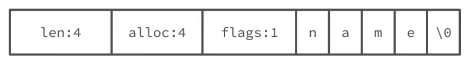


- `len = 4`：当前字符串长度为 4
- `alloc = 4`：总共分配了 4 字节可用空间
- `flags` 的低 3 位 = `SDS_TYPE_8`
- `buf` 末尾自动追加了 `\0`，兼容 C 库函数

### 实例：追加操作（"hi" → "hi,Amy"）

假设我们有一个 `sds s = "hi"`，现在要调用 `sdscat(s, ",Amy")` 追加 4 个字节。

```c
// sds.c —— _sdsMakeRoomFor()，负责扩容的核心逻辑
sds _sdsMakeRoomFor(sds s, size_t addlen, int greedy) {
    size_t avail = sdsavail(s);      // 当前剩余空间
    size_t len = sdslen(s);          // 当前已用长度
    size_t newlen, reqlen;

    if (avail >= addlen) return s;   // 空间足够，直接返回

    reqlen = newlen = len + addlen;  // 至少需要的长度

    if (greedy == 1) {
        // 贪婪模式：多分配一些，避免下次再扩容
        if (newlen < SDS_MAX_PREALLOC)   // SDS_MAX_PREALLOC = 1MB
            newlen *= 2;                 // 小于 1MB 时直接翻倍
        else
            newlen += SDS_MAX_PREALLOC;  // 超过 1MB 后每次多给 1MB
    }
    // ... 然后根据 newlen 重新选择头类型，realloc 内存 ...
}
```

追加前 "hi" 的内存布局（假设 alloc = 2）：

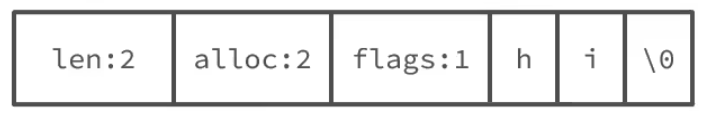


追加 ",Amy" 时发现 `avail = 0`，而 `newlen = 2 + 4 = 6`。由于 `6 < 1MB`，触发**贪婪分配**：`newlen = 6 * 2 = 12`。于是实际分配的空间为 12 字节，alloc 变成 12。

追加后：


之后如果再追加少量字符（总长不超过 12），就不需要再次分配内存了——这正是**内存预分配**的意义。

### SDS 的优势总结

- **O(1) 获取长度**：直接读 `len` 字段，无需遍历。
- **杜绝缓冲区溢出**：每次修改前都会检查 `avail`，不够就 `sdsMakeRoomFor`。
- **减少内存分配次数**：预分配（小于 1MB 翻倍，大于 1MB+1MB）使得频繁追加时很少 realloc。
- **二进制安全**：不再以 `\0` 作为字符串结束标志，而是以 `len` 为准，可以存储任意二进制数据。
- **惰性释放**：缩短字符串时并不立即释放多余空间，而是保留在 `alloc` 中，方便后续再次增长。

## 2. IntSet

IntSet 是 Redis 为「只包含整数的小型 Set」设计的底层存储结构。它的本质是一个基于 C 语言整数数组实现的**有序、唯一、可变长**集合。

### 结构体定义

```c
// intset.h
typedef struct intset {
    uint32_t encoding;   // 编码方式：INTSET_ENC_INT16 / INT32 / INT64
    uint32_t length;     // 当前元素个数
    int8_t contents[];   // 柔性数组，实际存储的元素（类型由 encoding 决定）
} intset;
```

- `encoding` 取值：`INTSET_ENC_INT16`（2 字节）、`INTSET_ENC_INT32`（4 字节）、`INTSET_ENC_INT64`（8 字节）。
- `contents` 虽然声明为 `int8_t[]`，但实际存储的类型由 `encoding` 决定。所有元素在数组中保持**升序排列且不重复**。
- 查找使用**二分查找**，时间复杂度 O(logN)。插入和删除时需要 memmove 挪动元素，复杂度 O(N)。

### 编码自动升级

假设当前 IntSet 中只有 `{1, 2, 3}` 三个小整数，encoding 为 `INTSET_ENC_INT16`（每个元素占 2 字节）。现在要插入 `50000`，这个数超过了 int16 的范围（-32768 ~ 32767），就需要触发编码升级。

升级流程的源码：

```c
// intset.c —— intsetUpgradeAndAdd()
static intset *intsetUpgradeAndAdd(intset *is, int64_t value) {
    uint8_t curenc = intrev32ifbe(is->encoding);
    uint8_t newenc = _intsetValueEncoding(value);  // 确定新编码 → INTSET_ENC_INT32
    int length = intrev32ifbe(is->length);
    int prepend = value < 0 ? 1 : 0;  // 负数插在数组头部，非负数插在尾部

    // 1. 先更新 encoding，再 resize 数组（每个元素空间变大）
    is->encoding = intrev32ifbe(newenc);
    is = intsetResize(is, intrev32ifbe(is->length) + 1);

    // 2. 倒序遍历旧元素，逐个搬移到新位置（倒序避免覆盖）
    while(length--)
        _intsetSet(is, length + prepend,
                    _intsetGetEncoded(is, length, curenc));

    // 3. 将新元素插入头部或尾部
    if (prepend)
        _intsetSet(is, 0, value);
    else
        _intsetSet(is, intrev32ifbe(is->length), value);

    // 4. 更新 length
    is->length = intrev32ifbe(intrev32ifbe(is->length) + 1);
    return is;
}
```

以插入 `50000`（正数，prepend = 0）为例，图解如下：

插入前（INTSET_ENC_INT16）:


升级后（INTSET_ENC_INT32）:


>关键细节：如果插入的是**负数**（如 `-5`），由于负数小于所有非负数，它会被放在头部（prepend = 1），原有元素整体右移一格。升级是**不可逆**的——升级后即使删除了导致升级的那个元素，编码也不会降回去，这也能接受，因为一旦存过大值说明这个集合以后也"大概率"还会再存。

### IntSet 的特点

- **唯一且有序**：二分查找保证去重和查找为 O(logN)。
- **编码升级机制**：从 INT16→INT32→INT64 自动扩展，不浪费空间在小数据上。
- **不适合大量数据**：插入/删除需要移动元素（O(N)），当集合较大时性能下降明显，Redis 会将其转为 HashTable 编码。

## 3. Dict

Dict（字典）是 Redis 最核心的数据结构之一，键值对的增删查改、哈希键的底层存储等，背后都是它。整个 Dict 由三个部分构成。

### 三部分结构

```c
// dict.h
typedef struct dictEntry {
    void *key;                    // 键
    union {
        void *val;
        uint64_t u64;
        int64_t s64;
        double d;
    } v;                          // 值
    struct dictEntry *next;       // 链表解决哈希冲突
} dictEntry;

struct dict {
    dictType *type;               // 类型特定函数（哈希函数、比较、析构等）
    void *privdata;               // 私有数据
    dictEntry **ht_table[2];     // 两个哈希表，ht_table[0] 和 ht_table[1]
    unsigned long ht_used[2];    // 每个哈希表里已有的元素数
    long ht_size_exp[2];         // 每个哈希表的 size = 2^exp
    int16_t rehashidx;           // rehash 进度，-1 表示未在 rehash
    int16_t pauserehash;         // >0 时暂停 rehash
    unsigned bucket_size[2];     // 每个 bucket 的实际大小（内存优化）
};
```

- **dictEntry**：键值对节点，用单向链表解决哈希冲突。
- **dictEntry** 指针数组 `**ht_table[2]`：这是真正的「哈希表」，可理解为 `dictEntry*  bucket数组`。
- **dict**：字典主体，持有两个哈希表、两个 used 计数、rehash 游标等信息。

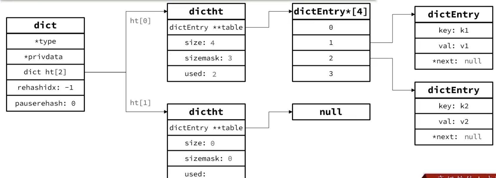

### 索引计算：hash & sizemask

Redis 的哈希表大小始终是 **2 的幂**（通过 `size = 2^exp` 控制）。这样做的好处是可以通过位运算代替取模来定位 bucket：

```
bucket_index = hash(key) & sizemask
```

其中 `sizemask = size - 1`。例如 size = 4，则 sizemask = 3（二进制 `011`），对任意哈希值取低两位即可找到 bucket 位置。

>Redis 使用 `dictGenHashFunction()`（基于 SipHash，内部用 MurmurHash2），将 key 映射为一个 uint64_t。

### 双哈希表

Dict 维护了两个哈希表 `ht_table[0]` 和 `ht_table[1]`。正常情况下只使用 `ht_table[0]`，`ht_table[1]` 是空的。
当需要进行扩容或收缩时，`ht_table[1]` 被创建出来，用于**渐进式 rehash**——一边把 `ht_table[0]` 中的元素迁移到 `ht_table[1]`，一边继续正常服务外部请求。

### 扩容与收缩的触发条件

**扩容条件**（`dictExpandIfNeeded` 中的逻辑）：

- 当**负载因子 ≥ 1** 且没有执行 BGSAVE / BGREWRITEAOF 等后台进程时，Redis 认为现在扩容是安全的，会触发扩容。
- 当**负载因子 > 5**（即 `dict_force_resize_ratio = 5`），即使有后台进程也会强制扩容，因为哈希冲突已经太严重，性能下降不可接受。

>负载因子 = `ht_used / size`，即每个 bucket 平均存放的元素个数。

**收缩条件**：

- 当**负载因子 < 0.1**（即不到 10% 的 bucket 真正有数据），且当前 size 大于初始值 `DICT_HT_INITIAL_SIZE`（通常为 4），就会触发收缩。

扩容时 size 翻倍，收缩时 size 减半，始终保证 size 是 2 的幂。

### Rehash 过程（渐进式）

无论扩容还是收缩，都需要创建新的哈希表，并将旧表中所有 key 重新计算 bucket 索引后插入新表——这个过程叫 **rehash**。

如果一次性完成，对于一个十几万 key 的字典会造成明显的卡顿。所以 Redis 使用**渐进式 rehash**（Incremental Rehashing），把迁移任务分摊到多次操作中：

1. 在 `dictExpand` 中为 `ht_table[1]` 分配新数组，并设置 `rehashidx = 0`，表示 rehash 开始。
2. 每次对字典执行**增删查改**操作时，除了完成本次操作，还会顺带把 `ht_table[0]` 中位于 `rehashidx` 的那条 bucket 链**整条迁移**到 `ht_table[1]`，然后 `rehashidx++`。
3. 新增操作直接写入 `ht_table[1]`，保证 `ht_table[0]` 的元素只会减少不会增加。
4. 当 `rehashidx` 等于 `ht_table[0]` 的 size 时，表示迁移完成。释放 `ht_table[0]`，将 `ht_table[1]` 提升为 `ht_table[0]`，重置 `rehashidx = -1`。
5. 对于长时间没有请求的字典，每个事件循环也会在 `databasesCron` 中执行 **1ms 的 dictRehash**，每次处理 100 个 bucket，逐步消化。

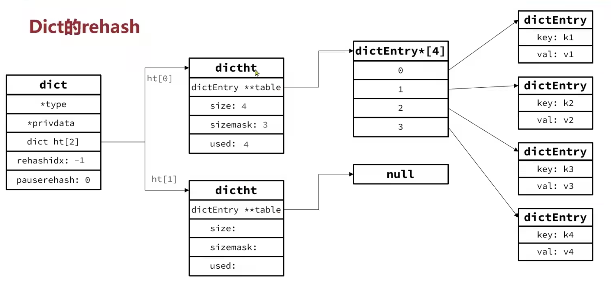
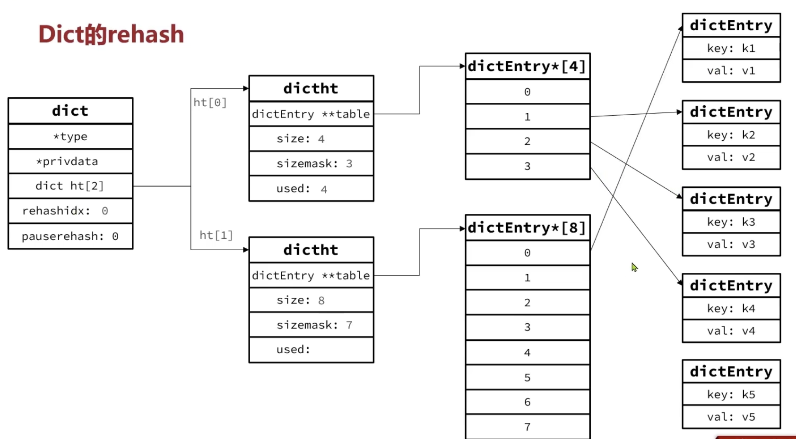
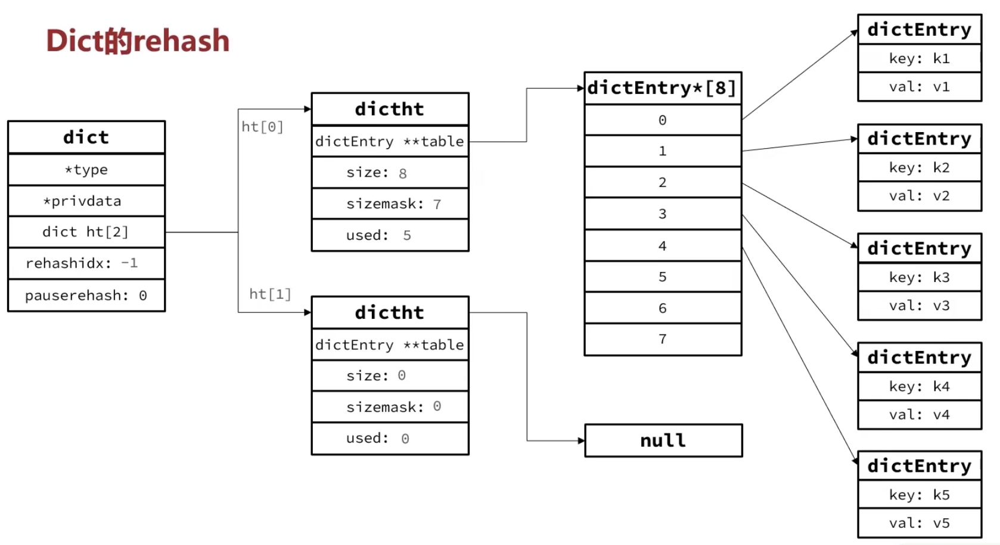

## 4. ZipList

ZipList（压缩列表）是 Redis 为了**极致节省内存**而设计的一种特殊双向链表。它把所有元素压缩到一整块连续内存中，省去了传统链表每个节点所需的 `prev` / `next` 指针开销。

### 整体结构

```
 <zlbytes> <zltail> <zllen> <entry> <entry> ... <entry> <zlend>
```

| 字段 | 大小 | 说明 |
|------|------|------|
| `zlbytes` | uint32_t | 整个 ziplist 占用的总字节数（含自身 4 字节） |
| `zltail` | uint32_t | 最后一个 entry 相对起始位置的偏移量，用于 O(1) 尾部操作 |
| `zllen` | uint16_t | entry 数量，超过 65535 时设为 65535，需遍历获取真实数量 |
| `entry` | 可变 | 每个元素节点，详见下文 |
| `zlend` | uint8_t | 固定值 `255`(0xFF)，标识 ziplist 结束 |

>依托 `zltail`，在尾部进行压入/弹出是 O(1)；依托每个 entry 的 `previous_entry_length`，反向遍历也是 O(1)。但中间插入仍然是 O(N)，因为需要移动后续所有元素。

### Entry 结构

每个 entry 由三部分组成：

```
 <prevlen> <encoding> <entry-data>
```

- **`prevlen`（previous_entry_length）**：前一个 entry 的长度。如果前一个 entry 长度 < 254 字节，`prevlen` 占 **1 字节**直接记录；如果长度 ≥ 254 字节，`prevlen` 占 **5 字节**（首字节固定为 `0xFE`，后 4 字节存实际长度）。这个字段是反向遍历的基础。
- **`encoding`**：编码字段，同时描述了数据类型和长度。Redis 通过首字节的高 2 位来判断类型：
  - **`00`、`01`、`10` 开头 → 字符串编码**：后续位存储字符串长度，长度分三档（≤63 / ≤16383 / ≥16384 字节），编码占 1/2/5 字节，之后紧跟 `entry-data` 存实际字符串内容。
  - **`11` 开头 → 整数编码**：后 2 位区分具体整数类型（int16/int32/int64/24bit/8bit），编码占 3/5/9/4/2 字节，之后紧跟 `entry-data` 存整数值。
  
  一个特殊情形是 `|1111xxxx|`（xxxx 在 0001~1101 之间）——**4 位立即数编码**。它直接把数值 0~12 压缩在 encoding 字节的低 4 位中，值本身就成了编码的一部分，自然不需要额外的 `entry-data`。同理，更大的整数类型（如 int16）的数值仍然需要单独的 `entry-data` 来存放，因为 encoding 字节里只描述了「这是什么类型的整数」，放不下实际数值。
- **`entry-data`**：实际数据内容，在某些整数编码下可能不存在。

### 存储示例

存储 `"ab"` 和 `"bc"` 两个字符串（假设前一个 entry 长度均小于 254）：

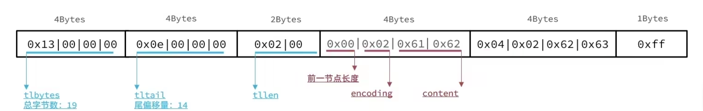

存储数字 `2` 和 `5`（小整数编码，无需 entry-data）：

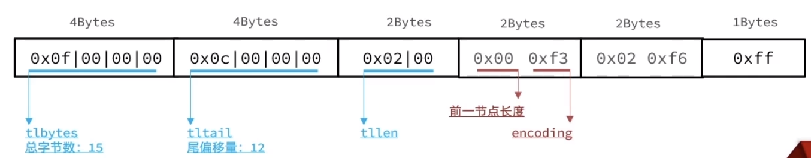

### 连锁更新问题

考虑这样一种情况：ziplist 中有多个长度恰好为 **253 字节** 的 entry，它们的 `prevlen` 都只占 1 字节。现在在头部插入一个 **254 字节以上** 的 entry，导致紧邻它的 entry1 的 `prevlen` 必须从 1 字节膨胀到 5 字节（多出 4 字节），而 entry1 膨胀后又可能让 entry2 的 `prevlen` 跟着膨胀……这种级联效应就是**连锁更新**。

连锁更新在最坏情况下需要连续多次内存 realloc，性能下降明显。但这在现实中极难触发——需要大量恰好在 253 字节临界点附近的连续 entry。因此 Redis 并没有在代码层面做特殊防护，只是意识到这个问题存在。

>**设计取舍：为什么 ZipList 坚持用 prevlen，直到 7.0 才被 Listpack 替代？**
>
>prevlen 不是设计缺陷，而是一个明知故留的权衡。prevlen 放在 entry 头部，反向遍历时只需读当前 entry 的第一个字节就能知道前一个 entry 的长度，代码路径极短。Listpack 的 backlen 则需要往回读 1~5 字节（解析 continuation bits），稍复杂一些。antirez 认为这个简洁性值得用连锁更新的**理论风险**来换——毕竟 Redis 的绝大多数 value 只有几十字节，连续多个"恰好卡在 253"的极端情况几乎不会发生。
>
>那为什么 7.0 最终还是改了？不是因为连锁更新在生产环境爆炸了，而是双通道复制等新特性需要一个对内存块边界更友好的格式，趁着重构顺带清掉了这笔历史债。本质上是「用稍复杂一点的反向遍历，换零连锁更新的完全保证」，在长期维护中后者胜出。

## 5. QuickList

QuickList 是 Redis 3.2 之后 List 类型的底层实现，它在「内存紧凑」和「操作效率」之间找到了平衡。

### 基本结构

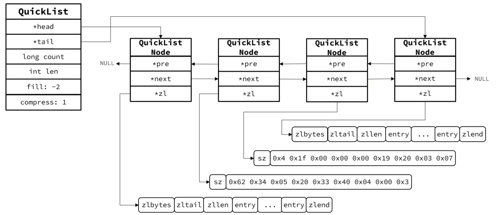

简单来说：**QuickList 是一个双向链表，每个节点是一个 ZipList（新版使用 Listpack）**。外层链表用于快速定位到某个节点，内层的 ziplist/listpack 以紧凑的内存存储实际数据。

### 关键配置项

- **`list-max-listpack-size`**（旧称 `list-max-ziplist-size`）：控制每个内部节点最大占用字节数。默认 -2（8KB）。可设为正数（精确字节限制）或负数（不同优化级别，如 -1 = 4KB，-2 = 8KB，-3 = 16KB，-4 = 32KB，-5 = 64KB）。
- **`list-compress-depth`**：控制 QuickList 的压缩深度。由于链表两端的节点访问频率最高，中间节点可以被 LZF 压缩以节省内存。设为 0 表示不压缩；设为 1 表示首尾各 1 个节点不压缩、中间全压缩；设为 2 表示首尾各 2 个不压缩，以此类推。

```
list-compress-depth = 1:
  [node0 不压缩] → [node1 压缩] → [node2 压缩] → ... → [nodeN 不压缩]
     头                                               尾
```

## 6. SkipList

SkipList（跳表）是 Redis 中 ZSet（有序集合）的底层实现之一（另一个是 Listpack，用于数据量较小时）。它的本质是**一个在有序链表上加了多层索引的数据结构**。

### 与普通链表的区别

- **元素按 score 升序排列**，score 相同时按 ele（成员字符串）字典序排列。
- 每个节点可能包含**多个层级指针**（称为 level），每个 level 的跨度（span）不同，高层指针用来"跳过多余元素"以加速查找。
- 层数随机生成（最高 32 层），跳表的期望查询复杂度为 O(logN)。

### 结构体定义

```c
// server.h
typedef struct zskiplistNode {
    double score;                      // 排序分值
    struct zskiplistNode *backward;    // 后退指针（仅 level 0 使用）
    struct zskiplistLevel {
        struct zskiplistNode *forward; // 本层的前进指针
        unsigned long span;            // 本层跨过的元素个数
    } level[];                         // 柔性数组，每个元素表示一个层级
} zskiplistNode;

typedef struct zskiplist {
    struct zskiplistNode *header, *tail;  // 头尾指针
    unsigned long length;                 // 节点总数
    int level;                            // 当前最高层数
} zskiplist;

typedef struct zset {
    dict *dict;          // 字典：key→score，用于 O(1) 按成员查分值
    zskiplist *zsl;      // 跳表：按 score 排序，用于范围查询
} zset;
```

>ZSet 同时使用 dict 和 skiplist：dict 提供 O(1) 的成员分值查询，skiplist 提供 O(logN) 的范围查询和排序能力。两者存的是同一份数据（指针引用），内存不会翻倍。

### 查询流程示意

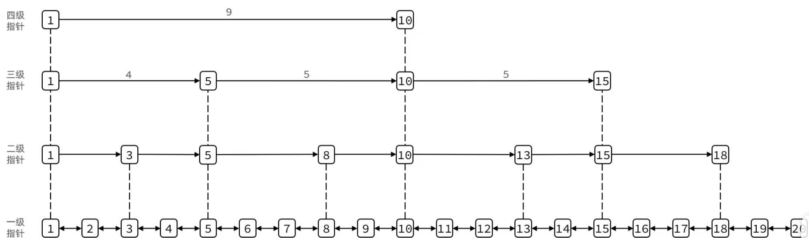

- 查找时从**最高层**开始，如果前进指针指向的节点的 score 小于目标值，就沿着该层前进；如果大于目标值，就下降一层继续查找。
- `span` 记录了两个节点之间在 level 0 上跳过了多少个元素，用于计算排位（rank）。

### 与红黑树的对比

跳表和红黑树的增删查改复杂度都是 O(logN)，但跳表的**实现更简单**：不需要复杂的旋转和变色逻辑，没有红黑树的多种情况分支。此外，跳表天然支持范围查询（直接沿 level 0 遍历），而且可以方便地获取元素的排位（通过 span 累加）。这些特性恰好契合 ZSet 的需求。

## 7. Listpack

Listpack 是 **ZipList 的继任者**，Redis 7.0 起在所有场景中替代了 ZipList。它的定位完全一致——用一块连续内存紧凑存储多个元素，支持双向遍历、两端 O(1) 压入/弹出。区别在于它通过改变 entry 结构，从根本上消除了 ZipList 的**连锁更新**问题。

### 整体结构

```
 <total_bytes> <num_elements> <entry> <entry> ... <entry> <0xFF>
```

| 字段 | 大小 | 说明 |
|------|------|------|
| `total_bytes` | uint32_t | listpack 占用的总字节数（含自身 4 字节） |
| `num_elements` | uint16_t | entry 数量，超过 65535 时取值为 65535，需遍历获取真实值 |
| `entry` | 可变 | 每个元素节点 |
| `0xFF` | uint8_t | 结束标记 |

和 ZipList 的关键差异是：Listpack **不再存 `zltail`**，尾部定位改为从最后一条 entry 的 `backlen` 反向推算，少了一个 4 字节的全局字段。

### Entry 结构 —— 化解连锁更新的核心

```
 <encoding> <data> <backlen>
```

- **`encoding`**：编码字节。高 2 位区分类型：`10` 开头为短字符串（6 位长度，≤63 字节）；`1110` 开头为中字符串（12 位长度，≤4095 字节）；`0` 开头为小整数（7 位无符号，0~127）；`110` 开头为 13 位整数；随后还有 16/24/32/64 位整数编码。与 ZipList 的 encoding 逻辑类似，但编码号不同。
- **`data`**：实际数据内容。对于小整数（7 位编码），值直接嵌在 encoding 中，此部分不存在。
- **`backlen`**：**当前 entry 的总长度**（encoding + data + backlen 本身）。占 1~5 字节，通过每个字节的最高位（continuation bit）表示是否读下一字节。这是替代 ZipList `prevlen` 的关键设计。

### 为什么 Listpack 没有连锁更新

ZipList 的连锁更新根源在于 `prevlen`：entry1 膨胀导致 entry2 的 `prevlen` 也必须膨胀，级联扩散。Listpack 把视角翻了过来——每个 entry 记录的是**自己的长度**（backlen），而不是前一个 entry 的长度。

反向遍历时，从某个 entry 的起始位置往前回退一个 `backlen` 就是前一个 entry 的起点。一个 entry 的 `backlen` 只取决于自身的总大小，与前后 entry 无关，因此任何 entry 的修改都不会触发邻居的连锁连带更新。

```
从 entry3 反向遍历到 entry2：
  entry2_start = entry3_start - entry2_backlen

从 entry2 反向遍历到 entry1：
  entry1_start = entry2_start - entry1_backlen
```

### 与 ZipList 的对比

| 维度 | ZipList | Listpack |
|------|---------|----------|
| 连续内存 | ✓ | ✓ |
| 反向遍历 | 靠 `prevlen`（记录前一个 entry 长度） | 靠 `backlen`（记录当前 entry 长度） |
| 连锁更新 | 存在（prevlen 级联膨胀） | **不存在** |
| 头部字段 | zlbytes / zltail / zllen（10 字节） | total_bytes / num_elements（6 字节） |
| 首次引入 | 远古版本 | Redis 7.0，7.2 起全面替代 |

>本文后续提到"小对象优化用 ZipList 做紧凑存储"的地方，在 Redis 7.0+ 中实际运行时都是 Listpack，但编码思想和应用场景完全一致。

---

## 小结：七种组件分工

| 组件 | 角色 |
|------|------|
| **SDS** | 动态字符串，承载所有文本/二进制值的存储 |
| **IntSet** | 小整数集合，有序、二分查找 |
| **Dict** | 哈希表，O(1) 增删查改，支持渐进式 rehash |
| **ZipList / Listpack** | 紧凑连续内存块，小数据量下的省内存方案 |
| **QuickList** | 双向链表 + Listpack 节点，List 的默认实现 |
| **SkipList** | 多层有序跳表，O(logN) 范围查询和排名 |

这七种组件是 Redis 的全部"积木"。下一章会看到它们如何被组装成对外的五种数据结构。

# 三、RedisObject —— 类型系统的桥接层

第二章讲的是七种存储实现，第四章要讲五种对外数据类型。那么问题来了：**Redis 怎么知道一个 String 该用 INT、EMBSTR 还是 RAW？一个 Set 什么时候用 IntSet、什么时候用 Dict？**

答案就是 RedisObject。它不是存储实现，而是**类型分发器**——用两个 4 位的字段 `type` 和 `encoding`，把「数据类型」映射到「底层实现」。

### 结构体定义

```c
// object.h
struct redisObject {
    unsigned type:4;                    // 4 位：数据类型（OBJ_STRING/OBJ_LIST/...）
    unsigned encoding:4;               // 4 位：底层编码方式（七种组件选其一）
    unsigned refcount : OBJ_REFCOUNT_BITS;  // 引用计数（23 位）
    unsigned iskvobj : 1;              // 是否为 kvobj（键值一体对象）
    unsigned metabits : 8;             // 附加元数据位图（仅在 iskvobj=1 时有效）
    unsigned lru : LRU_BITS;           // 24 位：LRU 时钟或 LFU 计数器
    void *ptr;                         // 8 字节：指向实际数据的指针
};
```

>总计 16 字节。`type` 决定「是什么」，`encoding` 决定「怎么存」，`ptr` 指向真正的存储实现。

### 编码方式一览

Redis 的编码常量定义在 `object.h` 中：

| 编号 | 常量 | 对应组件 | 目前状态 |
|------|------|---------|---------|
| 0 | `OBJ_ENCODING_RAW` | SDS | 使用中 |
| 1 | `OBJ_ENCODING_INT` | 无（ptr 直接存值） | 使用中 |
| 2 | `OBJ_ENCODING_HT` | Dict | 使用中 |
| 3 | `OBJ_ENCODING_ZIPMAP` | — | **已废弃** |
| 4 | `OBJ_ENCODING_LINKEDLIST` | — | **已废弃** |
| 5 | `OBJ_ENCODING_ZIPLIST` | ZipList | **已废弃** |
| 6 | `OBJ_ENCODING_INTSET` | IntSet | 使用中 |
| 7 | `OBJ_ENCODING_SKIPLIST` | Dict + SkipList | 使用中 |
| 8 | `OBJ_ENCODING_EMBSTR` | SDS（嵌入式） | 使用中 |
| 9 | `OBJ_ENCODING_QUICKLIST` | QuickList | 使用中 |
| 10 | `OBJ_ENCODING_STREAM` | Radix Tree + Listpack | 使用中 |
| 11 | `OBJ_ENCODING_LISTPACK` | Listpack | 使用中 |
| 12 | `OBJ_ENCODING_LISTPACK_EX` | Listpack（扩展） | 使用中 |

### lru 字段 —— 内存淘汰的近似 LRU

`redisObject` 中的 `lru`（24 位）字段看起来和类型分发无关，它的职责是**内存淘汰**——当 Redis 使用内存超过 `maxmemory` 上限时，决定哪些 key 优先被清理。

和常见八股题（HashMap + 双向链表实现精确 LRU）不同，Redis 用的是**近似 LRU**。如果给几百万个 key 维护一个全局双向链表，每次访问都要加锁移动节点，内存和 CPU 开销根本扛不住。

实现代码在 `evict.c` 中，思路很简单：

**1. 记录时间戳而非链表指针。** `lru` 存的是一个 24 位的秒级时钟值（`mstime() / 1000`，约 194 天转一圈）。每次访问一个 key 时，`lookupKey()` 顺手把 `lru` 更新为当前时钟——只是一个赋值，O(1)。

**2. 淘汰时采样，不全局排序。** 需要释放内存时，随机取 N 个 key（`maxmemory-samples`，默认 5），计算它们的空闲时间（`当前时钟 - key.lru`），把最久没访问的那些塞进一个大小为 16 的候选池（evictionPool），从中挑最老的那个淘汰。没释放够就继续采样、继续淘汰。

换句话说，它淘汰的不是「全 Redis 最久未访问的 key」，而是「几次随机采样中看起来最旧的 key」。牺牲一点精确度，换来零额外内存和无需全局锁。

淘汰策略由 `maxmemory-policy` 配置，共 10 种：`noeviction`（不淘汰，写操作直接报错）、`volatile-lru` / `allkeys-lru`（近似 LRU，按范围看是否只看有过期时间的 key）、`volatile-lfu` / `allkeys-lfu`（近似 LFU，`lru` 字段改为存访问频率计数器）、`volatile-ttl`（最接近过期的先淘汰）、`volatile-random` / `allkeys-random`（随机淘汰）、以及 `volatile-lrm` / `allkeys-lrm`（LRU 采样后二次筛选的变体）。

>LFU 模式下 `lru` 字段的语义变了：高 16 位存上次衰减时间，低 8 位存对数计数器的访问频率。核心仍然是「用一个 int 字段替代全局链表」。

### 分发逻辑

```
  高层数据类型（type 字段）           底层实现（encoding 字段）
 ─────────────────────────         ───────────────────────────
  String  ────┬──────────────→  INT / EMBSTR / RAW
  List    ────┼──────────────→  QUICKLIST
  Set     ────┼──────────────→  INTSET ──→ HT
  ZSet    ────┼──────────────→  LISTPACK ──→ SKIPLIST
  Hash    ────┼──────────────→  LISTPACK ──→ HT
  Stream  ────┘──────────────→  STREAM

  判断逻辑由 RedisObject 的 encoding 字段驱动，
  每种数据结构的 *.c 文件中各自维护了切换阈值。
```

# 四、五种数据结构

前两章分别拆解了存储组件和类型系统，这一章看最上层——五种对用户暴露的数据结构。它们不是独立的数据结构，而是底层组件经过 RedisObject 的 encoding 分发后，呈现给用户的"最终形态"。理解每种数据结构在什么条件下选用哪种底层编码，是读懂 Redis 性能模型的关键。

## 1. String

String 是 Redis 中最基础的数据类型，一个键对应一个字符串值，值可以是普通文本、整数、二进制数据，最大 512MB。

### 三种内部编码

String 并非总是用 SDS 来存储。根据值的内容和长度，Redis 会选择三种编码之一：

| 编码 | 常量 | 触发条件 | 内部存储方式 |
|------|------|---------|-------------|
| **INT** | `OBJ_ENCODING_INT` (1) | 值可以解析为整数，且范围在 `LONG_MIN` ~ `LONG_MAX` 内 | 指针直接存数值，不额外分配内存 |
| **EMBSTR** | `OBJ_ENCODING_EMBSTR` (8) | 字符串长度 ≤ 44 字节 | RedisObject 和 SDS 在同一块连续内存中，一次分配 |
| **RAW** | `OBJ_ENCODING_RAW` (0) | 字符串长度 > 44 字节 | RedisObject 和 SDS 分别两次分配内存 |

### 编码选择流程（对应源码）

```c
// object.c —— createStringObject()
#define OBJ_ENCODING_EMBSTR_SIZE_LIMIT 44

robj *createStringObject(const char *ptr, size_t len) {
    if (len <= 44)  return createEmbeddedStringObject(ptr, len);  // → EMBSTR
    else             return createRawStringObject(ptr, len);       // → RAW
}

// object.c —— createStringObjectFromLongLongWithOptions()
robj *createStringObjectFromLongLongWithOptions(long long value, ...) {
    // 小整数（0~9999）优先使用共享对象，避免重复分配
    if (value >= 0 && value < 10000)
        return shared.integers[value];

    // 范围内整数直接存 ptr 中
    o->encoding = OBJ_ENCODING_INT;
    o->ptr = (void*)((long)value);   // ptr 不指向内存，直接存数值
}
```

>EMBSTR 的 44 字节限制是精心计算的：`redisObject` 占 16 字节，`sdshdr8` 头占 3 字节，加上 44 字节数据和一个 `\0` 共 64 字节，正好对齐 jemalloc 的 64 字节 arena，一次 `malloc` 即可，分配和释放效率极高。

### 编码的内存布局对比

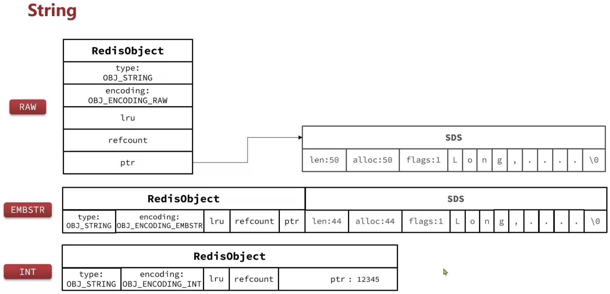

### 编码转换

- **INT → RAW**：对 INT 编码的对象执行 `append` 等字符串操作时，会自动转为 RAW。因为 INT 编码下 `ptr` 存的是数字而非 SDS 指针，无法进行字符串拼接。
- **EMBSTR → RAW**：EMBSTR 分配的内存是只读连续的，任何修改操作（如 `append`）都会触发重新分配，转为 RAW 编码。这是 EMBSTR 的唯一代价——它只适用于不变的短字符串。
- **INT 优化**：当对 String 执行 `incr`、`decr` 等数值操作时，Redis 会尝试将 RAW/EMBSTR 转为 INT。`tryObjectEncoding()` 函数负责这一优化。

## 2. List

List 是一个有序的字符串列表，支持从两端压入/弹出，典型的使用场景是消息队列、最新动态列表等。

### 编码演进

Redis 3.2 是一个分水岭：

| 版本 | 编码方式 |
|------|---------|
| **3.2 之前** | 小数据用 `ZipList`（连续内存块），大数据用 `LinkedList`（真正的双向链表） |
| **3.2 及之后** | 统一切换为 `QuickList`（双向链表 + 每个节点的 Listpack/ZipList） |

旧方案中 ZipList 省内存但中间插入慢，LinkedList 插入快但每个节点都有 `prev`/`next` 指针开销，内存碎片严重。QuickList 折中了二者——外层链表控制粒度，内层 listpack 保持内存紧凑。目前 List 只使用 QuickList 这一种编码，不再需要在小数据量和大数据量之间切换。

### QuickList 的配置回顾

```txt
list-max-listpack-size -2   # 每个内部节点最大 8KB（负数按 4K/8K/16K/32K/64K 分级）
list-compress-depth 0       # 中间节点 LZF 压缩深度，0=不压缩
```

这两个参数在第二章第 5 节已有详细说明，这里不再展开。

### 典型操作

```
LPUSH mylist "world"    →  ["world"]
LPUSH mylist "hello"    →  ["hello", "world"]
RPUSH mylist "!"        →  ["hello", "world", "!"]
LRANGE mylist 0 -1      →  ["hello", "world", "!"]
LPOP mylist             →  "hello"
```

底层对 QuickList 头尾节点的 push/pop 都是 O(1)，而 `LRANGE` 等范围查询需要遍历节点内的 listpack 元素。

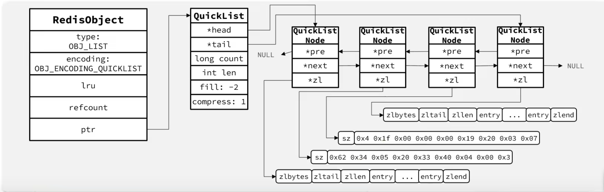

## 3. Set

Set 是一个无序、唯一的字符串集合，支持交集、并集、差集等集合运算，常用于标签系统、共同好友、随机抽奖等场景。

### 编码方式

Set 有两种底层编码，会根据数据特征自动选择：

**1. INTSET（OBJ_ENCODING_INTSET）**

当集合同时满足两个条件时使用：
- 所有元素都是**整数**（或能解析为整数）
- 元素数量 ≤ `set-max-intset-entries`（默认 512）

此时 Set 就是一个 IntSet（见第二章第 2 节），元素有序存储、二分查找去重，非常省内存。

**2. HT（OBJ_ENCODING_HT）**

一旦不满足上述条件（比如加入了非整数元素，或数量超阈值），Set 会转为 HashTable 编码。这里直接复用了 Dict 结构，具体做法是：

- Dict 的 **key** 存集合元素
- Dict 的 **value** 统一设为 `NULL`

也就是说，Set 本质上是一个「只有键没有值」的哈希表。这样做的好处是代码复用度极高——增删查改直接走 Dict 的 `dictAdd`/`dictDelete`/`dictFind`，不需要专门为 Set 写一套哈希表。

### 编码转换触发

```c
// t_set.c —— intset 元素数量超限时转换
static void maybeConvertIntset(robj *subject) {
    if (intsetLen(subject->ptr) > intsetMaxEntries())   // 默认 > 512
        setTypeConvert(subject, OBJ_ENCODING_HT);        // 转为哈希表
}

// t_set.c —— 新元素不是整数时直接转 HT
if (!isSdsRepresentableAsLongLong(value, NULL)) {
    setTypeConvertAndExpand(set, OBJ_ENCODING_HT, ...);
}
```

>注意：INTSET → HT 是**单向的**，转过去后即使把所有非整数元素删掉，也不会降级回 INTSET。这是因为「曾有过非整数，以后大概率还会有」。

### 内存布局示意

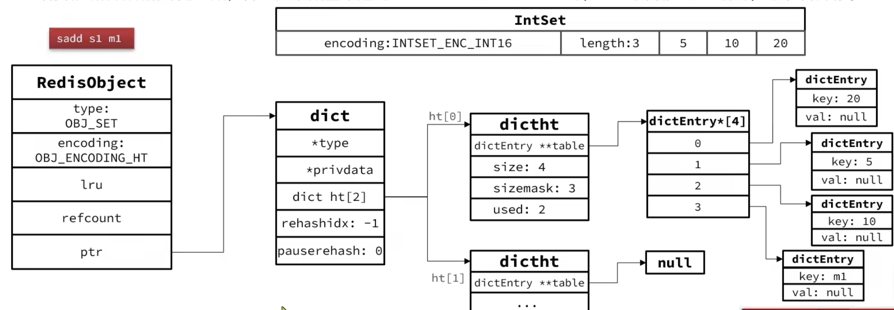

## 4. ZSet

ZSet（Sorted Set，有序集合）在 Set 的基础上为每个元素绑定了一个 **score（分值）**，元素按 score 升序排列，score 相同时按元素字符串字典序排列。典型应用是排行榜、延迟队列、带权重的标签。

### 双结构混合编码（SKIPLIST）

当数据量较大时，ZSet 使用 **两种结构配合**：

```c
typedef struct zset {
    dict *dict;          // 字典：element → score，O(1) 按元素查分值
    zskiplist *zsl;      // 跳表：按 score 排序，O(logN) 范围查询 + 排名
} zset;
```

| 操作 | 用哪个结构 | 复杂度 |
|------|-----------|--------|
| 查某个元素的 score | dict | O(1) |
| 按 score 范围查元素（ZRANGEBYSCORE） | skiplist | O(logN + M) |
| 查某个元素的排名（ZRANK） | skiplist（累加 span） | O(logN) |
| 添加/更新元素 | dict + skiplist 同步操作 | O(logN) |

**为什么不用单一结构？** 仅用 dict 拿不到排序和排名，仅用 skiplist 按元素查分值要从最高层一路找（O(logN)），不如 O(1) 的 dict 快。两者存同一份数据的指针引用，不会造成内存翻倍——dict 的 key 和 skiplist 的 ele 指向同一个 SDS 对象。

### 小对象优化：LISTPACK 编码

当数据量较小时，跳表的层指针和 dict 的 bucket 数组的开销就显得不划算。此时 Redis 切换为紧凑的 **LISTPACK**（旧版叫 ZipList）编码：

```
触发条件（两个都满足才使用 LISTPACK）：
  1. 元素数量 ≤ zset-max-listpack-entries（默认 128）
  2. 每个元素的字符串长度 ≤ zset-max-listpack-value（默认 64 字节）
```

Listpack 本身没有排序和键值对概念，Redis 通过编码约定来解决：

```
Listpack 中 ZSet 元素的排列方式：
  [ele1, score1, ele2, score2, ele3, score3, ...]

即相邻两个 entry 构成一对 (element, score)，按 score 从小到大排列。
```

当插入新元素时，Redis 会遍历 listpack 找到正确的插入位置（保持 score 有序），然后用 memmove 挪出空间。这也是为什么 listpack/zset 只在数据量小时使用——数据量大后 memmove 的开销不可接受。

>**有序是谁的责任？** 一个容易混淆的点：SkipList 的有序是数据结构自带的——节点按 score 链式排列，插入时走高层指针定位，O(logN)。Listpack 本身只是一个紧凑数组，没有排序能力——它的有序是 `t_zset.c` 的插入代码「逐对遍历、比大小、找位置、memmove」强行维系的。两者都服务于 ZSet 的排序需求，只是实现路径不同：前者靠结构，后者靠操作。

### 编码切换

```
LISTPACK → SKIPLIST：
  当插入后元素数量 > 128 或新 ele 长度 > 64 字节时触发升级

SKIPLIST → LISTPACK：
  当删除后剩余元素 ≤ 128 且最大 ele ≤ 64 字节时，会降级回 LISTPACK
  （与 Set 的 INTSET 不同，这里是双向的，通过 zsetConvertToListpackIfNeeded 实现）
```

### 结构示意图

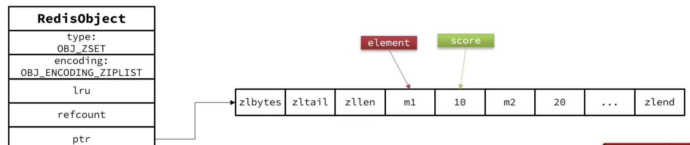

## 5. Hash

Hash 是一个字段-值的映射（field → value），适合存储对象（如用户信息、商品属性）。它与 ZSet 极其相似，本质上是「去掉了排序需求的 ZSet」。

### 与 ZSet 的相似与区别

| 维度 | ZSet | Hash |
|------|------|------|
| 元素结构 | `(element, score)` | `(field, value)` |
| 排序 | 按 score 排序 | **无序** |
| 查单个 | O(1) 或 O(logN) | O(1) |
| 大对象编码 | `SKIPLIST`（dict + skiplist） | `HT`（仅 dict） |
| 小对象编码 | `LISTPACK` | `LISTPACK` |
| 小对象内部排列 | `[ele, score, ele, score, ...]` | `[field, value, field, value, ...]` |

关键差异一句话：**Hash 不需要排序，所以把 ZSet 大对象编码中的 skiplist 去掉，只保留 dict，就是 Hash 的大对象编码。**

### 编码方式

**1. LISTPACK（小数据）**

触发条件（两个都满足）：

- 元素数量 ≤ `hash-max-listpack-entries`（默认 512）
- 每个 field 和 value 的长度 ≤ `hash-max-listpack-value`（默认 64 字节）

Listpack 中相邻两个 entry 为一对 `[field, value]`：

```
Listpack 中 Hash 元素的排列：
  [field1, value1, field2, value2, field3, value3, ...]
```

查找时遍历 listpack，逐个匹配 field，找到后返回紧随其后的 value。因为没有排序需求，插入时直接追加到末尾（或覆盖已有 field 的 value），不需要像 ZSet 那样查找排序位置。

**2. HT（大数据）**

一旦超出小对象阈值，Hash 转为纯粹的 Dict 编码（`OBJ_ENCODING_HT`）。Dict 的 key 存 field，value 存实际值。这是 Hash 最通用的形态——O(1) 查找、O(1) 平均插入。

### 编码转换

Hash 的编码切换逻辑与 ZSet 基本一致，摘出核心代码（`t_hash.c`）：

```c
// t_hash.c —— hashTypeSet()
if (sdslen(field) > server.hash_max_listpack_value ||
    sdslen(value) > server.hash_max_listpack_value)
    hashTypeConvert(db, o, OBJ_ENCODING_HT);       // 单条数据过大 → 转 HT

if (hashTypeLength(o, 0) > server.hash_max_listpack_entries)
    hashTypeConvert(db, o, OBJ_ENCODING_HT);       // 元素总数超限 → 转 HT
```

与 ZSet 不同的是，Hash 从 HT 回退到 LISTPACK 需要显式触发（如 `HSCAN` 扫描检测），不会像 ZSet 那样在每次删除时主动检查降级。

### 五种数据结构总结

```
String  ── INT / EMBSTR / RAW
List    ── QUICKLIST
Set     ── INTSET ──────────→ HT (dict, value=NULL)
ZSet    ── LISTPACK ────────→ SKIPLIST (dict + skiplist)
Hash    ── LISTPACK ────────→ HT (dict, field→value)

         ← 小数据，内存紧凑 →  ← 大数据，查询高效 →
```

>这五种数据结构的设计思想一以贯之：「小对象用连续内存（INT/EMBSTR/LISTPACK/INTSET），大对象用索引结构（RAW/HT/SKIPLIST）」。Redis 用极少的代码量实现了一套自适应的存储引擎，这也是它能在各种场景下同时兼顾内存和性能的原因。

>**一个容易混淆的词：「有序」**
>
>Redis 的 List 和 ZSet 都被描述为"有序"，但含义完全不同：
>- **List 的「有序」= 按插入顺序**。你从左边推就在左边，右边推就在右边，listpack 中 `[ele1, ele2, ele3]` 就是先后插入的次序。两端 push/pop 直接操作头尾，不需要比较内容。
>- **ZSet 的「有序」= 按 score 数值排序**。每个元素带一个 score（`double` 类型），元素之间比大小，按升序排列。插入时要找到正确的 score 位置塞进去。
>
>前者是"先后有序"，后者是"大小有序"。解决的是两类完全不同的问题。

# 五、Redis网络模型

## 1. Linux五种阻塞模型

### (1) 阻塞IO

用户进程调用 `recvfrom` 后，内核等待数据到达，数据到达后内核将数据从内核空间拷贝到用户空间，整个过程用户线程一直处于阻塞状态（让出 CPU，被内核挂起），两个阶段全部阻塞。

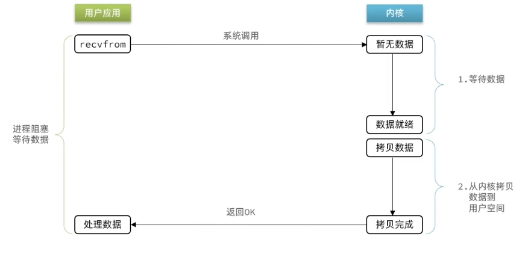

### (2) 非阻塞IO

用户进程反复调用 `recvfrom`，如果没有数据，内核立即返回错误码（`EAGAIN`），不会挂起线程。反复轮询虽然让第一阶段不再阻塞，但如果写成忙等会严重浪费 CPU。数据到达后，第二阶段拷贝数据时线程依然是阻塞的。忙等空转就是它不如 IO 多路复用的根本原因。

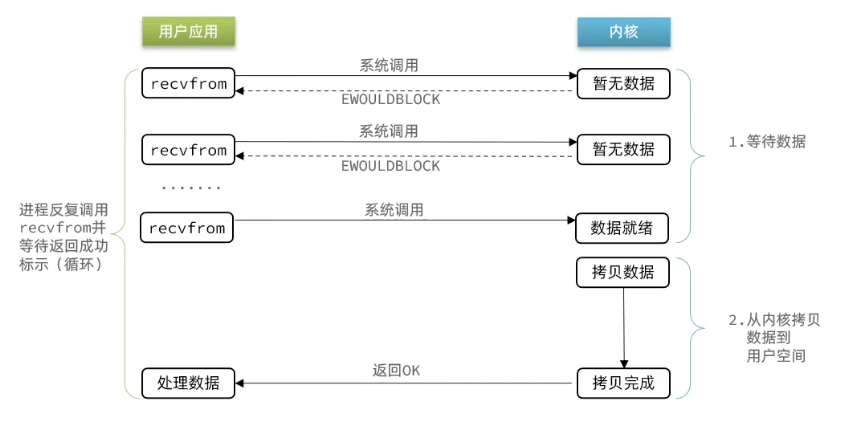


### (3) IO多路复用

**FD**（File Descriptor，文件描述符）是 Linux 中一切 I/O 操作的句柄——每个 socket 连接对应一个 fd。IO 多路复用的核心思想是：**单个线程同时监听多个 fd，哪个先就绪就先处理哪个，避免对每个 fd 的无意义等待。** 线程阻塞在 `select`/`poll`/`epoll` 上，一旦有 fd 可读或可写，内核就唤醒线程，线程再去对就绪的 fd 执行读写。

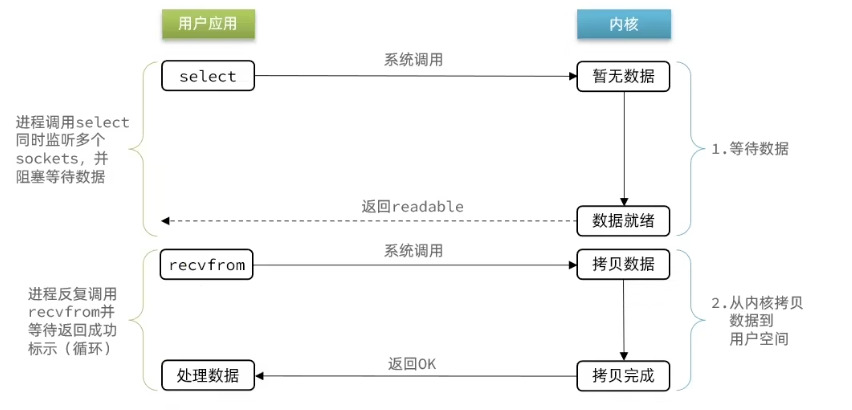

监听 fd 的方式经历了三代演进：

**select**：将用户态的 `fd_set`（bitmap，默认上限 1024）拷贝进内核，内核遍历全部 fd 检查就绪状态，再拷回用户态，用户再遍历一遍才能找到就绪的 fd。**两次拷贝 + 两次 O(N) 遍历**，连接数一多性能急剧下降。

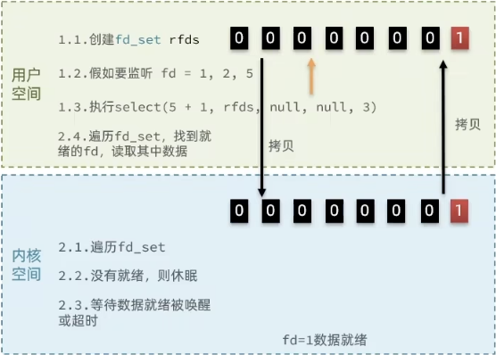

**poll** 对 select 做了最直接的改进：用 `struct pollfd` 数组替代固定大小的 bitmap，破除了 1024 限制。但内核和用户态依然要做 O(N) 遍历。


**epoll** 在 Linux 2.6 引入，三个函数分工：
- `epoll_create`：创建 epoll 实例，内核分配 eventpoll 对象
- `epoll_ctl(ADD/MOD/DEL)`：将 fd 注册进内核的红黑树，O(logN)
- `epoll_wait`：阻塞等待，直接从**就绪链表**上取就绪的 fd，O(1)，只返回有事件的 fd，无需遍历全量

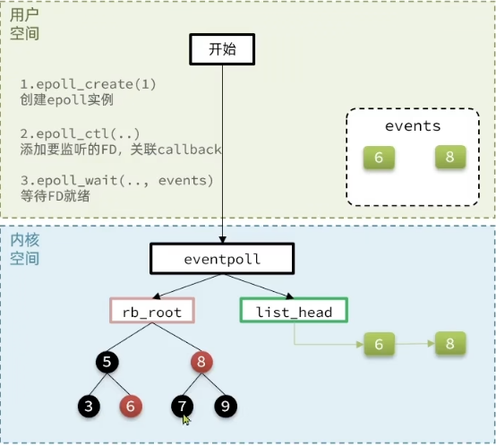

**epoll 的 LT 和 ET 模式**：
- **LT（Level Triggered，水平触发，默认）**：只要 fd 缓冲区还有数据，下次 `epoll_wait` 仍会通知，编程简单不易丢事件。
- **ET（Edge Triggered，边缘触发）**：只在 fd 状态从"无数据"变"有数据"的瞬间通知一次，必须配合非阻塞 IO 一次性读完（循环 read 直到返回 `EAGAIN`），否则剩余数据可能永远丢失。优点是减少重复通知，高并发下性能更好。

**基于 epoll 模式的 web 服务的基本流程**：

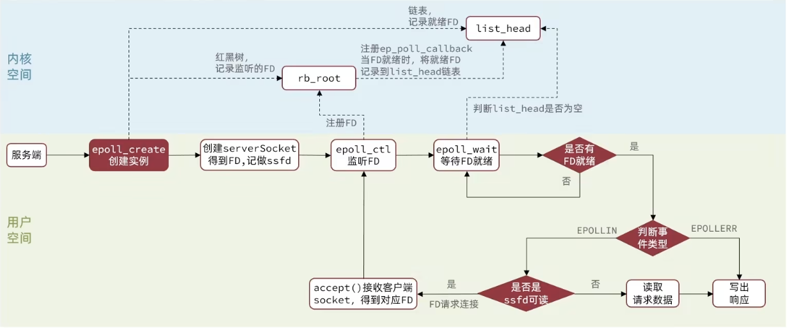

```
socket() → bind() → listen()           // 创建监听 socket
epoll_create()                          // 创建 epoll 实例
epoll_ctl(ADD, listen_fd)               // 注册监听 fd
while (1) {
    n = epoll_wait();                   // 阻塞等待事件
    for (i = 0; i < n; i++) {
        if (fd == listen_fd) {
            conn_fd = accept();         // 新连接
            set_nonblocking(conn_fd);   // 设为非阻塞
            epoll_ctl(ADD, conn_fd);    // 注册新 fd
        } else {
            read(fd);                   // 非阻塞读
            process();
            write(fd);                  // 写回响应
        }
    }
}
```

### (4) 信号驱动IO

预先注册 `SIGIO` 信号处理函数后立即返回，进程不阻塞。数据就绪时内核发送 `SIGIO` 信号，进程在信号处理函数中调用 `recvfrom` 完成拷贝（第二阶段仍阻塞）。编程复杂度高，多连接下信号排队和竞态难以处理，Redis 未采用。

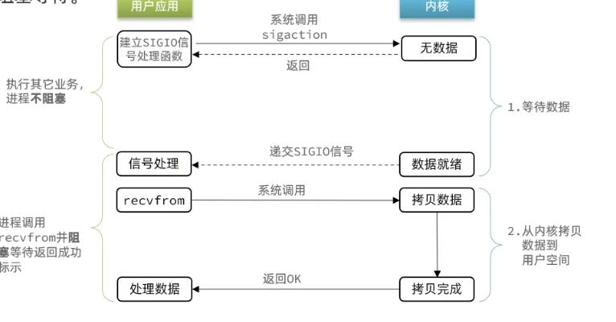

### (5) 异步IO

调用 `aio_read` 后立即返回，**两个阶段均由内核完成**——数据直接拷贝到用户指定的 buffer，完成后内核通知用户。全程不阻塞。但 Linux 原生 AIO 对 socket 支持有限（主要面向文件 IO），实际应用极少。

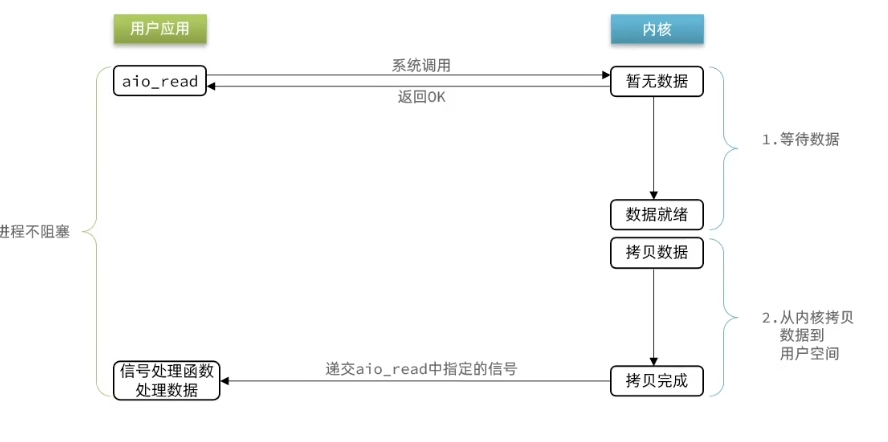

## 2. Redis网络模型

### 单线程还是多线程？

分两个层面回答：

- **核心命令处理**：始终单线程。从 `readQueryFromClient` 读命令 → `processCommand` 解析执行 → `addReply` 写回复，整条链路在主线程的事件循环中串行完成。这意味着不存在两个命令同时修改同一个 key 的竞争问题，所有数据结构无需加锁。
- **整个 Redis 进程**：6.0 起引入了 IO 线程（`io-threads` 配置项），专门把网络读写的 CPU 密集部分分摊到多个线程，但命令执行永远在主线程。

### 为什么选择单线程？

1. **CPU 不是瓶颈**。Redis 纯内存操作，单个命令执行时间通常是微秒级。瓶颈在内存带宽和网络 I/O，不是 CPU。
2. **避免锁开销**。如果多线程并发执行命令，Dict、SkipList 等核心结构都需要加锁，锁竞争的开销可能超过并行收益——毕竟每个命令本身就几微秒，加锁解锁可能也几微秒。
3. **代码简单可靠**。单线程意味着没有竞态条件，没有死锁。早期可能只是 antirez 的个人偏好，但事实上这个选择让 Redis 的核心代码保持了极高的可维护性。

### 事件循环的核心源码

Redis 的网络模型源码分三层：`ae` 抽象层 → epoll 实现层 → 上层网络处理。

```c
// ae.c —— 主循环
void aeMain(aeEventLoop *eventLoop) {
    eventLoop->stop = 0;
    while (!eventLoop->stop) {
        aeProcessEvents(eventLoop, AE_ALL_EVENTS |
                                   AE_CALL_BEFORE_SLEEP |
                                   AE_CALL_AFTER_SLEEP);
    }
}

// ae.c —— 单次循环
int aeProcessEvents(aeEventLoop *eventLoop, int flags) {
    // 1. beforeSleep: 过期键清理、AOF刷盘、回复写入、IO线程任务分发
    if (eventLoop->beforesleep && (flags & AE_CALL_BEFORE_SLEEP))
        eventLoop->beforesleep(eventLoop);

    // 2. 阻塞等待 fd 就绪（Linux 下 → epoll_wait）
    numevents = aeApiPoll(eventLoop, tvp);

    // 3. afterSleep
    if (eventLoop->aftersleep && flags & AE_CALL_AFTER_SLEEP)
        eventLoop->aftersleep(eventLoop);

    // 4. 逐个处理就绪 fd 的读写回调（→ readQueryFromClient / sendReplyToClient）
    for (j = 0; j < numevents; j++) {
        if (mask & AE_READABLE)  fe->rfileProc(eventLoop, fd, ...);
        if (mask & AE_WRITABLE) fe->wfileProc(eventLoop, fd, ...);
    }

    // 5. 处理到期的定时事件（serverCron 等）
    processTimeEvents(eventLoop);
}
```

一次事件循环的完整时序：

```
 ┌──────────────────────────────────────────────────────────┐
 │  aeProcessEvents 单次迭代                                 │
 │                                                          │
 │  beforeSleep()        epoll_wait()      处理就绪fd+定时器  │
 │  ┌──────────────┐   ┌──────────┐    ┌──────────────┐    │
 │  │ 过期键清理    │   │ 阻塞等待  │    │ 读客户端命令   │    │
 │  │ AOF 刷盘     │──→│ fd就绪或  │───→│ 执行命令      │    │
 │  │ 回复写入      │   │ 超时     │    │ 写回复        │    │
 │  │ IO线程分发    │   │          │    │ serverCron   │    │
 │  └──────────────┘   └──────────┘    └──────────────┘    │
 │  不阻塞                阻塞            不阻塞              │
 └──────────────────────────────────────────────────────────┘
```

Redis 启动完毕后在 `main()` 最后一行执行 `aeMain(server.el)`，进入上述死循环直到进程退出。

### 一条请求的完整生命周期

```
  1. client 连接 → TCP 三次握手
  2. epoll_wait 检测到 listen_fd 可读
  3. acceptTcpHandler → accept() → createClient()
     - 将 conn_fd 设为 O_NONBLOCK
     - 注册 AE_READABLE 回调 → readQueryFromClient
  4. 客户端发送 "GET mykey\r\n"
  5. epoll_wait 检测到 conn_fd 可读
  6. readQueryFromClient():
     - read(fd, buf, 16KB)  ← 非阻塞读
     - 解析 RESP 协议
  7. processCommand():
     - lookupKey() 查 kvstore 找 redisObject
     - 检查过期、权限
     - call() 执行命令处理函数
  8. addReply() → 回复数据写入 client 的 reply buffer
  9. beforeSleep() 中 handleClientsWithPendingWrites():
     - writeToClient() 把 reply buffer 数据写回 socket
     - 如果 socket 缓冲区满没写完，注册 AE_WRITABLE 回调等下次继续写
```

### Redis 6.0+ 的多线程网络模型

IO 线程只做网络读写和协议解析，**不执行命令**。实现代码在 `iothread.c`：

```c
// iothread.c —— 每个 IO 线程内部也是独立的 ae 事件循环
void *IOThreadMain(void *ptr) {
    IOThread *t = ptr;
    aeSetBeforeSleepProc(t->el, IOThreadBeforeSleep);
    aeMain(t->el);
    return NULL;
}

// iothread.c —— 初始化 IO 线程池
void initThreadedIO(void) {
    if (server.io_threads_num <= 1) return;
    server.io_threads_active = 1;

    for (int i = 1; i < server.io_threads_num; i++) {
        IOThread *t = &IOThreads[i];
        t->el = aeCreateEventLoop(server.maxclients + CONFIG_FDSET_INCR);
        // 主线程与 IO 线程通过 eventfd 通信
        aeCreateFileEvent(t->el, getReadEventFd(t->pending_clients_notifier),
                          AE_READABLE, handleClientsFromMainThread, t);
        pthread_create(&t->tid, NULL, IOThreadMain, (void *)t);
    }
}
```

架构示意：

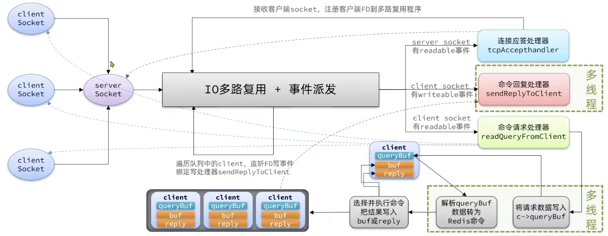

主线程通过 `assignClientToIOThread(c)` 把客户端分配给某个 IO 线程来处理读写。IO 线程完成读写和协议解析后，通过 eventfd 通知主线程，主线程在 `beforeSleep` 中调用 `handleClientsFromIOThread` 取回结果并执行命令。一句话：**命令执行永不并发，网络读写可以并行。**

# 六、Redis通信协议

## 1. RESP协议

Redis 的客户端和服务端之间使用 **RESP**（REdis Serialization Protocol）协议通信。它用纯文本形式传输，人类可读，解析简单，但同时足够紧凑。

### 五种基本数据类型（RESP2）

RESP 通过每行第一个字节区分数据类型：

| 首字节 | 类型 | 格式 | 示例 |
|--------|------|------|------|
| `+` | Simple String | `+内容\r\n` | `+OK\r\n` |
| `-` | Error | `-错误信息\r\n` | `-ERR unknown command\r\n` |
| `:` | Integer | `:数字\r\n` | `:1000\r\n` |
| `$` | Bulk String | `$字节数\r\n内容\r\n` | `$5\r\nhello\r\n` |
| `*` | Array | `*元素个数\r\n各元素...` | `*2\r\n$3\r\nGET\r\n$5\r\nmykey\r\n` |

>RESP3（Redis 6 引入）扩展了 `~`（Set）、`%`（Map）、`#`（Bool）、`,`（Double）、`(`（Big Number）、`=`（Verbatim String）、`|`（Attribute）、`_`（Null）等类型，但核心思想不变：**首字节决定类型，`\r\n` 分隔**。

### 请求与响应示例

客户端发送一个 `SET` 命令：

```
*3\r\n            ← 数组，共 3 个元素
$3\r\n            ← 第 1 个元素，3 字节
SET\r\n           ← "SET"
$5\r\n            ← 第 2 个元素，5 字节
mykey\r\n         ← "mykey"
$5\r\n            ← 第 3 个元素，5 字节
Hello\r\n         ← "Hello"
```

服务端返回：

```
+OK\r\n           ← 简单字符串，表示成功
```

一个 `GET` 命令：

```
客户端：*2\r\n$3\r\nGET\r\n$5\r\nmykey\r\n
服务端：$5\r\nHello\r\n       ← 批量字符串，5 字节 "Hello"
```

### RESP 在源码中的处理

`resp_parser.h` 中定义了完整的解析器回调。每种数据类型对应一个回调函数：`simple_str_callback`（`+`）、`error_callback`（`-`）、`long_callback`（`:`）、`bulk_string_callback`（`$`）、`array_callback`（`*`），解析完成后由上层 `processCommand` 取出 `argc`/`argv` 执行对应命令。

# 七、Redis内存策略

Redis 的内存管理涉及两个层面：键的**过期删除**（主动的还是人为设的 TTL）和内存满时的**淘汰驱逐**（不要和过期混淆）。两者分别回答"怎么删到期 key"和"满了怎么办"。

## 1. 过期策略

Redis 的键可以设置 TTL（Time To Live），到期后需要被删除。如果只用一个单一的删除机制，要么太慢（累积太多过期 key），要么太耗 CPU（不断扫描）。所以 Redis 采用了**惰性删除 + 定期删除**的组合策略。

### 惰性删除（Lazy Expiration）

每次访问一个 key 时，先检查它是否过期。如果已过期，当场删除并返回空。核心函数是 `expireIfNeeded()`，在 `lookupKey()` 中被调用。

优点是不浪费额外 CPU，缺点是如果某个过期 key 再也没被访问，它就永远占着内存。

### 定期删除（Active Expiration）

为了解决惰性删除的"垃圾堆积"问题，Redis 周期性主动扫描过期键，分两种模式：

**SLOW 模式**（慢速周期）：

- 由 `serverCron` 周期性触发（`hz` 频率，默认每秒 10 次）
- 每次从若干个数据库中随机采样，检查并删除过期 key
- 单次执行时间有上限：`ACTIVE_EXPIRE_CYCLE_SLOW_TIME_PERC`（默认 25%）的 CPU 时间
- 如果一轮没扫完所有数据库，下次继续从未完成的数据库开始

**FAST 模式**（快速周期）：

- 由 `beforeSleep` 触发，在事件循环的每次迭代中执行（频率远高于 SLOW）
- 单次执行时间上限仅 1ms（`ACTIVE_EXPIRE_CYCLE_FAST_DURATION`）
- 但如果上次 SLOW 周期没有因为超时而退出（说明过期 key 不多），或者过期比例低于阈值，FAST 模式会直接跳过

两种模式协作的逻辑（`expire.c`）：

```
  FAST mode（高频短跑）     SLOW mode（低频长跑）
  ┌────────────┐           ┌────────────────────┐
  │ 每次事件循环 │           │ 每次 serverCron     │
  │ 最多耗时 1ms │           │ 最多占 25% CPU 时间 │
  │ 过期少时跳过 │           │ 持续扫描所有数据库   │
  └────────────┘           └────────────────────┘
       ↑                          ↑
       └──── 共同保证过期 key 不会堆积 ────┘
```

>惰性删除保证「访问时一定删」，定期删除保证「不访问也最终会删」。两者合力，在 CPU 开销和内存回收之间取得平衡。

## 2. 淘汰策略

淘汰（Eviction）和过期是两回事：过期是 key 到了 TTL 被删，淘汰是**内存满了不得不删**。

当 Redis 使用的内存达到 `maxmemory` 上限时，触发淘汰。策略由 `maxmemory-policy` 配置，共 10 种：

| 分类 | 策略 | 选择范围 | 淘汰标准 |
|------|------|---------|---------|
| 不淘汰 | `noeviction` | — | 写操作直接报错 |
| LRU | `volatile-lru` | 仅有过期时间的 key | 近似 LRU |
| LRU | `allkeys-lru` | 所有 key | 近似 LRU |
| LFU | `volatile-lfu` | 仅有过期时间的 key | 近似 LFU |
| LFU | `allkeys-lfu` | 所有 key | 近似 LFU |
| 随机 | `volatile-random` | 仅有过期时间的 key | 随机 |
| 随机 | `allkeys-random` | 所有 key | 随机 |
| TTL | `volatile-ttl` | 仅有过期时间的 key | 最接近过期 |
| LRM | `volatile-lrm` | 仅有过期时间的 key | LRU + 采样后二次筛选 |
| LRM | `allkeys-lrm` | 所有 key | LRU + 采样后二次筛选 |

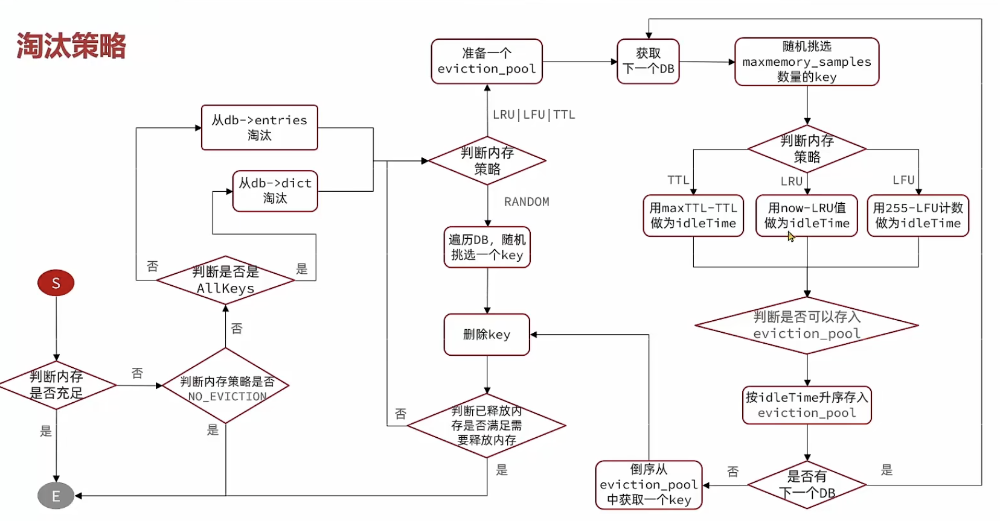

>近似 LRU/LFU 的具体实现在 `redisObject` 的 `lru` 字段（24 位时钟/计数器）和 `evict.c` 的采样淘汰机制中已有详细说明，见第三章「lru 字段 —— 内存淘汰的近似 LRU」一节。

# 八、持久化

Redis 是内存数据库，数据在断电后会丢失。持久化就是把内存中的数据保存到磁盘上，重启时再加载回来。Redis 提供了两种机制：**RDB**（快照）和 **AOF**（日志），二者可单独使用也可组合使用。

## 1. RDB（Redis Database）

RDB 是**全量快照式持久化**。在某个时间点，把内存中所有数据序列化成一个二进制文件（默认 `dump.rdb`），恢复时直接读取这个文件重建整个数据集。

### 触发方式

**手动触发**：

- `SAVE`：由主线程执行保存，保存期间 Redis 不能处理任何请求，适合停机维护场景。
- `BGSAVE`：`fork()` 出一个子进程，子进程负责写入 RDB 文件，主进程继续处理请求，不阻塞服务。

**自动触发**（通过配置 `save` 参数）：

```
save 900 1     ← 900 秒内至少 1 次修改
save 300 10    ← 300 秒内至少 10 次修改
save 60 10000  ← 60 秒内至少 10000 次修改
```

满足任一条件即自动触发 `BGSAVE`。

### BGSAVE 的 fork 机制

```
  主进程                     子进程
  ┌────────┐               ┌──────────┐
  │ 处理请求 │  ──fork()──→  │ 遍历内存   │
  │ 继续干活 │              │ 写入RDB文件│
  └────────┘               └──────────┘
       ↑
  共享同一份内存页（Copy-on-Write）
  主进程写某个页时，内核才复制那一页
```

得益于 Linux 的 **Copy-on-Write**，fork 时并不立即复制全部内存，主进程和子进程共享同一份物理内存页。只有当主进程修改了某个页时，内核才会把该页复制给子进程。因此内存占用峰值 ≈ 原始数据 + 写入期间的增量修改。

### RDB 的优缺点

| 优点 | 缺点 |
|------|------|
| 文件紧凑，适合灾备和迁移 | 两次快照之间的数据可能丢失 |
| 恢复速度快，直接加载二进制 | 大数据量下 fork 耗时长，可能造成短暂卡顿 |
| fork 子进程写入，主进程不阻塞 | 频繁 fork 会消耗 CPU |

## 2. AOF（Append Only File）

AOF 是**增量日志式持久化**。把每一条修改命令以 RESP 协议格式追加写入日志文件，重启时逐条回放命令来还原数据。

### 刷盘策略

核心配置是 `appendfsync`，控制 `write()` 之后何时执行 `fsync()`（真正落盘）：

| 值 | 行为 | 安全性 | 性能 |
|----|------|--------|------|
| `always` | 每执行一条修改命令立即 fsync | 最高，最多丢一条 | 最慢 |
| `everysec` | 每秒 fsync 一次（默认） | 最多丢 1 秒数据 | 折中，生产环境首选 |
| `no` | 不主动 fsync，交给 OS 决定 | 可能丢几秒数据 | 最快，但不推荐 |

源码 `flushAppendOnlyFile()` 中做了区分：`AOF_FSYNC_ALWAYS` 每次都同步，`AOF_FSYNC_EVERYSEC` 靠后台 `bio` 线程每秒刷盘。

### AOF 重写（Rewrite）

AOF 文件会随运行时间不断膨胀。例如一个计数器被 INCR 了 100 次，AOF 中有 100 条记录，但最终值其实只需要一条 `SET counter 100`。重写就是创建一个新的 AOF 文件，用**最少命令集**描述当前数据库状态。

触发条件：

```
auto-aof-rewrite-percentage 100   ← 文件大小比上次重写后增长 100%
auto-aof-rewrite-min-size 64mb    ← 文件至少 64MB 才考虑重写
```

重写同样通过 fork 子进程执行（`rewriteAppendOnlyFileBackground()`），不影响主进程对外服务。重写期间新产生的修改命令同时写入旧的 AOF 文件和 AOF 重写缓冲区，等子进程完成后，再把缓冲区内容追加到新文件末尾，原子性地切换（rename）过去。

### AOF 的优缺点

| 优点 | 缺点 |
|------|------|
| 最多丢失 1 秒数据 | 文件体积比 RDB 大 |
| 文件是 RESP 文本，可读可编辑 | 恢复速度比 RDB 慢（逐条回放） |
| rewrite 机制控制文件膨胀 | `always` 策略下性能开销大 |

## 3. RDB + AOF 混合使用

Redis 4.0 引入了混合模式（`aof-use-rdb-preamble yes`）。AOF 重写时，子进程先把当前数据以 RDB 格式写入 AOF 文件头，再把后续的增量命令以 AOF 格式追加。结果是：**前半段的 RDB 部分加载快，后半段的 AOF 部分保证数据完整性**。生产环境推荐开启。

```
混合 AOF 文件结构:
 ┌──────────────┬────────────────────────┐
 │ RDB 格式快照  │ AOF 增量命令（RESP文本） │
 │  (二进制)     │  重写之后的修改命令      │
 └──────────────┴────────────────────────┘
```

# 九、事务

## 1. 事务的实现

Redis 的事务和关系型数据库的事务**完全不同**——没有隔离级别，没有回滚，不做行锁。它的语义很简单：**把一组命令打包，按顺序串行执行，执行期间不插入其他客户端的命令**。

三个核心命令：

- `MULTI`：开启事务，标记客户端进入事务状态（`CLIENT_MULTI` 标志位）
- `EXEC`：执行队列中所有命令
- `DISCARD`：放弃事务，清空队列

源码流程（`multi.c`）：

```
  MULTI → 客户端设置 CLIENT_MULTI 标志
  之后的每个命令 → 不执行，而是加入 c->mstate.commands 队列
  每次收到命令 → addReply(c, shared.queued)  告诉客户端"已排队"
  EXEC → 遍历队列，逐个 call() 执行
  DISCARD → 清空队列，取消 CLIENT_MULTI 标志
```

```c
// multi.c —— 事务中的命令不执行，只排队
void queueMultiCommand(client *c, uint64_t cmd_flags) {
    multiCmd *mc;
    // ...
    mc = &c->mstate.commands[c->mstate.count];
    mc->cmd = c->cmd;
    mc->argv_len = c->argv_len;
    // 复制参数、记录命令 —— 但不执行
    c->mstate.count++;
}

// multi.c —— EXEC 时批量执行
void execCommand(client *c) {
    // 检查是否被 WATCH 破坏
    if (c->flags & (CLIENT_DIRTY_CAS | CLIENT_DIRTY_EXEC)) {
        discardTransaction(c);
        return;  // 事务中止
    }
    // 逐条执行队列中的命令
    for (j = 0; j < c->mstate.count; j++) {
        call(c, c->mstate.commands[j].cmd);
    }
}
```

## 2. 原子性的真实含义

Redis 事务的原子性，指的是**执行期间不被打断**——`MULTI` 和 `EXEC` 之间排队的命令会一口气全部执行完，不会插入其他客户端的命令。但它**不保证事务中某条命令失败后回滚前面的成功命令**。

举例：

```
MULTI
SET key1 "a"
INCR key1       ← 对字符串执行 INCR，会失败（类型错误）
SET key2 "b"
EXEC
```

结果：`key1` 被设为 `"a"`，`INCR key1` 报错，但 `key2` 仍然被设为 `"b"`。前面的 `SET key1 "a"` 不会因为后面 `INCR` 失败而回滚。Redis 的设计哲学是：编程错误应该在开发阶段暴露，不应该依赖生产环境的运行时回滚。

## 3. WATCH —— 乐观锁

`WATCH key` 可以监视一个 key。如果在 `WATCH` 之后、`EXEC` 之前，被监视的 key 被其他客户端修改了，整个事务会被中止（返回 `nil`）。

这是 Redis 的**乐观锁**机制：不阻止别人写，但在提交时检查版本是否变了。常用于实现原子性的"检查后操作"（比如余额扣减前检查余额是否足够）。

```
WATCH balance
GET balance        ← 假设返回 100
MULTI
DECRBY balance 50
EXEC              ← 如果 balance 在 WATCH 后被别人改了，这里返回 nil
```

源码中通过 `c->watched_keys` 列表跟踪，被监视的 key 被修改时会设置 `CLIENT_DIRTY_CAS` 标志位，`EXEC` 检测到该标志位后中止执行。

# 十、主从复制

## 1. 复制的意义

单机 Redis 有 QPS 上限，且存在单点故障风险。主从复制的核心目标：
- **读写分离**：主节点处理写请求，多个从节点处理读请求，分摊读压力
- **数据冗余**：从节点持有完整数据副本，主节点宕机后可接管
- **高可用基础**：配合哨兵（Sentinel），实现自动故障转移

## 2. 复制流程

Redis 的复制分为**全量同步**和**部分同步**两个阶段。

### 全量同步（Full Resynchronization）

初次连接或复制信息丢失时触发，流程如下：

```
  Slave                          Master
   │                                │
   │──── PSYNC ? -1 ──────────────→│   (首次连接，不知道任何 offset)
   │                                │
   │←── FULLRESYNC <replid> <offset>│   告诉 Slave "我们要全量同步"
   │                                │
   │                                │   Master 执行 BGSAVE，生成 RDB
   │                                │   ︙
   │←── 发送 RDB 文件 ─────────────→│
   │                                │
   │  加载 RDB，重建数据              │
   │                                │
   │←── 发送 RDB 期间的增量命令 ─────│   (replication buffer)
   │                                │
   │  执行增量命令，追上最新状态       │
```

1. Slave 发送 `PSYNC ? -1`（`?` 表示未知 master，`-1` 表示没有 offset）
2. Master 返回 `FULLRESYNC` 和自己的 replid + offset
3. Master 执行 `BGSAVE` 生成 RDB，发送给 Slave
4. RDB 生成期间的写操作暂存在 replication buffer 中，RDB 发完后一并发送
5. Slave 先加载 RDB，再执行增量命令，之后进入命令传播阶段

### 部分同步（Partial Resynchronization）

在连接短暂断开后重连时，如果条件满足，可以避免全量同步：

```
  Slave                          Master
   │                                │
   │── PSYNC <replid> <offset> ──→│
   │                                │
   │                             检查 repl_backlog 中是否还有 offset 位置的数据
   │                                │
   │←── CONTINUE ────────────────│   (在 backlog 中找到了，只补发差额)
   │                                │
   │←── 发送 offset 之后的增量 ────│
```

部分同步依赖 Master 的 **replication backlog**（默认 1MB 的环形缓冲区）。Master 会将每个写操作同时写入 backlog。如果 Slave 携带的 offset 仍然在 backlog 范围内，就可以只补发差额；如果已经超出范围（Slave 断开太久，backlog 中对应位置的数据被覆盖了），则降级为全量同步。

```c
// replication.c —— backlog 定义
server.repl_backlog->offset = server.master_repl_offset + 1;
server.repl_backlog->histlen = 0;  // 当前 backlog 存储的数据长度
// 当 histlen > repl_backlog_size 时，旧数据被覆盖
```

### 命令传播

全量或部分同步完成后，Master 和 Slave 进入稳定状态。Master 每执行一个写命令，都会把命令广播给所有 Slave。Slave 接收后执行，保持数据一致。这是一个**异步**过程——Master 不等待 Slave 确认就返回客户端，因此主从之间可能存在毫秒级的复制延迟。

## 3. 主从拓扑

```
         ┌─────────┐
         │  Master  │  ← 写请求
         └────┬────┘
      ┌───────┼───────┐
      ↓       ↓       ↓
  ┌──────┐ ┌──────┐ ┌──────┐
  │Slave1│ │Slave2│ │Slave3│  ← 读请求
  └──────┘ └──────┘ └──────┘
```

Slave 也可以有自己的 Slave，形成级联复制，减轻 Master 的复制压力。

# 十一、项目实际应用：PDF-RAG-Agent 中的 Redis 缓存设计

学完 Redis 的底层原理之后，再回头看自己的项目，会更容易理解它到底该放在系统的哪个位置。

我在 `PDF-RAG-Agent` 项目中接入 Redis，并不是为了把它当成一个万能数据库，而是把它放在一个很克制的位置：**只缓存可以便宜复用、可以重新计算、不会改变业务语义的中间结果**。

这个项目是一个面向 Zotero 论文库的 RAG / Agent 系统。用户在前端提问后，后端会经历：

```
用户问题
  ↓
意图识别 / QueryContract
  ↓
生成检索 query
  ↓
query embedding
  ↓
Milvus Dense 检索候选论文 / 证据块
  ↓
claim 生成与 grounding 校验
  ↓
LLM 组织最终回答
```

在这条链路中，真正适合 Redis 的不是最终答案，而是中间两类东西：

1. **query embedding**：同一句查询文本，用同一个 embedding 模型，得到的向量是稳定的。
2. **dense retrieval 结果**：同一个检索请求，在索引版本不变时，Milvus 返回的候选文档列表短期内是可以复用的。

所以项目中的 Redis 设计非常明确：

| 缓存对象 | Redis key 结构 | value 内容 | TTL | 作用 |
|---|---|---|---:|---|
| query embedding | `zprag:v4:emb:query:{model}:{query_hash}` | `{model, dim, vector}` | 30 天 | 跳过重复 embedding API 调用 |
| dense retrieval | `zprag:v4:retr:dense:{index_version}:{request_hash}` | `{index_version, documents}` | 6 小时 | 跳过重复 Milvus dense search |

这里用到的 Redis 数据类型其实就是最基础的 **String**。虽然 value 看起来是一个结构化对象，但实际写入 Redis 前会先序列化成 JSON 字符串：

```json
{
  "model": "text-embedding-3-large",
  "dim": 3072,
  "vector": [-0.01655, 0.00957, "..."]
}
```

或者：

```json
{
  "index_version": "18f5cca6afbd413b",
  "documents": [
    {
      "page_content": "title: Attention Is All You Need aliases: ...",
      "metadata": {
        "paper_id": "I9L474BP",
        "title": "Attention Is All You Need",
        "year": "2017",
        "dense_score": 1.0604
      }
    }
  ]
}
```

这正好能和前面学过的 Redis String 串起来：Redis String 底层是 SDS，SDS 是二进制安全的，所以它不仅可以存普通字符串，也可以存 JSON、序列化对象、甚至二进制数据。我的项目这里存的是 JSON 文本，因此读写逻辑很简单：`GET` 后 `json.loads()`，`SETEX` 前 `json.dumps()`。

## 1. 为什么不缓存最终回答

一开始很容易想到一种简单方案：

```
key = 原始问题
value = LLM 最终回答
```

但这个方案在论文 Agent 里其实不稳。

同一句话在不同上下文中，答案可能不同。例如用户问“继续讲一下它的公式”，这里的“它”依赖上一轮 active research；又比如同样问“Transformer 架构最先由哪篇论文提出”，如果索引刚刚重建过，或者用户换了语料范围，最终引用也可能不同。

最终回答还依赖：

- 当前 session 的历史上下文
- active research 中绑定的论文和目标实体
- 检索索引版本
- 是否启用 Web Search
- 澄清问题的选择
- claim verification 的结果

如果直接缓存最终回答，就可能绕过最新检索和 grounding 校验，导致前端拿到一个“看起来很快但语义过期”的答案。

因此项目里明确关闭最终回答缓存：

```python
redis_final_answer_cache_enabled: bool = False
```

这也是缓存设计里很重要的一条原则：**不是所有慢的东西都应该缓存，只有输入边界清晰、结果稳定、失效条件可控的东西才适合缓存。**

## 2. query embedding 缓存

query embedding 的 key 生成逻辑大概是：

```python
def query_embedding_key(model: str, text: str) -> str:
    clean_text = " ".join(text.split())
    query_hash = sha256(clean_text)
    return f"zprag:v4:emb:query:{model}:{query_hash}"
```

这里没有直接把原始 query 放进 Redis key，而是先规整空白，再做 SHA256。

这样做有几个好处：

- **key 不会过长**：用户问题可能很长，哈希后长度固定。
- **不暴露明文问题**：`KEYS` 或 `SCAN` 时看不到用户原始提问。
- **相同问题可复用**：空格差异不会导致缓存完全失效。

value 中保存：

```json
{
  "model": "text-embedding-3-large",
  "dim": 3072,
  "vector": [...]
}
```

读取时还会检查 `model` 是否一致。如果模型变了，即使 key 理论上不同，也不会误用旧向量。

这对应 Redis 的几个知识点：

- 用 **String** 存 JSON。
- 用 **TTL** 控制生命周期。
- 用 **namespace** 隔离业务域。
- 用 **哈希摘要**控制 key 长度和隐私暴露。

当前 TTL 设置为 30 天：

```python
redis_query_embedding_cache_ttl_seconds = 2_592_000
```

为什么可以这么长？因为 query embedding 本身只由“文本 + embedding 模型”决定，只要 embedding 模型不变，它就是一个稳定中间结果。

## 3. dense retrieval 缓存

dense retrieval 的缓存更复杂，因为它不只取决于 query，还取决于检索索引。

key 大概是：

```python
def dense_retrieval_key(collection_name, embedding_model, query, limit, filter_expr):
    request = {
        "collection": collection_name,
        "embedding_model": embedding_model,
        "query": normalized_query,
        "limit": limit,
        "filter": filter_expr,
    }
    request_hash = sha256(canonical_json(request))
    return f"zprag:v4:retr:dense:{index_version}:{request_hash}"
```

这里最关键的是 `index_version`。

`index_version` 不是手写的版本号，而是根据这些信息算出来的：

- embedding model
- paper collection 名
- block collection 名
- `v4_papers.jsonl` 的路径、大小、mtime
- `v4_blocks.jsonl` 的路径、大小、mtime

也就是说，只要重新入库、JSONL 文件变化、collection 名变化、embedding model 变化，`index_version` 就会变化。新的检索请求自然会生成新的 Redis key，旧缓存不会继续命中。

这个设计本质上就是**缓存失效策略**。

如果不带 `index_version`，就可能出现一个很隐蔽的问题：Milvus 里明明已经重建了新索引，但 Redis 还在返回旧索引时代的候选文档。这样 bug 很难看出来，因为系统仍然能回答，只是证据来源可能悄悄变旧。

dense retrieval 的 TTL 设置为 6 小时：

```python
redis_dense_retrieval_cache_ttl_seconds = 21_600
```

它比 query embedding 短，是因为检索结果和语料状态关系更强。即使有 `index_version` 做硬隔离，也没有必要长期保存所有检索结果，避免 Redis 内存被大 JSON 占满。

## 4. 写入方式：SETEX

项目中的写入方法是：

```python
def set_json(key: str, value: Any, ttl_seconds: int) -> None:
    redis.setex(key, ttl_seconds, canonical_json(value))
```

这里用的是 `SETEX`，等价于“写入 key 的同时设置过期时间”。这比先 `SET` 再 `EXPIRE` 更稳，因为两步操作之间如果进程崩掉，就可能留下一个没有 TTL 的缓存 key。

从 Redis 原理角度看，这也会触发前面学过的过期删除机制：

- Redis 不一定在 TTL 到期那一刻立刻删除 key。
- key 被访问时会触发惰性删除。
- Redis 后台也会做周期性主动删除。

因此 TTL 的语义不是“到点马上物理删除”，而是“到点以后不可再被正常使用，Redis 会在访问或后台扫描中清理它”。

## 5. 为什么不用 Hash / List / Set

这个案例里用 String 存 JSON，而不是 Redis Hash，原因是访问模式很简单：

- 每次都是按完整 key 读整个对象。
- 不需要单独更新 JSON 里的某个字段。
- 不需要按字段做聚合查询。
- 不需要在 Redis 内部维护复杂关系。

如果未来要做“每个 session 的短期状态”“某篇论文的热度计数”“任务队列”，那可能会用到其他数据结构：

- Hash：适合存对象的多个字段，例如 `session:{id}`。
- List / Stream：适合做任务队列或事件流。
- Set：适合做去重集合。
- ZSet：适合排行榜、热度排序。

但当前 Redis 只做中间结果缓存，用 String 反而最直接。

## 6. 和缓存三大问题的关系

### 缓存穿透

缓存穿透指的是请求一直查不存在的数据，缓存里没有，后端也没有，导致每次都打到后端。

在这个项目里，embedding 和 dense retrieval 都是“可计算结果”，不是查数据库中的某个不存在实体。因此典型缓存穿透风险不高。即使缓存未命中，也只是重新算 embedding、查 Milvus。

### 缓存击穿

缓存击穿指的是某个热点 key 过期瞬间，大量请求同时打到后端。

当前项目是个人论文助手，请求量不大，不需要复杂的互斥锁。如果未来多人使用、某些热点 query 很频繁，可以考虑：

- 对热点 key 加随机 TTL 抖动。
- 用分布式锁限制同一 key 的并发重算。
- 在本地进程再加一层短期内存缓存。

### 缓存雪崩

缓存雪崩指大量 key 同时过期，后端压力突然暴涨。

当前 query embedding TTL 是 30 天，dense retrieval TTL 是 6 小时，二者分属不同 key 空间，不太会同时大规模失效。但如果后续部署到多人环境，可以给 TTL 加一点随机扰动：

```python
ttl = base_ttl + random.randint(-300, 300)
```

这能避免大量 key 在同一秒集中过期。

## 7. 实际观察到的缓存数据

我曾经导出过一次 Redis 快照，发现当前项目里有：

```
total keys scanned: 26
emb:query: 13
retr:dense: 13
```

其中一个 embedding key 类似：

```
zprag:v4:emb:query:text-embedding-3-large:123b3ceb...
```

一个 dense retrieval key 类似：

```
zprag:v4:retr:dense:18f5cca6afbd413b:0321ca8f...
```

这说明 Redis 现在确实只在缓存两类中间结果，没有缓存最终回答。

如果把这件事和 Redis 原理串起来，可以这样理解：

```
Redis Dict      —— 存 key 到 value 的映射
SDS             —— 存 key 字符串和 JSON value
TTL             —— 控制缓存生命周期
惰性删除/主动删除 —— 清理过期缓存
内存淘汰策略       —— Redis 内存不足时的兜底
主从复制/持久化    —— 如果部署成生产 Redis，可用于提高可靠性
```

## 8. 这一版设计的取舍

这套设计不是为了“让所有东西都快”，而是为了在正确性和性能之间取一个稳妥平衡：

- 缓存 query embedding：收益高，语义稳定。
- 缓存 dense retrieval：收益中等，但要用 `index_version` 防止旧索引污染。
- 不缓存最终回答：避免多轮上下文、澄清状态和证据校验被绕过。
- 使用 TTL：让 Redis 自动清理旧中间结果。
- 使用 namespace：避免和其他项目的 Redis key 混在一起。

这也是我现在对 Redis 的一个更具体的理解：Redis 不只是“快的内存数据库”，更像是系统里一个**高性能的临时状态层**。它的价值不在于替代主数据库，而在于把那些重复、稳定、可失效的计算结果暂时放在离应用最近的地方。

---

## 全文总结

十一个章节串起 Redis 从数据到网络、从存储到容灾、再到真实项目落地的完整知识体系：

```
一、背景        —— Redis 是什么、为什么快
二、组件        —— SDS / IntSet / Dict / ZipList / QuickList / SkipList / Listpack
                  七种积木块，解决「数据怎么存」
三、RedisObject —— 类型系统，encoding 字段把五种类型映射到七种组件
四、五种数据结构 —— String / List / Set / ZSet / Hash，对外暴露的最终形态
五、网络模型     —— epoll + 事件循环 + IO 线程，解决「请求怎么来、回复怎么回」
六、通信协议     —— RESP 协议，客户端和服务端的通用语言
七、内存策略     —— 过期删除 + 淘汰驱逐，解决「内存不够怎么办」
八、持久化       —— RDB 快照 + AOF 日志，解决「数据丢了怎么办」
九、事务         —— MULTI/EXEC/WATCH，一组命令原子执行，不被打断
十、主从复制     —— 全量同步 + 部分同步 + 命令传播，解决「单机不够怎么办」
十一、项目应用   —— 在 PDF-RAG-Agent 中缓存 query embedding 和 dense retrieval 中间结果
```
