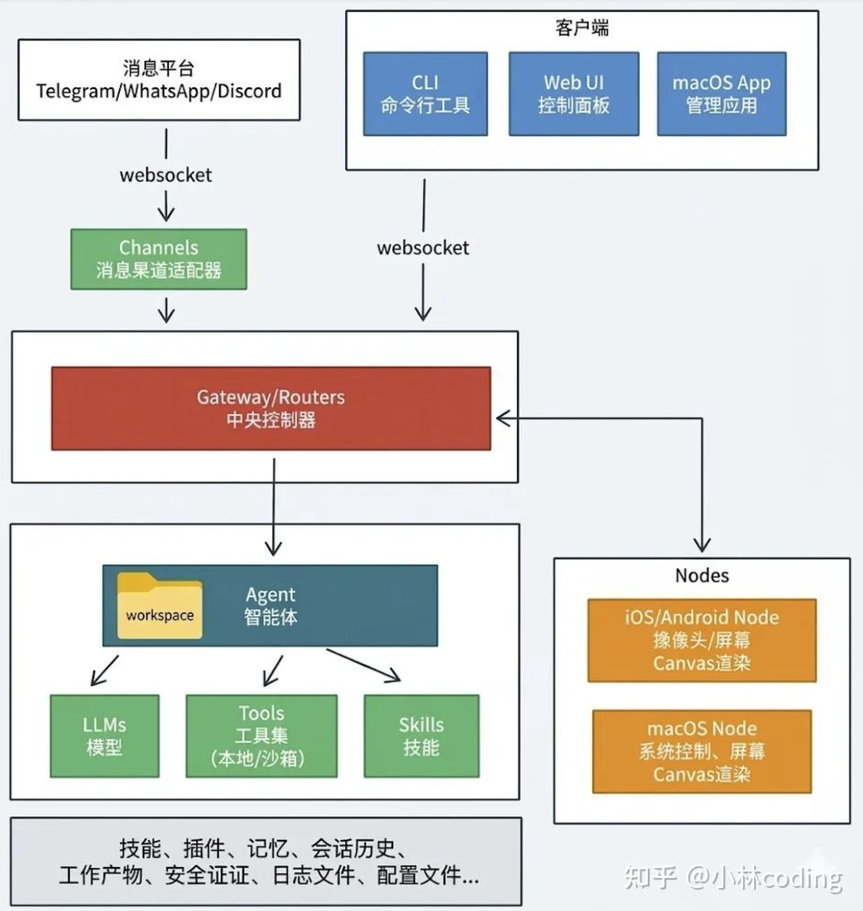

# 一、背景

2026 年开年，一款名为 OpenClaw 的开源 AI 智能体框架在技术圈、AI 圈、自媒体圈彻底爆火，无数玩家涌入开启「养虾」之旅，甚至有不少人靠它实现了内容创作全自动化、私域运营全托管。

但是，很快就有更多的声音之处，OpenClaw存在着很多安全隐患，然后学校和相关体制内的服务器都宣布禁止养虾，直到现在，OpenClaw已经从一开始的火爆，慢慢退居幕后。

但是，OpenClaw的思想和代码却开始被很多互联网公司在员工内部使用。美团校招就说过员工现在就都在养虾，然后同学进的小红书AI开发岗，也会面向内部员工来做公司自己的Claw。

因此，我现在准备写这篇文章，学习一下龙虾的前世今生，详细学习一下它的技术栈。


# 二、OpenClaw介绍

OpenClaw 是一款轻量化、高扩展性的开源 AI 智能体框架，核心优势是开箱即用、二次开发门槛极低。它能打通市面上几乎所有主流大模型，支持通过插件/技能扩展无限能力，既能实现内容创作自动化、多平台消息自动回复、定时任务执行等基础功能，也能搭建复杂的多智能体协同系统，同时全平台适配 Windows、Mac、iOS、安卓等设备，完全开源免费，因此快速成为 AI 从业者、自媒体人、自动化办公玩家的首选工具。

这是一个简单的TimeLine。

```python
==============================================================
 🌀 阶段一：项目前身与定名演进 (Naming & Genesis)
==============================================================

  [2025-12-28]  📦 雏形诞生
     │           └── 名为 Clawd (核心运行/基础工具构建)
     ▼
  [2026-01-05]  🌍 正式开源
     │           └── 更名 ClawdBot (面向全球开发者开放)
     ▼
  [2026-01下旬] ⚖️ 商标合规
     │           └── 更名 Moltbot (底层架构初步优化)
     ▼
  [2026-01-30]  🚀 最终定名
     │           └── 确立 OpenClaw (基金会运营/品牌标识全量替换)
     │
==============================================================
 🚀 阶段二：OpenClaw 正式版高频迭代史 (Version Iterations)
==============================================================
     │
     ├─▶ v2026.2.21 (02-21) 🌟 多端启航：Gemini/豆包接入 | iOS及手表App上线 | 5层嵌套智能体
     │
     ├─▶ v2026.2.22 (02-23) 🛡️ 核心加固：修复40+安全漏洞 | 混合检索记忆 | Mistral原生接入
     │
     ├─▶ v2026.2.23 (02-24) ⚡ 模型拓展：Claude 4.6支持 | HTTP安全头防劫持
     │
     ├─▶ v2026.2.24 (02-25) 📱 跨端补齐：原生安卓APP上线 | 增加全局“紧急停止”指令
     │
     ├─▶ v2026.2.25 (02-26) 🎨 体验打磨：安卓启动提速/渲染优化 | 多用户安全引导上线
     │
     ├─▶ v2026.2.26 (02-27) 🔐 密钥升级：上线完整密钥管理工作流 | ACP线程绑定
     │
     ├─▶ v2026.3.1  (03-02) ☁️ 部署增强：自适应思考模式降本 | Docker/K8s状态监控适配
     │
     ├─▶ v2026.3.2  (03-03) 🛠️ 生产力跃升：插件SDK大升 | 原生PDF分析工具上线
     │
     ├─▶ v2026.3.7  (03-08) 🏗️ 架构换代：上下文引擎全面插件化 | ACP持久断线重连
     │
     ├─▶ v2026.3.8  (03-09) 🩹 核心护航：集中修复3.7架构升级引发的各类兼容性问题
     │
     ├─▶ v2026.3.11 (03-12) 🧠 记忆飞跃：支持多媒体(图音视)多模态检索 | 苹果端UI重构优化
     │
     └─▶ v2026.3.12 (03-13) 👑 视觉重构：控制台五大核心模块全面翻新 | 统一「快速模式」上线
```


## 2.1 我过去的 AI Agent 部署方案：Napcat + QQ + LangBot + Dify

在学习 OpenClaw 之前，我曾经自己搭建过一套 AI Agent 平台。在学习 OpenClaw 的架构时，我会不断把这两套方案放在一起对比，这帮助我理解 OpenClaw 做了哪些设计取舍。

### 架构全景

```
┌─────────────────────────────────────────────────────────────┐
│                    我的 AI Agent 部署方案                      │
│                                                               │
│  ┌──────────┐    ┌──────────────┐    ┌──────────────┐       │
│  │  Napcat  │───>│   LangBot    │───>│    Dify      │───> LLM│
│  │(QQ协议桥) │    │ (消息路由器)   │    │ (Agent 大脑)  │       │
│  └──────────┘    └──────────────┘    └──────────────┘       │
│       │               │                     │                │
│  登录QQ账号       消息收发、            工作流编排             │
│  收发消息         插件管理             Tool Calling           │
│  协议适配         多平台接入           知识库/RAG              │
│                   暴露API             模型管理                │
│                                                               │
│  运行环境：两台 Linux 服务器                                   │
│  通信方式：HTTP API                                           │
└─────────────────────────────────────────────────────────────┘
```

### 各层详解

**第一层：Napcat —— QQ 协议桥**

Napcat 是一个基于社区逆向工程的 QQ Bot 框架。它负责：

- 登录 QQ 账号（模拟手机 QQ 协议）
- 接收消息（私聊、群聊）
- 发送消息（文本、图片）
- 处理心跳、重连、风控

Napcat 把 QQ 的私有协议封装成标准的 HTTP Webhook——每当收到 QQ 消息，就向 LangBot 配置的 webhook URL 发 POST 请求。

```
QQ 用户发消息
  → 腾讯服务器
    → Napcat 的 QQ 协议客户端收到
      → HTTP POST → LangBot webhook
```

**第二层：LangBot —— 消息路由器**

[LangBot](https://github.com/langbot-app/LangBot) 是一个 Python 写的聊天机器人框架。它在我这套方案里**不做 AI**，纯粹做消息桥接：

- 接收 Napcat 的 webhook 请求
- 解析消息内容（文本、图片、@提及等）
- 调用 Dify 的 API，把消息转发过去
- 接收 Dify 的回复
- 通过 Napcat 的 HTTP API 把回复发回 QQ

LangBot 本身也支持 Telegram、Discord、Slack 等渠道——但我的实际使用场景里只接了 QQ。

**第三层：Dify —— Agent 大脑**

[Dify](https://dify.ai) 是一个 LLMOps 平台，这是我方案中**真正执行 AI 逻辑**的地方。Dify 上配置了：

- **Chatflow / Workflow**：定义 Agent 的对话流程（接收消息 → 理解意图 → 调用工具 → 生成回复）
- **Tool Calling**：Agent 可以调用外部 API（搜索、天气、数据库查询等）
- **知识库（RAG）**：上传文档，Agent 基于文档回答
- **模型管理**：选择用哪个 LLM（DeepSeek、GPT 等）
- **API Key**：暴露一个 HTTP endpoint，LangBot 通过 API Key 认证后调用

```
LangBot 调用：
  POST https://dify.ai/v1/chat-messages
  Authorization: Bearer app-xxxxxx
  Body: { query: "帮我查天气", user: "qq-user-123", ... }

Dify 处理：
  1. Chatflow 启动
  2. LLM 理解意图 → "要查天气"
  3. 调用天气 API tool
  4. LLM 基于 tool result 生成回复
  5. 返回回复给 LangBot
```

### 这套方案的优缺点

**优点**：

1. **职责分明**：三个组件各司其职——QQ 协议、消息路由、AI 编排互不耦合
2. **Dify 的可视化工作流**：Chatflow 用拖拽方式编排 Agent 逻辑，不需要写代码
3. **独立升级**：三个组件可以各自升级，不会互相影响
4. **Dify 的生态**：内置知识库、RAG、多种 tool 集成，开箱即用

**缺点**：

1. **三次 HTTP 调用**：一条 QQ 消息要走 Napcat→LangBot→Dify→LLM，每一跳都是网络延迟和故障点
2. **没有统一 Session 管理**：LangBot 管自己的对话记录，Dify 管自己的 conversation，两边的 session 可能不同步
3. **跨渠道记忆难以打通**：如果后来又给 LangBot 接上 Telegram，Telegram 用户和 QQ 用户的 Agent 是两套 Dify conversation，互不关联
4. **Dify 是外部依赖**：Agent 的大脑在 Dify 的服务器上（或自己部署的 Dify 实例），不是完全自控
5. **三套进程需要分别运维**：Napcat 一个进程、LangBot 一个进程、Dify 一堆容器，任何一环挂了整个链路就断
6. **没有移动端传感器**：Agent 只能用文本，不能拍照、语音、位置

### 和 OpenClaw 的架构对比

把两套方案的架构放在一起看，差异非常清晰：

```
我的方案（三进程拼接）：
  ┌─────────┐     ┌──────────┐     ┌──────────┐     ┌─────┐
  │ Napcat  │─HTTP→│ LangBot  │─HTTP→│   Dify   │─API→│ LLM │
  │(QQ协议)  │     │(消息路由) │     │(Agent编排)│     │     │
  └─────────┘     └──────────┘     └──────────┘     └─────┘
  独立进程         独立Python进程     独立平台/容器      外部API
  逆向协议         事件驱动插件      可视化工作流

OpenClaw（单进程统一）：
  ┌──────────────────────────────────────────────────────┐
  │                 Gateway (单进程)                       │
  │  ┌──────────┐  ┌─────────┐  ┌──────────────────┐    │
  │  │QQ Channel│  │ Session  │  │ Built-in Agent   │─API→ LLM
  │  │ Plugin   │──│ Manager  │──│ Runtime           │    │
  │  └──────────┘  └─────────┘  │ (Tool/Auth/Memory)│    │
  │                 同一进程内    └──────────────────┘    │
  └──────────────────────────────────────────────────────┘
```

| 维度 | 我的方案 | OpenClaw |
|------|---------|----------|
| **进程数** | 3 个独立进程 | 1 个统一进程 |
| **组件间通信** | HTTP（网络调用） | 进程内函数调用 |
| **消息延迟** | 三跳 HTTP | 零网络开销（进程内） |
| **故障点** | 任何一环挂了全断 | 只有 Gateway 一个进程 |
| **Session 管理** | LangBot 和 Dify 各管各 | 统一 Session Store |
| **跨渠道记忆** | 需要额外实现 | Session Key 原生支持 |
| **Agent 能力** | 依赖外部 Dify 编排 | 内置 Tool Calling + ACP |
| **插件体系** | LangBot 事件驱动插件 + Dify 工具 | 统一的 Manifest + SDK + ClawHub |
| **移动端** | 无 | 原生 Camera/Voice/Canvas |
| **运维复杂度** | 三套系统分别部署监控 | 一个 daemon 进程 |
| **QQ 接入方式** | Napcat 逆向协议 | Channel Plugin（如有） |

### 从"组装"到"原生"

我的旧方案本质上是**组件组装**——拿市面上最好的轮子拼出一辆车。Napcat 是 QQ 轮子，LangBot 是消息桥接轮子，Dify 是 AI 编排轮子。每个轮子单独看都不错，但拼在一起就有了间隙：

- 间隙 1：**进程间通信的开销和不可靠**。三次 HTTP 调用，每次都有 timeout、retry、序列化/反序列化的成本。
- 间隙 2：**状态的碎片化**。用户在 QQ 上的对话历史存哪？LangBot 有一份，Dify 有一份。如果两边不一致，Agent 就"失忆"。
- 间隙 3：**身份的不统一**。如果以后再接一个 Telegram，那个 Telegram 上的 Agent 是同一个"人"吗？在组装方案中，这需要大量额外工程。

OpenClaw 的做法是**原生一体化**：QQ 协议、消息路由、Agent 运行时、Session 管理都在同一个进程中。这不是说 OpenClaw 技术上更先进——Dify 的 Chatflow 编排能力可能比 OpenClaw 的 Agent runtime 更成熟——而是说 OpenClaw 在做一种**完全不同的架构选择**：牺牲组件的可替换性，换取整体的紧致性。

这正呼应了 OpenClaw 的产品定位：它不是给你搭 Agent 的框架，它自己**就是**那个 Agent。


## 2.2 OpenClaw 的 QQ 接入方式：官方 Bot API

我的旧方案用户 Napcat 来解决 QQ 协议接入。OpenClaw 也有 QQ 渠道——`extensions/qqbot/`，但接入原理完全不同。

### 官方 Bot API vs 逆向协议

**Napcat（我的方案）**：社区逆向 QQ 私有协议，模拟手机 QQ 登录。用你的 QQ 号收发消息，然后通过 HTTP webhook 转发给 LangBot。

**OpenClaw（extensions/qqbot）**：使用 QQ 开放平台的**官方 Bot API**。你需要去 QQ 开放平台注册一个机器人应用，拿到 `APP_ID` 和 `CLIENT_SECRET`，Bot 通过 WebSocket 直连 QQ 官方服务器。

这从 manifest 就能看出来：

```json
// extensions/qqbot/openclaw.plugin.json
"channelEnvVars": {
  "qqbot": ["QQBOT_APP_ID", "QQBOT_CLIENT_SECRET"]
}
```

`QQBOT_APP_ID` 和 `QQBOT_CLIENT_SECRET` 是 QQ 开放平台的官方凭证——不是 QQ 号 + 密码。

### 技术实现：WebSocket 长连接

从 `extensions/qqbot/src/types.ts` 可以看到，OpenClaw 的 QQ Bot 使用的是 QQ 官方的有状态 WebSocket 协议：

```typescript
// types.ts — QQ WebSocket 消息结构
export interface C2CMessageEvent {    // 私聊消息
  author: { id, union_openid, user_openid };
  content: string;
  id: string;
  timestamp: string;
}

export interface GroupMessageEvent { // 群聊消息
  group_id: string;
  group_openid: string;
  author: { id, member_openid };
  content: string;
}

export interface WSPayload {         // WebSocket 协议包
  op: number;    // 操作码（类似 Discord Gateway 的 opcode）
  d?: unknown;   // 数据负载
  s?: number;    // 序列号（用于断线重连恢复）
  t?: string;    // 事件类型
}
```

`WSPayload` 的 `op/d/s/t` 四字段是经典的**有状态 WebSocket Gateway** 设计——和 Discord、Telegram Bot API 一脉相承。Bot 保持一个持久 TCP 连接，QQ 服务器通过这个连接实时推送消息事件，不需要 HTTP webhook 轮询。

`extensions/qqbot/src/bridge/gateway.ts` 中的 `initSender` 和 `startGateway` 负责建立连接、处理心跳、处理断线重连（通过序列号 `s` 恢复丢失的事件）。

### 接入流程

和 Napcat + LangBot 的三层拼接不同，OpenClaw 的 QQ 接入只有两步配置：

```
openclaw onboard
  → 选择 qqbot 渠道
  → 输入 QQ 开放平台的 App ID
  → 输入 Client Secret
  → 完成
```

之后 Gateway 启动时，QQ Channel Plugin 自动建立 WebSocket 连接，消息直接流入 Gateway 的消息路由。

### 完整对比

| | Napcat（我的方案） | OpenClaw qqbot |
|---|---|---|
| **原理** | 逆向 QQ 私有协议，模拟手机登录 | QQ 开放平台官方 Bot API |
| **身份** | 你本人的 QQ 号 | 注册的机器人账号（独立身份） |
| **连接** | HTTP webhook（Napcat 中转） | WebSocket 长连接（直连 QQ 服务器） |
| **凭证** | QQ 号 + 密码/扫码 | App ID + Client Secret |
| **私聊** | 支持 | 支持（C2C 消息） |
| **群聊** | 支持 | 支持（@机器人触发） |
| **风控风险** | 高（逆向协议随时可能被封） | 低（官方 API，合规） |
| **稳定性** | 依赖社区维护 Napcat | 依赖腾讯 API 稳定性 |
| **功能范围** | 完整的 QQ 客户端能力 | 受限于官方 Bot API 开放的功能 |
| **消息流** | QQ → Napcat → HTTP → LangBot → Dify | QQ → WebSocket → OpenClaw Gateway（进程内） |

最核心的差异：**Napcat 假装自己是 QQ 客户端，OpenClaw 光明正大用官方 API**。前者能力更强但因逆向协议随时可能被封，后者受限于官方 API 但稳定合规。这也是 OpenClaw 整体架构哲学的又一体现——它优先选择官方接口和标准化协议，而不是在协议层玩花样。


# 三、源码学习路线

## 3.1 学习路径

我读源码时的核心困惑是这三个：

1. OpenClaw 到底怎么"跑起来"的？入口在哪，Gateway 是什么，daemon 和 CLI 是什么关系？
2. 一条消息从 WhatsApp/Telegram 进来，经过哪些层，最后怎么变成 AI 回复发回去？
3. 插件系统有多深？什么能写进插件，什么必须改 core？

因此，我设计了下面这条学习线：先骨架（怎么跑起来），再通道（消息流），再插件与运行时（能力扩展）：

1. **总览与 Quick Start** → 先跑通，搞清楚整体
2. **架构全景** → 画出分层图，理解每层的职责边界
3. **入口：CLI 与 Daemon** → 从 `entry.ts` 入手，理解启动链
4. **Gateway：控制面** → Boot、Auth、Protocol、消息路由
5. **Channels：消息入口** → 渠道抽象层，消息怎么流进来
6. **Agents：AI 大脑** → Agent 运行时，Model Provider 体系
7. **Configuration System** → 类型 → Zod → IO → Validation
8. **Plugin System（上）** → 插件架构与加载链路
9. **Plugin System（下）** → 每个扩展点的接口契约
10. **Hooks：运行时切面** → 生命周期切点与执行模型
11. **Tools 与 MCP** → 工具描述符、执行引擎、MCP 协议
12. **Sessions 与 Memory** → 短对话与长记忆
13. **Security** → Auth、SecretRef、Sandbox、Approval
14. **Apps 与 Nodes** → iOS/Android/macOS 架构
15. **部署与运维** → Docker/VPS/Nix/Tailscale


# 四、架构全景

## 4.1 一张图理解系统分层

OpenClaw 的核心设计理念在 `VISION.md` 中写得很清楚：

> OpenClaw is the AI that actually does things. It runs on your devices, in your channels, with your rules.
>
> Core stays lean; optional capability should usually ship as plugins.

```
                     "我发了一条消息给 OpenClaw"

┌─────────────────────────────────────────────────────────────┐
│                      EXTERNAL WORLD                          │
│                                                               │
│   WhatsApp  Telegram  Discord  iMessage  Signal  Slack  ...  │
│      │         │         │         │        │       │        │
│      └─────────┴─────────┴─────────┴────────┴───────┘        │
│                            │                                  │
│                  ┌─────────▼─────────┐                        │
│                  │   CHANNELS 层     │  ← 消息 I/O 层         │
│                  │  (src/channels/)  │    每个 channel 负责    │
│                  │  + extensions/    │    connect/monitor/     │
│                  │                   │    send/receive         │
│                  └─────────┬─────────┘                        │
│                            │                                  │
│                  ┌─────────▼─────────┐                        │
│                  │   GATEWAY 层       │  ← 控制面              │
│                  │  (src/gateway/)   │    消息路由             │
│                  │                   │    鉴权与授权           │
│                  │  ┌─────────────┐  │    WebSocket RPC 协议   │
│                  │  │  Protocol   │  │                        │
│                  │  └─────────────┘  │                        │
│                  └─────────┬─────────┘                        │
│                            │                                  │
│          ┌─────────────────┼─────────────────┐               │
│          │                 │                 │               │
│   ┌──────▼──────┐  ┌───────▼───────┐  ┌──────▼──────┐       │
│   │   AGENTS    │  │   COMMANDS    │  │    HOOKS    │       │
│   │ (src/agents)│  │ (src/commands)│  │ (src/hooks) │       │
│   │             │  │               │  │             │       │
│   │ Agent 运行时 │  │ Agent 命令     │  │ 生命周期切面  │       │
│   │ Model 选择  │  │ 对话执行       │  │ 消息/工具拦截 │       │
│   │ Provider对接│  │               │  │ 回复编辑     │       │
│   └──────┬──────┘  └───────────────┘  └──────┬──────┘       │
│          │                                   │              │
│          │         ┌──────────┐              │              │
│          ├────────>│  TOOLS   │<─────────────┘              │
│          │         │(src/tools)│                              │
│          │         │ 工具注册  │                              │
│          │         │ 工具发现  │                              │
│          │         │ 工具执行  │                              │
│          │         │ MCP 桥接 │                              │
│          │         └──────────┘                              │
│          │                                                   │
│          │  ┌───────────────┐                                │
│          ├─>│   SESSIONS    │  ← 对话状态                    │
│          │  │ (src/sessions)│    session key 路由            │
│          │  └───────────────┘                                │
│          │                                                   │
│          │  ┌───────────────┐                                │
│          └─>│   MEMORY      │  ← 长期记忆                    │
│             │ (src/memory)  │    MEMORY.md 文件              │
│             └───────────────┘                                │
│                                                               │
│  ┌────────────────────────────────────────────────────────┐  │
│  │              PLUGIN SYSTEM  (贯穿所有层)                 │  │
│  │  ┌──────────────┐  ┌──────────────┐  ┌──────────────┐  │  │
│  │  │ Plugin SDK   │  │   Registry   │  │   Loader     │  │  │
│  │  │ (对外的接口)  │  │  (插件注册表) │  │  (插件加载器) │  │  │
│  │  └──────────────┘  └──────────────┘  └──────────────┘  │  │
│  └────────────────────────────────────────────────────────┘  │
│                                                               │
│  ┌────────────────────────────────────────────────────────┐  │
│  │              CONFIGURATION  (贯穿所有层)                 │  │
│  │  Zod Schema → IO → Validation → Legacy Migration        │  │
│  └────────────────────────────────────────────────────────┘  │
│                                                               │
│  ┌────────────────────────────────────────────────────────┐  │
│  │              CLI + DAEMON  (驱动层)                      │  │
│  │  entry.ts → CLI 命令路由 → Daemon 进程管理               │  │
│  └────────────────────────────────────────────────────────┘  │
└─────────────────────────────────────────────────────────────┘
```



## 4.2 核心模块速览

| 概念 | 一句话 | 源码位置 |
|------|--------|----------|
| **Gateway** | 系统控制面，接收消息、路由到 Agent、返回回复 | `src/gateway/` |
| **Channel** | 聊天渠道（Telegram、WhatsApp 等），消息的入口和出口 | `src/channels/`、`extensions/` |
| **Agent** | AI 大脑，处理消息的执行单元 | `src/agents/` |
| **Plugin** | 扩展系统能力——新渠道、新 provider、新 tool | `src/plugins/`、`src/plugin-sdk/` |
| **Tool** | Agent 能调用的工具 | `src/tools/` |
| **Session** | 对话会话，管理对话历史 | `src/sessions/` |
| **Memory** | 长期记忆，跨 session 保留 | `src/memory/` |
| **Hook** | 生命周期切面注入点 | `src/hooks/` |

## 4.3 四条架构原则（贯穿整个代码库）

**原则 1：Core 保持插件无关**

`src/plugins/CLAUDE.md` 中写道：

> Core stays plugin-agnostic. No bundled ids/defaults/policy in core when manifest/registry/capability contracts work.

核心代码不知道任何具体插件的存在。Telegram、WhatsApp 等渠道插件对 core 来说只是实现了标准接口的"匿名"模块。

**原则 2：Manifest 优先于代码**

> Preserve manifest-first behavior: discovery, config validation, and setup should work from metadata before plugin runtime executes.

插件的发现、配置验证应该在加载 JS 代码之前就能完成。

**原则 3：Control plane ≠ Runtime plane**

> Keep control-plane and runtime-plane concerns separate.

一个插件"是否存在"（discovery）和它"如何执行"（execution）是两个独立阶段。不能因为要检查插件配置就加载整个插件的运行时代码。

**原则 4：Hot paths 不拉 Cold paths**

> Do not let cold control-plane paths quietly import broad runtime surfaces.

启动时的配置检查等"冷路径"，不应该意外加载消息处理、模型调用等"热路径"代码。

## 4.4 一条消息的完整旅程

跟着一条消息走，是理解架构最快的方式：

```
1. 用户在 WhatsApp 里发送 "帮我查一下天气"

2. WhatsApp Channel (extensions/whatsapp)
   ├── monitor 线程收到 webhook
   ├── 解析消息：文本、sender、chat id
   ├── check allowFrom / allowlist
   └── 通过 Gateway protocol 转发消息

3. Gateway (src/gateway/)
   ├── 收到 RPC 请求：agent.call
   ├── verify auth (token / device identity)
   ├── 根据 session key 路由到正确的 Agent
   └── 转发给 Agent

4. Agent (src/agents/)
   ├── resolve agent config (model, workspace, skills)
   ├── load session history (transcript)
   ├── resolve tool plan (哪些 tools 可用)
   ├── 调用 AI model API
   │   ├── system prompt + history + user message
   │   ├── model 决定调用 web_search tool
   │   ├── Agent 执行 tool → 获得天气信息
   │   └── model 生成最终回复
   └── 返回 reply + session update

5. Gateway
   ├── 收到 agent 回复
   ├── hooks：before-agent-reply（可以编辑/拦截）
   └── 通过 WhatsApp Channel 发回

6. WhatsApp Channel
   ├── 格式化消息（Markdown → WhatsApp 格式）
   └── send API → 用户收到回复
```


# 五、入口：CLI 与 Daemon

## 5.1 起点：entry.ts

OpenClaw 的入口是一个极薄的 shell 脚本 `openclaw.mjs`，它只做一件事：加载 `src/entry.ts`。

`src/entry.ts` 的主流程：

```typescript
// 1. 确保这是主模块（不是被 import 的）
if (!isMainModule({ currentFile, wrapperEntryPairs: [...] })) {
  // 被作为依赖 import 了 → 什么都不做
} else {
  // 2. 设置进程元数据
  process.title = "openclaw";
  ensureOpenClawExecMarkerOnProcess();
  installProcessWarningFilter();

  // 3. 启用编译缓存（加速后续 require）
  enableOpenClawCompileCache({ installRoot });

  // 4. 处理 --profile / --dev 等环境切换
  const parsed = parseCliProfileArgs(process.argv);

  // 5. 处理版本快速路径（--version / -V）
  if (!tryHandleRootVersionFastPath(process.argv)) {
    // 6. 真正的 CLI 入口
    await runMainOrRootHelp(process.argv);
  }
}
```

**编译缓存**：第一次启动时编译 TS → JS 并缓存（`src/entry.compile-cache.ts`），后续启动直接使用缓存，这就是为什么第二次 `openclaw` 命令明显快很多。

**双入口保护**：打包器可能同时加载 `openclaw.mjs` 和 `entry.js`，`isMainModule` 检查确保 CLI 逻辑只执行一次。

## 5.2 CLI 命令树

```
openclaw
├── onboard          # 首次配置向导
├── gateway          # Gateway 管理 (start/stop/restart/status)
├── agent            # Agent 交互
├── agents           # Agent 管理 (add/list/delete/bind/identity)
├── channels         # 渠道管理
├── plugins          # 插件管理 (install/uninstall/list/update)
├── secrets          # 密钥管理
├── dashboard        # 打开 Web 控制面板
├── doctor           # 诊断修复
└── cron             # 定时任务
```

## 5.3 Daemon：让 Gateway 变成后台服务

`src/daemon/service.ts` 定义了一个统一接口：

```typescript
export type GatewayService = {
  label: string;
  stage: (args) => Promise<void>;     // 准备配置
  install: (args) => Promise<void>;   // 安装服务
  uninstall: (args) => Promise<void>; // 卸载服务
  stop: (args) => Promise<void>;      // 停止服务
  restart: (args) => Promise<...>;    // 重启服务
  isLoaded: (args) => Promise<boolean>;
  readCommand: (env) => Promise<...>;
  readRuntime: (env) => Promise<...>;
};
```

这个接口有三个平台实现：

| 平台 | 文件 | 机制 |
|------|------|------|
| macOS | `src/daemon/launchd.ts` | LaunchAgent plist |
| Linux | `src/daemon/systemd.ts` | systemd user service（`--user`，不需要 root） |
| Windows | `src/daemon/schtasks.ts` | Scheduled Task |

**Respawn 机制**（`src/entry.respawn.ts`）：当检测到需要降级 Node 版本或切换运行时时，CLI 会"重生"自己——spawn 新进程后退出父进程。一种优雅的自我替换模式。


# 六、Gateway：控制面

## 6.1 Gateway 是什么

Gateway 是一个常驻的 WebSocket 服务器进程。所有组件都通过 WebSocket 连接到它。**为什么用 WebSocket 而不是 HTTP REST？**

1. **全双工**：Gateway 需要主动推送（cron 触发对话、channel 收到新消息后 push）
2. **单连接复用**：不需要为每个 command 建立新连接
3. **状态通知**：主动告知 client "agent 回复到一半了""channel 掉线了"

## 6.2 Boot 流程

`src/gateway/boot.ts` 中的 `runBootOnce()`：

```typescript
export async function runBootOnce(params): Promise<BootRunResult> {
  // 1. 加载 workspace 下的 BOOT.md 文件
  const result = await loadBootFile(params.workspaceDir);
  if (result.status === "missing" || result.status === "empty") {
    return { status: "skipped", reason: result.status };
  }
  // 2. 构建 boot prompt，让 Agent 执行 BOOT.md 中的指令
  const message = buildBootPrompt(result.content);
  // 3. 创建临时 session，运行 agent
  // 4. 保存当前 session 快照（boot 后恢复）
  // 5. 执行 agent 命令
  await agentCommand({ message, sessionKey, ... });
  // 6. 恢复 session mapping
  await restoreMainSessionMapping(mappingSnapshot);
}
```

**BOOT.md** 是一个声明式的启动钩子：Gateway 启动时把它作为 prompt 发给 Agent，Agent 执行其中的指令（比如发送"Gateway 已启动"通知）。Boot 是 best-effort，失败不会阻止 Gateway 启动。

## 6.3 Auth 鉴权体系

Gateway 支持多层认证，优先级从高到低：

```
1. Explicit token (--token 参数直接传入)
2. Explicit password (--password 参数)
3. Config-based credential (openclaw.json 中的 gateway.token)
4. Device identity (设备指纹，loopback 连接自动启用)
```

一个关键的**安全约束**在 `src/gateway/call.ts` 中：

```typescript
export function ensureExplicitGatewayAuth(params) {
  // URL overrides are untrusted redirects
  // Never allow an override to silently reuse implicit credentials
  if (params.urlOverride && !hasExplicitAuth) {
    throw new Error("gateway url override requires explicit credentials");
  }
}
```

如果有人诱导 CLI 连接到 `--url ws://evil.com`，没有显式 token 就直接失败——不会把隐式凭据发到攻击者的服务器。

Gateway 还实现了**最小权限的 Operator Scope 系统**：不同的 RPC method 需要不同的 scope，`agent.call` 和 `secrets.audit` 的 scope 完全不同。

## 6.4 WebSocket RPC 协议

```
Client                    Gateway
  │── WS Connect ───────────>│
  │── Hello ────────────────>│  { clientName, version, platform, scopes, deviceIdentity }
  │<── Hello Ok ─────────────│  { version, features: { methods[] } }
  │── Request ──────────────>│  { method: "agent.call", params: {...} }
  │<── Response ─────────────│  { result: {...} }
```

协议版本控制：客户端声明支持的协议范围（`minProtocol` ~ `maxProtocol`），Gateway 检查兼容性。这允许协议进化而不会破坏旧客户端。

## 6.5 消息路由：Session Key

Session key 是整个路由系统的核心标识符：

```
sessionKey = "agentId:channelId:accountId:chatType:chatId:threadId"

示例：
"main:telegram:mybot:direct:12345678:"
"coding:discord:myserver:channel:87654321:thread_001"
```

解析在 `src/routing/session-key.js`：

```typescript
export function parseAgentSessionKey(sessionKey: string) {
  const parts = sessionKey.split(":");
  return { agentId, channelId, accountId, chatType, chatId, threadId };
}
```

这使得 Gateway 不需要查询任何数据库就知道"这条消息属于哪个 agent、哪个 channel、哪个对话"。

## 6.6 Gateway 的"热线优化"

`src/gateway/CLAUDE.md` 中的核心原则：

> Gateway server tests and startup paths should not materialize bundled plugin runtime when they only need plugin-owned static descriptors.

比如验证某个 channel 是否 enabled 时，只需要读 metadata——不能加载整个 Telegram 插件的运行时代码。


# 七、Channels：消息入口

## 7.1 Channel 的三层结构

```
┌─────────────────────────────────────────────┐
│  External Channel Plugins (ClawHub/npm)     │  社区/第三方维护
├─────────────────────────────────────────────┤
│  Bundled Channel Plugins (extensions/)       │  随 OpenClaw 发布的可选渠道
│  Telegram, Discord, iMessage, Matrix 等      │
├─────────────────────────────────────────────┤
│  Built-in Channels (src/channels/)           │  核心内置
│  WhatsApp, Slack, Signal, WebChat 等         │
└─────────────────────────────────────────────┘
```

重要区分（来自 root `CLAUDE.md`）：对用户来说渠道都是"plugin"；`extensions/` 只是内部目录名。

## 7.2 Channel Plugin 接口契约

每个 Channel 不是实现一个大而全的接口，而是**可选的能力组合**（composition of optional adapters）：

```typescript
// src/channels/plugins/types.plugin.ts 和 types.core.ts
export type ChannelPlugin = {
  id: ChannelId;                    // telegram, whatsapp, discord...
  meta: ChannelMeta;                // 名称、描述、版本

  messaging?: ChannelMessagingAdapter;     // 收发消息
  pairing?: ChannelPairingAdapter;         // 设备配对（如 WhatsApp 扫码）
  security?: ChannelSecurityAdapter;       // DM/allowFrom/mention 规则
  threading?: ChannelThreadingAdapter;     // 线程/话题管理
  outbound?: ChannelOutboundAdapter;       // 出站格式化

  agentTools?: ChannelAgentTool[];         // 注册给 Agent 的工具
  messageToolDiscovery?: ChannelMessageToolDiscovery; // message tool schema 扩展
};
```

**设计理念**：不是填满所有选项——如果一个 channel 不支持某种能力（比如 IRC 不支持 pairing），就不实现对应的 adapter。

## 7.3 消息生命周期

以 Telegram 为例，接收流程：

```
1. Telegram API → webhook/长轮询 → 解析 Update 对象
2. 消息解析 → 文本/图片选最高分辨率/语音下载/文件下载
3. 安全检查 → allowFrom / group @mention 检查 / DM policy
4. 构建 Internal Message → channelId, accountId, sessionKey, senderId, messageId
```

回复流程：

```
1. Agent 执行完毕 → reply
2. before-agent-reply hook → 可以编辑/拦截/替换回复
3. Channel outbound adapter → Markdown → 各平台的特定格式
4. Send → 调用平台 API 发送
```

## 7.4 Channel 安全模型

```typescript
// 每个 channel 可独立配置安全策略：
config.channels.whatsapp.allowFrom = ["+15555550123"];  // 白名单
config.channels.whatsapp.groups["*"].requireMention = true; // 群聊必须 @bot
```

安全策略是 channel plugin 的职责，不是 core 的——因为每个平台的安全模型不同。

## 7.5 热路径优化

`src/channels/CLAUDE.md` 中的核心约束：

> Treat channel entrypoints such as `channel.ts`, `shared.ts`, `channel.setup.ts`, `gateway.ts`, and `outbound.ts` as hot import paths. Do not statically pull async-only surfaces like send, monitor, probe, directory-live, setup/login flows.

**Channel 的入口文件（被频繁 import 的那些）必须保持极轻**。不要把 send/monitor/setup/OAuth 这些重操作静态拉到入口文件中——它们在真正需要时才 `import()`。


# 八、Agents：AI 大脑

## 8.1 Agent 的概念模型

在 OpenClaw 中，Agent 是一个完整的工作单元：

```
Agent
├── Identity（身份）
│   ├── id: "main" | "coding" | "personal" | ...
│   └── system prompt
├── Model（模型）
│   ├── primary: "claude-sonnet-4-6"
│   ├── fallbacks: ["gpt-5.5", ...]
│   └── params (temperature, max_tokens, thinking)
├── Workspace（工作空间）
│   ├── workspaceDir: ~/.openclaw/agents/<id>/workspace
│   ├── MEMORY.md
│   └── skills files
├── Skills（技能）
│   └── skill filter: ["coding", "general"]
└── Provider（提供商）
    ├── auth profile
    └── API endpoint
```

## 8.2 Agent 路由

`src/agents/agent-scope.ts` 中的决策顺序：**显式传入 > Session Key 编码 > 默认 Agent**。

```typescript
export function resolveSessionAgentId(params: {
  sessionKey?: string;
  config?: OpenClawConfig;
  agentId?: string;
}): string {
  const defaultAgentId = resolveDefaultAgentId(params.config ?? {});
  const explicitAgentId = normalizeAgentId(params.agentId);
  const parsed = parseAgentSessionKey(normalizedSessionKey);
  return explicitAgentId ?? (parsed?.agentId ? normalizeAgentId(parsed.agentId) : defaultAgentId);
}
```

## 8.3 Model Provider 体系

Provider 层提供统一的 AI model 调用接口，屏蔽不同厂商的 API 差异。每个 provider 插件实现标准接口：

```typescript
// Provider 插件接口（简化版）
type ProviderPlugin = {
  id: string;                        // "openai-codex", "anthropic", ...
  catalog: ProviderCatalogContext;   // 注册 model 列表
  auth: ProviderAuthMethod;          // api-key | oauth | env | external-cli
  runtime: ProviderRuntime;          // 实际的 API 调用（createChatCompletion 等）
  model?: {
    normalizeToolSchemas?: ...;      // tool schema 格式转换（各家不同）
    streaming?: ...;                 // 流式输出策略
    thinking?: ...;                  // extended thinking 策略
  };
};
```

Model 支持 **primary + fallbacks**：Agent 显式指定 model，不指定就用全局 default；primary 不可用时按 fallbacks 列表依次尝试。

## 8.4 Agent Command：对话执行引擎

`src/commands/agent.ts` 是 Agent 对话的核心执行函数：

```
1. 解析 Agent 配置 (model, workspace, skills)
2. 加载 session 历史 (transcript)
3. 确定可用的 tools (tool plan)
4. 构建 system prompt (base + memory + skills + ...)
5. 调用 model API（可能多轮 tool calling）:
   model 回复 → 如果调用了 tool → 执行 tool → 把结果发回 model → 继续
6. 保存 transcript
7. deliver reply 到 channel
```

## 8.5 ACP：Agent Communication Protocol

ACP（`src/agents/acp/`）允许 Agent 之间互相通信（例如 coding agent 让 research agent 去搜索）。但遵循重要的架构原则（`VISION.md`）：

> We will not merge agent-hierarchy frameworks (manager-of-managers / nested planner trees) as a default architecture.

ACP 是轻量的点对点通信，不是重量级的层级式 Agent 管理框架。


# 九、Configuration System

## 9.1 配置的四层架构

```
openclaw.json (~/.openclaw/openclaw.json)
        │
┌───────▼──────────┐  Types Layer: 30+ 个类型文件
│    类型定义        │  types.openclaw.ts, types.agents.ts, types.channels.ts, ...
└───────┬──────────┘
        │
┌───────▼──────────┐  Schema Layer: Zod 验证
│    Zod Schema     │  zod-schema.core.ts, zod-schema.agents.ts, ...
└───────┬──────────┘
        │
┌───────▼──────────┐  IO Layer: 读写、merge patch、redact snapshot
│       IO          │  io.ts, merge-patch.ts, redact-snapshot.ts
└───────┬──────────┘
        │
┌───────▼──────────┐  Validation Layer: 运行时验证
│    Validation     │  validation.ts, schema.ts
└──────────────────┘
```

**为什么类型文件分散成 30+ 个而不是一个大文件？**
1. 模块边界清晰：每个子系统只 import 自己需要的类型
2. 避免循环依赖
3. 代码审查友好：改 Agent 配置 → 只需要看 `types.agents.ts`

## 9.2 Zod 的角色

Zod 同时提供运行时验证和 TypeScript 类型推导，不需要手写 validator，也不需要维护类型和验证的同步：

```typescript
export const agentModelSchema = z.object({
  primary: z.string().optional(),
  fallbacks: z.array(z.string()).optional(),
});
// z.infer<typeof agentModelSchema> → 得到 TypeScript 类型
```

## 9.3 Merge Patch 与 Redact Snapshot

**Merge Patch**（`src/config/merge-patch.ts`）：不是整个文件重新写入，而是精确 merge 要改的字段——减少并发写冲突。

**Redact Snapshot**（`src/config/redact-snapshot.ts`）：当需要展示/分享配置时（debug、doctor），敏感字段自动脱敏：
```
脱敏前：{ channels: { telegram: { botToken: "123456:ABC-DEF1234ghijk" } } }
脱敏后：{ channels: { telegram: { botToken: "123***hijk" } } }
```

## 9.4 Legacy Migration

经历过几次重构（Clawdbot → Moltbot → OpenClaw），配置格式有变化。Legacy 系统自动检测旧格式，但**不在启动时静默迁移**——用户通过 `openclaw doctor --fix` 显式执行：

> Legacy config repair belongs in `openclaw doctor --fix`, not startup/load-time core migrations.

## 9.5 不缓存配置

每次需要配置就重新读——因为用户可能随时手动编辑 `openclaw.json`，缓存会导致配置不同步：

> Cache concept: metadata stays fresh unless a caller owns an explicit snapshot for the current flow. Do not add persistent metadata caches.


# 十、Plugin System（上）：架构与加载

## 10.1 Plugin 系统总览

Plugin 系统是 OpenClaw 最复杂的子系统——`src/plugins/` 下有 200+ 个文件。插件加载分六个阶段：

```
  npm 包 / 本地目录 / ClawHub / Git URL
         │
         ▼
  ① Discovery — 扫描所有可能位置，只收集候选，不加载代码
         │
         ▼
  ② Manifest 验证 — 解析 openclaw.plugin.json
         │
         ▼
  ③ Install — 下载、解压、安全检查（如需要）
         │
         ▼
  ④ Loader — 动态 import() JS 代码
         │
         ▼
  ⑤ Registry — 将插件的能力注册到全局注册表
         │
         ▼
  ⑥ Runtime — 插件 API 可用，hooks/tools 生效
```

## 10.2 两种插件风格（来自 VISION.md）

**Code Plugins**：运行实际 JS 代码，能做深度运行时扩展（Provider、Channel、Memory、Tool、Hook）

**Bundle-style Plugins**：打包 skills、MCP servers、配置等静态内容。接口更小、更稳定、安全边界更好。

> Prefer bundle-style plugins when they can express the capability. Use code plugins when the capability needs runtime hooks, providers, channels, tools, or other in-process extension points.

## 10.3 Manifest：插件的"身份证"

每个插件根目录下必须有 `openclaw.plugin.json`：

```typescript
// src/plugins/manifest.ts
export const PLUGIN_MANIFEST_FILENAME = "openclaw.plugin.json";

type PluginManifest = {
  id: string;                          // 唯一标识
  name: string;
  version: string;
  kind: PluginKind;                    // "channel" | "provider" | "memory" | "tool" | ...

  main?: string;                       // 主入口文件
  api?: string;                        // 对外暴露的 API 表面
  runtimeApi?: string;                 // 延迟加载的 Runtime API

  capabilities?: {
    channels?: PluginManifestChannelConfig[];
    providers?: PluginManifestProviderRef[];
    tools?: PluginManifestToolRef[];
    commands?: PluginManifestCommandRef[];
  };

  minHostVersion?: string;             // 最低 OpenClaw 版本
};
```

**Manifest 优先于代码加载**：即便没有执行 JS 代码，系统也能知道这个插件"声称"自己能做什么。

## 10.4 Registry：全局注册表

`src/plugins/registry.ts` 和 `src/plugins/runtime.ts`：

```typescript
type PluginRegistry = {
  plugins: LoadedPlugin[];
  channels?: ChannelPlugin[];
  providers?: ProviderRegistration[];
  tools?: ToolDescriptor[];
  commands?: PluginCommandDef[];
  hooks?: HookRegistration[];
  httpRoutes?: HttpRouteRegistration[];
  sessionExtensions?: SessionExt[];
  agentEventSubscriptions?: AgentEvent[];
  runtimeLifecycles?: Lifecycle[];
  sessionSchedulerJobs?: SchedulerJob[];
};
```

**Registry 不是永久的**——当插件重新加载时，旧 registry 被 retire 并清理（停止 timers、取消 subscriptions、释放内存）。Registry 还通过多个 surface（HTTP Route Surface、Channel Surface）提供服务，每个可以独立 pin（锁定），防止在请求处理中被替换。

## 10.5 Plugin SDK：对外的防火墙

`src/plugin-sdk/` 是插件开发者使用的公共 API（npm 包 `openclaw/plugin-sdk`）。

`src/plugin-sdk/CLAUDE.md` 中的核心规则：

> Host loads plugins; plugins should not reach through the SDK into arbitrary host internals.

**插件不能 import 核心内部代码**——只能使用 SDK 暴露的公共接口。这既是保护第三方插件不被核心内部重构破坏，也是保护核心不被插件的"聪明但危险"的内部操作破坏。


# 十一、Plugin System（下）：扩展点

## 11.1 扩展点全景

每个 Plugin 通过 `definePlugin()` 返回一个 `PluginDefinition`，可以注册以下扩展点：

```
         definePlugin()
              │
   ┌──────────┼──────────────┐
   │          │              │
   ▼          ▼              ▼
provider    channel         tool
注册模型    注册渠道         注册新工具
认证方式    消息收发         到 Agent
API 调用   安全策略

   ┌──────────┼──────────────┐
   │          │              │
   ▼          ▼              ▼
memory      hook          cli-command
记忆后端   运行时切面      新的 CLI 命令
嵌入模型   事件拦截         终端操作

   ┌──────────┼──────────────┐
   │          │              │
   ▼          ▼              ▼
http-route  session-ext   compaction
HTTP 端点   Session 扩展   对话压缩策略
```

## 11.2 Provider 扩展点

```typescript
type ProviderPluginDefinition = {
  id: string;                           // "openai-codex", "anthropic", ...
  catalog(context): ProviderCatalogResult;   // 注册 model 列表
  auth: ProviderAuthMethod;             // "api-key" | "oauth" | "env" | "external-cli"
  runtime: ProviderRuntime;             // createChatCompletion, streaming, ...
  normalizeResolvedModel?(context): string; // 简写 → 完整 model ID
  normalizeToolSchemas?(context): ToolSchema[]; // tool schema 格式适配
};
```

关键原则（来自 `src/plugins/CLAUDE.md`）：

> When a provider hook grows a nested chain of wrapper composition or repeated compat flags, treat that as a regression signal. Extract the shared helper or composer.

多个 provider 的共性行为（replay policy、stream wrapper 等）必须提取到共享 helper，而不是让每个 provider 各复制一份。

## 11.3 Tool 扩展点

每个 Tool 有明确的 owner 和 executor（可能不同），采用 discriminated union：

```typescript
type ToolOwnerRef =
  | { kind: "core" }
  | { kind: "plugin"; pluginId: string }
  | { kind: "channel"; channelId: string }
  | { kind: "mcp"; serverId: string };

type ToolExecutorRef =
  | { kind: "core"; executorId: string }
  | { kind: "plugin"; pluginId: string; toolName: string }
  | { kind: "channel"; channelId: string; actionId: string }
  | { kind: "mcp"; serverId: string; toolName: string };
```

Tool 可以有条件地可用，条件支持 `allOf` / `anyOf` 组合：

```typescript
type ToolAvailabilitySignal =
  | { kind: "always" }                                   // 永远可用
  | { kind: "auth"; providerId: string }                  // 有 auth 时可用
  | { kind: "config"; path: string[]; check: "exists" }   // 有某配置时可用
  | { kind: "env"; name: string }                         // 有环境变量时可用
  | { kind: "plugin-enabled"; pluginId: string }          // 某插件启用时可用
  | { kind: "context"; key: string; equals?: JsonPrimitive }; // 上下文匹配时可用
```

## 11.4 Memory 扩展点（特殊 slot）

Memory 是**唯一特殊约束的单例扩展点**——同一时间只有一个 memory 插件激活：

> Memory is a special plugin slot where only one memory plugin can be active at a time. Today we ship multiple memory options; over time we plan to converge on one recommended default path.


# 十二、Hooks：运行时切面

## 12.1 Hook 全景

Hook 是 OpenClaw 的"运行时切面"——在消息生命周期的关键节点注入自定义逻辑：

```
    消息到达
       │
       ▼
  [message:received]  ← 消息到达时
       │
       ▼
  [agent:bootstrap]   ← Agent 首次启动
       │
       ▼
  [before-agent-start] ← Agent 开始执行前
       │
       ▼
  Agent 执行中...
       │
       ▼
  [before-tool-call]  ← 每个 tool 调用前
       │
       ▼
  [compaction]        ← 对话压缩时
       │
       ▼
  [before-agent-reply] ← 回复发送前（可编辑！）
       │
       ▼
  [message:sent]      ← 消息已发送
       │
       ▼
  [agent:finalize]    ← Agent 结束
```

## 12.2 Hook 的执行模型

```typescript
// Hook 通过 Plugin 注册
definePlugin({
  id: "my-hooks",
  hooks: [
    {
      event: "before-agent-reply",
      handler: async (ctx) => {
        // 可以修改 ctx.reply
        ctx.reply = `[安全声明] ${ctx.reply}`;
        return { action: "continue" };
      },
    },
  ],
});
```

Handler 按注册顺序依次执行，返回明确的 4 种语义：

| action | 含义 |
|--------|------|
| `continue` | 继续下一个 handler |
| `abort` | 中止操作，后续 handler 不再执行 |
| `skip` | 跳过其余 handler，继续原操作 |
| `modify` | 修改数据 |

## 12.3 Hook 的安全约束

**同步优先**：Hook 默认假设是同步的，防止无限阻塞热路径。

**超时控制**（`src/plugins/host-hook-cleanup.ts`）：Handler 超时被强制终止。

**错误隔离**：Hook 抛异常 → 被捕获 → 后续 hook 正常执行 → 错误记录到日志。消息处理不因 hook 失败而中断。

设计理念：**hook 是支线，不是主线**。消息的送达优先级高于 hook 的执行。


# 十三、Tools 与 MCP

## 13.1 Tool 系统架构

```
  Tool 来源: Core / Plugin / Channel / MCP
        │
        ▼
  Tool Registry (descriptors) → 所有工具的注册表
        │
        ▼
  Tool Plan (visible + hidden) → 根据动态可用性筛选
        │
        ▼
  Tool Execution (execute) → 实际的工具执行
```

## 13.2 Tool Descriptor

```typescript
type ToolDescriptor = {
  readonly name: string;                // "web_search", "exec", "message", ...
  readonly description: string;         // 给 AI model 看的描述
  readonly inputSchema: JsonObject;     // 输入参数的 JSON Schema
  readonly owner: ToolOwnerRef;         // 谁拥有这个工具
  readonly executor?: ToolExecutorRef;  // 谁执行这个工具（可能不同于 owner！）
  readonly availability?: ToolAvailabilityExpression; // 动态可用性条件
};
```

**Owner ≠ Executor** 是一个精妙的设计：例如 Channel 拥有 `message` tool，但实际执行由 core 的 message executor 完成。

Tool Plan 是**请求时动态构建**的——每次 Agent 收到消息时重新评估可用性，确保配置变化立即生效而不需要重启。

## 13.3 MCP：Model Context Protocol

MCP 是 Anthropic 定义的开放协议，让 AI 模型通过标准化接口访问外部工具和数据源。OpenClaw 既是 MCP server 也是 MCP client：

```
  OpenClaw 作为 MCP Client → 连接 External MCP Server (外部工具/数据源)
  OpenClaw 作为 MCP Server → 被 Other MCP Client 连接
```

`VISION.md` 中的设计基调：

> The project goal is pragmatic MCP support without duplicating existing agent, tool, ACPX, plugin, or ClawHub paths.

MCP 是桥接协议，不是替代品。MCP server 注册的工具和 plugin 注册的工具在 Tool Plan 中被平等对待。


# 十四、Sessions 与 Memory

## 14.1 Session 与 Memory 的分层

这是两个不同的时间尺度：

```
  ┌─────────────────────────────┐
  │        MEMORY (长期)        │
  │  用户偏好、身份、持续任务    │
  │  永久（直到显式修改/删除）    │
  │  MEMORY.md / Memory 插件    │
  └──────────────┬──────────────┘
                 │
  ┌──────────────▼──────────────┐
  │       SESSION (短期)        │
  │  本轮/近几轮的对话消息        │
  │  Agent 执行期间 + 对话窗口   │
  │  Session Store (JSON 文件)   │
  └─────────────────────────────┘
```

## 14.2 Session Key 与 Session ID

Session Key 标识"哪个对话"（编码了 agentId + channelId + accountId + chatType + chatId + threadId），在 `src/routing/session-key.js` 中解析。Session ID 标识"对话中的哪一轮"，用于追踪状态、关联 tool call/result、事件关联。

Transcript（对话记录）在 `src/sessions/transcript-events.ts` 中管理，包含 user messages、assistant messages、tool calls、tool results、system events。

## 14.3 MEMORY.md：极简主义记忆模型

OpenClaw 的核心记忆模型极其简单：**一个 Markdown 文件**。

`src/memory/root-memory-files.ts`：

```typescript
export const CANONICAL_ROOT_MEMORY_FILENAME = "MEMORY.md";
```

工作原理：
- Agent 的 system prompt 中包含 MEMORY.md 的内容
- Agent 可以使用 file editor tool 更新 MEMORY.md
- 下次对话时，新的内容自动被加载

**关键设计选择：为什么是 Markdown 文件？**
1. 人类可读——随时查看 Agent 记住了什么
2. Agent 可编辑——用 file editor tool 直接修改
3. 零依赖——不需要向量数据库、embedding、Pinecone
4. 版本控制友好——可以 git commit

在"向量数据库+RAG"盛行的时代，选择纯 Markdown 文件是一个有勇气的务实决定。

## 14.4 Memory 插件体系

对于超出 Markdown 文件能力的记忆需求，Memory 插件提供了扩展点（`packages/memory-host-sdk/`），支持 embedding、语义检索、向量数据库等。**但同一时间只有 1 个 memory 插件可以激活**——这是确保记忆系统一致性的特殊约束。


# 十五、Security

## 15.1 安全哲学

来自 `VISION.md`：

> Security in OpenClaw is a deliberate tradeoff: strong defaults without killing capability. The goal is to stay powerful for real work while making risky paths explicit and operator-controlled.

不是"禁止一切"，而是"默认安全，高危操作显式授权"。

## 15.2 Auth Profiles

Agent 的 API key 与 Gateway 的 token 是分离的：

```
~/.openclaw/
  ├── openclaw.json              # Gateway auth (gateway.token)
  └── agents/<id>/agent/
      └── auth-profiles.json     # Agent 的 AI 模型 API keys
```

Gateway auth 管"谁能连接 Gateway"，Agent auth 管"Agent 用哪个模型 API"。

## 15.3 SecretRef 体系

`src/secrets/` 实现了 SecretRef——不从配置文件直接写敏感值，而是引用外部 secret store：

```typescript
// ❌ 危险：直接写在配置里
channels.telegram.botToken = "123456:ABC-DEF1234ghijk"

// ✅ 安全：引用外部 secret
channels.telegram.botToken = { $secretRef: "telegram/bot-token" }
```

## 15.4 Sandbox 隔离

Agent 的 `exec` tool 可以执行系统命令，必须通过 Sandbox 限制：

```json5
{
  "sandbox": {
    "mode": "docker",              // docker | local
    "docker": {
      "networkMode": "none",       // 隔离网络
      "readOnlyRootfs": true,      // 只读文件系统
      "mounts": [...]              // 只有显式 mount 的路径可写
    }
  }
}
```

Sandbox 是 opt-in 的（`mode: "local"` 默认），但生产环境强烈推荐 `mode: "docker"`。

## 15.5 Approval 系统

需要审批的操作（exec 高危命令、删除数据、修改关键配置），通过多种 handler 确认：

```
Approval Handler:
├── Native Route → 推送到手机 App
├── CLI Route → 终端交互式输入
├── Web Route → Web Control UI 弹窗
└── Auto-Approve → 配置的白名单自动批准
```

## 15.6 Allowlist / Denylist

```json5
{
  "channels": {
    "whatsapp": {
      "allowFrom": ["+15555550123"]   // 只有这个用户能触发 Agent
    }
  },
  "tools": {
    "deny": ["exec:rm-rf"]   // 禁止特定命令
  }
}
```


# 十六、Apps 与 Nodes

## 16.1 架构总览

**Apps 不是独立运行的 AI 引擎**——它们都是 Gateway 的"瘦客户端"。所有 AI 处理在 Gateway 所在的服务器上完成。

```
                   Gateway (Linux/macOS 服务器)
                        │
       ┌────────────────┼──────────────────┐
       │                │                  │
  macOS App         iOS Node          Android Node
(SwiftUI)          (SwiftUI)         (Kotlin/Jetpack)
       │                │                  │
       └────────────────┼──────────────────┘
                        │
               WebSocket RPC
          (与 CLI 同样的 Gateway Protocol)
```

## 16.2 各平台

| 平台 | 源码 | 技术栈 | 独占能力 |
|------|------|--------|---------|
| macOS | `apps/macos/` | SwiftUI @Observable | 菜单栏小图标、MLX 本地 TTS、启动/停止 Gateway |
| iOS | `apps/ios/` | SwiftUI | Camera、Canvas、Push Notifications、Voice、Location |
| Android | `apps/android/` | Kotlin + Jetpack Compose | Camera、Canvas、FCM push、Background service |

## 16.3 Node Pairing

移动设备通过配对流程安全连接到 Gateway：

```
1. 手机 App 上点击 "Pair with Gateway"
2. Gateway 生成配对码（显示在 CLI 或 Web UI）
3. 手机扫码或手动输入
4. 通过安全配对协议交换 credential
5. 配对成功 → 手机成为 Gateway 的一个 "Node"
```

配对安全性在 `src/pairing/` 中实现。

## 16.4 Canvas

Agent 不只返回文本，还可以渲染交互式 UI：

```
Agent 生成 Canvas JSON 描述
  → 移动端 App 渲染原生 UI 组件
    → 用户交互（滑动、点击、输入）
      → 交互结果返回给 Agent
```

Canvas 让 Agent 的输出面从纯文本拓展到可交互的 UI。

## 16.5 移动端独有能力

- **Camera**：拍照 → 压缩上传 Gateway → Agent 多模态分析
- **Voice**：Apple/Android STT 语音输入 → Agent 处理 → TTS 语音回复（macOS 用 MLX 本地 TTS）
- **Location**：位置共享 → Agent 调用地图/天气 tool


# 十七、部署与运维

## 17.1 部署方式

| 方式 | 难度 | 适合场景 | 关键文件 |
|------|------|----------|---------|
| 本地直接运行 | 低 | 个人日常使用 | `npm install -g openclaw` |
| Docker Compose | 中 | VPS 部署 | `Dockerfile`, `docker-compose.yml` |
| fly.io | 中 | 云端托管 | `fly.toml` |
| Render | 中 | 云端平台 | `render.yaml` |
| Nix | 高 | 声明式可复现部署 | `nix-openclaw` |
| Tailscale | 推荐 | 远程安全访问 | 配置 `gateway.tailscale.bind` |

**Tailscale 优先于公网暴露**——减少防火墙开放面，通过 mesh VPN 访问。

## 17.2 Logging 与 Diagnostics

每个子系统有自己的 logger（`src/logging/subsystem.ts`）：

```typescript
const log = createSubsystemLogger("gateway/boot");
const log = createSubsystemLogger("plugins/runtime");
const log = createSubsystemLogger("channels/telegram");
```

`openclaw doctor` 诊断所有子系统（配置格式错误、Legacy 配置残留、Daemon 安装问题、端口冲突、依赖缺失、插件兼容性...）。`openclaw doctor --fix` 显式修复。

## 17.3 Channel Health Monitor

`src/gateway/channel-health-monitor.ts`——Gateway 监控每个 channel 的连接状态，掉线时自动重连。

## 17.4 环境变量参考

| 变量 | 作用 |
|------|------|
| `OPENCLAW_GATEWAY_URL` | 覆盖 Gateway 连接地址 |
| `OPENCLAW_GATEWAY_STARTUP_TRACE` | 启用启动性能追踪 |
| `OPENCLAW_LOG_LEVEL` | 日志级别 |
| `OPENCLAW_HANDSHAKE_TIMEOUT_MS` | WebSocket 握手超时 |
| `OPENCLAW_AUTH_STORE_READONLY` | 强制 auth 只读模式 |


# 十八、源码目录速览

```
openclaw/
├── src/                    # 核心 TypeScript 源码
│   ├── entry.ts            # 入口点：进程启动、参数解析
│   ├── gateway/            # Gateway 控制面（核心）
│   │   └── protocol/       #   WebSocket RPC 协议
│   ├── agents/             # Agent 运行时与路由
│   │   └── acp/            #   Agent Communication Protocol
│   ├── channels/           # 渠道实现（built-in）
│   │   └── plugins/        #   渠道插件接口契约
│   ├── plugins/            # 插件系统（加载、注册、生命周期）
│   ├── plugin-sdk/         # 插件 SDK（对外公共接口）
│   ├── cli/                # CLI 命令实现
│   ├── commands/           # Agent 命令（对话执行引擎）
│   ├── config/             # 配置系统（类型、IO、验证）
│   ├── hooks/              # 钩子系统
│   ├── tools/              # 工具描述符与执行
│   ├── sessions/           # 会话管理
│   ├── memory/             # 记忆系统
│   ├── memory-host-sdk/    # 记忆插件 Host SDK
│   ├── daemon/             # 守护进程（systemd/launchd/schtasks）
│   ├── mcp/                # MCP 协议支持
│   ├── cron/               # 定时任务
│   ├── security/           # 安全与 secrets
│   ├── secrets/            # SecretRef 密钥管理
│   ├── pairing/            # 设备配对
│   ├── routing/            # Session key 路由
│   └── infra/              # 基础设施（env、tls、审批等）
├── extensions/             # 外部渠道插件（Telegram、WhatsApp 等）
├── packages/               # 可复用的 npm 包
│   ├── sdk/                #   @openclaw/sdk
│   ├── plugin-sdk/         #   @openclaw/plugin-sdk
│   └── memory-host-sdk/    #   Memory 宿主 SDK
├── apps/                   # 移动端 + 桌面端 App
│   ├── ios/                #   iOS App (SwiftUI)
│   ├── android/            #   Android App (Kotlin)
│   ├── macos/              #   macOS App (SwiftUI)
│   ├── macos-mlx-tts/      #   本地 TTS 引擎
│   └── shared/             #   跨平台共享逻辑
├── ui/                     # Web Control UI
├── docs/                   # 文档（Mintlify 格式）
└── scripts/                # 构建、测试、release 脚本
```


# 十九、设计哲学总结

OpenClaw 源码中有几条贯穿始终的设计哲学，理解它们比记住具体代码更重要：

**1. Core stays lean, optional in plugins**

来自 `VISION.md`："Core stays lean; optional capability should usually ship as plugins." 核心保持精瘦，可选能力以插件形式发布。

 **2. Manifest-first**

插件的发现、配置验证、安装流程基于 manifest 元数据就能完成，不需要先加载 JS 代码。这是性能和安全的关键。

**3. Hot paths carry prepared facts**

"Hot paths should carry prepared facts forward: provider id, model ref, channel id, target, capability family, attachment class. Do not rediscover with broad plugin/provider/channel/capability loaders."

在消息处理的热路径上，不要反复做"这是什么渠道？这是什么 provider？"的查询——提前解析好，带着走。

**4. Boundary by contract, not by import**

模块之间的边界由明确的 TypeScript 类型接口定义，不是互相 `import` 内部实现。`src/plugin-sdk/` 是插件与核心之间的防火墙。

**5. Powerful but explicit**

不禁止能力，但高危操作必须显式授权。SecretRef 不写明文，Sandbox 隔离 exec，Approval 审批关键操作。

**6. Cold paths don't drag hot paths**

启动时和运行时是两个世界。config discovery 不应该加载 channel runtime，gateway health check 不应该加载 provider API 代码。
