# 一、总览

设计模式（Design Patterns）是软件工程中针对**反复出现的问题**总结出的通用解决方案。GoF（Gang of Four）在《设计模式：可复用面向对象软件的基础》一书中归纳了 **23 种经典设计模式**，分为三大类：

| 类型 | 数量 | 核心思路 |
|------|------|----------|
| **创建型** | 5 种 | 将对象的创建与使用解耦 |
| **结构型** | 7 种 | 将类或对象组合成更大的结构 |
| **行为型** | 11 种 | 管理对象之间的交互与职责分配 |

对于 AI 开发者尤其重要：当你用 LangChain/LangGraph 构建 Agent 时，实际上在反复使用这些模式——比如 Chain 就是责任链，Tool 就是策略，Memory 常是备忘录。**掌握设计模式，本质上是在掌握"如何清晰地指挥 AI 写代码"的能力**。

# 二、设计六大原则

设计模式不是凭空发明的，它们都遵循以下六大原则。理解原则比背模式更重要——原则是"道"，模式是"术"。

## 2.1 单一职责原则（Single Responsibility Principle, SRP）

> 一个类只负责一件事。

**为什么需要它**：如果一个类承担了多个职责，任何一个职责的变更都可能影响其他职责，导致系统变得脆弱。

**示例**：一个 `ReportGenerator` 不应该既处理数据查询、又生成图表、又发送邮件。应该拆分为 `DataFetcher`、`ChartRenderer`、`EmailSender`。

**AI 开发启发**：设计 Agent 的 Tool 时，每个 Tool 应该只做一件事。如果一个 Tool 的描述里出现了"和"字，考虑拆成两个。

## 2.2 开闭原则（Open-Closed Principle, OCP）

> 对扩展开放，对修改关闭。

**为什么需要它**：修改已有代码有引入 bug 的风险。理想情况是新增需求时只添加新代码，不改旧代码。

**示例**：一个支付系统最初支持微信支付，后来要加支付宝。如果每次都要改 `PaymentService` 的 if-else，就违反 OCP。正确的做法是定义一个 `PaymentMethod` 接口，微信和支付宝各自实现它。

**AI 开发启发**：LangChain 1.0 的 `AgentMiddleware` 体系就是对 OCP 的实践——新增功能只需加一个新的 middleware 类（如 `PIIMiddleware`、`SummarizationMiddleware`），无需修改 Agent 核心的 ReAct 循环代码。

## 2.3 里氏替换原则（Liskov Substitution Principle, LSP）

> 子类必须能够完全替换父类，而程序行为不变。

**为什么需要它**：如果子类不能替换父类，那么多态就失效了——使用父类的地方必须知道子类的特殊行为，破坏了封装。

**示例**：一个 `Rectangle` 类有 `setWidth` 和 `setHeight`。如果让 `Square` 继承 `Rectangle`，并在 `setWidth` 里同时修改高度，使用者调用 `setWidth(5); setHeight(10)` 时期望面积是 50，结果却是 100（因为 `setHeight` 把宽度也改了）。这就违反了 LSP。

**AI 开发启发**：自定义 Agent 继承基类时，不要偷偷改变基类方法的行为语义。如果 Agent 的 `invoke` 方法签名一样但行为截然不同，调用方会踩坑。

## 2.4 接口隔离原则（Interface Segregation Principle, ISP）

> 不强迫使用者依赖它不需要的接口。

**为什么需要它**：胖接口会让实现类被迫实现无关方法，也会让调用方看到不该看到的方法。

**示例**：一个 `Worker` 接口同时包含 `code()`、`design()`、`manage()`，会让普通程序员被迫实现 `manage()` 方法（抛出 UnsupportedOperationException）。应该拆成 `Coder`、`Designer`、`Manager` 三个小接口。

**AI 开发启发**：定义 Tool 的 Schema 时，参数只暴露必需要素，不要为了方便把不相关的参数塞进同一个 Schema。

## 2.5 依赖倒置原则（Dependency Inversion Principle, DIP）

> 高层模块不应依赖低层模块，两者都应依赖抽象。

**为什么需要它**：直接依赖会导致"牵一发而动全身"——底层数据库换了，上层业务逻辑也得跟着改。

**示例**：`UserService` 不应该直接依赖 `MySQLUserRepository`，而应该依赖 `UserRepository` 接口。这样换数据库时只需提供新的实现。

**AI 开发启发**：Agent 依赖 LLM 时，通过抽象层（如 LangChain 的 `BaseChatModel`）而不是直接调用特定模型的 API（如 `openai.ChatCompletion.create`）。这样切换模型时 Agent 代码无需改动。

## 2.6 迪米特法则（Law of Demeter, LoD / 最少知识原则）

> 一个对象应该对其他对象有尽可能少的了解。

**为什么需要它**：类与类之间关系越密切，耦合度越高。一个类的变化会影响关联的多个类。

**示例**：`a.getB().getC().doSomething()` 是不好的——调用方需要知道 B 的存在、知道 B 有 C、知道 C 有 doSomething。应该改成 `a.doSomething()`，让 A 内部去协调。

**AI 开发启发**：在 LangGraph 中设计节点之间的消息传递时，每个节点只接收它需要的数据，不要传递整个 state 对象让节点自己去翻找。

---

# 三、23种设计模式

## 0 总览对比表

下表按类型列出全部 23 种 GoF 模式，帮助你快速建立全局认知：

| 类型 | 模式 | 一句话概括 | 典型场景 | AI 开发相关度 |
|------|------|-----------|---------|:---:|
| 创建型 | **简单工厂** | 一个工厂按参数创建不同产品 | 根据配置创建不同 Logger | ⭐⭐⭐ |
| 创建型 | **工厂方法** | 子类决定创建哪个具体产品 | 不同数据库的 Connection 创建 | ⭐⭐⭐ |
| 创建型 | **抽象工厂** | 创建一组相关产品族 | 跨平台 UI 组件创建 | ⭐⭐ |
| 创建型 | **建造者** | 分步骤构造复杂对象 | 构建复杂的 Prompt 模板 | ⭐⭐⭐⭐ |
| 创建型 | **单例** | 全局唯一实例 | LLM 客户端复用 | ⭐⭐⭐⭐⭐ |
| 创建型 | **原型** | 克隆已有对象而非 new | 复制配置模板快速生成变体 | ⭐⭐ |
| 结构型 | **适配器** | 转换接口让不兼容的类协作 | 统一不同 LLM 的 API 调用 | ⭐⭐⭐⭐⭐ |
| 结构型 | **桥接** | 分离抽象与实现，各自独立变化 | 分离 Prompt 结构与模型调用 | ⭐⭐⭐ |
| 结构型 | **组合** | 树形结构，统一处理整体与部分 | 嵌套 Chain / Agent 嵌套调用 | ⭐⭐⭐⭐ |
| 结构型 | **装饰** | 动态给对象添加职责 | 给 LLM 调用添加缓存/重试/日志 | ⭐⭐⭐⭐⭐ |
| 结构型 | **外观** | 为复杂子系统提供统一入口 | 封装多步 Agent 流程为单一接口 | ⭐⭐⭐⭐ |
| 结构型 | **享元** | 共享细粒度对象减少内存 | 共享 Embedding 缓存 | ⭐⭐ |
| 结构型 | **代理** | 控制对对象的访问 | LLM 调用的限流和鉴权代理 | ⭐⭐⭐⭐ |
| 行为型 | **责任链** | 请求沿链传递直到被处理 | Middleware 链式处理请求 | ⭐⭐⭐⭐⭐ |
| 行为型 | **命令** | 将请求封装为对象 | Agent 的任务队列/撤销操作 | ⭐⭐⭐⭐ |
| 行为型 | **解释器** | 定义语法并解释执行 | 自定义 DSL / Prompt 模板引擎 | ⭐⭐ |
| 行为型 | **迭代器** | 统一遍历方式，隐藏内部结构 | 流式输出 Token / 分页读取数据 | ⭐⭐⭐⭐ |
| 行为型 | **中介者** | 用中介对象协调多方交互 | 多 Agent 协作的消息调度 | ⭐⭐⭐⭐⭐ |
| 行为型 | **备忘录** | 保存和恢复对象状态 | Agent 对话状态快照与回滚 | ⭐⭐⭐⭐⭐ |
| 行为型 | **观察者** | 一对多依赖，状态变化自动通知 | Streaming 回调 / 事件驱动 Agent | ⭐⭐⭐⭐⭐ |
| 行为型 | **状态** | 对象行为随内部状态改变 | 多步骤 Agent 的状态机控制 | ⭐⭐⭐⭐⭐ |
| 行为型 | **策略** | 封装可互换的算法族 | 按场景选择不同 LLM 或 Prompt | ⭐⭐⭐⭐⭐ |
| 行为型 | **模板方法** | 定义算法骨架，子类填充细节 | 定义 Agent 处理流程框架 | ⭐⭐⭐⭐ |
| 行为型 | **访问者** | 在不改变元素类的前提下添加新操作 | 对 AST / 文档结构做多种分析 | ⭐⭐ |

> 注：简单工厂不在 GoF 23 种之内，但因实用性强，几乎所有教程都会先讲它。此外，表中的"AI 开发相关度"是基于 2024-2026 年 LangChain/LangGraph/Agent 开发实践的判断，供参考。

---

以下按类型分组详细介绍每种设计模式。

---

## 创建型模式（Creational Patterns）

### 1. 简单工厂（Simple Factory）

> 不是 GoF 23 种之一，却是最常用的入门模式。用一个工厂类根据参数创建不同类型的对象。

**提出背景**：在早期面向对象编程中，开发者经常在业务代码里到处写 `new`。当需要替换具体类时（比如把 `MySQLConnection` 换成 `PostgresConnection`），所有出现 `new` 的地方都要改。简单工厂将"创建"集中起来，让业务代码只依赖工厂而不依赖具体类。

**核心思想**：定义一个工厂类，它有一个静态方法，根据传入的参数（字符串或枚举）决定实例化哪个具体类。所有产品类实现同一个接口。

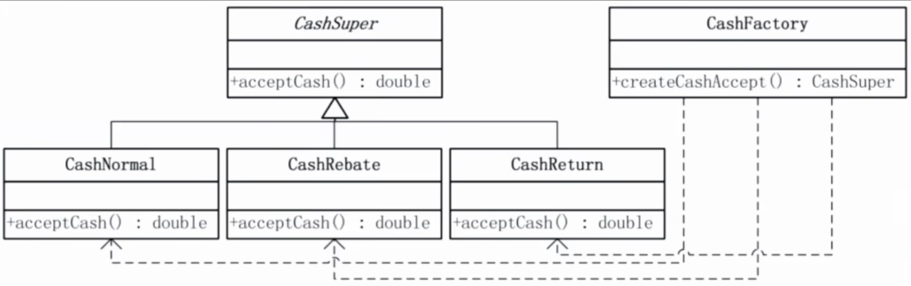

**生活实例**：快递站。你告诉快递员"寄到北京"，快递员（工厂）根据目的地选择顺丰还是圆通（具体产品），你不需要知道快递公司的内部运作。

**代码示意**：

```python
class LLMProvider:
    def chat(self, prompt: str) -> str: ...

class OpenAIProvider(LLMProvider):
    def chat(self, prompt: str) -> str:
        return openai.ChatCompletion.create(model="gpt-4", messages=[...])

class AnthropicProvider(LLMProvider):
    def chat(self, prompt: str) -> str:
        return anthropic.messages.create(model="claude-opus-4-7", messages=[...])

class LLMFactory:
    @staticmethod
    def create(provider: str) -> LLMProvider:
        if provider == "openai":
            return OpenAIProvider()
        elif provider == "anthropic":
            return AnthropicProvider()
        raise ValueError(f"Unknown provider: {provider}")

# 使用者不需要知道具体的类名
llm = LLMFactory.create("anthropic")
llm.chat("你好")
```

**优缺点**：

| 优点 | 缺点 |
|------|------|
| 将创建和使用分离，业务代码更干净 | 每增加一个产品就要修改工厂类（违反 OCP） |
| 集中管理创建逻辑，方便统一配置 | 产品种类多时工厂会变成"超级 if-else" |
| 入门简单，适合产品类型较少的场景 | 工厂类本身会成为新的单一故障点 |

**AI 开发应用**：在 LangChain 中，`ChatOpenAI`、`ChatAnthropic` 等模型的创建本质上就是简单工厂。当你的应用需要根据配置文件切换 LLM provider 时，一个 `LLMFactory` 可以避免业务代码里散落的条件判断。但注意：当 provider 超过 5 个时，应升级为工厂方法或抽象工厂。

---

### 2. 工厂方法（Factory Method）

> 定义一个创建对象的接口，但**让子类决定**实例化哪个类。将对象的创建延迟到子类。

**提出背景**：简单工厂的问题是——每次加新产品都要修改工厂类，违反了开闭原则。框架开发者面临一个困境：框架需要创建对象，但具体创建什么对象应该由框架使用者决定。工厂方法解决了这个问题。

**核心思想**：定义一个抽象的"创建者"类，它声明一个抽象的工厂方法。每个具体子类实现这个工厂方法来创建特定的产品。使用者通过继承来扩展，而不是修改原代码。

**生活实例**：连锁餐厅的菜品制作。总部定义了"做汉堡"的流程（抽象工厂方法），但北京店和成都店的配方不同（具体子类）——北京店可能偏咸，成都店偏辣。总部不需要知道辣度细节，每个分店自己决定。

**代码示意**：

```python
from abc import ABC, abstractmethod

class Agent(ABC):
    """创建者抽象类"""
    @abstractmethod
    def create_tools(self) -> list: ...

    def run(self, task: str):
        tools = self.create_tools()  # 工厂方法
        # 使用 tools 执行任务...
        return f"Task '{task}' done with {len(tools)} tools"

class CodeAgent(Agent):
    def create_tools(self):
        return [ReadFileTool(), WriteFileTool(), BashTool()]

class DataAgent(Agent):
    def create_tools(self):
        return [SQLTool(), PandasTool(), PlotTool()]
```

**优缺点**：

| 优点 | 缺点 |
|------|------|
| 符合开闭原则，新增产品只需加子类 | 类的数量成倍增加（每个产品都要一个工厂子类） |
| 创建逻辑与业务逻辑解耦 | 只适用于产品有统一接口的情况 |

**AI 开发应用**：非常适合"框架型"AI 应用。比如你开发一个 Agent 框架，框架定义了 `create_tools` 这个工厂方法，不同的 Agent 子类（代码 Agent、数据分析 Agent、客服 Agent）各自实现它来注册自己的工具。LangGraph 中自定义节点的创建也遵循类似的思路——框架定义了 Graph 的骨架，你通过"重写"节点来填充具体行为。

---

### 3. 抽象工厂（Abstract Factory）

> 创建**一组相关**的产品对象，而不需要指定它们的具体类。

**提出背景**：当一个系统需要处理"产品族"时——比如一套 UI 组件在 Windows 和 Mac 上各有一套实现——工厂方法就力不从心了。你需要确保创建的按钮、文本框、下拉框都是同一风格的（不能 Windows 按钮配 Mac 下拉框）。

**核心思想**：定义一个抽象工厂接口，它包含多个工厂方法，每个方法创建产品族中的一种产品。具体工厂实现整个产品族。

**生活实例**：全屋定制家具。你有"现代简约"和"中式古典"两套方案（产品族），每套方案包含沙发、茶几、电视柜。你选了"现代简约"工厂，那它生产的所有家具风格一致，不会出现搭配混乱。

**代码示意**：

```python
class ToolFactory(ABC):
    @abstractmethod
    def create_search_tool(self): ...
    @abstractmethod
    def create_memory_tool(self): ...

class OpenAIToolFactory(ToolFactory):
    def create_search_tool(self):
        return OpenAISearchTool()  # 符合 OpenAI 函数调用格式
    def create_memory_tool(self):
        return OpenAIMemoryTool()

class LangChainToolFactory(ToolFactory):
    def create_search_tool(self):
        return LCSearchTool()  # 符合 LangChain Tool 接口
    def create_memory_tool(self):
        return LCMemoryTool()
```

**优缺点**：

| 优点 | 缺点 |
|------|------|
| 保证产品族内的一致性 | 增加新产品族中的产品类型很困难 |
| 隔离具体类的实现 | 类的层级结构变得更复杂 |

**AI 开发应用**：当你需要同时兼容 OpenAI 原生 SDK 和 LangChain 的 Tool 体系时，抽象工厂可以确保你的 SearchTool + MemoryTool + CodeTool 全部来自同一体系，避免混用导致的接口不兼容。不过大部分场景下，适配器模式更实用，抽象工厂只在"多产品族 + 完整切换"的需求下才值得引入。

---

### 4. 建造者（Builder）

> 将复杂对象的**构造过程**与它的**表示**分离，使得同样的构建过程可以创建不同的表示。

**提出背景**：当一个对象有十几个可选参数时，构造函数会变得臃肿且难以使用（`new User(name, email, null, null, null, age, null, null, phone, address, null)`）。建造者模式通过"分步构建 + 最后组装"解决这个问题。

**核心思想**：定义一个 Builder，它提供一组方法逐步设置对象的各种属性，最后调用 `build()` 方法返回完整对象。

**生活实例**：点一杯定制咖啡。"中杯、脱脂奶、少糖、加一份浓缩"——你是逐步指定的（建造者），最后咖啡师一次性做出这杯咖啡（build）。

**代码示意**：

```python
class PromptBuilder:
    def __init__(self):
        self._system = ""
        self._examples = []
        self._user_input = ""

    def set_role(self, role: str) -> "PromptBuilder":
        self._system = f"你是一个{role}。"
        return self

    def add_few_shot(self, q: str, a: str) -> "PromptBuilder":
        self._examples.append((q, a))
        return self

    def set_task(self, task: str) -> "PromptBuilder":
        self._user_input = task
        return self

    def build(self) -> str:
        prompt = self._system + "\n"
        for q, a in self._examples:
            prompt += f"Q: {q}\nA: {a}\n"
        prompt += f"Q: {self._user_input}\nA: "
        return prompt

# 使用
prompt = (PromptBuilder()
    .set_role("Python 专家")
    .add_few_shot("1+1=?", "2")
    .add_few_shot("2+2=?", "4")
    .set_task("3+3=?")
    .build())
```

**优缺点**：

| 优点 | 缺点 |
|------|------|
| 参数设置清晰，链式调用可读性高 | 需要多写一个 Builder 类 |
| 同一个构建过程可以复用 | 对象不完整时可能提前 build |
| 便于设置默认值和参数校验 | 对于只有两三个参数的对象是过度设计 |

**AI 开发应用**：这是 AI 开发中**最被低估的模式**。构建复杂的 Prompt（system prompt + few-shot examples + context + user input）天然就是建造者模式。LangChain 的 `ChatPromptTemplate.from_messages()` 本质上就是一个 Builder。建议在你的项目中显式定义 `PromptBuilder`，让 Prompt 的组装逻辑清晰可测。

---

### 5. 单例模式（Singleton）

> 确保一个类**只有一个实例**，并提供全局访问点。

**提出背景**：有些资源——如数据库连接池、配置管理器、日志记录器——在整个系统中只应该存在一份。多份实例可能造成资源浪费（多个连接池抢占连接）或状态不一致（两份配置各自被修改）。

**核心思想**：将构造函数私有化，通过一个静态方法提供实例。首次调用时创建实例并缓存，后续调用直接返回缓存。

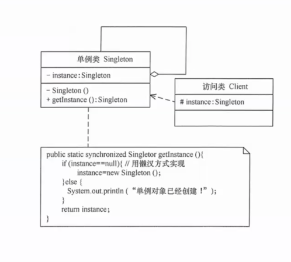

**生活实例**：一个班级只有一个班主任。你不能"new 一个班主任"，只能通过"找班主任"这个操作获取已有的那一个。不管谁来问，都是同一个人。

**懒汉式 vs 饿汉式**：

- **饿汉式**：类加载时就创建实例。简单安全，但如果实例创建成本高且一直没用到，就浪费了。
- **懒汉式**：第一次调用 `getInstance()` 时才创建。按需加载，但需要注意线程安全问题（两个线程同时首次调用可能创建两个实例）。

**代码示意**：

```python
# 饿汉式：模块导入时即创建
class LLMClient:
    _instance = None

    def __new__(cls):
        if cls._instance is None:
            cls._instance = super().__new__(cls)
            cls._instance.model = "claude-opus-4-7"
            # 初始化连接池等重资源...
        return cls._instance

# 懒汉式（线程安全版）
import threading

class Configuration:
    _instance = None
    _lock = threading.Lock()

    def __new__(cls):
        if cls._instance is None:
            with cls._lock:
                if cls._instance is None:  # 双重检查
                    cls._instance = super().__new__(cls)
                    cls._instance._load_config()
        return cls._instance
```

**优缺点**：

| 优点 | 缺点 |
|------|------|
| 控制资源访问，避免重复创建 | 全局状态隐式共享，增加耦合 |
| 全局访问点方便 | 难以单元测试（不能 mock 成新实例） |
| 可以延迟初始化 | 可能隐藏依赖关系，使代码难以追踪 |

**AI 开发应用**：LLM 客户端的创建是单例模式的天然场景——建立连接开销大（加载模型配置、初始化 tokenizer），而且整个应用通常只有一个 LLM 连接。但要注意：如果你的应用需要同时连接多个模型，单例就变成了限制。此时应该用**多例模式**（一个模型一个实例的注册表）。

---

### 6. 原型模式（Prototype）

> 通过**拷贝**已有对象来创建新对象，而不是调用构造函数。

**提出背景**：有些对象的创建成本极高——比如一个经过大量训练的模型配置对象，或者一个加载了全量数据的初始状态。重新 `new` + 一步步初始化太慢了，更高效的做法是复制一个已有对象然后微调。

**核心思想**：定义一个 `clone()` 方法，返回对象的一个副本。关键在于区分**浅拷贝**（复制引用）和**深拷贝**（复制整个对象图）。

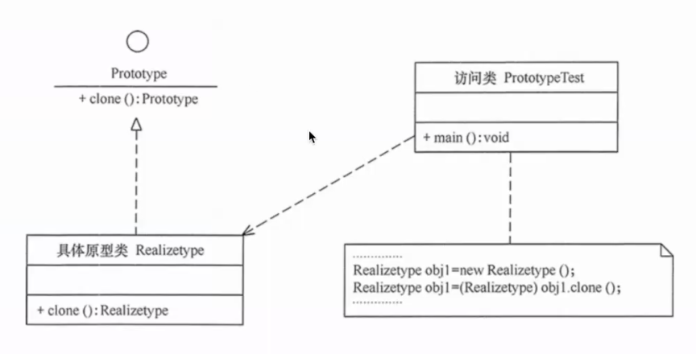

**生活实例**：复印机。你不会重新手写一份文件，而是把原件放进复印机，得到一份一模一样的副本，然后在上面做修改。

**代码示意**：

```python
import copy

class AgentConfig:
    def __init__(self):
        self.model = "claude-opus-4-7"
        self.tools = ["search", "code"]
        self.system_prompt = "You are a helpful assistant."
        self.temperature = 0.7

    def clone(self) -> "AgentConfig":
        return copy.deepcopy(self)

# 创建模板配置
base_config = AgentConfig()
base_config.system_prompt = "You are a helpful assistant."

# 基于模板快速生成变体
code_agent_config = base_config.clone()
code_agent_config.system_prompt = "You are a senior software engineer."
code_agent_config.tools.append("bash")
code_agent_config.temperature = 0.2
```

**优缺点**：

| 优点 | 缺点 |
|------|------|
| 创建成本低，避免昂贵的初始化 | 深拷贝复杂对象图可能很棘手 |
| 可以动态生成对象变体 | clone 和构造函数职责可能重叠 |
| 运行时灵活增减属性 | 循环引用的对象难以深拷贝 |

**AI 开发应用**：在 Agent 开发中，你经常需要一组"配置相似但行为不同"的 Agent 实例——比如多个代码审查 Agent，只有 system prompt 不同。用原型模式：创建一个 `base_agent` 配置作为原型，然后 clone + 微调。LangChain 1.0 中，`create_agent(model=..., middleware=[...])` 的配置字典可以作为原型，通过 `{**base_config, "middleware": [...extra...]}` 快速生成变体。

---

## 结构型模式（Structural Patterns）

### 7. 适配器模式（Adapter）

> 将一个类的接口转换成客户端期望的另一个接口，让**原本不兼容的类可以协作**。

**提出背景**：引入第三方库、遗留代码、或不同服务商 API 时，它们的接口往往与你的系统不兼容。你不可能为了迁就新库而重写整个系统，也不能强迫所有第三方遵循你的接口规范。

**核心思想**：创建一个适配器类，它实现客户端期望的接口，内部将调用委托给被适配的对象，完成数据格式和调用方式的转换。

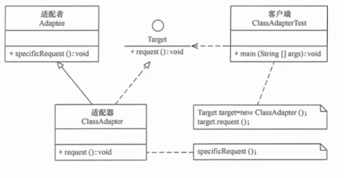

**生活实例**：出国旅行用的电源转换插头。中国的插头（客户端期望接口）插不进英国的插座（被适配者），转换插头（适配器）在中间做转换，两头都对得上。

**代码示意**：

```python
# 各 LLM 提供商的接口各不相同
class OpenAIAdapter:
    def __init__(self, api_key: str): ...

    def generate(self, messages: list[dict], **kwargs) -> str:
        import openai
        response = openai.ChatCompletion.create(
            model=kwargs.get("model", "gpt-4"),
            messages=messages,
            temperature=kwargs.get("temperature", 0.7)
        )
        return response.choices[0].message.content

class AnthropicAdapter:
    def __init__(self, api_key: str): ...

    def generate(self, messages: list[dict], **kwargs) -> str:
        import anthropic
        # 将 messages 格式转换为 Anthropic 的格式
        system = next((m["content"] for m in messages if m["role"] == "system"), "")
        user_msgs = [m for m in messages if m["role"] in ("user", "assistant")]
        response = anthropic.Anthropic().messages.create(
            model=kwargs.get("model", "claude-opus-4-7"),
            system=system,
            messages=user_msgs,
            max_tokens=4096
        )
        return response.content[0].text

# 使用者可以透明切换
def chat(llm_adapter, prompt: str) -> str:
    return llm_adapter.generate([{"role": "user", "content": prompt}])
```

**优缺点**：

| 优点 | 缺点 |
|------|------|
| 让不兼容的接口协作，复用已有代码 | 引入额外一层，轻微增加复杂度 |
| 符合单一职责原则（适配逻辑集中） | 适配器过多时系统变得零碎 |
| 对客户端透明，无需修改已有代码 | 不支持被适配者的所有功能（最小公分母） |

**AI 开发应用**：**这是 AI 开发中使用频率最高的设计模式。** 不同 LLM 提供商的 API 各不相同——OpenAI 的 `ChatCompletion.create`、Anthropic 的 `Messages.create`、Google 的 `GenerativeModel.generate_content`——通过适配器可以将它们统一为一个 `generate(messages) -> str` 接口。你在 LangChain 中用的 `BaseChatModel` 本质上就是一套适配器体系。当你想引入一个新模型而 LangChain 还不支持时，自己写一个适配器是最合理的做法。

---

### 8. 桥接模式（Bridge）

> 将**抽象**与**实现**分离，使它们可以独立变化。

**提出背景**：当一个类在两个维度上独立变化时——比如"提示词类型"和"模型类型"——如果使用继承，会产生笛卡尔积爆炸（3 种提示词 × 3 种模型 = 9 个子类）。桥接模式用组合替代继承，让两个维度各自独立扩展。

**核心思想**：定义一个抽象（持有实现接口的引用），实现接口有多个具体实现。抽象的变化通过组合实现的变化来完成，而非通过继承。

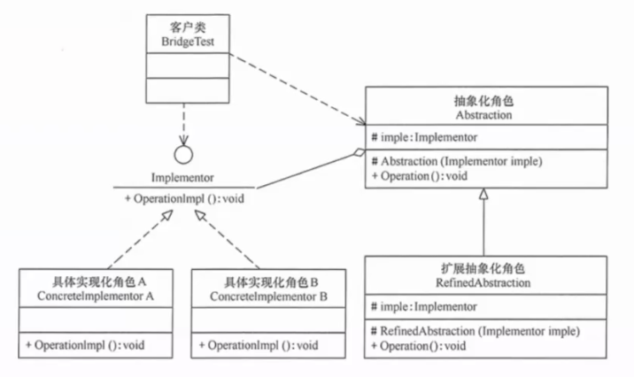

**生活实例**：遥控器（抽象）与电视品牌（实现）。你有一个万能遥控器，它不关心电视是什么品牌——索尼、三星、小米都可以。同样，遥控器本身可以升级（加语音功能），不影响电视的正常使用。两者独立变化。

**代码示意**：

```python
# 实现维度：模型
class ModelBackend(ABC):
    @abstractmethod
    def generate(self, prompt: str) -> str: ...

class GPT4Backend(ModelBackend):
    def generate(self, prompt: str) -> str: ...

class ClaudeBackend(ModelBackend):
    def generate(self, prompt: str) -> str: ...

# 抽象维度：Prompt 模板
class PromptTemplate(ABC):
    def __init__(self, backend: ModelBackend):
        self._backend = backend  # 桥接点

    @abstractmethod
    def run(self, context: dict) -> str: ...

class ZeroShotTemplate(PromptTemplate):
    def run(self, context: dict) -> str:
        prompt = f"Task: {context['task']}\nAnswer: "
        return self._backend.generate(prompt)

class FewShotTemplate(PromptTemplate):
    def run(self, context: dict) -> str:
        prompt = f"Examples:\n"
        for q, a in context["examples"]:
            prompt += f"Q: {q}\nA: {a}\n"
        prompt += f"Q: {context['task']}\nA: "
        return self._backend.generate(prompt)

# 2种模板 × 2种模型 = 4种组合，但只需 2+2=4 个类（而非继承方案的4个）
few_shot_claude = FewShotTemplate(ClaudeBackend())
zero_shot_gpt4 = ZeroShotTemplate(GPT4Backend())
```

**优缺点**：

| 优点 | 缺点 |
|------|------|
| 两个维度独立扩展，避免类爆炸 | 增加系统的理解和设计难度 |
| 实现细节对客户端隐藏 | 需要正确识别出独立变化的维度 |
| 运行时可以动态切换实现 | 如果只有一个维度变化，就是过度设计 |

**AI 开发应用**：在 Prompt Engineering 中，Prompt 结构（zero-shot / few-shot / chain-of-thought）和 LLM 后端是两个独立变化的维度。桥接模式让你可以任意组合而不产生子类爆炸。另一个场景是：Agent 的推理策略（ReAct / Plan-and-Execute / Tree-of-Thought）作为抽象，具体的 LLM 作为实现，通过桥接自由搭配。

---

### 9. 组合模式（Composite）

> 将对象组织为**树形结构**，使客户端可以**统一处理**单个对象和组合对象。

**提出背景**：在树形结构中（文件系统、组织架构、UI 组件树），客户端经常需要区分"叶子节点"和"分支节点"，导致大量 if-else 判断。组合模式让叶子节点和分支节点实现同一个接口。

**核心思想**：定义一个抽象组件，叶子节点和组合节点都实现它。组合节点内部持有一组子组件，调用组合节点的方法时，它会递归调用所有子节点的方法。

**生活实例**：军队的指挥结构。一个师长下达"进攻"命令，他不需要区分下属是"直接作战的士兵"（叶子）还是"下辖多个团的旅长"（组合）——每个人都知道进攻是什么意思。旅长接到命令后，再递归地传达给下属。

**代码示意**：

```python
class ChainComponent(ABC):
    @abstractmethod
    def invoke(self, input_data: dict) -> dict: ...

class SimpleStep(ChainComponent):
    """叶子节点：一个具体的处理步骤"""
    def __init__(self, name: str, fn):
        self.name = name
        self._fn = fn

    def invoke(self, input_data: dict) -> dict:
        print(f"  Executing: {self.name}")
        return self._fn(input_data)

class ParallelChain(ChainComponent):
    """组合节点：并行执行多个子步骤"""
    def __init__(self):
        self._children: list[ChainComponent] = []

    def add(self, component: ChainComponent):
        self._children.append(component)

    def invoke(self, input_data: dict) -> dict:
        results = []
        for child in self._children:
            results.append(child.invoke(input_data))
        return {"parallel_results": results}

# 使用：构建一个"摘要 + 翻译"的树形处理流程
summarize = SimpleStep("摘要", lambda d: {"summary": "...summary of " + d["text"]})
translate_en = SimpleStep("英译", lambda d: {"en": "...English version"})
translate_ja = SimpleStep("日译", lambda d: {"ja": "...Japanese version"})

pipeline = ParallelChain()
pipeline.add(summarize)
pipeline.add(ParallelChain())  # 嵌套组合
pipeline.invoke({"text": "长文本..."})
```

**优缺点**：

| 优点 | 缺点 |
|------|------|
| 客户端代码简洁，不需要区分叶子和分支 | 限制叶子节点和分支节点必须有相同的接口签名 |
| 方便添加新的组件类型 | 过度抽象可能让系统更难理解 |
| 天然支持递归和嵌套 | 类型安全问题（叶子节点添加子节点会抛异常） |

**AI 开发应用**：在 LangGraph 的 `StateGraph` 中，一个 Node 既可以是简单的 LLM 调用（叶子），也可以内部嵌套一个完整的子 Graph（组合），它们都通过 `add_node()` 以统一的方式接入主图。LangChain 1.0 的 AgentMiddleware 列表也体现了组合模式——`middleware=[A, B, C]` 既可以放单个 middleware（叶子），也可以放一个 `MiddlewareStack`（组合），外部调用方式完全一致。

---

### 10. 装饰模式（Decorator）

> **动态地**给对象添加额外的职责，而不影响同一接口的其他对象。

**提出背景**：继承是实现功能扩展的最直接手段，但继承是静态的（编译时决定），而且会导致类的组合爆炸。你需要一种更灵活的方式——在运行时给对象"包上"新功能，而且可以多层包裹。

**核心思想**：定义一个装饰器类，它和被装饰对象实现相同的接口。装饰器内部持有一个被装饰对象的引用，在调用被装饰对象前后加入自己的逻辑。

**生活实例**：点外卖。"一个汉堡"是基础对象。你加了"多加芝士"就是一层装饰，又加了"不要生菜"是第二层装饰。每层装饰都返回"一个汉堡"，但你得到的是一个层层包裹的汉堡。装饰的顺序可以自由组合。

**代码示意**：

```python
class LLMService(ABC):
    @abstractmethod
    def call(self, prompt: str) -> str: ...

class BasicLLM(LLMService):
    def call(self, prompt: str) -> str:
        return openai_call(prompt)  # 直接调用 LLM

class CachingDecorator(LLMService):
    """装饰器：添加缓存功能"""
    def __init__(self, wrapped: LLMService):
        self._wrapped = wrapped
        self._cache = {}

    def call(self, prompt: str) -> str:
        if prompt in self._cache:
            print("[Cache Hit]")
            return self._cache[prompt]
        result = self._wrapped.call(prompt)
        self._cache[prompt] = result
        return result

class RetryDecorator(LLMService):
    """装饰器：添加重试功能"""
    def __init__(self, wrapped: LLMService, max_retries: int = 3):
        self._wrapped = wrapped
        self._max_retries = max_retries

    def call(self, prompt: str) -> str:
        for attempt in range(self._max_retries):
            try:
                return self._wrapped.call(prompt)
            except RateLimitError:
                if attempt == self._max_retries - 1:
                    raise
                time.sleep(2 ** attempt)

class LoggingDecorator(LLMService):
    """装饰器：添加日志功能"""
    def __init__(self, wrapped: LLMService):
        self._wrapped = wrapped

    def call(self, prompt: str) -> str:
        start = time.time()
        result = self._wrapped.call(prompt)
        print(f"[LLM Call] {time.time() - start:.1f}s | tokens: {len(result)}")
        return result

# 灵活组合装饰——顺序自由
llm = LoggingDecorator(
    RetryDecorator(
        CachingDecorator(BasicLLM()),
        max_retries=3
    )
)
llm.call("什么是设计模式？")
```

**优缺点**：

| 优点 | 缺点 |
|------|------|
| 比继承更灵活，动态组合功能 | 会创建很多小对象 |
| 每个装饰器职责单一，符合 SRP | 装饰顺序可能影响结果 |
| 装饰器可以独立测试 | 调试时调用栈较深 |

**AI 开发应用**：LangChain 1.0 的 `AgentMiddleware` 体系——`ModelRetryMiddleware`、`ModelFallbackMiddleware`、`ModelCallLimitMiddleware`——就是装饰器模式的集大成。每个 middleware 只做一件横切事（重试、降级、限流），通过 `create_agent(middleware=[...])` 灵活组合。在自己的项目中，建议用同样的思路：将 LLM 调用的缓存、重试、日志、限流分别封装成可组合的装饰层，而不是把所有逻辑塞进一个巨大的 `call_llm` 函数。

---

### 11. 外观模式（Facade）

> 为子系统中的**一组接口**提供一个统一的高层接口，让子系统更容易使用。

**提出背景**：一个复杂的子系统可能有几十个类和方法。客户端只想要一个简单的结果（比如"分析这份数据"），不想关心内部是先查数据库还是先调 API、用哪个模型、怎么拼接结果。

**核心思想**：定义一个外观类，它封装了子系统的复杂性，对外只暴露几个简单的方法。客户端只依赖外观，不直接依赖子系统。

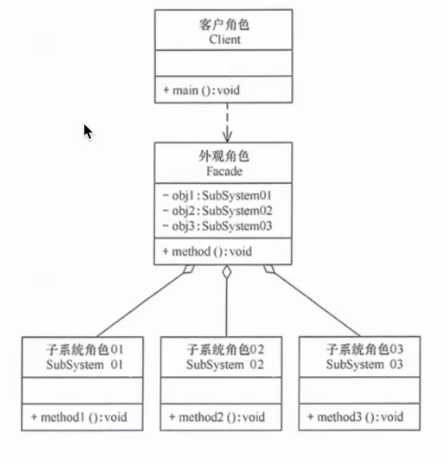

**生活实例**：一键启动汽车。你按下启动键（外观），背后的子系统——电瓶供电、启动机转动、油泵供油、点火线圈点火——全部自动协调执行。你不需要手动去做每一步。

**代码示意**：

```python
class DataAnalysisFacade:
    """数据分析的外观：隐藏内部的复杂协作"""
    def __init__(self):
        self._db = DatabaseConnector()
        self._cleaner = DataCleaner()
        self._llm = LLMAdapter()
        self._chart = ChartRenderer()

    def analyze(self, question: str) -> dict:
        """对外只暴露这一个方法"""
        # 1. 从数据库获取原始数据
        raw_data = self._db.query(question)

        # 2. 用 LLM 理解问题并生成分析代码
        code = self._llm.generate(f"Write Python code to analyze this data: {raw_data[:1000]}")

        # 3. 清洗数据
        clean_data = self._cleaner.process(raw_data)

        # 4. 执行分析
        result = self._execute_code(code, clean_data)

        # 5. 生成图表
        charts = self._chart.render(result)

        return {"analysis": result, "charts": charts}

# 使用者只需要一行
facade = DataAnalysisFacade()
result = facade.analyze("上个月的销售额趋势如何？")
```

**优缺点**：

| 优点 | 缺点 |
|------|------|
| 简化客户端，降低学习成本 | 外观可能变成"上帝类" |
| 解耦——子系统变化不影响客户端 | 高级用户可能失去对子系统的精细控制 |
| 提供系统的"入口点"，层次清晰 | 如果不主动暴露子系统，灵活性受损 |

**AI 开发应用**：一个完整的 AI 应用通常包含：LLM 调用 + 向量检索 + 数据库查询 + 工具调用 + 结果后处理。外观模式将这一整套流程封装为一个 `analyze()` 或 `chat()` 方法。LangChain 1.0 的 `create_agent()` 就是外观模式——内部组合了 ReAct 循环、middleware 链、工具注册表、模型调用，对外只是一个 `agent.invoke()` 方法。

---

### 12. 享元模式（Flyweight）

> 通过**共享**来高效支持大量细粒度对象，节省内存。

**提出背景**：当需要创建大量相似的对象时（比如一个文字编辑器中的每个字符都是一个对象），内存会迅速耗尽。享元模式将对象的内部状态（不变部分）和外部状态（可变部分）分离，内部状态可以被共享。

**核心思想**：创建享元工厂来管理共享对象池。请求对象时，如果池中已有相同内部状态的对象，直接返回它；否则创建新对象并加入池。

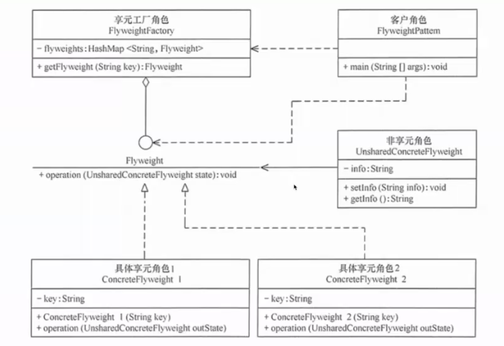

**生活实例**：图书馆的书籍管理系统。每本《三体》的元数据（作者、ISBN、简介）只有一份——这是共享的内部状态。而每本实体书的借阅状态、所在书架——这是外部状态，每个副本不同。

**代码示意**：

```python
class EmbeddingCache:
    """共享 Embedding 向量，避免重复计算"""
    _cache: dict[str, list[float]] = {}

    @classmethod
    def get_embedding(cls, text: str) -> list[float]:
        key = text.strip().lower()
        if key not in cls._cache:
            cls._cache[key] = cls._compute_embedding(text)
        return cls._cache[key]

    @classmethod
    def _compute_embedding(cls, text: str) -> list[float]:
        # 调用昂贵的 embedding API
        return embedding_api.embed(text)

# 对相同文本只计算一次 embedding
e1 = EmbeddingCache.get_embedding("设计模式")  # 首次：计算
e2 = EmbeddingCache.get_embedding("设计模式")  # 命中缓存
# e1 和 e2 指向同一个数组对象
```

**优缺点**：

| 优点 | 缺点 |
|------|------|
| 显著减少内存使用 | 需要严格区分内部/外部状态 |
| 共享的对象越多，节省越明显 | 代码复杂度上升 |
| 天然适合配合工厂模式使用 | 引入共享可能导致线程安全问题 |

**AI 开发应用**：最典型的场景是 **Embedding 缓存**——同一段文本可能被多次编码（比如知识库中重复的段落），享元模式避免重复调用昂贵的 Embedding API。另一个场景是 LLM 的 **KV Cache 共享**——对于相同的 system prompt，多个请求可以共享初始部分的 KV Cache，减少重复计算。不过要注意：享元模式适用于读多写少、内部状态不变的场景。

---

### 13. 代理模式（Proxy）

> 为另一个对象提供一个**替身或占位符**来控制对它的访问。

**提出背景**：有些对象创建成本高（大图片）、访问受限（敏感数据）、或位于远程（网络对象）。你不想直接暴露它，也不想每次访问都创建它。代理提供一个"中间人"，根据需求延迟创建、控制权限、或转发远程调用。

**核心思想**：代理类和真实类实现同一个接口。代理持有对真实对象的引用，在调用真实对象前后可以执行额外逻辑（权限检查、日志、延迟加载等）。

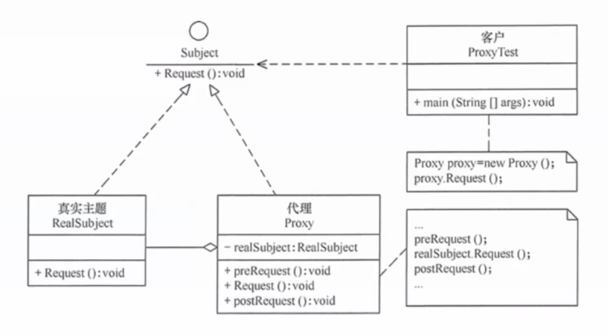

**生活实例**：信用卡是银行账户的代理。你去商场刷卡（使用代理），不用带现金（真实对象——你的钱在银行）。信用卡在处理支付时可能会先检查余额（权限控制），记录交易日志（日志记录），月底再告诉你总花费。

**代码示意**：

```python
class LLMService(ABC):
    @abstractmethod
    def call(self, prompt: str) -> str: ...

class RealLLM(LLMService):
    def call(self, prompt: str) -> str:
        return openai.ChatCompletion.create(model="gpt-4", messages=[...])

class RateLimitingProxy(LLMService):
    """限流代理：控制 LLM 调用频率"""
    def __init__(self, real_llm: LLMService, max_calls_per_minute: int):
        self._real_llm = real_llm
        self._call_times = []
        self._max_calls = max_calls_per_minute

    def call(self, prompt: str) -> str:
        now = time.time()
        self._call_times = [t for t in self._call_times if now - t < 60]
        if len(self._call_times) >= self._max_calls:
            raise RateLimitError("Too many requests")
        self._call_times.append(now)
        return self._real_llm.call(prompt)

class AuthProxy(LLMService):
    """鉴权代理：控制谁可以调用 LLM"""
    def __init__(self, real_llm: LLMService, allowed_users: set):
        self._real_llm = real_llm
        self._allowed_users = allowed_users

    def call(self, prompt: str, user: str = None) -> str:
        if user not in self._allowed_users:
            raise PermissionError(f"User '{user}' is not authorized")
        return self._real_llm.call(prompt)

# 代理可以嵌套
llm = RateLimitingProxy(
    AuthProxy(RealLLM(), allowed_users={"alice", "bob"}),
    max_calls_per_minute=60
)
```

**优缺点**：

| 优点 | 缺点 |
|------|------|
| 职责清晰——每个代理只关心一个横切关注点 | 增加间接层，调用链变长 |
| 对客户端透明，无需修改使用代码 | 代理过多时调试困难 |
| 代理可灵活组合 | 如果全部功能都走代理，性能有轻微损耗 |

**AI 开发应用**：LangChain 1.0 的 `wrap_model_call` / `wrap_tool_call` 两个 Hook 就是代理模式——middleware 在模型/工具调用前后插入逻辑（限流、日志、缓存），对调用双方完全透明。`ModelCallLimitMiddleware`（限流代理）、`AnthropicPromptCachingMiddleware`（缓存代理）都是代理模式的直接应用。

---

## 行为型模式（Behavioral Patterns）

### 14. 责任链模式（Chain of Responsibility）

> 将多个处理对象连成一条链，请求沿链传递，直到某个对象处理它为止。

**提出背景**：当一个请求可能被多个处理器中的某一个处理，且处理顺序可变时，用 if-else 把所有处理器写死会导致代码臃肿且难以扩展。

**核心思想**：每个处理器持有下一个处理器的引用。接到请求后，自己能处理就处理，不能处理就传递给下一个。就像击鼓传花。

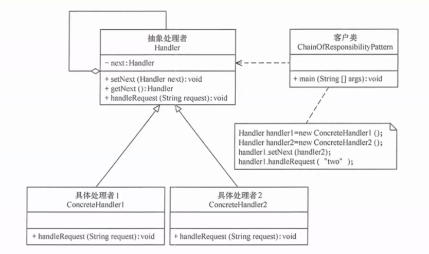

**生活实例**：请假审批流程。你提交请假申请 → 直属领导能批 3 天以内的 → 部门经理能批 7 天以内的 → 总监能批 15 天以内的 → CEO 能批无限天。每个审批人如果不能处理就向上传递。

**代码示意**：

```python
class Handler(ABC):
    def __init__(self):
        self._next: Handler | None = None

    def set_next(self, handler: "Handler") -> "Handler":
        self._next = handler
        return handler  # 支持链式调用

    def handle(self, request: str) -> str:
        result = self._process(request)
        if result is not None:
            return result
        if self._next:
            return self._next.handle(request)
        return "No handler could process the request"

    @abstractmethod
    def _process(self, request: str) -> str | None: ...

class CodeHandler(Handler):
    def _process(self, request: str) -> str | None:
        if "写代码" in request or "debug" in request:
            return f"[Coder] 我来处理：{request}"
        return None

class DataHandler(Handler):
    def _process(self, request: str) -> str | None:
        if "分析" in request or "图表" in request:
            return f"[Analyst] 我来处理：{request}"
        return None

class GeneralHandler(Handler):
    def _process(self, request: str) -> str | None:
        return f"[General] 我来处理：{request}"

# 构建链
chain = CodeHandler()
chain.set_next(DataHandler()).set_next(GeneralHandler())

chain.handle("帮我写代码")   # → [Coder]
chain.handle("帮我分析数据") # → [Analyst]
chain.handle("帮我倒杯咖啡") # → [General]
```

**优缺点**：

| 优点 | 缺点 |
|------|------|
| 请求和处理者解耦 | 请求可能走到链尾都没被处理 |
| 动态调整链的顺序和组成 | 链太长会影响性能 |
| 符合单一职责原则 | 调试时需要追踪整条链 |

**AI 开发应用**：LangChain 1.0 的 middleware 列表 `[AuthMiddleware(), PIIMiddleware(), SummarizationMiddleware()]` 就是一条责任链——请求按顺序经过每个 middleware，每个都可以处理、修改或阻断。此外，在 Agent 开发中，"工具选择链"也体现责任链思想——一个请求来了，先让代码工具尝试处理，不行再给搜索工具，再不行交给通用对话工具。

---

### 15. 命令模式（Command）

> 将**请求封装为对象**，从而可以用不同的请求参数化客户端、支持请求队列和日志记录、以及支持撤销操作。

**提出背景**：在 GUI 开发中，同一个操作（如"保存"）可能由菜单项、工具栏按钮、快捷键触发。如果把逻辑直接写在事件处理器里，会四处重复。命令模式将"动作"封装为独立对象，可以在不同上下文中重用。

**核心思想**：定义一个命令接口（含 `execute()` 和 `undo()` 方法），具体命令封装一个操作及其参数。调用者只依赖命令接口，不关心具体操作。

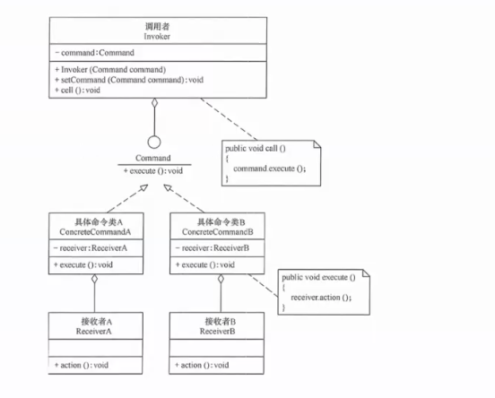

**生活实例**：餐厅点菜。你把要点的菜写在订单上（命令对象），服务员（调用者）收集订单交给厨房（接收者），厨房按订单做菜。关键是——订单是独立的对象，可以被排队（多个订单）、可以被撤销（退菜）、可以被记录（日结对账）。

**代码示意**：

```python
class Command(ABC):
    @abstractmethod
    def execute(self) -> str: ...
    @abstractmethod
    def undo(self) -> str: ...

class ToolCallCommand(Command):
    def __init__(self, tool_name: str, params: dict, tool_registry):
        self._tool_name = tool_name
        self._params = params
        self._registry = tool_registry
        self._result = None

    def execute(self) -> str:
        tool = self._registry.get(self._tool_name)
        self._result = tool.run(**self._params)
        return self._result

    def undo(self) -> str:
        if self._result is None:
            return "Nothing to undo"
        tool = self._registry.get(self._tool_name)
        tool.rollback(self._result)
        return f"Undid {self._tool_name}"

class AgentTaskQueue:
    """按顺序执行命令，支持撤销"""
    def __init__(self):
        self._commands: list[Command] = []
        self._history: list[Command] = []

    def add(self, command: Command):
        self._commands.append(command)

    def run_all(self) -> list[str]:
        results = []
        for cmd in self._commands:
            results.append(cmd.execute())
            self._history.append(cmd)
        self._commands.clear()
        return results

    def undo_last(self) -> str:
        if self._history:
            return self._history.pop().undo()
        return "Nothing to undo"

queue = AgentTaskQueue()
queue.add(ToolCallCommand("search", {"query": "设计模式"}, registry))
queue.add(ToolCallCommand("write_file", {"path": "notes.md", "content": "..."}, registry))
results = queue.run_all()
queue.undo_last()  # 撤销最后一个操作
```

**优缺点**：

| 优点 | 缺点 |
|------|------|
| 将请求者和执行者完全解耦 | 每个命令一个类，类数量膨胀 |
| 方便实现撤销/重做 | 命令的 undo 实现可能很困难 |
| 支持命令队列、日志、事务 | 简单场景下是过度设计 |

**AI 开发应用**：Agent 的工具调用天然适合命令模式。当 Agent 决定调用多个工具时，把每个工具调用封装为 `ToolCallCommand`，放入队列顺序执行。好处是：可以加入撤销逻辑（比如写文件后发现不对就删掉）、可以记录完整的调用日志用于审计、可以实现"重试"（重新执行整个命令队列）。在 LangGraph 中，`Command` 对象本身就是命令模式的体现——它封装了状态更新和目标路由。

---

### 16. 解释器模式（Interpreter）

> 给定一种语言，定义它的文法表示，并定义一个解释器来解释执行这种语言中的句子。

**提出背景**：当程序需要处理特定领域的小型语言（DSL）时——如 SQL 查询、正则表达式、配置文件中的条件表达式——硬编码解析逻辑会变得难以维护。

**核心思想**：将文法中的每类语法规则映射为一个表达式类。要解释一个句子时，先解析为抽象语法树（AST），然后递归解释每个节点。

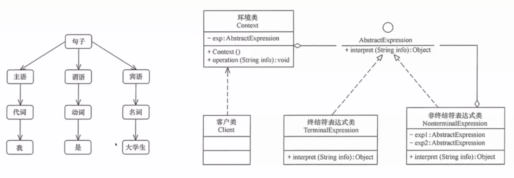

**生活实例**：计算器。你输入 `1 + 2 * 3`，计算器内部先解析这个表达式为一棵树（乘法节点下面有 2 和 3，加法节点下面有 1 和乘法结果），然后递归计算每个节点得到最终结果 7。

**代码示意**：

```python
# 一个简单的 Prompt 模板表达式解释器
class Expression(ABC):
    @abstractmethod
    def interpret(self, context: dict) -> str: ...

class Literal(Expression):
    """字面量：直接返回文本"""
    def __init__(self, text: str):
        self._text = text

    def interpret(self, context: dict) -> str:
        return self._text

class Variable(Expression):
    """变量：从上下文中取值"""
    def __init__(self, name: str):
        self._name = name

    def interpret(self, context: dict) -> str:
        return context.get(self._name, f"{{{{{self._name}}}}}")

class Concat(Expression):
    """连接：将多个表达式的结果拼接"""
    def __init__(self, *expressions: Expression):
        self._expressions = expressions

    def interpret(self, context: dict) -> str:
        return "".join(e.interpret(context) for e in self._expressions)

# 使用：模拟 "你是{role}，请完成{task}" 的解释
template = Concat(
    Literal("你是"),
    Variable("role"),
    Literal("，请完成"),
    Variable("task"),
    Literal("。")
)

print(template.interpret({"role": "Python 专家", "task": "编写排序函数"}))
# 输出：你是Python 专家，请完成编写排序函数。
```

**优缺点**：

| 优点 | 缺点 |
|------|------|
| 语法规则易于扩展 | 复杂文法会导致类爆炸 |
| 每类规则独立，符合 SRP | 不适合解析大型语言 |
| 可以组合规则 | 执行效率不高 |

**AI 开发应用**：在 Prompt 工程中，自定义模板引擎（如 Jinja2 风格的 Prompt 模板）本质上用了解释器模式。LangChain 的 `PromptTemplate` 的 `{variable}` 插值就是一个简化版的解释器。更高级的应用包括：定义 Agent 的"思考语言"（如 ReAct 的 `Thought: ... Action: ... Observation: ...`），用解释器模式解析和验证 Agent 的输出格式。

> ⚠️ **注意**：在实际项目中，解释器模式很少自己从头实现。大多数情况下会使用现成的模板引擎、配置解析库或编译器工具。但理解它的原理有助于你设计自己的 Prompt DSL 或 Agent 指令格式。

---

### 17. 迭代器模式（Iterator）

> 提供一种方法**顺序访问**聚合对象中的元素，而不暴露其内部表示。

**提出背景**：数据可能存储在各种结构中——列表、树、图、数据库游标——如果每种结构的遍历方式都不同，使用者就必须了解每种结构的遍历细节。迭代器提供一个统一的 `next()` / `hasNext()` 接口。

**核心思想**：将遍历行为从聚合对象中分离出来，封装在一个独立的迭代器对象中。聚合对象只负责返回迭代器。

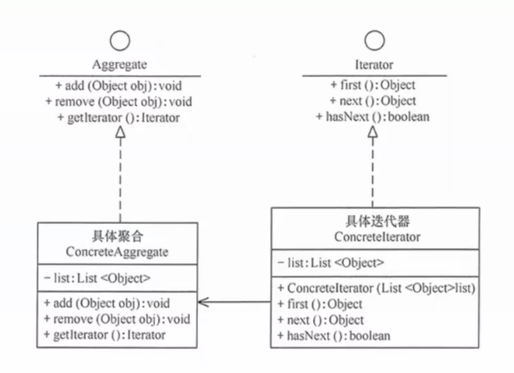

**生活实例**：听歌时的播放列表。不管你的歌曲是存在本地硬盘、云盘、还是 U 盘里，播放器只需要知道"下一首"和"有没有下一首"——底层的存储结构对你完全透明。

**代码示意**：

```python
class StreamIterator:
    """封装 LLM 的流式输出，提供统一的逐 token 迭代"""
    def __init__(self, llm_response_stream):
        self._stream = llm_response_stream
        self._buffer = ""

    def __iter__(self):
        return self

    def __next__(self) -> str:
        chunk = next(self._stream)
        if chunk is None:
            raise StopIteration
        token = chunk.choices[0].delta.content
        self._buffer += token
        return token

    def get_full_text(self) -> str:
        """完成迭代后可获取完整文本"""
        return self._buffer
```

**优缺点**：

| 优点 | 缺点 |
|------|------|
| 统一遍历接口，客户端代码简洁 | 简单遍历（如列表）不需要迭代器 |
| 一个聚合可以有多个迭代器 | 某些实现比直接索引遍历慢 |
| 可以暂停、恢复遍历 | 遍历期间修改聚合可能导致问题 |

**AI 开发应用**：LLM 的**流式输出（Streaming）** 就是迭代器模式——模型逐个生成 token，你逐个消费，不需要知道 tokens 是怎么存储的。在设计 RAG 系统的文档检索器时，迭代器模式也很实用：不管底层是向量数据库、全文检索还是混合检索，对外都暴露统一的 `search(query) -> Iterator[Document]`。

---

### 18. 中介者模式（Mediator）

> 用一个中介对象封装一组对象的交互，避免这些对象之间显式地相互引用。

**提出背景**：在一个复杂的交互网络中（如聊天室、机场塔台、多 Agent 协作系统），如果让每个对象直接与其他对象通信，会形成网状依赖——N 个对象需要 O(N²) 个连接。中介者将所有通信集中到一点。

**核心思想**：引入一个中介者对象，所有通信都经过它。各组件只依赖中介者，不依赖其他组件。

**生活实例**：机场塔台。几十架飞机如果可以互相喊话协调降落顺序，场面会混乱。实际上所有飞机只和塔台（中介者）通信，塔台统一调度。每架飞机不需要知道其他飞机的存在。

**代码示意**：

```python
class AgentMediator:
    """中介者：协调多个 Agent 的通信"""
    def __init__(self):
        self._agents: dict[str, "BaseAgent"] = {}

    def register(self, name: str, agent: "BaseAgent"):
        self._agents[name] = agent
        agent.set_mediator(self)

    def send(self, sender: str, receiver: str, message: str) -> str:
        if receiver == "broadcast":
            results = {}
            for name, agent in self._agents.items():
                if name != sender:
                    results[name] = agent.receive(sender, message)
            return str(results)
        elif receiver in self._agents:
            return self._agents[receiver].receive(sender, message)
        return f"Agent '{receiver}' not found"

class BaseAgent:
    def __init__(self, name: str):
        self.name = name
        self._mediator = None

    def set_mediator(self, mediator: AgentMediator):
        self._mediator = mediator

    def send(self, receiver: str, message: str) -> str:
        return self._mediator.send(self.name, receiver, message)

    def receive(self, sender: str, message: str) -> str:
        return f"[{self.name}] received from {sender}: {message}"

mediator = AgentMediator()
mediator.register("coder", BaseAgent("coder"))
mediator.register("reviewer", BaseAgent("reviewer"))

mediator.send("coder", "reviewer", "请审查这段代码")
mediator.send("reviewer", "broadcast", "代码审查通过！")
```

**优缺点**：

| 优点 | 缺点 |
|------|------|
| 将网状依赖变成星形，降低耦合 | 中介者容易变成"上帝对象" |
| 各组件的修改相互独立 | 中介者故障会导致整个系统瘫痪 |
| 集中控制交互逻辑，方便监控 | 复杂的交互规则让中介者难以维护 |

**AI 开发应用**：**多 Agent 协作是中介者模式最核心的 AI 应用场景。** 在 LangGraph 的多 Agent 系统中，图的 State 对象天然充当中介者——Agent A 把结果写入 State，Agent B 从 State 读取，Agent A 和 B 之间没有直接依赖。这种设计让你可以随意增删 Agent 而无需修改已有 Agent 的代码。AutoGen、CrewAI 等 Agent 框架的控制中心也都是中介者。

---

### 19. 备忘录模式（Memento）

> 在不破坏封装的前提下，捕获并**保存**一个对象的内部状态，以便之后可以**恢复**到这个状态。

**提出背景**：很多场景需要"撤销"功能——文本编辑器的 Ctrl+Z、数据库的事务回滚、游戏的存档读档。问题在于：对象的状态是私有的，外部不应该直接读取，但你又要保存它。

**核心思想**：由原发器（Originator）自己创建一个备忘录对象（Memento）来保存当前状态。只有原发器可以访问备忘录的内容。外部通过管理者（Caretaker）持有备忘录，但不能查看或修改它。

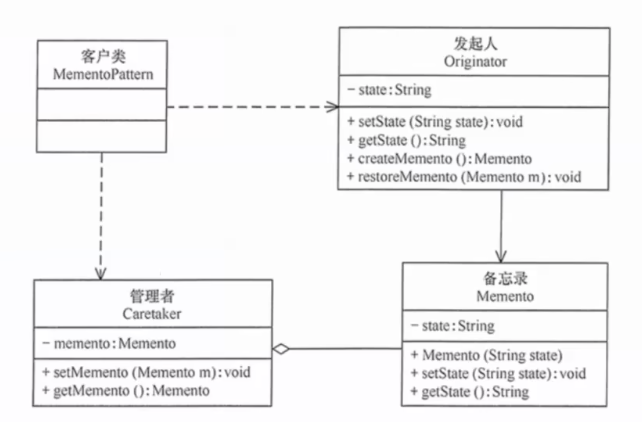

**生活实例**：游戏存档。游戏角色（Originator）的状态——等级、装备、位置——被保存为一个存档文件（Memento）。你可以把存档文件存在文件夹里（Caretaker），但存档文件是加密的，你无法直接修改。要恢复时，游戏读取存档恢复到保存时的状态。

**代码示意**：

```python
import copy

class ConversationState:
    """原发器：对话状态"""
    def __init__(self):
        self.messages: list[dict] = []
        self.current_turn: int = 0

    def add_message(self, role: str, content: str):
        self.messages.append({"role": role, "content": content})
        self.current_turn += 1

    def save(self) -> "ConversationMemento":
        """创建备忘录"""
        return ConversationMemento(
            messages=copy.deepcopy(self.messages),
            turn=self.current_turn
        )

    def restore(self, memento: "ConversationMemento"):
        """从备忘录恢复"""
        self.messages = copy.deepcopy(memento.messages)
        self.current_turn = memento.turn

class ConversationMemento:
    """备忘录：不可变的状态快照"""
    def __init__(self, messages: list[dict], turn: int):
        self._messages = messages
        self._turn = turn

    @property
    def messages(self):
        return self._messages

    @property
    def turn(self):
        return self._turn

class ConversationManager:
    """管理者：管理历史快照，实现撤销"""
    def __init__(self):
        self._conversation = ConversationState()
        self._history: list[ConversationMemento] = []

    def send(self, content: str):
        # 发送前保存快照
        self._history.append(self._conversation.save())
        self._conversation.add_message("user", content)
        # ... LLM 回复 ...
        self._conversation.add_message("assistant", "reply")

    def undo(self):
        if len(self._history) > 0:
            self._conversation.restore(self._history.pop())

# 使用
manager = ConversationManager()
manager.send("你好")
manager.send("什么是设计模式？")
manager.undo()  # 撤销最后一轮对话
```

**优缺点**：

| 优点 | 缺点 |
|------|------|
| 不破坏封装即可保存和恢复状态 | 状态数据大时，备忘录会占用大量内存 |
| 简化了原发器的撤销逻辑 | 管理者需要知道何时创建快照 |
| 可以作为"事件溯源"的基础 | 频繁保存导致性能开销 |

**AI 开发应用**：AI Agent 中的对话状态管理与备忘录模式完美契合。每次工具调用或对话轮次前，你都可以创建当前 Agent 状态的快照。当 Agent 走入死胡同时（工具调用陷入循环、产生错误结果），你可以回滚到之前的状态，换一种策略重试。LangGraph 中的 **checkpointer** 本质上就是备忘录的自动版本——每次节点执行后自动保存 State 快照，支持时间旅行调试和故障恢复。

---

### 20. 观察者模式（Observer）

> 定义对象之间的**一对多依赖关系**。当一个对象（主题）状态改变时，所有依赖它的对象（观察者）都得到通知并自动更新。

**提出背景**：在很多系统中，一个事件发生后需要触发多个响应。比如用户下单后，需要扣库存、发邮件、记日志、推送通知。如果把这些逻辑全写在下单方法里，下单模块就太臃肿了。

**核心思想**：主题维护一个观察者列表。当状态变化时，主题遍历列表通知每个观察者。观察者可以随时订阅或取消订阅。

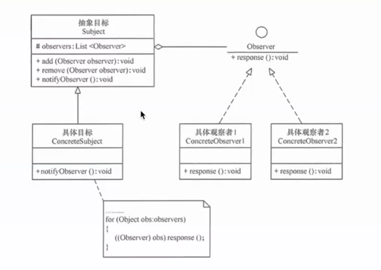

**生活实例**：公众号订阅。你关注了一个公众号（订阅），公众号发布新文章时（状态变化），你和所有其他关注者都会收到推送（通知）。你随时可以取消关注。

**代码示意**：

```python
class StreamingObserver(ABC):
    """观察者：监听 LLM 流式输出的每个 token"""
    @abstractmethod
    def on_token(self, token: str): ...

    @abstractmethod
    def on_complete(self, full_text: str): ...

    @abstractmethod
    def on_error(self, error: Exception): ...

class ProgressObserver(StreamingObserver):
    def on_token(self, token: str):
        print(token, end="", flush=True)

    def on_complete(self, full_text: str):
        print(f"\n[完成] 共 {len(full_text)} 字符")

    def on_error(self, error: Exception):
        print(f"\n[错误] {error}")

class CostTracker(StreamingObserver):
    """统计 token 消耗"""
    def __init__(self):
        self.token_count = 0

    def on_token(self, token: str):
        self.token_count += 1

    def on_complete(self, full_text: str):
        print(f"[Token 用量] {self.token_count} tokens")

    def on_error(self, error: Exception):
        pass

class LLMStreamPublisher:
    """主题：LLM 流式输出"""
    def __init__(self):
        self._observers: list[StreamingObserver] = []

    def subscribe(self, observer: StreamingObserver):
        self._observers.append(observer)

    def unsubscribe(self, observer: StreamingObserver):
        self._observers.remove(observer)

    def stream(self, prompt: str):
        full_text = ""
        try:
            for chunk in llm_stream(prompt):
                token = chunk.choices[0].delta.content
                full_text += token
                for obs in self._observers:
                    obs.on_token(token)
            for obs in self._observers:
                obs.on_complete(full_text)
        except Exception as e:
            for obs in self._observers:
                obs.on_error(e)
```

**优缺点**：

| 优点 | 缺点 |
|------|------|
| 主题和观察者松耦合 | 观察者过多时通知开销大 |
| 动态增删观察者，灵活 | 观察者的执行顺序不可控 |
| 支持广播，符合开闭原则 | 观察者中的错误可能影响主题 |

**AI 开发应用**：LLM 的流式输出（Streaming）是观察者模式的绝佳示例。LangChain 中的 `BaseCallbackHandler` 就是观察者——它监听 `on_llm_start`、`on_llm_new_token`、`on_llm_end` 等事件。你可以注册多个 Callback：一个在终端显示进度、一个记录 token 消耗、一个记录延迟到监控系统、一个在出错时发告警。它们彼此独立，互不干扰。

---

### 21. 状态模式（State）

> 允许对象在其**内部状态改变时改变它的行为**，看起来就像对象的类发生了变化。

**提出背景**：当一个对象的行为严重依赖于它的状态时（如订单的待支付→已支付→已发货→已完成），代码中会出现大量的 if-else 或 switch 判断不同状态下的行为。每增加一个状态，所有相关方法都要修改。

**核心思想**：将每种状态封装为一个类，所有状态类实现同一个接口。上下文对象持有一个当前状态对象的引用，将行为委托给当前状态。切换状态就是替换状态对象。

**生活实例**：自动饮水机的出水控制。当水杯不在时（待机状态），按什么键都不出水。当水杯放入（就绪状态），按冷水键出冷水，按热水键出热水。正在出水时（出水状态），再按键可能停止出水。同一个按键，在不同状态下行为完全不同。

**代码示意**：

```python
class AgentState(ABC):
    """Agent 的抽象状态"""
    def __init__(self, agent: "Agent"):
        self._agent = agent

    @abstractmethod
    def handle_input(self, user_input: str) -> str: ...
    @abstractmethod
    def handle_tool_result(self, result: str) -> str: ...

class IdleState(AgentState):
    """空闲状态：等待用户输入"""
    def handle_input(self, user_input: str) -> str:
        # 思考是否需要工具
        if self._agent.need_tool(user_input):
            self._agent.set_state(ToolCallingState(self._agent))
            return self._agent.use_tool(user_input)
        self._agent.set_state(GeneratingState(self._agent))
        return self._agent.generate(user_input)

    def handle_tool_result(self, result: str) -> str:
        return "当前没有在等待工具结果"

class ToolCallingState(AgentState):
    """工具调用状态：正在等待工具返回"""
    def handle_input(self, user_input: str) -> str:
        return "正在处理上一个请求，请稍候..."

    def handle_tool_result(self, result: str) -> str:
        # 工具结果返回，回到生成状态
        self._agent.set_state(GeneratingState(self._agent))
        return self._agent.generate_with_context(result)

class GeneratingState(AgentState):
    """生成状态：LLM 正在推理/生成"""
    def handle_input(self, user_input: str) -> str:
        return "Agent 正在生成回复，请稍候..."

    def handle_tool_result(self, result: str) -> str:
        return self._agent.generate_with_context(result)

class Agent:
    def __init__(self):
        self._state: AgentState = IdleState(self)

    def set_state(self, state: AgentState):
        self._state = state

    def handle_input(self, user_input: str) -> str:
        return self._state.handle_input(user_input)
```

**优缺点**：

| 优点 | 缺点 |
|------|------|
| 消除大量 if-else，符合 OCP | 状态类数量随状态增多 |
| 状态转换逻辑清晰 | 状态过多时维护状态转换矩阵困难 |
| 每个状态独立测试 | 如果状态很少就是过度设计 |

**AI 开发应用**：**状态模式是 LangGraph 的根基。** Agent 的思考过程天然是状态机：等待用户输入 → 思考 → 调用工具 → 等待工具返回 → 生成回复 → 等待用户输入。LangGraph 的节点（Node）就是状态，边（Edge）就是状态转换。你定义一个 StateGraph，本质上就是在声明状态模式。理解状态模式 = 理解 LangGraph 为什么这样设计。

---

### 22. 策略模式（Strategy）

> 定义一组算法，将它们**各自封装**起来，并使它们可以**相互替换**。策略模式让算法的变化独立于使用它的客户端。

**提出背景**：当你有一个任务可以用多种方式完成时——比如排序（快排、归并、冒泡）、支付（微信、支付宝、银行卡）、压缩（zip、rar、7z）——如果用 if-else，代码会膨胀且难以扩展。

**核心思想**：将每种算法封装为一个策略类，它们实现同一个策略接口。上下文持有一个策略引用，执行时委托给当前策略。策略可以在运行时切换。

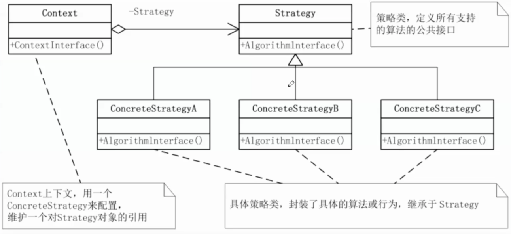

**生活实例**：导航软件。你要从 A 到 B，导航给出三条路线：最快路线、最短路线、避开高速。这三条路线就是三种策略——目标相同（从 A 到 B），算法不同。你可以在界面上随时切换。

**代码示意**：

```python
class PromptStrategy(ABC):
    """策略接口：不同的 Prompt 组织策略"""
    @abstractmethod
    def build_prompt(self, task: str, context: dict) -> str: ...

class ZeroShotStrategy(PromptStrategy):
    """零样本策略：直接给指令"""
    def build_prompt(self, task: str, context: dict) -> str:
        return f"请完成以下任务：{task}"

class FewShotStrategy(PromptStrategy):
    """少样本策略：给出几个示例"""
    def build_prompt(self, task: str, context: dict) -> str:
        prompt = "以下是一些示例：\n"
        for example in context.get("examples", []):
            prompt += f"输入：{example['input']}\n输出：{example['output']}\n"
        prompt += f"现在请完成：{task}"
        return prompt

class CoTStrategy(PromptStrategy):
    """思维链策略：引导逐步推理"""
    def build_prompt(self, task: str, context: dict) -> str:
        return f"请逐步思考以下问题：\n{task}\n让我们一步步分析：\n第一步："

class TaskSolver:
    """上下文：根据任务复杂度动态选择策略"""
    def __init__(self, llm):
        self._llm = llm
        self._strategies = {
            "simple": ZeroShotStrategy(),
            "with_example": FewShotStrategy(),
            "complex": CoTStrategy(),
        }

    def solve(self, task: str, context: dict) -> str:
        # 根据任务特征动态选择策略
        if len(task) < 20:
            strategy = self._strategies["simple"]
        elif context.get("examples"):
            strategy = self._strategies["with_example"]
        else:
            strategy = self._strategies["complex"]

        prompt = strategy.build_prompt(task, context)
        return self._llm.generate(prompt)
```

**优缺点**：

| 优点 | 缺点 |
|------|------|
| 算法可以独立变化和测试 | 客户端需要了解策略之间的区别以做出选择 |
| 避免 if-else，符合 OCP | 策略类数量随算法数量增多 |
| 运行时灵活切换 | 大部分策略需要相同的参数签名 |

**AI 开发应用**：策略模式是 Prompt Engineering 的理论基础——Zero-shot、Few-shot、Chain-of-Thought、Tree-of-Thought 都是策略。LangChain 1.0 的 `LLMToolSelectorMiddleware` 本质上是策略模式：用轻量 LLM 预筛选工具（策略 A）还是直接给全部工具列表（策略 B），可以根据任务复杂度动态切换。在 Agent 开发中，让 Agent 自己决定用哪种推理策略是"自适应 Agent"的核心思路。

---

### 23. 模板方法模式（Template Method）

> 在一个方法中定义**算法的骨架**（模板），将某些步骤延迟到子类中实现。子类可以在不改变算法结构的前提下，重新定义某些步骤。

**提出背景**：当多个类有相似的处理流程，但某些步骤的实现不同时——比如"打开文件 → 读取内容 → 处理数据 → 保存结果"这个流程，处理数据的步骤可能各不相同——应该提取不变的骨架，将变化的步骤交给子类。

**核心思想**：在父类的模板方法中（通常用 `final` 修饰）定义算法步骤的调用顺序。将可变步骤声明为抽象方法，由子类实现。

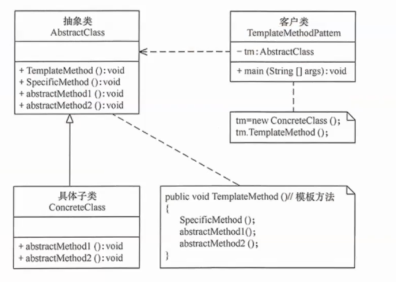

**生活实例**：泡茶和泡咖啡。流程完全一样：烧水 → 冲泡 → 倒入杯中 → 加调料。区别只是"冲泡"这一步（茶叶 vs 咖啡粉）和"加调料"这一步（柠檬 vs 糖奶）。模板方法就是提取出"烧水 → X → 倒入杯中 → Y"这个骨架。

**代码示意**：

```python
class AgentPipeline(ABC):
    """模板方法：定义 Agent 处理请求的标准流程"""
    def run(self, user_input: str) -> str:
        """模板方法（子类不应该重写此方法）"""
        # Step 1: 预处理（固定）
        cleaned = self._preprocess(user_input)

        # Step 2: 检索上下文（可变——由子类决定如何检索）
        context = self._retrieve_context(cleaned)

        # Step 3: 构建 Prompt（可变）
        prompt = self._build_prompt(cleaned, context)

        # Step 4: 调用 LLM（固定）
        response = self._call_llm(prompt)

        # Step 5: 后处理（可变）
        final = self._postprocess(response)

        # Step 6: 记录日志（固定）
        self._log(user_input, final)
        return final

    def _preprocess(self, text: str) -> str:
        """预处理（可重写，有默认实现）"""
        return text.strip()

    def _call_llm(self, prompt: str) -> str:
        """调用 LLM（固定实现，一般不需要改动）"""
        return self.llm.invoke(prompt)

    def _log(self, input_text: str, output_text: str):
        """记录日志（默认空操作，子类可选重写）"""
        pass

    # === 子类必须实现的方法 ===
    @abstractmethod
    def _retrieve_context(self, query: str) -> str: ...

    @abstractmethod
    def _build_prompt(self, query: str, context: str) -> str: ...

    @abstractmethod
    def _postprocess(self, response: str) -> str: ...

class RAGAgent(AgentPipeline):
    """RAG Agent：检索文档后回答"""
    def _retrieve_context(self, query: str) -> str:
        docs = self.vector_store.similarity_search(query, k=5)
        return "\n".join(doc.content for doc in docs)

    def _build_prompt(self, query: str, context: str) -> str:
        return f"根据以下信息回答问题：\n{context}\n\n问题：{query}"

    def _postprocess(self, response: str) -> str:
        return response  # RAG 不需要特殊后处理

class CodeAgent(AgentPipeline):
    """代码 Agent：检索代码库后生成代码"""
    def _retrieve_context(self, query: str) -> str:
        files = self.code_search.search(query, top_k=3)
        return "\n---\n".join(f.content for f in files)

    def _build_prompt(self, query: str, context: str) -> str:
        return f"参考以下代码：\n{context}\n\n任务：{query}\n请输出完整的代码实现："

    def _postprocess(self, response: str) -> str:
        # 提取代码块
        import re
        match = re.search(r"```python\n(.*?)\n```", response, re.DOTALL)
        return match.group(1) if match else response
```

**优缺点**：

| 优点 | 缺点 |
|------|------|
| 代码复用——算法骨架只写一次 | 受限于固定的算法结构 |
| 子类只关注差异部分 | 模板方法可能变得过于复杂 |
| 符合"好莱坞原则"：不要调用我，我会调用你 | 继承的局限性——不如策略模式灵活 |

**AI 开发应用**：Agent 的处理流程天然适合模板方法。几乎所有 Agent 都遵循相似的模式：接收输入 → 理解意图 → 可能检索 → 可能调用工具 → 生成回复。将这套骨架定义在 `AgentPipeline.run()` 模板方法中，不同的 Agent（RAG Agent、代码 Agent、数据分析 Agent）只需实现其中差异化的步骤。LangGraph 的 `StateGraph` 本质上让这种模式从"编译时继承"升级为"运行时组合"——节点是步骤，边是流程控制。

---

### 24. 访问者模式（Visitor）

> 表示一个作用于某对象结构中各元素的操作。访问者模式让你可以**在不改变元素类的前提下**，定义作用于这些元素的新操作。

**提出背景**：当你有一个相对稳定的对象结构（如 AST、文档树），但需要频繁地添加新的操作（如语法检查、格式化、代码生成），每次添加操作都去修改元素类会违反 OCP。

**核心思想**：元素类提供一个 `accept(visitor)` 方法，访问者类为每种元素类型提供一个 `visit` 重载。通过"双重分派"机制——客户端调用 `element.accept(visitor)`，元素内部调用 `visitor.visit(this)`——找到对应的方法。

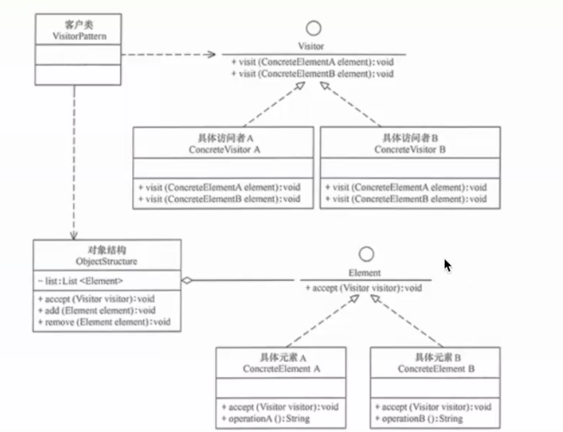

**生活实例**：房屋验收。房子（对象结构）有客厅、厨房、卧室——它们是稳定的，不会轻易改变。验收员（访问者）逐一检查每个房间。不同的验收员做不同的事情：电工检查电路、水工检查管道、结构工程师检查墙体——你不需要为了增加新的验收项目而修改房间本身。

**代码示意**：

```python
class DocumentVisitor(ABC):
    """访问者：定义对各种文档元素的操作"""
    @abstractmethod
    def visit_paragraph(self, para: "Paragraph"): ...
    @abstractmethod
    def visit_table(self, table: "Table"): ...
    @abstractmethod
    def visit_code_block(self, code: "CodeBlock"): ...

class MarkdownExporter(DocumentVisitor):
    """访问者 1：将文档导出为 Markdown"""
    def __init__(self):
        self.result = ""

    def visit_paragraph(self, para):
        self.result += para.text + "\n\n"

    def visit_table(self, table):
        header = "| " + " | ".join(table.headers) + " |"
        sep = "|" + "|".join(["---"] * len(table.headers)) + "|"
        rows = "\n".join("| " + " | ".join(row) + " |" for row in table.rows)
        self.result += f"{header}\n{sep}\n{rows}\n\n"

    def visit_code_block(self, code):
        self.result += f"```{code.language}\n{code.text}\n```\n\n"

class TokenCounter(DocumentVisitor):
    """访问者 2：统计文档 Token 数"""
    def __init__(self):
        self.total_tokens = 0

    def visit_paragraph(self, para):
        self.total_tokens += len(para.text) // 4

    def visit_table(self, table):
        for row in table.rows:
            for cell in row:
                self.total_tokens += len(cell) // 4

    def visit_code_block(self, code):
        self.total_tokens += len(code.text) // 3

class Document:
    def __init__(self):
        self.elements = []

    def accept(self, visitor: DocumentVisitor):
        """双重分派：this 决定调 visitor 的哪个 visit 方法"""
        for element in self.elements:
            element.accept(visitor)

class Paragraph:
    def __init__(self, text): self.text = text
    def accept(self, v): v.visit_paragraph(self)

class Table:
    def __init__(self, headers, rows): self.headers, self.rows = headers, rows
    def accept(self, v): v.visit_table(self)

class CodeBlock:
    def __init__(self, text, lang): self.text, self.language = text, lang
    def accept(self, v): v.visit_code_block(self)
```

**优缺点**：

| 优点 | 缺点 |
|------|------|
| 添加新操作容易，不需改动元素类 | 添加新元素类型需要修改所有访问者 |
| 相关操作集中在一个类中 | 访问者需要访问元素的内部细节 |
| 访问者可以跨元素类累积状态 | 双重分派机制较难理解 |

**AI 开发应用**：访问者模式在 AI 开发中**使用较少，但在特定场景很强大**。最典型的是文档处理：你的 Agent 需要处理混合文档（文字、表格、代码块、图片），不同的操作（生成摘要、提取代码、翻译文本、统计 token）都可以用访问者模式实现，而不需要修改文档元素的定义。另一个场景是 LangChain 的 Output Parser 体系——不同类型的输出（JSON、XML、Pydantic 对象）需要不同的解析策略，访问者模式可以优雅地管理这些解析逻辑。

---

# 四、AI 开发场景速查

作为 AI 开发者，你可能不需要记住全部 23 种模式。以下是实际开发中最常用的场景映射：

| 你在做什么... | 对应模式 | 一句话提示 |
|-------------|----------|-----------|
| 对接多个 LLM 提供商 | **适配器** | 统一接口，各自适配 |
| 给 LLM 调用加缓存/重试/日志/审批 | **装饰器 / Middleware** | 层层包裹，自由组合（LangChain 1.0 AgentMiddleware） |
| 设计 Middleware 链 / Agent 的请求处理 | **拦截器链 + 责任链** | Middleware 顺序执行，各自做前置/后置 |
| AgentMiddleware 的 Hook 扩展点 | **模板方法** | ReAct 骨架固定，Hook 点留给 middleware 扩展 |
| 构建复杂的 System Prompt | **建造者** | 分步设置，最后组装 |
| Agent 在不同阶段做不同事 | **状态** | 每种状态一个类 |
| 切换 Prompt 写作方式 | **策略** | zero-shot / few-shot / CoT |
| 多 Agent 协作通信 | **中介者** | 所有消息经过中心调度 |
| 保存和回滚 Agent 状态 | **备忘录** | 快照对话，支持撤销 |
| 监听 LLM 流式输出 | **观察者** | 注册回调，自动通知 |
| 复用 LLM 连接避免重复创建 | **单例** | 全局唯一实例 |
| 统一多个子系统的调用入口 | **外观** | 封装复杂性，暴露简单接口 |
| 定义 Agent 处理流程框架 | **模板方法** | 固定骨架，子类填细节 |

---

# 五、学习建议

1. **先理解六大原则**。模式是"术"，原则是"道"。理解了原则，你甚至可以自己"发明"出还没被命名的模式。
2. **不要为了用而用**。代码中如果只有一个 if-else，引入策略模式就是过度设计。模式是复杂度的解药，不是调味料。
3. **从 AI 开发相关度高的开始**。适配器、装饰器、策略、观察者、责任链、模板方法——这六个模式在 LangChain 1.0 的 `AgentMiddleware` 和 LangGraph 中随处可见。其中 Middleware 体系本质上是**拦截器链 + 模板方法**的复合——ReAct 循环是骨架（模板方法），六个 Hook 是扩展点，middleware 链顺序拦截每个阶段（拦截器链）。掌握这些就能读懂 LangChain 源码的核心设计。
4. **写代码时遇到问题再回头查**。不要试图一次性记住 23 种模式。遇到"这个 if-else 太多怎么办"或"怎么在两个 LLM 间切换"时，回来查这张表。
